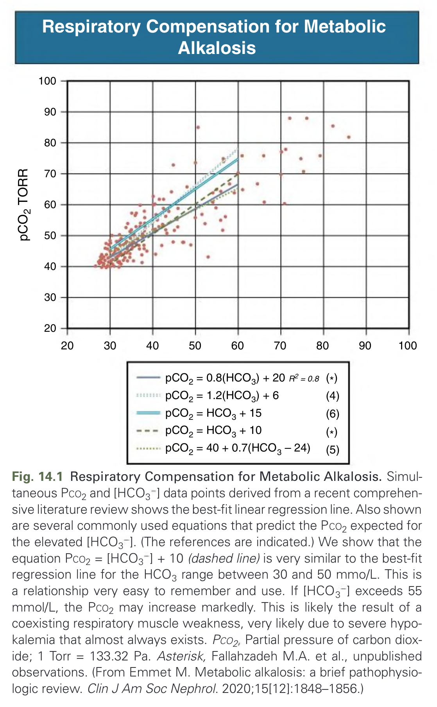
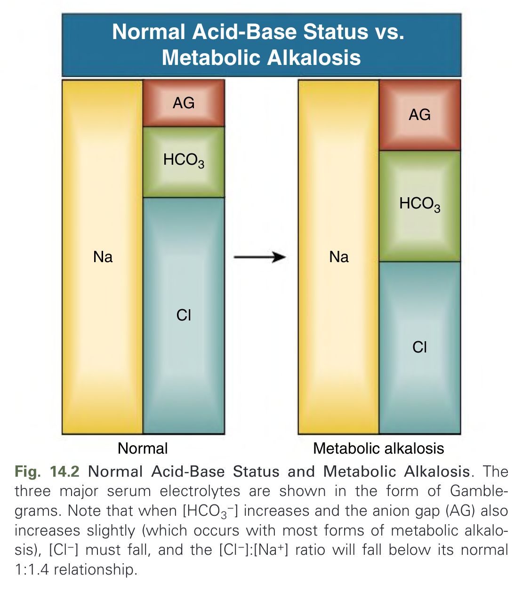
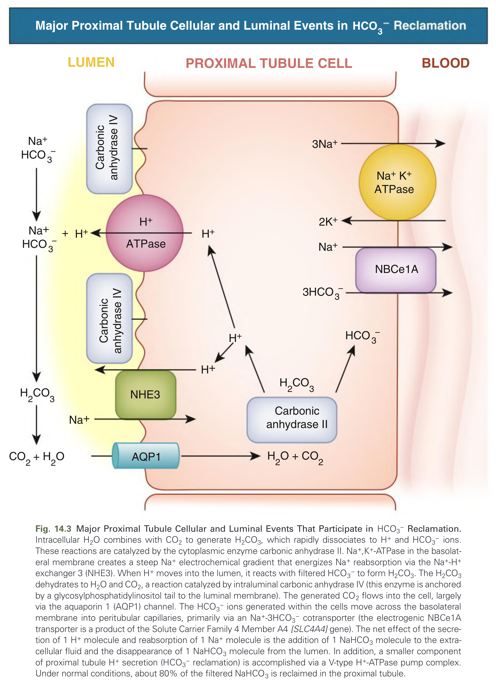
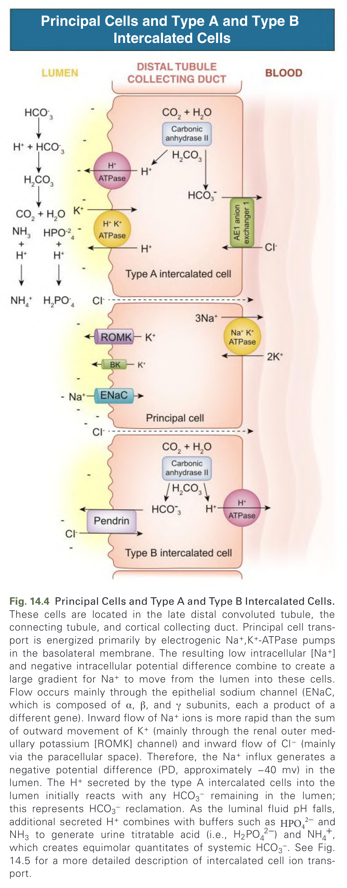
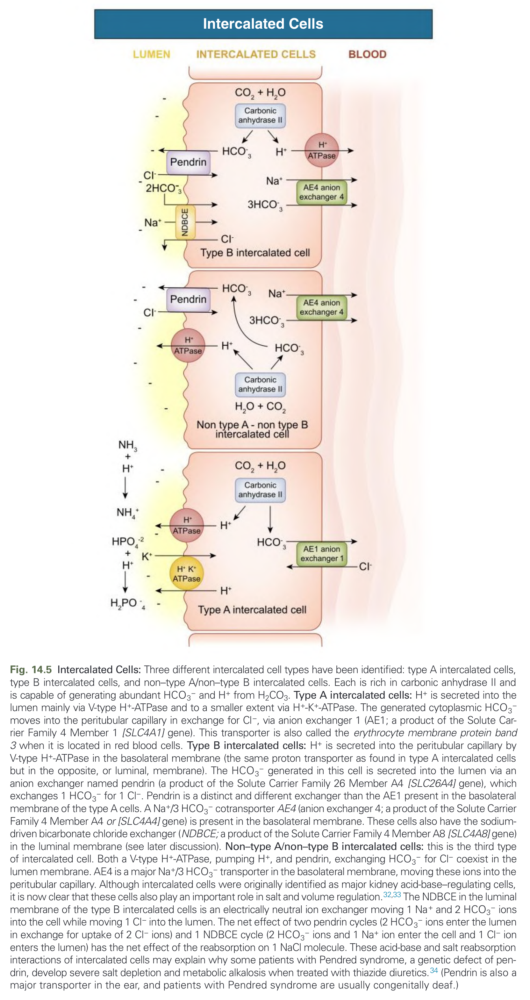
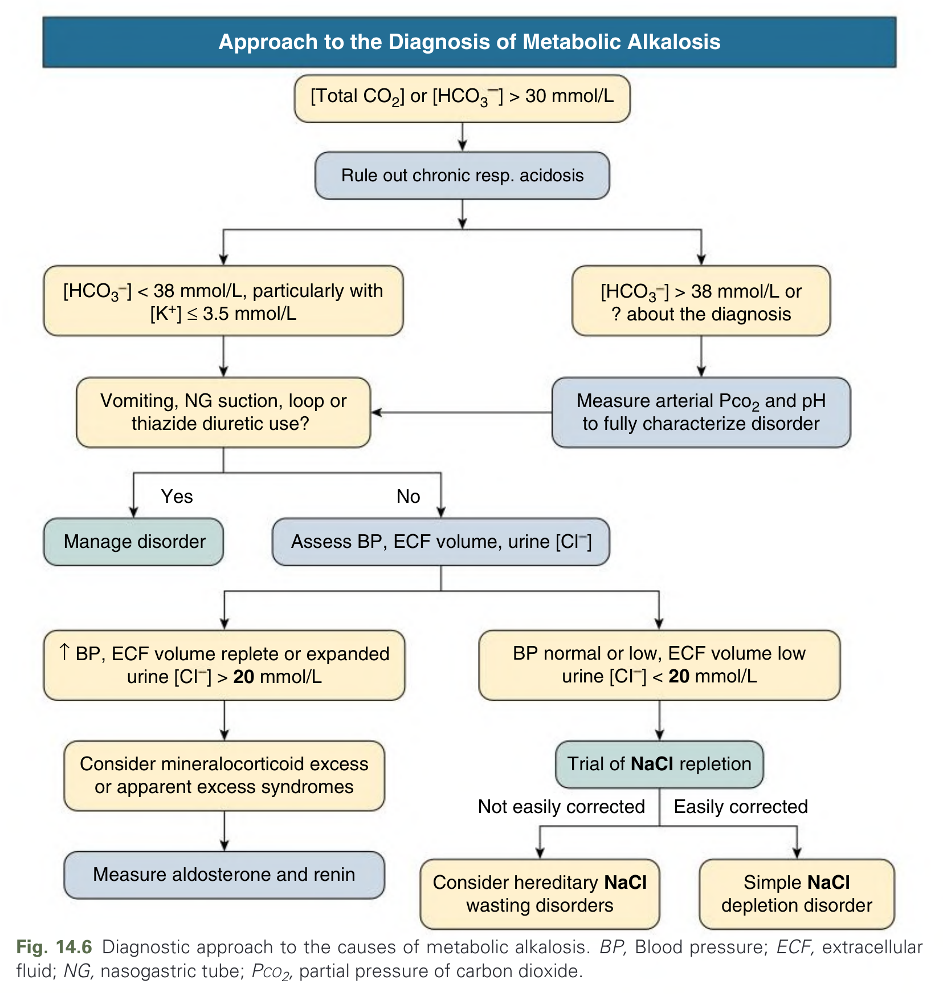
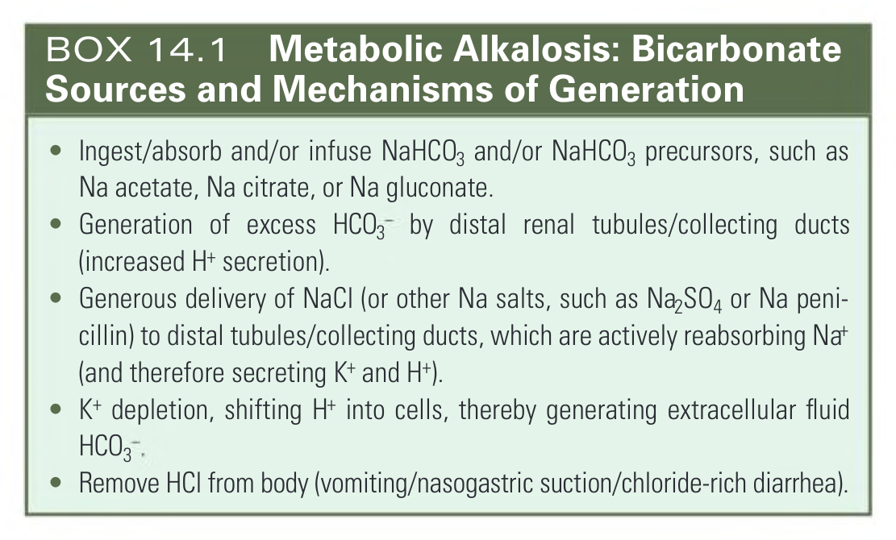
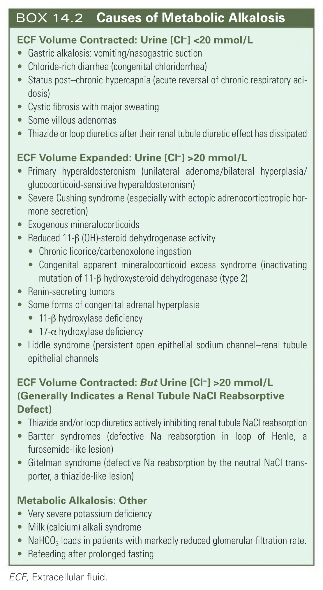
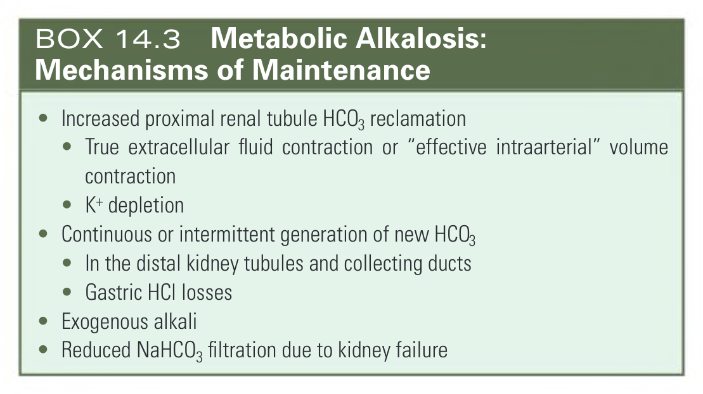

# 014. Metabolic Alkalosis - Figures and Tables Index

This document lists all figures, tables and boxes extracted from `014. Metabolic Alkalosis.pdf`.

## Table of Contents
- [Figures](#figures)
- [Tables](#tables)
- [Boxes](#boxes)

---

## Figures

### Fig_14_1



Fig. 14.1 Respiratory Compensation for Metabolic Alkalosis. Simultaneous Pco2 and [HCO3 ] data points derived from a recent comprehensive literature review shows the best-fit linear regression line. Also shown are several commonly used equations that predict the Pco2 expected for the elevated [HCO3 ]. (The references are indicated.) We show that the equation Pco2 = [HCO3 ] + 10 (dashed line) is very similar to the best-fit regression line for the HCO3 range between 30 and 50 mmo/L. This is a relationship very easy to remember and use. If [HCO3 ] exceeds 55 mmol/L, the Pco2 may increase markedly. This is likely the result of a coexisting respiratory muscle weakness, very likely due to severe hypokalemia that almost always exists. Pco2 Partial pressure of carbon dioxide; 1 Torr = 133.32 Pa. Asterisk, Fallahzadeh M.A. et al., unpublished observations. (From Emmet M. Metabolic alkalosis: a brief pathophysiologic review. Clin J Am Soc Nephrol. 2020;15[12]:1848–1856.)

---

### Fig_14_2



Fig. 14.2 Normal Acid-Base Status and Metabolic Alkalosis. The three major serum electrolytes are shown in the form of Gamblegrams. Note that when [HCO3−] increases and the anion gap (AG) also increases slightly (which occurs with most forms of metabolic alkalosis), [Cl−] must fall, and the [Cl−]:[Na+] ratio will fall below its normal 1:1.4 relationship.

---

### Fig_14_3



Fig. 14.3 Major Proximal Tubule Cellular and Luminal Events That Participate in HCO3− Reclamation. Intracellular H2O combines with CO2 to generate H2CO3, which rapidly dissociates to H+ and HCO3− ions. These reactions are catalyzed by the cytoplasmic enzyme carbonic anhydrase II. Na+,K+-ATPase in the basolateral membrane creates a steep Na+ electrochemical gradient that energizes Na+ reabsorption via the Na+-H+ exchanger 3 (NHE3). When H+ moves into the lumen, it reacts with filtered HCO3− to form H2CO3. The H2CO3 dehydrates to H2O and CO2, a reaction catalyzed by intraluminal carbonic anhydrase IV (this enzyme is anchored by a glycosylphosphatidylinositol tail to the luminal membrane). The generated CO2 flows into the cell, largely via the aquaporin 1 (AQP1) channel. The HCO3− ions generated within the cells move across the basolateral membrane into peritubular capillaries, primarily via an Na+-3HCO3− cotransporter (the electrogenic NBCe1A transporter is a product of the Solute Carrier Family 4 Member A4 [SLC4A4] gene). The net effect of the secretion of 1 H+ molecule and reabsorption of 1 Na+ molecule is the addition of 1 NaHCO3 molecule to the extracellular fluid and the disappearance of 1 NaHCO3 molecule from the lumen. In addition, a smaller component of proximal tubule H+ secretion (HCO3− reclamation) is accomplished via a V-type H+-ATPase pump complex. Under normal conditions, about 80% of the filtered NaHCO3 is reclaimed in the proximal tubule.

---

### Fig_14_4



Fig. 14.4 Principal Cells and Type A and Type B Intercalated Cells. These cells are located in the late distal convoluted tubule, the connecting tubule, and cortical collecting duct. Principal cell transport is energized primarily by electrogenic Na+,K+-ATPase pumps in the basolateral membrane. The resulting low intracellular [Na+] and negative intracellular potential difference combine to create a large gradient for Na+ to move from the lumen into these cells. Flow occurs mainly through the epithelial sodium channel (ENaC, which is composed of α, β, and γ subunits, each a product of a different gene). Inward flow of Na+ ions is more rapid than the sum of outward movement of K+ (mainly through the renal outer medullary potassium [ROMK] channel) and inward flow of Cl (mainly via the paracellular space). Therefore, the Na+ influx generates a negative potential difference (PD, approximately −40 mv) in the lumen. The H+ secreted by the type A intercalated cells into the lumen initially reacts with any HCO3 remaining in the lumen; this represents HCO3 reclamation. As the luminal fluid pH falls, additional secreted H+ combines with buffers such as HPO4 2− and NH3 to generate urine titratable acid (i.e., H2PO4 −) and NH4+, which creates equimolar quantitates of systemic HCO3. See Fig. 14.5 for a more detailed description of intercalated cell ion transport.

---

### Fig_14_5



Fig. 14.5 Intercalated Cells: Three different intercalated cell types have been identified: type A intercalated cells, type B intercalated cells, and non–type A/non–type B intercalated cells. Each is rich in carbonic anhydrase II and is capable of generating abundant HCO3− and H+ from H2CO3. Type A intercalated cells: H+ is secreted into the lumen mainly via V-type H+-ATPase and to a smaller extent via H+-K+-ATPase. The generated cytoplasmic HCO3− moves into the peritubular capillary in exchange for Cl−, via anion exchanger 1 (AE1; a product of the Solute Carrier Family 4 Member 1 [SLC4A1] gene). This transporter is also called the erythrocyte membrane protein band 3 when it is located in red blood cells. Type B intercalated cells: H+ is secreted into the peritubular capillary by V-type H+-ATPase in the basolateral membrane (the same proton transporter as found in type A intercalated cells but in the opposite, or luminal, membrane). The HCO3− generated in this cell is secreted into the lumen via an anion exchanger named pendrin (a product of the Solute Carrier Family 26 Member A4 [SLC26A4] gene), which exchanges 1 HCO3− for 1 Cl−. Pendrin is a distinct and different exchanger than the AE1 present in the basolateral membrane of the type A cells. A Na+/3 HCO3− cotransporter AE4 (anion exchanger 4; a product of the Solute Carrier Family 4 Member A4 or [SLC4A4] gene) is present in the basolateral membrane. These cells also have the sodium-driven bicarbonate chloride exchanger (NDBCE; a product of the Solute Carrier Family 4 Member A8 [SLC4A8] gene) in the luminal membrane (see later discussion). Non–type A/non–type B intercalated cells: this is the third type of intercalated cell. Both a V-type H+-ATPase, pumping H+, and pendrin, exchanging HCO3− for Cl− coexist in the lumen membrane. AE4 is a major Na+/3 HCO3− transporter in the basolateral membrane, moving these ions into the peritubular capillary. Although intercalated cells were originally identified as major kidney acid-base–regulating cells, it is now clear that these cells also play an important role in salt and volume regulation.32,33 The NDBCE in the luminal membrane of the type B intercalated cells is an electrically neutral ion exchanger moving 1 Na+ and 2 HCO3− ions into the cell while moving 1 Cl− into the lumen. The net effect of two pendrin cycles (2 HCO3− ions enter the lumen in exchange for uptake of 2 Cl− ions) and 1 NDBCE cycle (2 HCO3− ions and 1 Na+ ion enter the cell and 1 Cl− ion enters the lumen) has the net effect of the reabsorption on 1 NaCl molecule. These acid-base and salt reabsorption interactions of intercalated cells may explain why some patients with Pendred syndrome, a genetic defect of pendrin, develop severe salt depletion and metabolic alkalosis when treated with thiazide diuretics.34 (Pendrin is also a major transporter in the ear, and patients with Pendred syndrome are usually congenitally deaf.)

---

### Fig_14_6



Fig. 14.6 Diagnostic approach to the causes of metabolic alkalosis. BP, Blood pressure; ECF, extracellular fluid; NG, nasogastric tube; Pco2, partial pressure of carbon dioxide.

---

## Tables

*No tables resolved for this chapter.*

## Boxes

### Box_14_1



#### Box Text

```markdown
* Ingest/absorb and/or infuse NaHCO3 and/or NaHCO3 precursors, such as Na acetate, Na citrate, or Na gluconate.
* Generation of excess HCO3 by distal renal tubules/collecting ducts (increased H+ secretion).
* Generous delivery of NaCl (or other Na salts, such as Na2SO4 or Na penicillin) to distal tubules/collecting ducts, which are actively reabsorbing Nat (and therefore secreting K+ and H+).
* K+ depletion, shifting H+ into cells, thereby generating extracellular fluid HCO3
* Remove HCI from body (vomiting/nasogastric suction/chloride-rich diarrhea).
```

BOX 14.1 Metabolic Alkalosis: Bicarbonate Sources and Mechanisms of Generation

---

### Box_14_2



#### Box Text

```markdown
**ECF Volume Contracted: Urine [Cl-] <20 mmol/L**
* Gastric alkalosis: vomiting/nasogastric suction
* Chloride-rich diarrhea (congenital chloridorrhea)
* Status post-chronic hypercapnia (acute reversal of chronic respiratory acidosis)
* Cystic fibrosis with major sweating
* Some villous adenomas
* Thiazide or loop diuretics after their renal tubule diuretic effect has dissipated

**ECF Volume Expanded: Urine [Cl-] >20 mmol/L**
* Primary hyperaldosteronism (unilateral adenoma/bilateral hyperplasia/glucocorticoid-sensitive hyperaldosteronism)
* Severe Cushing syndrome (especially with ectopic adrenocorticotropic hormone secretion)
* Exogenous mineralocorticoids
* Reduced 11-β (OH)-steroid dehydrogenase activity
* Chronic licorice/carbenoxolone ingestion
* Congenital apparent mineralocorticoid excess syndrome (inactivating mutation of 11-β hydroxysteroid dehydrogenase (type 2)
* Renin-secreting tumors
* Some forms of congenital adrenal hyperplasia
* 11-β hydroxylase deficiency
* 17-a hydroxylase deficiency
* Liddle syndrome (persistent open epithelial sodium channel-renal tubule epithelial channels

**ECF Volume Contracted: But Urine [Cl-] >20 mmol/L (Generally Indicates a Renal Tubule NaCl Reabsorptive Defect)**
* Thiazide and/or loop diuretics actively inhibiting renal tubule NaCl reabsorption
* Bartter syndromes (defective Na reabsorption in loop of Henle, a furosemide-like lesion)
* Gitelman syndrome (defective Na reabsorption by the neutral NaCl transporter, a thiazide-like lesion)

**Metabolic Alkalosis: Other**
* Very severe potassium deficiency
* Milk (calcium) alkali syndrome
* NaHCO3 loads in patients with markedly reduced glomerular filtration rate.
* Refeeding after prolonged fasting
ECF, Extracellular fluid.
```

BOX 14.2 Causes of Metabolic Alkalosis

---

### Box_14_3



#### Box Text

```markdown
* Increased proximal renal tubule HCO3 reclamation
* True extracellular fluid contraction or "effective intraarterial" volume contraction
* K+ depletion
* Continuous or intermittent generation of new HCO3
* In the distal kidney tubules and collecting ducts
* Gastric HCI losses
* Exogenous alkali
* Reduced NaHCO3 filtration due to kidney failure
```

BOX 14.3 Metabolic Alkalosis: Mechanisms of Maintenance

---
