# 015. Respiratory Acidosis, Respiratory Alkalosis, and Mixed Acid-Base Disorders - Figures and Tables Index

This document lists all figures, tables and boxes extracted from `015. Respiratory Acidosis, Respiratory Alkalosis, and Mixed Acid-Base Disorders.pdf`.

## Table of Contents
- [Figures](#figures)
- [Tables](#tables)
- [Boxes](#boxes)

---

## Figures

### Fig_15_1

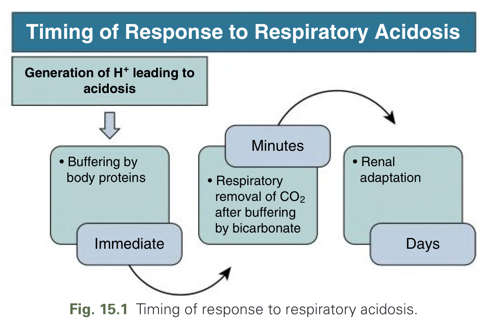

Fig. 15.1 Timing of response to respiratory acidosis.

---

### Fig_15_2

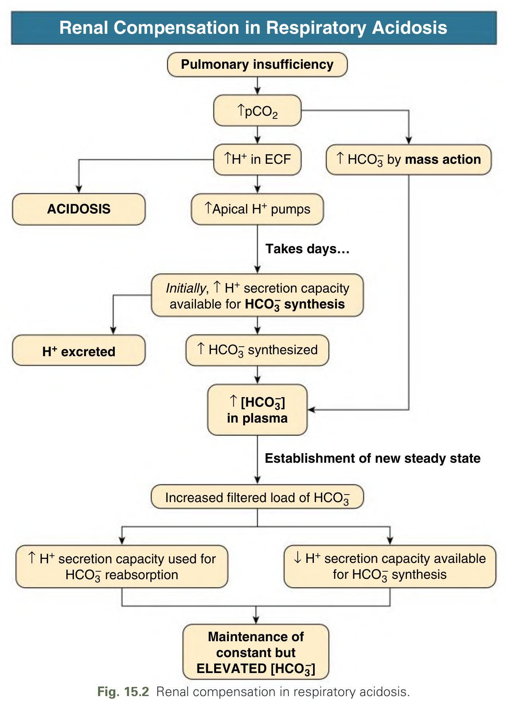

Fig. 15.2 Renal compensation in respiratory acidosis.

---

### Fig_15_3

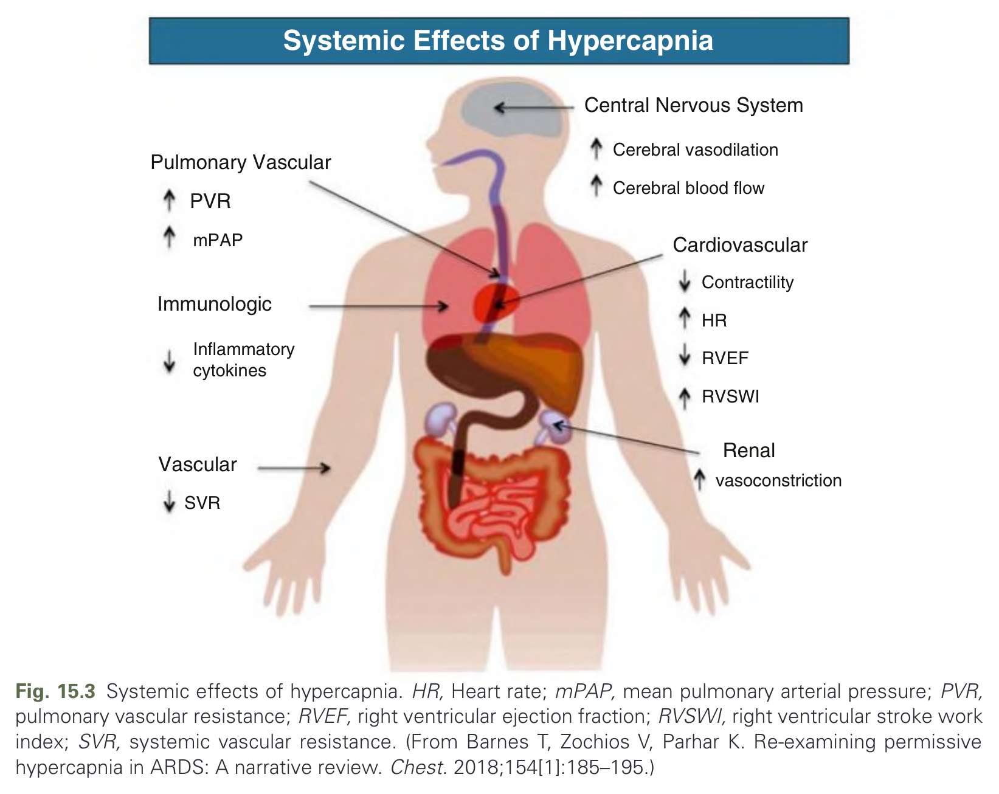

Fig. 15.3 Systemic effects of hypercapnia. HR, Heart rate; mPAP, mean pulmonary arterial pressure; PVR, pulmonary vascular resistance; RVEF, right ventricular ejection fraction; RVSWI, right ventricular stroke work index; SVR, systemic vascular resistance. (From Barnes T, Zochios V, Parhar K. Re-examining permissive hypercapnia in ARDS: A narrative review. Chest. 2018;154[1]:185–195.)

---

### Fig_15_4

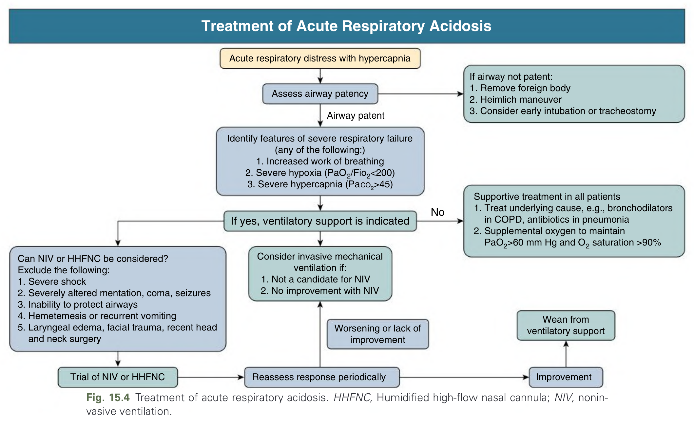

Fig. 15.4 Treatment of acute respiratory acidosis. HHFNC, Humidified high-flow nasal cannula; NIV, noninvasive ventilation.

---

### Fig_15_5

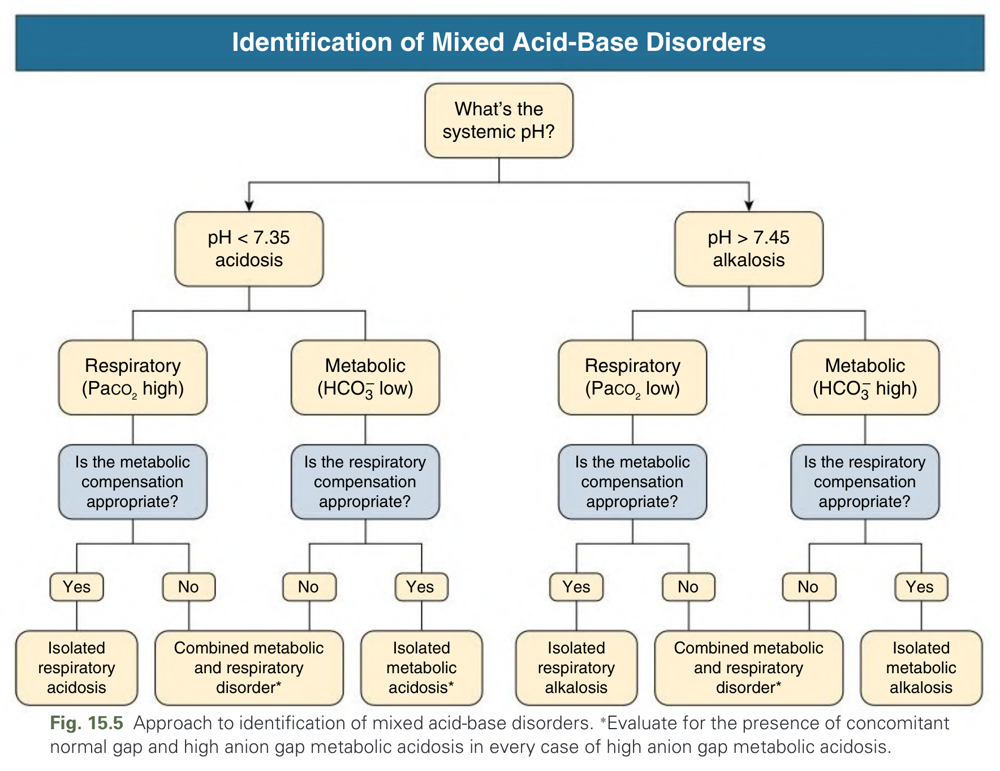

Fig. 15.5 Approach to identification of mixed acid-base disorders. ∗Evaluate for the presence of concomitant normal gap and high anion gap metabolic acidosis in every case of high anion gap metabolic acidosis.

---

### Fig_15_6

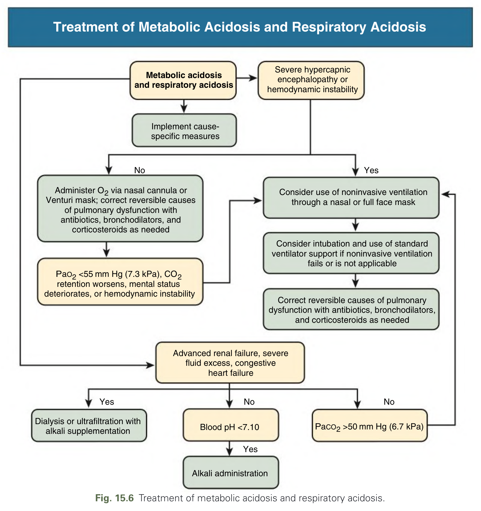

Fig. 15.6 Treatment of metabolic acidosis and respiratory acidosis.

---

### Fig_15_7

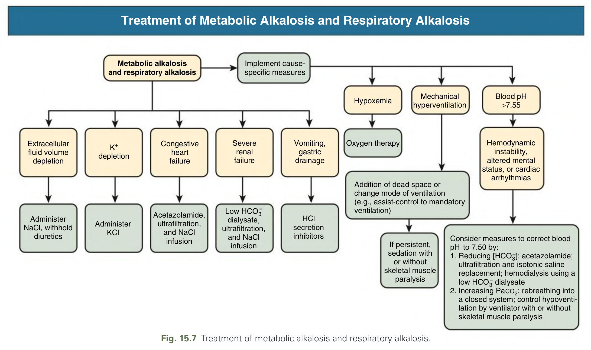

Fig. 15.7 Treatment of metabolic alkalosis and respiratory alkalosis.

---

### Fig_15_8

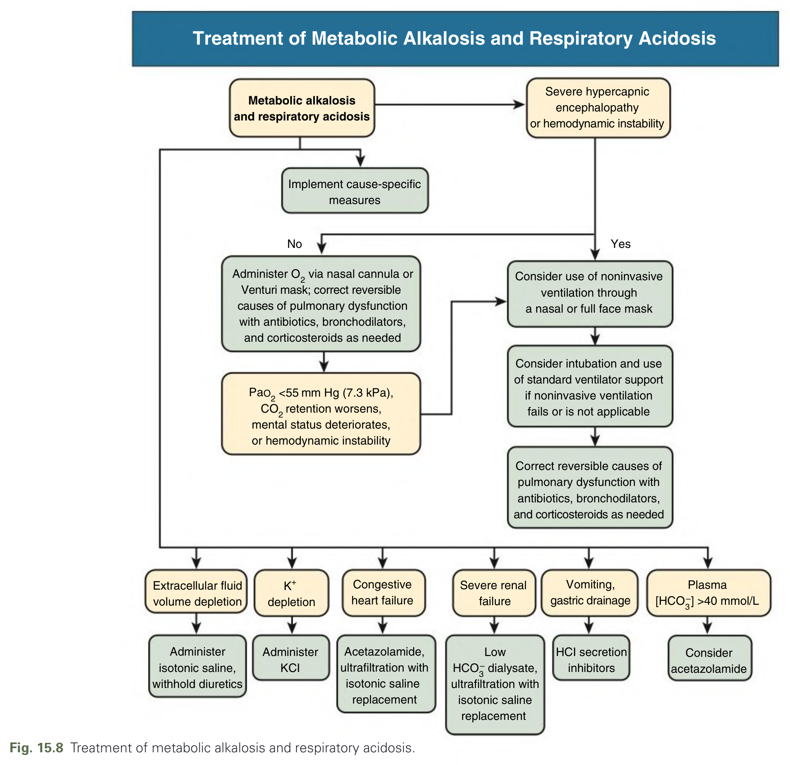

Fig. 15.8 Treatment of metabolic alkalosis and respiratory acidosis.

---

### Fig_15_9

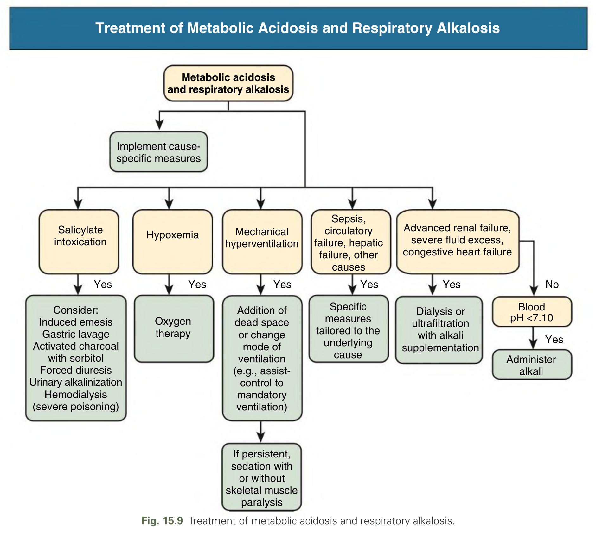

Fig. 15.9 Treatment of metabolic acidosis and respiratory alkalosis.

---

## Tables

### Table_15_1

#### Table Image

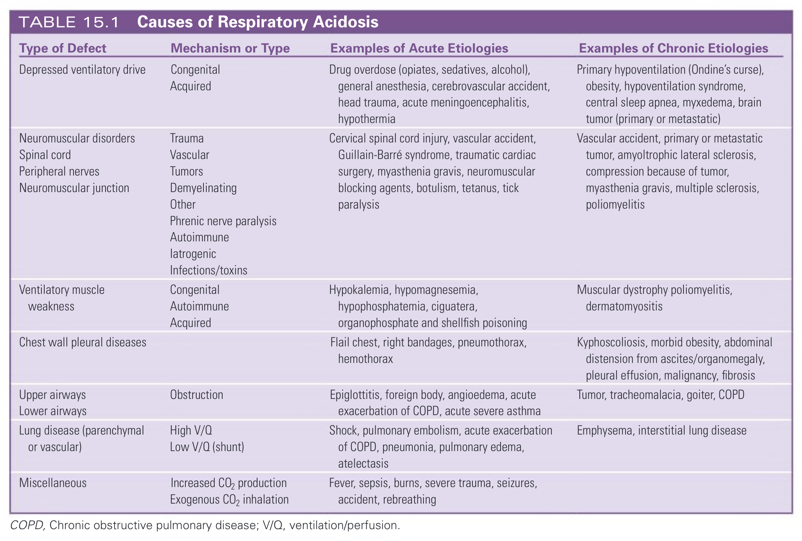

#### Table Data (CSV: [Table_15_1.csv](Table_15_1.csv))

```markdown
| Type of Defect | Mechanism or Type | Examples of Acute Etiologies | Examples of Chronic Etiologies |
| :--- | :--- | :--- | :--- |
| Depressed ventilatory drive | Congenital Acquired | Drug overdose (opiates, sedatives, alcohol), general anesthesia, cerebrovascular accident, head trauma, acute meningoencephalitis, hypothermia | Primary hypoventilation (Ondine's curse), obesity, hypoventilation syndrome, central sleep apnea, myxedema, brain tumor (primary or metastatic) |
| Neuromuscular disorders | Trauma | Cervical spinal cord injury, vascular accident, Guillain-Barré syndrome, traumatic cardiac surgery, myasthenia gravis, neuromuscular blocking agents, botulism, tetanus, tick paralysis | Vascular accident, primary or metastatic tumor, amyotrophic lateral sclerosis, compression because of tumor, myasthenia gravis, multiple sclerosis, poliomyelitis |
| Spinal cord | Vascular | | |
| Peripheral nerves | Tumors | | |
| Neuromuscular junction | Demyelinating Other Phrenic nerve paralysis Autoimmune latrogenic Infections/toxins | | |
| Ventilatory muscle weakness | Congenital Autoimmune Acquired | Hypokalemia, hypomagnesemia, hypophosphatemia, ciguatera, organophosphate and shellfish poisoning | Muscular dystrophy poliomyelitis, dermatomyositis |
| Chest wall pleural diseases | | Flail chest, right bandages, pneumothorax, hemothorax | Kyphoscoliosis, morbid obesity, abdominal distension from ascites/organomegaly, pleural effusion, malignancy, fibrosis |
| Upper airways | Obstruction | Epiglottitis, foreign body, angioedema, acute exacerbation of COPD, acute severe asthma | Tumor, tracheomalacia, goiter, COPD |
| Lower airways | | | |
| Lung disease (parenchymal or vascular) | High V/Q Low V/Q (shunt) | Shock, pulmonary embolism, acute exacerbation of COPD, pneumonia, pulmonary edema, atelectasis | Emphysema, interstitial lung disease |
| Miscellaneous | Increased CO2 production Exogenous CO2 inhalation | Fever, sepsis, burns, severe trauma, seizures, accident, rebreathing | |
COPD, Chronic obstructive pulmonary disease; V/Q, ventilation/perfusion.
```

TABLE 15.1  Causes of Respiratory Acidosis

---

### Table_15_2

#### Table Image

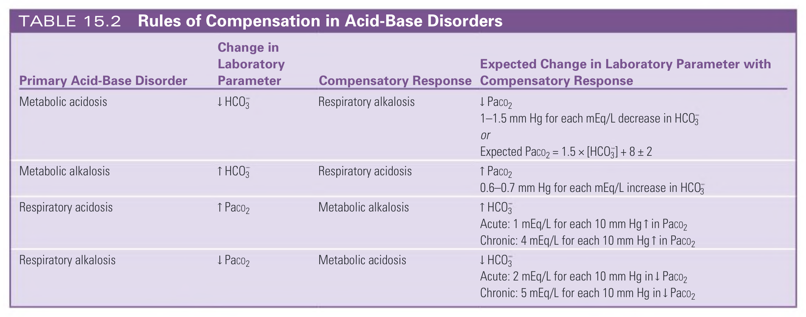

#### Table Data (CSV: [Table_15_2.csv](Table_15_2.csv))

```markdown
| Primary Acid-Base Disorder | Change in Laboratory Parameter | Compensatory Response | Expected Change in Laboratory Parameter with Compensatory Response |
| :--- | :--- | :--- | :--- |
| Metabolic acidosis | ↓ HCO3 | Respiratory alkalosis | ↓ Paco2<br>1-1.5 mm Hg for each mEq/L decrease in HCO3 or<br>Expected Paco2 = 1.5 × [HCO3] + 8 ± 2 |
| Metabolic alkalosis | ↑ HCO3 | Respiratory acidosis | ↑ Paco2<br>0.6-0.7 mm Hg for each mEq/L increase in HCO3 |
| Respiratory acidosis | ↑ Paco2 | Metabolic alkalosis | ↑ HCO3<br>Acute: 1 mEq/L for each 10 mm Hg ↑ in PacO2<br>Chronic: 4 mEq/L for each 10 mm Hg ↑ in PacO2 |
| Respiratory alkalosis | ↓ Paco2 | Metabolic acidosis | ↓ HCO3<br>Acute: 2 mEq/L for each 10 mm Hg in ↓ Paco2<br>Chronic: 5 mEq/L for each 10 mm Hg in ↓ Paco2 |
```

TABLE 15.2  Rules of Compensation in Acid-Base Disorders

---

### Table_15_3

#### Table Image

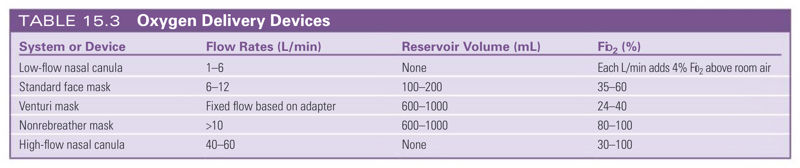

#### Table Data (CSV: [Table_15_3.csv](Table_15_3.csv))

```markdown
| System or Device | Flow Rates (L/min) | Reservoir Volume (mL) | Fib₂ (%) |
| :--- | :--- | :--- | :--- |
| Low-flow nasal canula | 1-6 | None | Each L/min adds 4% Fo₂ above room air |
| Standard face mask | 6-12 | 100-200 | 35-60 |
| Venturi mask | Fixed flow based on adapter | 600-1000 | 24-40 |
| Nonrebreather mask | >10 | 600-1000 | 80-100 |
| High-flow nasal canula | 40-60 | None | 30-100 |
```

TABLE 15.3  Oxygen Delivery Devices

---

### Table_15_4

#### Table Image

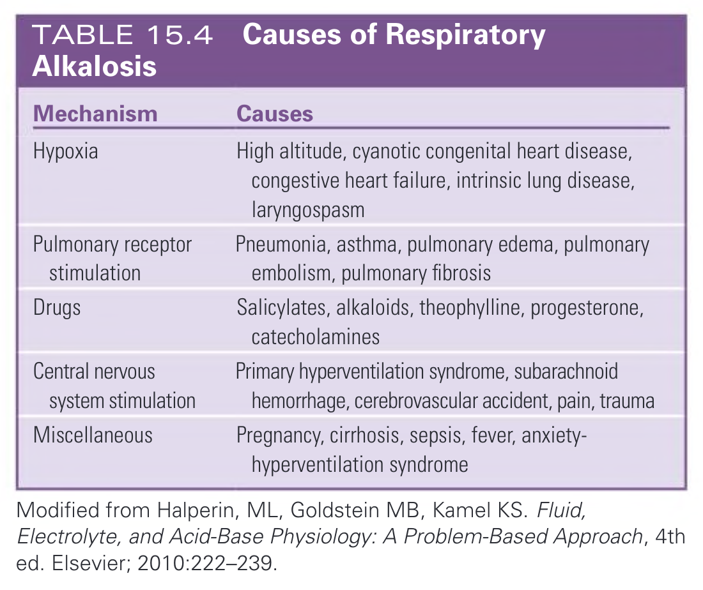

#### Table Data (CSV: [Table_15_4.csv](Table_15_4.csv))

```markdown
| Mechanism | Causes |
| :--- | :--- |
| Hypoxia | High altitude, cyanotic congenital heart disease, congestive heart failure, intrinsic lung disease, laryngospasm |
| Pulmonary receptor stimulation | Pneumonia, asthma, pulmonary edema, pulmonary embolism, pulmonary fibrosis |
| Drugs | Salicylates, alkaloids, theophylline, progesterone, catecholamines |
| Central nervous system stimulation | Primary hyperventilation syndrome, subarachnoid hemorrhage, cerebrovascular accident, pain, trauma |
| Miscellaneous | Pregnancy, cirrhosis, sepsis, fever, anxiety-hyperventilation syndrome |
Modified from Halperin, ML, Goldstein MB, Kamel KS. Fluid, Electrolyte, and Acid-Base Physiology: A Problem-Based Approach, 4th ed. Elsevier; 2010:222-239.
```

TABLE 15.4  Causes of Respiratory Alkalosis

---

## Boxes

### Box_15_1

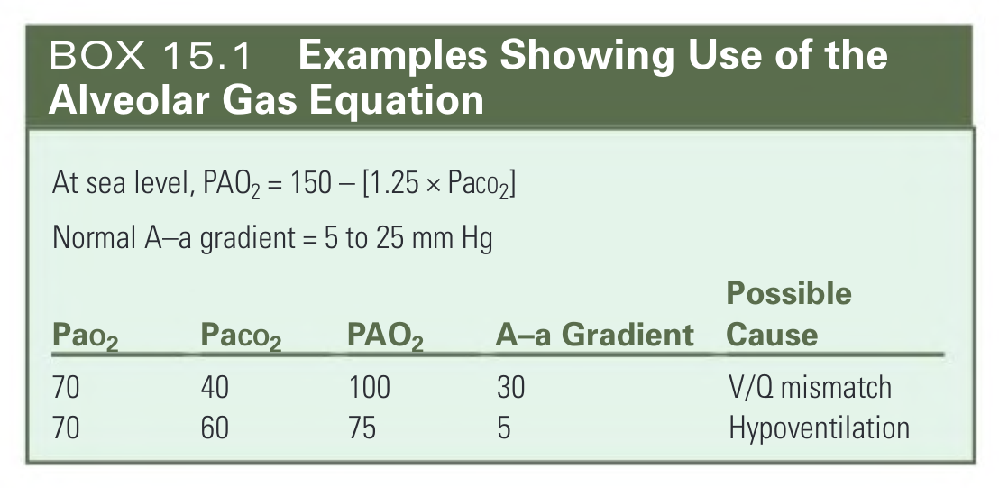

#### Box Text

```markdown
At sea level, PAO2 = 150 - [1.25 x Paco2]
Normal A-a gradient = 5 to 25 mm Hg

| Pao2 | Paco2 | PAO2 | A-a Gradient | Possible Cause |
| :--- | :--- | :--- | :--- | :--- |
| 70 | 40 | 100 | 30 | V/Q mismatch |
| 70 | 60 | 75 | 5 | Hypoventilation |
```

BOX 15.1  Examples Showing Use of the Alveolar Gas Equation

---
