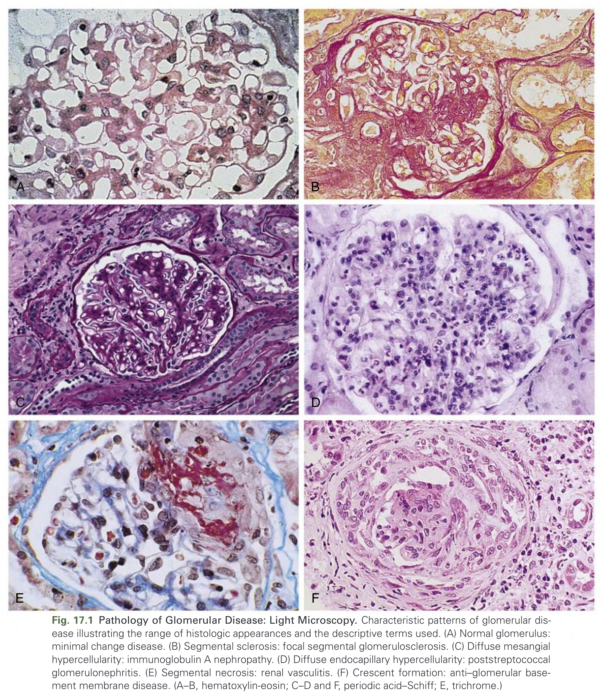
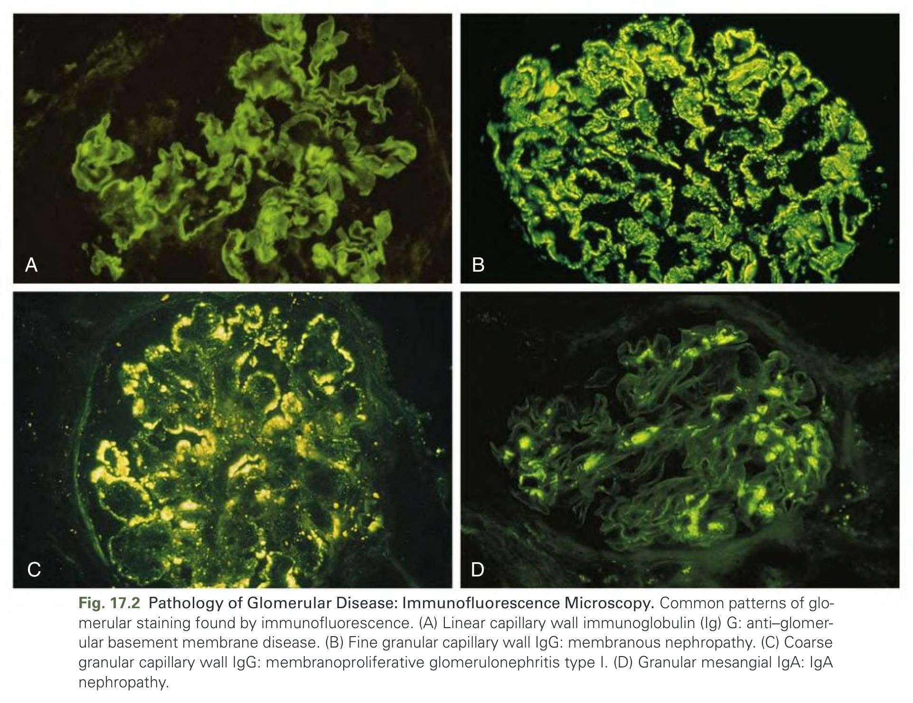
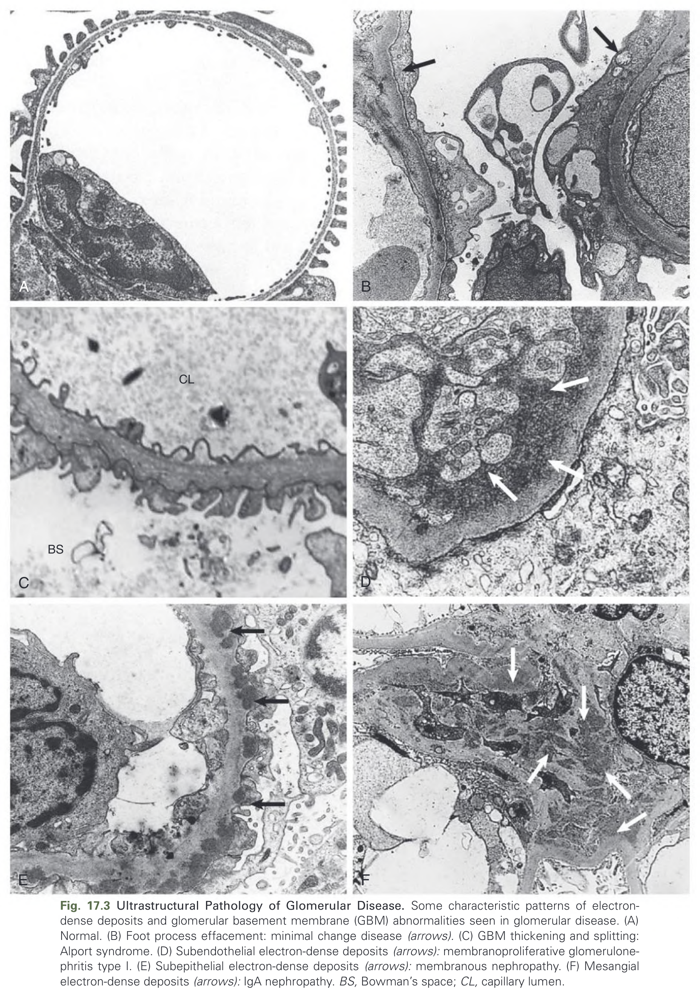
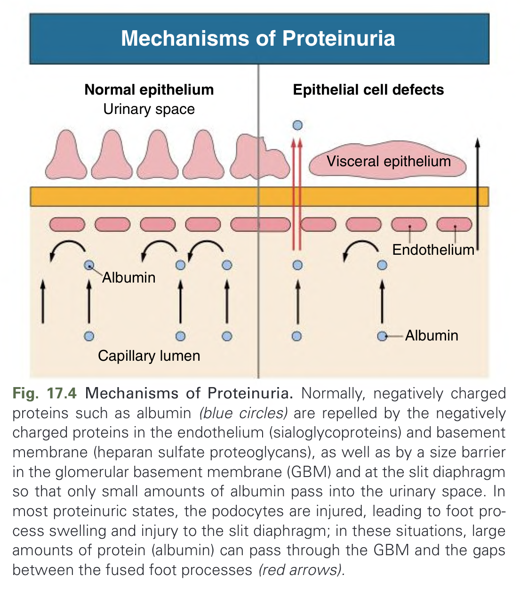
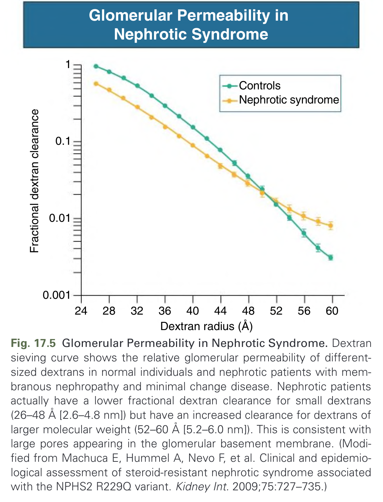
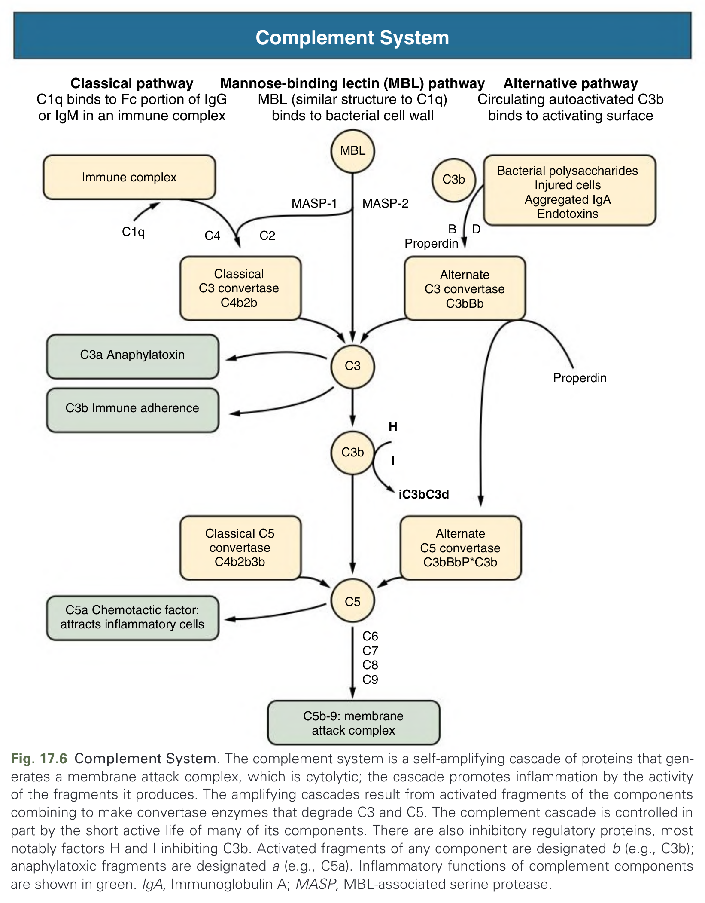
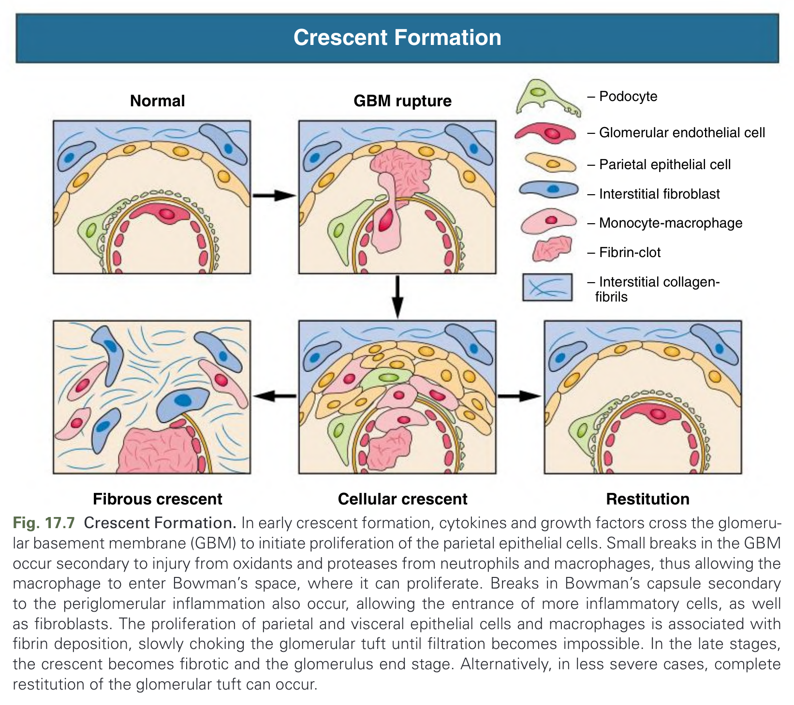
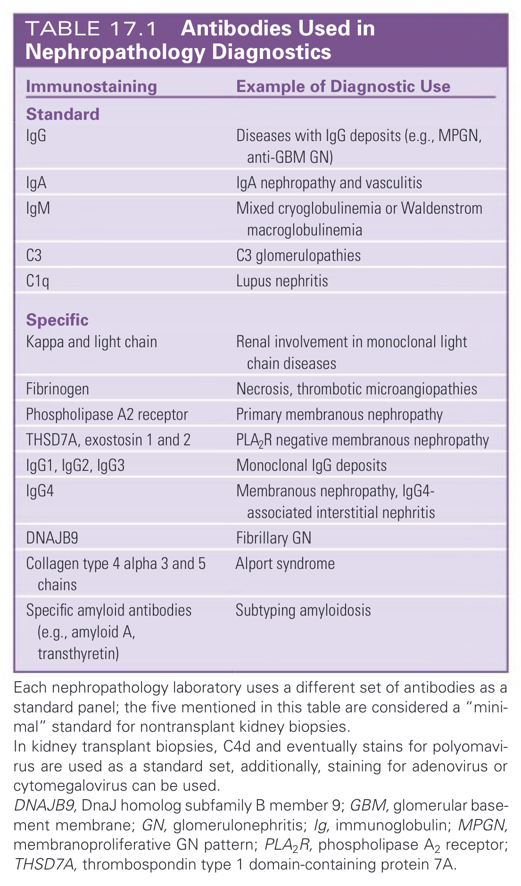
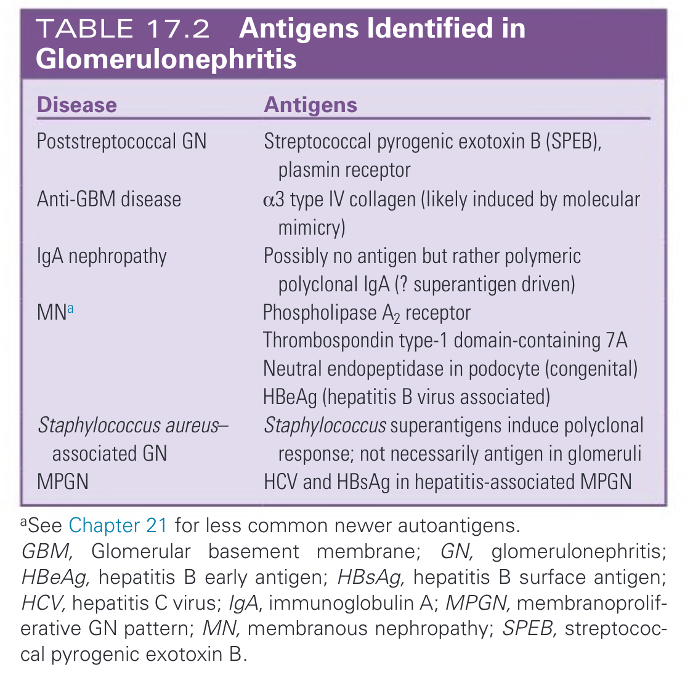

# 017. Introduction to Glomerular Disease- Histologic Classification and Pathogenesis - Figures and Tables Index

This document lists all figures, tables and boxes extracted from `017. Introduction to Glomerular Disease- Histologic Classification and Pathogenesis.pdf`.

## Table of Contents
- [Figures](#figures)
- [Tables](#tables)
- [Boxes](#boxes)

---

## Figures

### Fig_17_1



Fig. 17.1 Pathology of Glomerular Disease: Light Microscopy. Characteristic patterns of glomerular disease illustrating the range of histologic appearances and the descriptive terms used. (A) Normal glomerulus: minimal change disease. (B) Segmental sclerosis: focal segmental glomerulosclerosis. (C) Diffuse mesangial hypercellularity: immunoglobulin A nephropathy. (D) Diffuse endocapillary hypercellularity: poststreptococcal glomerulonephritis. (E) Segmental necrosis: renal vasculitis. (F) Crescent formation: anti-glomerular basement membrane disease. (A-B, hematoxylin-eosin; C-D and F, periodic acid-Schiff; E, trichrome.)

---

### Fig_17_2



Fig. 17.2 Pathology of Glomerular Disease: Immunofluorescence Microscopy. Common patterns of glomerular staining found by immunofluorescence. (A) Linear capillary wall immunoglobulin (Ig) G: anti-glomerular basement membrane disease. (B) Fine granular capillary wall IgG: membranous nephropathy. (C) Coarse granular capillary wall IgG: membranoproliferative glomerulonephritis type I. (D) Granular mesangial IgA: IgA nephropathy.

---

### Fig_17_3



Fig. 17.3 Ultrastructural Pathology of Glomerular Disease. Some characteristic patterns of electron-dense deposits and glomerular basement membrane (GBM) abnormalities seen in glomerular disease. (A) Normal. (B) Foot process effacement: minimal change disease (arrows). (C) GBM thickening and splitting: Alport syndrome. (D) Subendothelial electron-dense deposits (arrows): membranoproliferative glomerulonephritis type I. (E) Subepithelial electron-dense deposits (arrows): membranous nephropathy. (F) Mesangial electron-dense deposits (arrows): IgA nephropathy. BS, Bowman's space; CL, capillary lumen.

---

### Fig_17_4



Fig. 17.4 Mechanisms of Proteinuria. Normally, negatively charged proteins such as albumin (blue circles) are repelled by the negatively charged proteins in the endothelium (sialoglycoproteins) and basement membrane (heparan sulfate proteoglycans), as well as by a size barrier in the glomerular basement membrane (GBM) and at the slit diaphragm so that only small amounts of albumin pass into the urinary space. In most proteinuric states, the podocytes are injured, leading to foot process swelling and injury to the slit diaphragm; in these situations, large amounts of protein (albumin) can pass through the GBM and the gaps between the fused foot processes (red arrows).

---

### Fig_17_5



Fig. 17.5 Glomerular Permeability in Nephrotic Syndrome. Dextran sieving curve shows the relative glomerular permeability of different-sized dextrans in normal individuals and nephrotic patients with membranous nephropathy and minimal change disease. Nephrotic patients actually have a lower fractional dextran clearance for small dextrans (26-48 Å [2.6-4.8 nm]) but have an increased clearance for dextrans of larger molecular weight (52-60 Å [5.2-6.0 nm]). This is consistent with large pores appearing in the glomerular basement membrane. (Modified from Machuca E, Hummel A, Nevo F, et al. Clinical and epidemiological assessment of steroid-resistant nephrotic syndrome associated with the NPHS2 R229Q variant. Kidney Int. 2009;75:727-735.)

---

### Fig_17_6



Fig. 17.6 Complement System. The complement system is a self-amplifying cascade of proteins that generates a membrane attack complex, which is cytolytic; the cascade promotes inflammation by the activity of the fragments it produces. The amplifying cascades result from activated fragments of the components combining to make convertase enzymes that degrade C3 and C5. The complement cascade is controlled in part by the short active life of many of its components. There are also inhibitory regulatory proteins, most notably factors H and I inhibiting C3b. Activated fragments of any component are designated b (e.g., C3b); anaphylatoxic fragments are designated a (e.g., C5a). Inflammatory functions of complement components are shown in green. IgA, Immunoglobulin A; MASP, MBL-associated serine protease.

---

### Fig_17_7



Fig. 17.7 Crescent Formation. In early crescent formation, cytokines and growth factors cross the glomerular basement membrane (GBM) to initiate proliferation of the parietal epithelial cells. Small breaks in the GBM occur secondary to injury from oxidants and proteases from neutrophils and macrophages, thus allowing the macrophage to enter Bowman's space, where it can proliferate. Breaks in Bowman's capsule secondary to the periglomerular inflammation also occur, allowing the entrance of more inflammatory cells, as well as fibroblasts. The proliferation of parietal and visceral epithelial cells and macrophages is associated with fibrin deposition, slowly choking the glomerular tuft until filtration becomes impossible. In the late stages, the crescent becomes fibrotic and the glomerulus end stage. Alternatively, in less severe cases, complete restitution of the glomerular tuft can occur.

---

## Tables

### Table_17_1

#### Table Image



#### Table Data (CSV: [Table_17_1.csv](Table_17_1.csv))

```markdown
| Immunostaining | Example of Diagnostic Use |
| :--- | :--- |
| **Standard** | |
| IgG | Diseases with IgG deposits (e.g., MPGN, anti-GBM GN) |
| IgA | IgA nephropathy and vasculitis |
| IgM | Mixed cryoglobulinemia or Waldenstrom macroglobulinemia |
| C3 | C3 glomerulopathies |
| C1q | Lupus nephritis |
| **Specific** | |
| Kappa and light chain | Renal involvement in monoclonal light chain diseases |
| Fibrinogen | Necrosis, thrombotic microangiopathies |
| Phospholipase A2 receptor | Primary membranous nephropathy |
| THSD7A, exostosin 1 and 2 | PLA₂R negative membranous nephropathy |
| IgG1, IgG2, IgG3 | Monoclonal IgG deposits |
| IgG4 | Membranous nephropathy, IgG4-associated interstitial nephritis |
| DNAJB9 | Fibrillary GN |
| Collagen type 4 alpha 3 and 5 chains | Alport syndrome |
| Specific amyloid antibodies (e.g., amyloid A, transthyretin) | Subtyping amyloidosis |

Each nephropathology laboratory uses a different set of antibodies as a standard panel; the five mentioned in this table are considered a "minimal" standard for nontransplant kidney biopsies.
In kidney transplant biopsies, C4d and eventually stains for polyomavirus are used as a standard set, additionally, staining for adenovirus or cytomegalovirus can be used.
DNAJB9, DnaJ homolog subfamily B member 9; GBM, glomerular basement membrane; GN, glomerulonephritis; Ig, immunoglobulin; MPGN, membranoproliferative GN pattern; PLA₂R, phospholipase A2 receptor; THSD7A, thrombospondin type 1 domain-containing protein 7A.
```

TABLE 17.1 Antibodies Used in Nephropathology Diagnostics

---

### Table_17_2

#### Table Image



#### Table Data (CSV: [Table_17_2.csv](Table_17_2.csv))

```markdown
| Disease | Antigens |
| :--- | :--- |
| Poststreptococcal GN | Streptococcal pyrogenic exotoxin B (SPEB), plasmin receptor |
| Anti-GBM disease | α3 type IV collagen (likely induced by molecular mimicry) |
| IgA nephropathy | Possibly no antigen but rather polymeric polyclonal IgA (? superantigen driven) |
| MNa | Phospholipase A2 receptor<br>Thrombospondin type-1 domain-containing 7A<br>Neutral endopeptidase in podocyte (congenital)<br>HBeAg (hepatitis B virus associated) |
| Staphylococcus aureus-associated GN | Staphylococcus superantigens induce polyclonal response; not necessarily antigen in glomeruli |
| MPGN | HCV and HBsAg in hepatitis-associated MPGN |

aSee Chapter 21 for less common newer autoantigens.
GBM, Glomerular basement membrane; GN, glomerulonephritis; HBeAg, hepatitis B early antigen; HBsAg, hepatitis B surface antigen; HCV, hepatitis C virus; IgA, immunoglobulin A; MPGN, membranoproliferative GN pattern; MN, membranous nephropathy; SPEB, streptococcal pyrogenic exotoxin B.
```

TABLE 17.2 Antigens Identified in Glomerulonephritis

---

## Boxes

*No boxes resolved for this chapter.*
