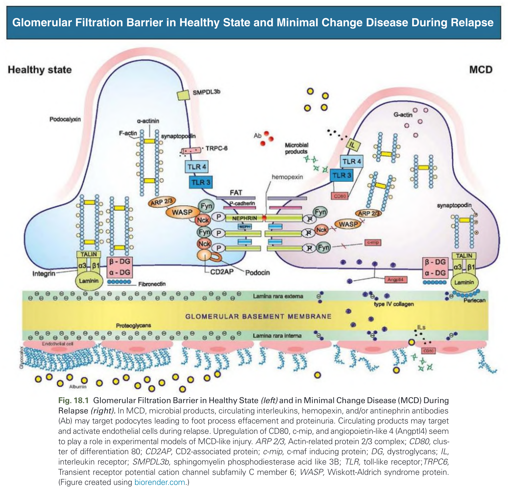
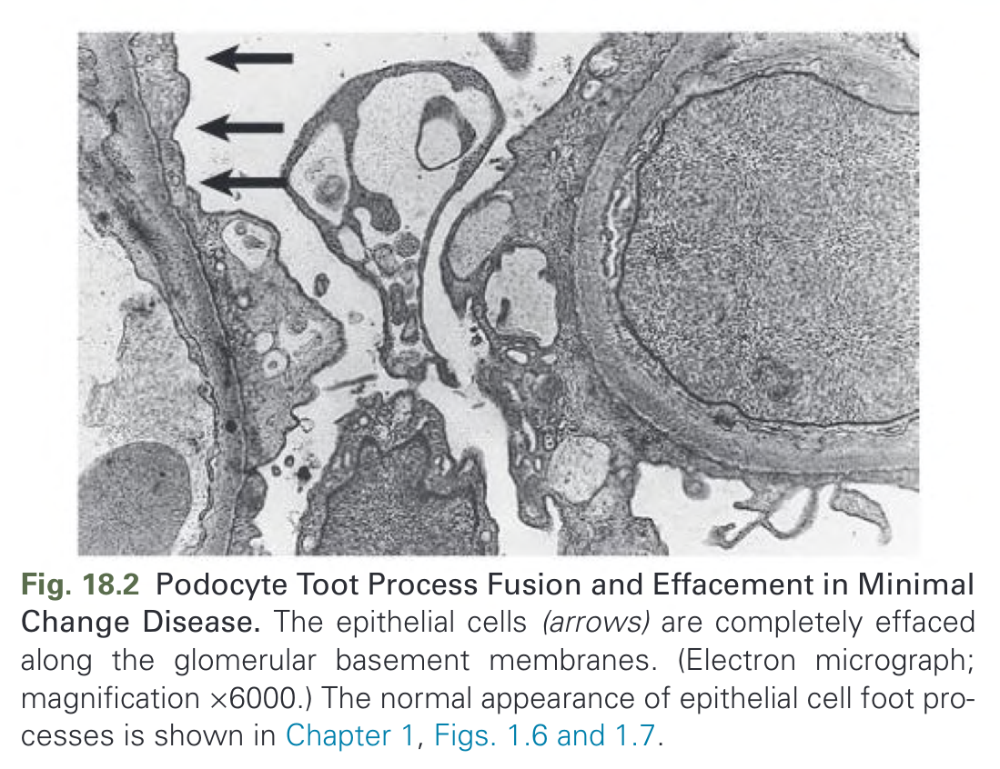
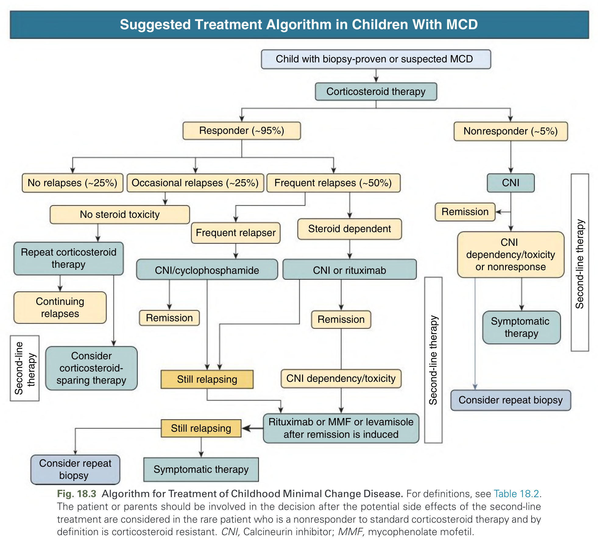
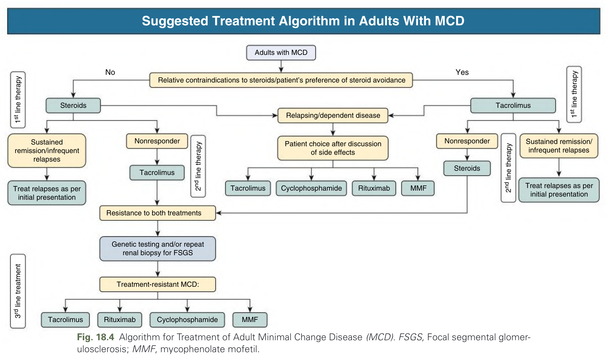
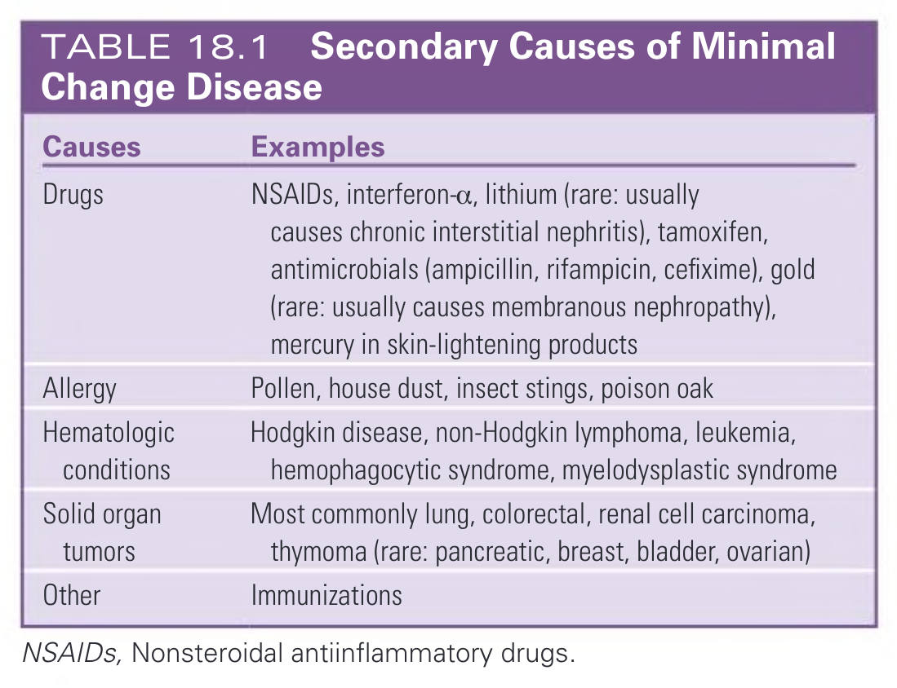
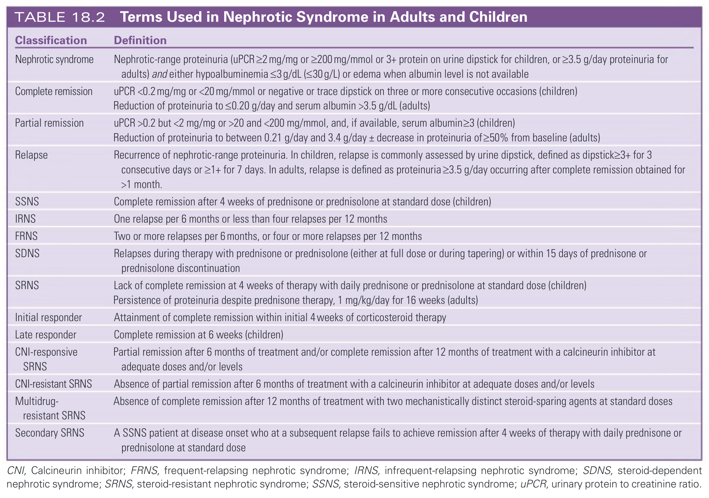

# 018. Minimal Change Disease - Figures and Tables Index

This document lists all figures, tables and boxes extracted from `018. Minimal Change Disease.pdf`.

## Table of Contents
- [Figures](#figures)
- [Tables](#tables)
- [Boxes](#boxes)

---

## Figures

### Fig_18_1



Fig. 18.1 Glomerular Filtration Barrier in Healthy State (left) and in Minimal Change Disease (MCD) During Relapse (right). In MCD, microbial products, circulating interleukins, hemopexin, and/or antinephrin antibodies (Ab) may target podocytes leading to foot process effacement and proteinuria. Circulating products may target and activate endothelial cells during relapse. Upregulation of CD80, c-mip, and angiopoietin-like 4 (Angptl4) seem to play a role in experimental models of MCD-like injury. ARP 2/3, Actin-related protein 2/3 complex; CD80, cluster of differentiation 80; CD2AP, CD2-associated protein; c-mip, c-maf inducing protein; DG, dystroglycans; IL, interleukin receptor; SMPDL3b, sphingomyelin phosphodiesterase acid like 3B; TLR, toll-like receptor; TRPC6, Transient receptor potential cation channel subfamily C member 6; WASP, Wiskott-Aldrich syndrome protein. (Figure created using biorender.com.)

---

### Fig_18_2



Fig. 18.2 Podocyte Toot Process Fusion and Effacement in Minimal Change Disease. The epithelial cells (arrows) are completely effaced along the glomerular basement membranes. (Electron micrograph; magnification x6000.) The normal appearance of epithelial cell foot processes is shown in Chapter 1, Figs. 1.6 and 1.7.

---

### Fig_18_3



Fig. 18.3 Algorithm for Treatment of Childhood Minimal Change Disease. For definitions, see Table 18.2. The patient or parents should be involved in the decision after the potential side effects of the second-line treatment are considered in the rare patient who is a nonresponder to standard corticosteroid therapy and by definition is corticosteroid resistant. CNI, Calcineurin inhibitor; MMF, mycophenolate mofetil.

---

### Fig_18_4



Fig. 18.4 Algorithm for Treatment of Adult Minimal Change Disease (MCD). FSGS, Focal segmental glomer- ulosclerosis; MMF, mycophenolate mofetil.

---

## Tables

### Table_18_1

#### Table Image



#### Table Data (CSV: [Table_18_1.csv](Table_18_1.csv))

```markdown
| Causes | Examples |
| :--- | :--- |
| Drugs | NSAIDs, interferon-a, lithium (rare: usually causes chronic interstitial nephritis), tamoxifen, antimicrobials (ampicillin, rifampicin, cefixime), gold (rare: usually causes membranous nephropathy), mercury in skin-lightening products |
| Allergy | Pollen, house dust, insect stings, poison oak |
| Hematologic conditions | Hodgkin disease, non-Hodgkin lymphoma, leukemia, hemophagocytic syndrome, myelodysplastic syndrome |
| Solid organ tumors | Most commonly lung, colorectal, renal cell carcinoma, thymoma (rare: pancreatic, breast, bladder, ovarian) |
| Other | Immunizations |

NSAIDs, Nonsteroidal antiinflammatory drugs.
```

TABLE 18.1 Secondary Causes of Minimal Change Disease
NSAIDs, Nonsteroidal antiinflammatory drugs.

---

### Table_18_2

#### Table Image



#### Table Data (CSV: [Table_18_2.csv](Table_18_2.csv))

```markdown
| Classification | Definition |
| :--- | :--- |
| Nephrotic syndrome | Nephrotic-range proteinuria (uPCR≥2 mg/mg or ≥200 mg/mmol or 3+ protein on urine dipstick for children, or ≥3.5 g/day proteinuria for adults) and either hypoalbuminemia ≤3 g/dL (≤30 g/L) or edema when albumin level is not available |
| Complete remission | uPCR <0.2 mg/mg or <20 mg/mmol or negative or trace dipstick on three or more consecutive occasions (children)<br>Reduction of proteinuria to ≤0.20 g/day and serum albumin >3.5 g/dL (adults) |
| Partial remission | uPCR >0.2 but <2 mg/mg or >20 and <200 mg/mmol, and, if available, serum albumin≥3 (children)<br>Reduction of proteinuria to between 0.21 g/day and 3.4 g/day + decrease in proteinuria of≥50% from baseline (adults) |
| Relapse | Recurrence of nephrotic-range proteinuria. In children, relapse is commonly assessed by urine dipstick, defined as dipstick≥3+ for 3 consecutive days or ≥1+ for 7 days. In adults, relapse is defined as proteinuria ≥3.5 g/day occurring after complete remission obtained for >1 month. |
| SSNS | Complete remission after 4 weeks of prednisone or prednisolone at standard dose (children) |
| IRNS | One relapse per 6 months or less than four relapses per 12 months |
| FRNS | Two or more relapses per 6 months, or four or more relapses per 12 months |
| SDNS | Relapses during therapy with prednisone or prednisolone (either at full dose or during tapering) or within 15 days of prednisone or prednisolone discontinuation |
| SRNS | Lack of complete remission at 4 weeks of therapy with daily prednisone or prednisolone at standard dose (children)<br>Persistence of proteinuria despite prednisone therapy, 1 mg/kg/day for 16 weeks (adults) |
| Initial responder | Attainment of complete remission within initial 4 weeks of corticosteroid therapy |
| Late responder | Complete remission at 6 weeks (children) |
| CNI-responsive SRNS | Partial remission after 6 months of treatment and/or complete remission after 12 months of treatment with a calcineurin inhibitor at adequate doses and/or levels |
| CNI-resistant SRNS | Absence of partial remission after 6 months of treatment with a calcineurin inhibitor at adequate doses and/or levels |
| Multidrug-resistant SRNS | Absence of complete remission after 12 months of treatment with two mechanistically distinct steroid-sparing agents at standard doses |
| Secondary SRNS | A SSNS patient at disease onset who at a subsequent relapse fails to achieve remission after 4 weeks of therapy with daily prednisone or prednisolone at standard dose |

CNI, Calcineurin inhibitor; FRNS, frequent-relapsing nephrotic syndrome; IRNS, infrequent-relapsing nephrotic syndrome; SDNS, steroid-dependent nephrotic syndrome; SRNS, steroid-resistant nephrotic syndrome; SSNS, steroid-sensitive nephrotic syndrome; uPCR, urinary protein to creatinine ratio.
```

TABLE 18.2 Terms Used in Nephrotic Syndrome in Adults and Children

---

## Boxes

*No boxes resolved for this chapter.*
