# 019. Primary and Secondary (Nongenetic) Causes of Focal and Segmental Glomerulosclerosis - Figures and Tables Index

This document lists all figures, tables and boxes extracted from `019. Primary and Secondary (Nongenetic) Causes of Focal and Segmental Glomerulosclerosis.pdf`.

## Table of Contents
- [Figures](#figures)
- [Tables](#tables)
- [Boxes](#boxes)

---

## Figures

### Fig_19_1

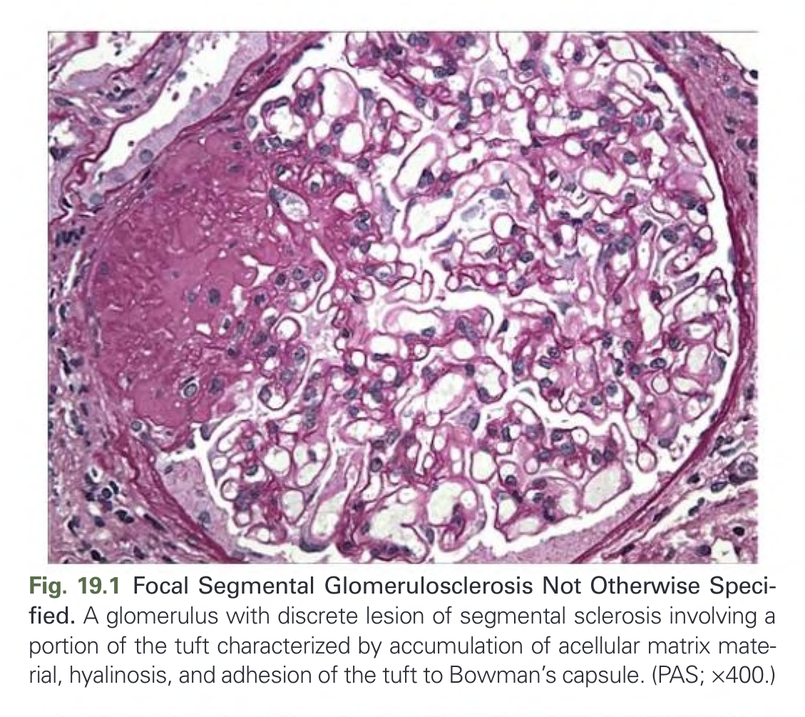

Fig. 19.1 Focal Segmental Glomerulosclerosis Not Otherwise Specified. A glomerulus with discrete lesion of segmental sclerosis involving a portion of the tuft characterized by accumulation of acellular matrix material, hyalinosis, and adhesion of the tuft to Bowman's capsule. (PAS; x400.)

---

### Fig_19_2

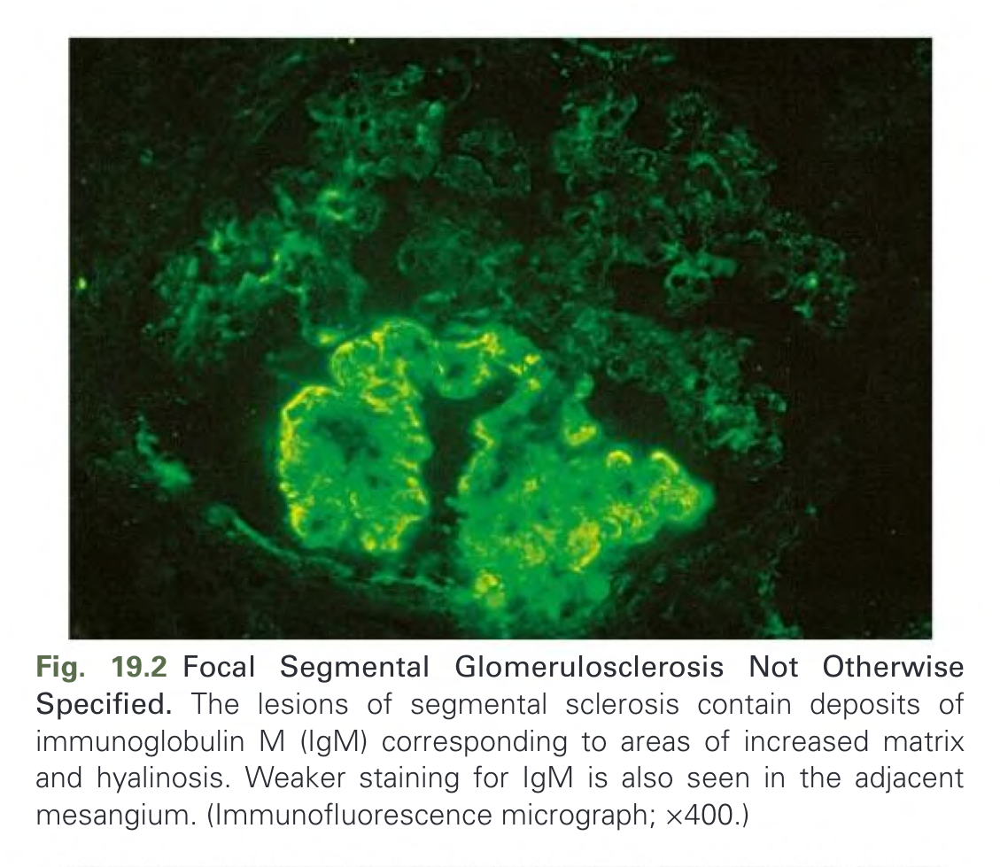

Fig. 19.2 Focal Segmental Glomerulosclerosis Not Otherwise Specified. The lesions of segmental sclerosis contain deposits of immunoglobulin M (IgM) corresponding to areas of increased matrix and hyalinosis. Weaker staining for IgM is also seen in the adjacent mesangium. (Immunofluorescence micrograph; x400.)

---

### Fig_19_3

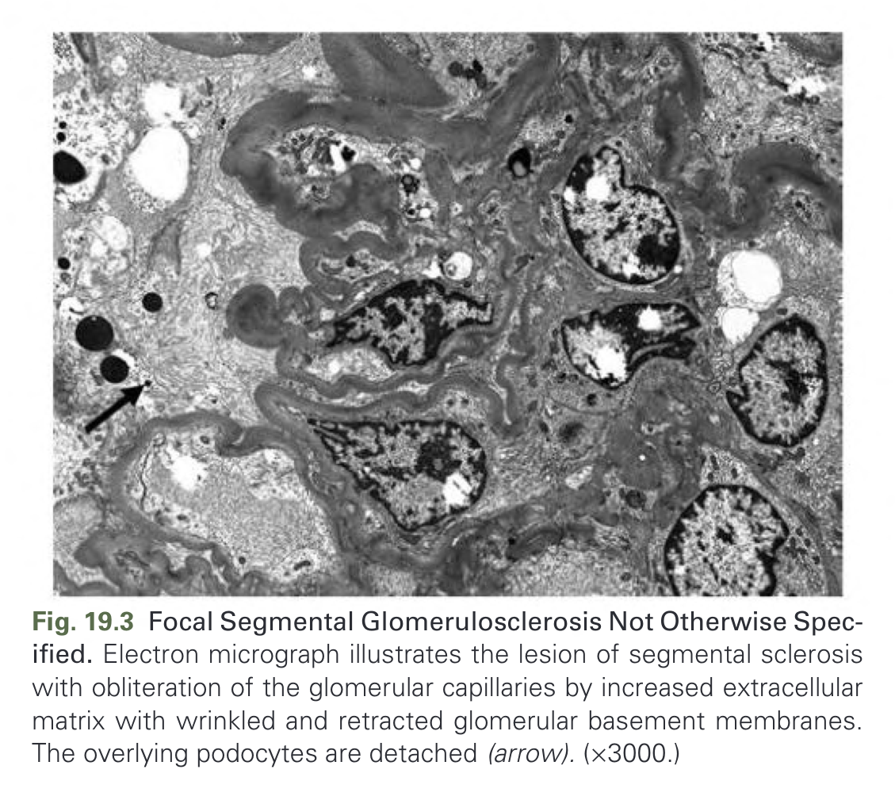

Fig. 19.3 Focal Segmental Glomerulosclerosis Not Otherwise Specified. Electron micrograph illustrates the lesion of segmental sclerosis with obliteration of the glomerular capillaries by increased extracellular matrix with wrinkled and retracted glomerular basement membranes. The overlying podocytes are detached (arrow). (x3000.)

---

### Fig_19_4

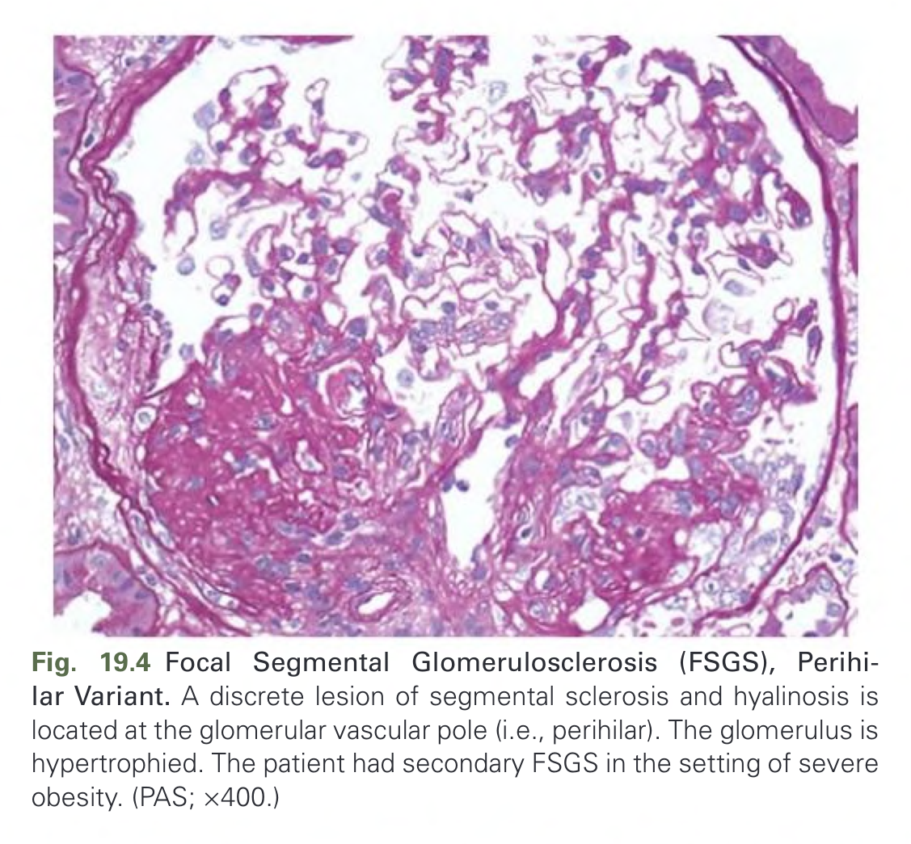

Fig. 19.4 Focal Segmental Glomerulosclerosis (FSGS), Perihilar Variant. A discrete lesion of segmental sclerosis and hyalinosis is located at the glomerular vascular pole (i.e., perihilar). The glomerulus is hypertrophied. The patient had secondary FSGS in the setting of severe obesity. (PAS; x400.)

---

### Fig_19_5

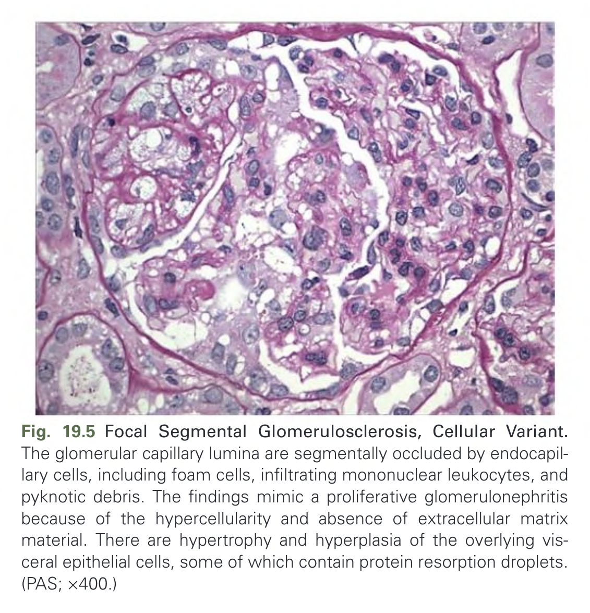

Fig. 19.5 Focal Segmental Glomerulosclerosis, Cellular Variant. The glomerular capillary lumina are segmentally occluded by endocapillary cells, including foam cells, infiltrating mononuclear leukocytes, and pyknotic debris. The findings mimic a proliferative glomerulonephritis because of the hypercellularity and absence of extracellular matrix material. There are hypertrophy and hyperplasia of the overlying visceral epithelial cells, some of which contain protein resorption droplets. (PAS; x400.)

---

### Fig_19_6

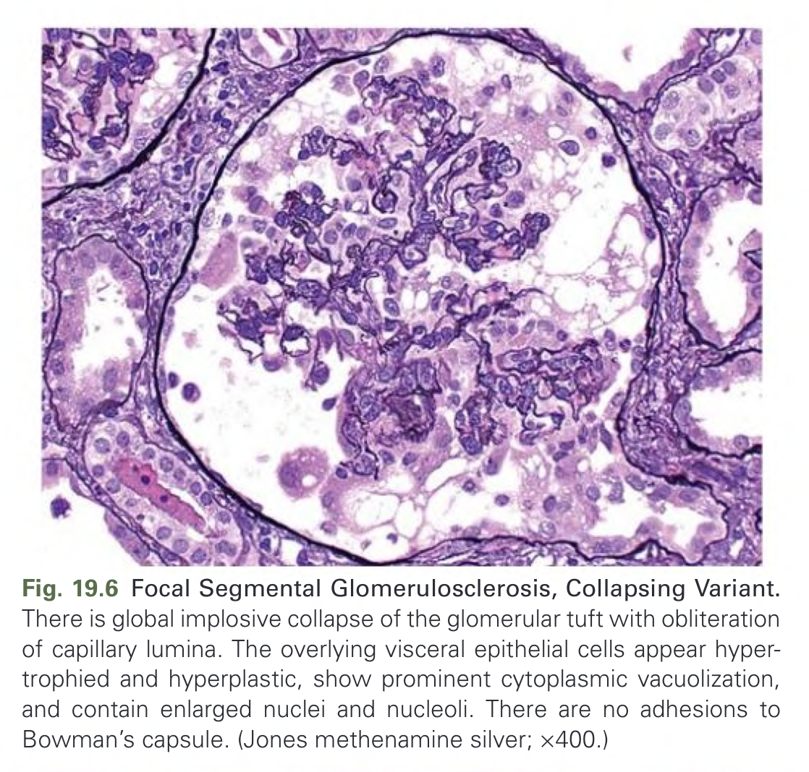

Fig. 19.6 Focal Segmental Glomerulosclerosis, Collapsing Variant. There is global implosive collapse of the glomerular tuft with obliteration of capillary lumina. The overlying visceral epithelial cells appear hypertrophied and hyperplastic, show prominent cytoplasmic vacuolization, and contain enlarged nuclei and nucleoli. There are no adhesions to Bowman's capsule. (Jones methenamine silver; x400.)

---

### Fig_19_7

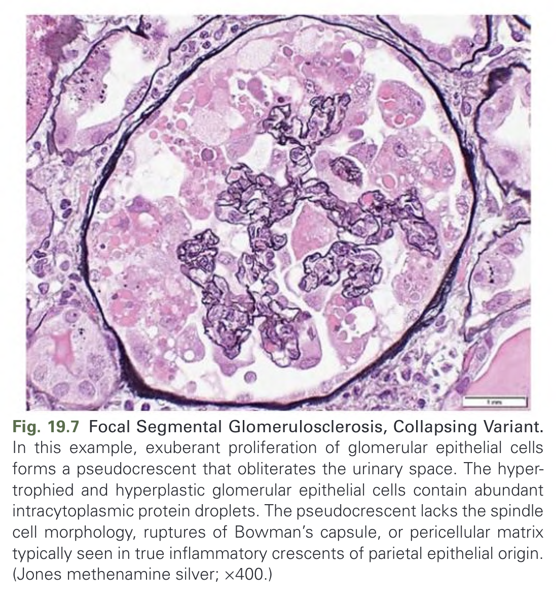

Fig. 19.7 Focal Segmental Glomerulosclerosis, Collapsing Variant. In this example, exuberant proliferation of glomerular epithelial cells forms a pseudocrescent that obliterates the urinary space. The hypertrophied and hyperplastic glomerular epithelial cells contain abundant intracytoplasmic protein droplets. The pseudocrescent lacks the spindle cell morphology, ruptures of Bowman's capsule, or pericellular matrix typically seen in true inflammatory crescents of parietal epithelial origin. (Jones methenamine silver; x400.)

---

### Fig_19_8

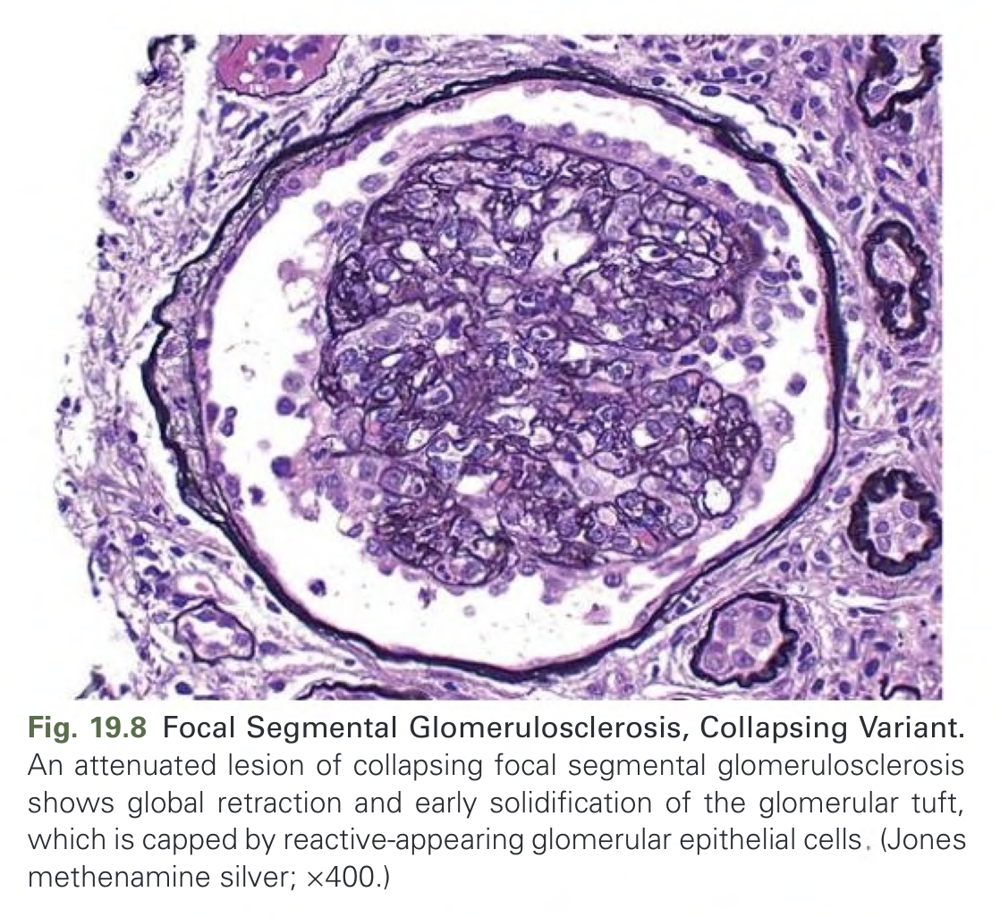

Fig. 19.8 Focal Segmental Glomerulosclerosis, Collapsing Variant. An attenuated lesion of collapsing focal segmental glomerulosclerosis shows global retraction and early solidification of the glomerular tuft, which is capped by reactive-appearing glomerular epithelial cells. (Jones methenamine silver; x400.)

---

### Fig_19_9

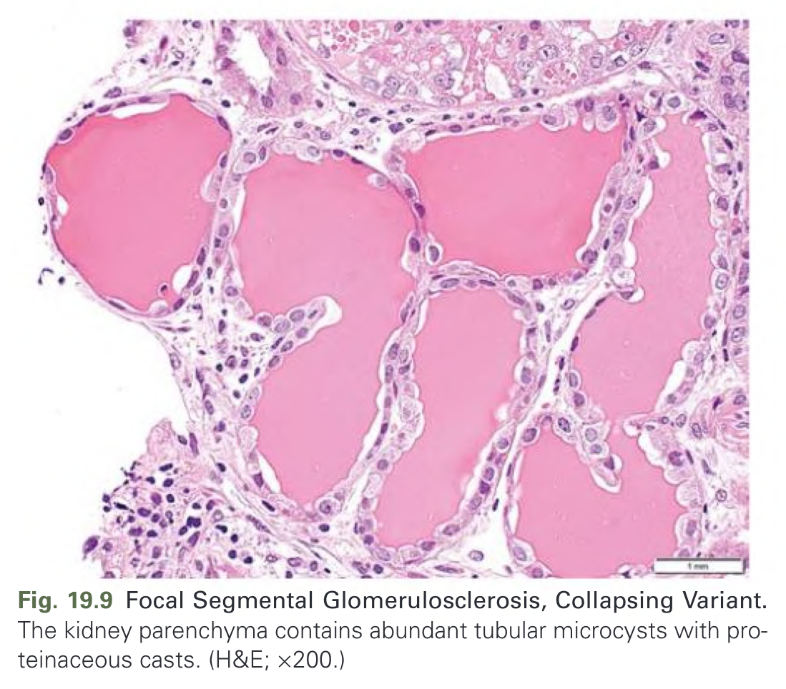

Fig. 19.9 Focal Segmental Glomerulosclerosis, Collapsing Variant. The kidney parenchyma contains abundant tubular microcysts with proteinaceous casts. (H&E; x200.)

---

### Fig_19_10

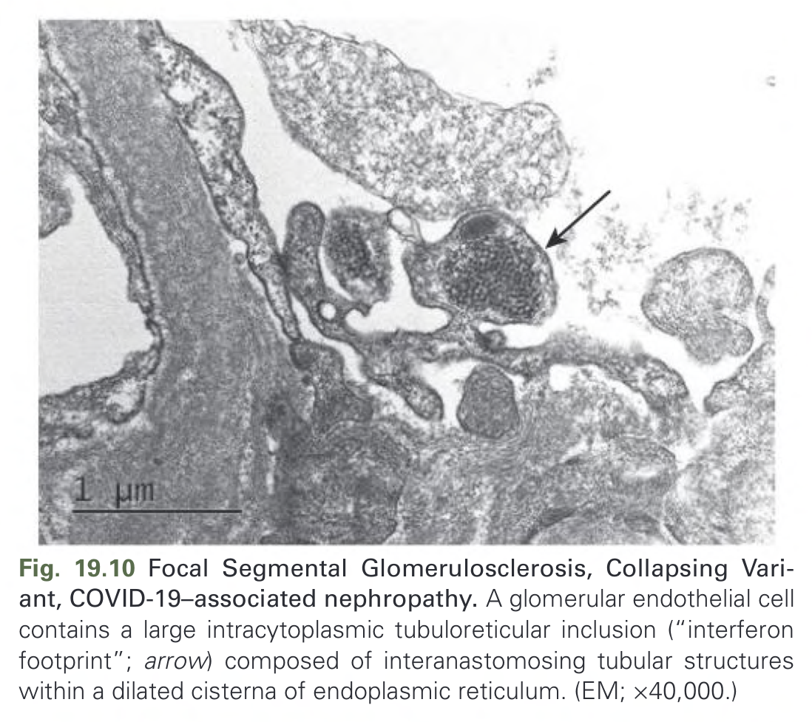

Fig. 19.10 Focal Segmental Glomerulosclerosis, Collapsing Variant, COVID-19-associated nephropathy. A glomerular endothelial cell contains a large intracytoplasmic tubuloreticular inclusion ("interferon footprint"; arrow) composed of interanastomosing tubular structures within a dilated cisterna of endoplasmic reticulum. (EM; x40,000.)

---

### Fig_19_11

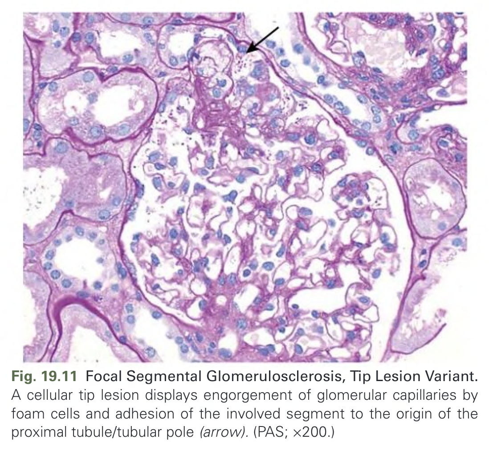

Fig. 19.11 Focal Segmental Glomerulosclerosis, Tip Lesion Variant. A cellular tip lesion displays engorgement of glomerular capillaries by foam cells and adhesion of the involved segment to the origin of the proximal tubule/tubular pole (arrow). (PAS; x200.)

---

### Fig_19_12

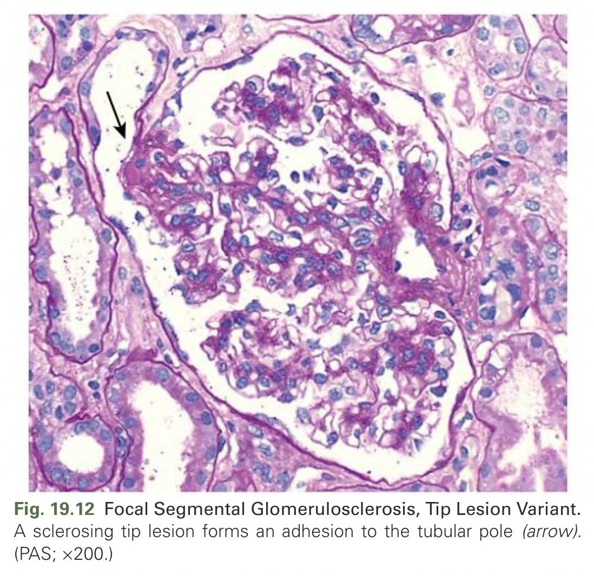

Fig. 19.12 Focal Segmental Glomerulosclerosis, Tip Lesion Variant. A sclerosing tip lesion forms an adhesion to the tubular pole (arrow). (PAS; x200.)

---

### Fig_19_13

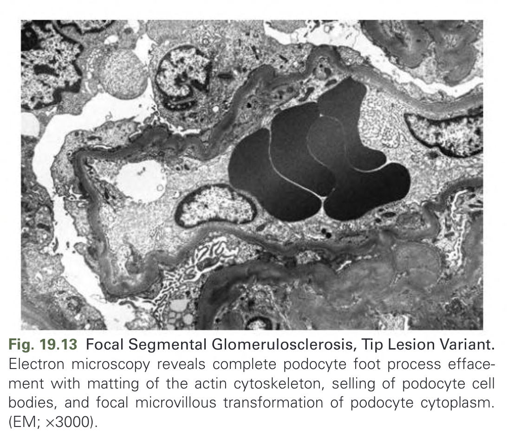

Fig. 19.13 Focal Segmental Glomerulosclerosis, Tip Lesion Variant. Electron microscopy reveals complete podocyte foot process effacement with matting of the actin cytoskeleton, swelling of podocyte cell bodies, and focal microvillous transformation of podocyte cytoplasm. (EM; x3000).

---

### Fig_19_14

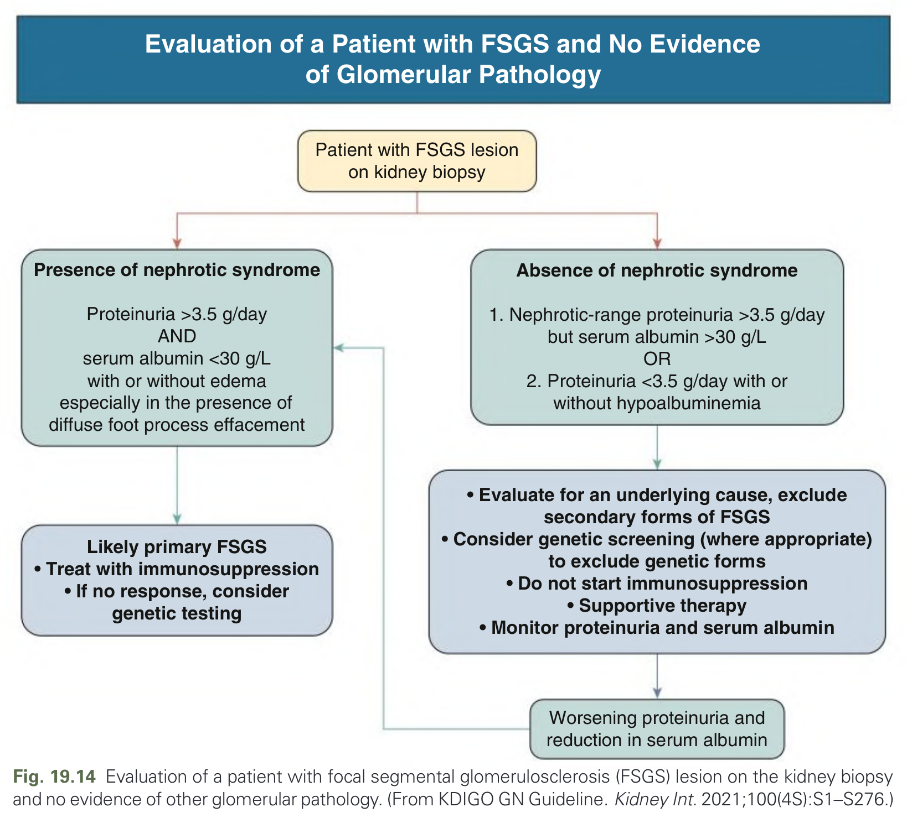

Fig. 19.14 Evaluation of a patient with focal segmental glomerulosclerosis (FSGS) lesion on the kidney biopsy and no evidence of other glomerular pathology. (From KDIGO GN Guideline. Kidney Int. 2021;100(4S):S1-S276.)

---

## Tables

### Table_19_1

#### Table Image

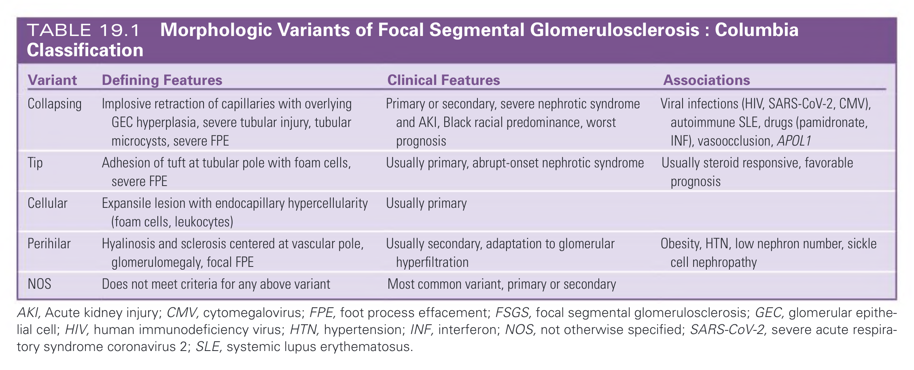

#### Table Data (CSV: [Table_19_1.csv](Table_19_1.csv))

```markdown
| Variant | Defining Features | Clinical Features | Associations |
| :--- | :--- | :--- | :--- |
| Collapsing | Implosive retraction of capillaries with overlying GEC hyperplasia, severe tubular injury, tubular microcysts, severe FPE | Primary or secondary, severe nephrotic syndrome and AKI, Black racial predominance, worst prognosis | Viral infections (HIV, SARS-CoV-2, CMV), autoimmune SLE, drugs (pamidronate, INF), vasoocclusion, APOL 1 |
| Tip | Adhesion of tuft at tubular pole with foam cells, severe FPE | Usually primary, abrupt-onset nephrotic syndrome | Usually steroid responsive, favorable prognosis |
| Cellular | Expansile lesion with endocapillary hypercellularity (foam cells, leukocytes) | Usually primary | |
| Perihilar | Hyalinosis and sclerosis centered at vascular pole, glomerulomegaly, focal FPE | Usually secondary, adaptation to glomerular hyperfiltration | Obesity, HTN, low nephron number, sickle cell nephropathy |
| NOS | Does not meet criteria for any above variant | Most common variant, primary or secondary | |

AKI, Acute kidney injury; CMV, cytomegalovirus; FPE, foot process effacement; FSGS, focal segmental glomerulosclerosis; GEC, glomerular epithelial cell; HIV, human immunodeficiency virus; HTN, hypertension; INF, interferon; NOS, not otherwise specified; SARS-CoV-2, severe acute respiratory syndrome coronavirus 2; SLE, systemic lupus erythematosus.
```

TABLE 19.1 Morphologic Variants of Focal Segmental Glomerulosclerosis : Columbia Classification

---

### Table_19_2

#### Table Image

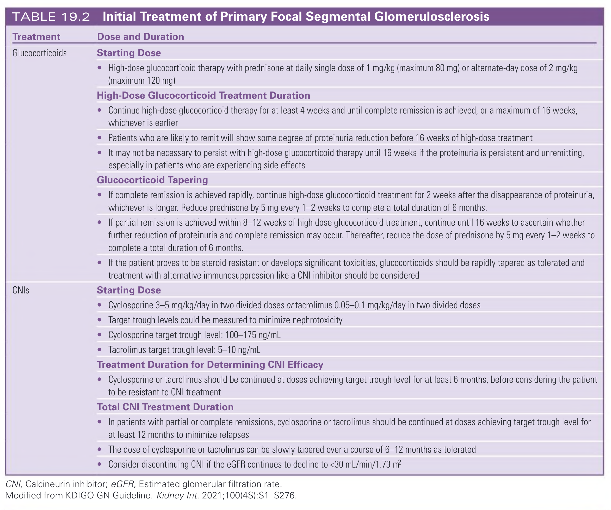

#### Table Data (CSV: [Table_19_2.csv](Table_19_2.csv))

```markdown
| Treatment | Dose and Duration |
| :--- | :--- |
| **Glucocorticoids** | **Starting Dose**<br>• High-dose glucocorticoid therapy with prednisone at daily single dose of 1 mg/kg (maximum 80 mg) or alternate-day dose of 2 mg/kg (maximum 120 mg)<br>**High-Dose Glucocorticoid Treatment Duration**<br>• Continue high-dose glucocorticoid therapy for at least 4 weeks and until complete remission is achieved, or a maximum of 16 weeks, whichever is earlier<br>• Patients who are likely to remit will show some degree of proteinuria reduction before 16 weeks of high-dose treatment<br>• It may not be necessary to persist with high-dose glucocorticoid therapy until 16 weeks if the proteinuria is persistent and unremitting, especially in patients who are experiencing side effects<br>**Glucocorticoid Tapering**<br>• If complete remission is achieved rapidly, continue high-dose glucocorticoid treatment for 2 weeks after the disappearance of proteinuria, whichever is longer. Reduce prednisone by 5 mg every 1-2 weeks to complete a total duration of 6 months.<br>• If partial remission is achieved within 8-12 weeks of high dose glucocorticoid treatment, continue until 16 weeks to ascertain whether further reduction of proteinuria and complete remission may occur. Thereafter, reduce the dose of prednisone by 5 mg every 1-2 weeks to complete a total duration of 6 months.<br>• If the patient proves to be steroid resistant or develops significant toxicities, glucocorticoids should be rapidly tapered as tolerated and treatment with alternative immunosuppression like a CNI inhibitor should be considered |
| **CNIs** | **Starting Dose**<br>• Cyclosporine 3-5 mg/kg/day in two divided doses or tacrolimus 0.05-0.1 mg/kg/day in two divided doses<br>• Target trough levels could be measured to minimize nephrotoxicity<br>• Cyclosporine target trough level: 100-175 ng/mL<br>• Tacrolimus target trough level: 5-10 ng/mL<br>**Treatment Duration for Determining CNI Efficacy**<br>• Cyclosporine or tacrolimus should be continued at doses achieving target trough level for at least 6 months, before considering the patient to be resistant to CNI treatment<br>**Total CNI Treatment Duration**<br>• In patients with partial or complete remissions, cyclosporine or tacrolimus should be continued at doses achieving target trough level for at least 12 months to minimize relapses<br>• The dose of cyclosporine or tacrolimus can be slowly tapered over a course of 6-12 months as tolerated<br>• Consider discontinuing CNI if the eGFR continues to decline to <30 mL/min/1.73 m² |

CNI, Calcineurin inhibitor; eGFR, Estimated glomerular filtration rate.
Modified from KDIGO GN Guideline. Kidney Int. 2021;100(4S):S1-S276.
```

TABLE 19.2 Initial Treatment of Primary Focal Segmental Glomerulosclerosis

---

### Table_19_3

#### Table Image

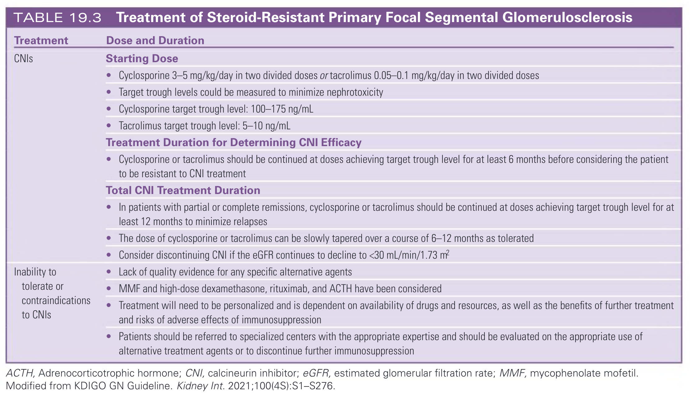

#### Table Data (CSV: [Table_19_3.csv](Table_19_3.csv))

```markdown
| Treatment | Dose and Duration |
| :--- | :--- |
| **CNIs** | **Starting Dose**<br>• Cyclosporine 3-5 mg/kg/day in two divided doses or tacrolimus 0.05-0.1 mg/kg/day in two divided doses<br>• Target trough levels could be measured to minimize nephrotoxicity<br>• Cyclosporine target trough level: 100–175 ng/mL<br>• Tacrolimus target trough level: 5-10 ng/mL<br>**Treatment Duration for Determining CNI Efficacy**<br>• Cyclosporine or tacrolimus should be continued at doses achieving target trough level for at least 6 months before considering the patient to be resistant to CNI treatment<br>**Total CNI Treatment Duration**<br>• In patients with partial or complete remissions, cyclosporine or tacrolimus should be continued at doses achieving target trough level for at least 12 months to minimize relapses<br>• The dose of cyclosporine or tacrolimus can be slowly tapered over a course of 6-12 months as tolerated<br>• Consider discontinuing CNI if the eGFR continues to decline to <30 mL/min/1.73 m² |
| **Inability to tolerate or contraindications to CNIs** | • Lack of quality evidence for any specific alternative agents<br>• MMF and high-dose dexamethasone, rituximab, and ACTH have been considered<br>• Treatment will need to be personalized and is dependent on availability of drugs and resources, as well as the benefits of further treatment and risks of adverse effects of immunosuppression<br>• Patients should be referred to specialized centers with the appropriate expertise and should be evaluated on the appropriate use of alternative treatment agents or to discontinue further immunosuppression |

ACTH, Adrenocorticotrophic hormone; CNI, calcineurin inhibitor; eGFR, estimated glomerular filtration rate; MMF, mycophenolate mofetil.
Modified from KDIGO GN Guideline. Kidney Int. 2021;100(4S):S1-S276.
```

TABLE 19.3 Treatment of Steroid-Resistant Primary Focal Segmental Glomerulosclerosis

---

## Boxes

### Box_19_1

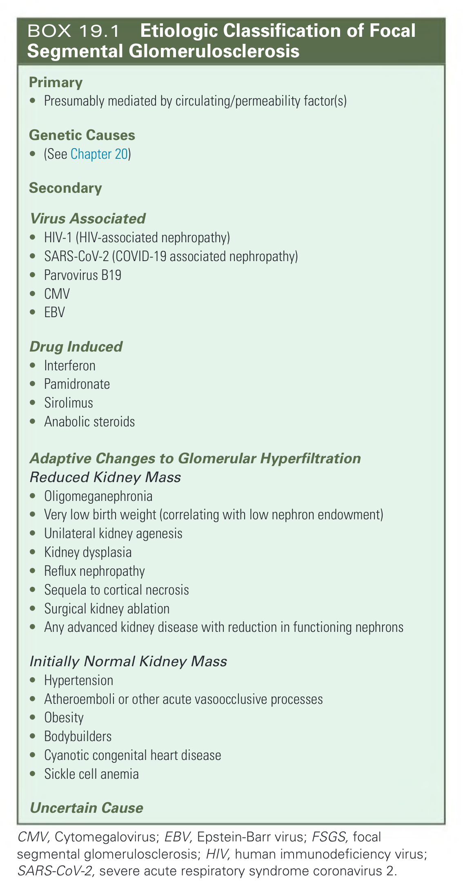

#### Box Text

```markdown
**Primary**
*   Presumably mediated by circulating/permeability factor(s)

**Genetic Causes**
*   (See Chapter 20)

**Secondary**
**Virus Associated**
*   HIV-1 (HIV-associated nephropathy)
*   SARS-CoV-2 (COVID-19 associated nephropathy)
*   Parvovirus B19
*   CMV
*   EBV

**Drug Induced**
*   Interferon
*   Pamidronate
*   Sirolimus
*   Anabolic steroids

**Adaptive Changes to Glomerular Hyperfiltration**
**Reduced Kidney Mass**
*   Oligomeganephronia
*   Very low birth weight (correlating with low nephron endowment)
*   Unilateral kidney agenesis
*   Kidney dysplasia
*   Reflux nephropathy
*   Sequela to cortical necrosis
*   Surgical kidney ablation
*   Any advanced kidney disease with reduction in functioning nephrons

**Initially Normal Kidney Mass**
*   Hypertension
*   Atheroemboli or other acute vasoocclusive processes
*   Obesity
*   Bodybuilders
*   Cyanotic congenital heart disease
*   Sickle cell anemia

**Uncertain Cause**
CMV, Cytomegalovirus; EBV, Epstein-Barr virus; FSGS, focal segmental glomerulosclerosis; HIV, human immunodeficiency virus; SARS-CoV-2, severe acute respiratory syndrome coronavirus 2.
```

BOX 19.1 Etiologic Classification of Focal Segmental Glomerulosclerosis

---

### Box_19_2

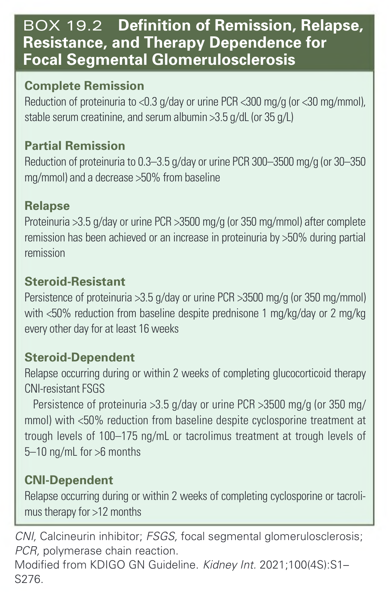

#### Box Text

```markdown
**Complete Remission**
Reduction of proteinuria to <0.3 g/day or urine PCR <300 mg/g (or <30 mg/mmol), stable serum creatinine, and serum albumin >3.5 g/dL (or 35 g/L)

**Partial Remission**
Reduction of proteinuria to 0.3-3.5 g/day or urine PCR 300-3500 mg/g (or 30-350 mg/mmol) and a decrease >50% from baseline

**Relapse**
Proteinuria >3.5 g/day or urine PCR >3500 mg/g (or 350 mg/mmol) after complete remission has been achieved or an increase in proteinuria by >50% during partial remission

**Steroid-Resistant**
Persistence of proteinuria >3.5 g/day or urine PCR >3500 mg/g (or 350 mg/mmol) with <50% reduction from baseline despite prednisone 1 mg/kg/day or 2 mg/kg every other day for at least 16 weeks

**Steroid-Dependent**
Relapse occurring during or within 2 weeks of completing glucocorticoid therapy
CNI-resistant FSGS
Persistence of proteinuria >3.5 g/day or urine PCR >3500 mg/g (or 350 mg/mmol) with <50% reduction from baseline despite cyclosporine treatment at trough levels of 100-175 ng/mL or tacrolimus treatment at trough levels of 5-10 ng/mL for >6 months

**CNI-Dependent**
Relapse occurring during or within 2 weeks of completing cyclosporine or tacrolimus therapy for >12 months

CNI, Calcineurin inhibitor; FSGS, focal segmental glomerulosclerosis; PCR, polymerase chain reaction.
Modified from KDIGO GN Guideline. Kidney Int. 2021;100(4S):S1-S276.
```

BOX 19.2 Definition of Remission, Relapse, Resistance, and Therapy Dependence for Focal Segmental Glomerulosclerosis

---

### Box_19_3

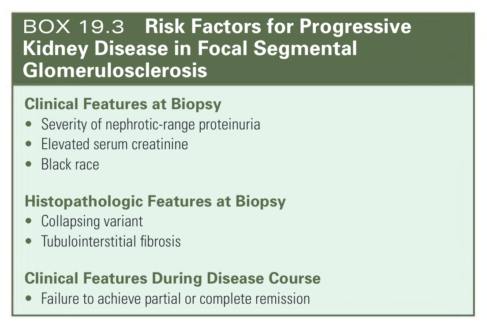

#### Box Text

```markdown
**Clinical Features at Biopsy**
*   Severity of nephrotic-range proteinuria
*   Elevated serum creatinine
*   Black race

**Histopathologic Features at Biopsy**
*   Collapsing variant
*   Tubulointerstitial fibrosis

**Clinical Features During Disease Course**
*   Failure to achieve partial or complete remission
```

BOX 19.3 Risk Factors for Progressive Kidney Disease in Focal Segmental Glomerulosclerosis

---
