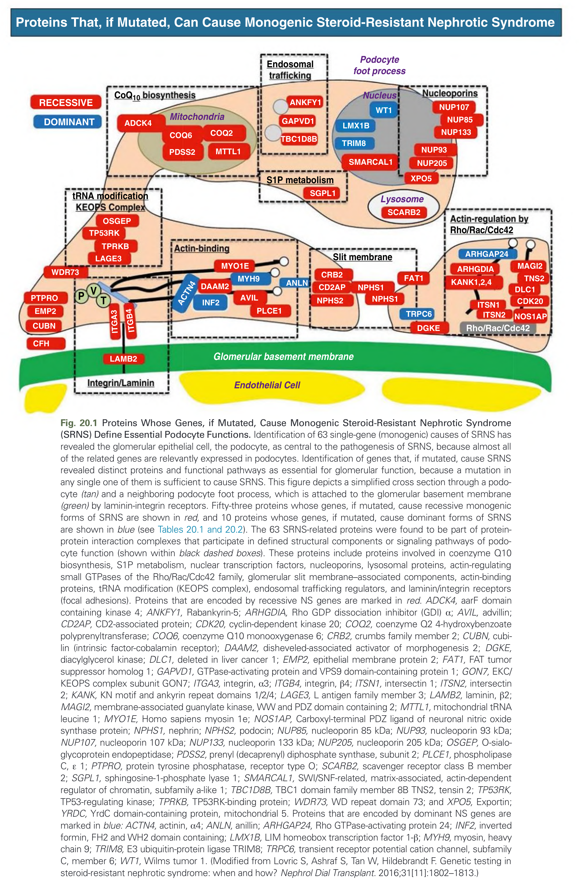
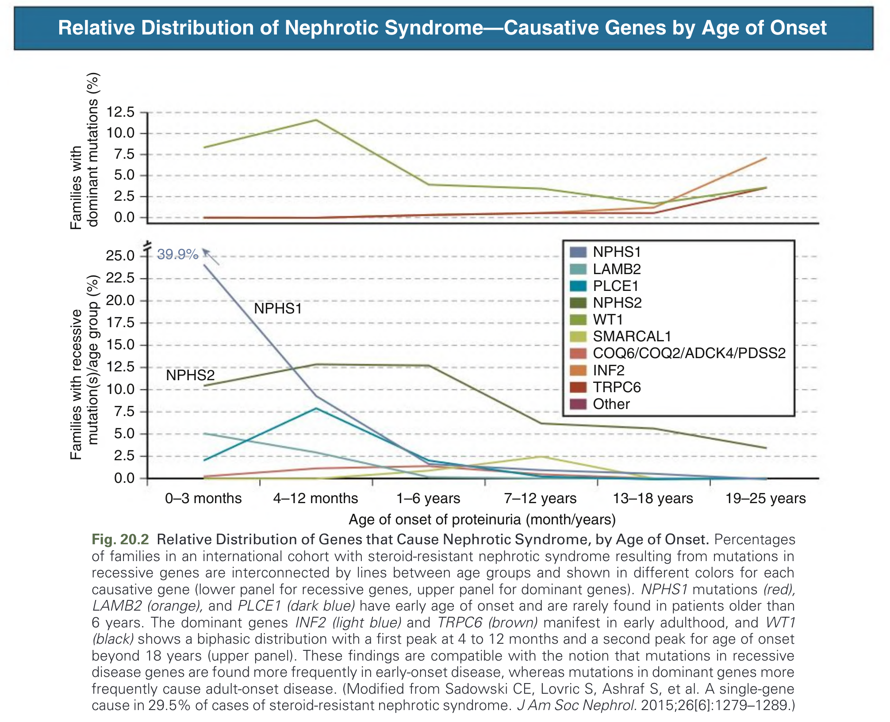
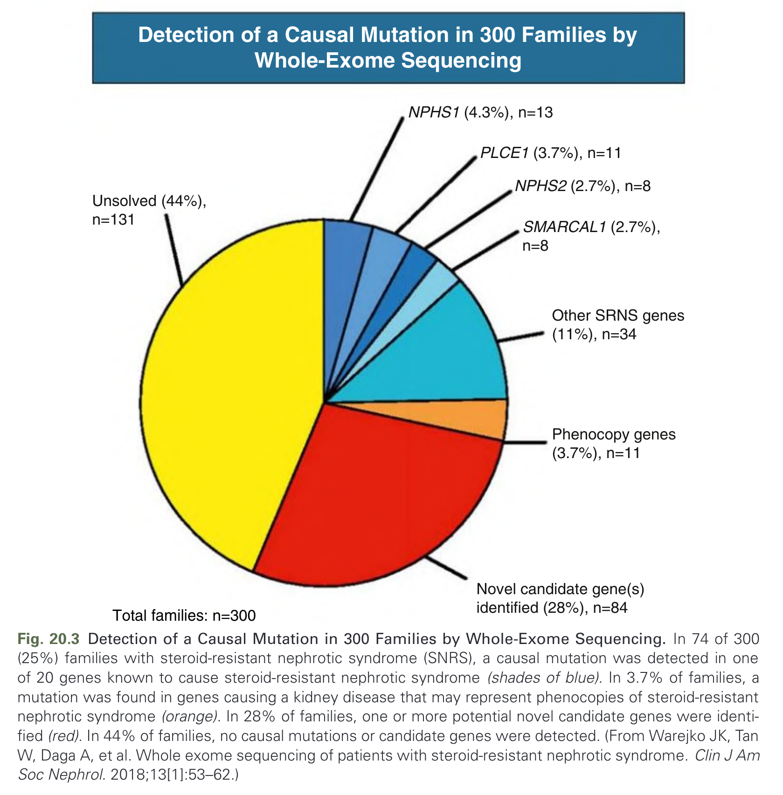
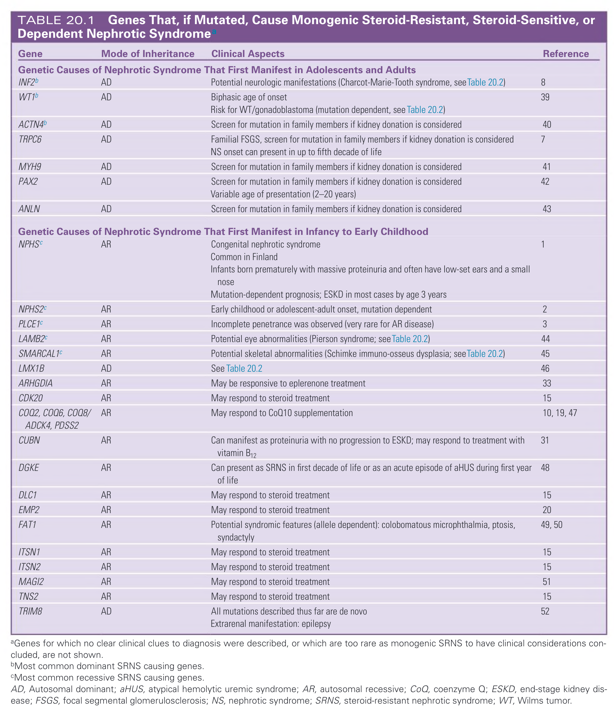
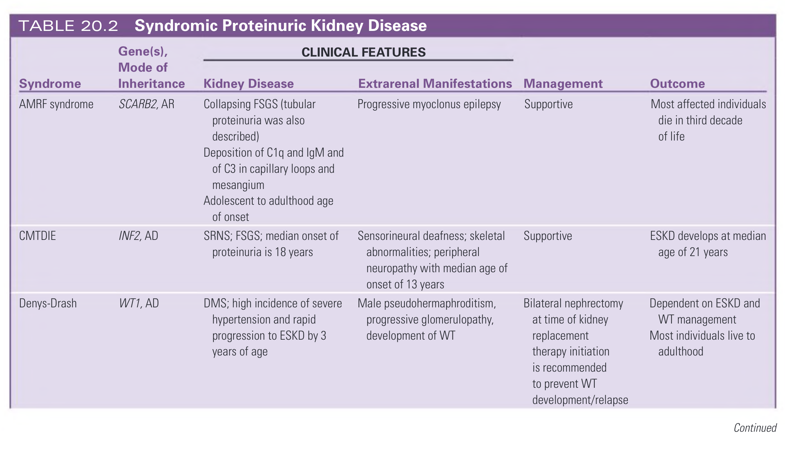
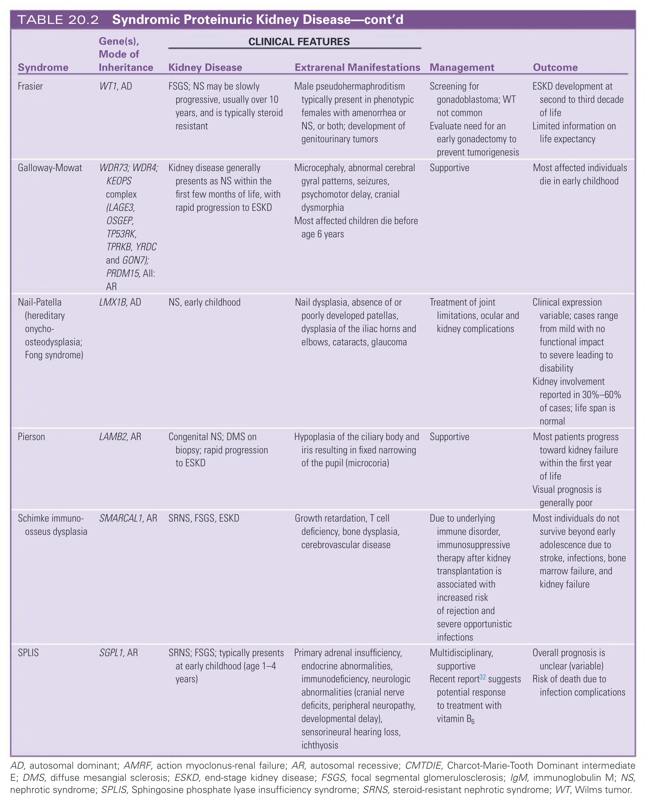
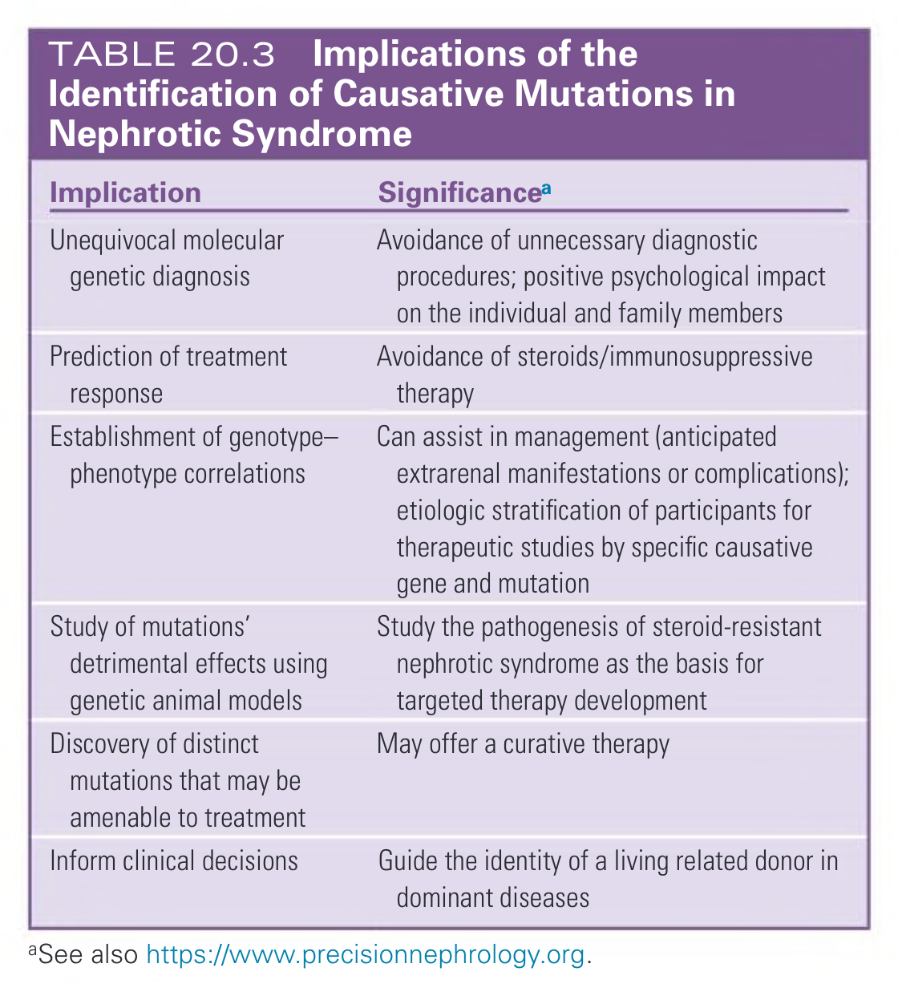
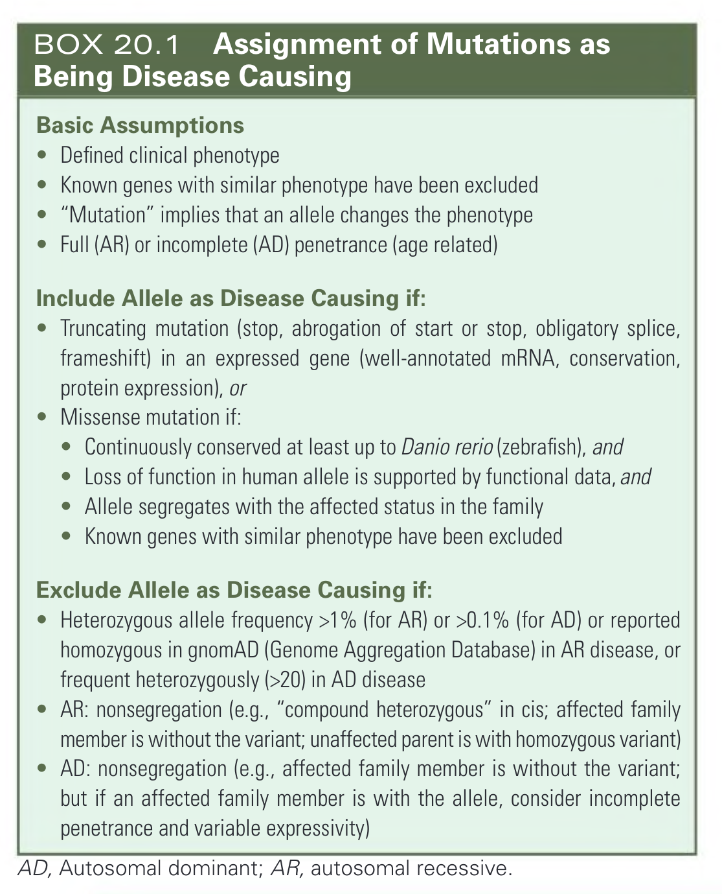

# 020. Inherited Causes of Nephrotic Syndrome - Figures and Tables Index

This document lists all figures, tables and boxes extracted from `020. Inherited Causes of Nephrotic Syndrome.pdf`.

## Table of Contents
- [Figures](#figures)
- [Tables](#tables)
- [Boxes](#boxes)

---

## Figures

### Fig_20_1



Fig. 20.1 Proteins Whose Genes, if Mutated, Cause Monogenic Steroid-Resistant Nephrotic Syndrome (SRNS) Define Essential Podocyte Functions. Identification of 63 single-gene (monogenic) causes of SRNS has revealed the glomerular epithelial cell, the podocyte, as central to the pathogenesis of SRNS, because almost all of the related genes are relevantly expressed in podocytes. Identification of genes that, if mutated, cause SRNS revealed distinct proteins and functional pathways as essential for glomerular function, because a mutation in any single one of them is sufficient to cause SRNS. This figure depicts a simplified cross section through a podocyte (tan) and a neighboring podocyte foot process, which is attached to the glomerular basement membrane (green) by laminin-integrin receptors. Fifty-three proteins whose genes, if mutated, cause recessive monogenic forms of SRNS are shown in red, and 10 proteins whose genes, if mutated, cause dominant forms of SRNS are shown in blue (see Tables 20.1 and 20.2). The 63 SRNS-related proteins were found to be part of protein-protein interaction complexes that participate in defined structural components or signaling pathways of podocyte function (shown within black dashed boxes). These proteins include proteins involved in coenzyme Q10 biosynthesis, S1P metabolism, nuclear transcription factors, nucleoporins, lysosomal proteins, actin-regulating small GTPases of the Rho/Rac/Cdc42 family, glomerular slit membrane–associated components, actin-binding proteins, tRNA modification (KEOPS complex), endosomal trafficking regulators, and laminin/integrin receptors (focal adhesions). Proteins that are encoded by recessive NS genes are marked in red. ADCK4, aarF domain containing kinase 4; ANKFY1, Rabankyrin-5; ARHGDIA, Rho GDP dissociation inhibitor (GDI) α; AVIL, advillin; CD2AP, CD2-associated protein; CDK20, cyclin-dependent kinase 20; COQ2, coenzyme Q2 4-hydroxybenzoate polyprenyltransferase; COQ6, coenzyme Q10 monooxygenase 6; CRB2, crumbs family member 2; CUBN, cubilin (intrinsic factor-cobalamin receptor); DAAM2, disheveled-associated activator of morphogenesis 2; DGKE, diacylglycerol kinase; DLC1, deleted in liver cancer 1; EMP2, epithelial membrane protein 2; FAT1, FAT tumor suppressor homolog 1; GAPVD1, GTPase-activating protein and VPS9 domain-containing protein 1; GON7, EKC/KEOPS complex subunit GON7; ITGA3, integrin, α3; ITGB4, integrin, β4; ITSN1, intersectin 1; ITSN2, intersectin 2; KANK, KN motif and ankyrin repeat domains 1/2/4; LAGE3, L antigen family member 3; LAMB2, laminin, β2; MAGI2, membrane-associated guanylate kinase, WW and PDZ domain containing 2; MTTL1, mitochondrial tRNA leucine 1; MYO1E, Homo sapiens myosin 1e; NOS1AP, Carboxyl-terminal PDZ ligand of neuronal nitric oxide synthase protein; NPHS1, nephrin; NPHS2, podocin; NUP85, nucleoporin 85 kDa; NUP93, nucleoporin 93 kDa; NUP107, nucleoporin 107 kDa; NUP133, nucleoporin 133 kDa; NUP205, nucleoporin 205 kDa; OSGEP, O-sialoglycoprotein endopeptidase; PDSS2, prenyl (decaprenyl) diphosphate synthase, subunit 2; PLCE1, phospholipase C, ε 1; PTPRO, protein tyrosine phosphatase, receptor type O; SCARB2, scavenger receptor class B member 2; SGPL1, sphingosine-1-phosphate lyase 1; SMARCAL1, SWI/SNF-related, matrix-associated, actin-dependent regulator of chromatin, subfamily a-like 1; TBC1D8B, TBC1 domain family member 8B TNS2, tensin 2; TP53RK, TP53-regulating kinase; TPRKB, TP53RK-binding protein; WDR73, WD repeat domain 73; and XPO5, Exportin; YRDC, YrdC domain-containing protein, mitochondrial 5. Proteins that are encoded by dominant NS genes are marked in blue: ACTN4, actinin, α4; ANLN, anillin; ARHGAP24, Rho GTPase-activating protein 24; INF2, inverted formin, FH2 and WH2 domain containing; LMX1B, LIM homeobox transcription factor 1-β; MYH9, myosin, heavy chain 9; TRIM8, E3 ubiquitin-protein ligase TRIM8; TRPC6, transient receptor potential cation channel, subfamily C, member 6; WT1, Wilms tumor 1. (Modified from Lovric S, Ashraf S, Tan W, Hildebrandt F. Genetic testing in steroid-resistant nephrotic syndrome: when and how? Nephrol Dial Transplant. 2016;31[11]:1802–1813.)

---

### Fig_20_2



Fig. 20.2 Relative Distribution of Genes that Cause Nephrotic Syndrome, by Age of Onset. Percentages of families in an international cohort with steroid-resistant nephrotic syndrome resulting from mutations in recessive genes are interconnected by lines between age groups and shown in different colors for each causative gene (lower panel for recessive genes, upper panel for dominant genes). NPHS1 mutations (red), LAMB2 (orange), and PLCE1 (dark blue) have early age of onset and are rarely found in patients older than 6 years. The dominant genes INF2 (light blue) and TRPC6 (brown) manifest in early adulthood, and WT1 (black) shows a biphasic distribution with a first peak at 4 to 12 months and a second peak for age of onset beyond 18 years (upper panel). These findings are compatible with the notion that mutations in recessive disease genes are found more frequently in early-onset disease, whereas mutations in dominant genes more frequently cause adult-onset disease. (Modified from Sadowski CE, Lovric S, Ashraf S, et al. A single-gene cause in 29.5% of cases of steroid-resistant nephrotic syndrome. J Am Soc Nephrol. 2015;26[6]:1279–1289.)

---

### Fig_20_3



Fig. 20.3 Detection of a Causal Mutation in 300 Families by Whole-Exome Sequencing. In 74 of 300 (25%) families with steroid-resistant nephrotic syndrome (SNRS), a causal mutation was detected in one of 20 genes known to cause steroid-resistant nephrotic syndrome (shades of blue). In 3.7% of families, a mutation was found in genes causing a kidney disease that may represent phenocopies of steroid-resistant nephrotic syndrome (orange). In 28% of families, one or more potential novel candidate genes were identified (red). In 44% of families, no causal mutations or candidate genes were detected. (From Warejko JK, Tan W, Daga A, et al. Whole exome sequencing of patients with steroid-resistant nephrotic syndrome. Clin J Am Soc Nephrol. 2018;13[1]:53–62.)

---

## Tables

### Table_20_1

#### Table Image



#### Table Data (CSV: [Table_20_1.csv](Table_20_1.csv))

```markdown
| Group | Gene | Mode of Inheritance | Clinical Aspects | Reference |
| :--- | :--- | :--- | :--- | :--- |
| Genetic Causes of Nephrotic Syndrome That First Manifest in Adolescents and Adults | INF2^b | AD | Potential neurologic manifestations (Charcot-Marie-Tooth syndrome, see Table 20.2) | 8 |
| Genetic Causes of Nephrotic Syndrome That First Manifest in Adolescents and Adults | WT1^b | AD | Biphasic age of onset. Risk for WT/gonadoblastoma (mutation dependent, see Table 20.2) | 39 |
| Genetic Causes of Nephrotic Syndrome That First Manifest in Adolescents and Adults | ACTN4^b | AD | Screen for mutation in family members if kidney donation is considered | 40 |
| Genetic Causes of Nephrotic Syndrome That First Manifest in Adolescents and Adults | TRPC6 | AD | Familial FSGS, screen for mutation in family members if kidney donation is considered. NS onset can present in up to fifth decade of life | 7 |
| Genetic Causes of Nephrotic Syndrome That First Manifest in Adolescents and Adults | MYH9 | AD | Screen for mutation in family members if kidney donation is considered | 41 |
| Genetic Causes of Nephrotic Syndrome That First Manifest in Adolescents and Adults | PAX2 | AD | Screen for mutation in family members if kidney donation is considered. Variable age of presentation (2–20 years) | 42 |
| Genetic Causes of Nephrotic Syndrome That First Manifest in Adolescents and Adults | ANLN | AD | Screen for mutation in family members if kidney donation is considered | 43 |
| Genetic Causes of Nephrotic Syndrome That First Manifest in Infancy to Early Childhood | NPHS^c | AR | Congenital nephrotic syndrome. Common in Finland. Infants born prematurely with massive proteinuria and often have low-set ears and a small nose. Mutation-dependent prognosis; ESKD in most cases by age 3 years | 1 |
| Genetic Causes of Nephrotic Syndrome That First Manifest in Infancy to Early Childhood | NPHS2^c | AR | Early childhood or adolescent-adult onset, mutation dependent | 2 |
| Genetic Causes of Nephrotic Syndrome That First Manifest in Infancy to Early Childhood | PLCE1^c | AR | Incomplete penetrance was observed (very rare for AR disease) | 3 |
| Genetic Causes of Nephrotic Syndrome That First Manifest in Infancy to Early Childhood | LAMB2^c | AR | Potential eye abnormalities (Pierson syndrome; see Table 20.2) | 44 |
| Genetic Causes of Nephrotic Syndrome That First Manifest in Infancy to Early Childhood | SMARCAL1^c | AR | Potential skeletal abnormalities (Schimke immuno-osseus dysplasia; see Table 20.2) | 45 |
| Genetic Causes of Nephrotic Syndrome That First Manifest in Infancy to Early Childhood | LMX1B | AD | See Table 20.2 | 46 |
| Genetic Causes of Nephrotic Syndrome That First Manifest in Infancy to Early Childhood | ARHGDIA | AR | May be responsive to eplerenone treatment | 33 |
| Genetic Causes of Nephrotic Syndrome That First Manifest in Infancy to Early Childhood | CDK20 | AR | May respond to steroid treatment | 15 |
| Genetic Causes of Nephrotic Syndrome That First Manifest in Infancy to Early Childhood | COQ2, COQ6, COQ8/ADCK4, PDSS2 | AR | May respond to CoQ10 supplementation | 10, 19, 47 |
| Genetic Causes of Nephrotic Syndrome That First Manifest in Infancy to Early Childhood | CUBN | AR | Can manifest as proteinuria with no progression to ESKD; may respond to treatment with vitamin B_{12} | 31 |
| Genetic Causes of Nephrotic Syndrome That First Manifest in Infancy to Early Childhood | DGKE | AR | Can present as SRNS in first decade of life or as an acute episode of aHUS during first year of life | 48 |
| Genetic Causes of Nephrotic Syndrome That First Manifest in Infancy to Early Childhood | DLC1 | AR | May respond to steroid treatment | 15 |
| Genetic Causes of Nephrotic Syndrome That First Manifest in Infancy to Early Childhood | EMP2 | AR | May respond to steroid treatment | 20 |
| Genetic Causes of Nephrotic Syndrome That First Manifest in Infancy to Early Childhood | FAT1 | AR | Potential syndromic features (allele dependent): colobomatous microphthalmia, ptosis, syndactyly | 49, 50 |
| Genetic Causes of Nephrotic Syndrome That First Manifest in Infancy to Early Childhood | ITSN1 | AR | May respond to steroid treatment | 15 |
| Genetic Causes of Nephrotic Syndrome That First Manifest in Infancy to Early Childhood | ITSN2 | AR | May respond to steroid treatment | 15 |
| Genetic Causes of Nephrotic Syndrome That First Manifest in Infancy to Early Childhood | MAGI2 | AR | May respond to steroid treatment | 51 |
| Genetic Causes of Nephrotic Syndrome That First Manifest in Infancy to Early Childhood | TNS2 | AR | May respond to steroid treatment | 15 |
| Genetic Causes of Nephrotic Syndrome That First Manifest in Infancy to Early Childhood | TRIM8 | AD | All mutations described thus far are de novo. Extrarenal manifestation: epilepsy | 52 |
aGenes for which no clear clinical clues to diagnosis were described, or which are too rare as monogenic SRNS to have clinical considerations concluded, are not shown.
bMost common dominant SRNS causing genes.
cMost common recessive SRNS causing genes.
AD, Autosomal dominant; aHUS, atypical hemolytic uremic syndrome; AR, autosomal recessive; CoQ, coenzyme Q; ESKD, end-stage kidney disease; FSGS, focal segmental glomerulosclerosis; NS, nephrotic syndrome; SRNS, steroid-resistant nephrotic syndrome; WT, Wilms tumor.
```

TABLE 20.1 Genes That, if Mutated, Cause Monogenic Steroid-Resistant, Steroid-Sensitive, or Dependent Nephrotic Syndrome

---

### Table_20_2

#### Table Image





#### Table Data (CSV: [Table_20_2.csv](Table_20_2.csv))

```markdown
| Group | Syndrome | Gene(s), Mode of Inheritance | Kidney Disease | Extrarenal Manifestations | Management | Outcome |
| :--- | :--- | :--- | :--- | :--- | :--- | :--- |
| CLINICAL FEATURES | AMRF syndrome | SCARB2, AR | Collapsing FSGS (tubular proteinuria was also described). Deposition of C1q and IgM and of C3 in capillary loops and mesangium. Adolescent to adulthood age of onset. | Progressive myoclonus epilepsy | Supportive | Most affected individuals die in third decade of life |
| CLINICAL FEATURES | CMTDIE | INF2, AD | SRNS; FSGS; median onset of proteinuria is 18 years | Sensorineural deafness; skeletal abnormalities; peripheral neuropathy with median age of onset of 13 years | Supportive | ESKD develops at median age of 21 years |
| CLINICAL FEATURES | Denys-Drash | WT1, AD | DMS; high incidence of severe hypertension and rapid progression to ESKD by 3 years of age | Male pseudohermaphroditism, progressive glomerulopathy, development of WT | Bilateral nephrectomy at time of kidney replacement therapy initiation is recommended to prevent WT development/relapse | Dependent on ESKD and WT management. Most individuals live to adulthood |
| CLINICAL FEATURES | Frasier | WT1, AD | FSGS; NS may be slowly progressive, usually over 10 years, and is typically steroid resistant | Male pseudohermaphroditism typically present in phenotypic females with amenorrhea or NS, or both; development of genitourinary tumors | Screening for gonadoblastoma; WT not common. Evaluate need for an early gonadectomy to prevent tumorigenesis | ESKD development at second to third decade of life. Limited information on life expectancy |
| CLINICAL FEATURES | Galloway-Mowat | WDR73; WDR4; KEOPS complex (LAGE3, OSGEP, TP53RK, TPRKB, YRDC and GON7); PRDM15, All: AR | Kidney disease generally presents as NS within the first few months of life, with rapid progression to ESKD | Microcephaly, abnormal cerebral gyral patterns, seizures, psychomotor delay, cranial dysmorphia. Most affected children die before age 6 years | Supportive | Most affected individuals die in early childhood |
| CLINICAL FEATURES | Nail-Patella (hereditary onycho-osteodysplasia; Fong syndrome) | LMX1B, AD | NS, early childhood | Nail dysplasia, absence of or poorly developed patellas, dysplasia of the iliac horns and elbows, cataracts, glaucoma | Treatment of joint limitations, ocular and kidney complications | Clinical expression variable; cases range from mild with no functional impact to severe leading to disability. Kidney involvement reported in 30%-60% of cases; life span is normal |
| CLINICAL FEATURES | Pierson | LAMB2, AR | Congenital NS; DMS on biopsy; rapid progression to ESKD | Hypoplasia of the ciliary body and iris resulting in fixed narrowing of the pupil (microcoria) | Supportive | Most patients progress toward kidney failure within the first year of life. Visual prognosis is generally poor |
| CLINICAL FEATURES | Schimke immuno-osseus dysplasia | SMARCAL1, AR | SRNS, FSGS, ESKD | Growth retardation, T cell deficiency, bone dysplasia, cerebrovascular disease | Due to underlying immune disorder, immunosuppressive therapy after kidney transplantation is associated with increased risk of rejection and severe opportunistic infections | Most individuals do not survive beyond early adolescence due to stroke, infections, bone marrow failure, and kidney failure |
| CLINICAL FEATURES | SPLIS | SGPL1, AR | SRNS; FSGS; typically presents at early childhood (age 1-4 years) | Primary adrenal insufficiency, endocrine abnormalities, immunodeficiency, neurologic abnormalities (cranial nerve deficits, peripheral neuropathy, developmental delay), sensorineural hearing loss, ichthyosis | Multidisciplinary, supportive. Recent report^{32} suggests potential response to treatment with vitamin B6 | Overall prognosis is unclear (variable). Risk of death due to infection complications |
AD, autosomal dominant; AMRF, action myoclonus-renal failure; AR, autosomal recessive; CMTDIE, Charcot-Marie-Tooth Dominant intermediate E; DMS, diffuse mesangial sclerosis; ESKD, end-stage kidney disease; FSGS, focal segmental glomerulosclerosis; IgM, immunoglobulin M; NS, nephrotic syndrome; SPLIS, Sphingosine phosphate lyase insufficiency syndrome; SRNS, steroid-resistant nephrotic syndrome; WT, Wilms tumor.
```

TABLE 20.2 Syndromic Proteinuric Kidney Disease

---

### Table_20_3

#### Table Image



#### Table Data (CSV: [Table_20_3.csv](Table_20_3.csv))

```markdown
| Implication | Significance^a |
| :--- | :--- |
| Unequivocal molecular genetic diagnosis | Avoidance of unnecessary diagnostic procedures; positive psychological impact on the individual and family members |
| Prediction of treatment response | Avoidance of steroids/immunosuppressive therapy |
| Establishment of genotype-phenotype correlations | Can assist in management (anticipated extrarenal manifestations or complications); etiologic stratification of participants for therapeutic studies by specific causative gene and mutation |
| Study of mutations' detrimental effects using genetic animal models | Study the pathogenesis of steroid-resistant nephrotic syndrome as the basis for targeted therapy development |
| Discovery of distinct mutations that may be amenable to treatment | May offer a curative therapy |
| Inform clinical decisions | Guide the identity of a living related donor in dominant diseases |
^aSee also https://www.precisionnephrology.org.
```

TABLE 20.3  Implications of the Identification of Causative Mutations in Nephrotic Syndrome

---

## Boxes

### Box_20_1



#### Box Text

```markdown
**Basic Assumptions**
*   Defined clinical phenotype
*   Known genes with similar phenotype have been excluded
*   "Mutation" implies that an allele changes the phenotype
*   Full (AR) or incomplete (AD) penetrance (age related)

**Include Allele as Disease Causing if:**
*   Truncating mutation (stop, abrogation of start or stop, obligatory splice, frameshift) in an expressed gene (well-annotated mRNA, conservation, protein expression), or
*   Missense mutation if:
    *   Continuously conserved at least up to Danio rerio (zebrafish), and
    *   Loss of function in human allele is supported by functional data, and
    *   Allele segregates with the affected status in the family
*   Known genes with similar phenotype have been excluded

**Exclude Allele as Disease Causing if:**
*   Heterozygous allele frequency >1% (for AR) or <0.1% (for AD) or reported homozygous in gnomAD (Genome Aggregation Database) in AR disease, or frequent heterozygously (>20) in AD disease
*   AR: nonsegregation (e.g., "compound heterozygous" in cis; affected family member is without the variant; unaffected parent is with homozygous variant)
*   AD: nonsegregation (e.g., affected family member is without the variant; but if an affected family member is with the allele, consider incomplete penetrance and variable expressivity)

AD, Autosomal dominant; AR, autosomal recessive.
```

BOX 20.1 Assignment of Mutations as Being Disease Causing

---
