# 021. Membranous Nephropathy - Figures and Tables Index

This document lists all figures, tables and boxes extracted from `021. Membranous Nephropathy.pdf`.

## Table of Contents
- [Figures](#figures)
- [Tables](#tables)
- [Boxes](#boxes)

---

## Figures

### Fig_21_1

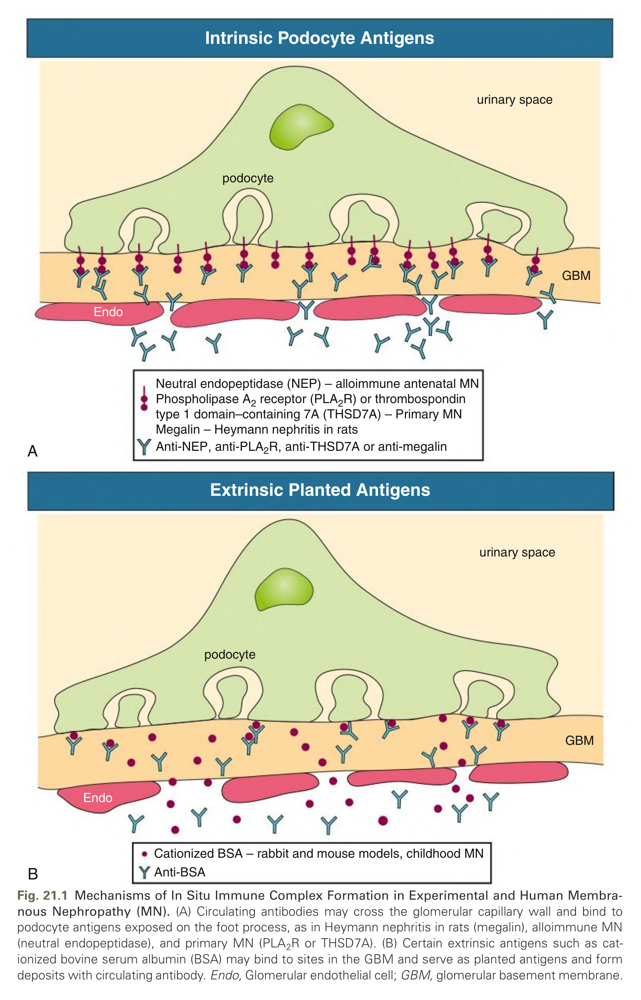

Fig. 21.1 Mechanisms of In Situ Immune Complex Formation in Experimental and Human Membranous Nephropathy (MN). (A) Circulating antibodies may cross the glomerular capillary wall and bind to podocyte antigens exposed on the foot process, as in Heymann nephritis in rats (megalin), alloimmune MN (neutral endopeptidase), and primary MN (PLA2R or THSD7A). (B) Certain extrinsic antigens such as cationized bovine serum albumin (BSA) may bind to sites in the GBM and serve as planted antigens and form deposits with circulating antibody. Endo, Glomerular endothelial cell; GBM, glomerular basement membrane.

---

### Fig_21_2

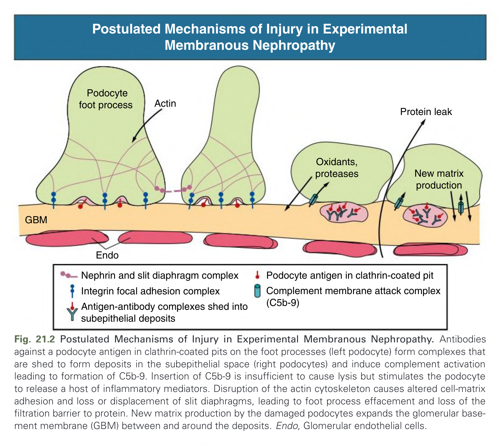

Fig. 21.2 Postulated Mechanisms of Injury in Experimental Membranous Nephropathy. Antibodies against a podocyte antigen in clathrin-coated pits on the foot processes (left podocyte) form complexes that are shed to form deposits in the subepithelial space (right podocytes) and induce complement activation leading to formation of C5b-9. Insertion of C5b-9 is insufficient to cause lysis but stimulates the podocyte to release a host of inflammatory mediators. Disruption of the actin cytoskeleton causes altered cell-matrix adhesion and loss or displacement of slit diaphragms, leading to foot process effacement and loss of the filtration barrier to protein. New matrix production by the damaged podocytes expands the glomerular basement membrane (GBM) between and around the deposits. Endo, Glomerular endothelial cells.

---

### Fig_21_3

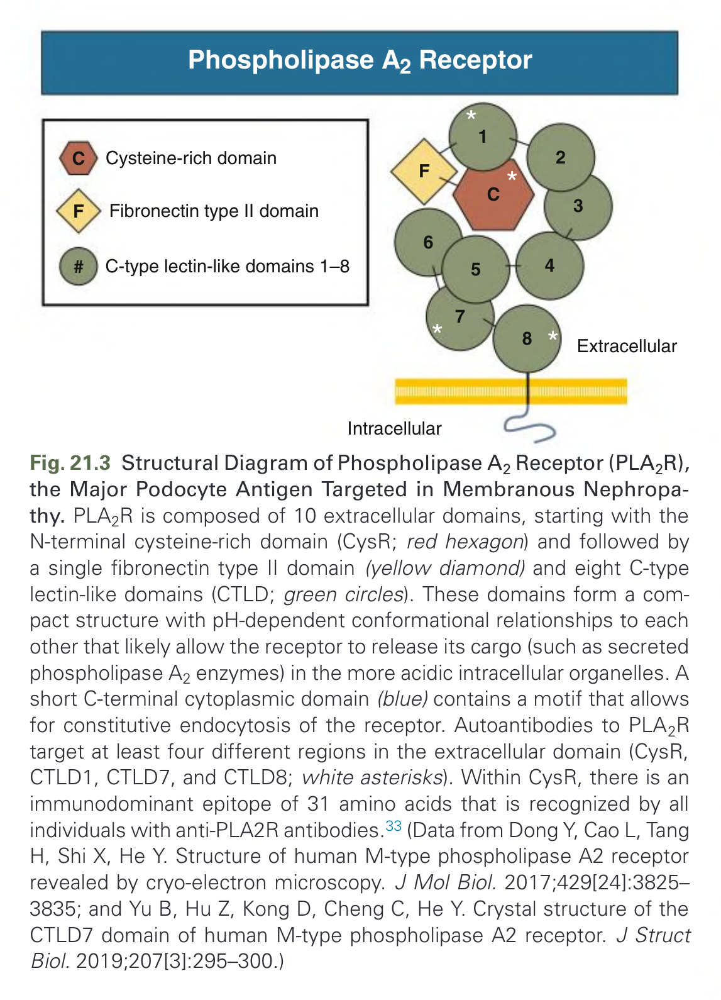

Fig. 21.3 Structural Diagram of Phospholipase A2 Receptor (PLA2R), the Major Podocyte Antigen Targeted in Membranous Nephropathy. PLA2R is composed of 10 extracellular domains, starting with the N-terminal cysteine-rich domain (CysR; red hexagon) and followed by a single fibronectin type II domain (yellow diamond) and eight C-type lectin-like domains (CTLD; green circles). These domains form a compact structure with pH-dependent conformational relationships to each other that likely allow the receptor to release its cargo (such as secreted phospholipase A2 enzymes) in the more acidic intracellular organelles. A short C-terminal cytoplasmic domain (blue) contains a motif that allows for constitutive endocytosis of the receptor. Autoantibodies to PLA2R target at least four different regions in the extracellular domain (CysR, CTLD1, CTLD7, and CTLD8; white asterisks). Within CysR, there is an immunodominant epitope of 31 amino acids that is recognized by all individuals with anti-PLA2R antibodies.33 (Data from Dong Y, Cao L, Tang H, Shi X, He Y. Structure of human M-type phospholipase A2 receptor revealed by cryo-electron microscopy. J Mol Biol. 2017;429[24]:3825-3835; and Yu B, Hu Z, Kong D, Cheng C, He Y. Crystal structure of the CTLD7 domain of human M-type phospholipase A2 receptor. J Struct Biol. 2019;207[3]:295-300.)

---

### Fig_21_4

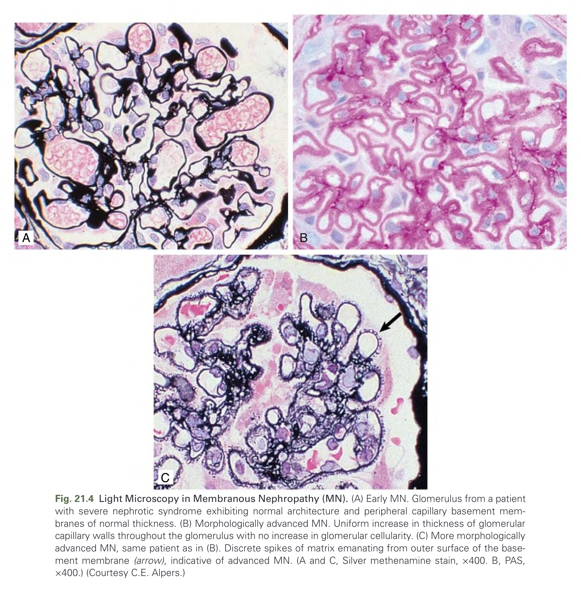

Fig. 21.4 Light Microscopy in Membranous Nephropathy (MN). (A) Early MN. Glomerulus from a patient with severe nephrotic syndrome exhibiting normal architecture and peripheral capillary basement membranes of normal thickness. (B) Morphologically advanced MN. Uniform increase in thickness of glomerular capillary walls throughout the glomerulus with no increase in glomerular cellularity. (C) More morphologically advanced MN, same patient as in (B). Discrete spikes of matrix emanating from outer surface of the basement membrane (arrow), indicative of advanced MN. (A and C, Silver methenamine stain, x400. B, PAS, x400.) (Courtesy C.E. Alpers.)

---

### Fig_21_5

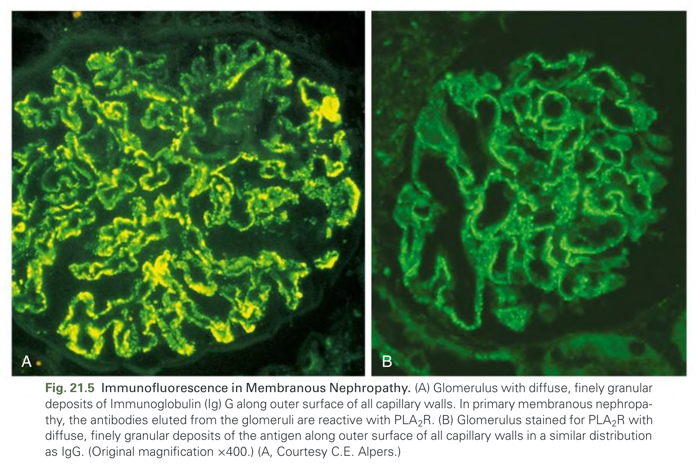

Fig. 21.5 Immunofluorescence in Membranous Nephropathy. (A) Glomerulus with diffuse, finely granular deposits of Immunoglobulin (Ig) G along outer surface of all capillary walls. In primary membranous nephropathy, the antibodies eluted from the glomeruli are reactive with PLA2R. (B) Glomerulus stained for PLA2R with diffuse, finely granular deposits of the antigen along outer surface of all capillary walls in a similar distribution as IgG. (Original magnification ×400.) (A, Courtesy C.E. Alpers.)

---

### Fig_21_6

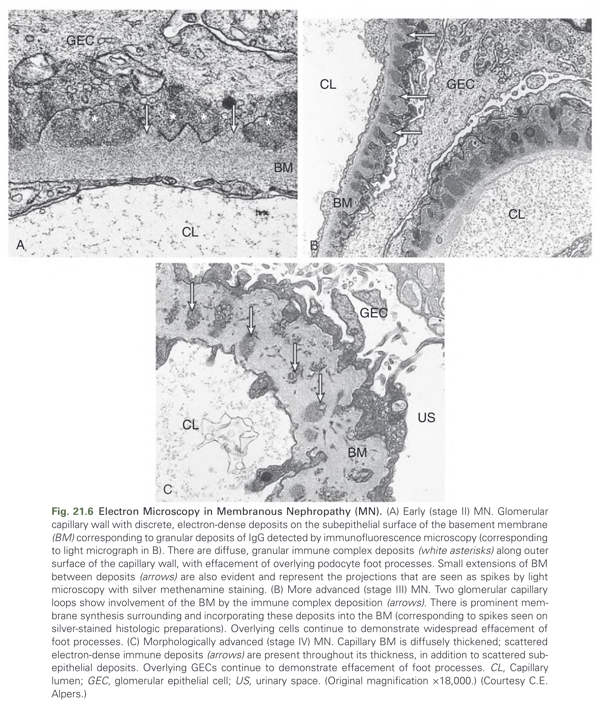

Fig. 21.6 Electron Microscopy in Membranous Nephropathy (MN). (A) Early (stage II) MN. Glomerular capillary wall with discrete, electron-dense deposits on the subepithelial surface of the basement membrane (BM) corresponding to granular deposits of IgG detected by immunofluorescence microscopy (corresponding to light micrograph in B). There are diffuse, granular immune complex deposits (white asterisks) along outer surface of the capillary wall, with effacement of overlying podocyte foot processes. Small extensions of BM between deposits (arrows) are also evident and represent the projections that are seen as spikes by light microscopy with silver methenamine staining. (B) More advanced (stage III) MN. Two glomerular capillary loops show involvement of the BM by the immune complex deposition (arrows). There is prominent membrane synthesis surrounding and incorporating these deposits into the BM (corresponding to spikes seen on silver-stained histologic preparations). Overlying cells continue to demonstrate widespread effacement of foot processes. (C) Morphologically advanced (stage IV) MN. Capillary BM is diffusely thickened; scattered electron-dense immune deposits (arrows) are present throughout its thickness, in addition to scattered subepithelial deposits. Overlying GECs continue to demonstrate effacement of foot processes. CL, Capillary lumen; GEC, glomerular epithelial cell; US, urinary space. (Original magnification ×18,000.) (Courtesy C.E. Alpers.)

---

### Fig_21_7

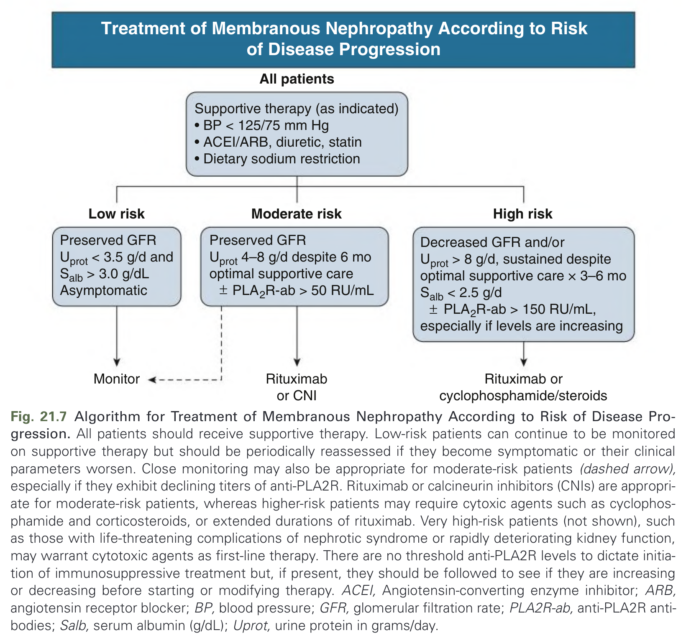

Fig. 21.7 Algorithm for Treatment of Membranous Nephropathy According to Risk of Disease Progression. All patients should receive supportive therapy. Low-risk patients can continue to be monitored on supportive therapy but should be periodically reassessed if they become symptomatic or their clinical parameters worsen. Close monitoring may also be appropriate for moderate-risk patients (dashed arrow), especially if they exhibit declining titers of anti-PLA2R. Rituximab or calcineurin inhibitors (CNIs) are appropriate for moderate-risk patients, whereas higher-risk patients may require cytoxic agents such as cyclophosphamide and corticosteroids, or extended durations of rituximab. Very high-risk patients (not shown), such as those with life-threatening complications of nephrotic syndrome or rapidly deteriorating kidney function, may warrant cytotoxic agents as first-line therapy. There are no threshold anti-PLA2R levels to dictate initiation of immunosuppressive treatment but, if present, they should be followed to see if they are increasing or decreasing before starting or modifying therapy. ACEI, Angiotensin-converting enzyme inhibitor; ARB, angiotensin receptor blocker; BP, blood pressure; GFR, glomerular filtration rate; PLA2R-ab, anti-PLA2R antibodies; Salb, serum albumin (g/dL); Uprot, urine protein in grams/day.

---

### Fig_21_8

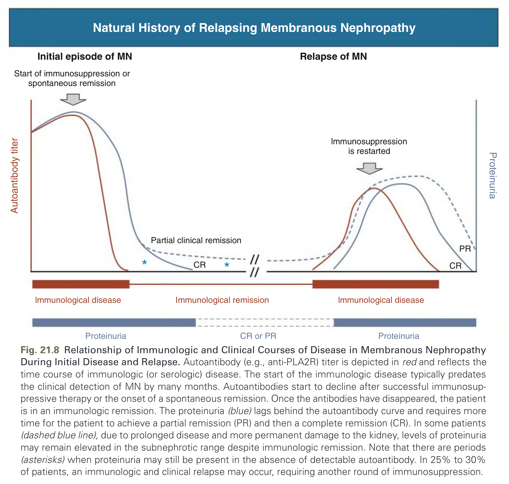

Fig. 21.8 Relationship of Immunologic and Clinical Courses of Disease in Membranous Nephropathy During Initial Disease and Relapse. Autoantibody (e.g., anti-PLA2R) titer is depicted in red and reflects the time course of immunologic (or serologic) disease. The start of the immunologic disease typically predates the clinical detection of MN by many months. Autoantibodies start to decline after successful immunosuppressive therapy or the onset of a spontaneous remission. Once the antibodies have disappeared, the patient is in an immunologic remission. The proteinuria (blue) lags behind the autoantibody curve and requires more time for the patient to achieve a partial remission (PR) and then a complete remission (CR). In some patients (dashed blue line), due to prolonged disease and more permanent damage to the kidney, levels of proteinuria may remain elevated in the subnephrotic range despite immunologic remission. Note that there are periods (asterisks) when proteinuria may still be present in the absence of detectable autoantibody. In 25% to 30% of patients, an immunologic and clinical relapse may occur, requiring another round of immunosuppression.

---

## Tables

### Table_21_1

#### Table Image

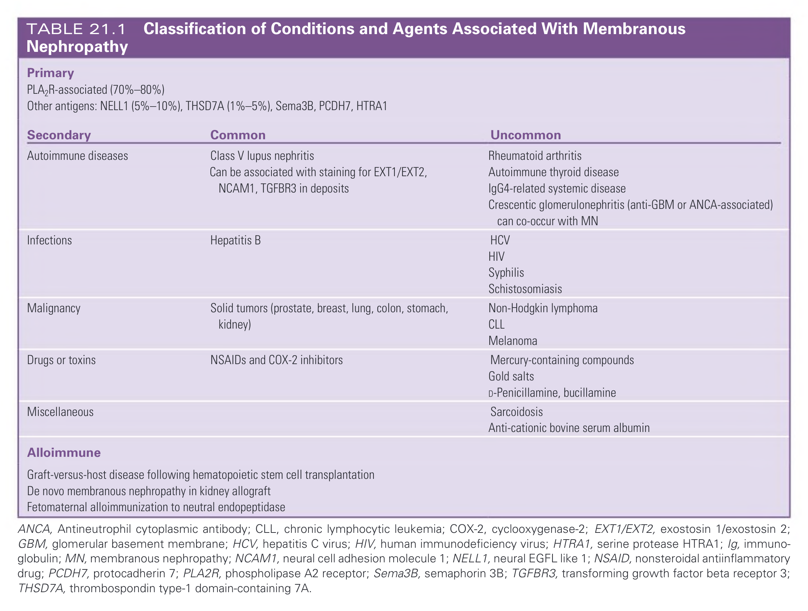

#### Table Data (CSV: [Table_21_1.csv](Table_21_1.csv))

```markdown
**Primary**
PLA2R-associated (70%-80%)
Other antigens: NELL1 (5%-10%), THSD7A (1%-5%), Sema3B, PCDH7, HTRA1

**Secondary**
| Category | Common | Uncommon |
| :--- | :--- | :--- |
| **Autoimmune diseases** | Class V lupus nephritis<br>Can be associated with staining for EXT1/EXT2, NCAM1, TGFBR3 in deposits | Rheumatoid arthritis<br>Autoimmune thyroid disease<br>IgG4-related systemic disease<br>Crescentic glomerulonephritis (anti-GBM or ANCA-associated) can co-occur with MN |
| **Infections** | Hepatitis B | HCV<br>HIV<br>Syphilis<br>Schistosomiasis |
| **Malignancy** | Solid tumors (prostate, breast, lung, colon, stomach, kidney) | Non-Hodgkin lymphoma<br>CLL<br>Melanoma |
| **Drugs or toxins** | NSAIDs and COX-2 inhibitors | Mercury-containing compounds<br>Gold salts<br>D-Penicillamine, bucillamine |
| **Miscellaneous** | | Sarcoidosis<br>Anti-cationic bovine serum albumin |
| **Alloimmune** | Graft-versus-host disease following hematopoietic stem cell transplantation<br>De novo membranous nephropathy in kidney allograft<br>Fetomaternal alloimmunization to neutral endopeptidase | |

ANCA, Antineutrophil cytoplasmic antibody; CLL, chronic lymphocytic leukemia; COX-2, cyclooxygenase-2; EXT1/EXT2, exostosin 1/exostosin 2; GBM, glomerular basement membrane; HCV, hepatitis C virus; HIV, human immunodeficiency virus; HTRA1, serine protease HTRA1; Ig, immunoglobulin; MN, membranous nephropathy; NCAM1, neural cell adhesion molecule 1; NELL1, neural EGFL like 1; NSAID, nonsteroidal antiinflammatory drug; PCDH7, protocadherin 7; PLA2R, phospholipase A2 receptor; Sema3B, semaphorin 3B; TGFBR3, transforming growth factor beta receptor 3; THSD7A, thrombospondin type-1 domain-containing 7A.
```

TABLE 21.1 Classification of Conditions and Agents Associated With Membranous Nephropathy

---

### Table_21_2

#### Table Image

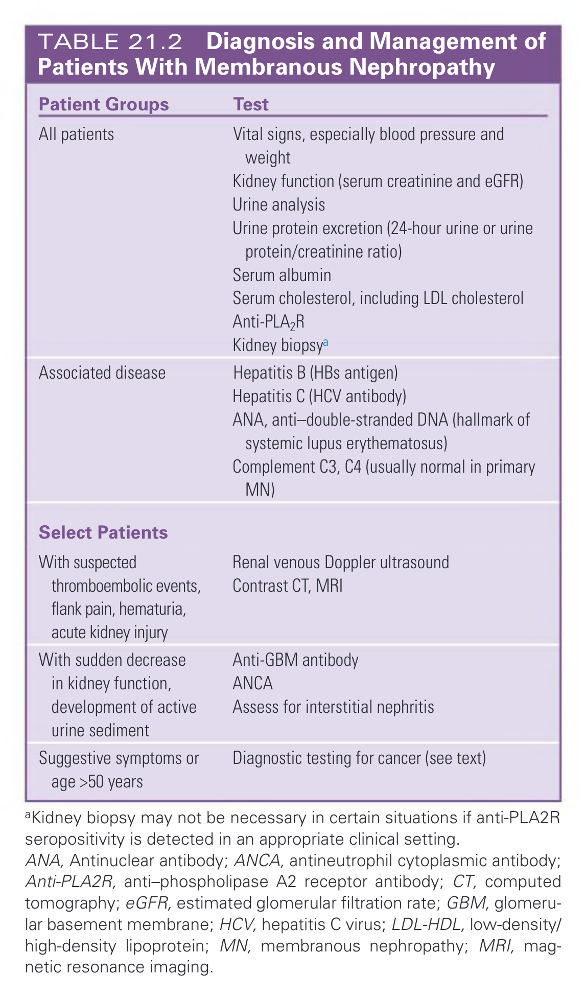

#### Table Data (CSV: [Table_21_2.csv](Table_21_2.csv))

```markdown
| Patient Groups | Test |
| :--- | :--- |
| **All patients** | Vital signs, especially blood pressure and weight<br>Kidney function (serum creatinine and eGFR)<br>Urine analysis<br>Urine protein excretion (24-hour urine or urine protein/creatinine ratio)<br>Serum albumin<br>Serum cholesterol, including LDL cholesterol<br>Anti-PLA2R<br>Kidney biopsya |
| **Associated disease** | Hepatitis B (HBs antigen)<br>Hepatitis C (HCV antibody)<br>ANA, anti-double-stranded DNA (hallmark of systemic lupus erythematosus)<br>Complement C3, C4 (usually normal in primary MN) |
| **Select Patients** | |
| With suspected thromboembolic events, flank pain, hematuria, acute kidney injury | Renal venous Doppler ultrasound<br>Contrast CT, MRI |
| With sudden decrease in kidney function, development of active urine sediment | Anti-GBM antibody<br>ANCA<br>Assess for interstitial nephritis |
| Suggestive symptoms or age >50 years | Diagnostic testing for cancer (see text) |

aKidney biopsy may not be necessary in certain situations if anti-PLA2R seropositivity is detected in an appropriate clinical setting.
ANA, Antinuclear antibody; ANCA, antineutrophil cytoplasmic antibody; Anti-PLA2R, anti-phospholipase A2 receptor antibody; CT, computed tomography; eGFR, estimated glomerular filtration rate; GBM, glomerular basement membrane; HCV, hepatitis C virus; LDL-HDL, low-density/ high-density lipoprotein; MN, membranous nephropathy; MRI, magnetic resonance imaging.
```

TABLE 21.2 Diagnosis and Management of Patients With Membranous Nephropathy

---

### Table_21_3

#### Table Image

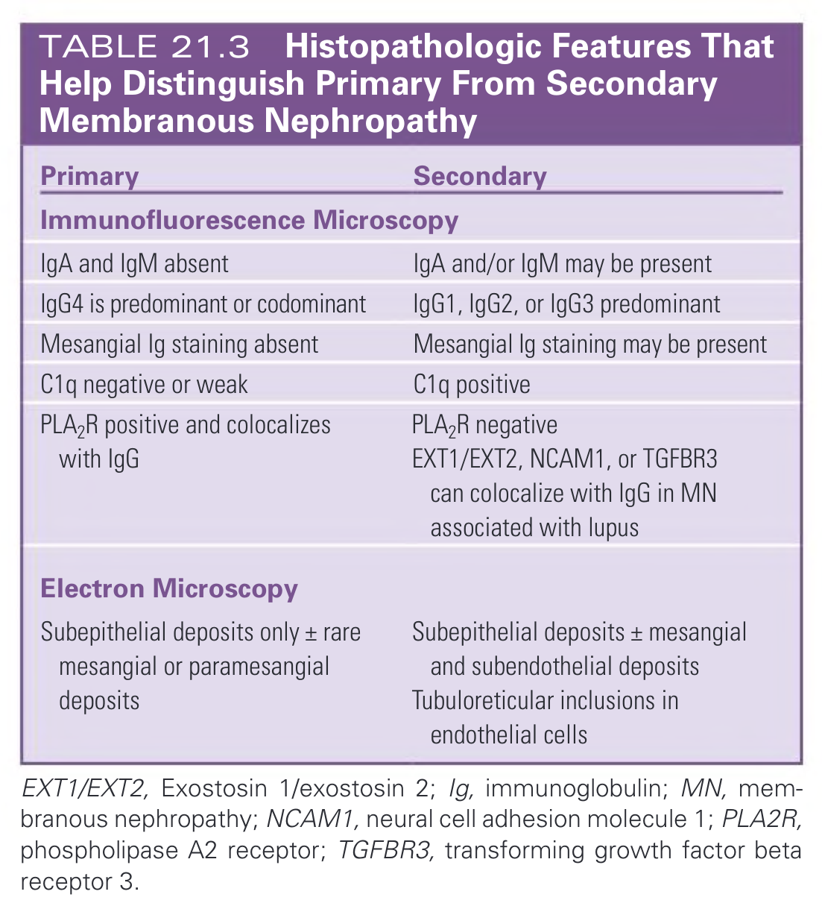

#### Table Data (CSV: [Table_21_3.csv](Table_21_3.csv))

```markdown
| Primary | Secondary |
| :--- | :--- |
| **Immunofluorescence Microscopy** | |
| IgA and IgM absent | IgA and/or IgM may be present |
| IgG4 is predominant or codominant | IgG1, IgG2, or IgG3 predominant |
| Mesangial Ig staining absent | Mesangial Ig staining may be present |
| C1q negative or weak | C1q positive |
| PLA₂R positive and colocalizes with IgG | PLA₂R negative<br>EXT1/EXT2, NCAM1, or TGFBR3 can colocalize with IgG in MN associated with lupus |
| **Electron Microscopy** | |
| Subepithelial deposits only ± rare mesangial or paramesangial deposits | Subepithelial deposits ± mesangial and subendothelial deposits<br>Tubuloreticular inclusions in endothelial cells |

EXT1/EXT2, Exostosin 1/exostosin 2; Ig, immunoglobulin; MN, membranous nephropathy; NCAM1, neural cell adhesion molecule 1; PLA2R, phospholipase A2 receptor; TGFBR3, transforming growth factor beta receptor 3.
```

TABLE 21.3 Histopathologic Features That Help Distinguish Primary From Secondary Membranous Nephropathy

---

### Table_21_4

#### Table Image

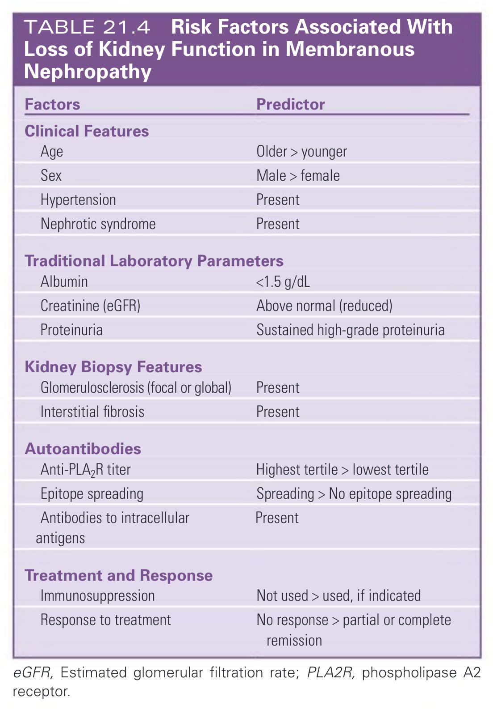

#### Table Data (CSV: [Table_21_4.csv](Table_21_4.csv))

```markdown
| Factors | Predictor |
| :--- | :--- |
| **Clinical Features** | |
| Age | Older > younger |
| Sex | Male > female |
| Hypertension | Present |
| Nephrotic syndrome | Present |
| **Traditional Laboratory Parameters** | |
| Albumin | <1.5 g/dL |
| Creatinine (eGFR) | Above normal (reduced) |
| Proteinuria | Sustained high-grade proteinuria |
| **Kidney Biopsy Features** | |
| Glomerulosclerosis (focal or global) | Present |
| Interstitial fibrosis | Present |
| **Autoantibodies** | |
| Anti-PLA2R titer | Highest tertile > lowest tertile |
| Epitope spreading | Spreading > No epitope spreading |
| Antibodies to intracellular antigens | Present |
| **Treatment and Response** | |
| Immunosuppression | Not used > used, if indicated |
| Response to treatment | No response > partial or complete remission |

eGFR, Estimated glomerular filtration rate; PLA2R, phospholipase A2 receptor.
```

TABLE 21.4 Risk Factors Associated With Loss of Kidney Function in Membranous Nephropathy

---

## Boxes

### Box_21_1

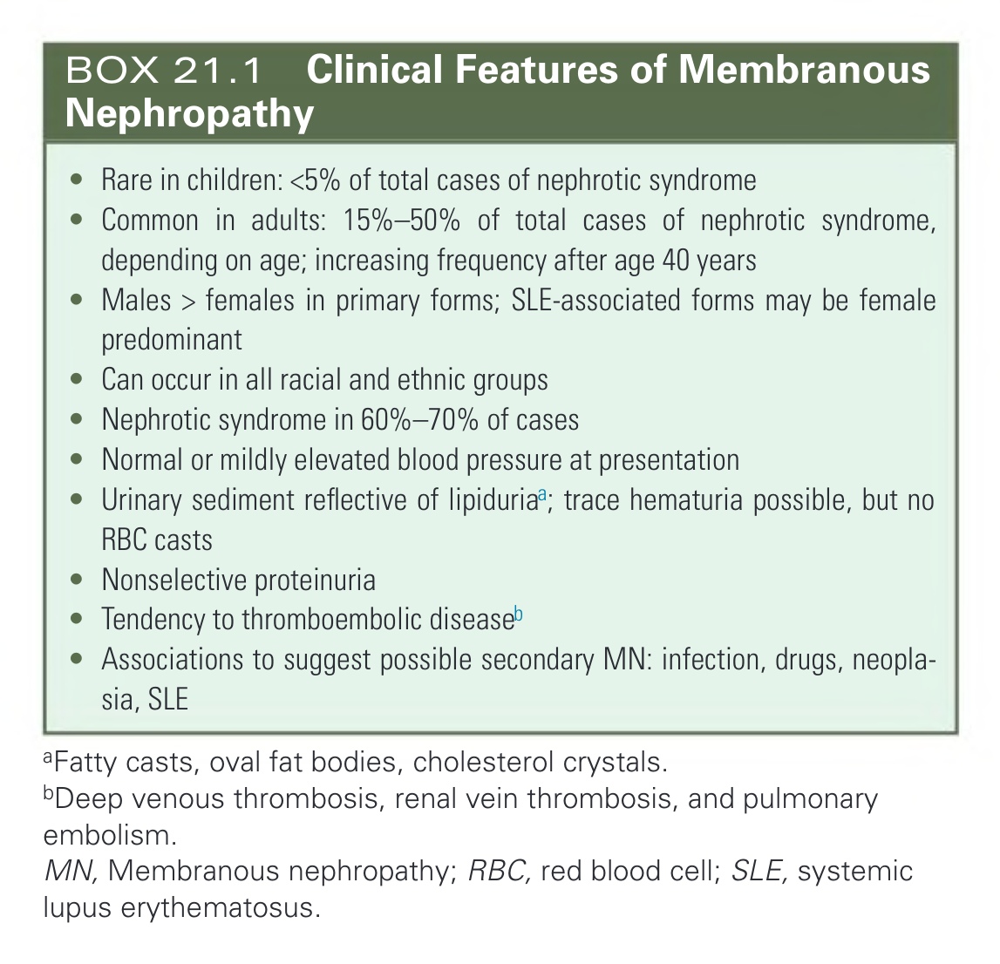

#### Box Text

```markdown
* Rare in children: <5% of total cases of nephrotic syndrome
* Common in adults: 15%-50% of total cases of nephrotic syndrome, depending on age; increasing frequency after age 40 years
* Males > females in primary forms; SLE-associated forms may be female predominant
* Can occur in all racial and ethnic groups
* Nephrotic syndrome in 60%-70% of cases
* Normal or mildly elevated blood pressure at presentation
* Urinary sediment reflective of lipiduriaa; trace hematuria possible, but no RBC casts
* Nonselective proteinuria
* Tendency to thromboembolic diseaseb
* Associations to suggest possible secondary MN: infection, drugs, neoplasia, SLE

aFatty casts, oval fat bodies, cholesterol crystals.
bDeep venous thrombosis, renal vein thrombosis, and pulmonary embolism.
MN, Membranous nephropathy; RBC, red blood cell; SLE, systemic lupus erythematosus.
```

BOX 21.1 Clinical Features of Membranous Nephropathy

---
