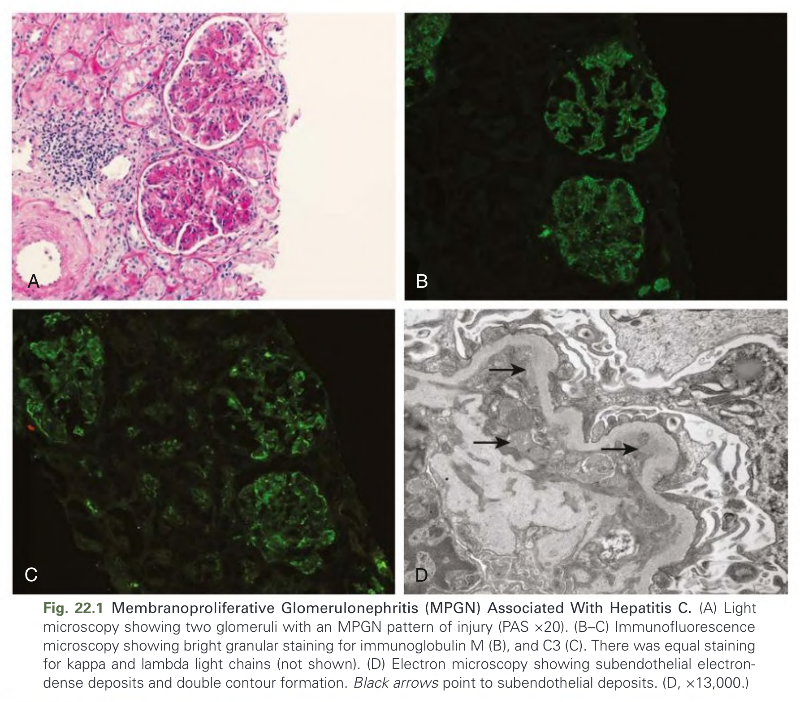
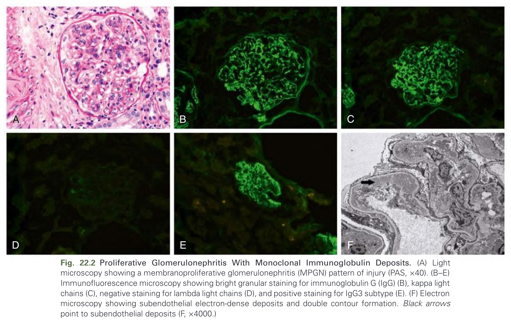
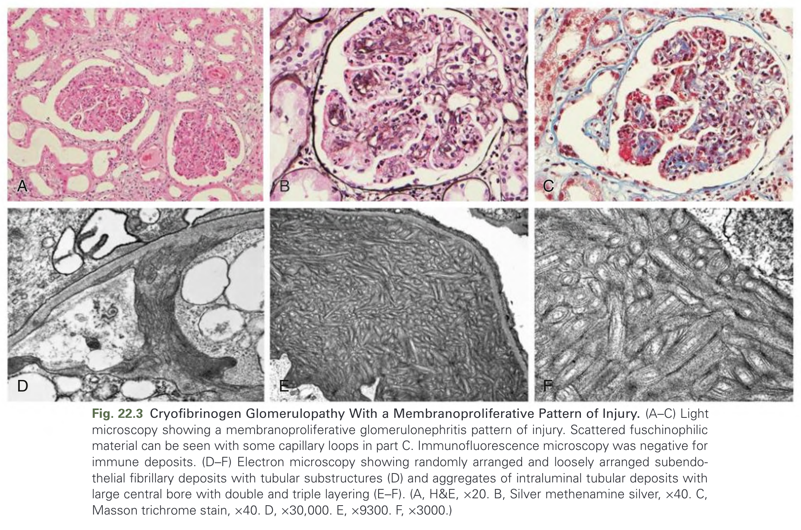
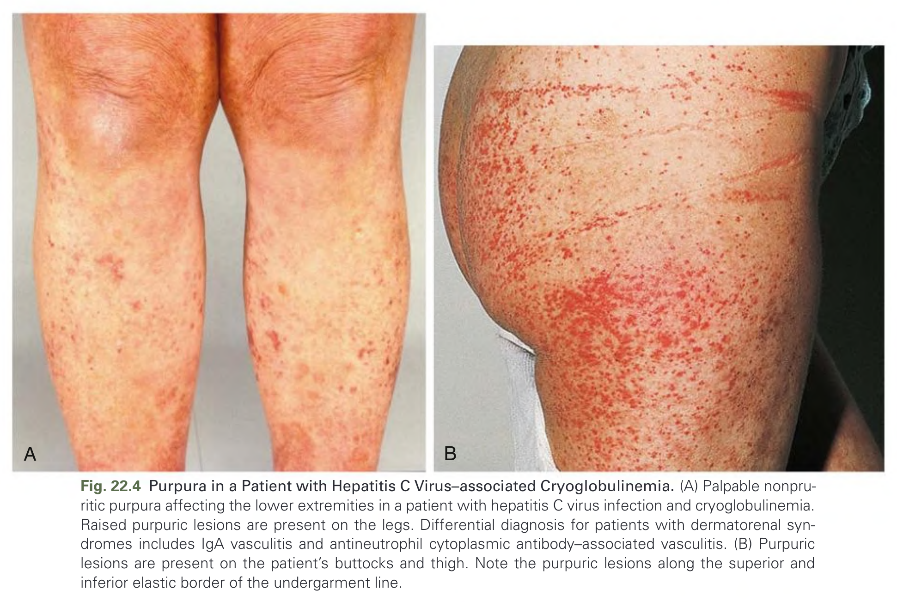
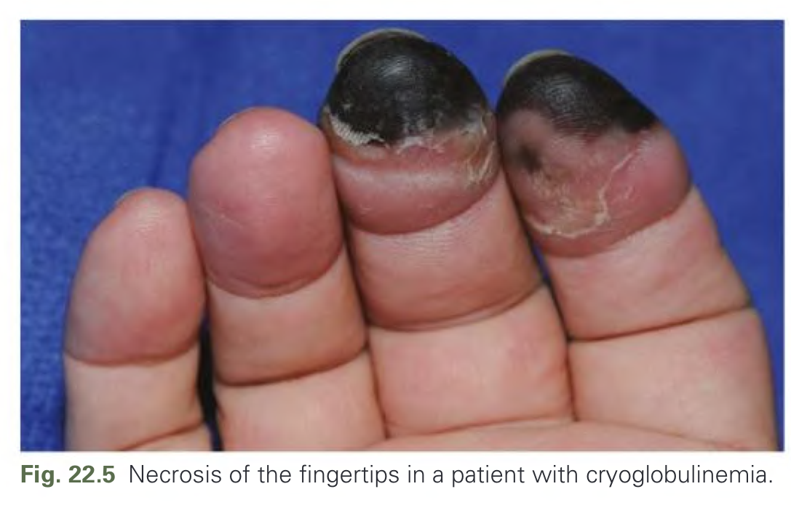
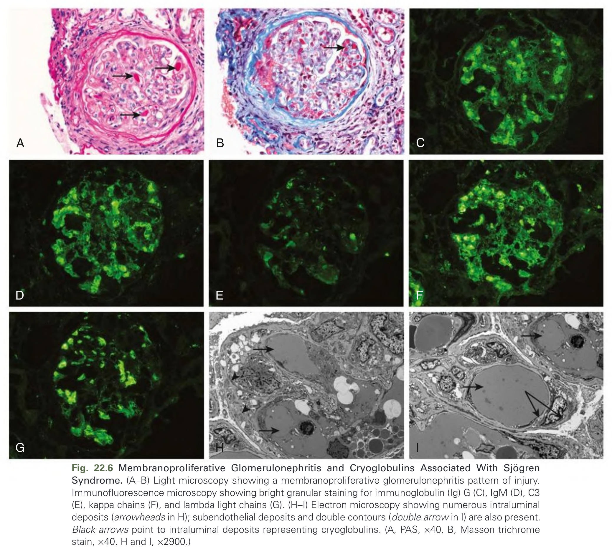
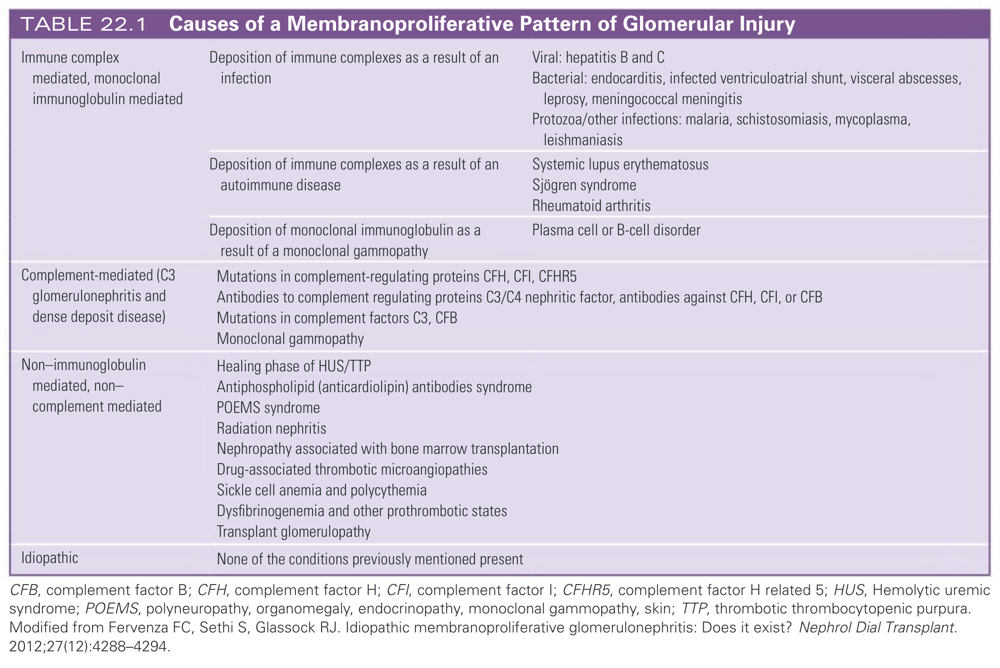
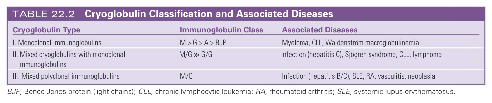
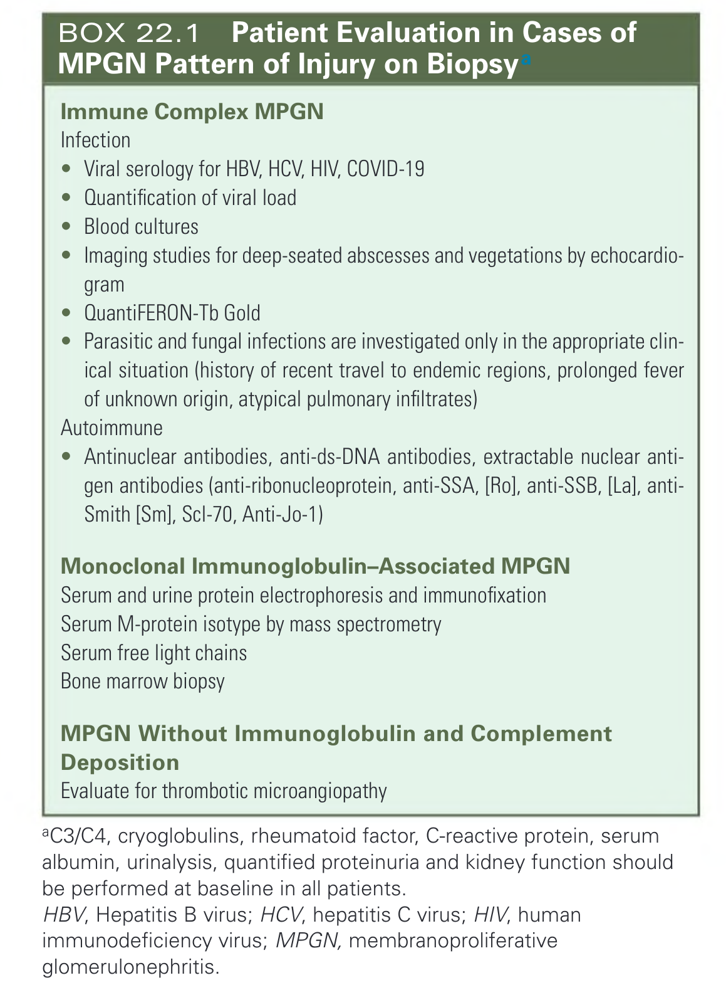

# 022. Immunoglobulin-Mediated Glomerulonephritis With a Membranoproliferative Pattern of Injury and Cryoglobulinemic Glomerulonephritis - Figures and Tables Index

This document lists all figures, tables and boxes extracted from `022. Immunoglobulin-Mediated Glomerulonephritis With a Membranoproliferative Pattern of Injury and Cryoglobulinemic Glomerulonephritis.pdf`.

## Table of Contents
- [Figures](#figures)
- [Tables](#tables)
- [Boxes](#boxes)

---

## Figures

### Fig_22_1



Fig. 22.1 Membranoproliferative Glomerulonephritis (MPGN) Associated With Hepatitis C. (A) Light microscopy showing two glomeruli with an MPGN pattern of injury (PAS ×20). (B-C) Immunofluorescence microscopy showing bright granular staining for immunoglobulin M (B), and C3 (C). There was equal staining for kappa and lambda light chains (not shown). (D) Electron microscopy showing subendothelial electron-dense deposits and double contour formation. Black arrows point to subendothelial deposits. (D, ×13,000.)

---

### Fig_22_2



Fig. 22.2 Proliferative Glomerulonephritis With Monoclonal Immunoglobulin Deposits. (A) Light microscopy showing a membranoproliferative glomerulonephritis (MPGN) pattern of injury (PAS, ×40). (B-E) Immunofluorescence microscopy showing bright granular staining for immunoglobulin G (IgG) (B), kappa light chains (C), negative staining for lambda light chains (D), and positive staining for IgG3 subtype (E). (F) Electron microscopy showing subendothelial electron-dense deposits and double contour formation. Black arrows point to subendothelial deposits (F, ×4000.)

---

### Fig_22_3



Fig. 22.3 Cryofibrinogen Glomerulopathy With a Membranoproliferative Pattern of Injury. (A-C) Light microscopy showing a membranoproliferative glomerulonephritis pattern of injury. Scattered fuschinophilic material can be seen with some capillary loops in part C. Immunofluorescence microscopy was negative for immune deposits. (D-F) Electron microscopy showing randomly arranged and loosely arranged subendothelial fibrillary deposits with tubular substructures (D) and aggregates of intraluminal tubular deposits with large central bore with double and triple layering (E-F). (A, H&E, ×20. B, Silver methenamine silver, ×40. C, Masson trichrome stain, ×40. D, ×30,000. E, ×9300. F, ×3000.)

---

### Fig_22_4



Fig. 22.4 Purpura in a Patient with Hepatitis C Virus–associated Cryoglobulinemia. (A) Palpable nonpruritic purpura affecting the lower extremities in a patient with hepatitis C virus infection and cryoglobulinemia. Raised purpuric lesions are present on the legs. Differential diagnosis for patients with dermatorenal syndromes includes IgA vasculitis and antineutrophil cytoplasmic antibody–associated vasculitis. (B) Purpuric lesions are present on the patient’s buttocks and thigh. Note the purpuric lesions along the superior and inferior elastic border of the undergarment line.

---

### Fig_22_5



Fig. 22.5 Necrosis of the fingertips in a patient with cryoglobulinemia.

---

### Fig_22_6



Fig. 22.6 Membranoproliferative Glomerulonephritis and Cryoglobulins Associated With Sjögren Syndrome. (A–B) Light microscopy showing a membranoproliferative glomerulonephritis pattern of injury. Immunofluorescence microscopy showing bright granular staining for immunoglobulin (Ig) G (C), IgM (D), C3 (E), kappa chains (F), and lambda light chains (G). (H–I) Electron microscopy showing numerous intraluminal deposits (arrowheads in H); subendothelial deposits and double contours (double arrow in I) are also present. Black arrows point to intraluminal deposits representing cryoglobulins. (A, PAS, x40. B, Masson trichrome stain, x40. H and I, x2900.)

---

## Tables

### Table_22_1

#### Table Image



#### Table Data (CSV: [Table_22_1.csv](Table_22_1.csv))

```markdown
| | | |
| :--- | :--- | :--- |
| **Immune complex mediated, monoclonal immunoglobulin mediated** | Deposition of immune complexes as a result of an infection | Viral: hepatitis B and C<br>Bacterial: endocarditis, infected ventriculoatrial shunt, visceral abscesses, leprosy, meningococcal meningitis<br>Protozoa/other infections: malaria, schistosomiasis, mycoplasma, leishmaniasis |
| | Deposition of immune complexes as a result of an autoimmune disease | Systemic lupus erythematosus<br>Sjögren syndrome<br>Rheumatoid arthritis |
| | Deposition of monoclonal immunoglobulin as a result of a monoclonal gammopathy | Plasma cell or B-cell disorder |
| **Complement-mediated (C3 glomerulonephritis and dense deposit disease)** | Mutations in complement-regulating proteins CFH, CFI, CFHR5<br>Antibodies to complement regulating proteins C3/C4 nephritic factor, antibodies against CFH, CFI, or CFB<br>Mutations in complement factors C3, CFB<br>Monoclonal gammopathy | |
| **Non-immunoglobulin mediated, non-complement mediated** | Healing phase of HUS/TTP<br>Antiphospholipid (anticardiolipin) antibodies syndrome<br>POEMS syndrome<br>Radiation nephritis<br>Nephropathy associated with bone marrow transplantation<br>Drug-associated thrombotic microangiopathies<br>Sickle cell anemia and polycythemia<br>Dysfibrinogenemia and other prothrombotic states<br>Transplant glomerulopathy | |
| **Idiopathic** | None of the conditions previously mentioned present | |

CFB, complement factor B; CFH, complement factor H; CFI, complement factor I; CFHR5, complement factor H related 5; HUS, Hemolytic uremic syndrome; POEMS, polyneuropathy, organomegaly, endocrinopathy, monoclonal gammopathy, skin; TTP, thrombotic thrombocytopenic purpura. Modified from Fervenza FC, Sethi S, Glassock RJ. Idiopathic membranoproliferative glomerulonephritis: Does it exist? Nephrol Dial Transplant. 2012;27(12):4288-4294.
```

TABLE 22.1 Causes of a Membranoproliferative Pattern of Glomerular Injury CFB, complement factor B; CFH, complement factor H; CFI, complement factor I; CFHR5, complement factor H related 5; HUS, Hemolytic uremic syndrome; POEMS, polyneuropathy, organomegaly, endocrinopathy, monoclonal gammopathy, skin; TTP, thrombotic thrombocytopenic purpura. Modified from Fervenza FC, Sethi S, Glassock RJ. Idiopathic membranoproliferative glomerulonephritis: Does it exist? Nephrol Dial Transplant. 2012;27(12):4288-4294.

---

### Table_22_2

#### Table Image



#### Table Data (CSV: [Table_22_2.csv](Table_22_2.csv))

```markdown
| Cryoglobulin Type | Immunoglobulin Class | Associated Diseases |
| :--- | :--- | :--- |
| I. Monoclonal immunoglobulins | M > G > A > BJP | Myeloma, CLL, Waldenström macroglobulinemia |
| II. Mixed cryoglobulins with monoclonal immunoglobulins | M/G » G/G | Infection (hepatitis C), Sjögren syndrome, CLL, lymphoma |
| III. Mixed polyclonal immunoglobulins | M/G | Infection (hepatitis B/C), SLE, RA, vasculitis, neoplasia |

BJP, Bence Jones protein (light chains); CLL, chronic lymphocytic leukemia; RA, rheumatoid arthritis; SLE, systemic lupus erythematosus.
```

TABLE 22.2 Cryoglobulin Classification and Associated Diseases
BJP, Bence Jones protein (light chains); CLL, chronic lymphocytic leukemia; RA, rheumatoid arthritis; SLE, systemic lupus erythematosus.

---

## Boxes

### Box_22_1



#### Box Text

```markdown
**Immune Complex MPGN**
**Infection**
* Viral serology for HBV, HCV, HIV, COVID-19
* Quantification of viral load
* Blood cultures
* Imaging studies for deep-seated abscesses and vegetations by echocardiogram
* QuantiFERON-Tb Gold
* Parasitic and fungal infections are investigated only in the appropriate clinical situation (history of recent travel to endemic regions, prolonged fever of unknown origin, atypical pulmonary infiltrates)

**Autoimmune**
* Antinuclear antibodies, anti-ds-DNA antibodies, extractable nuclear antigen antibodies (anti-ribonucleoprotein, anti-SSA, [Ro], anti-SSB, [La], anti-Smith [Sm], Scl-70, Anti-Jo-1)

**Monoclonal Immunoglobulin-Associated MPGN**
Serum and urine protein electrophoresis and immunofixation
Serum M-protein isotype by mass spectrometry
Serum free light chains
Bone marrow biopsy

**MPGN Without Immunoglobulin and Complement Deposition**
Evaluate for thrombotic microangiopathy

aC3/C4, cryoglobulins, rheumatoid factor, C-reactive protein, serum albumin, urinalysis, quantified proteinuria and kidney function should be performed at baseline in all patients.
HBV, Hepatitis B virus; HCV, hepatitis C virus; HIV, human immunodeficiency virus; MPGN, membranoproliferative glomerulonephritis.
```

BOX 22.1 Patient Evaluation in Cases of MPGN Pattern of Injury on Biopsy Immune Complex MPGN Infection Viral serology for HBV, HCV, HIV, COVID-19 Quantification of viral load Blood cultures Imaging studies for deep-seated abscesses and vegetations by echocardio-gram QuantiFERON-Tb Gold Parasitic and fungal infections are investigated only in the appropriate clin-ical situation (history of recent travel to endemic regions, prolonged fever of unknown origin, atypical pulmonary infiltrates) Autoimmune Antinuclear antibodies, anti-ds-DNA antibodies, extractable nuclear anti-gen antibodies (anti-ribonucleoprotein, anti-SSA, [Ro], anti-SSB, [La], anti-Smith [Sm], Scl-70, Anti-Jo-1) Monoclonal Immunoglobulin-Associated MPGN Serum and urine protein electrophoresis and immunofixation Serum M-protein isotype by mass spectrometry Serum free light chains Bone marrow biopsy MPGN Without Immunoglobulin and Complement Deposition Evaluate for thrombotic microangiopathy aC3/C4, cryoglobulins, rheumatoid factor, C-reactive protein, serum albumin, urinalysis, quantified proteinuria and kidney function should be performed at baseline in all patients. HBV, Hepatitis B virus; HCV, hepatitis C virus; HIV, human immunodeficiency virus; MPGN, membranoproliferative glomerulonephritis.

---
