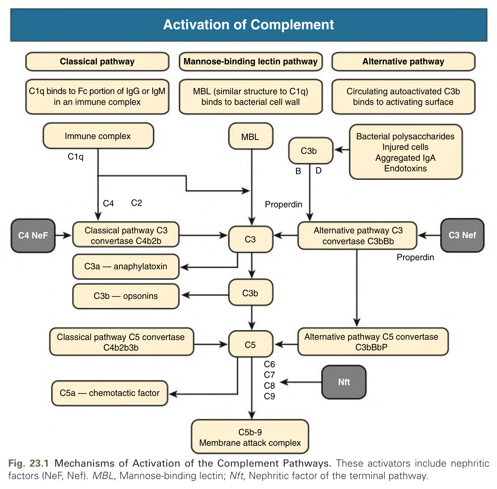
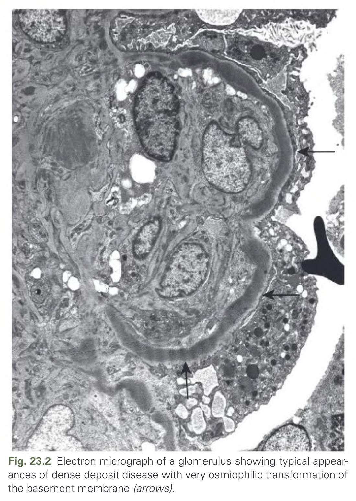
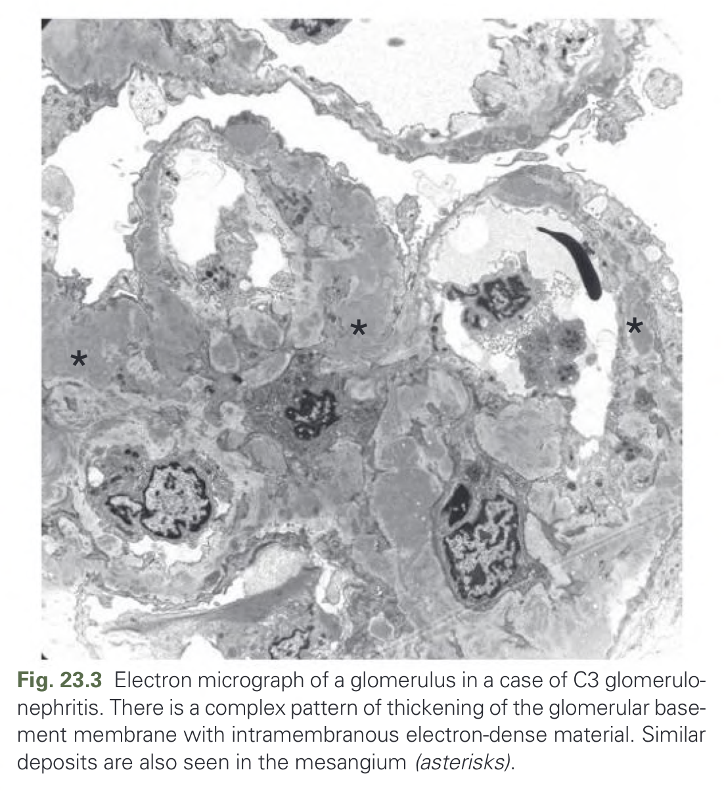
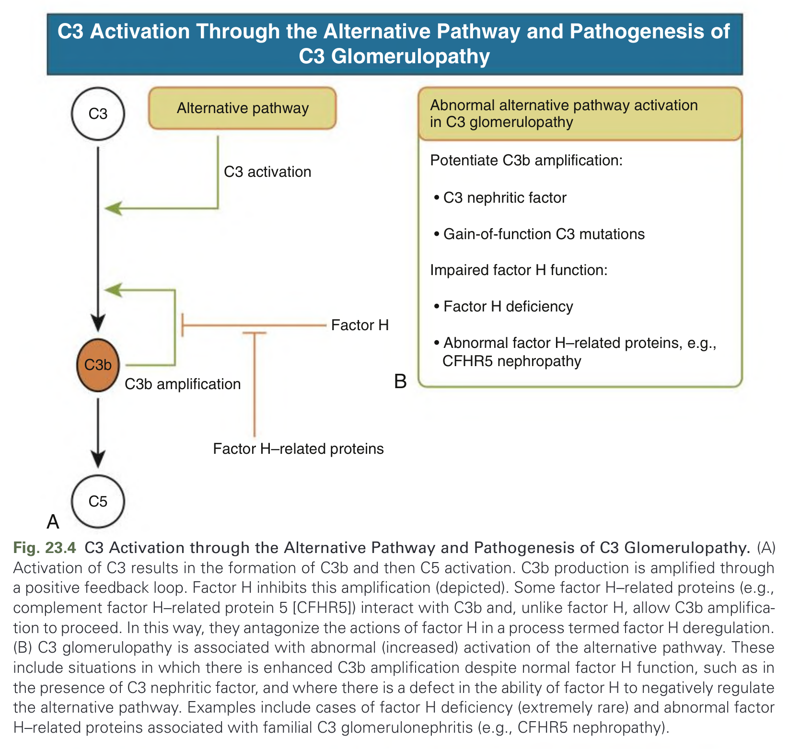
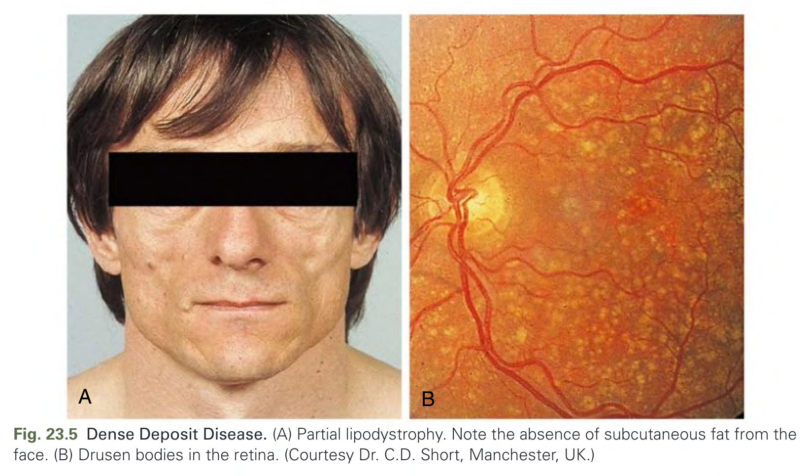
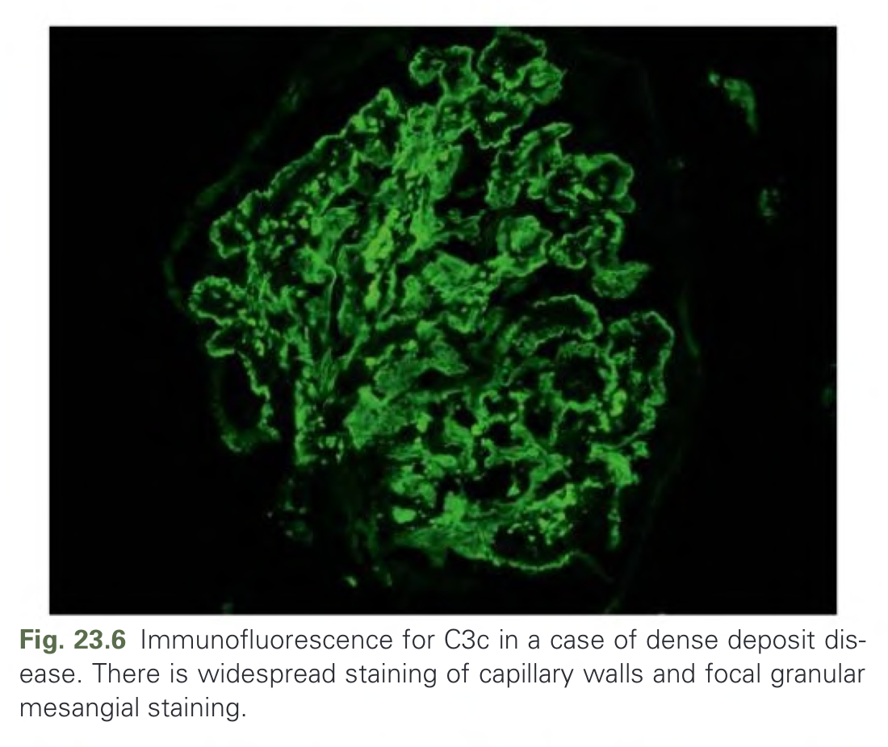
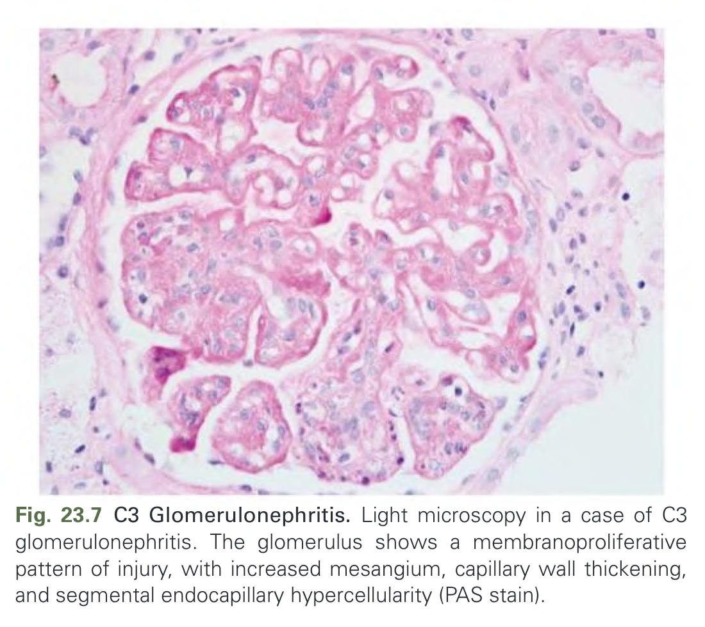
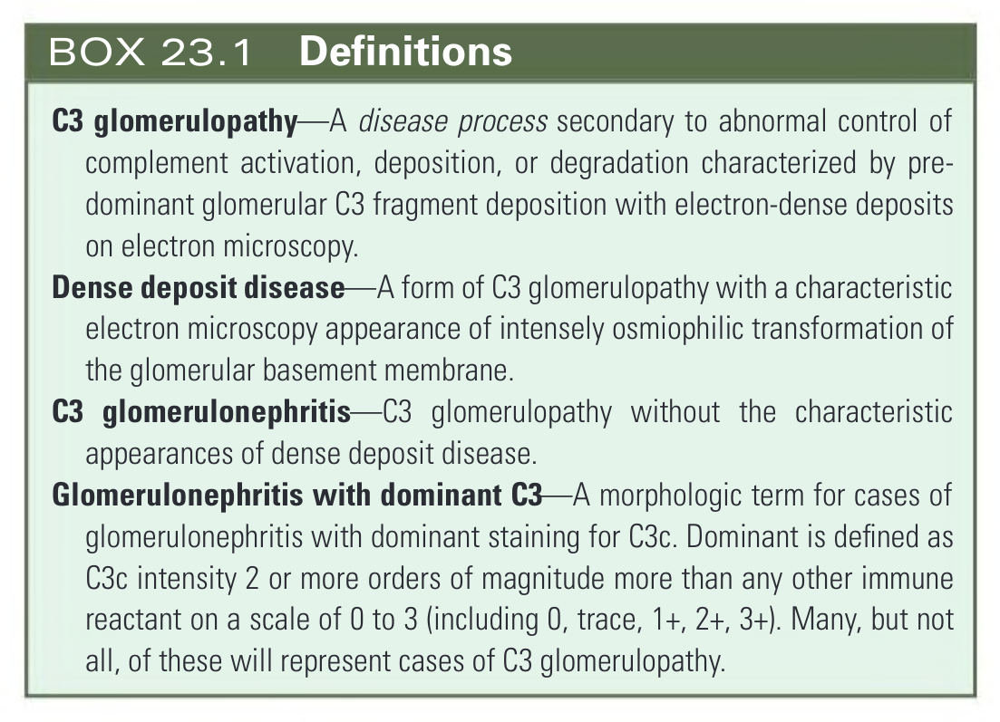
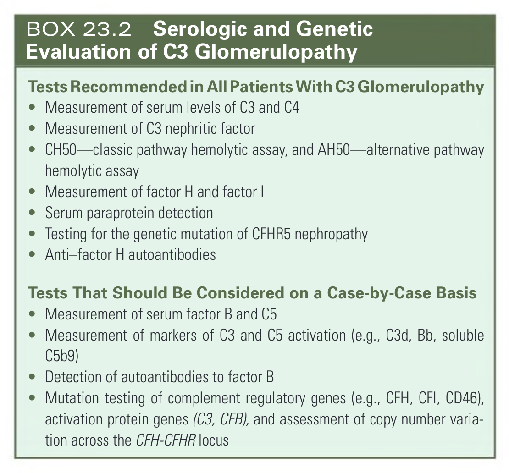

# 023. Glomerulonephritis Associated With Complement Disorders - Figures and Tables Index

This document lists all figures, tables and boxes extracted from `023. Glomerulonephritis Associated With Complement Disorders.pdf`.

## Table of Contents
- [Figures](#figures)
- [Tables](#tables)
- [Boxes](#boxes)

---

## Figures

### Fig_23_1



Fig. 23.1 Mechanisms of Activation of the Complement Pathways. These activators include nephritic factors (NeF, Nef). MBL, Mannose-binding lectin; Nft, Nephritic factor of the terminal pathway.

---

### Fig_23_2



Fig. 23.2 Electron micrograph of a glomerulus showing typical appearances of dense deposit disease with very osmiophilic transformation of the basement membrane (arrows).

---

### Fig_23_3



Fig. 23.3 Electron micrograph of a glomerulus in a case of C3 glomerulonephritis. There is a complex pattern of thickening of the glomerular basement membrane with intramembranous electron-dense material. Similar deposits are also seen in the mesangium (asterisks).

---

### Fig_23_4



Fig. 23.4 C3 Activation through the Alternative Pathway and Pathogenesis of C3 Glomerulopathy. (A) Activation of C3 results in the formation of C3b and then C5 activation. C3b production is amplified through a positive feedback loop. Factor H inhibits this amplification (depicted). Some factor H–related proteins (e.g., complement factor H–related protein 5 [CFHR5]) interact with C3b and, unlike factor H, allow C3b amplification to proceed. In this way, they antagonize the actions of factor H in a process termed factor H deregulation. (B) C3 glomerulopathy is associated with abnormal (increased) activation of the alternative pathway. These include situations in which there is enhanced C3b amplification despite normal factor H function, such as in the presence of C3 nephritic factor, and where there is a defect in the ability of factor H to negatively regulate the alternative pathway. Examples include cases of factor H deficiency (extremely rare) and abnormal factor H–related proteins associated with familial C3 glomerulonephritis (e.g., CFHR5 nephropathy).

---

### Fig_23_5



Fig. 23.5 Dense Deposit Disease. (A) Partial lipodystrophy. Note the absence of subcutaneous fat from the face. (B) Drusen bodies in the retina. (Courtesy Dr. C.D. Short, Manchester, UK.)

---

### Fig_23_6



Fig. 23.6 Immunofluorescence for C3c in a case of dense deposit disease. There is widespread staining of capillary walls and focal granular mesangial staining.

---

### Fig_23_7



Fig. 23.7 C3 Glomerulonephritis. Light microscopy in a case of C3 glomerulonephritis. The glomerulus shows a membranoproliferative pattern of injury, with increased mesangium, capillary wall thickening, and segmental endocapillary hypercellularity (PAS stain).

---

## Tables

*No tables resolved for this chapter.*

## Boxes

### Box_23_1



#### Box Text

```markdown
**C3 glomerulopathy** - A disease process secondary to abnormal control of complement activation, deposition, or degradation characterized by predominant glomerular C3 fragment deposition with electron-dense deposits on electron microscopy.
**Dense deposit disease** - A form of C3 glomerulopathy with a characteristic electron microscopy appearance of intensely osmiophilic transformation of the glomerular basement membrane.
**C3 glomerulonephritis** - C3 glomerulopathy without the characteristic appearances of dense deposit disease.
**Glomerulonephritis with dominant C3** - A morphologic term for cases of glomerulonephritis with dominant staining for C3c. Dominant is defined as C3c intensity 2 or more orders of magnitude more than any other immune reactant on a scale of 0 to 3 (including 0, trace, 1+, 2+, 3+). Many, but not all, of these will represent cases of C3 glomerulopathy.
```

BOX 23.1 Definitions

---

### Box_23_2



#### Box Text

```markdown
**Tests Recommended in All Patients With C3 Glomerulopathy**
* Measurement of serum levels of C3 and C4
* Measurement of C3 nephritic factor
* CH50—classic pathway hemolytic assay, and AH50—alternative pathway hemolytic assay
* Measurement of factor H and factor I
* Serum paraprotein detection
* Testing for the genetic mutation of CFHR5 nephropathy
* Anti-factor H autoantibodies

**Tests That Should Be Considered on a Case-by-Case Basis**
* Measurement of serum factor B and C5
* Measurement of markers of C3 and C5 activation (e.g., C3d, Bb, soluble C5b9)
* Detection of autoantibodies to factor B
* Mutation testing of complement regulatory genes (e.g., CFH, CFI, CD46), activation protein genes (C3, CFB), and assessment of copy number variation across the CFH-CFHR locus
```

BOX 23.2 Serologic and Genetic Evaluation of C3 Glomerulopathy

---
