# 024. Immunoglobulin A Nephropathy and Immunoglobulin A Vasculitis (Henoch-Schönlein Purpura) - Figures and Tables Index

This document lists all figures, tables and boxes extracted from `024. Immunoglobulin A Nephropathy and Immunoglobulin A Vasculitis (Henoch-Schönlein Purpura).pdf`.

## Table of Contents
- [Figures](#figures)
- [Tables](#tables)
- [Boxes](#boxes)

---

## Figures

### Fig_24_1

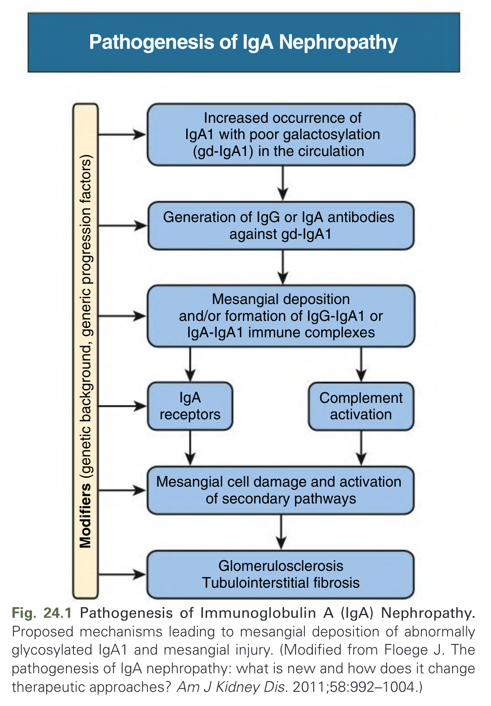

Fig. 24.1 Pathogenesis of Immunoglobulin A (IgA) Nephropathy. Proposed mechanisms leading to mesangial deposition of abnormally glycosylated IgA1 and mesangial injury. (Modified from Floege J. The pathogenesis of IgA nephropathy: what is new and how does it change therapeutic approaches? Am J Kidney Dis. 2011;58:992–1004.)

---

### Fig_24_2

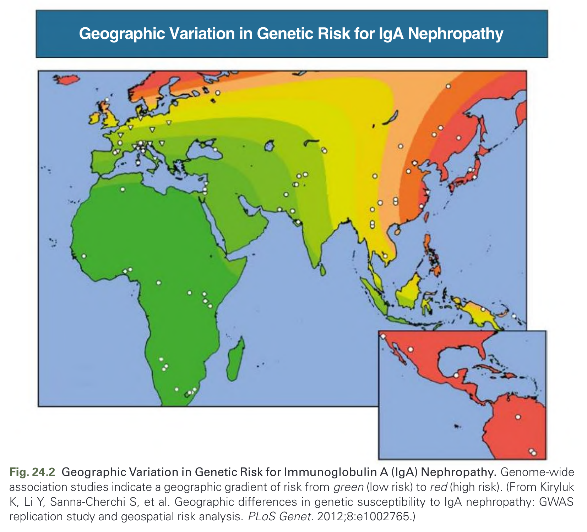

Fig. 24.2 Geographic Variation in Genetic Risk for Immunoglobulin A (IgA) Nephropathy. Genome-wide association studies indicate a geographic gradient of risk from green (low risk) to red (high risk). (From Kiryluk K, Li Y, Sanna-Cherchi S, et al. Geographic differences in genetic susceptibility to IgA nephropathy: GWAS replication study and geospatial risk analysis. PLoS Genet. 2012;8:e1002765.)

---

### Fig_24_3

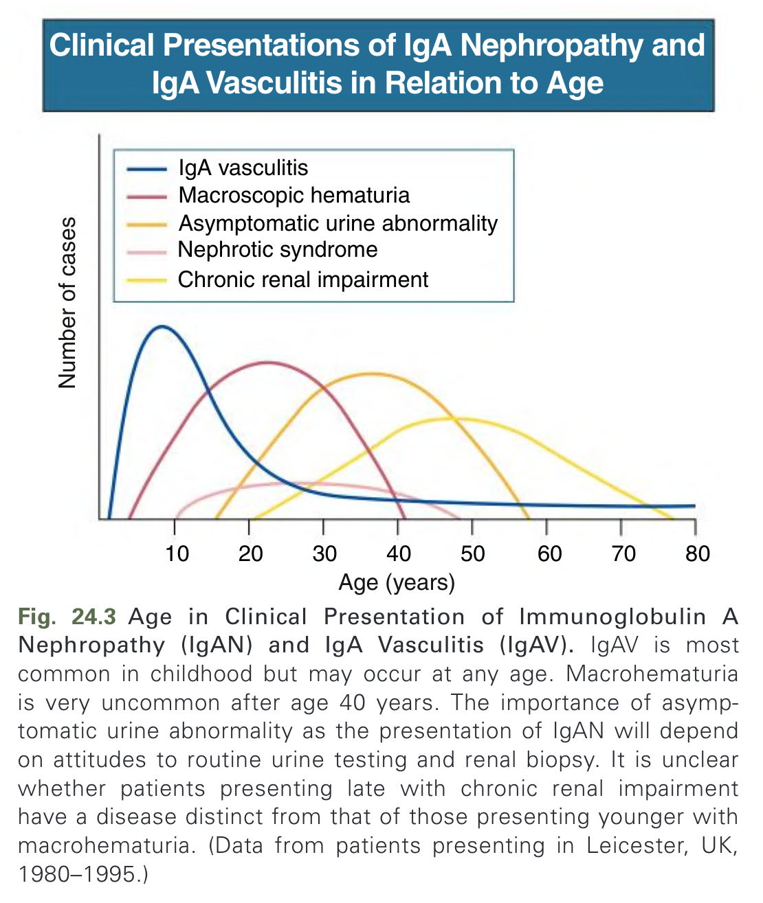

Fig. 24.3 Age in Clinical Presentation of Immunoglobulin A Nephropathy (IgAN) and IgA Vasculitis (IgAV). IgAV is most common in childhood but may occur at any age. Macrohematuria is very uncommon after age 40 years. The importance of asymptomatic urine abnormality as the presentation of IgAN will depend on attitudes to routine urine testing and renal biopsy. It is unclear whether patients presenting late with chronic renal impairment have a disease distinct from that of those presenting younger with macrohematuria. (Data from patients presenting in Leicester, UK, 1980–1995.)

---

### Fig_24_4

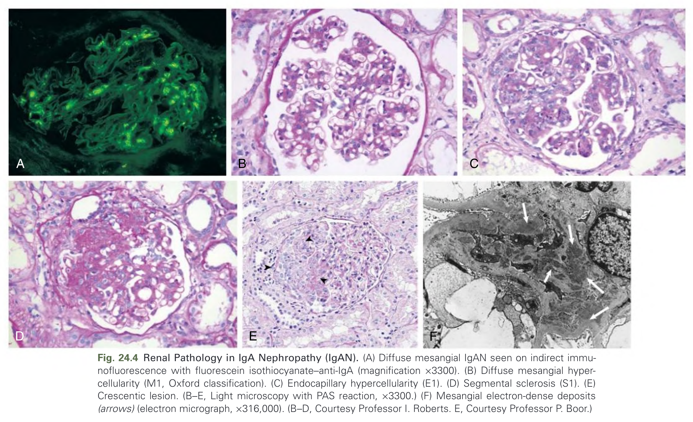

Fig. 24.4 Renal Pathology in IgA Nephropathy (IgAN). (A) Diffuse mesangial IgAN seen on indirect immunofluorescence with fluorescein isothiocyanate–anti-IgA (magnification ×3300). (B) Diffuse mesangial hypercellularity (M1, Oxford classification). (C) Endocapillary hypercellularity (E1). (D) Segmental sclerosis (S1). (E) Crescentic lesion. (B–E, Light microscopy with PAS reaction, ×3300.) (F) Mesangial electron-dense deposits (arrows) (electron micrograph, ×316,000). (B–D, Courtesy Professor I. Roberts. E, Courtesy Professor P. Boor.)

---

### Fig_24_5

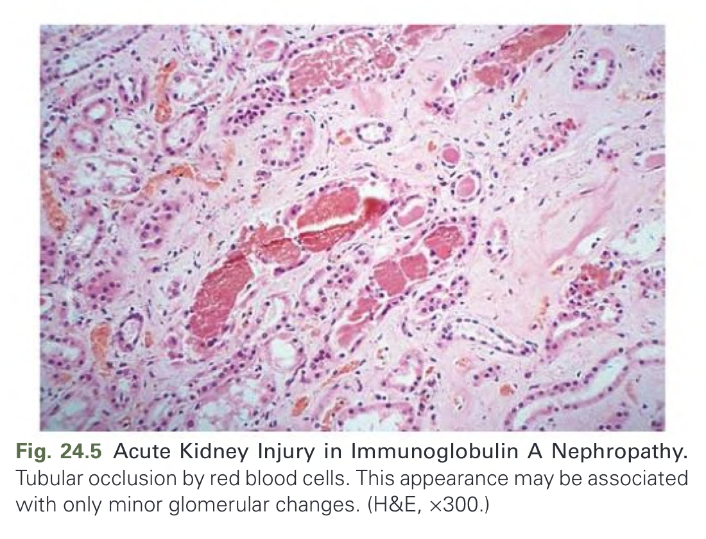

Fig. 24.5 Acute Kidney Injury in Immunoglobulin A Nephropathy. Tubular occlusion by red blood cells. This appearance may be associated with only minor glomerular changes. (H&E, ×300.)

---

### Fig_24_6

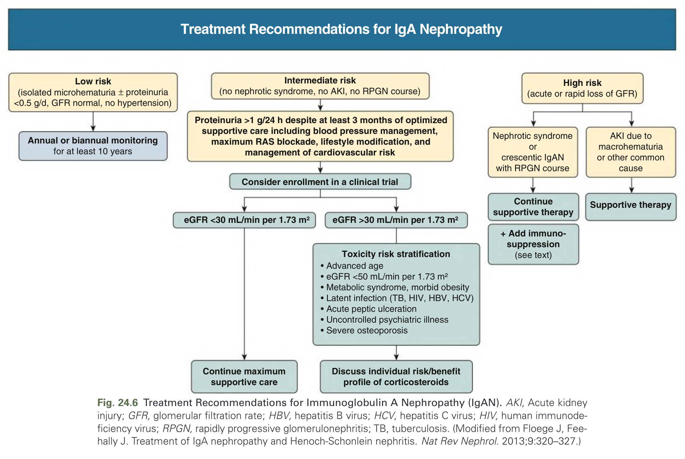

Fig. 24.6 Treatment Recommendations for Immunoglobulin A Nephropathy (IgAN). AKI, Acute kidney injury; GFR, glomerular filtration rate; HBV, hepatitis B virus; HCV, hepatitis C virus; HIV, human immunodeficiency virus; RPGN, rapidly progressive glomerulonephritis; TB, tuberculosis. (Modified from Floege J, Feehally J. Treatment of IgA nephropathy and Henoch-Schonlein nephritis. Nat Rev Nephrol. 2013;9:320–327.)

---

### Fig_24_7

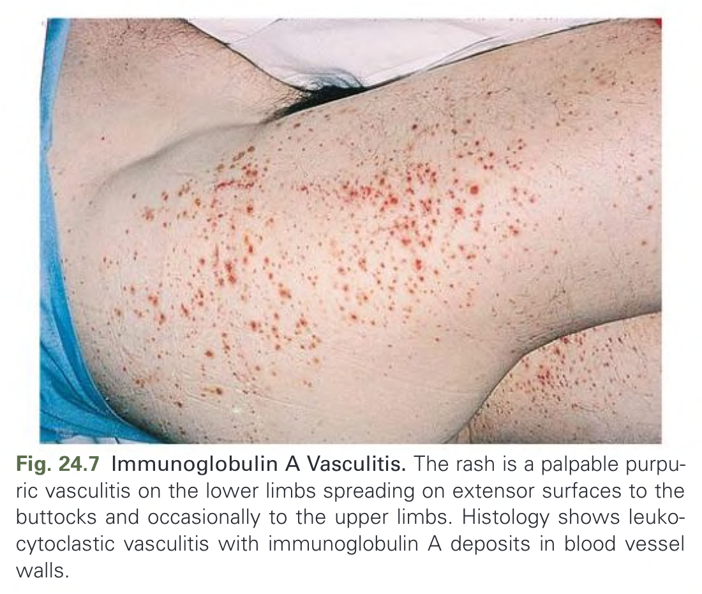

Fig. 24.7 Immunoglobulin A Vasculitis. The rash is a palpable purpuric vasculitis on the lower limbs spreading on extensor surfaces to the buttocks and occasionally to the upper limbs. Histology shows leukocytoclastic vasculitis with immunoglobulin A deposits in blood vessel walls.

---

## Tables

### Table_24_1

#### Table Image

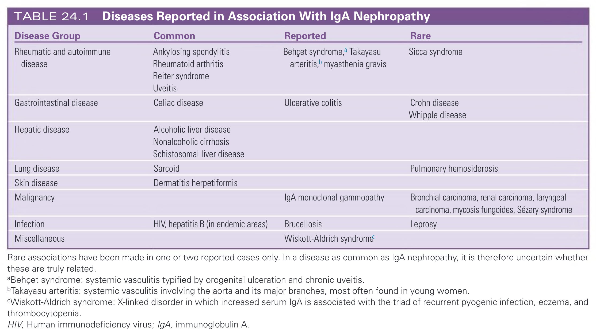

#### Table Data (CSV: [Table_24_1.csv](Table_24_1.csv))

```markdown
| Disease Group | Common | Reported | Rare |
| :--- | :--- | :--- | :--- |
| Rheumatic and autoimmune disease | Ankylosing spondylitis, Rheumatoid arthritis, Reiter syndrome, Uveitis | Behçet syndrome,ᵃ Takayasu arteritis,ᵇ myasthenia gravis | Sicca syndrome |
| Gastrointestinal disease | Celiac disease | Ulcerative colitis | Crohn disease, Whipple disease |
| Hepatic disease | Alcoholic liver disease, Nonalcoholic cirrhosis, Schistosomal liver disease | | |
| Lung disease | Sarcoid | | Pulmonary hemosiderosis |
| Skin disease | Dermatitis herpetiformis | | |
| Malignancy | | IgA monoclonal gammopathy | Bronchial carcinoma, renal carcinoma, laryngeal carcinoma, mycosis fungoides, Sézary syndrome |
| Infection | HIV, hepatitis B (in endemic areas) | Brucellosis | Leprosy |
| Miscellaneous | | Wiskott-Aldrich syndromeᶜ | |

Rare associations have been made in one or two reported cases only. In a disease as common as IgA nephropathy, it is therefore uncertain whether these are truly related.
ᵃBehçet syndrome: systemic vasculitis typified by orogenital ulceration and chronic uveitis.
ᵇTakayasu arteritis: systemic vasculitis involving the aorta and its major branches, most often found in young women.
ᶜWiskott-Aldrich syndrome: X-linked disorder in which increased serum IgA is associated with the triad of recurrent pyogenic infection, eczema, and thrombocytopenia.
HIV, Human immunodeficiency virus; IgA, immunoglobulin A.
```

TABLE 24.1 Diseases Reported in Association With IgA Nephropathy
Rare associations have been made in one or two reported cases only. In a disease as common as IgA nephropathy, it is therefore uncertain whether these are truly related.
aBehçet syndrome: systemic vasculitis typified by orogenital ulceration and chronic uveitis.
bTakayasu arteritis: systemic vasculitis involving the aorta and its major branches, most often found in young women.
cWiskott-Aldrich syndrome: X-linked disorder in which increased serum IgA is associated with the triad of recurrent pyogenic infection, eczema, and thrombocytopenia.
HIV, Human immunodeficiency virus; IgA, immunoglobulin A.

---

## Boxes

### Box_24_1

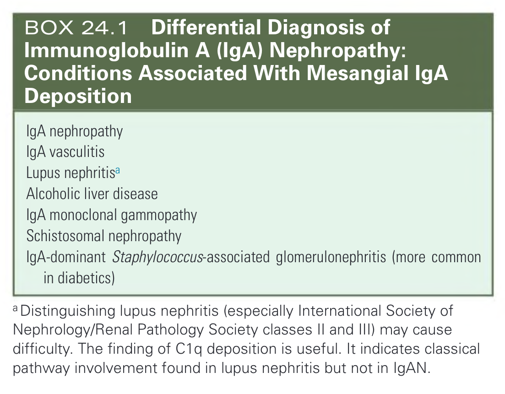

#### Box Text

```markdown
* IgA nephropathy
* IgA vasculitis
* Lupus nephritisa
* Alcoholic liver disease
* IgA monoclonal gammopathy
* Schistosomal nephropathy
* IgA-dominant Staphylococcus-associated glomerulonephritis (more common in diabetics)

ᵃ Distinguishing lupus nephritis (especially International Society of Nephrology/Renal Pathology Society classes II and III) may cause difficulty. The finding of C1q deposition is useful. It indicates classical pathway involvement found in lupus nephritis but not in IgAN.
```

BOX 24.1 Differential Diagnosis of Immunoglobulin A (IgA) Nephropathy: Conditions Associated With Mesangial IgA Deposition

---

### Box_24_2

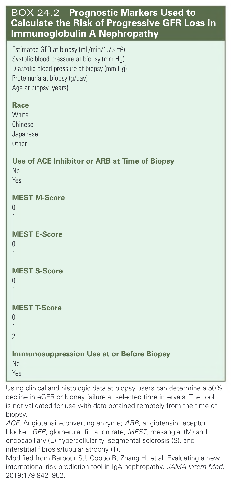

#### Box Text

```markdown
* Estimated GFR at biopsy (mL/min/1.73 m²)
* Systolic blood pressure at biopsy (mm Hg)
* Diastolic blood pressure at biopsy (mm Hg)
* Proteinuria at biopsy (g/day)
* Age at biopsy (years)
* Race
    * White
    * Chinese
    * Japanese
    * Other
* Use of ACE Inhibitor or ARB at Time of Biopsy
    * No
    * Yes
* MEST M-Score
    * 0
    * 1
* MEST E-Score
    * 0
    * 1
* MEST S-Score
    * 0
    * 1
* MEST T-Score
    * 0
    * 1
    * 2
* Immunosuppression Use at or Before Biopsy
    * No
    * Yes

Using clinical and histologic data at biopsy users can determine a 50% decline in eGFR or kidney failure at selected time intervals. The tool is not validated for use with data obtained remotely from the time of biopsy.
ACE, Angiotensin-converting enzyme; ARB, angiotensin receptor blocker; GFR, glomerular filtration rate; MEST, mesangial (M) and endocapillary (E) hypercellularity, segmental sclerosis (S), and interstitial fibrosis/tubular atrophy (T).
Modified from Barbour SJ, Coppo R, Zhang H, et al. Evaluating a new international risk-prediction tool in IgA nephropathy. JAMA Intern Med. 2019;179:942-952.
```

BOX 24.2 Prognostic Markers Used to Calculate the Risk of Progressive GFR Loss in Immunoglobulin A Nephropathy

---

### Box_24_3

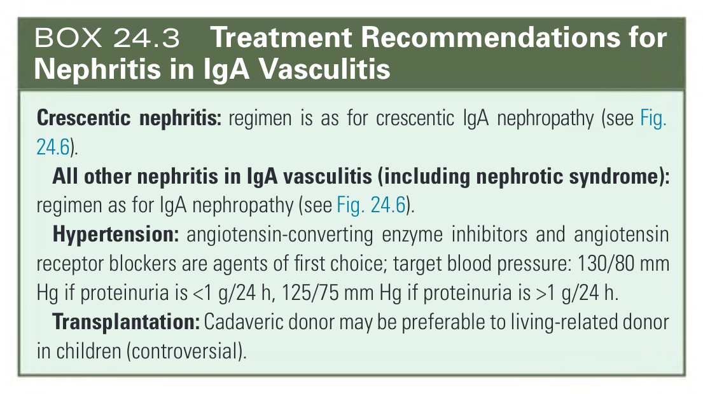

#### Box Text

```markdown
* Crescentic nephritis: regimen is as for crescentic IgA nephropathy (see Fig. 24.6).
* All other nephritis in IgA vasculitis (including nephrotic syndrome): regimen as for IgA nephropathy (see Fig. 24.6).
* Hypertension: angiotensin-converting enzyme inhibitors and angiotensin receptor blockers are agents of first choice; target blood pressure: 130/80 mm Hg if proteinuria is <1 g/24 h, 125/75 mm Hg if proteinuria is >1 g/24 h.
* Transplantation: Cadaveric donor may be preferable to living-related donor in children (controversial).
```

BOX 24.3 Treatment Recommendations for Nephritis in IgA Vasculitis

---
