# 025. Anti-Glomerular Basement Membrane Disease and Goodpasture Disease - Figures and Tables Index

This document lists all figures, tables and boxes extracted from `025. Anti-Glomerular Basement Membrane Disease and Goodpasture Disease.pdf`.

## Table of Contents
- [Figures](#figures)
- [Tables](#tables)
- [Boxes](#boxes)

---

## Figures

### Fig_25_1

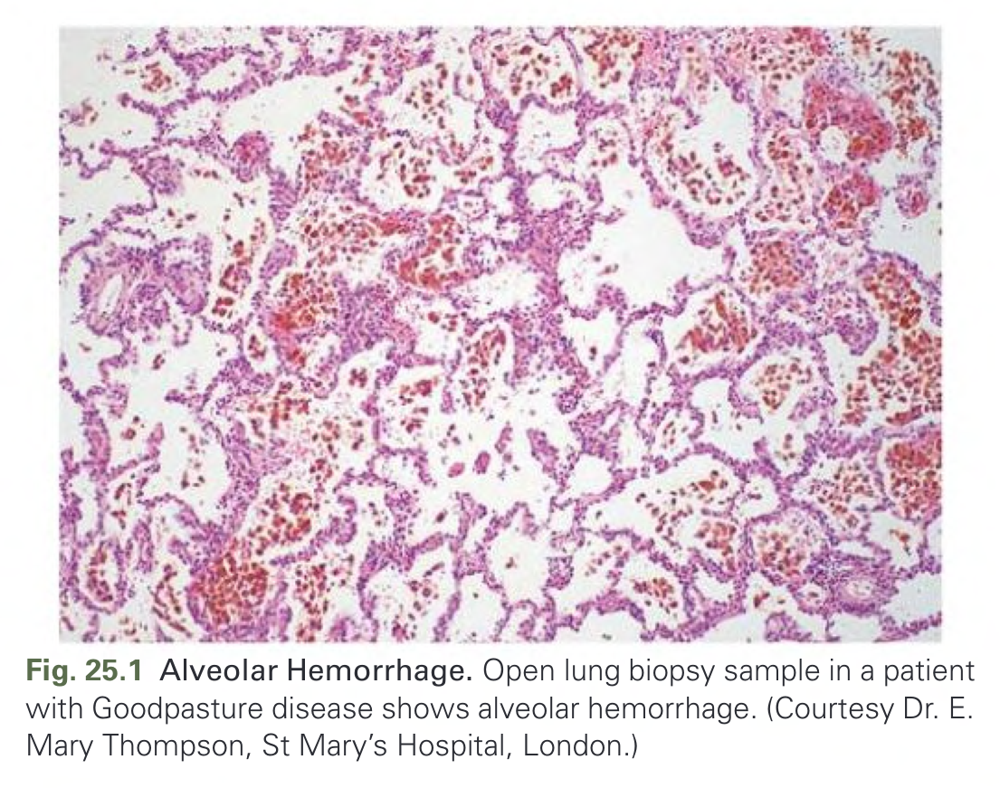

Fig. 25.1 Alveolar Hemorrhage. Open lung biopsy sample in a patient with Goodpasture disease shows alveolar hemorrhage. (Courtesy Dr. E. Mary Thompson, St Mary’s Hospital, London.)

---

### Fig_25_2

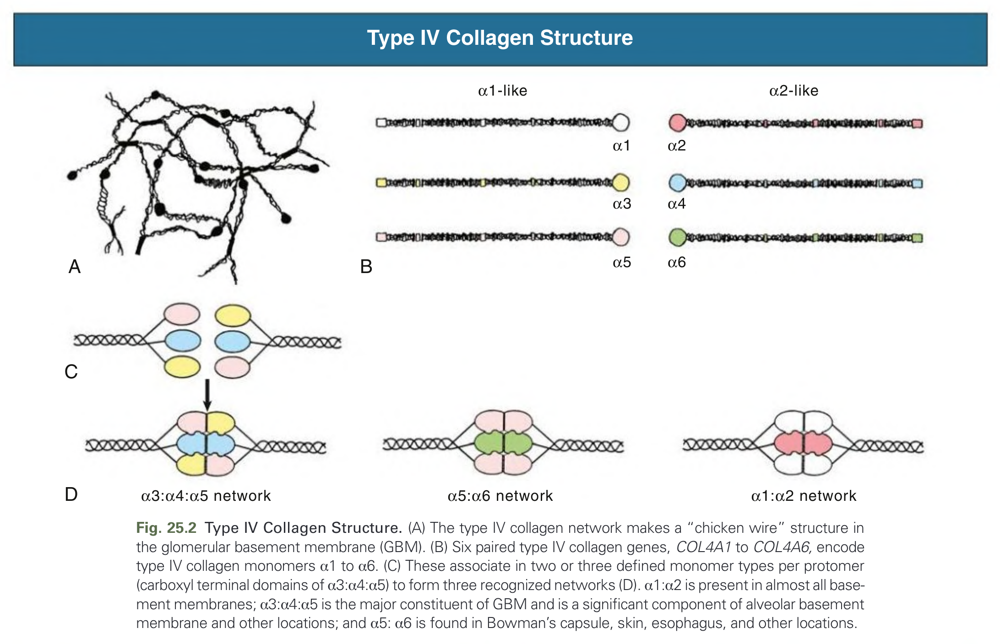

Fig. 25.2 Type IV Collagen Structure. (A) The type IV collagen network makes a “chicken wire” structure in the glomerular basement membrane (GBM). (B) Six paired type IV collagen genes, COL4A1 to COL4A6, encode type IV collagen monomers α1 to α6. (C) These associate in two or three defined monomer types per protomer (carboxyl terminal domains of α3:α4:α5) to form three recognized networks (D). α1:α2 is present in almost all basement membranes; α3:α4:α5 is the major constituent of GBM and is a significant component of alveolar basement membrane and other locations; and α5: α6 is found in Bowman’s capsule, skin, esophagus, and other locations.

---

### Fig_25_3

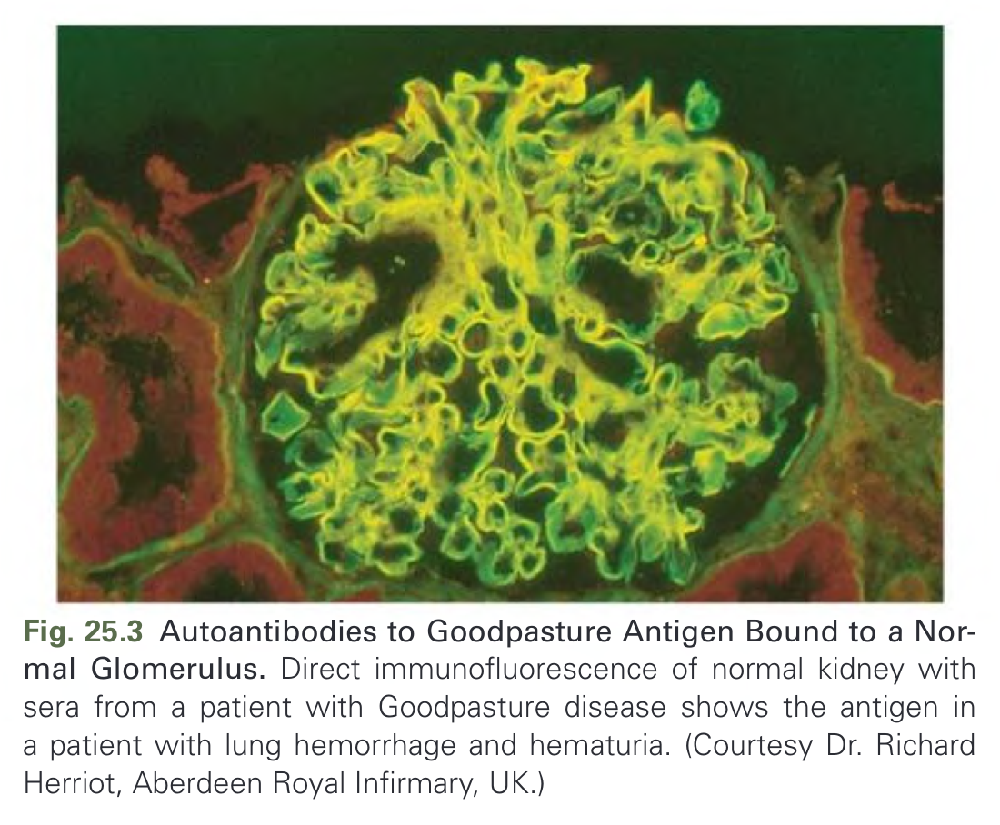

Fig. 25.3 Autoantibodies to Goodpasture Antigen Bound to a Normal Glomerulus. Direct immunofluorescence of normal kidney with sera from a patient with Goodpasture disease shows the antigen in a patient with lung hemorrhage and hematuria. (Courtesy Dr. Richard Herriot, Aberdeen Royal Infirmary, UK.)

---

### Fig_25_4

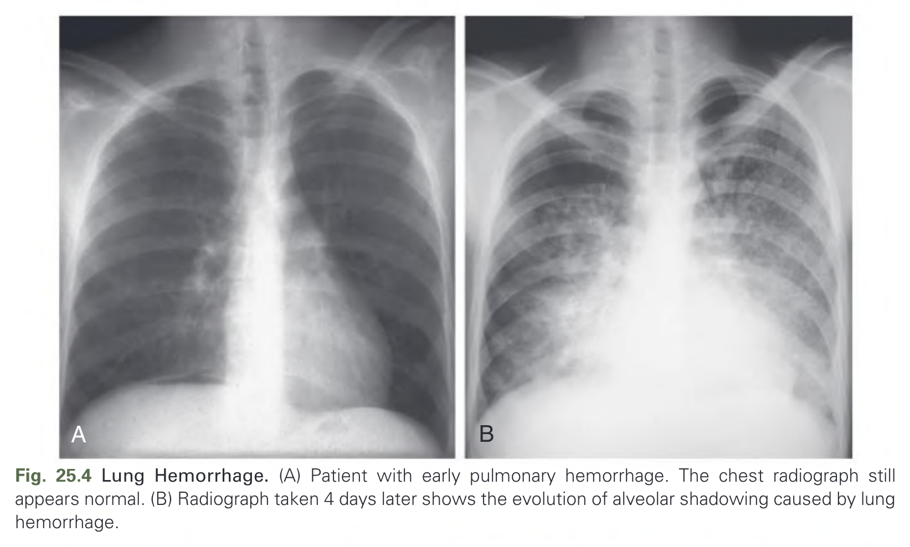

Fig. 25.4 Lung Hemorrhage. (A) Patient with early pulmonary hemorrhage. The chest radiograph still appears normal. (B) Radiograph taken 4 days later shows the evolution of alveolar shadowing caused by lung hemorrhage.

---

### Fig_25_5

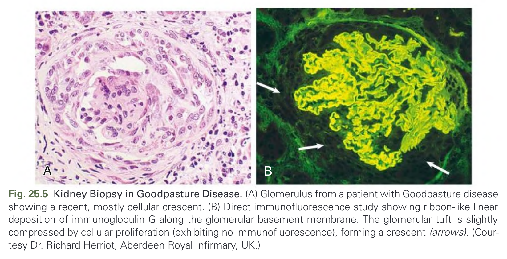

Fig. 25.5 Kidney Biopsy in Goodpasture Disease. (A) Glomerulus from a patient with Goodpasture disease showing a recent, mostly cellular crescent. (B) Direct immunofluorescence study showing ribbon-like linear deposition of immunoglobulin G along the glomerular basement membrane. The glomerular tuft is slightly compressed by cellular proliferation (exhibiting no immunofluorescence), forming a crescent (arrows). (Courtesy Dr. Richard Herriot, Aberdeen Royal Infirmary, UK.)

---

### Fig_25_6

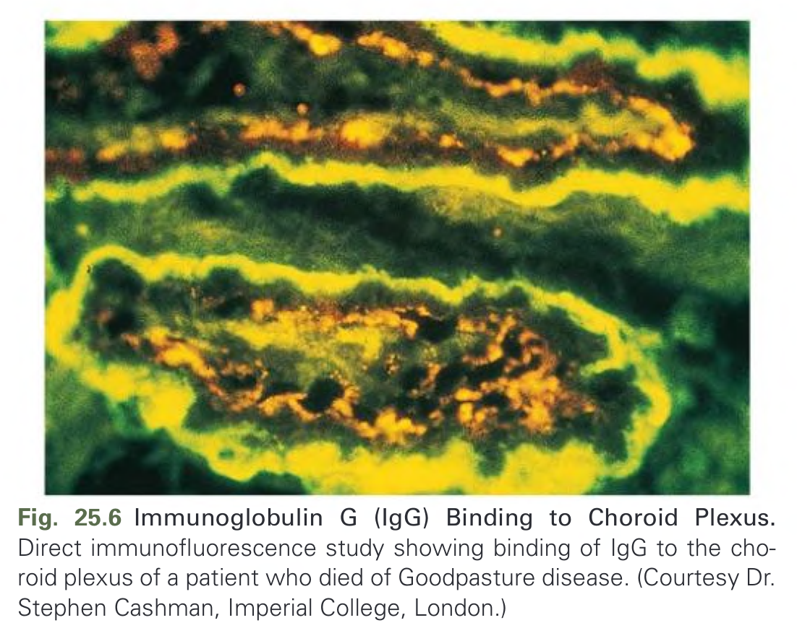

Fig. 25.6 Immunoglobulin G (IgG) Binding to Choroid Plexus. Direct immunofluorescence study showing binding of IgG to the choroid plexus of a patient who died of Goodpasture disease. (Courtesy Dr. Stephen Cashman, Imperial College, London.)

---

### Fig_25_7

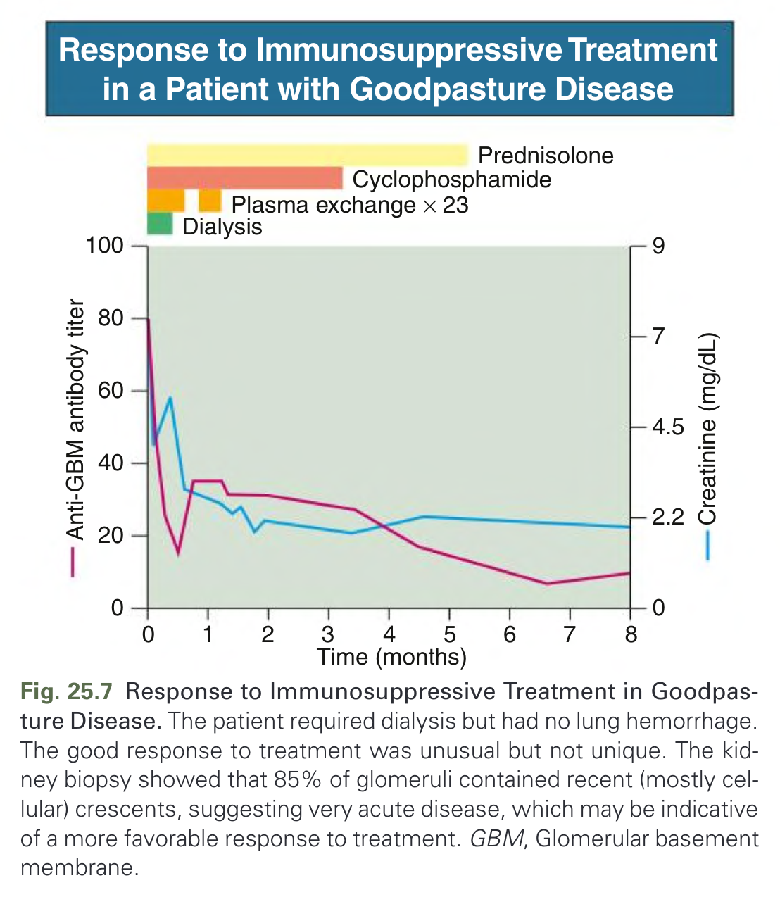

Fig. 25.7 Response to Immunosuppressive Treatment in Goodpasture Disease. The patient required dialysis but had no lung hemorrhage. The good response to treatment was unusual but not unique. The kidney biopsy showed that 85% of glomeruli contained recent (mostly cellular) crescents, suggesting very acute disease, which may be indicative of a more favorable response to treatment. GBM, Glomerular basement membrane.

---

## Tables

### Table_25_1

#### Table Image

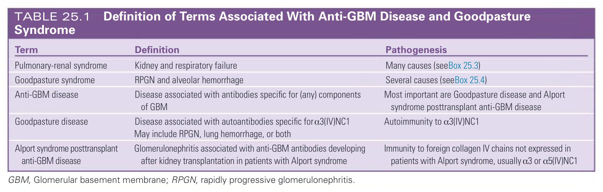

#### Table Data (CSV: [Table_25_1.csv](Table_25_1.csv))

```markdown
| Term | Definition | Pathogenesis |
| :--- | :--- | :--- |
| Pulmonary-renal syndrome | Kidney and respiratory failure | Many causes (see Box 25.3) |
| Goodpasture syndrome | RPGN and alveolar hemorrhage | Several causes (seeBox 25.4) |
| Anti-GBM disease | Disease associated with antibodies specific for (any) components of GBM | Most important are Goodpasture disease and Alport syndrome posttransplant anti-GBM disease |
| Goodpasture disease | Disease associated with autoantibodies specific for a3(IV)NC1 May include RPGN, lung hemorrhage, or both | Autoimmunity to a3(IV)NC1 |
| Alport syndrome posttransplant anti-GBM disease | Glomerulonephritis associated with anti-GBM antibodies developing after kidney transplantation in patients with Alport syndrome | Immunity to foreign collagen IV chains not expressed in patients with Alport syndrome, usually a3 or a5(IV)NC1 |

GBM, Glomerular basement membrane; RPGN, rapidly progressive glomerulonephritis.
```

TABLE 25.1 Definition of Terms Associated With Anti-GBM Disease and Goodpasture Syndrome

---

### Table_25_2

#### Table Image

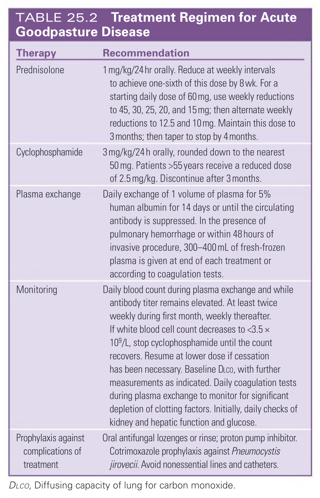

#### Table Data (CSV: [Table_25_2.csv](Table_25_2.csv))

```markdown
| Therapy | Recommendation |
| :--- | :--- |
| Prednisolone | 1 mg/kg/24 hr orally. Reduce at weekly intervals to achieve one-sixth of this dose by 8 wk. For a starting daily dose of 60 mg, use weekly reductions to 45, 30, 25, 20, and 15mg; then alternate weekly reductions to 12.5 and 10mg. Maintain this dose to 3 months; then taper to stop by 4 months. |
| Cyclophosphamide | 3 mg/kg/24 h orally, rounded down to the nearest 50 mg. Patients >55 years receive a reduced dose of 2.5 mg/kg. Discontinue after 3 months. |
| Plasma exchange | Daily exchange of 1 volume of plasma for 5% human albumin for 14 days or until the circulating antibody is suppressed. In the presence of pulmonary hemorrhage or within 48 hours of invasive procedure, 300-400 mL of fresh-frozen plasma is given at end of each treatment or according to coagulation tests. |
| Monitoring | Daily blood count during plasma exchange and while antibody titer remains elevated. At least twice weekly during first month, weekly thereafter. If white blood cell count decreases to <3.5 × 109/L, stop cyclophosphamide until the count recovers. Resume at lower dose if cessation has been necessary. Baseline DLco, with further measurements as indicated. Daily coagulation tests during plasma exchange to monitor for significant depletion of clotting factors. Initially, daily checks of kidney and hepatic function and glucose. |
| Prophylaxis against complications of treatment | Oral antifungal lozenges or rinse; proton pump inhibitor. Cotrimoxazole prophylaxis against Pneumocystis jirovecii. Avoid nonessential lines and catheters. |

DLCO, Diffusing capacity of lung for carbon monoxide.
```

TABLE 25.2 Treatment Regimen for Acute Goodpasture Disease

---

### Table_25_3

#### Table Image

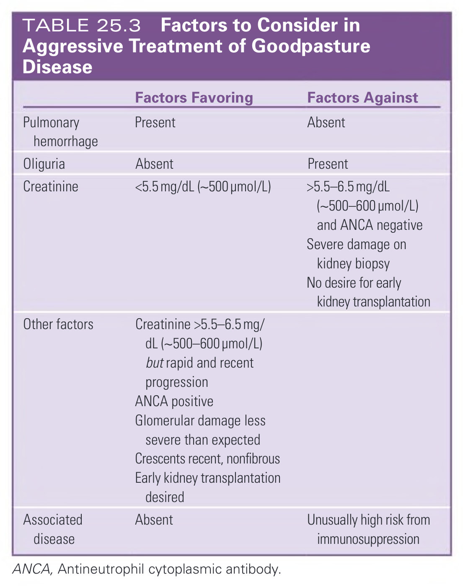

#### Table Data (CSV: [Table_25_3.csv](Table_25_3.csv))

```markdown
| | Factors Favoring | Factors Against |
| :--- | :--- | :--- |
| Pulmonary hemorrhage | Present | Absent |
| Oliguria | Absent | Present |
| Creatinine | <5.5 mg/dL (~500 μmol/L) | >5.5-6.5 mg/dL (~500-600 μmol/L) and ANCA negative |
| Other factors | Creatinine >5.5-6.5 mg/dL (~500-600 µmol/L) but rapid and recent progression, ANCA positive, Glomerular damage less severe than expected, Crescents recent, nonfibrous, Early kidney transplantation desired | Severe damage on kidney biopsy, No desire for early kidney transplantation |
| Associated disease | Absent | Unusually high risk from immunosuppression |

ANCA, Antineutrophil cytoplasmic antibody.
```

TABLE 25.3 Factors to Consider in Aggressive Treatment of Goodpasture Disease

---

## Boxes

### Box_25_1

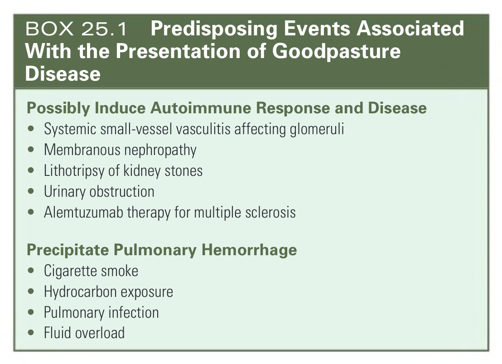

#### Box Text

```markdown
**Possibly Induce Autoimmune Response and Disease**
* Systemic small-vessel vasculitis affecting glomeruli
* Membranous nephropathy
* Lithotripsy of kidney stones
* Urinary obstruction
* Alemtuzumab therapy for multiple sclerosis

**Precipitate Pulmonary Hemorrhage**
* Cigarette smoke
* Hydrocarbon exposure
* Pulmonary infection
* Fluid overload
```

BOX 25.1 Predisposing Events Associated With the Presentation of Goodpasture Disease

---

### Box_25_2

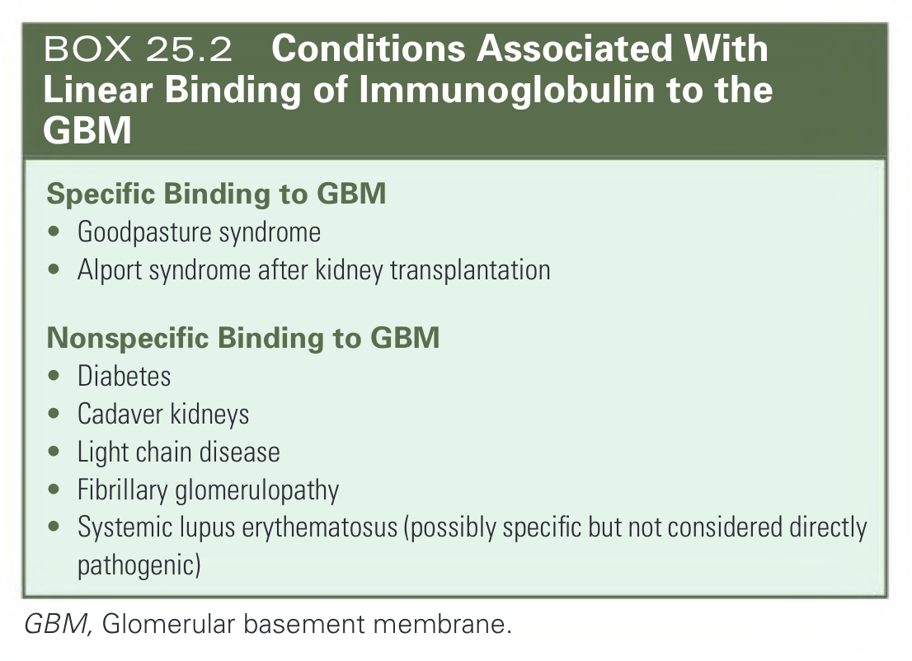

#### Box Text

```markdown
**Specific Binding to GBM**
* Goodpasture syndrome
* Alport syndrome after kidney transplantation

**Nonspecific Binding to GBM**
* Diabetes
* Cadaver kidneys
* Light chain disease
* Fibrillary glomerulopathy
* Systemic lupus erythematosus (possibly specific but not considered directly pathogenic)

GBM, Glomerular basement membrane.
```

BOX 25.2 Conditions Associated With Linear Binding of Immunoglobulin to the GBM

---

### Box_25_3

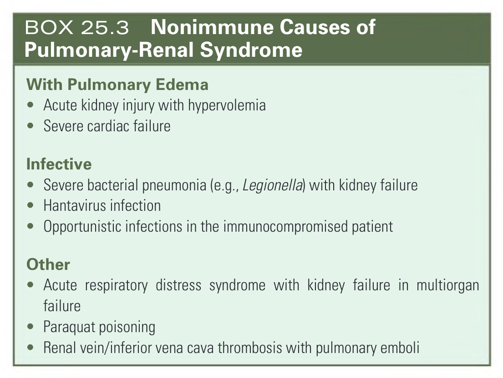

#### Box Text

```markdown
**With Pulmonary Edema**
* Acute kidney injury with hypervolemia
* Severe cardiac failure

**Infective**
* Severe bacterial pneumonia (e.g., Legionella) with kidney failure
* Hantavirus infection
* Opportunistic infections in the immunocompromised patient

**Other**
* Acute respiratory distress syndrome with kidney failure in multiorgan failure
* Paraquat poisoning
* Renal vein/inferior vena cava thrombosis with pulmonary emboli
```

BOX 25.3 Nonimmune Causes of Pulmonary-Renal Syndrome

---

### Box_25_4

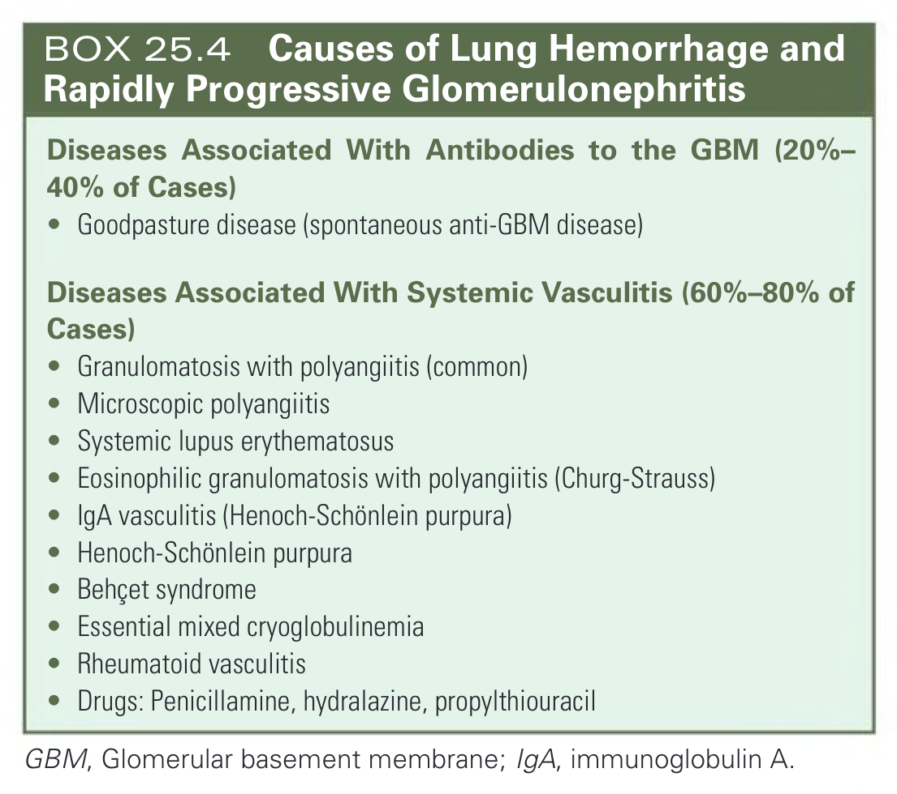

#### Box Text

```markdown
**Diseases Associated With Antibodies to the GBM (20%–40% of Cases)**
* Goodpasture disease (spontaneous anti-GBM disease)

**Diseases Associated With Systemic Vasculitis (60%–80% of Cases)**
* Granulomatosis with polyangiitis (common)
* Microscopic polyangiitis
* Systemic lupus erythematosus
* Eosinophilic granulomatosis with polyangiitis (Churg-Strauss)
* IgA vasculitis (Henoch-Schönlein purpura)
* Henoch-Schönlein purpura
* Behçet syndrome
* Essential mixed cryoglobulinemia
* Rheumatoid vasculitis
* Drugs: Penicillamine, hydralazine, propylthiouracil

GBM, Glomerular basement membrane; IgA, immunoglobulin A.
```

BOX 25.4 Causes of Lung Hemorrhage and Rapidly Progressive Glomerulonephritis

---
