# 027. Lupus Nephritis - Figures and Tables Index

This document lists all figures, tables and boxes extracted from `027. Lupus Nephritis.pdf`.

## Table of Contents
- [Figures](#figures)
- [Tables](#tables)
- [Boxes](#boxes)

---

## Figures

### Fig_27_1

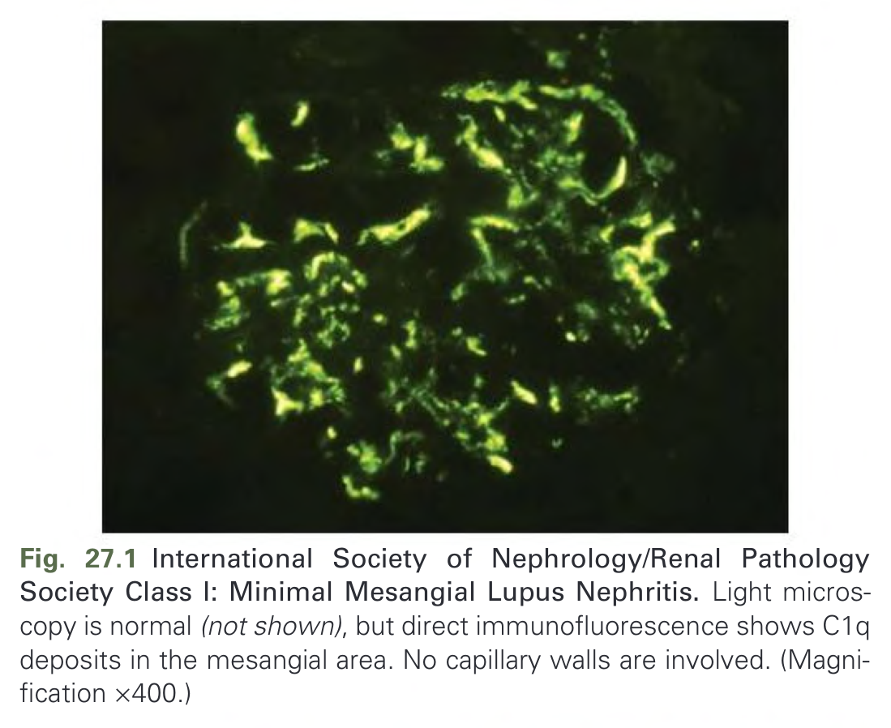

Fig. 27.1 International Society of Nephrology/Renal Pathology Society Class I: Minimal Mesangial Lupus Nephritis. Light microscopy is normal (not shown), but direct immunofluorescence shows C1q deposits in the mesangial area. No capillary walls are involved. (Magnification ×400.)

---

### Fig_27_2

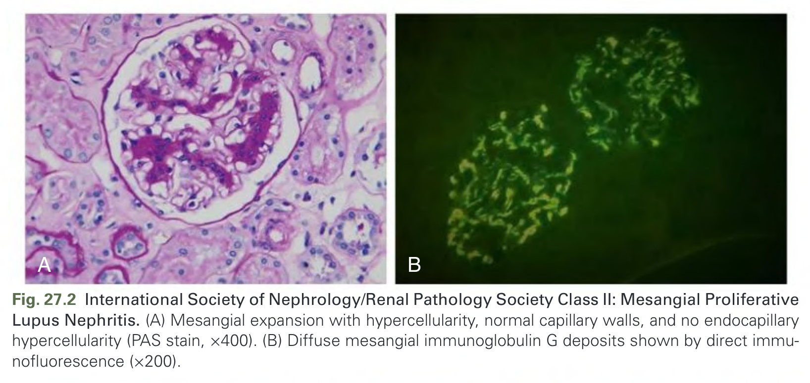

Fig. 27.2 International Society of Nephrology/Renal Pathology Society Class II: Mesangial Proliferative Lupus Nephritis. (A) Mesangial expansion with hypercellularity, normal capillary walls, and no endocapillary hypercellularity (PAS stain, ×400). (B) Diffuse mesangial immunoglobulin G deposits shown by direct immunofluorescence (×200).

---

### Fig_27_3

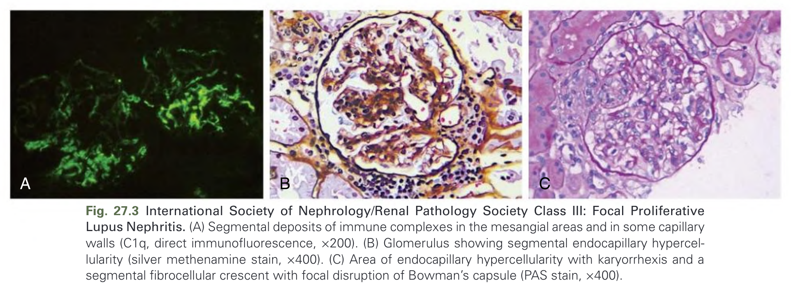

Fig. 27.3 International Society of Nephrology/Renal Pathology Society Class III: Focal Proliferative Lupus Nephritis. (A) Segmental deposits of immune complexes in the mesangial areas and in some capillary walls (C1q, direct immunofluorescence, ×200). (B) Glomerulus showing segmental endocapillary hypercellularity (silver methenamine stain, ×400). (C) Area of endocapillary hypercellularity with karyorrhexis and a segmental fibrocellular crescent with focal disruption of Bowman's capsule (PAS stain, ×400).

---

### Fig_27_4

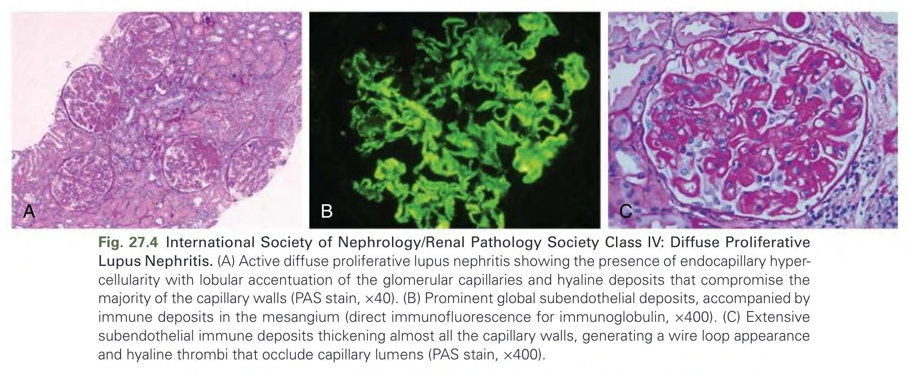

Fig. 27.4 International Society of Nephrology/Renal Pathology Society Class IV: Diffuse Proliferative Lupus Nephritis. (A) Active diffuse proliferative lupus nephritis showing the presence of endocapillary hypercellularity with lobular accentuation of the glomerular capillaries and hyaline deposits that compromise the majority of the capillary walls (PAS stain, ×40). (B) Prominent global subendothelial deposits, accompanied by immune deposits in the mesangium (direct immunofluorescence for immunoglobulin, ×400). (C) Extensive subendothelial immune deposits thickening almost all the capillary walls, generating a wire loop appearance and hyaline thrombi that occlude capillary lumens (PAS stain, ×400).

---

### Fig_27_5

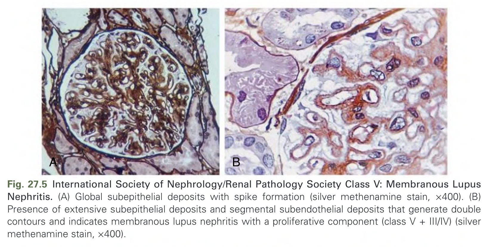

Fig. 27.5 International Society of Nephrology/Renal Pathology Society Class V: Membranous Lupus Nephritis. (A) Global subepithelial deposits with spike formation (silver methenamine stain, ×400). (B) Presence of extensive subepithelial deposits and segmental subendothelial deposits that generate double contours and indicates membranous lupus nephritis with a proliferative component (class V + III/IV) (silver methenamine stain, ×400).

---

### Fig_27_6

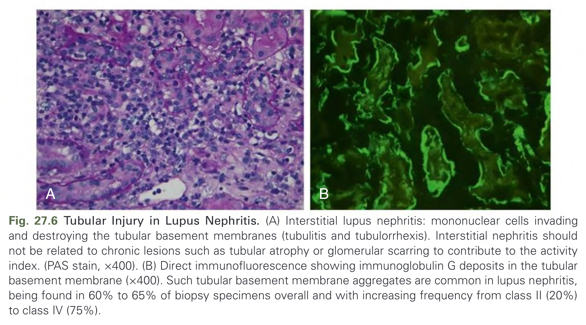

Fig. 27.6 Tubular Injury in Lupus Nephritis. (A) Interstitial lupus nephritis: mononuclear cells invading and destroying the tubular basement membranes (tubulitis and tubulorrhexis). Interstitial nephritis should not be related to chronic lesions such as tubular atrophy or glomerular scarring to contribute to the activity index. (PAS stain, ×400). (B) Direct immunofluorescence showing immunoglobulin G deposits in the tubular basement membrane (×400). Such tubular basement membrane aggregates are common in lupus nephritis, being found in 60% to 65% of biopsy specimens overall and with increasing frequency from class II (20%) to class IV (75%).

---

### Fig_27_7

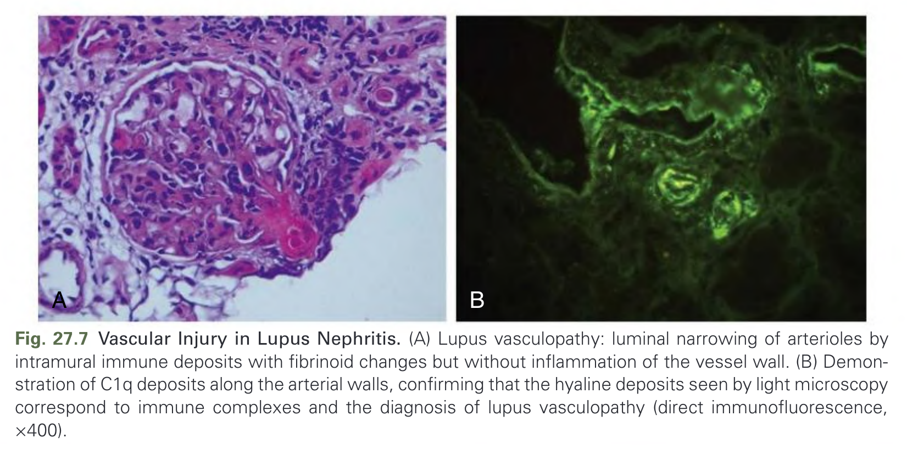

Fig. 27.7 Vascular Injury in Lupus Nephritis. (A) Lupus vasculopathy: luminal narrowing of arterioles by intramural immune deposits with fibrinoid changes but without inflammation of the vessel wall. (B) Demonstration of C1q deposits along the arterial walls, confirming that the hyaline deposits seen by light microscopy correspond to immune complexes and the diagnosis of lupus vasculopathy (direct immunofluorescence, ×400).

---

### Fig_27_8

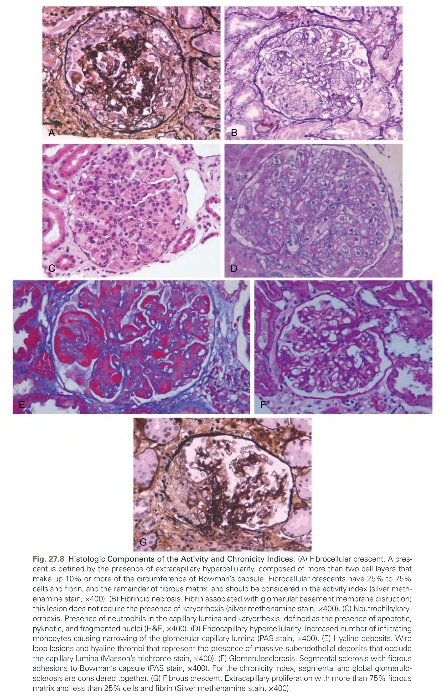

Fig. 27.8 Histologic Components of the Activity and Chronicity Indices. (A) Fibrocellular crescent. A crescent is defined by the presence of extracapillary hypercellularity, composed of more than two cell layers that make up 10% or more of the circumference of Bowman’s capsule. Fibrocellular crescents have 25% to 75% cells and fibrin, and the remainder of fibrous matrix, and should be considered in the activity index (silver methenamine stain, ×400). (B) Fibrinoid necrosis. Fibrin associated with glomerular basement membrane disruption; this lesion does not require the presence of karyorrhexis (silver methenamine stain, ×400). (C) Neutrophils/karyorrhexis. Presence of neutrophils in the capillary lumina and karyorrhexis; defined as the presence of apoptotic, pyknotic, and fragmented nuclei (H&E, ×400). (D) Endocapillary hypercellularity. Increased number of infiltrating monocytes causing narrowing of the glomerular capillary lumina (PAS stain, ×400). (E) Hyaline deposits. Wire loop lesions and hyaline thrombi that represent the presence of massive subendothelial deposits that occlude the capillary lumina (Masson’s trichrome stain, ×400). (F) Glomerulosclerosis. Segmental sclerosis with fibrous adhesions to Bowman’s capsule (PAS stain, ×400). For the chronicity index, segmental and global glomerulosclerosis are considered together. (G) Fibrous crescent. Extracapillary proliferation with more than 75% fibrous matrix and less than 25% cells and fibrin (Silver methenamine stain, ×400).

---

### Fig_27_9

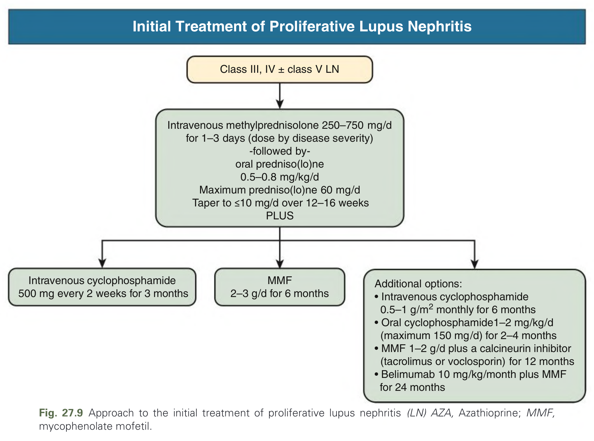

Fig. 27.9 Approach to the initial treatment of proliferative lupus nephritis (LN) AZA, Azathioprine; MMF, mycophenolate mofetil.

---

### Fig_27_10

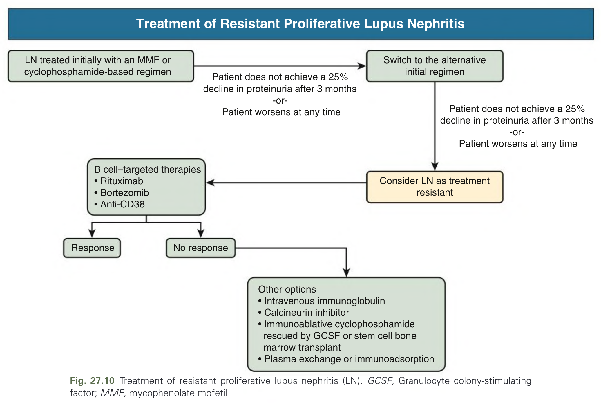

Fig. 27.10 Treatment of resistant proliferative lupus nephritis (LN). GCSF, Granulocyte colony-stimulating factor; MMF, mycophenolate mofetil.

---

### Fig_27_11

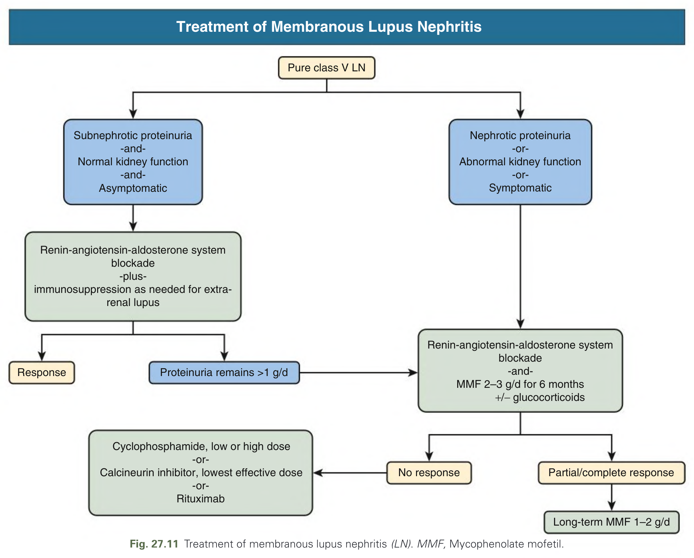

Fig. 27.11 Treatment of membranous lupus nephritis (LN). MMF, Mycophenolate mofetil.

---

## Tables

### Table_27_1

#### Table Image

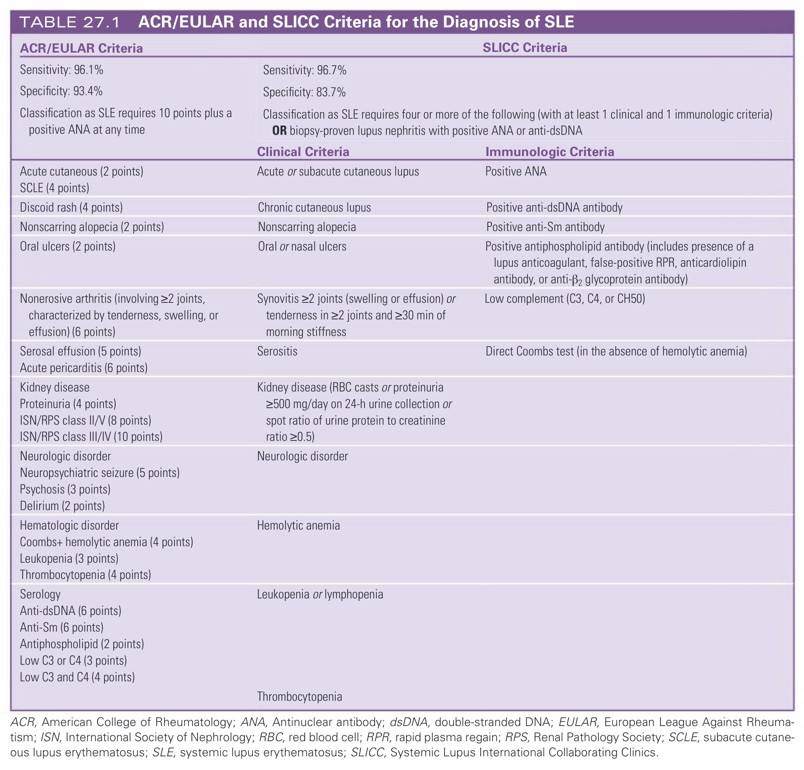

#### Table Data (CSV: [Table_27_1.csv](Table_27_1.csv))

```markdown
| ACR/EULAR Criteria | SLICC Clinical Criteria | SLICC Immunologic Criteria |
| :--- | :--- | :--- |
| Sensitivity: 96.1% | Sensitivity: 96.7% | |
| Specificity: 93.4% | Specificity: 83.7% | |
| Classification as SLE requires 10 points plus a positive ANA at any time | Classification as SLE requires four or more of the following (with at least 1 clinical and 1 immunologic criteria) OR biopsy-proven lupus nephritis with positive ANA or anti-dsDNA | |
| Acute cutaneous (2 points) | Acute or subacute cutaneous lupus | Positive ANA |
| SCLE (4 points) | | |
| Discoid rash (4 points) | Chronic cutaneous lupus | Positive anti-dsDNA antibody |
| Nonscarring alopecia (2 points) | Nonscarring alopecia | Positive anti-Sm antibody |
| Oral ulcers (2 points) | Oral or nasal ulcers | Positive antiphospholipid antibody (includes presence of a lupus anticoagulant, false-positive RPR, anticardiolipin antibody, or anti-β2 glycoprotein antibody) |
| Nonerosive arthritis (involving ≥2 joints, characterized by tenderness, swelling, or effusion) (6 points) | Synovitis ≥2 joints (swelling or effusion) or tenderness in ≥2 joints and ≥30 min of morning stiffness | Low complement (C3, C4, or CH50) |
| Serosal effusion (5 points) | Serositis | Direct Coombs test (in the absence of hemolytic anemia) |
| Acute pericarditis (6 points) | | |
| Kidney disease | Kidney disease (RBC casts or proteinuria ≥500 mg/day on 24-h urine collection or spot ratio of urine protein to creatinine ratio ≥0.5) | |
| Proteinuria (4 points) | | |
| ISN/RPS class II/V (8 points) | | |
| ISN/RPS class III/IV (10 points) | | |
| Neurologic disorder | Neurologic disorder | |
| Neuropsychiatric seizure (5 points) | | |
| Psychosis (3 points) | | |
| Delirium (2 points) | | |
| Hematologic disorder | Hemolytic anemia | |
| Coombs+ hemolytic anemia (4 points) | | |
| Leukopenia (3 points) | Leukopenia or lymphopenia | |
| Thrombocytopenia (4 points) | Thrombocytopenia | |
| Serology | | |
| Anti-dsDNA (6 points) | | |
| Anti-Sm (6 points) | | |
| Antiphospholipid (2 points) | | |
| Low C3 or C4 (3 points) | | |
| Low C3 and C4 (4 points) | | |

ACR, American College of Rheumatology; ANA, Antinuclear antibody; dsDNA, double-stranded DNA; EULAR, European League Against Rheumatism; ISN, International Society of Nephrology; RBC, red blood cell; RPR, rapid plasma regain; RPS, Renal Pathology Society; SCLE, subacute cutaneous lupus erythematosus; SLE, systemic lupus erythematosus; SLICC, Systemic Lupus International Collaborating Clinics.
```

TABLE 27.1 ACR/EULAR and SLICC Criteria for the Diagnosis of SLE

---

### Table_27_2

#### Table Image

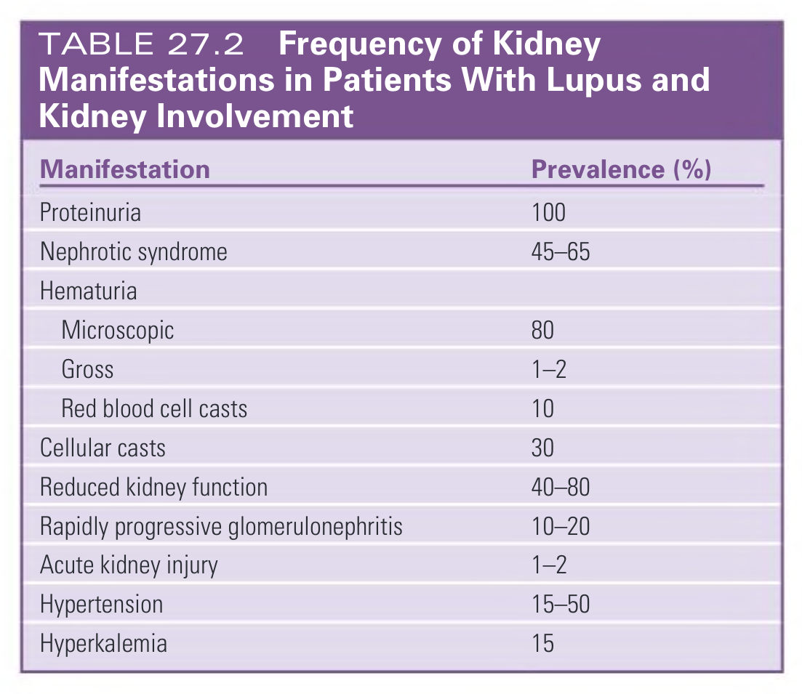

#### Table Data (CSV: [Table_27_2.csv](Table_27_2.csv))

```markdown
| Manifestation | Prevalence (%) |
| :--- | :--- |
| Proteinuria | 100 |
| Nephrotic syndrome | 45-65 |
| **Hematuria** | |
| Microscopic | 80 |
| Gross | 1-2 |
| Red blood cell casts | 10 |
| Cellular casts | 30 |
| Reduced kidney function | 40-80 |
| Rapidly progressive glomerulonephritis | 10-20 |
| Acute kidney injury | 1-2 |
| Hypertension | 15-50 |
| Hyperkalemia | 15 |
```

TABLE 27.2 Frequency of Kidney Manifestations in Patients With Lupus and Kidney Involvement

---

### Table_27_3

#### Table Image

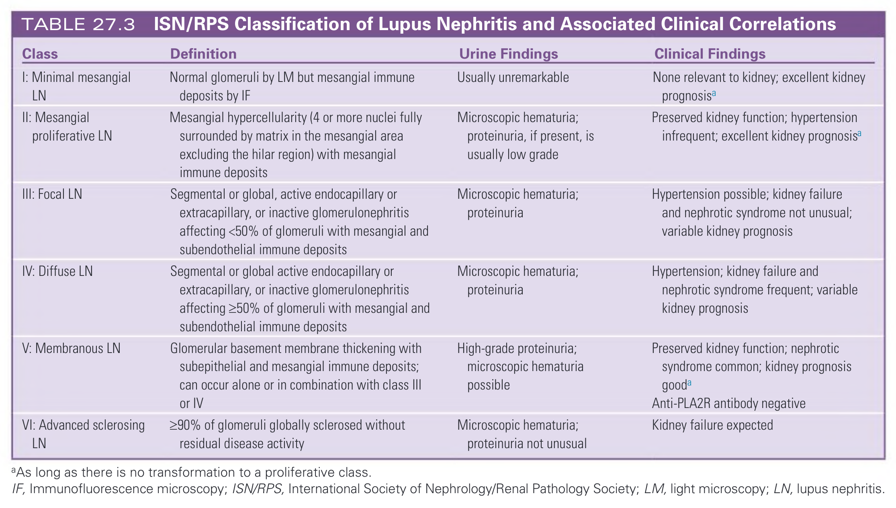

#### Table Data (CSV: [Table_27_3.csv](Table_27_3.csv))

```markdown
| Class | Definition | Urine Findings | Clinical Findings |
| :--- | :--- | :--- | :--- |
| I: Minimal mesangial LN | Normal glomeruli by LM but mesangial immune deposits by IF | Usually unremarkable | None relevant to kidney; excellent kidney prognosisa |
| II: Mesangial proliferative LN | Mesangial hypercellularity (4 or more nuclei fully surrounded by matrix in the mesangial area excluding the hilar region) with mesangial immune deposits | Microscopic hematuria; proteinuria, if present, is usually low grade | Preserved kidney function; hypertension infrequent; excellent kidney prognosisa |
| III: Focal LN | Segmental or global, active endocapillary or extracapillary, or inactive glomerulonephritis affecting <50% of glomeruli with mesangial and subendothelial immune deposits | Microscopic hematuria; proteinuria | Hypertension possible; kidney failure and nephrotic syndrome not unusual; variable kidney prognosis |
| IV: Diffuse LN | Segmental or global active endocapillary or extracapillary, or inactive glomerulonephritis affecting ≥50% of glomeruli with mesangial and subendothelial immune deposits | Microscopic hematuria; proteinuria | Hypertension; kidney failure and nephrotic syndrome frequent; variable kidney prognosis |
| V: Membranous LN | Glomerular basement membrane thickening with subepithelial and mesangial immune deposits; can occur alone or in combination with class III or IV | High-grade proteinuria; microscopic hematuria possible | Anti-PLA2R antibody negative; preserved kidney function; nephrotic syndrome common; kidney prognosis gooda |
| VI: Advanced sclerosing LN | ≥90% of glomeruli globally sclerosed without residual disease activity | Microscopic hematuria; proteinuria not unusual | Kidney failure expected |

aAs long as there is no transformation to a proliferative class.
IF, Immunofluorescence microscopy; ISN/RPS, International Society of Nephrology/Renal Pathology Society; LM, light microscopy; LN, lupus nephritis.
```

TABLE 27.3 ISN/RPS Classification of Lupus Nephritis and Associated Clinical Correlations

---

### Table_27_4

#### Table Image

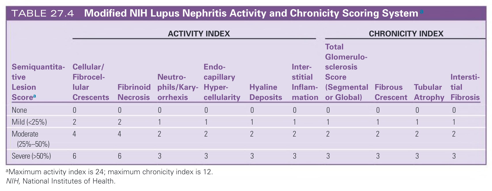

#### Table Data (CSV: [Table_27_4.csv](Table_27_4.csv))

```markdown
| Semiquantitative Lesion Score | Cellular/Fibrocellular Crescents | Fibrinoid Necrosis | Neutrophils/Karyorrhexis | Endocapillary Hypercellularity | Hyaline Deposits | Interstitial Inflammation | Total Glomerulosclerosis Score (Segmental or Global) | Fibrous Crescent | Tubular Atrophy | Interstitial Fibrosis |
| :--- | :--- | :--- | :--- | :--- | :--- | :--- | :--- | :--- | :--- | :--- |
| None | 0 | 0 | 0 | 0 | 0 | 0 | 0 | 0 | 0 | 0 |
| Mild (<25%) | 2 | 2 | 1 | 1 | 1 | 1 | 1 | 1 | 1 | 1 |
| Moderate (25%-50%) | 4 | 4 | 2 | 2 | 2 | 2 | 2 | 2 | 2 | 2 |
| Severe (>50%) | 6 | 6 | 3 | 3 | 3 | 3 | 3 | 3 | 3 | 3 |

aMaximum activity index is 24; maximum chronicity index is 12.
NIH, National Institutes of Health.
```

TABLE 27.4 Modified NIH Lupus Nephritis Activity and Chronicity Scoring System a

---

## Boxes

*No boxes resolved for this chapter.*
