# 028. Monoclonal Immunoglobulin-Related Glomerular Diseases and Renal Amyloidosis - Figures and Tables Index

This document lists all figures, tables and boxes extracted from `028. Monoclonal Immunoglobulin-Related Glomerular Diseases and Renal Amyloidosis.pdf`.

## Table of Contents
- [Figures](#figures)
- [Tables](#tables)
- [Boxes](#boxes)

---

## Figures

### Fig_28_1

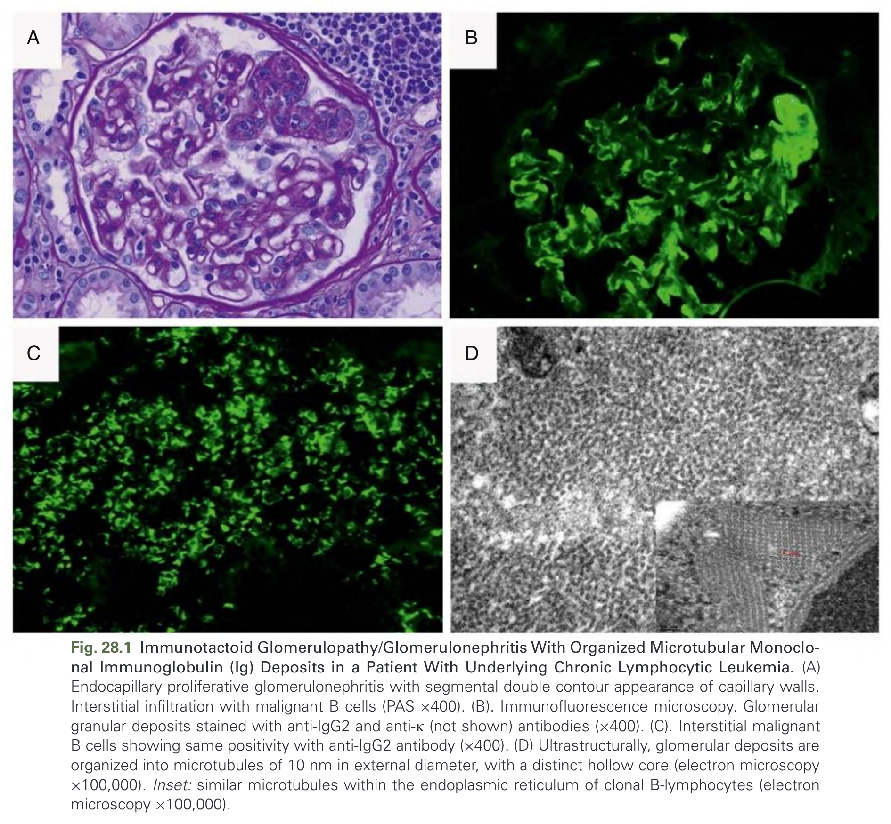

Fig. 28.1 Immunotactoid Glomerulopathy/Glomerulonephritis With Organized Microtubular Monoclonal Immunoglobulin (Ig) Deposits in a Patient With Underlying Chronic Lymphocytic Leukemia. (A) Endocapillary proliferative glomerulonephritis with segmental double contour appearance of capillary walls. Interstitial infiltration with malignant B cells (PAS ×400). (B) Immunofluorescence microscopy. Glomerular granular deposits stained with anti-IgG2 and anti-κ (not shown) antibodies (×400). (C) Interstitial malignant B cells showing same positivity with anti-IgG2 antibody (×400). (D) Ultrastructurally, glomerular deposits are organized into microtubules of 10 nm in external diameter, with a distinct hollow core (electron microscopy ×100,000). Inset: similar microtubules within the endoplasmic reticulum of clonal B-lymphocytes (electron microscopy ×100,000).

---

### Fig_28_2

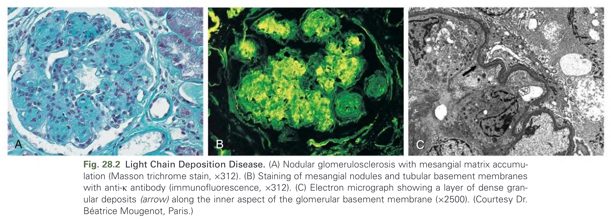

Fig. 28.2 Light Chain Deposition Disease. (A) Nodular glomerulosclerosis with mesangial matrix accumulation (Masson trichrome stain, ×312). (B) Staining of mesangial nodules and tubular basement membranes with anti-κ antibody (immunofluorescence, ×312). (C) Electron micrograph showing a layer of dense granular deposits (arrow) along the inner aspect of the glomerular basement membrane (×2500). (Courtesy Dr. Béatrice Mougenot, Paris.)

---

### Fig_28_3

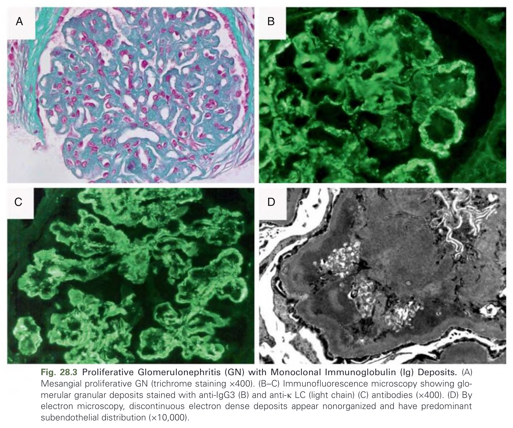

Fig. 28.3 Proliferative Glomerulonephritis (GN) with Monoclonal Immunoglobulin (Ig) Deposits. (A) Mesangial proliferative GN (trichrome staining ×400). (B–C) Immunofluorescence microscopy showing glomerular granular deposits stained with anti-IgG3 (B) and anti-κ LC (light chain) (C) antibodies (×400). (D) By electron microscopy, discontinuous electron dense deposits appear nonorganized and have predominant subendothelial distribution (×10,000).

---

### Fig_28_4

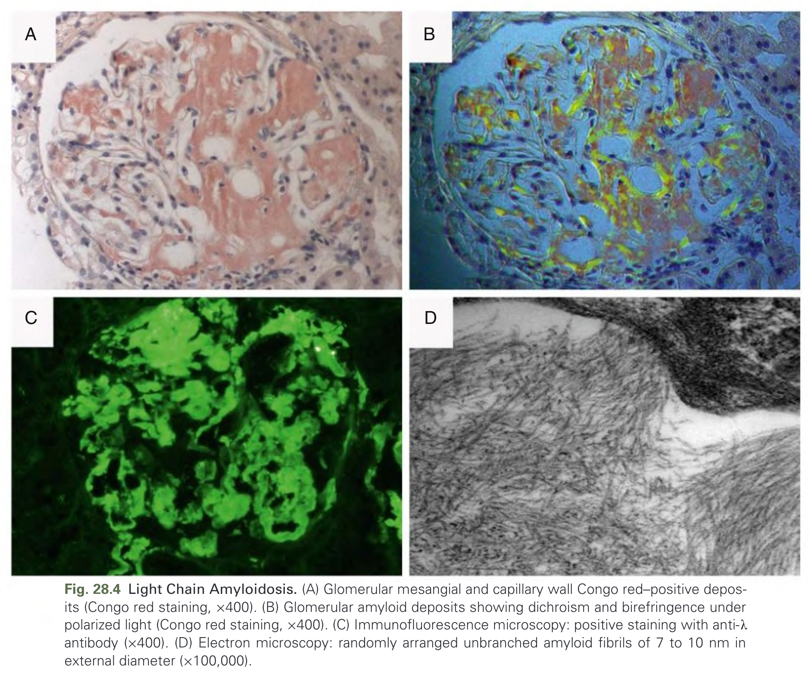

Fig. 28.4 Light Chain Amyloidosis. (A) Glomerular mesangial and capillary wall Congo red-positive deposits (Congo red staining, ×400). (B) Glomerular amyloid deposits showing dichroism and birefringence under polarized light (Congo red staining, ×400). (C) Immunofluorescence microscopy: positive staining with anti-λ antibody (×400). (D) Electron microscopy: randomly arranged unbranched amyloid fibrils of 7 to 10 nm in external diameter (×100,000).

---

### Fig_28_5

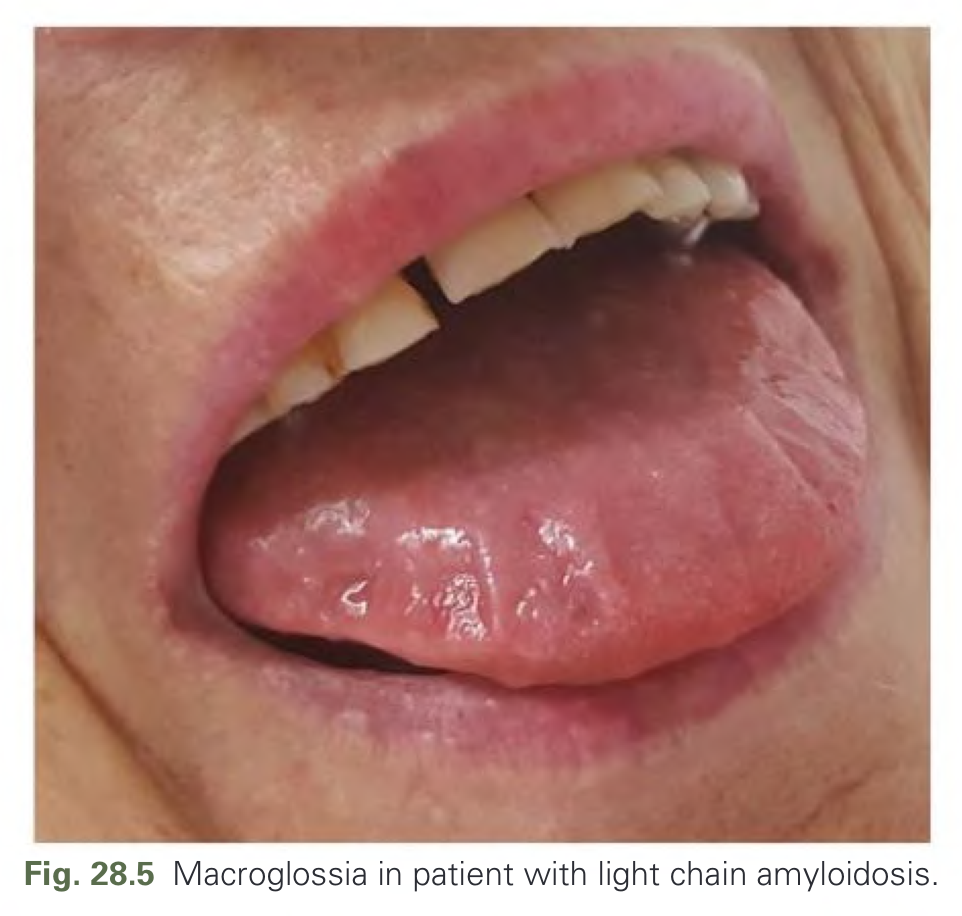

Fig. 28.5 Macroglossia in patient with light chain amyloidosis.

---

### Fig_28_6

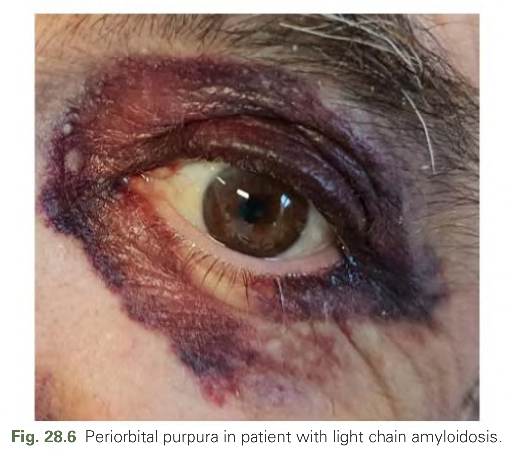

Fig. 28.6 Periorbital purpura in patient with light chain amyloidosis.

---

## Tables

### Table_28_1

#### Table Image

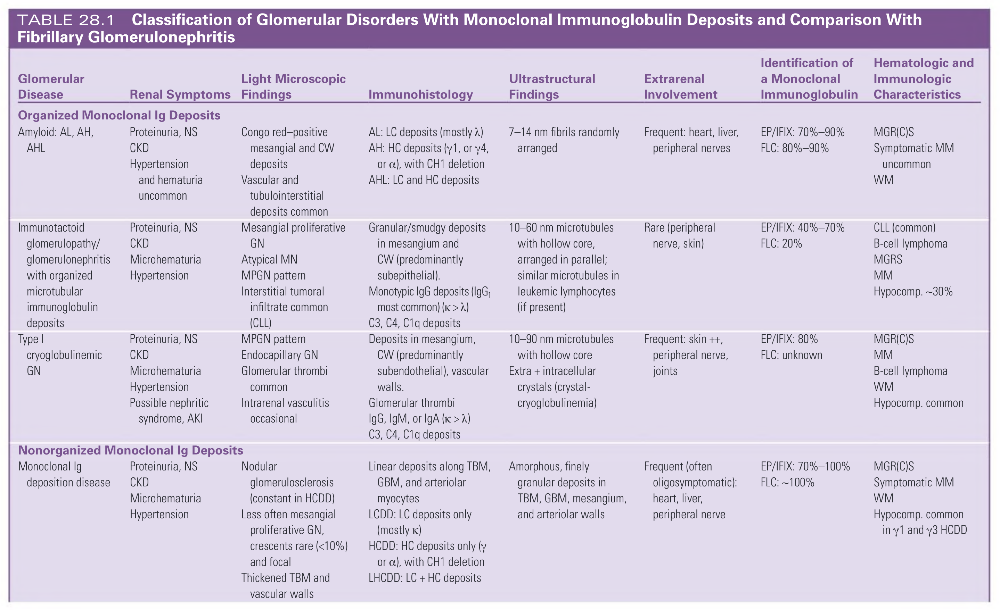

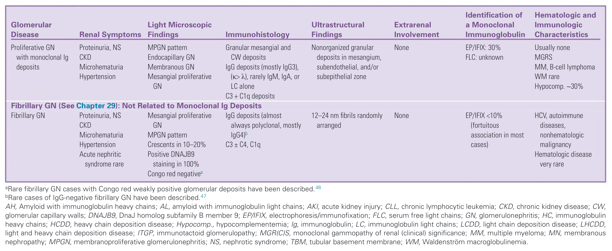

#### Table Data (CSV: [Table_28_1.csv](Table_28_1.csv))

```markdown
| Glomerular Disease | Renal Symptoms | Light Microscopic Findings | Immunohistology | Ultrastructural Findings | Extrarenal Involvement | Identification of a Monoclonal Immunoglobulin | Hematologic and Immunologic Characteristics |
| :--- | :--- | :--- | :--- | :--- | :--- | :--- | :--- |
| **Organized Monoclonal Ig Deposits** | | | | | | | |
| Amyloid: AL, AH, AHL | Proteinuria, NS, CKD, Hypertension and hematuria uncommon | Congo red-positive mesangial and CW deposits, Vascular and tubulointerstitial deposits common | AL: LC deposits (mostly λ), AH: HC deposits (γ1, or γ4, or α), with CH1 deletion, AHL: LC and HC deposits | 7-14 nm fibrils randomly arranged | Frequent: heart, liver, peripheral nerves | EP/IFIX: 70%-90%, FLC: 80%-90% | MGR(C)S, Symptomatic MM uncommon, WM |
| Immunotactoid glomerulopathy/glomerulonephritis with organized microtubular immunoglobulin deposits | Proteinuria, NS, CKD, Microhematuria, Hypertension | Mesangial proliferative GN, Atypical MN, MPGN pattern, Interstitial tumoral infiltrate common (CLL) | Granular/smudgy deposits in mesangium and CW (predominantly subepithelial). Monotypic IgG deposits (IgG₁ most common) (κ > λ), C3, C4, C1q deposits | 10-60 nm microtubules with hollow core, arranged in parallel; similar microtubules in leukemic lymphocytes (if present) | Rare (peripheral nerve, skin) | EP/IFIX: 40%-70%, FLC: 20% | CLL (common), B-cell lymphoma, MGRS, MM, Hypocomp. ~30% |
| Type I cryoglobulinemic GN | Proteinuria, NS, CKD, Microhematuria, Hypertension, Possible nephritic syndrome, AKI | MPGN pattern, Endocapillary GN, Glomerular thrombi common, Intrarenal vasculitis occasional | Deposits in mesangium, CW (predominantly subendothelial), vascular walls. Glomerular thrombi, IgG, IgM, or IgA (κ > λ), C3, C4, C1q deposits | 10-90 nm microtubules with hollow core, Extra + intracellular crystals (crystal-cryoglobulinemia) | Frequent: skin ++, peripheral nerve, joints | EP/IFIX: 80%, FLC: unknown | MGR(C)S, MM, B-cell lymphoma, WM, Hypocomp. common |
| **Nonorganized Monoclonal Ig Deposits** | | | | | | | |
| Monoclonal Ig deposition disease | Proteinuria, NS, CKD, Microhematuria, Hypertension | Nodular glomerulosclerosis (constant in HCDD), Less often mesangial proliferative GN, crescents rare (<10%) and focal, Thickened TBM and vascular walls | Linear deposits along TBM, GBM, and arteriolar myocytes, LCDD: LC deposits only (mostly κ), HCDD: HC deposits only (γ or α), with CH1 deletion, LHCDD: LC + HC deposits | Amorphous, finely granular deposits in TBM, GBM, mesangium, and arteriolar walls | Frequent (often oligosymptomatic): heart, liver, peripheral nerve | EP/IFIX: 70%-100%, FLC:~100% | MGR(C)S, Symptomatic MM, WM, Hypocomp. common in γ1 and γ3 HCDD |
| Proliferative GN with monoclonal Ig deposits | Proteinuria, NS, CKD, Microhematuria, Hypertension | MPGN pattern, Endocapillary GN, Membranous GN, Mesangial proliferative GN | Granular mesangial and CW deposits, IgG deposits (mostly IgG3), (κ > λ), rarely IgM, IgA, or LC alone, C3 + C1q deposits | Nonorganized granular deposits in mesangium, subendothelial, and/or subepithelial zone | None | EP/IFIX: 30%, FLC: unknown | Usually none, MGRS, MM, B-cell lymphoma, WM rare, Hypocomp. ~30% |
| **Fibrillary GN (See Chapter 29): Not Related to Monoclonal Ig Deposits** | | | | | | | |
| Fibrillary GN | Proteinuria, NS, CKD, Microhematuria, Hypertension, Acute nephritic syndrome rare | Mesangial proliferative GN, MPGN pattern, Crescents in 10-20%, Positive DNAJB9 staining in 100%, Congo red negativea | IgG deposits (almost always polyclonal, mostly IgG4)ᵇ, C3 + C4, C1q | 12-24 nm fibrils randomly arranged | None | EP/IFIX <10% (fortuitous association in most cases) | HCV, autoimmune diseases, nonhematologic malignancy, Hematologic disease very rare |

AH, Amyloid with immunoglobulin heavy chains; AL, amyloid with immunoglobulin light chains; AKI, acute kidney injury; CLL, chronic lymphocytic leukemia; CKD, chronic kidney disease; CW, glomerular capillary walls; DNAJB9, DnaJ homolog subfamily B member 9; EP/IFIX, electrophoresis/immunofixation; FLC, serum free light chains; GN, glomerulonephritis; HC, immunoglobulin heavy chains; HCDD, heavy chain deposition disease; Hypocomp., hypocomplementemia; Ig, immunoglobulin; LC, immunoglobulin light chains; LCDD, light chain deposition disease; LHCDD, light and heavy chain deposition disease; ITGP, immunotactoid glomerulopathy; MGR(C)S, monoclonal gammopathy of renal (clinical) significance; MM, multiple myeloma; MN, membranous nephropathy; MPGN, membranoproliferative glomerulonephritis; NS, nephrotic syndrome; TBM, tubular basement membrane; WM, Waldenström macroglobulinemia.
aRare fibrillary GN cases with Congo red weakly positive glomerular deposits have been described.
ᵇRare cases of IgG-negative fibrillary GN have been described.
```

TABLE 28.1 Classification of Glomerular Disorders With Monoclonal Immunoglobulin Deposits and Comparison With Fibrillary Glomerulonephritis

---

### Table_28_2

#### Table Image

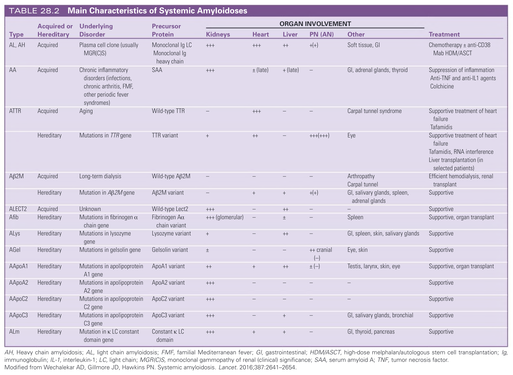

#### Table Data (CSV: [Table_28_2.csv](Table_28_2.csv))

```markdown
| Type | Acquired or Hereditary | Underlying Disorder | Precursor Protein | Organ Involvement: Kidneys | Organ Involvement: Heart | Organ Involvement: Liver | Organ Involvement: PN (AN) | Organ Involvement: Other | Treatment |
| :--- | :--- | :--- | :--- | :--- | :--- | :--- | :--- | :--- | :--- |
| AL, AH | Acquired | Plasma cell clone (usually MGR(C)S) | Monoclonal Ig LC, Monoclonal Ig heavy chain | +++ | +++ | ++ | +(+) | Soft tissue, GI | Chemotherapy ± anti-CD38 Mab, HDM/ASCT |
| AA | Acquired | Chronic inflammatory disorders (infections, chronic arthritis, FMF, other periodic fever syndromes) | SAA | +++ | ± (late) | + (late) | — | GI, adrenal glands, thyroid | Suppression of inflammation, Anti-TNF and anti-IL1 agents, Colchicine |
| ATTR | Acquired | Aging | Wild-type TTR | — | +++ | — | — | Carpal tunnel syndrome | Supportive treatment of heart failure, Tafamidis |
| ATTR | Hereditary | Mutations in TTR gene | TTR variant | + | ++ | — | +++(+++) | Eye | Supportive treatment of heart failure, Tafamidis, RNA interference, Liver transplantation (in selected patients) |
| Aβ2M | Acquired | Long-term dialysis | Wild-type Aβ2M | — | — | — | — | Arthropathy, Carpal tunnel | Efficient hemodialysis, renal transplant |
| Aβ2M | Hereditary | Mutation in Aβ2M gene | Aβ2M variant | — | + | + | +(+) | GI, salivary glands, spleen, adrenal glands | Supportive |
| ALECT2 | Acquired | Unknown | Wild-type Lect2 | +++ | — | ++ | — | — | Supportive |
| Afib | Hereditary | Mutations in fibrinogen α chain gene | Fibrinogen Aα chain variant | +++ (glomerular) | — | ± | — | Spleen | Supportive, organ transplant |
| Alys | Hereditary | Mutations in lysozyme gene | Lysozyme variant | + | — | ++ | — | GI, spleen, skin, salivary glands | Supportive |
| AGel | Hereditary | Mutations in gelsolin gene | Gelsolin variant | ± | — | — | ++ cranial (-) | Eye, skin | Supportive |
| AApoA1 | Hereditary | Mutations in apolipoprotein A1 gene | ApoA1 variant | ++ | + | ++ | ± (-) | Testis, larynx, skin, eye | Supportive, organ transplant |
| AApoA2 | Hereditary | Mutations in apolipoprotein A2 gene | ApoA2 variant | +++ | — | — | — | — | Supportive |
| AApoC2 | Hereditary | Mutations in apolipoprotein C2 gene | ApoC2 variant | +++ | — | — | — | — | Supportive |
| AApoC3 | Hereditary | Mutations in apolipoprotein C3 gene | ApoC3 variant | +++ | — | + | — | GI, salivary glands, bronchial | Supportive |
| ALm | Hereditary | Mutation in κ LC constant domain gene | Constant κ LC domain | +++ | + | + | — | GI, thyroid, pancreas | Supportive |

AA, Amyloid A protein; AH, amyloid immunoglobulin heavy chain; AL, amyloid immunoglobulin light chain; AN, autonomic neuropathy; ASCT, autologous stem cell transplantation; ATTR, amyloid transthyretin; Aβ2M, amyloid β2-microglobulin; FMF, familial Mediterranean fever; GI, gastrointestinal; HDM, high-dose melphalan; IL, interleukin; LC, light chain; MGR(C)S, monoclonal gammopathy of renal (clinical) significance; PN, peripheral neuropathy; SAA, serum amyloid A protein; TNF, tumor necrosis factor; TTR, transthyretin.
Modified from Wechalekar AD, Gillmore JD, Hawkins PN. Systemic amyloidosis. Lancet. 2016;387:2641–2654.
```

TABLE 28.2 Main Characteristics of Systemic Amyloidoses

---

### Table_28_3

#### Table Image

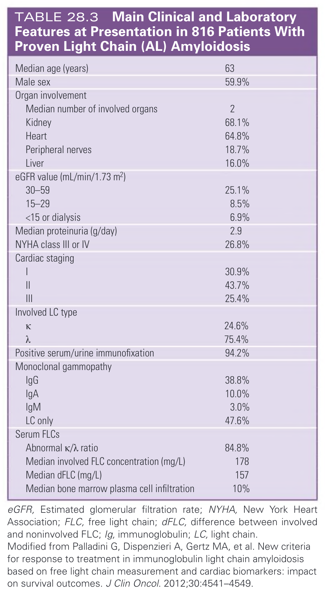

#### Table Data (CSV: [Table_28_3.csv](Table_28_3.csv))

```markdown
| | |
| :--- | :--- |
| Median age (years) | 63 |
| Male sex | 59.9% |
| **Organ involvement** | |
| Median number of involved organs | 2 |
| Kidney | 68.1% |
| Heart | 64.8% |
| Peripheral nerves | 18.7% |
| Liver | 16.0% |
| **eGFR value (mL/min/1.73 m²)** | |
| 30-59 | 25.1% |
| 15-29 | 8.5% |
| <15 or dialysis | 6.9% |
| Median proteinuria (g/day) | 2.9 |
| NYHA class III or IV | 26.8% |
| **Cardiac staging** | |
| I | 30.9% |
| II | 43.7% |
| III | 25.4% |
| **Involved LC type** | |
| K | 24.6% |
| λ | 75.4% |
| Positive serum/urine immunofixation | 94.2% |
| **Monoclonal gammopathy** | |
| IgG | 38.8% |
| IgA | 10.0% |
| IgM | 3.0% |
| LC only | 47.6% |
| **Serum FLCs** | |
| Abnormal κ/λ ratio | 84.8% |
| Median involved FLC concentration (mg/L) | 178 |
| Median dFLC (mg/L) | 157 |
| Median bone marrow plasma cell infiltration | 10% |

eGFR, Estimated glomerular filtration rate; NYHA, New York Heart Association; FLC, free light chain; dFLC, difference between involved and noninvolved FLC; Ig, immunoglobulin; LC, light chain.
Modified from Palladini G, Dispenzieri A, Gertz MA, et al. New criteria for response to treatment in immunoglobulin light chain amyloidosis based on free light chain measurement and cardiac biomarkers: impact on survival outcomes. J Clin Oncol. 2012;30:4541-4549.
```

TABLE 28.3 Main Clinical and Laboratory Features at Presentation in 816 Patients With Proven Light Chain (AL) Amyloidosis

---

### Table_28_4

#### Table Image

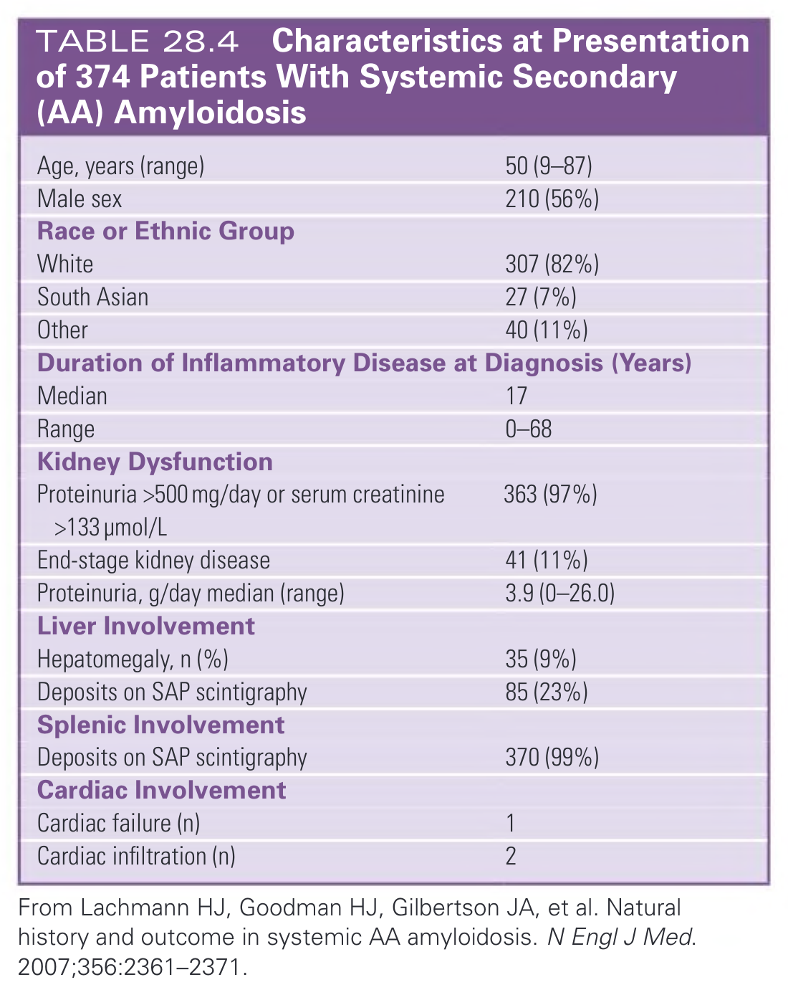

#### Table Data (CSV: [Table_28_4.csv](Table_28_4.csv))

```markdown
| | |
| :--- | :--- |
| Age, years (range) | 50 (9-87) |
| Male sex | 210 (56%) |
| **Race or Ethnic Group** | |
| White | 307 (82%) |
| South Asian | 27 (7%) |
| Other | 40 (11%) |
| **Duration of Inflammatory Disease at Diagnosis (Years)** | |
| Median | 17 |
| Range | 0-68 |
| **Kidney Dysfunction** | |
| Proteinuria >500 mg/day or serum creatinine >133 µmol/L | 363 (97%) |
| End-stage kidney disease | 41 (11%) |
| Proteinuria, g/day median (range) | 3.9 (0-26.0) |
| **Liver Involvement** | |
| Hepatomegaly, n (%) | 35 (9%) |
| Deposits on SAP scintigraphy | 85 (23%) |
| **Splenic Involvement** | |
| Deposits on SAP scintigraphy | 370 (99%) |
| **Cardiac Involvement** | |
| Cardiac failure (n) | 1 |
| Cardiac infiltration (n) | 2 |
From Lachmann HJ, Goodman HJ, Gilbertson JA, et al. Natural history and outcome in systemic AA amyloidosis. N Engl J Med. 2007;356:2361-2371.
```

TABLE 28.4 Characteristics at Presentation of 374 Patients With Systemic Secondary (AA) Amyloidosis

---

## Boxes

*No boxes resolved for this chapter.*
