# 029. Rare Glomerular Disorders - Figures and Tables Index

This document lists all figures, tables and boxes extracted from `029. Rare Glomerular Disorders.pdf`.

## Table of Contents
- [Figures](#figures)
- [Tables](#tables)
- [Boxes](#boxes)

---

## Figures

### Fig_29_1

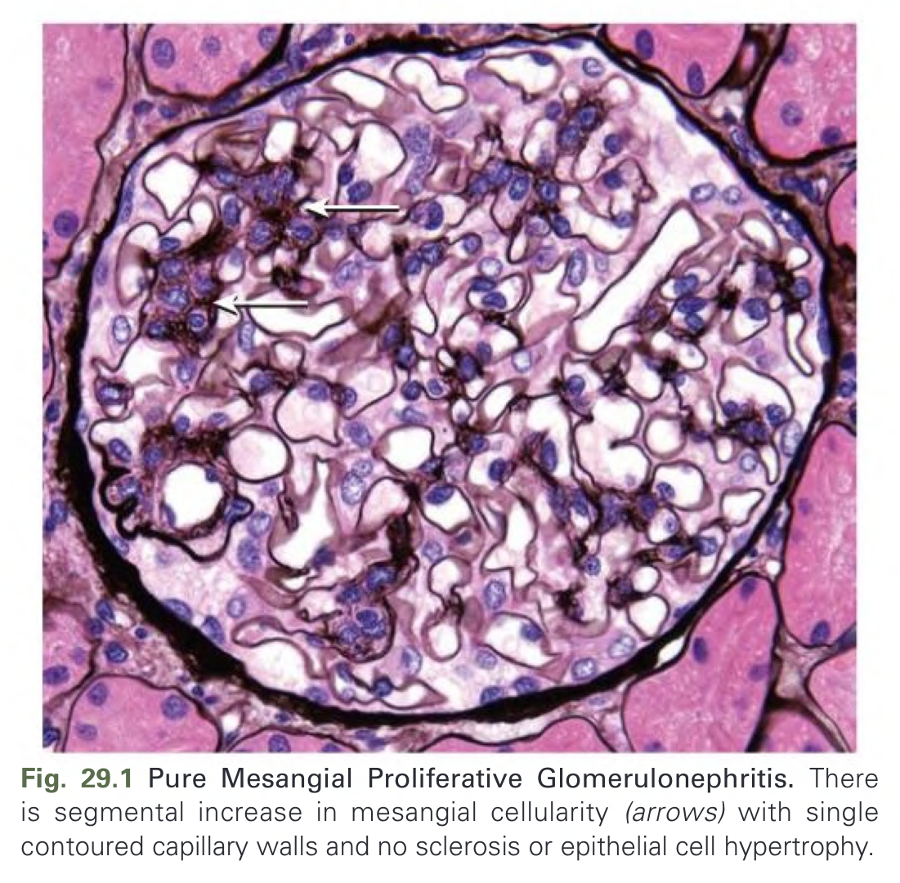

Fig. 29.1 Pure Mesangial Proliferative Glomerulonephritis. There is segmental increase in mesangial cellularity (arrows) with single contoured capillary walls and no sclerosis or epithelial cell hypertrophy.

---

### Fig_29_2

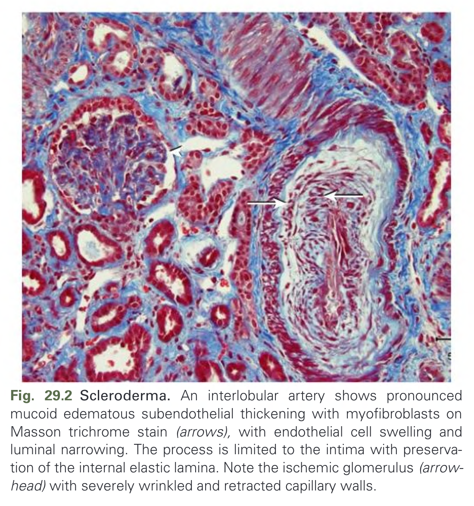

Fig. 29.2 Scleroderma. An interlobular artery shows pronounced mucoid edematous subendothelial thickening with myofibroblasts on Masson trichrome stain (arrows), with endothelial cell swelling and luminal narrowing. The process is limited to the intima with preservation of the internal elastic lamina. Note the ischemic glomerulus (arrowhead) with severely wrinkled and retracted capillary walls.

---

### Fig_29_3

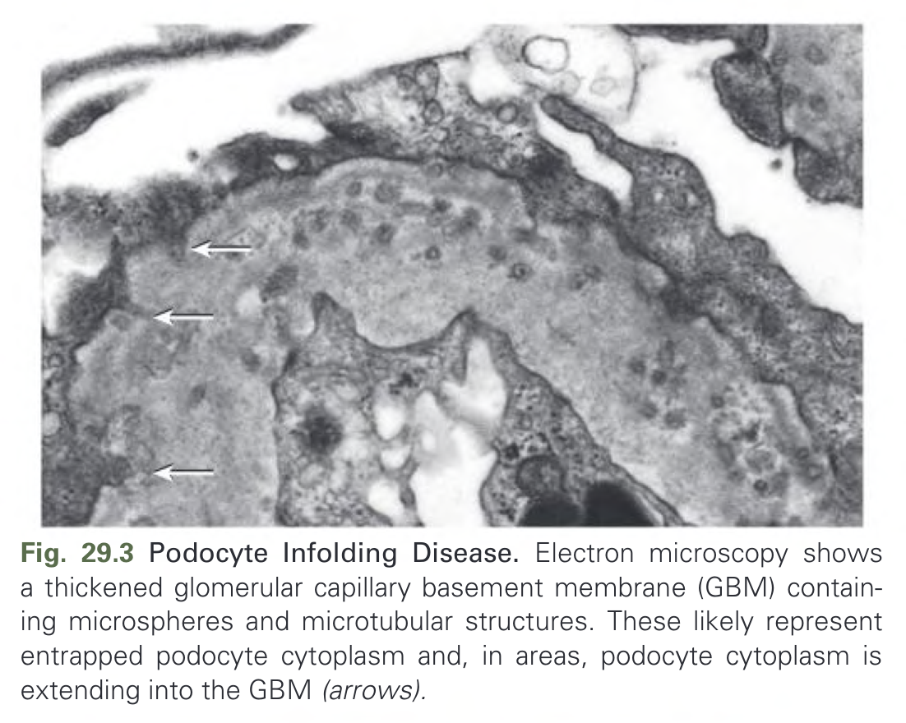

Fig. 29.3 Podocyte Infolding Disease. Electron microscopy shows a thickened glomerular capillary basement membrane (GBM) containing microspheres and microtubular structures. These likely represent entrapped podocyte cytoplasm and, in areas, podocyte cytoplasm is extending into the GBM (arrows).

---

### Fig_29_4

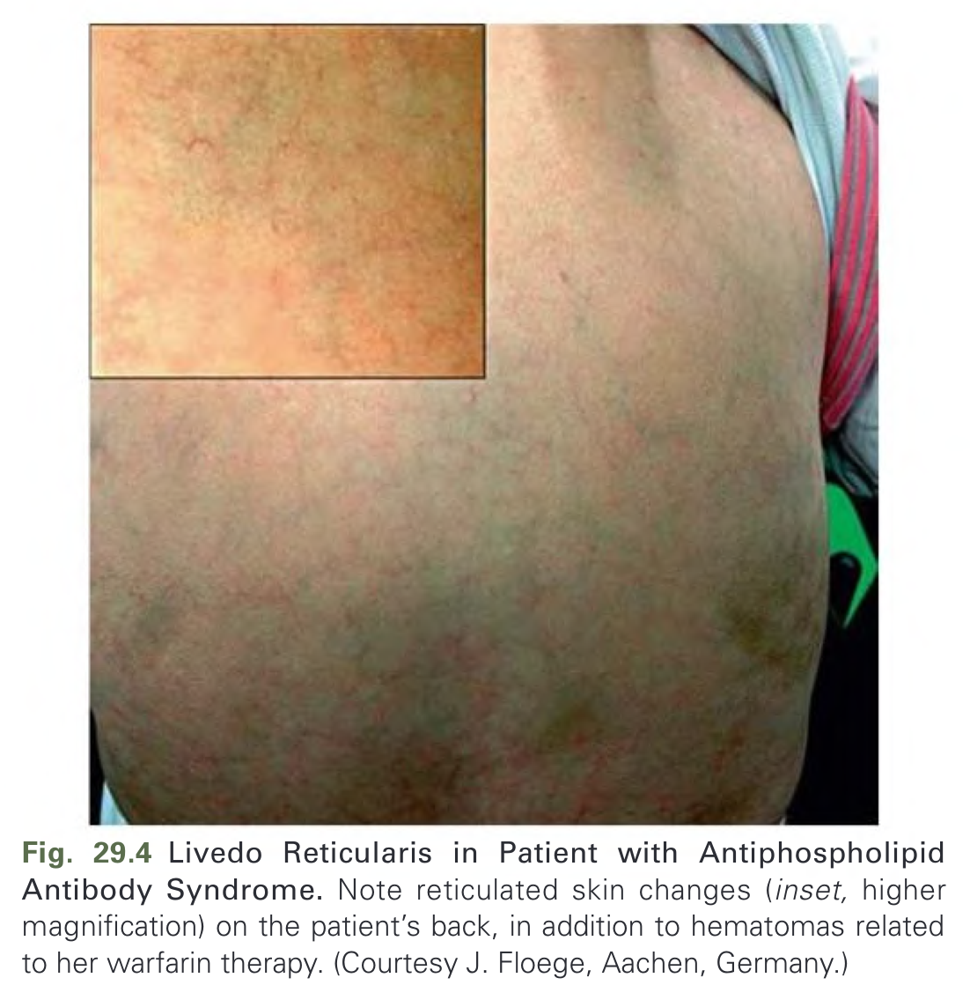

Fig. 29.4 Livedo Reticularis in Patient with Antiphospholipid Antibody Syndrome. Note reticulated skin changes (inset, higher magnification) on the patient’s back, in addition to hematomas related to her warfarin therapy. (Courtesy J. Floege, Aachen, Germany.)

---

### Fig_29_5

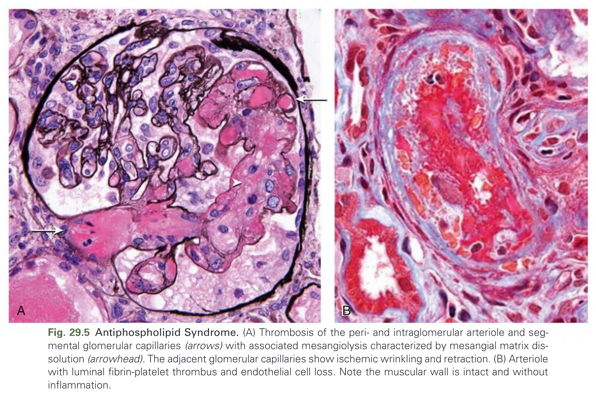

Fig. 29.5 Antiphospholipid Syndrome. (A) Thrombosis of the peri- and intraglomerular arteriole and segmental glomerular capillaries (arrows) with associated mesangiolysis characterized by mesangial matrix dissolution (arrowhead). The adjacent glomerular capillaries show ischemic wrinkling and retraction. (B) Arteriole with luminal fibrin-platelet thrombus and endothelial cell loss. Note the muscular wall is intact and without inflammation.

---

### Fig_29_6

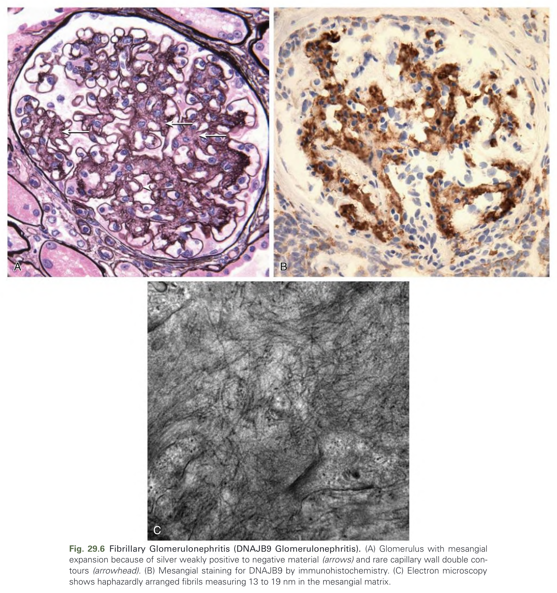

Fig. 29.6 Fibrillary Glomerulonephritis (DNAJB9 Glomerulonephritis). (A) Glomerulus with mesangial expansion because of silver weakly positive to negative material (arrows) and rare capillary wall double contours (arrowhead). (B) Mesangial staining for DNAJB9 by immunohistochemistry. (C) Electron microscopy shows haphazardly arranged fibrils measuring 13 to 19 nm in the mesangial matrix.

---

### Fig_29_7

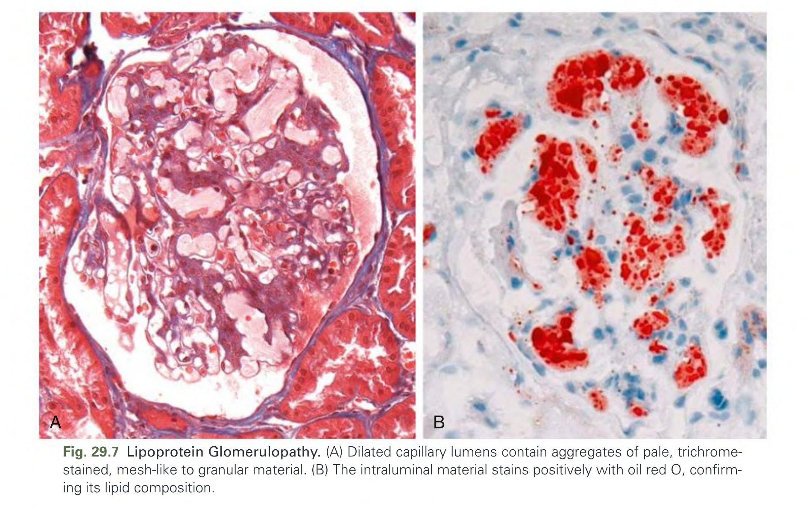

Fig. 29.7 Lipoprotein Glomerulopathy. (A) Dilated capillary lumens contain aggregates of pale, trichrome-stained, mesh-like to granular material. (B) The intraluminal material stains positively with oil red O, confirming its lipid composition.

---

### Fig_29_8

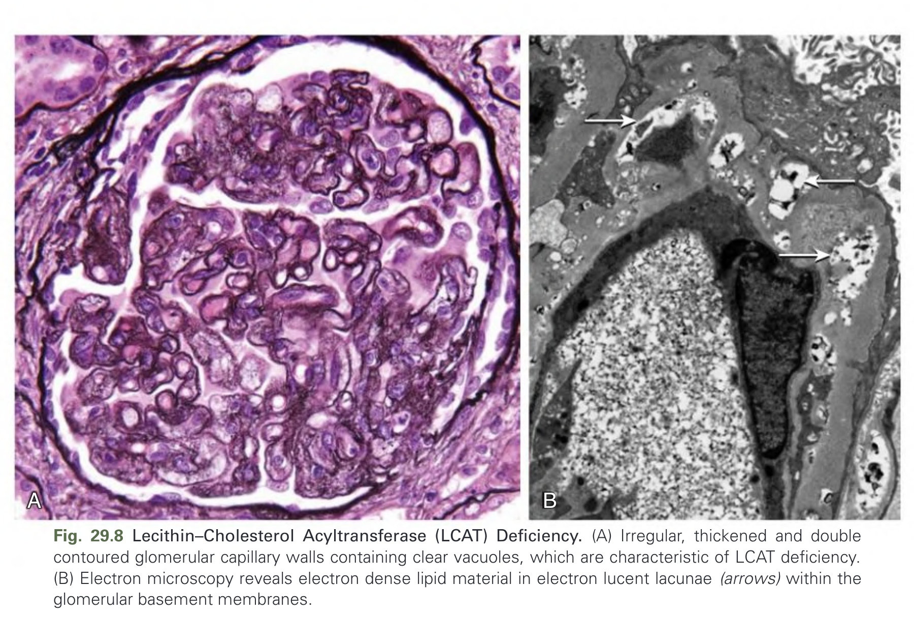

Fig. 29.8 Lecithin–Cholesterol Acyltransferase (LCAT) Deficiency. (A) Irregular, thickened and double contoured glomerular capillary walls containing clear vacuoles, which are characteristic of LCAT deficiency. (B) Electron microscopy reveals electron dense lipid material in electron lucent lacunae (arrows) within the glomerular basement membranes.

---

### Fig_29_9

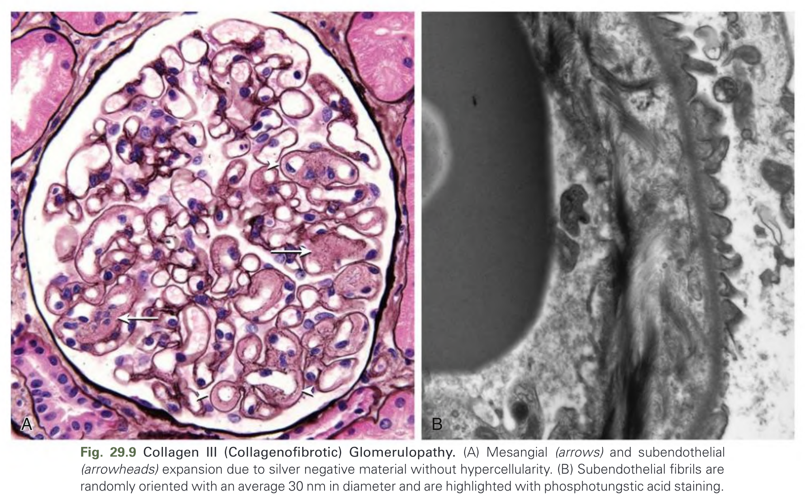

Fig. 29.9 Collagen III (Collagenofibrotic) Glomerulopathy. (A) Mesangial (arrows) and subendothelial (arrowheads) expansion due to silver negative material without hypercellularity. (B) Subendothelial fibrils are randomly oriented with an average 30 nm in diameter and are highlighted with phosphotungstic acid staining.

---

### Fig_29_10

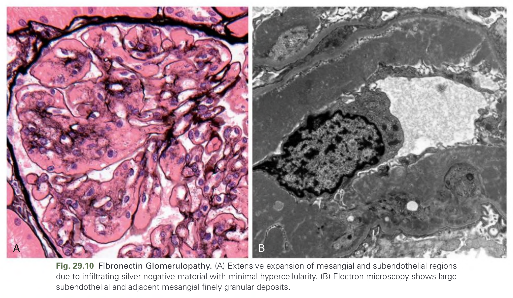

Fig. 29.10 Fibronectin Glomerulopathy. (A) Extensive expansion of mesangial and subendothelial regions due to infiltrating silver negative material with minimal hypercellularity. (B) Electron microscopy shows large subendothelial and adjacent mesangial finely granular deposits.

---

### Fig_29_11

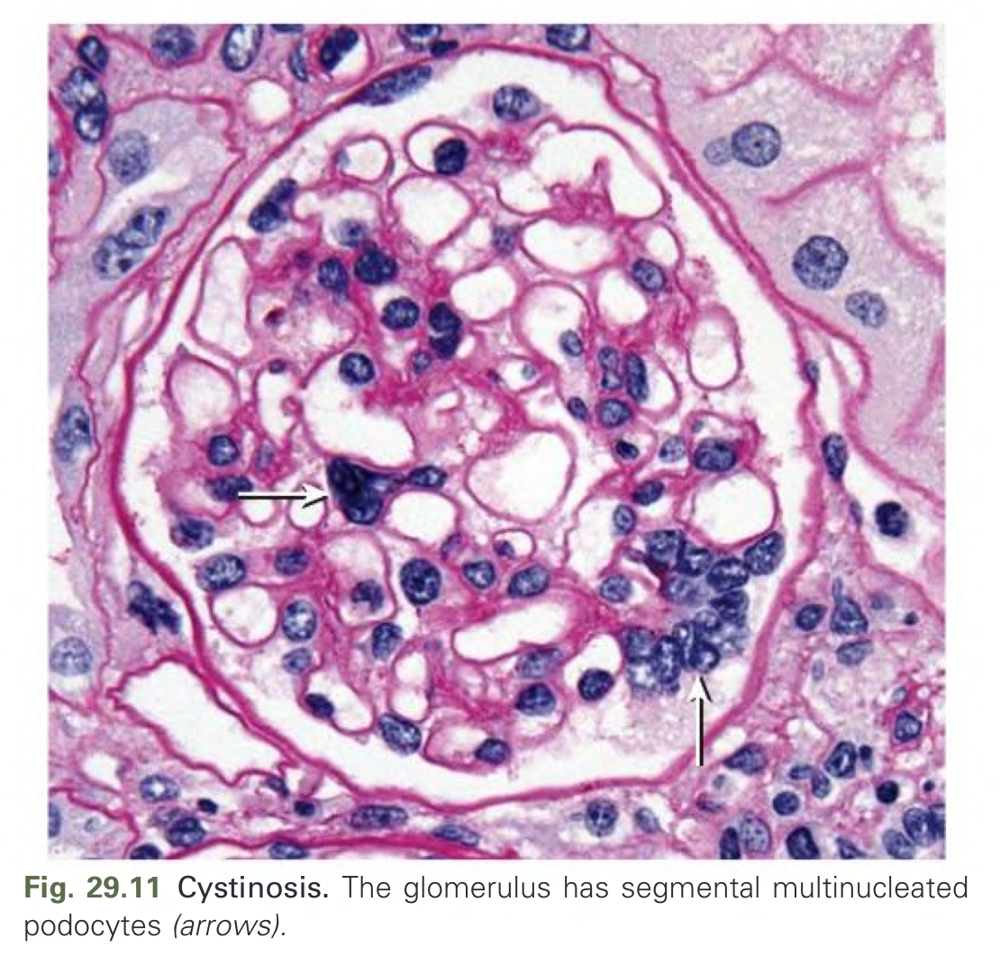

Fig. 29.11 Cystinosis. The glomerulus has segmental multinucleated podocytes (arrows).

---

### Fig_29_12

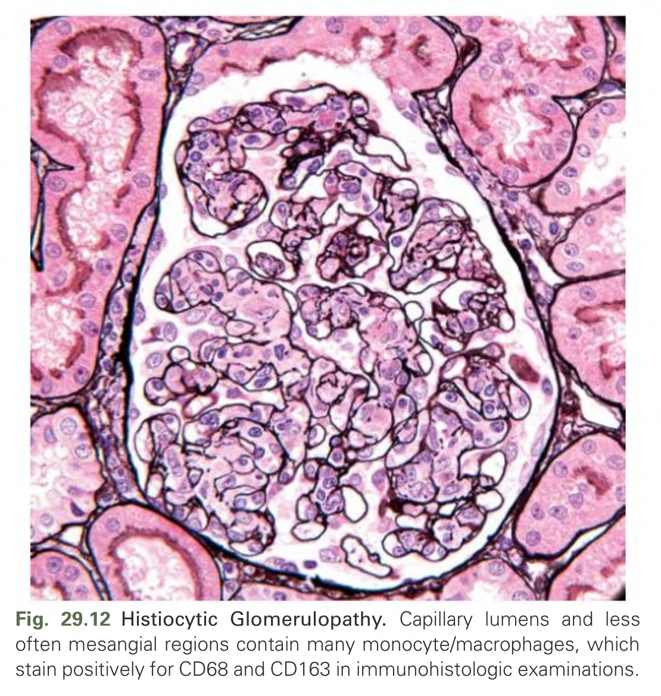

Fig. 29.12 Histiocytic Glomerulopathy. Capillary lumens and less often mesangial regions contain many monocyte/macrophages, which stain positively for CD68 and CD163 in immunohistologic examinations.

---

## Tables

### Table_29_1

#### Table Image

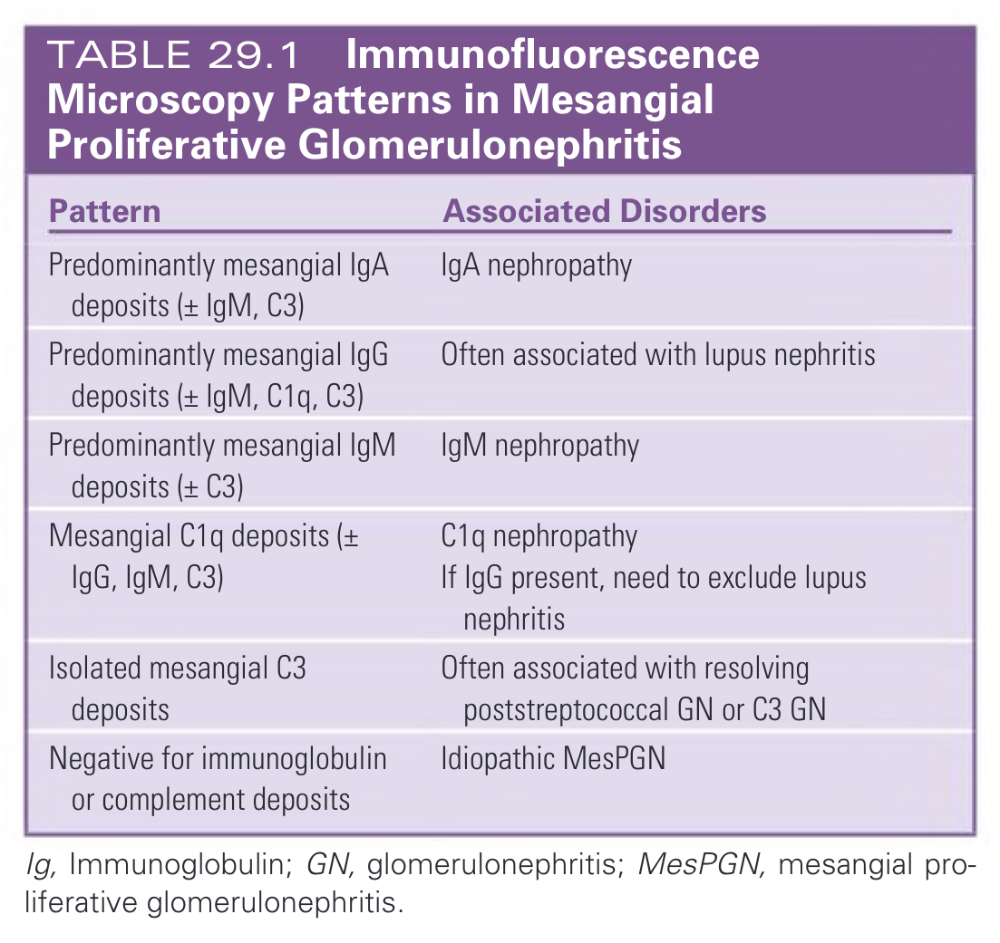

#### Table Data (CSV: [Table_29_1.csv](Table_29_1.csv))

```markdown
| Pattern | Associated Disorders |
| :--- | :--- |
| Predominantly mesangial IgA deposits (± IgM, C3) | IgA nephropathy |
| Predominantly mesangial IgG deposits (± IgM, C1q, C3) | Often associated with lupus nephritis |
| Predominantly mesangial IgM deposits (± C3) | IgM nephropathy |
| Mesangial C1q deposits (± IgG, IgM, C3) | C1q nephropathy; If IgG present, need to exclude lupus nephritis |
| Isolated mesangial C3 deposits | Often associated with resolving poststreptococcal GN or C3 GN |
| Negative for immunoglobulin or complement deposits | Idiopathic MesPGN |

Ig, Immunoglobulin; GN, glomerulonephritis; MesPGN, mesangial proliferative glomerulonephritis.
```

TABLE 29.1 Immunofluorescence Microscopy Patterns in Mesangial Proliferative Glomerulonephritis

---

## Boxes

### Box_29_1

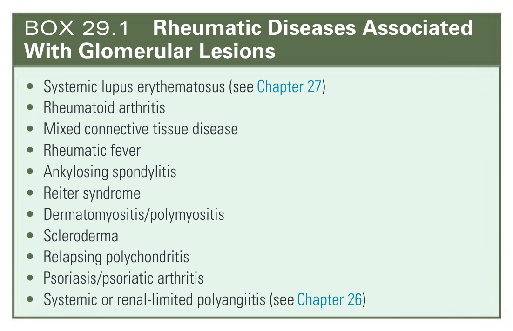

#### Box Text

```markdown
*   Systemic lupus erythematosus (see Chapter 27)
*   Rheumatoid arthritis
*   Mixed connective tissue disease
*   Rheumatic fever
*   Ankylosing spondylitis
*   Reiter syndrome
*   Dermatomyositis/polymyositis
*   Scleroderma
*   Relapsing polychondritis
*   Psoriasis/psoriatic arthritis
*   Systemic or renal-limited polyangiitis (see Chapter 26)
```

BOX 29.1 Rheumatic Diseases Associated With Glomerular Lesions

---

### Box_29_2

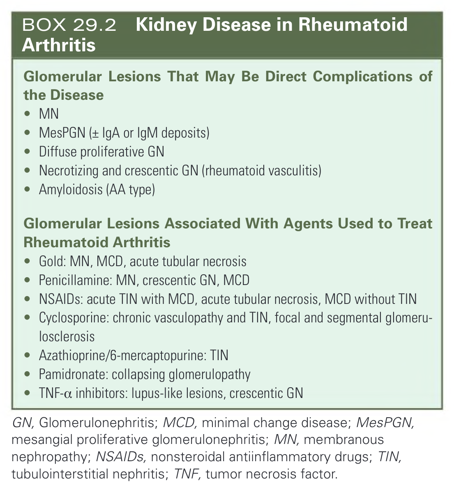

#### Box Text

```markdown
**Glomerular Lesions That May Be Direct Complications of the Disease**
*   MN
*   MesPGN (± IgA or IgM deposits)
*   Diffuse proliferative GN
*   Necrotizing and crescentic GN (rheumatoid vasculitis)
*   Amyloidosis (AA type)

**Glomerular Lesions Associated With Agents Used to Treat Rheumatoid Arthritis**
*   Gold: MN, MCD, acute tubular necrosis
*   Penicillamine: MN, crescentic GN, MCD
*   NSAIDs: acute TIN with MCD, acute tubular necrosis, MCD without TIN
*   Cyclosporine: chronic vasculopathy and TIN, focal and segmental glomerulosclerosis
*   Azathioprine/6-mercaptopurine: TIN
*   Pamidronate: collapsing glomerulopathy
*   TNF-a inhibitors: lupus-like lesions, crescentic GN

GN, Glomerulonephritis; MCD, minimal change disease; MesPGN, mesangial proliferative glomerulonephritis; MN, membranous nephropathy; NSAIDs, nonsteroidal antiinflammatory drugs; TIN, tubulointerstitial nephritis; TNF, tumor necrosis factor.
```

BOX 29.2 Kidney Disease in Rheumatoid Arthritis

---
