# 030. Thrombotic Microangiopathies, Including Hemolytic Uremic Syndrome - Figures and Tables Index

This document lists all figures, tables and boxes extracted from `030. Thrombotic Microangiopathies, Including Hemolytic Uremic Syndrome.pdf`.

## Table of Contents
- [Figures](#figures)
- [Tables](#tables)
- [Boxes](#boxes)

---

## Figures

### Fig_30_1

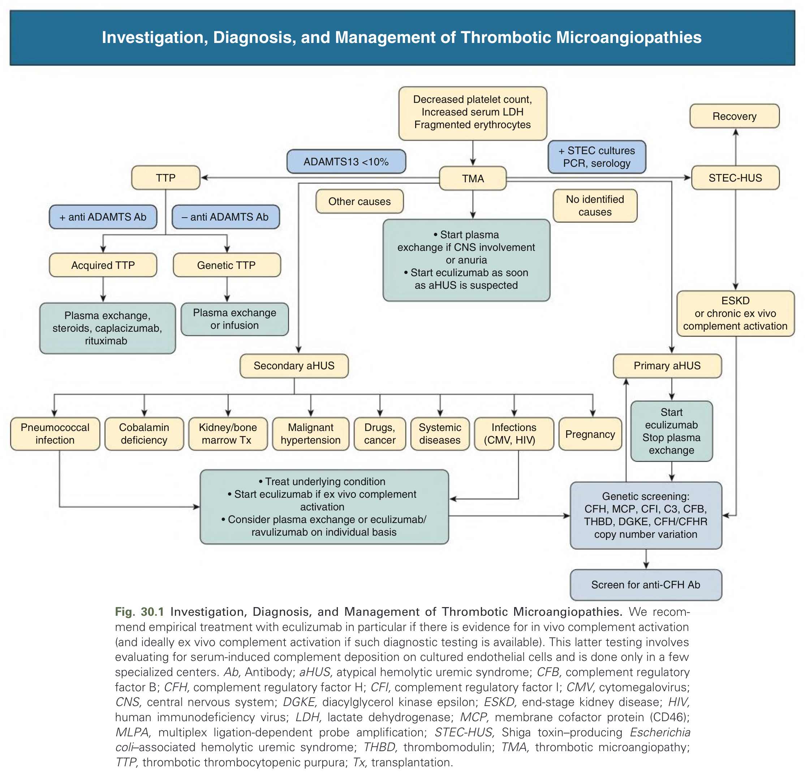

Fig. 30.1 Investigation, Diagnosis, and Management of Thrombotic Microangiopathies. We recommend empirical treatment with eculizumab in particular if there is evidence for in vivo complement activation (and ideally ex vivo complement activation if such diagnostic testing is available). This latter testing involves evaluating for serum-induced complement deposition on cultured endothelial cells and is done only in a few specialized centers. Ab, Antibody; aHUS, atypical hemolytic uremic syndrome; CFB, complement regulatory factor B; CFH, complement regulatory factor H; CFI, complement regulatory factor I; CMV, cytomegalovirus; CNS, central nervous system; DGKE, diacylglycerol kinase epsilon; ESKD, end-stage kidney disease; HIV, human immunodeficiency virus; LDH, lactate dehydrogenase; MCP, membrane cofactor protein (CD46); MLPA, multiplex ligation-dependent probe amplification; STEC-HUS, Shiga toxin–producing Escherichia coli–associated hemolytic uremic syndrome; THBD, thrombomodulin; TMA, thrombotic microangiopathy; TTP, thrombotic thrombocytopenic purpura; Tx, transplantation.

---

### Fig_30_2

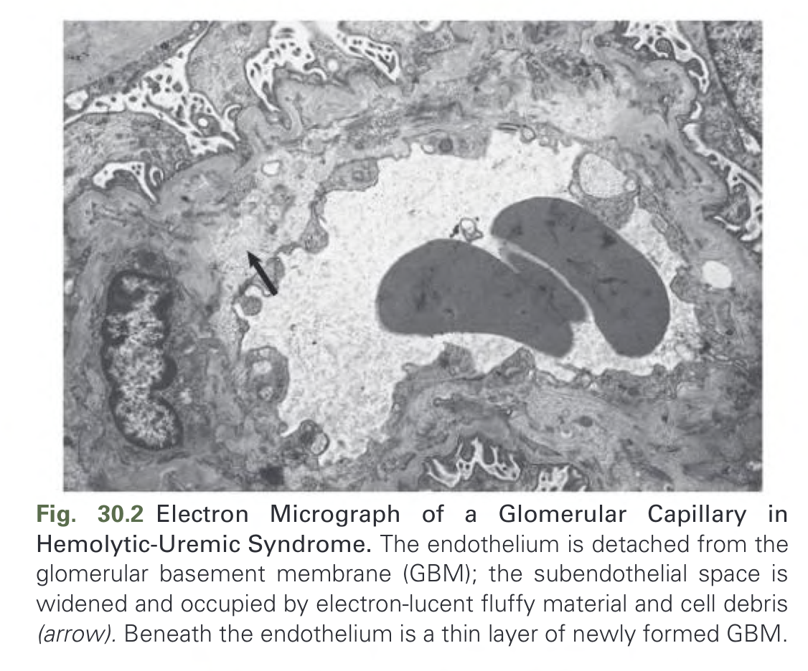

Fig. 30.2 Electron Micrograph of a Glomerular Capillary in Hemolytic-Uremic Syndrome. The endothelium is detached from the glomerular basement membrane (GBM); the subendothelial space is widened and occupied by electron-lucent fluffy material and cell debris (arrow). Beneath the endothelium is a thin layer of newly formed GBM.

---

### Fig_30_3

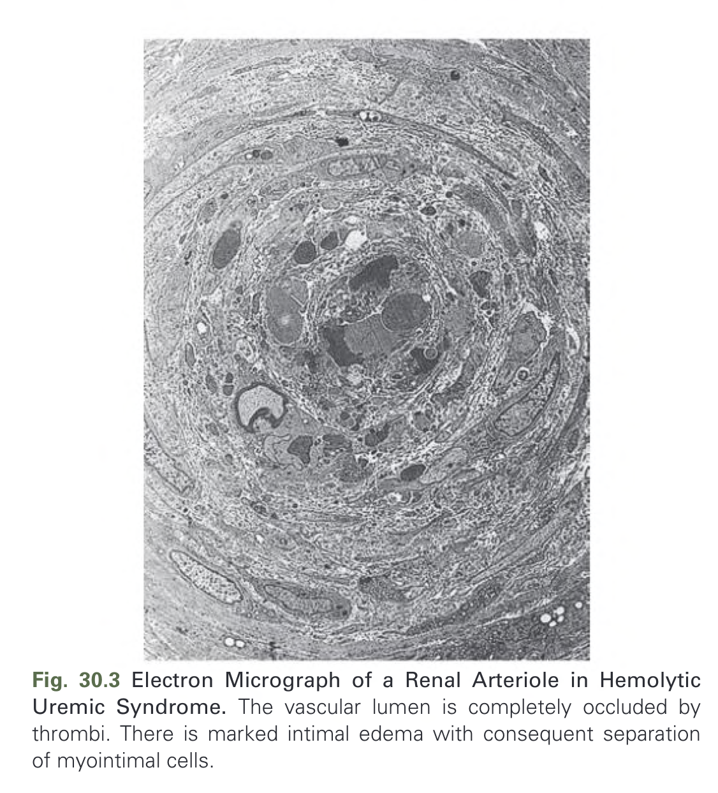

Fig. 30.3 Electron Micrograph of a Renal Arteriole in Hemolytic Uremic Syndrome. The vascular lumen is completely occluded by thrombi. There is marked intimal edema with consequent separation of myointimal cells.

---

### Fig_30_4

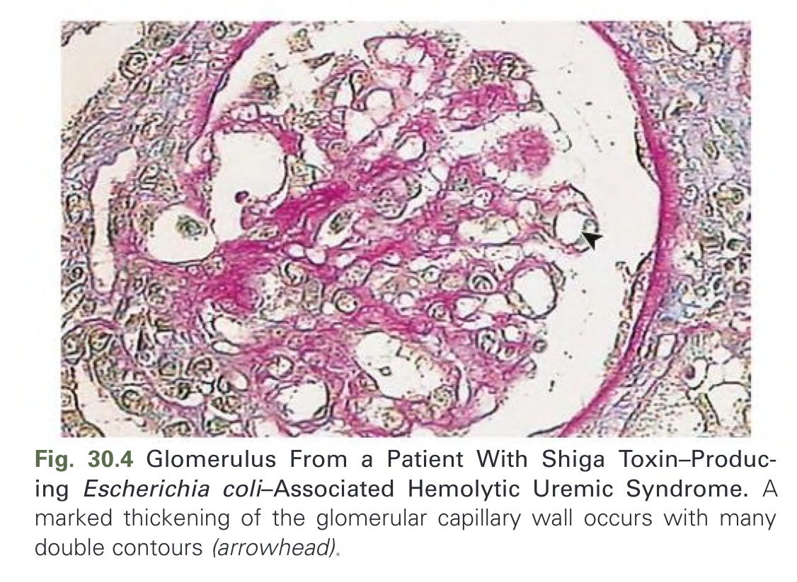

Fig. 30.4 Glomerulus From a Patient With Shiga Toxin–Producing Escherichia coli–Associated Hemolytic Uremic Syndrome. A marked thickening of the glomerular capillary wall occurs with many double contours (arrowhead)

---

### Fig_30_5

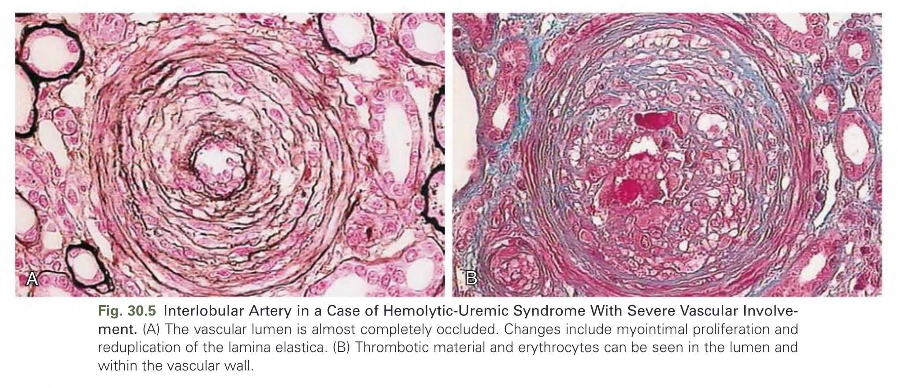

Fig. 30.5 Interlobular Artery in a Case of Hemolytic-Uremic Syndrome With Severe Vascular Involvement. (A) The vascular lumen is almost completely occluded. Changes include myointimal proliferation and reduplication of the lamina elastica. (B) Thrombotic material and erythrocytes can be seen in the lumen and within the vascular wall.

---

### Fig_30_6

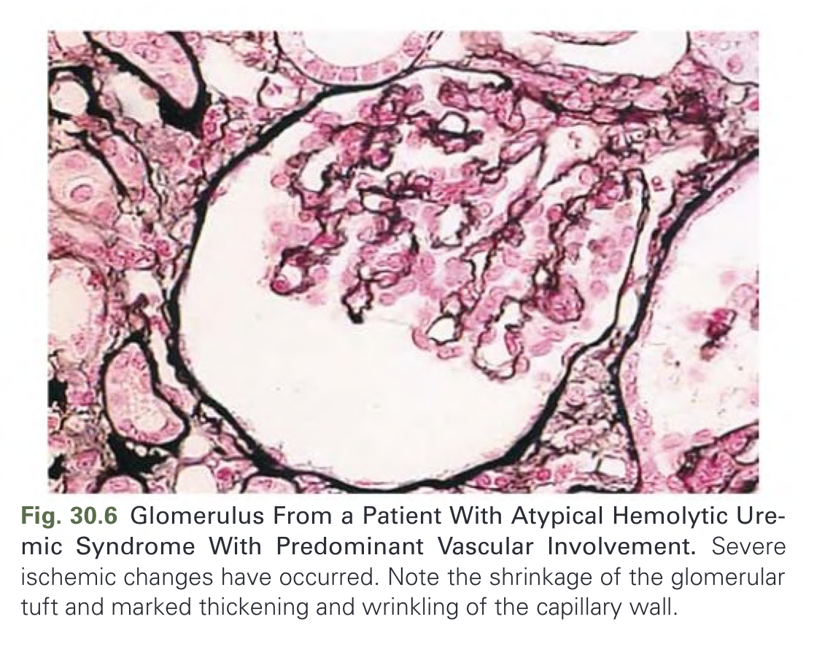

Fig. 30.6 Glomerulus From a Patient With Atypical Hemolytic Uremic Syndrome With Predominant Vascular Involvement. Severe ischemic changes have occurred. Note the shrinkage of the glomerular tuft and marked thickening and wrinkling of the capillary wall.

---

### Fig_30_7

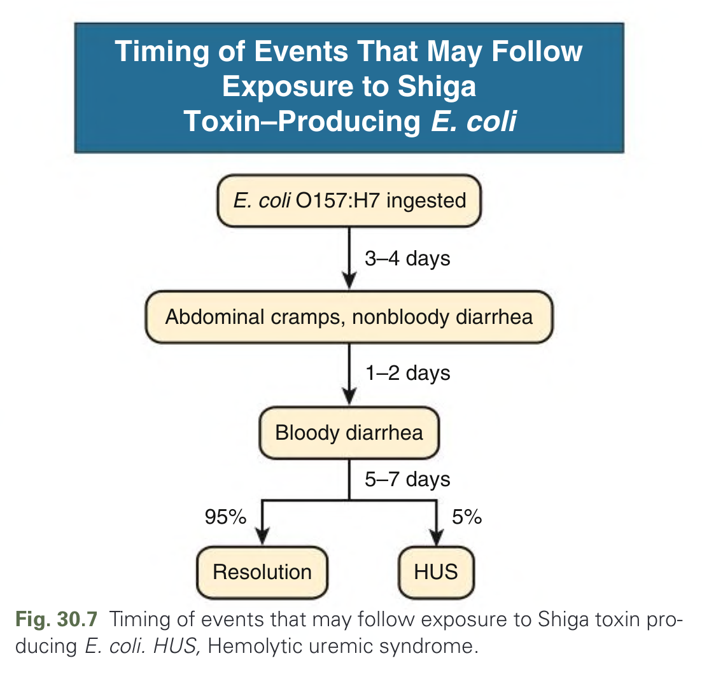

Fig. 30.7 Timing of events that may follow exposure to Shiga toxin producing E. coli. HUS, Hemolytic uremic syndrome.

---

### Fig_30_8

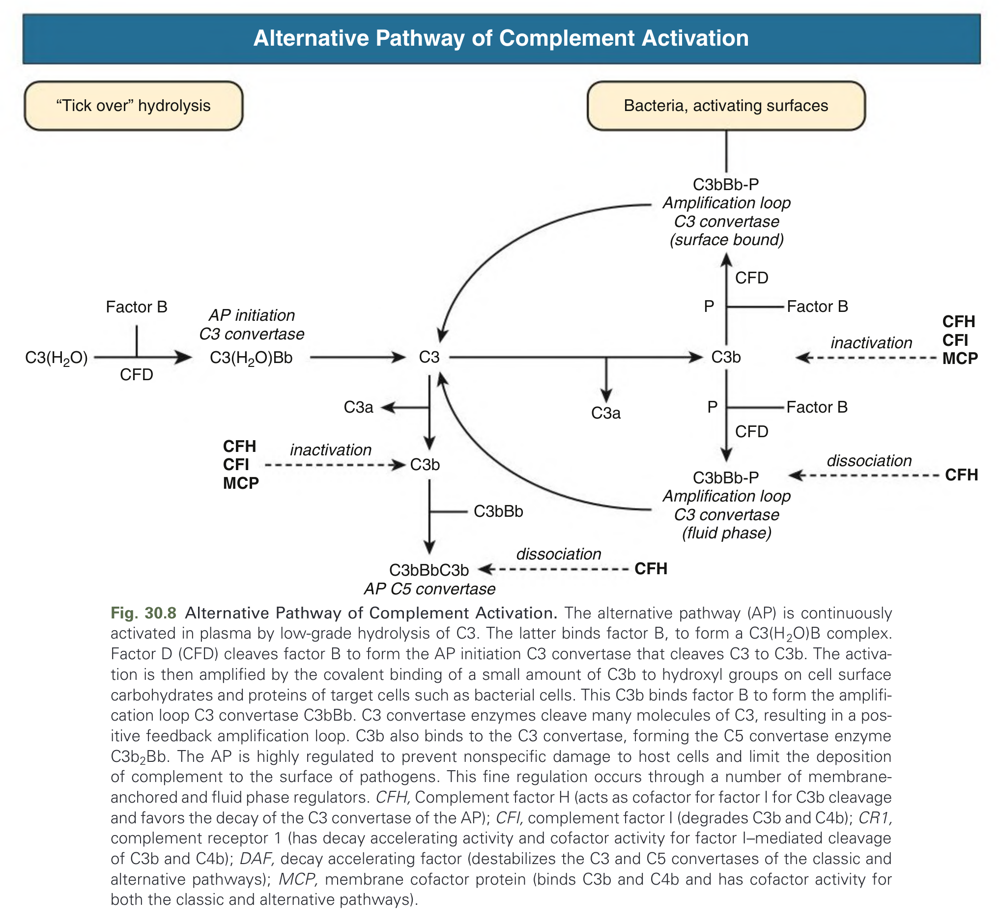

Fig. 30.8 Alternative Pathway of Complement Activation. The alternative pathway (AP) is continuously activated in plasma by low-grade hydrolysis of C3. The latter binds factor B, to form a C3(H2O)B complex. Factor D (CFD) cleaves factor B to form the AP initiation C3 convertase that cleaves C3 to C3b. The activation is then amplified by the covalent binding of a small amount of C3b to hydroxyl groups on cell surface carbohydrates and proteins of target cells such as bacterial cells. This C3b binds factor B to form the amplification loop C3 convertase C3bBb. C3 convertase enzymes cleave many molecules of C3, resulting in a positive feedback amplification loop. C3b also binds to the C3 convertase, forming the C5 convertase enzyme C3b2Bb. The AP is highly regulated to prevent nonspecific damage to host cells and limit the deposition of complement to the surface of pathogens. This fine regulation occurs through a number of membrane-anchored and fluid phase regulators. CFH, Complement factor H (acts as cofactor for factor I for C3b cleavage and favors the decay of the C3 convertase of the AP); CFI, complement factor I (degrades C3b and C4b); CR1, complement receptor 1 (has decay accelerating activity and cofactor activity for factor I–mediated cleavage of C3b and C4b); DAF, decay accelerating factor (destabilizes the C3 and C5 convertases of the classic and alternative pathways); MCP, membrane cofactor protein (binds C3b and C4b and has cofactor activity for both the classic and alternative pathways).

---

### Fig_30_9

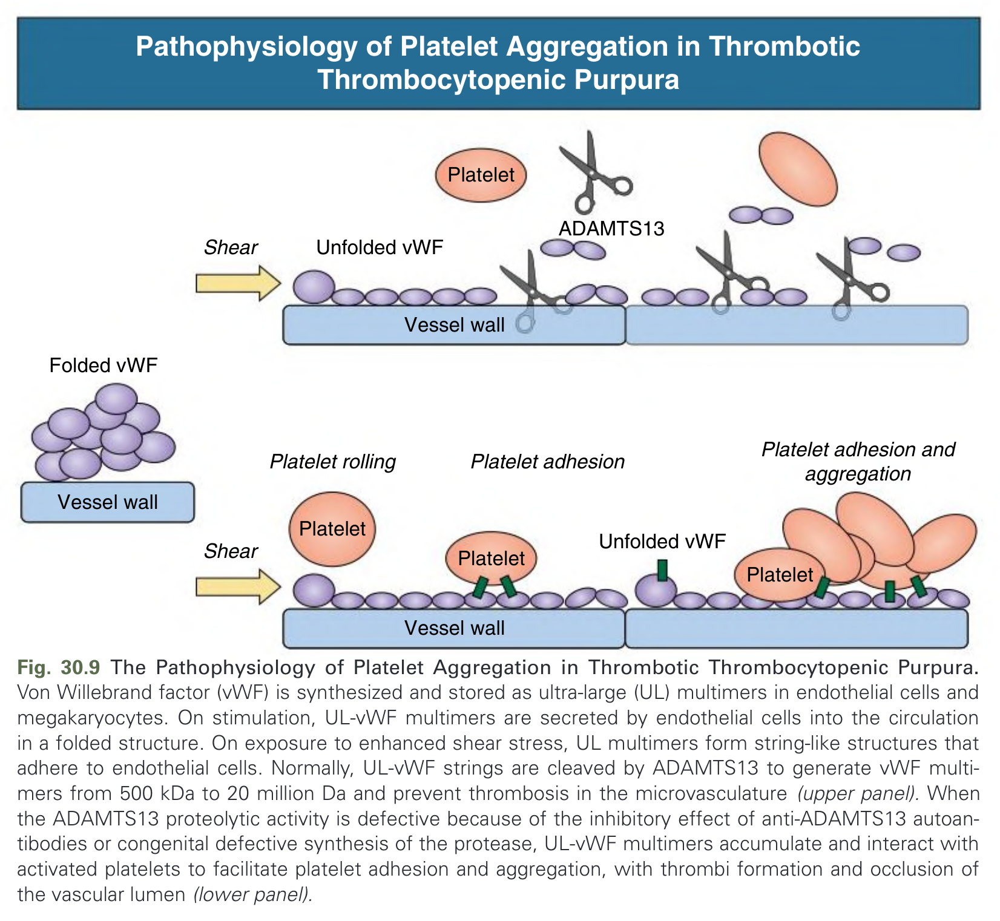

Fig. 30.9 The Pathophysiology of Platelet Aggregation in Thrombotic Thrombocytopenic Purpura. Von Willebrand factor (vWF) is synthesized and stored as ultra-large (UL) multimers in endothelial cells and megakaryocytes. On stimulation, UL-vWF multimers are secreted by endothelial cells into the circulation in a folded structure. On exposure to enhanced shear stress, UL multimers form string-like structures that adhere to endothelial cells. Normally, UL-vWF strings are cleaved by ADAMTS13 to generate vWF multimers from 500 kDa to 20 million Da and prevent thrombosis in the microvasculature (upper panel). When the ADAMTS13 proteolytic activity is defective because of the inhibitory effect of anti-ADAMTS13 autoantibodies or congenital defective synthesis of the protease, UL-vWF multimers accumulate and interact with activated platelets to facilitate platelet adhesion and aggregation, with thrombi formation and occlusion of the vascular lumen (lower panel).

---

## Tables

### Table_30_1

#### Table Image

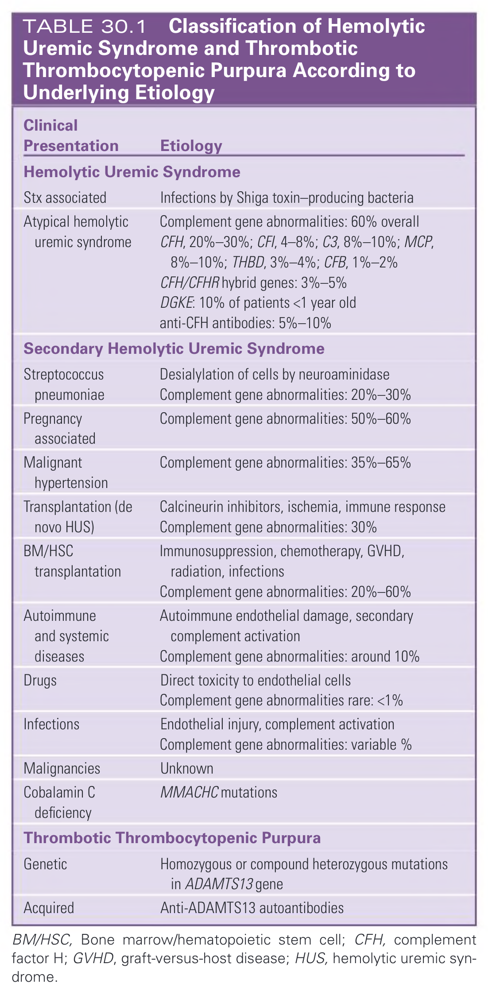

#### Table Data (CSV: [Table_30_1.csv](Table_30_1.csv))

```markdown
| Clinical Presentation | Etiology |
| :--- | :--- |
| **Hemolytic Uremic Syndrome** | |
| Stx associated | Infections by Shiga toxin-producing bacteria |
| Atypical hemolytic uremic syndrome | Complement gene abnormalities: 60% overall<br>CFH, 20%-30%; CFI, 4-8%; C3, 8%-10%; MCP, 8%-10%; THBD, 3%-4%; CFB, 1%-2%<br>CFH/CFHR hybrid genes: 3%-5%<br>DGKE: 10% of patients <1 year old<br>anti-CFH antibodies: 5%-10% |
| **Secondary Hemolytic Uremic Syndrome** | |
| Streptococcus pneumoniae | Desialylation of cells by neuroaminidase<br>Complement gene abnormalities: 20%-30% |
| Pregnancy associated | Complement gene abnormalities: 50%-60% |
| Malignant hypertension | Complement gene abnormalities: 35%-65% |
| Transplantation (de novo HUS) | Calcineurin inhibitors, ischemia, immune response<br>Complement gene abnormalities: 30% |
| BM/HSC transplantation | Immunosuppression, chemotherapy, GVHD, radiation, infections<br>Complement gene abnormalities: 20%-60% |
| Autoimmune and systemic diseases | Autoimmune endothelial damage, secondary complement activation<br>Complement gene abnormalities: around 10% |
| Drugs | Direct toxicity to endothelial cells<br>Complement gene abnormalities rare: <1% |
| Infections | Endothelial injury, complement activation<br>Complement gene abnormalities: variable % |
| Malignancies | Unknown |
| Cobalamin C deficiency | MMACHC mutations |
| **Thrombotic Thrombocytopenic Purpura** | |
| Genetic | Homozygous or compound heterozygous mutations in ADAMTS13 gene |
| Acquired | Anti-ADAMTS13 autoantibodies |

BM/HSC, Bone marrow/hematopoietic stem cell; CFH, complement factor H; GVHD, graft-versus-host disease; HUS, hemolytic uremic syndrome.
```

TABLE 30.1 Classification of Hemolytic Uremic Syndrome and Thrombotic Thrombocytopenic Purpura According to Underlying Etiology

---

### Table_30_2

#### Table Image

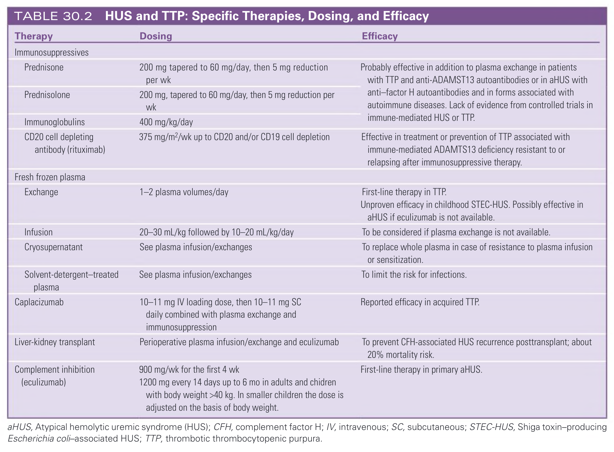

#### Table Data (CSV: [Table_30_2.csv](Table_30_2.csv))

```markdown
| Therapy | Dosing | Efficacy |
| :--- | :--- | :--- |
| **Immunosuppressives** | | |
| Prednisone | 200 mg tapered to 60 mg/day, then 5 mg reduction per wk | Probably effective in addition to plasma exchange in patients with TTP and anti-ADAMST13 autoantibodies or in aHUS with anti-factor H autoantibodies and in forms associated with autoimmune diseases. Lack of evidence from controlled trials in immune-mediated HUS or TTP. |
| Prednisolone | 200 mg, tapered to 60 mg/day, then 5 mg reduction per wk | |
| Immunoglobulins | 400 mg/kg/day | |
| CD20 cell depleting antibody (rituximab) | 375 mg/m²/wk up to CD20 and/or CD19 cell depletion | Effective in treatment or prevention of TTP associated with immune-mediated ADAMTS13 deficiency resistant to or relapsing after immunosuppressive therapy. |
| **Fresh frozen plasma** | | |
| Exchange | 1-2 plasma volumes/day | First-line therapy in TTP. Unproven efficacy in childhood STEC-HUS. Possibly effective in aHUS if eculizumab is not available. |
| Infusion | 20-30 mL/kg followed by 10-20 mL/kg/day | To be considered if plasma exchange is not available. |
| Cryosupernatant | See plasma infusion/exchanges | To replace whole plasma in case of resistance to plasma infusion or sensitization. |
| Solvent-detergent-treated plasma | See plasma infusion/exchanges | To limit the risk for infections. |
| Caplacizumab | 10-11 mg IV loading dose, then 10-11 mg SC daily combined with plasma exchange and immunosuppression | Reported efficacy in acquired TTP. |
| Liver-kidney transplant | Perioperative plasma infusion/exchange and eculizumab | To prevent CFH-associated HUS recurrence posttransplant; about 20% mortality risk. |
| Complement inhibition (eculizumab) | 900 mg/wk for the first 4 wk. 1200 mg every 14 days up to 6 mo in adults and children with body weight >40 kg. In smaller children the dose is adjusted on the basis of body weight. | First-line therapy in primary aHUS. |

aHUS, Atypical hemolytic uremic syndrome (HUS); CFH, complement factor H; IV, intravenous; SC, subcutaneous; STEC-HUS, Shiga toxin-producing Escherichia coli-associated HUS; TTP, thrombotic thrombocytopenic purpura.
```

TABLE 30.2 HUS and TTP: Specific Therapies, Dosing, and Efficacy

---

## Boxes

*No boxes resolved for this chapter.*
