# 031. Pathogenesis, Clinical Manifestations, and Natural History of Diabetic Kidney Disease - Figures and Tables Index

This document lists all figures, tables and boxes extracted from `031. Pathogenesis, Clinical Manifestations, and Natural History of Diabetic Kidney Disease.pdf`.

## Table of Contents
- [Figures](#figures)
- [Tables](#tables)
- [Boxes](#boxes)

---

## Figures

### Fig_31_1

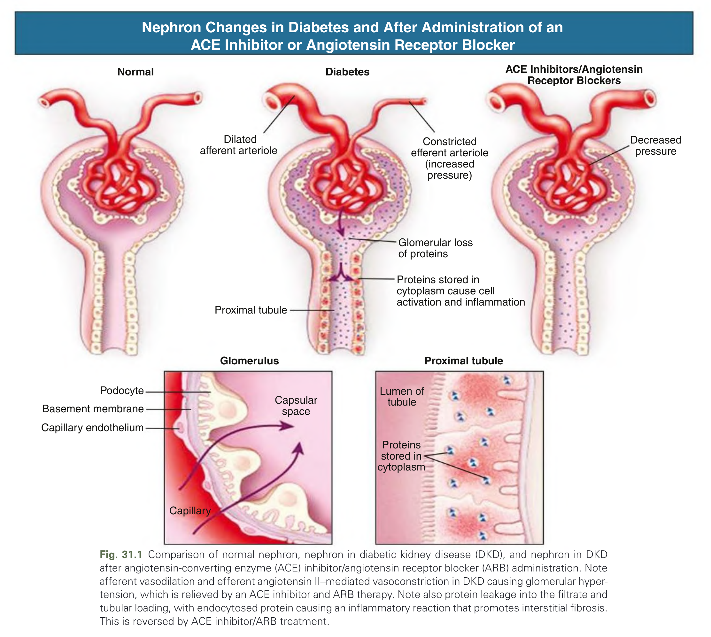

Fig. 31.1 Comparison of normal nephron, nephron in diabetic kidney disease (DKD), and nephron in DKD after angiotensin-converting enzyme (ACE) inhibitor/angiotensin receptor blocker (ARB) administration. Note afferent vasodilation and efferent angiotensin II–mediated vasoconstriction in DKD causing glomerular hypertension, which is relieved by an ACE inhibitor and ARB therapy. Note also protein leakage into the filtrate and tubular loading, with endocytosed protein causing an inflammatory reaction that promotes interstitial fibrosis. This is reversed by ACE inhibitor/ARB treatment.

---

### Fig_31_2

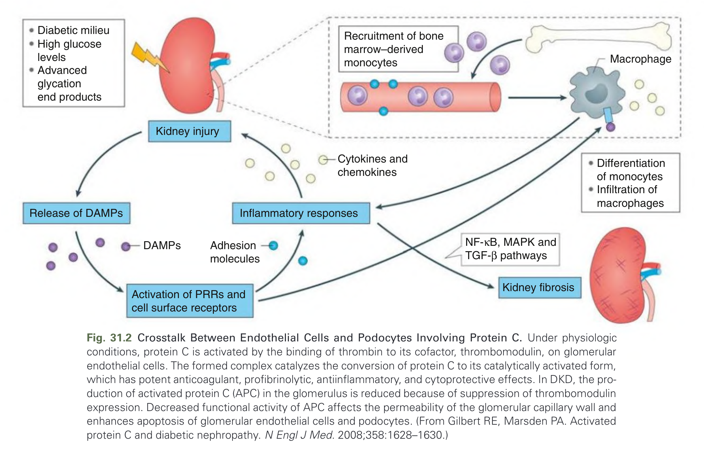

Fig. 31.2 Crosstalk Between Endothelial Cells and Podocytes Involving Protein C. Under physiologic conditions, protein C is activated by the binding of thrombin to its cofactor, thrombomodulin, on glomerular endothelial cells. The formed complex catalyzes the conversion of protein C to its catalytically activated form, which has potent anticoagulant, profibrinolytic, antiinflammatory, and cytoprotective effects. In DKD, the production of activated protein C (APC) in the glomerulus is reduced because of suppression of thrombomodulin expression. Decreased functional activity of APC affects the permeability of the glomerular capillary wall and enhances apoptosis of glomerular endothelial cells and podocytes. (From Gilbert RE, Marsden PA. Activated protein C and diabetic nephropathy. N Engl J Med. 2008;358:1628–1630.)

---

### Fig_31_3

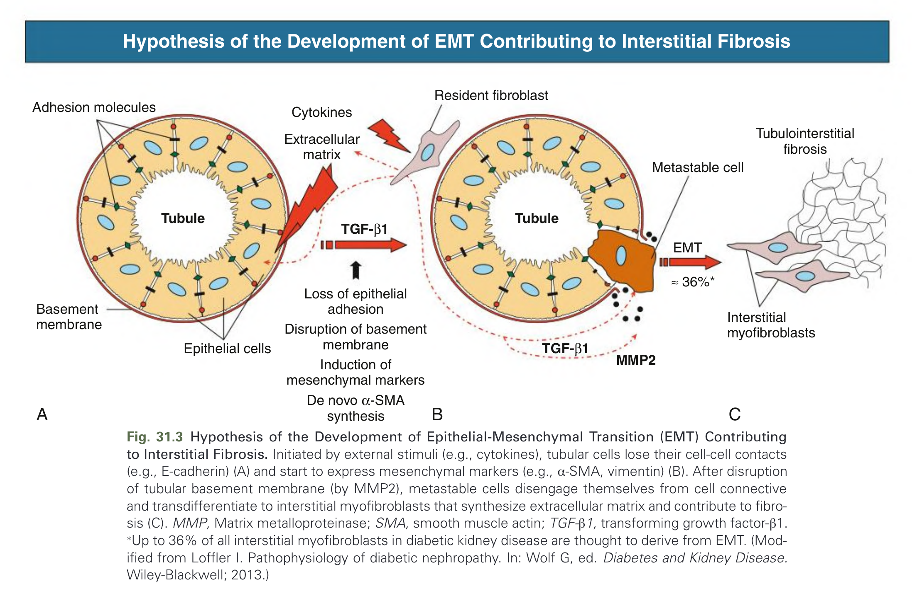

Fig. 31.3 Hypothesis of the Development of Epithelial-Mesenchymal Transition (EMT) Contributing to Interstitial Fibrosis. Initiated by external stimuli (e.g., cytokines), tubular cells lose their cell-cell contacts (e.g., E-cadherin) (A) and start to express mesenchymal markers (e.g., α-SMA, vimentin) (B). After disruption of tubular basement membrane (by MMP2), metastable cells disengage themselves from cell connective and transdifferentiate to interstitial myofibroblasts that synthesize extracellular matrix and contribute to fibrosis (C). MMP, Matrix metalloproteinase; SMA, smooth muscle actin; TGF-β1, transforming growth factor-β1. ∗Up to 36% of all interstitial myofibroblasts in diabetic kidney disease are thought to derive from EMT. (Modified from Loffler I. Pathophysiology of diabetic nephropathy. In: Wolf G, ed. Diabetes and Kidney Disease. Wiley-Blackwell; 2013.)

---

### Fig_31_4

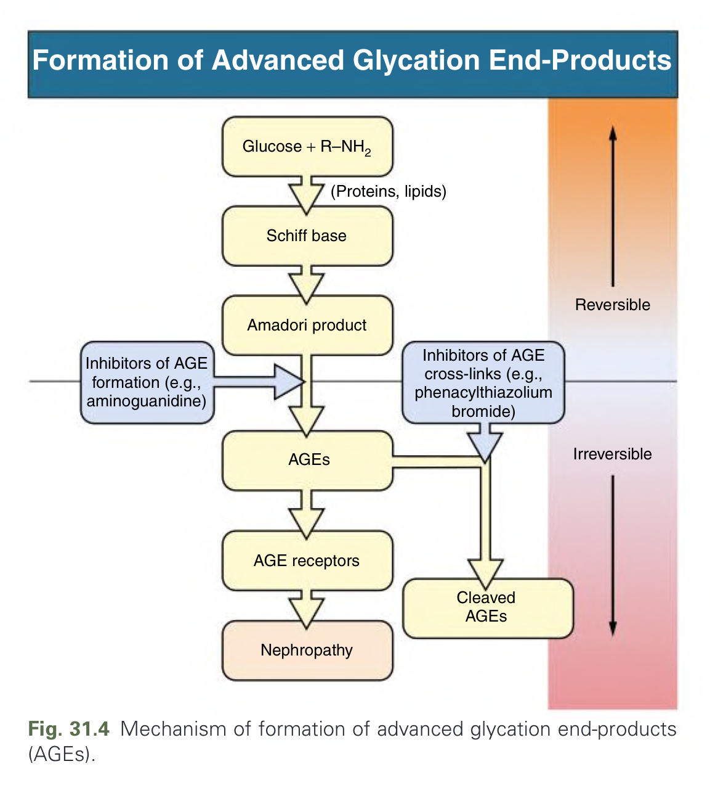

Fig. 31.4 Mechanism of formation of advanced glycation end-products (AGEs).

---

### Fig_31_5

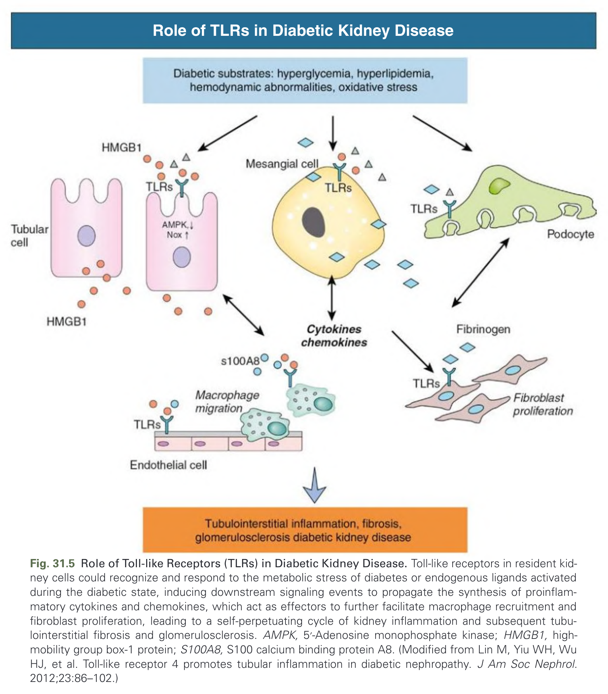

Fig. 31.5 Role of Toll-like Receptors (TLRs) in Diabetic Kidney Disease. Toll-like receptors in resident kidney cells could recognize and respond to the metabolic stress of diabetes or endogenous ligands activated during the diabetic state, inducing downstream signaling events to propagate the synthesis of proinflammatory cytokines and chemokines, which act as effectors to further facilitate macrophage recruitment and fibroblast proliferation, leading to a self-perpetuating cycle of kidney inflammation and subsequent tubulointerstitial fibrosis and glomerulosclerosis. AMPK, 5′-Adenosine monophosphate kinase; HMGB1, high-mobility group box-1 protein; S100A8, S100 calcium binding protein A8. (Modified from Lin M, Yiu WH, Wu HJ, et al. Toll-like receptor 4 promotes tubular inflammation in diabetic nephropathy. J Am Soc Nephrol. 2012;23:86–102.)

---

### Fig_31_6

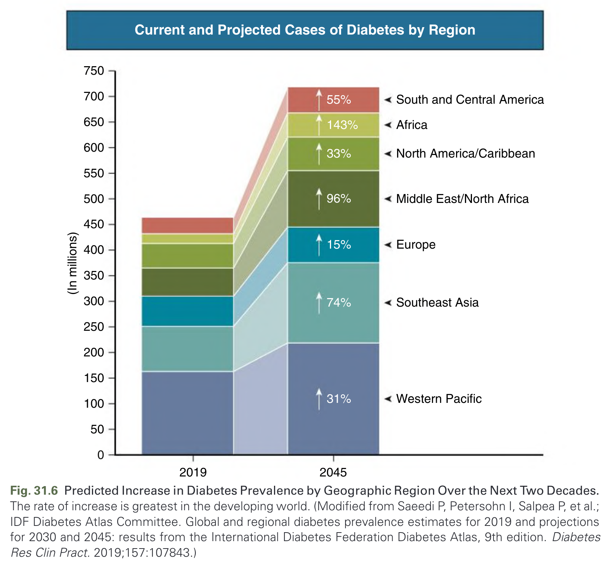

Fig. 31.6 Predicted Increase in Diabetes Prevalence by Geographic Region Over the Next Two Decades. The rate of increase is greatest in the developing world. (Modified from Saeedi P, Petersohn I, Salpea P, et al.; IDF Diabetes Atlas Committee. Global and regional diabetes prevalence estimates for 2019 and projections for 2030 and 2045: results from the International Diabetes Federation Diabetes Atlas, 9th edition. Diabetes Res Clin Pract. 2019;157:107843.)

---

### Fig_31_7

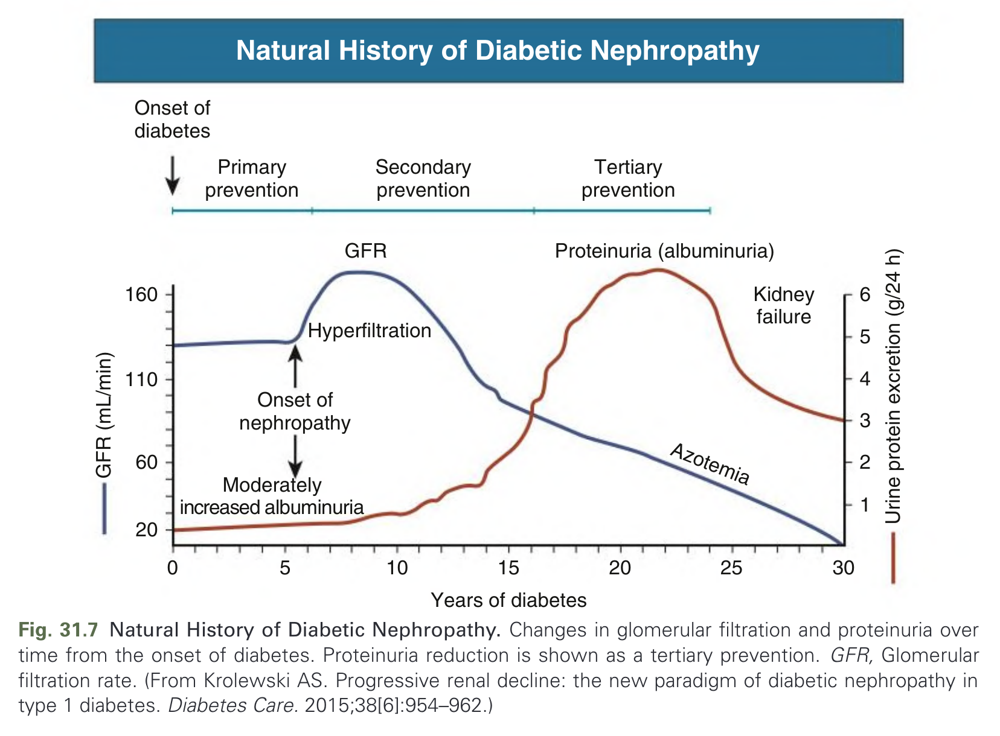

Fig. 31.7 Natural History of Diabetic Nephropathy. Changes in glomerular filtration and proteinuria over time from the onset of diabetes. Proteinuria reduction is shown as a tertiary prevention. GFR, Glomerular filtration rate. (From Krolewski AS. Progressive renal decline: the new paradigm of diabetic nephropathy in type 1 diabetes. Diabetes Care. 2015;38[6]:954–962.)

---

### Fig_31_8

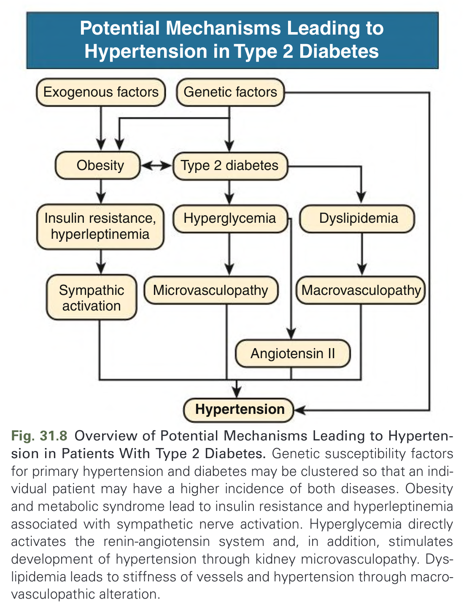

Fig. 31.8 Overview of Potential Mechanisms Leading to Hypertension in Patients With Type 2 Diabetes. Genetic susceptibility factors for primary hypertension and diabetes may be clustered so that an individual patient may have a higher incidence of both diseases. Obesity and metabolic syndrome lead to insulin resistance and hyperleptinemia associated with sympathetic nerve activation. Hyperglycemia directly activates the renin-angiotensin system and, in addition, stimulates development of hypertension through kidney microvasculopathy. Dyslipidemia leads to stiffness of vessels and hypertension through macrovasculopathic alteration.

---

### Fig_31_9

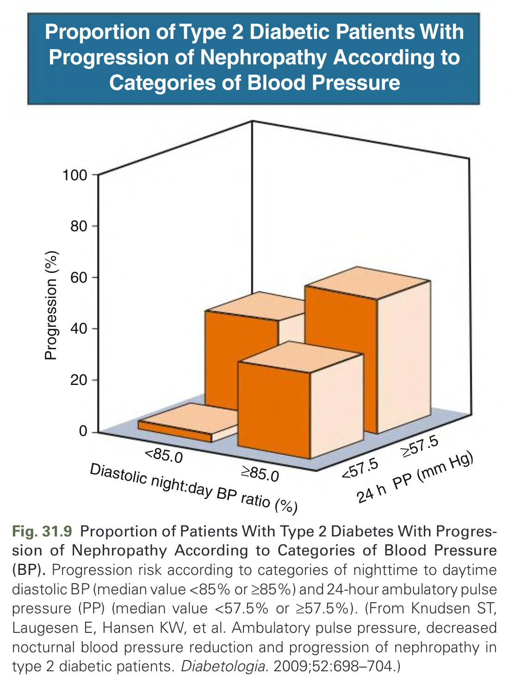

Fig. 31.9 Proportion of Patients With Type 2 Diabetes With Progression of Nephropathy According to Categories of Blood Pressure (BP). Progression risk according to categories of nighttime to daytime diastolic BP (median value <85% or ≥85%) and 24-hour ambulatory pulse pressure (PP) (median value <57.5% or ≥57.5%). (From Knudsen ST, Laugesen E, Hansen KW, et al. Ambulatory pulse pressure, decreased nocturnal blood pressure reduction and progression of nephropathy in type 2 diabetic patients. Diabetologia. 2009;52:698–704.)

---

### Fig_31_10


Fig. 31.10 Influence of Microalbuminuria and Macroalbuminuria on Mortality. The influence of microalbuminuria and macroalbuminuria on mortality was evaluated prospectively in 328 White patients with non–insulin-dependent diabetes mellitus observed for 5 years. Microalbuminuria and macroalbuminuria led to a significant increase in total mortality compared with that in patients who remained normoalbuminuric. (From Gall MA, Borch-Johnsen K, Hougaard P, et al. Albuminuria and poor glycemic control predict mortality in NIDDM. Diabetes. 1995;44:1303–1309.)

---

### Fig_31_11

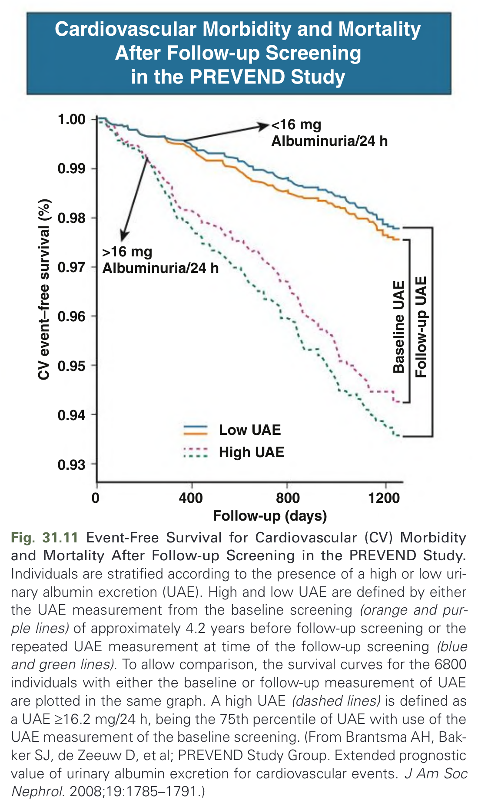

Fig. 31.11 Event-Free Survival for Cardiovascular (CV) Morbidity and Mortality After Follow-up Screening in the PREVEND Study. Individuals are stratified according to the presence of a high or low urinary albumin excretion (UAE). High and low UAE are defined by either the UAE measurement from the baseline screening (orange and purple lines) of approximately 4.2 years before follow-up screening or the repeated UAE measurement at time of the follow-up screening (blue and green lines). To allow comparison, the survival curves for the 6800 individuals with either the baseline or follow-up measurement of UAE are plotted in the same graph. A high UAE (dashed lines) is defined as a UAE ≥16.2 mg/24 h, being the 75th percentile of UAE with use of the UAE measurement of the baseline screening. (From Brantsma AH, Bakker SJ, de Zeeuw D, et al; PREVEND Study Group. Extended prognostic value of urinary albumin excretion for cardiovascular events. J Am Soc Nephrol. 2008;19:1785–1791.)

---

### Fig_31_12

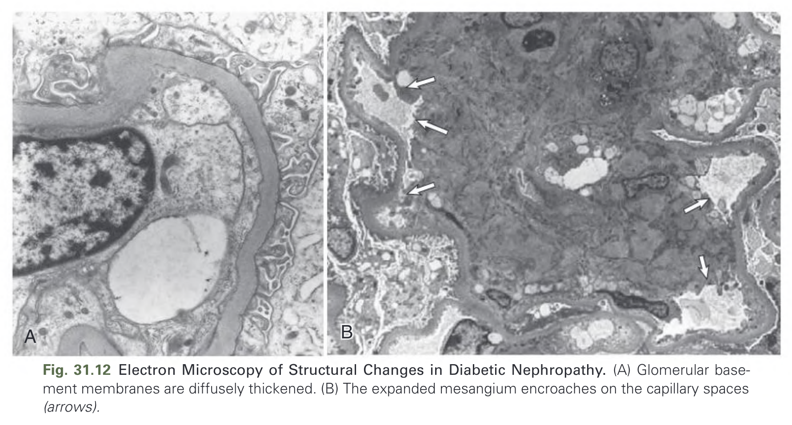

Fig. 31.12 Electron Microscopy of Structural Changes in Diabetic Nephropathy. (A) Glomerular basement membranes are diffusely thickened. (B) The expanded mesangium encroaches on the capillary spaces (arrows).

---

### Fig_31_13

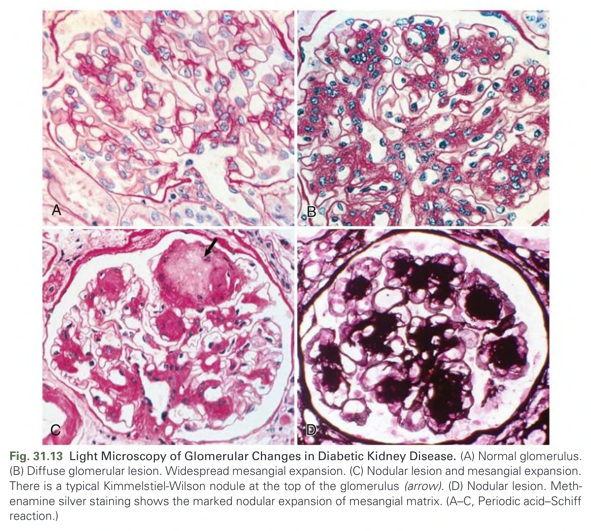

Fig. 31.13 Light Microscopy of Glomerular Changes in Diabetic Kidney Disease. (A) Normal glomerulus. (B) Diffuse glomerular lesion. Widespread mesangial expansion. (C) Nodular lesion and mesangial expansion. There is a typical Kimmelstiel-Wilson nodule at the top of the glomerulus (arrow). (D) Nodular lesion. Methenamine silver staining shows the marked nodular expansion of mesangial matrix. (A–C, Periodic acid–Schiff reaction.)

---

### Fig_31_14

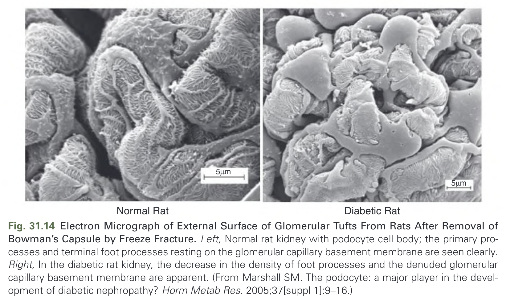

Fig. 31.14 Electron Micrograph of External Surface of Glomerular Tufts From Rats After Removal of Bowman’s Capsule by Freeze Fracture. Left, Normal rat kidney with podocyte cell body; the primary processes and terminal foot processes resting on the glomerular capillary basement membrane are seen clearly. Right, In the diabetic rat kidney, the decrease in the density of foot processes and the denuded glomerular capillary basement membrane are apparent. (From Marshall SM. The podocyte: a major player in the development of diabetic nephropathy? Horm Metab Res. 2005;37[suppl 1]:9–16.)

---

### Fig_31_15

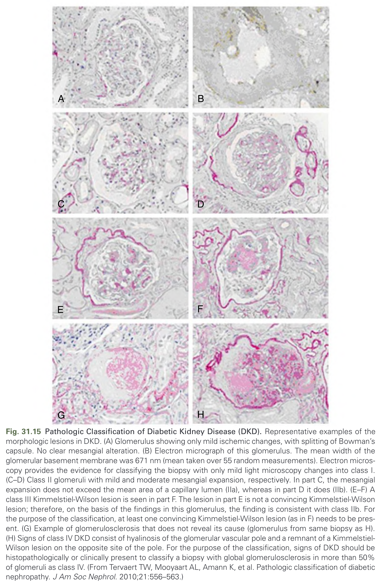

Fig. 31.15 Pathologic Classification of Diabetic Kidney Disease (DKD). Representative examples of the morphologic lesions in DKD. (A) Glomerulus showing only mild ischemic changes, with splitting of Bowman’s capsule. No clear mesangial alteration. (B) Electron micrograph of this glomerulus. The mean width of the glomerular basement membrane was 671 nm (mean taken over 55 random measurements). Electron microscopy provides the evidence for classifying the biopsy with only mild light microscopy changes into class I. (C–D) Class II glomeruli with mild and moderate mesangial expansion, respectively. In part C, the mesangial expansion does not exceed the mean area of a capillary lumen (IIa), whereas in part D it does (IIb). (E–F) A class III Kimmelstiel-Wilson lesion is seen in part F. The lesion in part E is not a convincing Kimmelstiel-Wilson lesion; therefore, on the basis of the findings in this glomerulus, the finding is consistent with class IIb. For the purpose of the classification, at least one convincing Kimmelstiel-Wilson lesion (as in F) needs to be present. (G) Example of glomerulosclerosis that does not reveal its cause (glomerulus from same biopsy as H). (H) Signs of class IV DKD consist of hyalinosis of the glomerular vascular pole and a remnant of a Kimmelstiel-Wilson lesion on the opposite site of the pole. For the purpose of the classification, signs of DKD should be histopathologically or clinically present to classify a biopsy with global glomerulosclerosis in more than 50% of glomeruli as class IV. (From Tervaert TW, Mooyaart AL, Amann K, et al. Pathologic classification of diabetic nephropathy. J Am Soc Nephrol. 2010;21:556–563.)

---

### Fig_31_16

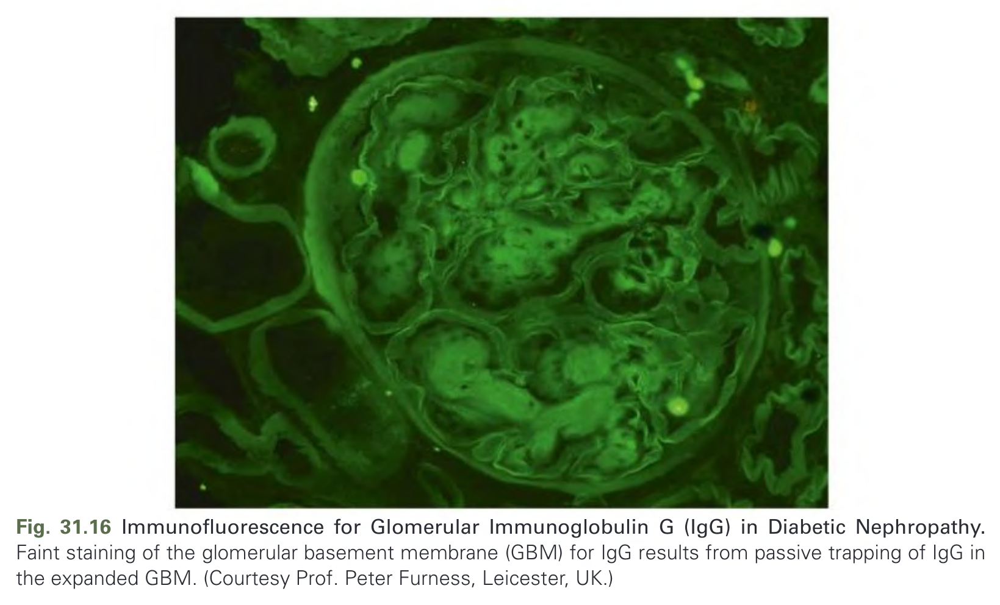

Fig. 31.16 Immunofluorescence for Glomerular Immunoglobulin G (IgG) in Diabetic Nephropathy. Faint staining of the glomerular basement membrane (GBM) for IgG results from passive trapping of IgG in the expanded GBM. (Courtesy Prof. Peter Furness, Leicester, UK.)

---

### Fig_31_17

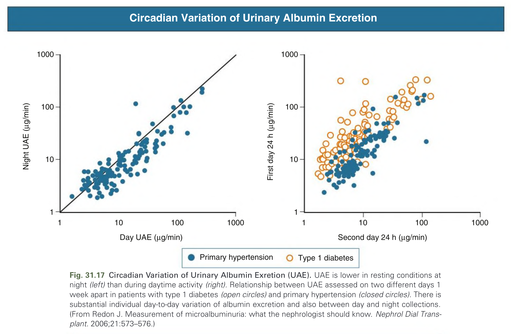

Fig. 31.17 Circadian Variation of Urinary Albumin Exretion (UAE). UAE is lower in resting conditions at night (left) than during daytime activity (right). Relationship between UAE assessed on two different days 1 week apart in patients with type 1 diabetes (open circles) and primary hypertension (closed circles). There is substantial individual day-to-day variation of albumin excretion and also between day and night collections. (From Redon J. Measurement of microalbuminuria: what the nephrologist should know. Nephrol Dial Transplant. 2006;21:573–576.)

---

### Fig_31_18

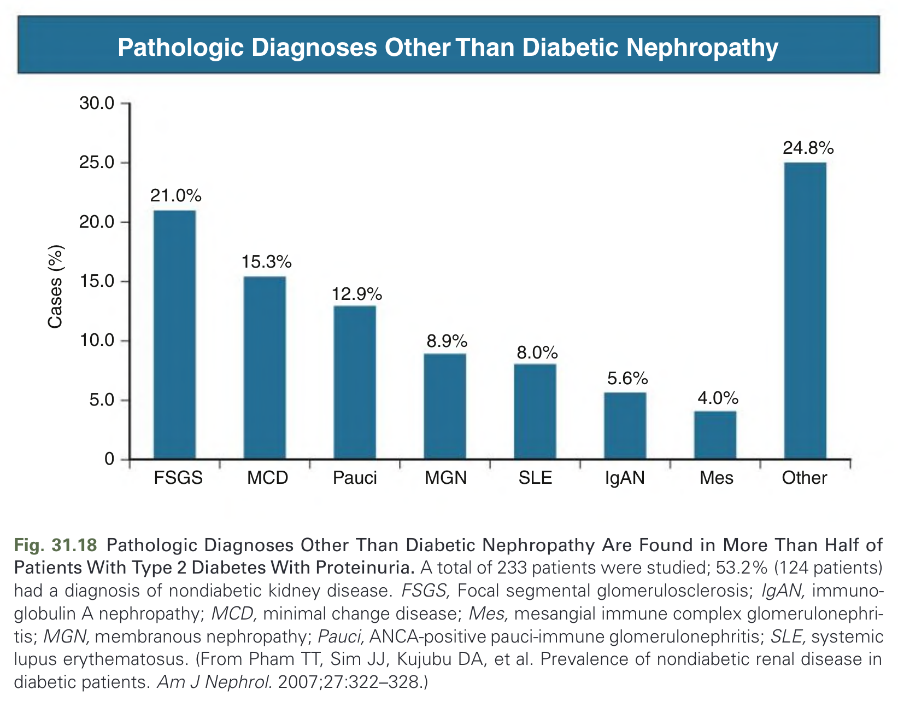

Fig. 31.18 Pathologic Diagnoses Other Than Diabetic Nephropathy Are Found in More Than Half of Patients With Type 2 Diabetes With Proteinuria. A total of 233 patients were studied; 53.2% (124 patients) had a diagnosis of nondiabetic kidney disease. FSGS, Focal segmental glomerulosclerosis; IgAN, immunoglobulin A nephropathy; MCD, minimal change disease; Mes, mesangial immune complex glomerulonephritis; MGN, membranous nephropathy; Pauci, ANCA-positive pauci-immune glomerulonephritis; SLE, systemic lupus erythematosus. (From Pham TT, Sim JJ, Kujubu DA, et al. Prevalence of nondiabetic renal disease in diabetic patients. Am J Nephrol. 2007;27:322–328.)

---

### Fig_31_19

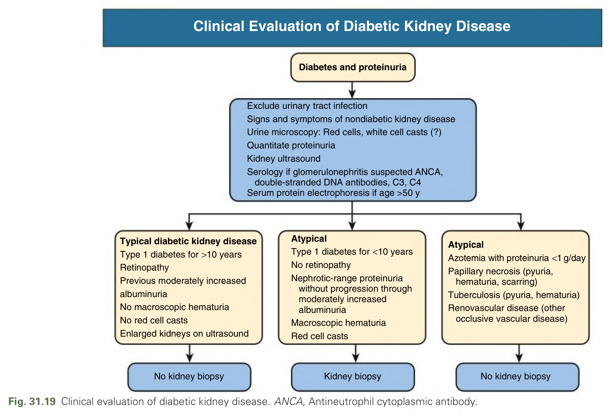

Fig. 31.19 Clinical evaluation of diabetic kidney disease. ANCA, Antineutrophil cytoplasmic antibody.

---

### Fig_31_20

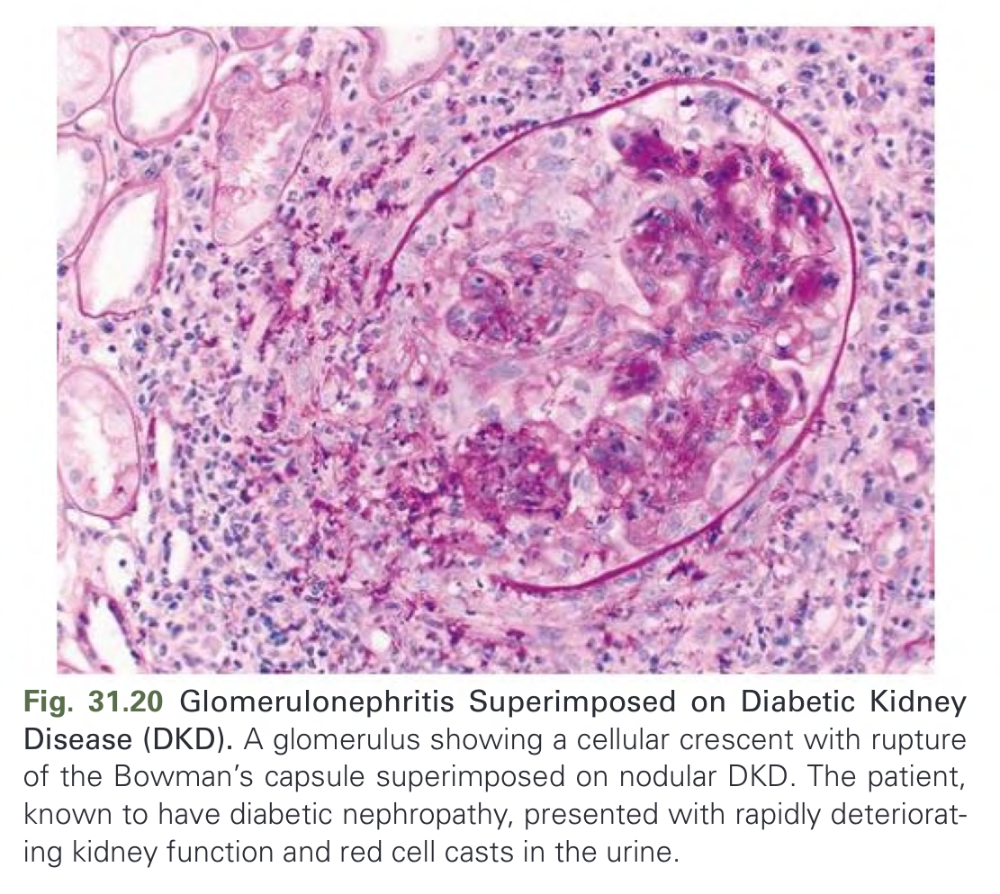

Fig. 31.20 Glomerulonephritis Superimposed on Diabetic Kidney Disease (DKD). A glomerulus showing a cellular crescent with rupture of the Bowman’s capsule superimposed on nodular DKD. The patient, known to have diabetic nephropathy, presented with rapidly deteriorating kidney function and red cell casts in the urine.

---

## Tables

### Table_31_1

#### Table Image

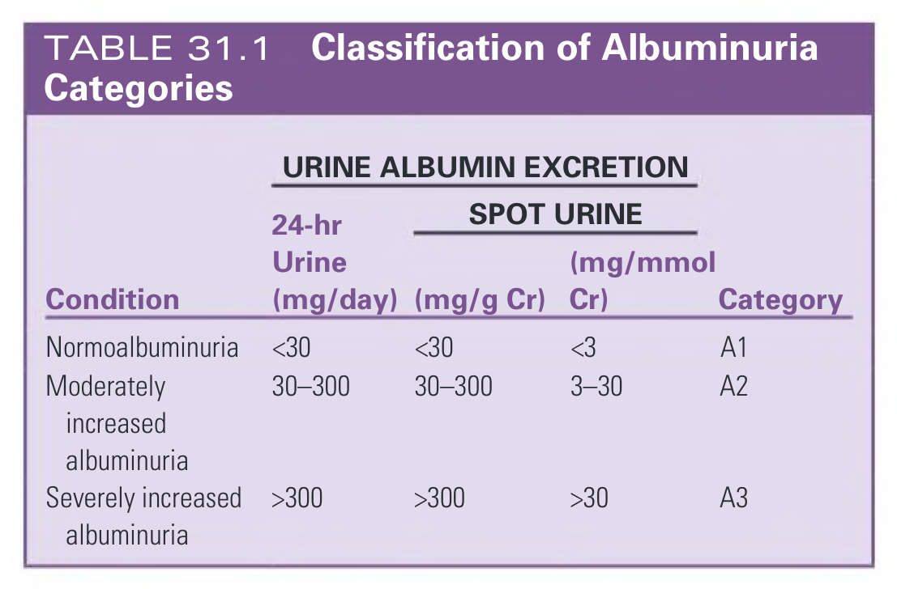

#### Table Data (CSV: [Table_31_1.csv](Table_31_1.csv))

```markdown
| Condition | 24-hr Urine (mg/day) | SPOT URINE (mg/g Cr) | SPOT URINE (mg/mmol Cr) | Category |
| :--- | :--- | :--- | :--- | :--- |
| Normoalbuminuria | <30 | <30 | <3 | A1 |
| Moderately increased albuminuria | 30-300 | 30-300 | 3-30 | A2 |
| Severely increased albuminuria | >300 | >300 | >30 | A3 |
```

TABLE 31.1 Classification of Albuminuria Categories

---

## Boxes

*No boxes resolved for this chapter.*
