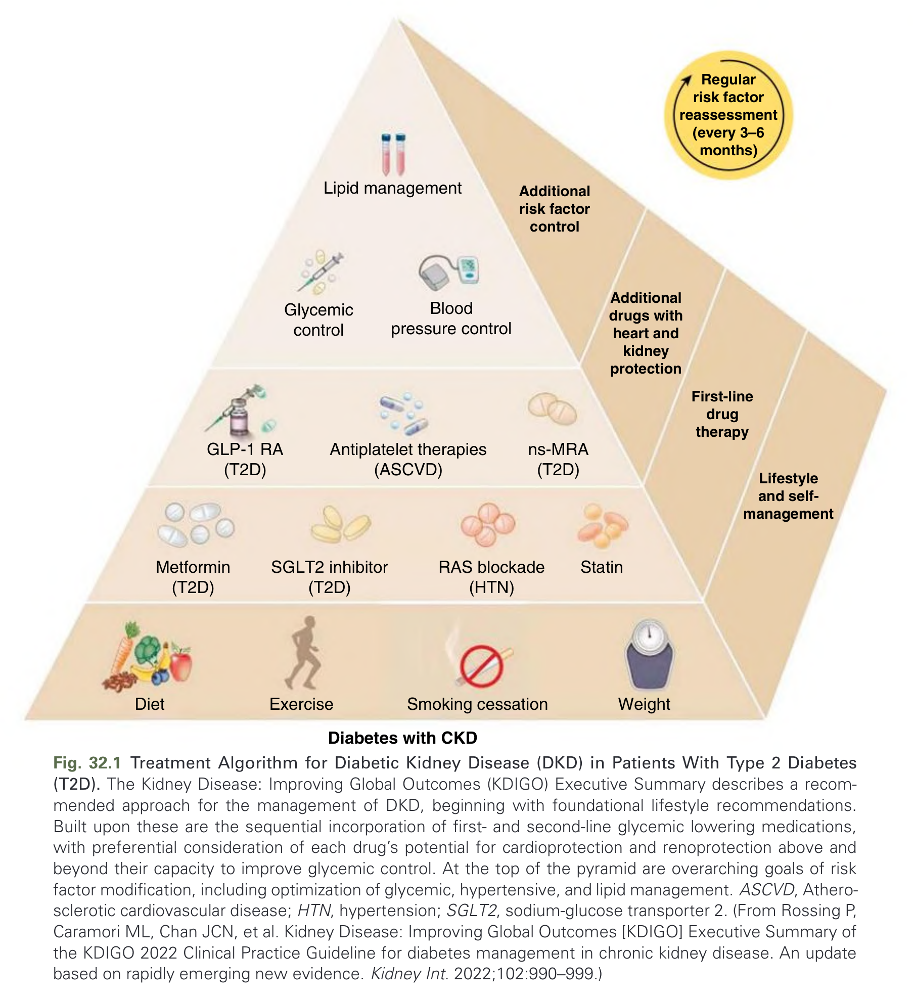
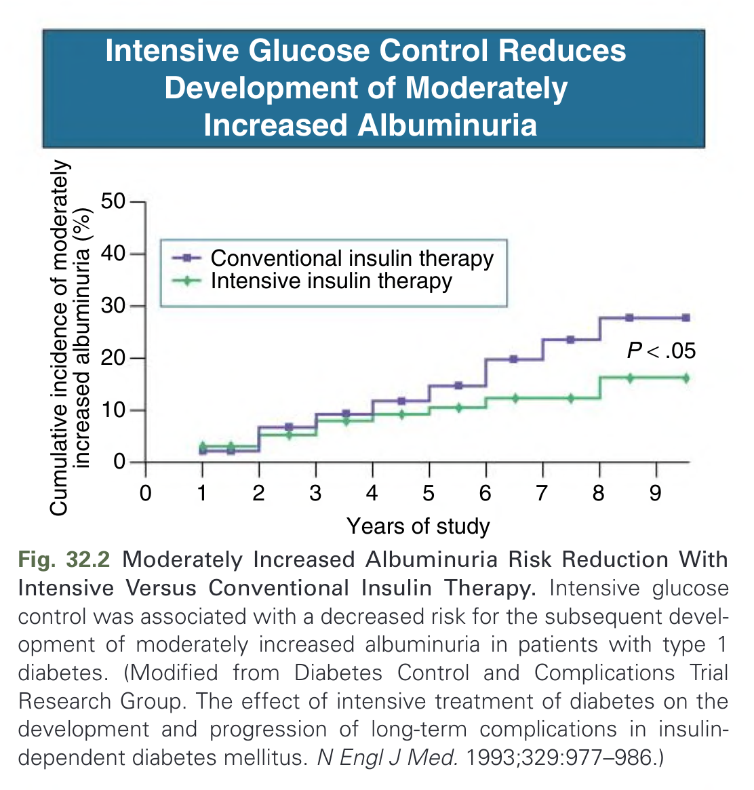
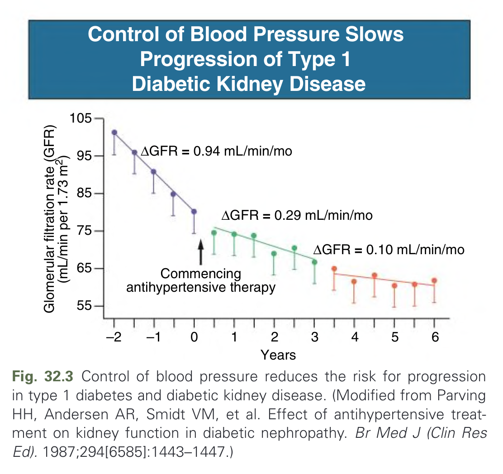
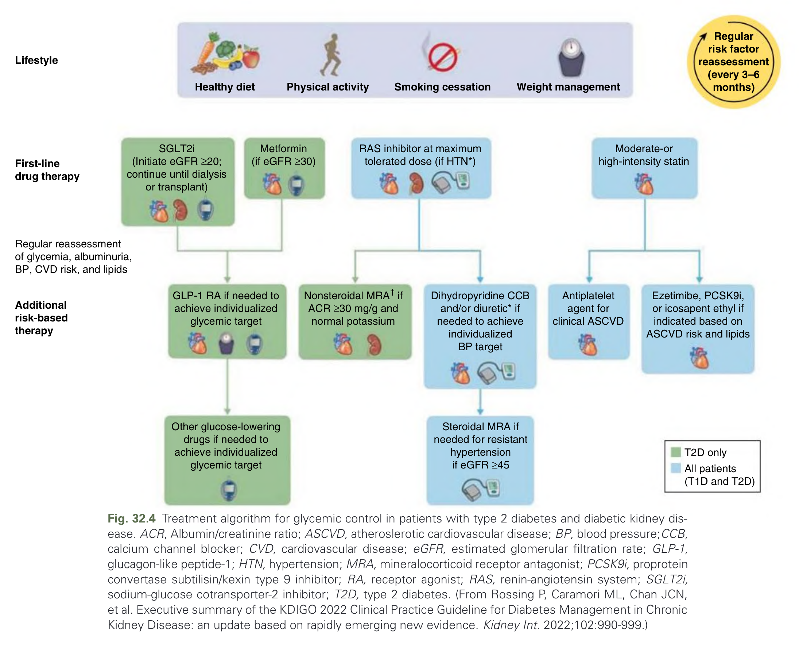
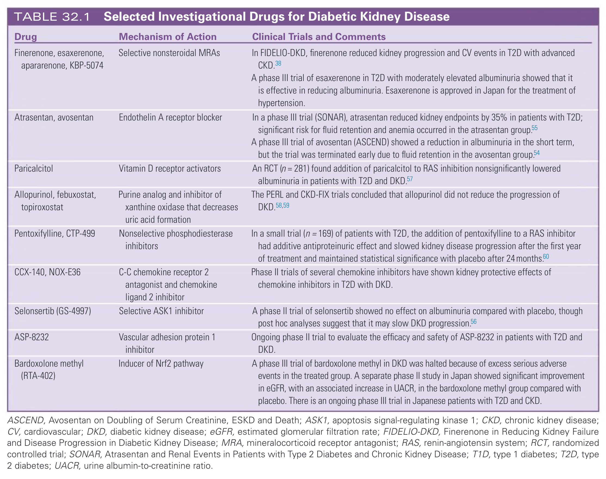

# 032. Prevention and Treatment of Diabetic Kidney Disease - Figures and Tables Index

This document lists all figures, tables and boxes extracted from `032. Prevention and Treatment of Diabetic Kidney Disease.pdf`.

## Table of Contents
- [Figures](#figures)
- [Tables](#tables)
- [Boxes](#boxes)

---

## Figures

### Fig_32_1



Fig. 32.1 Treatment Algorithm for Diabetic Kidney Disease (DKD) in Patients With Type 2 Diabetes (T2D). The Kidney Disease: Improving Global Outcomes (KDIGO) Executive Summary describes a recommended approach for the management of DKD, beginning with foundational lifestyle recommendations. Built upon these are the sequential incorporation of first- and second-line glycemic lowering medications, with preferential consideration of each drug’s potential for cardioprotection and renoprotection above and beyond their capacity to improve glycemic control. At the top of the pyramid are overarching goals of risk factor modification, including optimization of glycemic, hypertensive, and lipid management. ASCVD, Atherosclerotic cardiovascular disease; HTN, hypertension; SGLT2, sodium-glucose transporter 2. (From Rossing P, Caramori ML, Chan JCN, et al. Kidney Disease: Improving Global Outcomes [KDIGO] Executive Summary of the KDIGO 2022 Clinical Practice Guideline for diabetes management in chronic kidney disease. An update based on rapidly emerging new evidence. Kidney Int. 2022;102:990–999.)

---

### Fig_32_2



Fig. 32.2 Moderately Increased Albuminuria Risk Reduction With Intensive Versus Conventional Insulin Therapy. Intensive glucose control was associated with a decreased risk for the subsequent development of moderately increased albuminuria in patients with type 1 diabetes. (Modified from Diabetes Control and Complications Trial Research Group. The effect of intensive treatment of diabetes on the development and progression of long-term complications in insulin-dependent diabetes mellitus. N Engl J Med. 1993;329:977–986.)

---

### Fig_32_3



Fig. 32.3 Control of blood pressure reduces the risk for progression in type 1 diabetes and diabetic kidney disease. (Modified from Parving HH, Andersen AR, Smidt VM, et al. Effect of antihypertensive treatment on kidney function in diabetic nephropathy. Br Med J (Clin Res Ed). 1987;294[6585]:1443–1447.)

---

### Fig_32_4



Fig. 32.4 Treatment algorithm for glycemic control in patients with type 2 diabetes and diabetic kidney disease. ACR, Albumin/creatinine ratio; ASCVD, atheroslerotic cardiovascular disease; BP, blood pressure; CCB, calcium channel blocker; CVD, cardiovascular disease; eGFR, estimated glomerular filtration rate; GLP-1, glucagon-like peptide-1; HTN, hypertension; MRA, mineralocorticoid receptor antagonist; PCSK9i, proprotein convertase subtilisin/kexin type 9 inhibitor; RA, receptor agonist; RAS, renin-angiotensin system; SGLT2i, sodium-glucose cotransporter-2 inhibitor; T2D, type 2 diabetes. (From Rossing P, Caramori ML, Chan JCN, et al. Executive summary of the KDIGO 2022 Clinical Practice Guideline for Diabetes Management in Chronic Kidney Disease: an update based on rapidly emerging new evidence. Kidney Int. 2022;102:990–999.)

---

## Tables

### Table_32_1

#### Table Image



#### Table Data (CSV: [Table_32_1.csv](Table_32_1.csv))

```markdown
| Drug | Mechanism of Action | Clinical Trials and Comments |
| :--- | :--- | :--- |
| Finerenone, esaxerenone, apararenone, KBP-5074 | Selective nonsteroidal MRAS | In FIDELIO-DKD, finerenone reduced kidney progression and CV events in T2D with advanced CKD. A phase III trial of esaxerenone in T2D with moderately elevated albuminuria showed that it is effective in reducing albuminuria. Esaxerenone is approved in Japan for the treatment of hypertension. |
| Atrasentan, avosentan | Endothelin A receptor blocker | In a phase III trial (SONAR), atrasentan reduced kidney endpoints by 35% in patients with T2D; significant risk for fluid retention and anemia occurred in the atrasentan group. A phase III trial of avosentan (ASCEND) showed a reduction in albuminuria in the short term, but the trial was terminated early due to fluid retention in the avosentan group. |
| Paricalcitol | Vitamin D receptor activators | An RCT (n = 281) found addition of paricalcitol to RAS inhibition nonsignificantly lowered albuminuria in patients with T2D and DKD. |
| Allopurinol, febuxostat, topiroxostat | Purine analog and inhibitor of xanthine oxidase that decreases uric acid formation | The PERL and CKD-FIX trials concluded that allopurinol did not reduce the progression of DKD. |
| Pentoxifylline, CTP-499 | Nonselective phosphodiesterase inhibitors | In a small trial (n = 169) of patients with T2D, the addition of pentoxifylline to a RAS inhibitor had additive antiproteinuric effect and slowed kidney disease progression after the first year of treatment and maintained statistical significance with placebo after 24 months. |
| CCX-140, NOX-E36 | C-C chemokine receptor 2 antagonist and chemokine ligand 2 inhibitor | Phase II trials of several chemokine inhibitors have shown kidney protective effects of chemokine inhibitors in T2D with DKD. |
| Selonsertib (GS-4997) | Selective ASK1 inhibitor | A phase II trial of selonsertib showed no effect on albuminuria compared with placebo, though post hoc analyses suggest that it may slow DKD progression. |
| ASP-8232 | Vascular adhesion protein 1 inhibitor | Ongoing phase II trial to evaluate the efficacy and safety of ASP-8232 in patients with T2D and DKD. |
| Bardoxolone methyl (RTA-402) | Inducer of Nrf2 pathway | A phase III trial of bardoxolone methyl in DKD was halted because of excess serious adverse events in the treated group. A separate phase II study in Japan showed significant improvement in eGFR, with an associated increase in UACR, in the bardoxolone methyl group compared with placebo. There is an ongoing phase III trial in Japanese patients with T2D and CKD. |

ASCEND, Avosentan on Doubling of Serum Creatinine, ESKD and Death; ASK1, apoptosis signal-regulating kinase 1; CKD, chronic kidney disease; CV, cardiovascular; DKD, diabetic kidney disease; eGFR, estimated glomerular filtration rate; FIDELIO-DKD, Finerenone in Reducing Kidney Failure and Disease Progression in Diabetic Kidney Disease; MRA, mineralocorticoid receptor antagonist; RAS, renin-angiotensin system; RCT, randomized controlled trial; SONAR, Atrasentan and Renal Events in Patients with Type 2 Diabetes and Chronic Kidney Disease; T1D, type 1 diabetes; T2D, type 2 diabetes; UACR, urine albumin-to-creatinine ratio.
```

TABLE 32.1 Selected Investigational Drugs for Diabetic Kidney Disease

---

## Boxes

*No boxes resolved for this chapter.*
