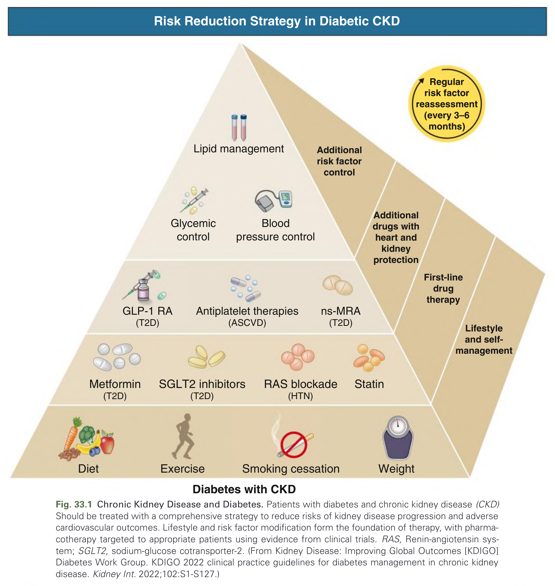
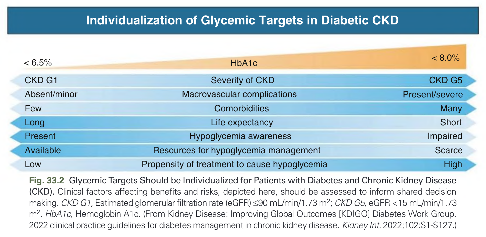
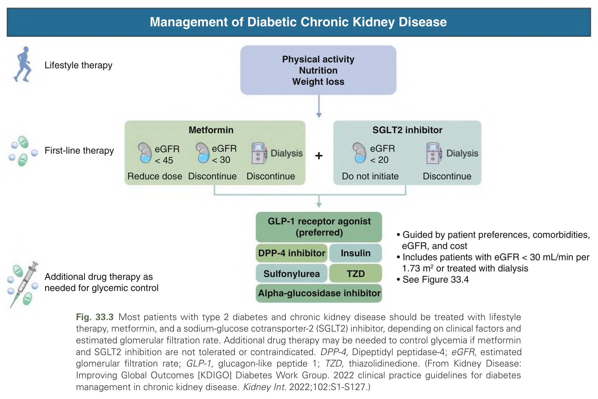
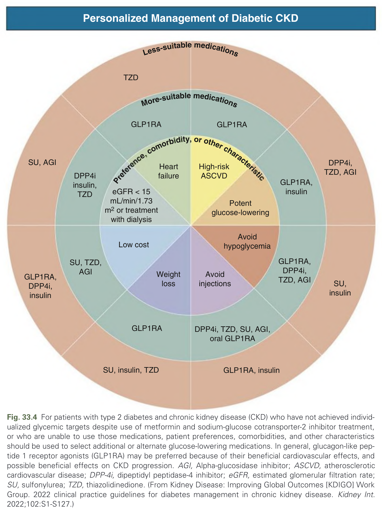
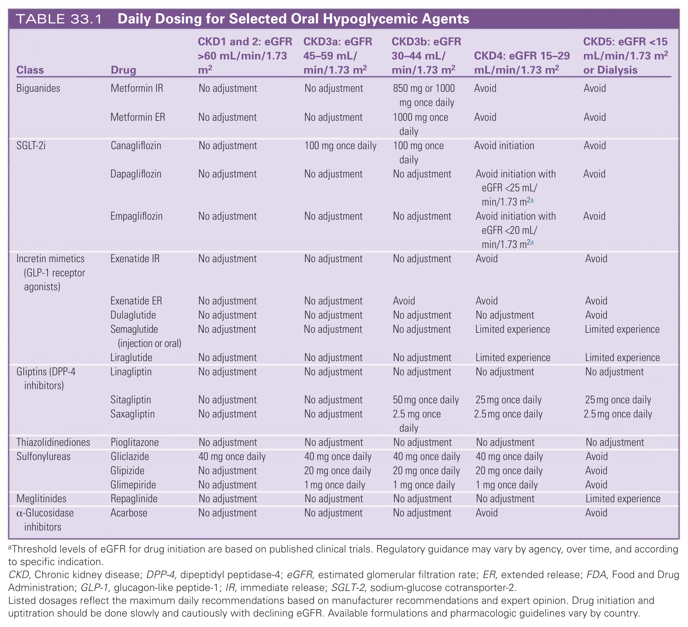
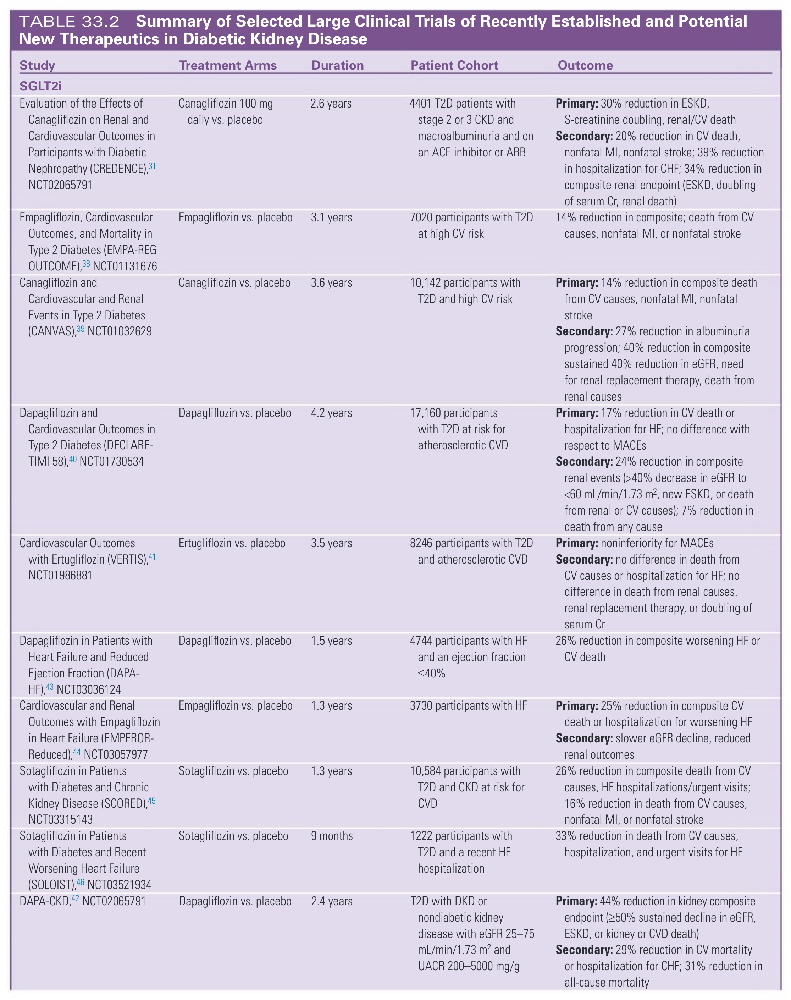
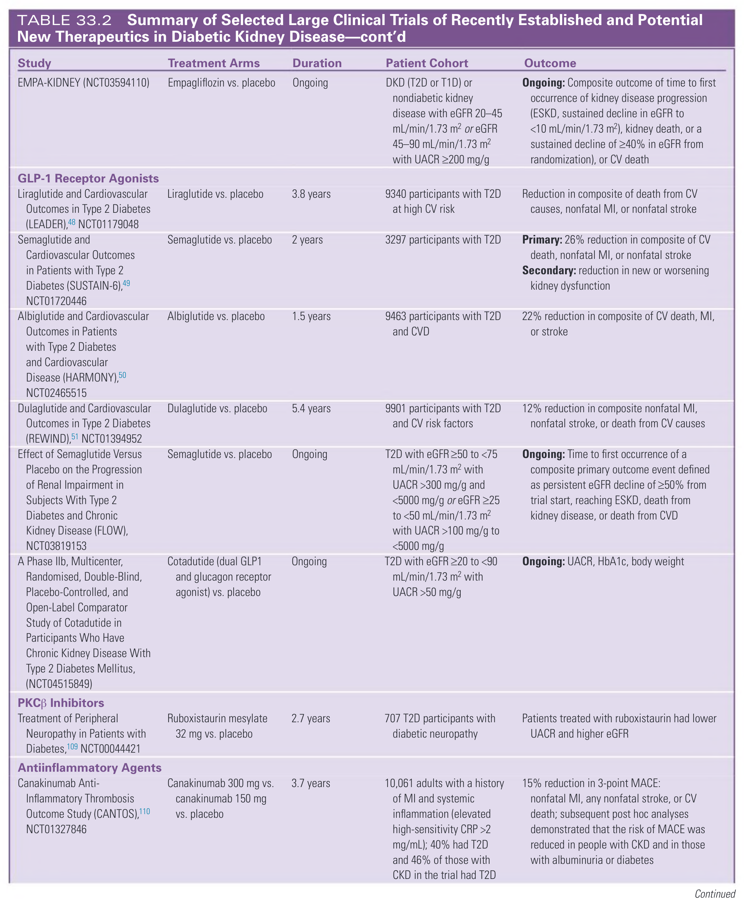
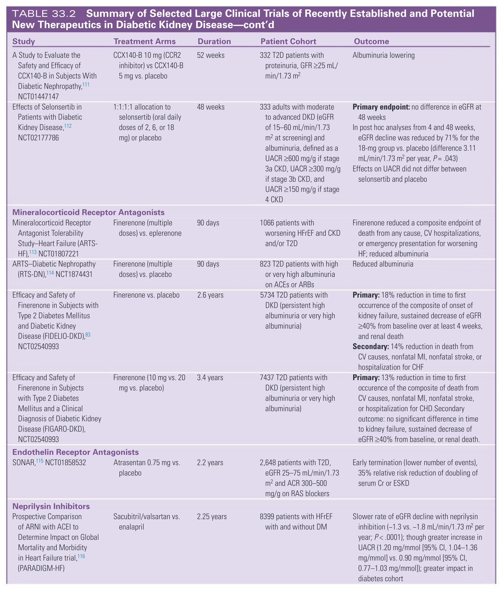
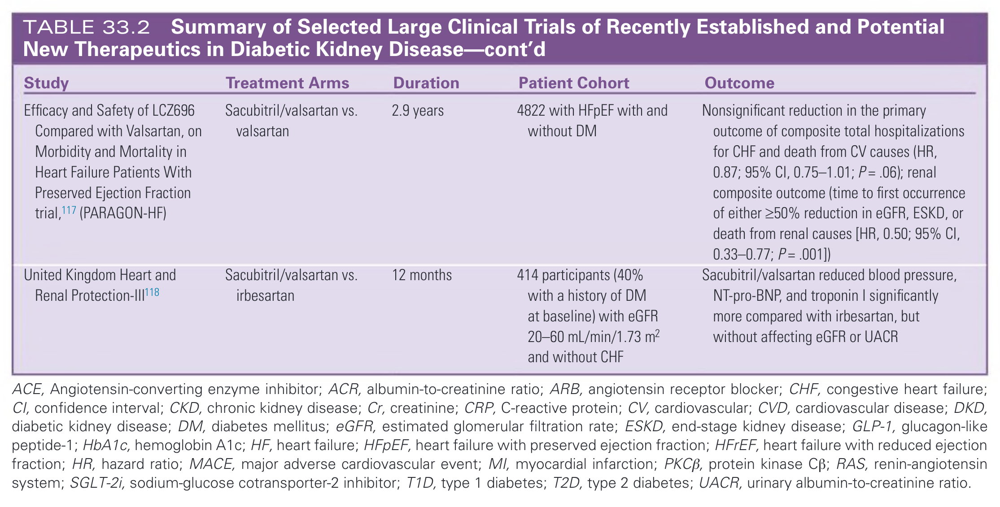

# 033. Management of Patients With Diabetes and Chronic Kidney Disease - Figures and Tables Index

This document lists all figures, tables and boxes extracted from `033. Management of Patients With Diabetes and Chronic Kidney Disease.pdf`.

## Table of Contents
- [Figures](#figures)
- [Tables](#tables)
- [Boxes](#boxes)

---

## Figures

### Fig_33_1



Fig. 33.1 Chronic Kidney Disease and Diabetes. Patients with diabetes and chronic kidney disease (CKD) Should be treated with a comprehensive strategy to reduce risks of kidney disease progression and adverse cardiovascular outcomes. Lifestyle and risk factor modification form the foundation of therapy, with pharmacotherapy targeted to appropriate patients using evidence from clinical trials. RAS, Renin-angiotensin system; SGLT2, sodium-glucose cotransporter-2. (From Kidney Disease: Improving Global Outcomes [KDIGO] Diabetes Work Group. KDIGO 2022 clinical practice guidelines for diabetes management in chronic kidney disease. Kidney Int. 2022;102:S1-S127.)

---

### Fig_33_2



Fig. 33.2 Glycemic Targets Should be Individualized for Patients with Diabetes and Chronic Kidney Disease (CKD). Clinical factors affecting benefits and risks, depicted here, should be assessed to inform shared decision making. CKD G1, Estimated glomerular filtration rate (eGFR) ≤90 mL/min/1.73 m2; CKD G5, eGFR <15 mL/min/1.73 m2. HbA1c, Hemoglobin A1c. (From Kidney Disease: Improving Global Outcomes [KDIGO] Diabetes Work Group. 2022 clinical practice guidelines for diabetes management in chronic kidney disease. Kidney Int. 2022;102:S1-S127.)

---

### Fig_33_3



Fig. 33.3 Most patients with type 2 diabetes and chronic kidney disease should be treated with lifestyle therapy, metformin, and a sodium-glucose cotransporter-2 (SGLT2) inhibitor, depending on clinical factors and estimated glomerular filtration rate. Additional drug therapy may be needed to control glycemia if metformin and SGLT2 inhibition are not tolerated or contraindicated. DPP-4, Dipeptidyl peptidase-4; eGFR, estimated glomerular filtration rate; GLP-1, glucagon-like peptide 1; TZD, thiazolidinedione. (From Kidney Disease: Improving Global Outcomes [KDIGO] Diabetes Work Group. 2022 clinical practice guidelines for diabetes management in chronic kidney disease. Kidney Int. 2022;102:S1-S127.)

---

### Fig_33_4



Fig. 33.4 For patients with type 2 diabetes and chronic kidney disease (CKD) who have not achieved individualized glycemic targets despite use of metformin and sodium-glucose cotransporter-2 inhibitor treatment, or who are unable to use those medications, patient preferences, comorbidities, and other characteristics should be used to select additional or alternate glucose-lowering medications. In general, glucagon-like peptide 1 receptor agonists (GLP1RA) may be preferred because of their beneficial cardiovascular effects, and possible beneficial effects on CKD progression. AGI, Alpha-glucosidase inhibitor; ASCVD, atherosclerotic cardiovascular disease; DPP-4i, dipeptidyl peptidase-4 inhibitor; eGFR, estimated glomerular filtration rate; SU, sulfonylurea; TZD, thiazolidinedione. (From Kidney Disease: Improving Global Outcomes [KDIGO] Work Group. 2022 clinical practice guidelines for diabetes management in chronic kidney disease. Kidney Int. 2022;102:S1-S127.)

---

## Tables

### Table_33_1

#### Table Image



#### Table Data (CSV: [Table_33_1.csv](Table_33_1.csv))

```markdown
| Class | Drug | CKD1 and 2: eGFR >60 mL/min/1.73 m2 | CKD3a: eGFR 45–59 mL/min/1.73 m2 | CKD3b: eGFR 30–44 mL/min/1.73 m2 | CKD4: eGFR 15–29 mL/min/1.73 m2 | CKD5: eGFR <15 mL/min/1.73 m2 or Dialysis |
| :--- | :--- | :--- | :--- | :--- | :--- | :--- |
| Biguanides | Metformin IR | No adjustment | No adjustment | 850 mg or 1000 mg once daily | Avoid | Avoid |
| | Metformin ER | No adjustment | No adjustment | 1000 mg once daily | Avoid | Avoid |
| SGLT-2i | Canagliflozin | No adjustment | 100 mg once daily | 100 mg once daily | Avoid initiation | Avoid |
| | Dapagliflozin | No adjustment | No adjustment | No adjustment | Avoid initiation with eGFR <25 mL/min/1.73 m2a | Avoid |
| | Empagliflozin | No adjustment | No adjustment | No adjustment | Avoid initiation with eGFR <20 mL/min/1.73 m2a | Avoid |
| Incretin mimetics (GLP-1 receptor agonists) | Exenatide IR | No adjustment | No adjustment | No adjustment | Avoid | Avoid |
| | Exenatide ER | No adjustment | No adjustment | Avoid | Avoid | Avoid |
| | Dulaglutide | No adjustment | No adjustment | No adjustment | No adjustment | Avoid |
| | Semaglutide (injection or oral) | No adjustment | No adjustment | No adjustment | Limited experience | Limited experience |
| | Liraglutide | No adjustment | No adjustment | No adjustment | Limited experience | Limited experience |
| Gliptins (DPP-4 inhibitors) | Linagliptin | No adjustment | No adjustment | No adjustment | No adjustment | No adjustment |
| | Sitagliptin | No adjustment | No adjustment | 50 mg once daily | 25 mg once daily | 25 mg once daily |
| | Saxagliptin | No adjustment | No adjustment | 2.5 mg once daily | 2.5 mg once daily | 2.5 mg once daily |
| Thiazolidinediones | Pioglitazone | No adjustment | No adjustment | No adjustment | No adjustment | No adjustment |
| Sulfonylureas | Gliclazide | 40 mg once daily | 40 mg once daily | 40 mg once daily | 40 mg once daily | Avoid |
| | Glipizide | No adjustment | 20 mg once daily | 20 mg once daily | 20 mg once daily | Avoid |
| | Glimepiride | No adjustment | 1 mg once daily | 1 mg once daily | 1 mg once daily | Avoid |
| Meglitinides | Repaglinide | No adjustment | No adjustment | No adjustment | No adjustment | Limited experience |
| α-Glucosidase inhibitors | Acarbose | No adjustment | No adjustment | No adjustment | Avoid | Avoid |

^a Threshold levels of eGFR for drug initiation are based on published clinical trials. Regulatory guidance may vary by agency, over time, and according to specific indication.

CKD, Chronic kidney disease; DPP-4, dipeptidyl peptidase-4; eGFR, estimated glomerular filtration rate; ER, extended release; FDA, Food and Drug Administration; GLP-1, glucagon-like peptide-1; IR, immediate release; SGLT-2, sodium-glucose cotransporter-2.

Listed dosages reflect the maximum daily recommendations based on manufacturer recommendations and expert opinion. Drug initiation and uptitration should be done slowly and cautiously with declining eGFR. Available formulations and pharmacologic guidelines vary by country.
```

TABLE 33.1 Daily Dosing for Selected Oral Hypoglycemic Agents

---

### Table_33_2

#### Table Image









#### Table Data (CSV: [Table_33_2.csv](Table_33_2.csv))

```markdown
| Study | Treatment Arms | Duration | Patient Cohort | Outcome |
| :--- | :--- | :--- | :--- | :--- |
| **SGLT2i** | | | | |
| Evaluation of the Effects of Canagliflozin on Renal and Cardiovascular Outcomes in Participants with Diabetic Nephropathy (CREDENCE),^31 NCT02065791 | Canagliflozin 100 mg daily vs. placebo | 2.6 years | 4401 T2D patients with stage 2 or 3 CKD and macroalbuminuria and on an ACE inhibitor or ARB | Primary: 30% reduction in ESKD, S-creatinine doubling, renal/CV death<br>Secondary: 20% reduction in CV death, nonfatal MI, nonfatal stroke; 39% reduction in hospitalization for CHF; 34% reduction in composite renal endpoint (ESKD, doubling of serum Cr, renal death) |
| Empagliflozin, Cardiovascular Outcomes, and Mortality in Type 2 Diabetes (EMPA-REG OUTCOME),^38 NCT01131676 | Empagliflozin vs. placebo | 3.1 years | 7020 participants with T2D at high CV risk | 14% reduction in composite; death from CV causes, nonfatal MI, or nonfatal stroke |
| Canagliflozin and Cardiovascular and Renal Events in Type 2 Diabetes (CANVAS),^39 NCT01032629 | Canagliflozin vs. placebo | 3.6 years | 10,142 participants with T2D and high CV risk | Primary: 14% reduction in composite death from CV causes, nonfatal MI, nonfatal stroke<br>Secondary: 27% reduction in albuminuria progression; 40% reduction in composite sustained 40% reduction in eGFR, need for renal replacement therapy, death from renal causes |
| Dapagliflozin and Cardiovascular Outcomes in Type 2 Diabetes (DECLARE-TIMI 58),^40 NCT01730534 | Dapagliflozin vs. placebo | 4.2 years | 17,160 participants with T2D at risk for atherosclerotic CVD | Primary: 17% reduction in CV death or hospitalization for HF; no difference with respect to MACEs<br>Secondary: 24% reduction in composite renal events (>40% decrease in eGFR to <60 mL/min/1.73 m2, new ESKD, or death from renal or CV causes); 7% reduction in death from any cause |
| Cardiovascular Outcomes with Ertugliflozin (VERTIS),^41 NCT01986881 | Ertugliflozin vs. placebo | 3.5 years | 8246 participants with T2D and atherosclerotic CVD | Primary: noninferiority for MACEs<br>Secondary: no difference in death from CV causes or hospitalization for HF; no difference in death from renal causes, renal replacement therapy, or doubling of serum Cr |
| Dapagliflozin in Patients with Heart Failure and Reduced Ejection Fraction (DAPA-HF),^43 NCT03036124 | Dapagliflozin vs. placebo | 1.5 years | 4744 participants with HF and an ejection fraction ≤40% | 26% reduction in composite worsening HF or CV death |
| Cardiovascular and Renal Outcomes with Empagliflozin in Heart Failure (EMPEROR-Reduced),^44 NCT03057977 | Empagliflozin vs. placebo | 1.3 years | 3730 participants with HF | Primary: 25% reduction in composite CV death or hospitalization for worsening HF<br>Secondary: slower eGFR decline, reduced renal outcomes |
| Sotagliflozin in Patients with Diabetes and Chronic Kidney Disease (SCORED),^45 NCT03315143 | Sotagliflozin vs. placebo | 1.3 years | 10,584 participants with T2D and CKD at risk for CVD | 26% reduction in composite death from CV causes, HF hospitalizations/urgent visits; 16% reduction in death from CV causes, nonfatal MI, or nonfatal stroke |
| Sotagliflozin in Patients with Diabetes and Recent Worsening Heart Failure (SOLOIST),^46 NCT03521934 | Sotagliflozin vs. placebo | 9 months | 1222 participants with T2D and a recent HF hospitalization | 33% reduction in death from CV causes, hospitalization, and urgent visits for HF |
| DAPA-CKD,^42 NCT02065791 | Dapagliflozin vs. placebo | 2.4 years | T2D with DKD or nondiabetic kidney disease with eGFR 25–75 mL/min/1.73 m2 and UACR 200–5000 mg/g | Primary: 44% reduction in kidney composite endpoint (≥50% sustained decline in eGFR, ESKD, or kidney or CVD death)<br>Secondary: 29% reduction in CV mortality or hospitalization for CHF; 31% reduction in all-cause mortality |
| EMPA-KIDNEY (NCT03594110) | Empagliflozin vs. placebo | Ongoing | DKD (T2D or T1D) or nondiabetic kidney disease with eGFR 20–45 mL/min/1.73 m2 or eGFR 45–90 mL/min/1.73 m2 with UACR ≥200 mg/g | Ongoing: Composite outcome of time to first occurrence of kidney disease progression (ESKD, sustained decline in eGFR to <10 mL/min/1.73 m2), kidney death, or a sustained decline of ≥40% in eGFR from randomization), or CV death |
| **GLP-1 Receptor Agonists** | | | | |
| Liraglutide and Cardiovascular Outcomes in Type 2 Diabetes (LEADER),^48 NCT01179048 | Liraglutide vs. placebo | 3.8 years | 9340 participants with T2D at high CV risk | Reduction in composite of death from CV causes, nonfatal MI, or nonfatal stroke |
| Semaglutide and Cardiovascular Outcomes in Patients with Type 2 Diabetes (SUSTAIN-6),^49 NCT01720446 | Semaglutide vs. placebo | 2 years | 3297 participants with T2D | Primary: 26% reduction in composite of CV death, nonfatal MI, or nonfatal stroke<br>Secondary: reduction in new or worsening kidney dysfunction |
| Albiglutide and Cardiovascular Outcomes in Patients with Type 2 Diabetes and Cardiovascular Disease (HARMONY),^50 NCT02465515 | Albiglutide vs. placebo | 1.5 years | 9463 participants with T2D and CVD | 22% reduction in composite of CV death, MI, or stroke |
| Dulaglutide and Cardiovascular Outcomes in Type 2 Diabetes (REWIND),^51 NCT01394952 | Dulaglutide vs. placebo | 5.4 years | 9901 participants with T2D and CV risk factors | 12% reduction in composite nonfatal MI, nonfatal stroke, or death from CV causes |
| Effect of Semaglutide Versus Placebo on the Progression of Renal Impairment in Subjects With Type 2 Diabetes and Chronic Kidney Disease (FLOW), NCT03819153 | Semaglutide vs. placebo | Ongoing | T2D with eGFR ≥50 to <75 mL/min/1.73 m2 with UACR >300 mg/g and <5000 mg/g or eGFR ≥25 to <50 mL/min/1.73 m2 with UACR >100 mg/g to <5000 mg/g | Ongoing: Time to first occurrence of a composite primary outcome event defined as persistent eGFR decline of ≥50% from trial start, reaching ESKD, death from kidney disease, or death from CVD |
| A Phase IIb, Multicenter, Randomised, Double-Blind, Placebo-Controlled, and Open-Label Comparator Study of Cotadutide in Participants Who Have Chronic Kidney Disease With Type 2 Diabetes Mellitus, (NCT04515849) | Cotadutide (dual GLP1 and glucagon receptor agonist) vs. placebo | Ongoing | T2D with eGFR ≥20 to <90 mL/min/1.73 m2 with UACR >50 mg/g | Ongoing: UACR, HbA1c, body weight |
| **PKCβ Inhibitors** | | | | |
| Treatment of Peripheral Neuropathy in Patients with Diabetes,^109 NCT00044421 | Ruboxistaurin mesylate 32 mg vs. placebo | 2.7 years | 707 T2D participants with diabetic neuropathy | Patients treated with ruboxistaurin had lower UACR and higher eGFR |
| **Antiinflammatory Agents** | | | | |
| Canakinumab Anti-Inflammatory Thrombosis Outcome Study (CANTOS),^110 NCT01327846 | Canakinumab 300 mg vs. canakinumab 150 mg vs. placebo | 3.7 years | 10,061 adults with a history of MI and systemic inflammation (elevated high-sensitivity CRP >2 mg/mL); 40% had T2D and 46% of those with CKD in the trial had T2D | 15% reduction in 3-point MACE: nonfatal MI, any nonfatal stroke, or CV death; subsequent post hoc analyses demonstrated that the risk of MACE was reduced in people with CKD and in those with albuminuria or diabetes |
| A Study to Evaluate the Safety and Efficacy of CCX140-B in Subjects With Diabetic Nephropathy,^111 NCT01447147 | CCX140-B 10 mg (CCR2 inhibitor) vs CCX140-B 5 mg vs. placebo | 52 weeks | 332 T2D patients with proteinuria, GFR ≥25 mL/min/1.73 m2 | Albuminuria lowering |
| Effects of Selonsertib in Patients with Diabetic Kidney Disease,^112 NCT02177786 | 1:1:1:1 allocation to selonsertib (oral daily doses of 2, 6, or 18 mg) or placebo | 48 weeks | 333 adults with moderate to advanced DKD (eGFR of 15–60 mL/min/1.73 m2 at screening) and albuminuria, defined as a UACR ≥600 mg/g if stage 3a CKD, UACR ≥300 mg/g if stage 3b CKD, and UACR ≥150 mg/g if stage 4 CKD | Primary endpoint: no difference in eGFR at 48 weeks<br>In post hoc analyses from 4 and 48 weeks, eGFR decline was reduced by 71% for the 18-mg group vs. placebo (difference 3.11 mL/min/1.73 m2 per year, P = .043)<br>Effects on UACR did not differ between selonsertib and placebo |
| **Mineralocorticoid Receptor Antagonists** | | | | |
| Mineralocorticoid Receptor Antagonist Tolerability Study–Heart Failure (ARTS-HF),^113 NCT01807221 | Finerenone (multiple doses) vs. eplerenone | 90 days | 1066 patients with worsening HFrEF and CKD and/or T2D | Finerenone reduced a composite endpoint of death from any cause, CV hospitalizations, or emergency presentation for worsening HF; reduced albuminuria |
| ARTS–Diabetic Nephropathy (RTS-DN),^114 NCT1874431 | Finerenone (multiple doses) vs. placebo | 90 days | 823 T2D patients with high or very high albuminuria on ACEs or ARBs | Reduced albuminuria |
| Efficacy and Safety of Finerenone in Subjects with Type 2 Diabetes Mellitus and Diabetic Kidney Disease (FIDELIO-DKD),^83 NCT02540993 | Finerenone vs. placebo | 2.6 years | 5734 T2D patients with DKD (persistent high albuminuria or very high albuminuria) | Primary: 18% reduction in time to first occurrence of the composite of onset of kidney failure, sustained decrease of eGFR ≥40% from baseline over at least 4 weeks, and renal death<br>Secondary: 14% reduction in death from CV causes, nonfatal MI, nonfatal stroke, or hospitalization for CHF |
| Efficacy and Safety of Finerenone in Subjects with Type 2 Diabetes Mellitus and a Clinical Diagnosis of Diabetic Kidney Disease (FIGARO-DKD), NCT02540993 | Finerenone (10 mg vs. 20 mg vs. placebo) | 3.4 years | 7437 T2D patients with DKD (persistent high albuminuria or very high albuminuria) | Primary: 13% reduction in time to first occurrence of the composite of death from CV causes, nonfatal MI, nonfatal stroke, or hospitalization for CHD. Secondary outcome: no significant difference in time to kidney failure, sustained decrease of eGFR ≥40% from baseline, or renal death. |
| **Endothelin Receptor Antagonists** | | | | |
| SONAR,^115 NCT01858532 | Atrasentan 0.75 mg vs. placebo | 2.2 years | 2,648 patients with T2D, eGFR 25–75 mL/min/1.73 m2 and ACR 300–500 mg/g on RAS blockers | Early termination (lower number of events), 35% relative risk reduction of doubling of serum Cr or ESKD |
| **Neprilysin Inhibitors** | | | | |
| Prospective Comparison of ARNI with ACEI to Determine Impact on Global Mortality and Morbidity in Heart Failure trial,^116 (PARADIGM-HF) | Sacubitril/valsartan vs. enalapril | 2.25 years | 8399 patients with HFrEF with and without DM | Slower rate of eGFR decline with neprilysin inhibition (−1.3 vs. −1.8 mL/min/1.73 m2 per year; P < .0001); though greater increase in UACR (1.20 mg/mmol [95% CI, 1.04–1.36 mg/mmol] vs. 0.90 mg/mmol [95% CI, 0.77–1.03 mg/mmol]); greater impact in diabetes cohort |
| Efficacy and Safety of LCZ696 Compared with Valsartan, on Morbidity and Mortality in Heart Failure Patients With Preserved Ejection Fraction trial,^117 (PARAGON-HF) | Sacubitril/valsartan vs. valsartan | 2.9 years | 4822 with HFpEF with and without DM | Nonsignificant reduction in the primary outcome of composite total hospitalizations for CHF and death from CV causes (HR, 0.87; 95% CI, 0.75–1.01; P = .06); renal composite outcome (time to first occurrence of either ≥50% reduction in eGFR, ESKD, or death from renal causes [HR, 0.50; 95% CI, 0.33–0.77; P = .001]) |
| United Kingdom Heart and Renal Protection-III^118 | Sacubitril/valsartan vs. irbesartan | 12 months | 414 participants (40% with a history of DM at baseline) with eGFR 20–60 mL/min/1.73 m2 and without CHF | Sacubitril/valsartan reduced blood pressure, NT-pro-BNP, and troponin I significantly more compared with irbesartan, but without affecting eGFR or UACR |

ACE, Angiotensin-converting enzyme inhibitor; ACR, albumin-to-creatinine ratio; ARB, angiotensin receptor blocker; CHF, congestive heart failure; CI, confidence interval; CKD, chronic kidney disease; Cr, creatinine; CRP, C-reactive protein; CV, cardiovascular; CVD, cardiovascular disease; DKD, diabetic kidney disease; DM, diabetes mellitus; eGFR, estimated glomerular filtration rate; ESKD, end-stage kidney disease; GLP-1, glucagon-like peptide-1; HbA1c, hemoglobin A1c; HF, heart failure; HFpEF, heart failure with preserved ejection fraction; HFrEF, heart failure with reduced ejection fraction; HR, hazard ratio; MACE, major adverse cardiovascular event; MI, myocardial infarction; PKCβ, protein kinase Cβ; RAS, renin-angiotensin system; SGLT-2i, sodium-glucose cotransporter-2 inhibitor; T1D, type 1 diabetes; T2D, type 2 diabetes; UACR, urinary albumin-to-creatinine ratio.
```

TABLE 33.2 Summary of Selected Large Clinical Trials of Recently Established and Potential New Therapeutics in Diabetic Kidney Disease

---

## Boxes

*No boxes resolved for this chapter.*
