# 034. Normal Blood Pressure Control and the Evaluation of Hypertension - Figures and Tables Index

This document lists all figures, tables and boxes extracted from `034. Normal Blood Pressure Control and the Evaluation of Hypertension.pdf`.

## Table of Contents
- [Figures](#figures)
- [Tables](#tables)
- [Boxes](#boxes)

---

## Figures

### Fig_34_1

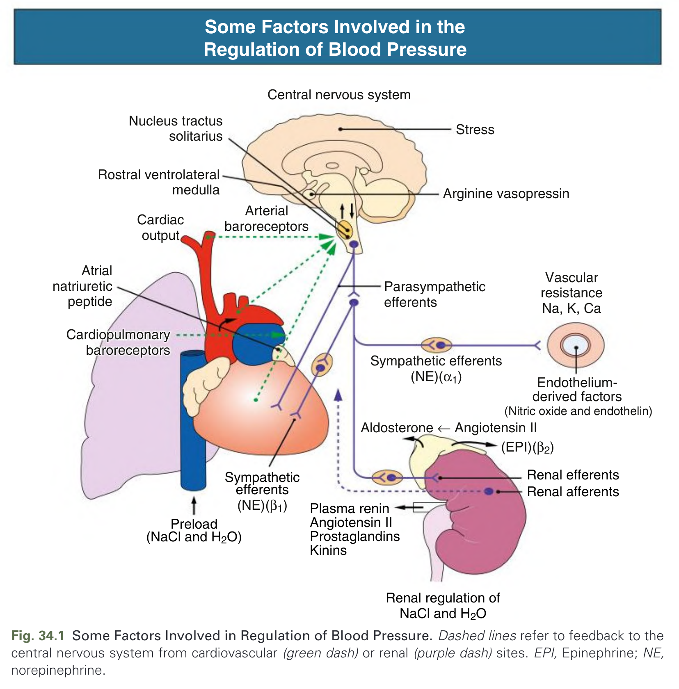

Fig. 34.1 Some Factors Involved in Regulation of Blood Pressure. Dashed lines refer to feedback to the central nervous system from cardiovascular (green dash) or renal (purple dash) sites. EPI, Epinephrine; NE, norepinephrine.

---

### Fig_34_2

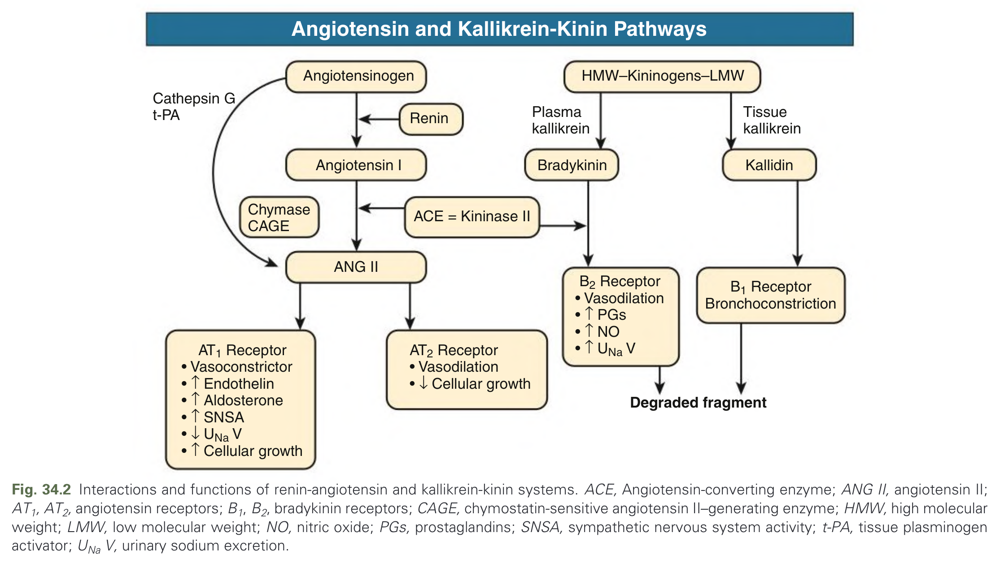

Fig. 34.2 Interactions and functions of renin-angiotensin and kallikrein-kinin systems. ACE, Angiotensin-converting enzyme; ANG II, angiotensin II; AT1, AT2, angiotensin receptors; B1, B2, bradykinin receptors; CAGE, chymostatin-sensitive angiotensin II–generating enzyme; HMW, high molecular weight; LMW, low molecular weight; NO, nitric oxide; PGs, prostaglandins; SNSA, sympathetic nervous system activity; t-PA, tissue plasminogen activator; UNa V, urinary sodium excretion.

---

### Fig_34_3

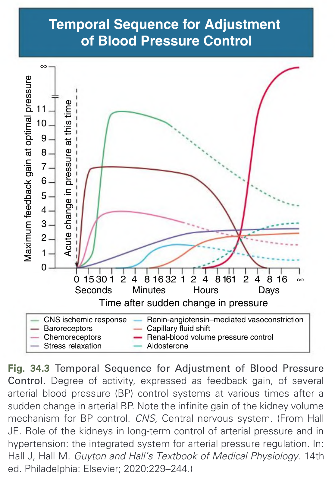

Fig. 34.3 Temporal Sequence for Adjustment of Blood Pressure Control. Degree of activity, expressed as feedback gain, of several arterial blood pressure (BP) control systems at various times after a sudden change in arterial BP. Note the infinite gain of the kidney volume mechanism for BP control. CNS, Central nervous system. (From Hall JE. Role of the kidneys in long-term control of arterial pressure and in hypertension: the integrated system for arterial pressure regulation. In: Hall J, Hall M. Guyton and Hall’s Textbook of Medical Physiology. 14th ed. Philadelphia: Elsevier; 2020:229–244.)

---

### Fig_34_4

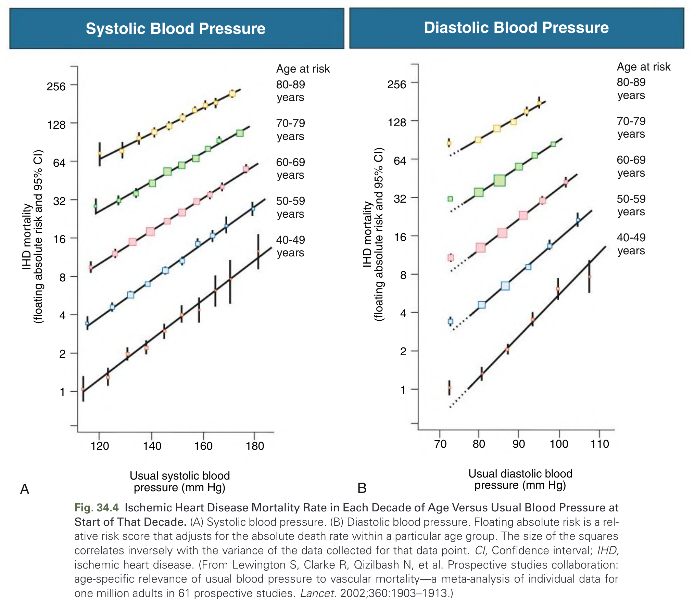

Fig. 34.4 Ischemic Heart Disease Mortality Rate in Each Decade of Age Versus Usual Blood Pressure at Start of That Decade. (A) Systolic blood pressure. (B) Diastolic blood pressure. Floating absolute risk is a relative risk score that adjusts for the absolute death rate within a particular age group. The size of the squares correlates inversely with the variance of the data collected for that data point. CI, Confidence interval; IHD, ischemic heart disease. (From Lewington S, Clarke R, Qizilbash N, et al. Prospective studies collaboration: age-specific relevance of usual blood pressure to vascular mortality—a meta-analysis of individual data for one million adults in 61 prospective studies. Lancet. 2002;360:1903–1913.)

---

### Fig_34_5

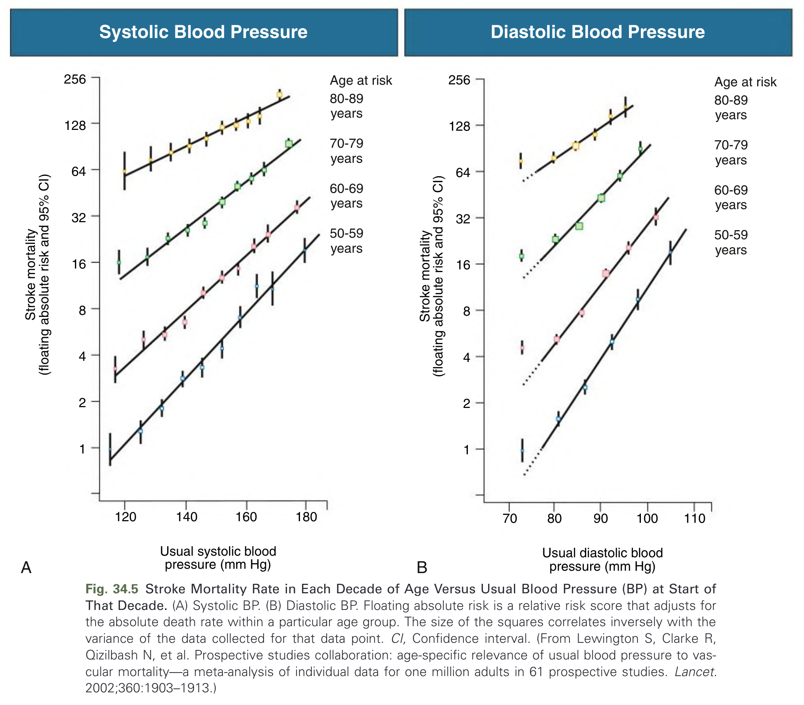

Fig. 34.5 Stroke Mortality Rate in Each Decade of Age Versus Usual Blood Pressure (BP) at Start of That Decade. (A) Systolic BP. (B) Diastolic BP. Floating absolute risk is a relative risk score that adjusts for the absolute death rate within a particular age group. The size of the squares correlates inversely with the variance of the data collected for that data point. CI, Confidence interval. (From Lewington S, Clarke R, Qizilbash N, et al. Prospective studies collaboration: age-specific relevance of usual blood pressure to vascular mortality—a meta-analysis of individual data for one million adults in 61 prospective studies. Lancet. 2002;360:1903–1913.)

---

### Fig_34_6

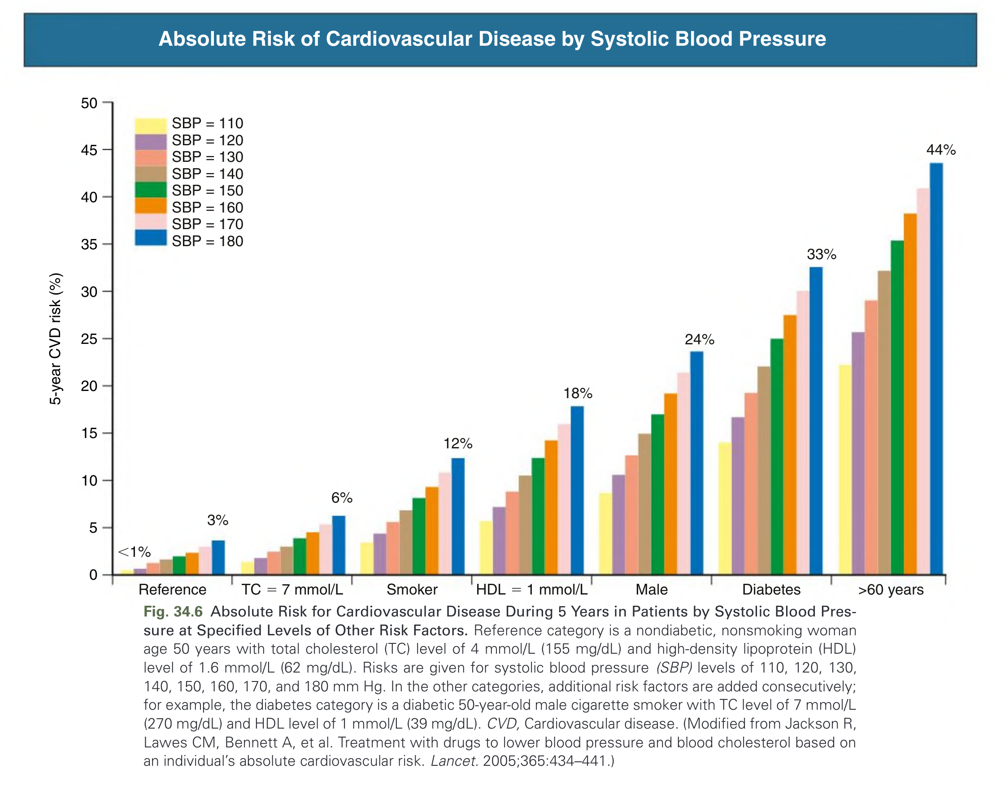

Fig. 34.6 Absolute Risk for Cardiovascular Disease During 5 Years in Patients by Systolic Blood Pressure at Specified Levels of Other Risk Factors. Reference category is a nondiabetic, nonsmoking woman age 50 years with total cholesterol (TC) level of 4 mmol/L (155 mg/dL) and high-density lipoprotein (HDL) level of 1.6 mmol/L (62 mg/dL). Risks are given for systolic blood pressure (SBP) levels of 110, 120, 130, 140, 150, 160, 170, and 180 mm Hg. In the other categories, additional risk factors are added consecutively; for example, the diabetes category is a diabetic 50-year-old male cigarette smoker with TC level of 7 mmol/L (270 mg/dL) and HDL level of 1 mmol/L (39 mg/dL). CVD, Cardiovascular disease. (Modified from Jackson R, Lawes CM, Bennett A, et al. Treatment with drugs to lower blood pressure and blood cholesterol based on an individual's absolute cardiovascular risk. Lancet. 2005;365:434–441.)

---

### Fig_34_7

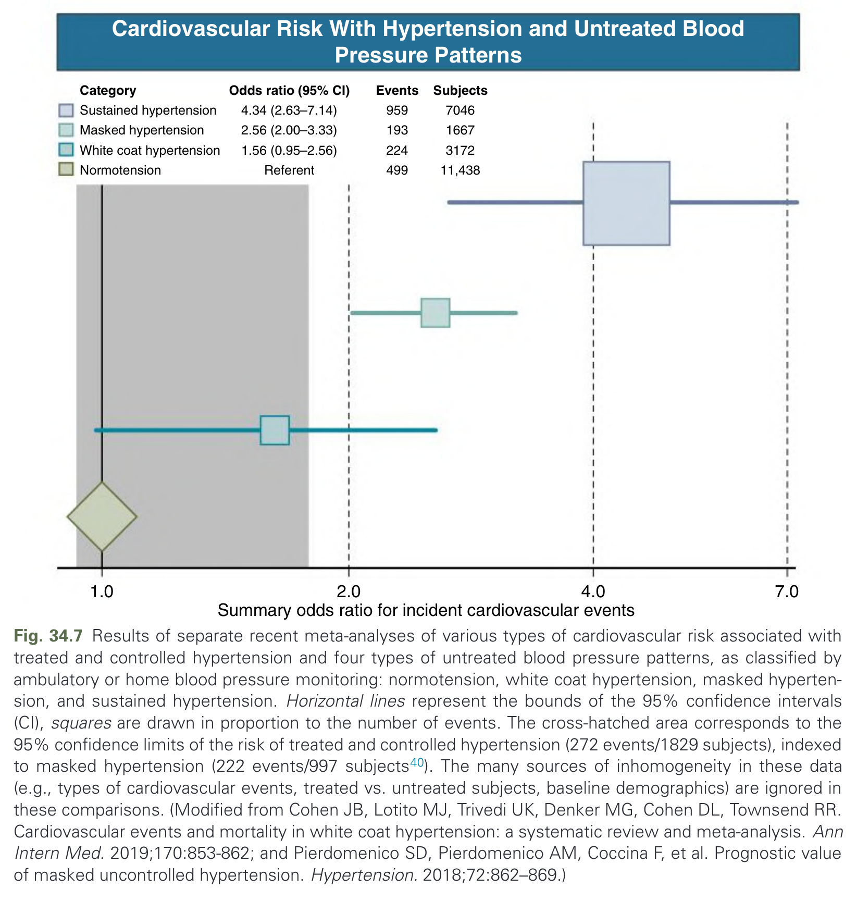

Fig. 34.7 Results of separate recent meta-analyses of various types of cardiovascular risk associated with treated and controlled hypertension and four types of untreated blood pressure patterns, as classified by ambulatory or home blood pressure monitoring: normotension, white coat hypertension, masked hypertension, and sustained hypertension. Horizontal lines represent the bounds of the 95% confidence intervals (CI), squares are drawn in proportion to the number of events. The cross-hatched area corresponds to the 95% confidence limits of the risk of treated and controlled hypertension (272 events/1829 subjects), indexed to masked hypertension (222 events/997 subjects40). The many sources of inhomogeneity in these data (e.g., types of cardiovascular events, treated vs. untreated subjects, baseline demographics) are ignored in these comparisons. (Modified from Cohen JB, Lotito MJ, Trivedi UK, Denker MG, Cohen DL, Townsend RR. Cardiovascular events and mortality in white coat hypertension: a systematic review and meta-analysis. Ann Intern Med. 2019;170:853-862; and Pierdomenico SD, Pierdomenico AM, Coccina F, et al. Prognostic value of masked uncontrolled hypertension. Hypertension. 2018;72:862–869.)

---

### Fig_34_8

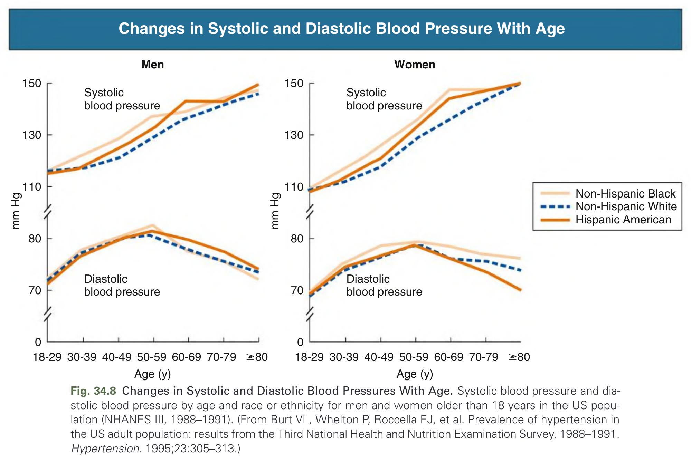

Fig. 34.8 Changes in Systolic and Diastolic Blood Pressures With Age. Systolic blood pressure and diastolic blood pressure by age and race or ethnicity for men and women older than 18 years in the US population (NHANES III, 1988–1991). (From Burt VL, Whelton P, Roccella EJ, et al. Prevalence of hypertension in the US adult population: results from the Third National Health and Nutrition Examination Survey, 1988–1991. Hypertension. 1995;23:305–313.)

---

### Fig_34_9

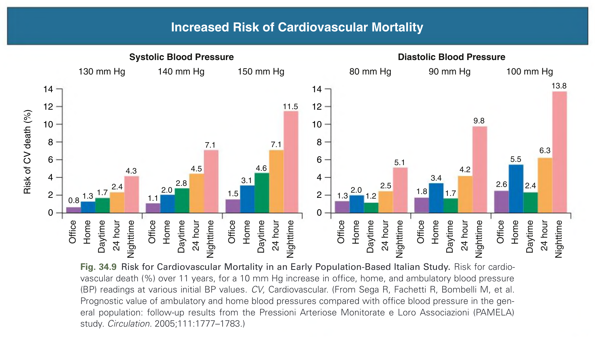

Fig. 34.9 Risk for Cardiovascular Mortality in an Early Population-Based Italian Study. Risk for cardio-vascular death (%) over 11 years, for a 10 mm Hg increase in office, home, and ambulatory blood pressure (BP) readings at various initial BP values. CV, Cardiovascular. (From Sega R, Fachetti R, Bombelli M, et al. Prognostic value of ambulatory and home blood pressures compared with office blood pressure in the general population: follow-up results from the Pressioni Arteriose Monitorate e Loro Associazioni (PAMELA) study. Circulation. 2005;111:1777–1783.)

---

### Fig_34_10

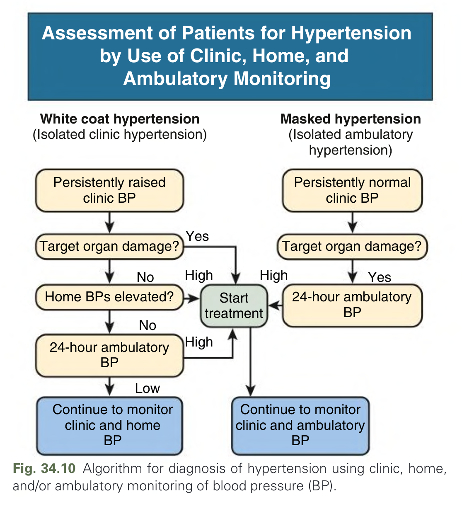

Fig. 34.10 Algorithm for diagnosis of hypertension using clinic, home, and/or ambulatory monitoring of blood pressure (BP).

---

## Tables

### Table_34_1

#### Table Image

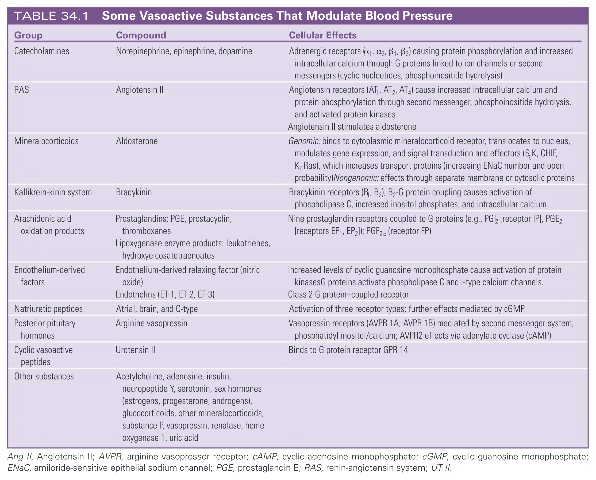

#### Table Data (CSV: [Table_34_1.csv](Table_34_1.csv))

```markdown
| Group | Compound | Cellular Effects |
| :--- | :--- | :--- |
| **Catecholamines** | Norepinephrine, epinephrine, dopamine | Adrenergic receptors (a1, a2, B1, B2) causing protein phosphorylation and increased intracellular calcium through G proteins linked to ion channels or second messengers (cyclic nucleotides, phosphoinositide hydrolysis) |
| **RAS** | Angiotensin II | Angiotensin receptors (AT₁, AT2, AT4) cause increased intracellular calcium and protein phosphorylation through second messenger, phosphoinositide hydrolysis, and activated protein kinases |
| | | Angiotensin II stimulates aldosterone |
| **Mineralocorticoids** | Aldosterone | Genomic: binds to cytoplasmic mineralocorticoid receptor, translocates to nucleus, modulates gene expression, and signal transduction and effectors (SK, CHIF, K-Ras), which increases transport proteins (increasing ENaC number and open probability)Nongenomic: effects through separate membrane or cytosolic proteins |
| **Kallikrein-kinin system** | Bradykinin | Bradykinin receptors (B₁, B2), B2-G protein coupling causes activation of phospholipase C, increased inositol phosphates, and intracellular calcium |
| **Arachidonic acid oxidation products** | Prostaglandins: PGE, prostacyclin, thromboxanes | Nine prostaglandin receptors coupled to G proteins (e.g., PG2 [receptor IP], PGE2 [receptors EP1, EP2]); PGF2a (receptor FP) |
| | Lipoxygenase enzyme products: leukotrienes, hydroxyeicosatetraenoates | |
| **Endothelium-derived factors** | Endothelium-derived relaxing factor (nitric oxide) | Increased levels of cyclic guanosine monophosphate cause activation of protein kinasesG proteins activate phospholipase C and L-type calcium channels. |
| | Endothelins (ET-1, ET-2, ET-3) | Class 2 G protein-coupled receptor |
| **Natriuretic peptides** | Atrial, brain, and C-type | Activation of three receptor types; further effects mediated by cGMP |
| **Posterior pituitary hormones** | Arginine vasopressin | Vasopressin receptors (AVPR 1A; AVPR 1B) mediated by second messenger system, phosphatidyl inositol/calcium; AVPR2 effects via adenylate cyclase (cAMP) |
| **Cyclic vasoactive peptides** | Urotensin II | Binds to G protein receptor GPR 14 |
| **Other substances** | Acetylcholine, adenosine, insulin, neuropeptide Y, serotonin, sex hormones (estrogens, progesterone, androgens), glucocorticoids, other mineralocorticoids, substance P, vasopressin, renalase, heme oxygenase 1, uric acid | |

Ang II, Angiotensin II; AVPR, arginine vasopressor receptor; CAMP, cyclic adenosine monophosphate; cGMP, cyclic guanosine monophosphate; ENaC, amiloride-sensitive epithelial sodium channel; PGE, prostaglandin E; RAS, renin-angiotensin system; UT II.
```

TABLE 34.1 Some Vasoactive Substances That Modulate Blood Pressure

---

### Table_34_2

#### Table Image

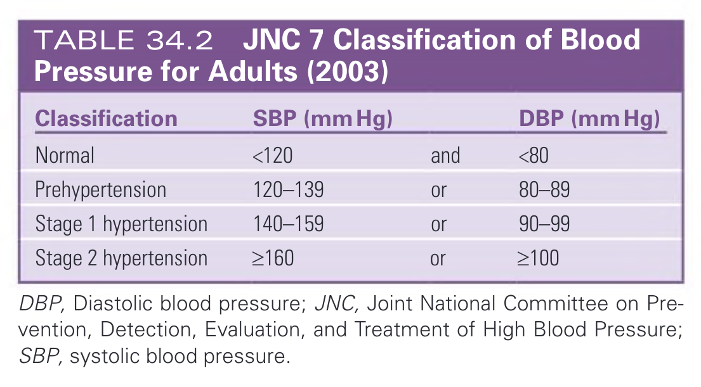

#### Table Data (CSV: [Table_34_2.csv](Table_34_2.csv))

```markdown
| Classification | SBP (mmHg) | | DBP (mmHg) |
| :--- | :--- | :--- | :--- |
| Normal | <120 | and | <80 |
| Prehypertension | 120-139 | or | 80-89 |
| Stage 1 hypertension | 140-159 | or | 90-99 |
| Stage 2 hypertension | ≥160 | or | ≥100 |

DBP, Diastolic blood pressure; JNC, Joint National Committee on Prevention, Detection, Evaluation, and Treatment of High Blood Pressure; SBP, systolic blood pressure.
```

TABLE 34.2 JNC 7 Classification of Blood Pressure for Adults (2003)

---

### Table_34_3

#### Table Image

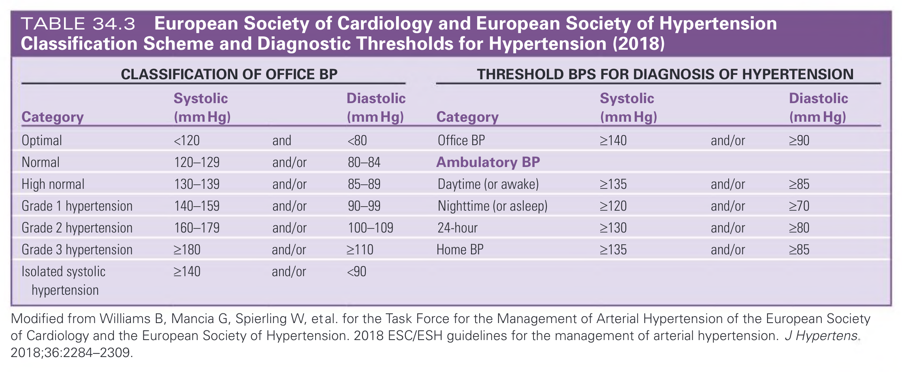

#### Table Data (CSV: [Table_34_3.csv](Table_34_3.csv))

```markdown
| Category (Office BP) | Systolic (mmHg) | Diastolic (mmHg) | Category (Threshold BPs) | Systolic (mmHg) | Diastolic (mmHg) |
| :--- | :--- | :--- | :--- | :--- | :--- |
| Optimal | <120 | and <80 | Office BP | ≥140 | and/or ≥90 |
| Normal | 120–129 | and/or 80–84 | Ambulatory BP | | |
| High normal | 130–139 | and/or 85–89 | Daytime (or awake) | ≥135 | and/or ≥85 |
| Grade 1 hypertension | 140–159 | and/or 90–99 | Nighttime (or asleep) | ≥120 | and/or ≥70 |
| Grade 2 hypertension | 160–179 | and/or 100–109 | 24-hour | ≥130 | and/or ≥80 |
| Grade 3 hypertension | ≥180 | and/or ≥110 | Home BP | ≥135 | and/or ≥85 |
| Isolated systolic hypertension | ≥140 | and/or <90 | | | |

Modified from Williams B, Mancia G, Spierling W, et al. for the Task Force for the Management of Arterial Hypertension of the European Society of Cardiology and the European Society of Hypertension. 2018 ESC/ESH guidelines for the management of arterial hypertension. J Hypertens 2018;36:2284–2309.
```

TABLE 34.3 European Society of Cardiology and European Society of Hypertension Classification Scheme and Diagnostic Thresholds for Hypertension (2018)

---

### Table_34_4

#### Table Image

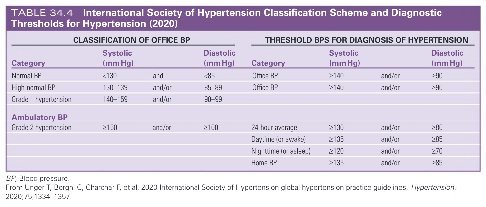

#### Table Data (CSV: [Table_34_4.csv](Table_34_4.csv))

```markdown
| Category (Office BP) | Systolic (mmHg) | Diastolic (mmHg) | Category (Threshold BPs) | Systolic (mmHg) | Diastolic (mmHg) |
| :--- | :--- | :--- | :--- | :--- | :--- |
| Normal BP | <130 | and <85 | Office BP | ≥140 | and/or ≥90 |
| High-normal BP | 130–139 | and/or 85–89 | Ambulatory BP | | |
| Grade 1 hypertension | 140–159 | and/or 90–99 | 24-hour average | ≥130 | and/or ≥80 |
| Grade 2 hypertension | ≥160 | and/or ≥100 | Daytime (or awake) | ≥135 | and/or ≥85 |
| | | | Daytime (or awake) | ≥135 | and/or ≥85 |
| | | | Nighttime (or asleep) | ≥120 | and/or ≥70 |
| | | | Home BP | ≥135 | and/or ≥85 |

BP, Blood pressure.

From Unger T, Borghi C, Charchar F, et al. 2020 International Society of Hypertension global hypertension practice guidelines. Hypertension 2020;75;1334–1357.
```

TABLE 34.4 International Society of Hypertension Classification Scheme and Diagnostic Thresholds for Hypertension (2020)

---

### Table_34_5

#### Table Image

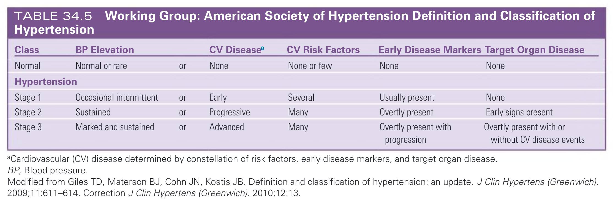

#### Table Data (CSV: [Table_34_5.csv](Table_34_5.csv))

```markdown
| Class | BP Elevation | CV Disease^a | CV Risk Factors | Early Disease Markers | Target Organ Disease |
| :--- | :--- | :--- | :--- | :--- | :--- |
| Normal | Normal or rare | None | None or few | None | None |
| Stage 1 | Occasional intermittent | Early | Several | Usually present | None |
| Stage 2 | Sustained | Progressive | Many | Overtly present | Early signs present |
| Stage 3 | Marked and sustained | Advanced | Many | Overtly present with progression | Overtly present with or without CV disease events |

^a Cardiovascular (CV) disease determined by constellation of risk factors, early disease markers, and target organ disease.

BP, Blood pressure.

Modified from Giles TD, Materson BJ, Cohn JN, Kostis JB. Definition and classification of hypertension: an update. J Clin Hypertens (Greenwich). 2009;11:611–614. Correction J Clin Hypertens (Greenwich). 2010;12:13.
```

TABLE 34.5 Working Group: American Society of Hypertension Definition and Classification of Hypertension

---

### Table_34_6

#### Table Image

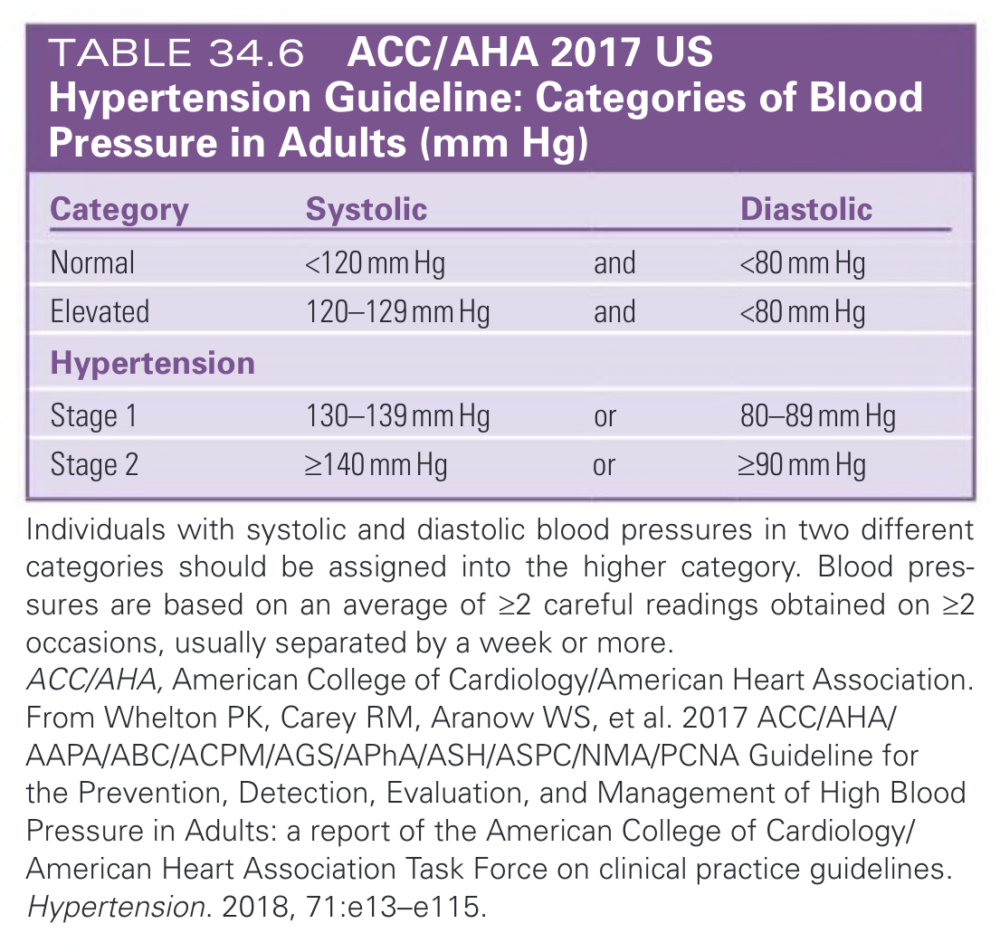

#### Table Data (CSV: [Table_34_6.csv](Table_34_6.csv))

```markdown
| Category | Systolic | | Diastolic |
| :--- | :--- | :--- | :--- |
| Normal | <120 mm Hg | and | <80 mm Hg |
| Elevated | 120-129 mm Hg | and | <80 mm Hg |
| **Hypertension** | | | |
| Stage 1 | 130-139 mm Hg | or | 80-89 mm Hg |
| Stage 2 | ≥140 mm Hg | or | ≥90 mm Hg |

Individuals with systolic and diastolic blood pressures in two different categories should be assigned into the higher category. Blood pressures are based on an average of ≥2 careful readings obtained on ≥2 occasions, usually separated by a week or more.
ACC/AHA, American College of Cardiology/American Heart Association.
From Whelton PK, Carey RM, Aranow WS, et al. 2017 ACC/AHA/ AAPA/ABC/ACPM/AGS/APhA/ASH/ASPC/NMA/PCNA Guideline for the Prevention, Detection, Evaluation, and Management of High Blood Pressure in Adults: a report of the American College of Cardiology/ American Heart Association Task Force on clinical practice guidelines. Hypertension. 2018, 71:e13-e115.
```

TABLE 34.6 ACC/AHA 2017 US Hypertension Guideline: Categories of Blood Pressure in Adults (mm Hg)

---

### Table_34_7

#### Table Image

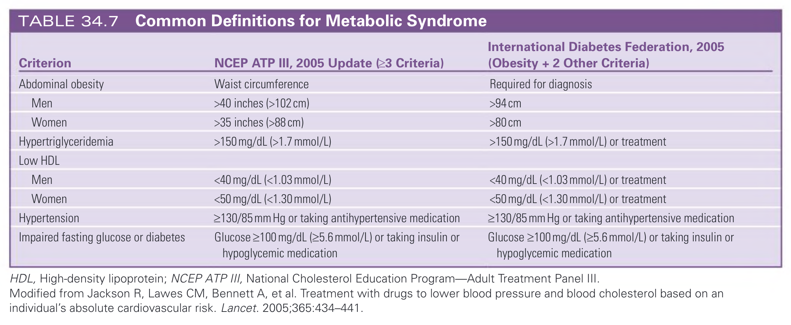

#### Table Data (CSV: [Table_34_7.csv](Table_34_7.csv))

```markdown
| Criterion | NCEP ATP III, 2005 Update (▷3 Criteria) | International Diabetes Federation, 2005 (Obesity + 2 Other Criteria) |
| :--- | :--- | :--- |
| Abdominal obesity | Waist circumference | Required for diagnosis |
| Men | >40 inches (>102 cm) | >94 cm |
| Women | >35 inches (>88 cm) | >80 cm |
| Hypertriglyceridemia | >150 mg/dL (>1.7 mmol/L) | >150 mg/dL (>1.7 mmol/L) or treatment |
| Low HDL | | |
| Men | <40 mg/dL (<1.03 mmol/L) | <40 mg/dL (<1.03 mmol/L) or treatment |
| Women | <50 mg/dL (<1.30 mmol/L) | <50 mg/dL (<1.30 mmol/L) or treatment |
| Hypertension | ≥130/85 mm Hg or taking antihypertensive medication | ≥130/85 mm Hg or taking antihypertensive medication |
| Impaired fasting glucose or diabetes | Glucose≥100 mg/dL (≥5.6 mmol/L) or taking insulin or hypoglycemic medication | Glucose ≥100 mg/dL (≥5.6 mmol/L) or taking insulin or hypoglycemic medication |

HDL, High-density lipoprotein; NCEP ATP III, National Cholesterol Education Program-Adult Treatment Panel III.
Modified from Jackson R, Lawes CM, Bennett A, et al. Treatment with drugs to lower blood pressure and blood cholesterol based on an individual's absolute cardiovascular risk. Lancet. 2005;365:434-441.
```

TABLE 34.7 Common Definitions for Metabolic Syndrome

---

### Table_34_8

#### Table Image

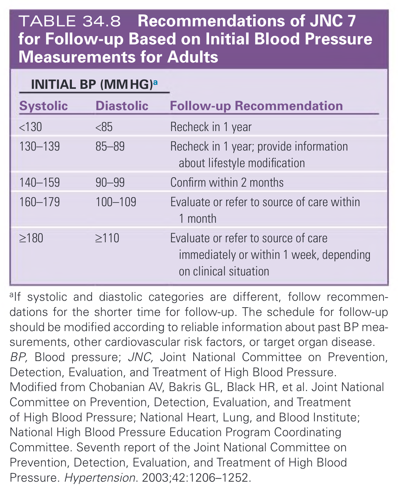

#### Table Data (CSV: [Table_34_8.csv](Table_34_8.csv))

```markdown
| INITIAL BP (MMHG)a | | Follow-up Recommendation |
| :--- | :--- | :--- |
| **Systolic** | **Diastolic** | |
| <130 | <85 | Recheck in 1 year |
| 130-139 | 85-89 | Recheck in 1 year; provide information about lifestyle modification |
| 140-159 | 90-99 | Confirm within 2 months |
| 160-179 | 100-109 | Evaluate or refer to source of care within 1 month |
| ≥180 | ≥110 | Evaluate or refer to source of care immediately or within 1 week, depending on clinical situation |

alf systolic and diastolic categories are different, follow recommendations for the shorter time for follow-up. The schedule for follow-up should be modified according to reliable information about past BP measurements, other cardiovascular risk factors, or target organ disease.
BP, Blood pressure; JNC, Joint National Committee on Prevention, Detection, Evaluation, and Treatment of High Blood Pressure.
Modified from Chobanian AV, Bakris GL, Black HR, et al. Joint National Committee on Prevention, Detection, Evaluation, and Treatment of High Blood Pressure; National Heart, Lung, and Blood Institute; National High Blood Pressure Education Program Coordinating Committee. Seventh report of the Joint National Committee on Prevention, Detection, Evaluation, and Treatment of High Blood Pressure. Hypertension. 2003;42:1206-1252.
```

TABLE 34.8 Recommendations of JNC 7 for Follow-up Based on Initial Blood Pressure Measurements for Adults

---

### Table_34_9

#### Table Image

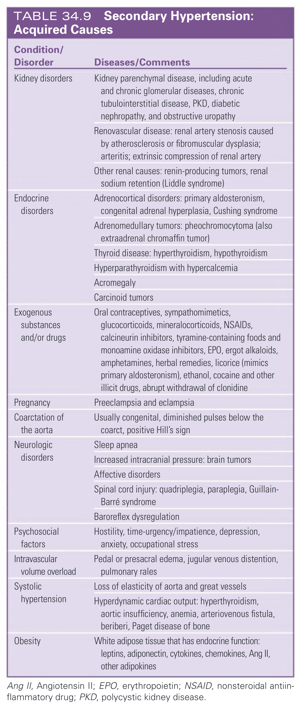

#### Table Data (CSV: [Table_34_9.csv](Table_34_9.csv))

```markdown
| Condition/ Disorder | Diseases/Comments |
| :--- | :--- |
| Kidney disorders | Kidney parenchymal disease, including acute and chronic glomerular diseases, chronic tubulointerstitial disease, PKD, diabetic nephropathy, and obstructive uropathy |
| | Renovascular disease: renal artery stenosis caused by atherosclerosis or fibromuscular dysplasia; arteritis; extrinsic compression of renal artery |
| | Other renal causes: renin-producing tumors, renal sodium retention (Liddle syndrome) |
| Endocrine disorders | Adrenocortical disorders: primary aldosteronism, congenital adrenal hyperplasia, Cushing syndrome |
| | Adrenomedullary tumors: pheochromocytoma (also extraadrenal chromaffin tumor) |
| | Thyroid disease: hyperthyroidism, hypothyroidism |
| | Hyperparathyroidism with hypercalcemia |
| | Acromegaly |
| | Carcinoid tumors |
| Exogenous substances and/or drugs | Oral contraceptives, sympathomimetics, glucocorticoids, mineralocorticoids, NSAIDs, calcineurin inhibitors, tyramine-containing foods and monoamine oxidase inhibitors, EPO, ergot alkaloids, amphetamines, herbal remedies, licorice (mimics primary aldosteronism), ethanol, cocaine and other illicit drugs, abrupt withdrawal of clonidine |
| Pregnancy | Preeclampsia and eclampsia |
| Coarctation of the aorta | Usually congenital, diminished pulses below the coarct, positive Hill's sign |
| Neurologic disorders | Sleep apnea |
| | Increased intracranial pressure: brain tumors |
| | Affective disorders |
| | Spinal cord injury: quadriplegia, paraplegia, Guillain-Barré syndrome |
| | Baroreflex dysregulation |
| Psychosocial factors | Hostility, time-urgency/impatience, depression, anxiety, occupational stress |
| Intravascular volume overload | Pedal or presacral edema, jugular venous distention, pulmonary rales |
| Systolic hypertension | Loss of elasticity of aorta and great vessels |
| | Hyperdynamic cardiac output: hyperthyroidism, aortic insufficiency, anemia, arteriovenous fistula, beriberi, Paget disease of bone |
| Obesity | White adipose tissue that has endocrine function: leptins, adiponectin, cytokines, chemokines, Ang II, other adipokines |

Ang II, Angiotensin II; EPO, erythropoietin; NSAID, nonsteroidal antiin- flammatory drug; PKD, polycystic kidney disease.
```

TABLE 34.9 Secondary Hypertension: Acquired Causes

---

### Table_34_10

#### Table Image

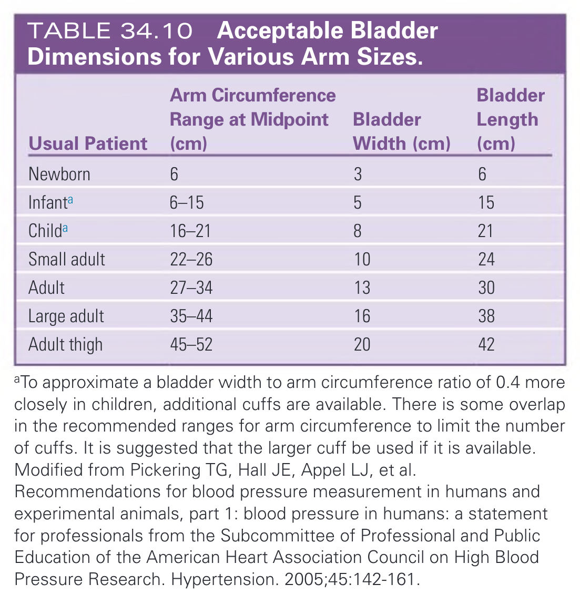

#### Table Data (CSV: [Table_34_10.csv](Table_34_10.csv))

```markdown
| Usual Patient | Arm Circumference Range at Midpoint (cm) | Bladder Width (cm) | Bladder Length (cm) |
| :--- | :--- | :--- | :--- |
| Newborn | 6 | 3 | 6 |
| Infanta | 6-15 | 5 | 15 |
| Childa | 16-21 | 8 | 21 |
| Small adult | 22-26 | 10 | 24 |
| Adult | 27-34 | 13 | 30 |
| Large adult | 35-44 | 16 | 38 |
| Adult thigh | 45-52 | 20 | 42 |

aTo approximate a bladder width to arm circumference ratio of 0.4 more closely in children, additional cuffs are available. There is some overlap in the recommended ranges for arm circumference to limit the number of cuffs. It is suggested that the larger cuff be used if it is available.
Modified from Pickering TG, Hall JE, Appel LJ, et al.
Recommendations for blood pressure measurement in humans and experimental animals, part 1: blood pressure in humans: a statement for professionals from the Subcommittee of Professional and Public Education of the American Heart Association Council on High Blood Pressure Research. Hypertension. 2005;45:142-161.
```

TABLE 34.10 Acceptable Bladder Dimensions for Various Arm Sizes.

---

### Table_34_11

#### Table Image

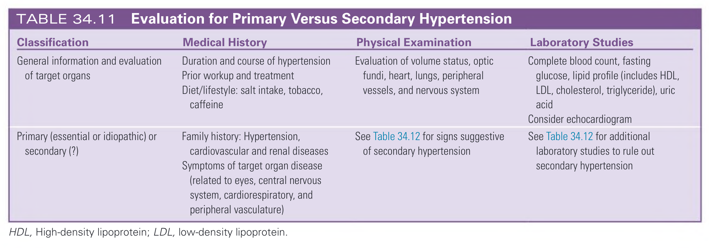

#### Table Data (CSV: [Table_34_11.csv](Table_34_11.csv))

```markdown
| Classification | Medical History | Physical Examination | Laboratory Studies |
| :--- | :--- | :--- | :--- |
| General information and evaluation of target organs | Duration and course of hypertension Prior workup and treatment Diet/lifestyle: salt intake, tobacco, caffeine | Evaluation of volume status, optic fundi, heart, lungs, peripheral vessels, and nervous system | Complete blood count, fasting glucose, lipid profile (includes HDL, LDL, cholesterol, triglyceride), uric acid Consider echocardiogram |
| Primary (essential or idiopathic) or secondary (?) | Family history: Hypertension, cardiovascular and renal diseases Symptoms of target organ disease (related to eyes, central nervous system, cardiorespiratory, and peripheral vasculature) | See Table 34.12 for signs suggestive of secondary hypertension | See Table 34.12 for additional laboratory studies to rule out secondary hypertension |

HDL, High-density lipoprotein; LDL, low-density lipoprotein.
```

TABLE 34.11 Evaluation for Primary Versus Secondary Hypertension

---

### Table_34_12

#### Table Image

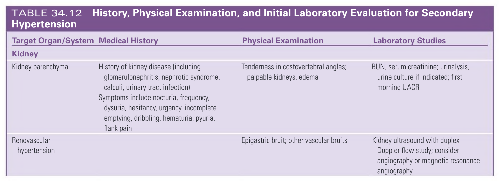

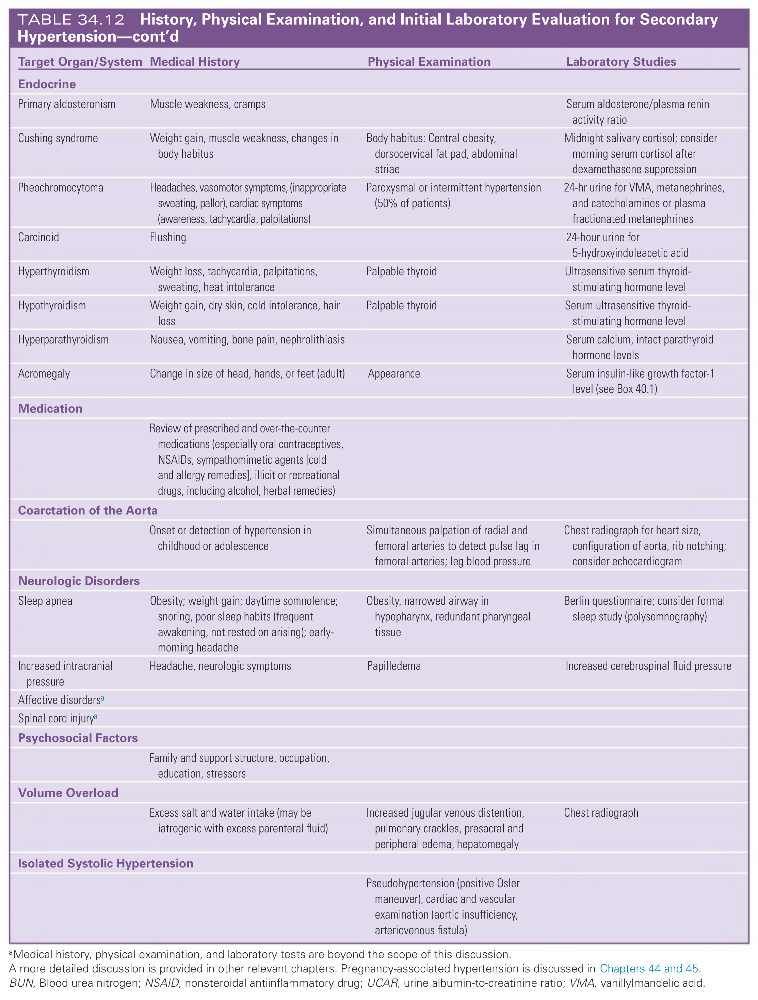

#### Table Data (CSV: [Table_34_12.csv](Table_34_12.csv))

```markdown
| Target Organ/System | Medical History | Physical Examination | Laboratory Studies |
| :--- | :--- | :--- | :--- |
| **Kidney** | | | |
| Kidney parenchymal | History of kidney disease (including glomerulonephritis, nephrotic syndrome, calculi, urinary tract infection) Symptoms include nocturia, frequency, dysuria, hesitancy, urgency, incomplete emptying, dribbling, hematuria, pyuria, flank pain | Tenderness in costovertebral angles; palpable kidneys, edema | BUN, serum creatinine; urinalysis, urine culture if indicated; first morning UACR |
| Renovascular hypertension | | Epigastric bruit; other vascular bruits | Kidney ultrasound with duplex Doppler flow study; consider angiography or magnetic resonance angiography |
| **Endocrine** | | | |
| Primary aldosteronism | Muscle weakness, cramps | | Serum aldosterone/plasma renin activity ratio |
| Cushing syndrome | Weight gain, muscle weakness, changes in body habitus | Body habitus: Central obesity, dorsocervical fat pad, abdominal striae | Midnight salivary cortisol; consider morning serum cortisol after dexamethasone suppression |
| Pheochromocytoma | Headaches, vasomotor symptoms, (inappropriate sweating, pallor), cardiac symptoms (awareness, tachycardia, palpitations) | Paroxysmal or intermittent hypertension (50% of patients) | 24-hr urine for VMA, metanephrines, and catecholamines or plasma fractionated metanephrines |
| Carcinoid | Flushing | | 24-hour urine for 5-hydroxyindoleacetic acid |
| Hyperthyroidism | Weight loss, tachycardia, palpitations, sweating, heat intolerance | Palpable thyroid | Ultrasensitive serum thyroid-stimulating hormone level |
| Hypothyroidism | Weight gain, dry skin, cold intolerance, hair loss | Palpable thyroid | Serum ultrasensitive thyroid-stimulating hormone level |
| Hyperparathyroidism | Nausea, vomiting, bone pain, nephrolithiasis | | Serum calcium, intact parathyroid hormone levels |
| Acromegaly | Change in size of head, hands, or feet (adult) | Appearance | Serum insulin-like growth factor-1 level (see Box 40.1) |
| **Medication** | | | |
| | Review of prescribed and over-the-counter medications (especially oral contraceptives, NSAIDs, sympathomimetic agents [cold and allergy remedies], illicit or recreational drugs, including alcohol, herbal remedies) | | |
| **Coarctation of the Aorta** | | | |
| | Onset or detection of hypertension in childhood or adolescence | Simultaneous palpation of radial and femoral arteries to detect pulse lag in femoral arteries; leg blood pressure | Chest radiograph for heart size, configuration of aorta, rib notching; consider echocardiogram |
| **Neurologic Disorders** | | | |
| Sleep apnea | Obesity; weight gain; daytime somnolence; snoring, poor sleep habits (frequent awakening, not rested on arising); early-morning headache | Obesity, narrowed airway in hypopharynx, redundant pharyngeal tissue | Berlin questionnaire; consider formal sleep study (polysomnography) |
| Increased intracranial pressure | Headache, neurologic symptoms | Papilledema | Increased cerebrospinal fluid pressure |
| Affective disordersa | | | |
| Spinal cord injurya | | | |
| **Psychosocial Factors** | | | |
| | Family and support structure, occupation, education, stressors | | |
| **Volume Overload** | | | |
| | Excess salt and water intake (may be iatrogenic with excess parenteral fluid) | Increased jugular venous distention, pulmonary crackles, presacral and peripheral edema, hepatomegaly | Chest radiograph |
| **Isolated Systolic Hypertension** | | | |
| | | Pseudohypertension (positive Osler maneuver), cardiac and vascular examination (aortic insufficiency, arteriovenous fistula) | |

aMedical history, physical examination, and laboratory tests are beyond the scope of this discussion.
A more detailed discussion is provided in other relevant chapters. Pregnancy-associated hypertension is discussed in Chapters 44 and 45.
BUN, Blood urea nitrogen; NSAID, nonsteroidal antiinflammatory drug; UCAR, urine albumin-to-creatinine ratio; VMA, vanillylmandelic acid.
```

TABLE 34.12 History, Physical Examination, and Initial Laboratory Evaluation for Secondary Hypertension

---

## Boxes

### Box_34_1

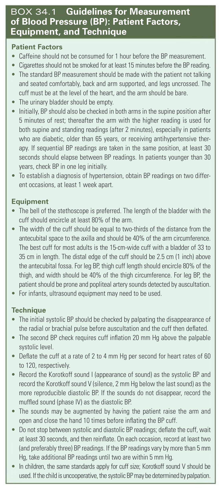

#### Box Text

```markdown
**Patient Factors**
* Caffeine should not be consumed for 1 hour before the BP measurement.
* Cigarettes should not be smoked for at least 15 minutes before the BP reading.
* The standard BP measurement should be made with the patient not talking and seated comfortably, back and arm supported, and legs uncrossed. The cuff must be at the level of the heart, and the arm should be bare.
* The urinary bladder should be empty.
* Initially, BP should also be checked in both arms in the supine position after 5 minutes of rest; thereafter the arm with the higher reading is used for both supine and standing readings (after 2 minutes), especially in patients who are diabetic, older than 65 years, or receiving antihypertensive ther- apy. If sequential BP readings are taken in the same position, at least 30 seconds should elapse between BP readings. In patients younger than 30 years, check BP in one leg initially.
* To establish a diagnosis of hypertension, obtain BP readings on two differ- ent occasions, at least 1 week apart.

**Equipment**
* The bell of the stethoscope is preferred. The length of the bladder with the cuff should encircle at least 80% of the arm.
* The width of the cuff should be equal to two-thirds of the distance from the antecubital space to the axilla and should be 40% of the arm circumference. The best cuff for most adults is the 15-cm-wide cuff with a bladder of 33 to 35 cm in length. The distal edge of the cuff should be 2.5 cm (1 inch) above the antecubital fossa. For leg BP, thigh cuff length should encircle 80% of the thigh, and width should be 40% of the thigh circumference. For leg BP, the patient should be prone and popliteal artery sounds detected by auscultation.
* For infants, ultrasound equipment may need to be used.

**Technique**
* The initial systolic BP should be checked by palpating the disappearance of the radial or brachial pulse before auscultation and the cuff then deflated.
* The second BP check requires cuff inflation 20 mm Hg above the palpable systolic level.
* Deflate the cuff at a rate of 2 to 4 mm Hg per second for heart rates of 60 to 120, respectively.
* Record the Korotkoff sound I (appearance of sound) as the systolic BP and record the Korotkoff sound V (silence, 2 mm Hg below the last sound) as the more reproducible diastolic BP. If the sounds do not disappear, record the muffled sound (phase IV) as the diastolic BP.
* The sounds may be augmented by having the patient raise the arm and open and close the hand 10 times before inflating the BP cuff.
* Do not stop between systolic and diastolic BP readings; deflate the cuff, wait at least 30 seconds, and then reinflate. On each occasion, record at least two (and preferably three) BP readings. If the BP readings vary by more than 5 mm Hg, take additional BP readings until two are within 5 mm Hg.
* In children, the same standards apply for cuff size; Korotkoff sound V should be used. If the child is uncooperative, the systolic BP may be determined by palpation.
```

BOX 34.1 Guidelines for Measurement of Blood Pressure (BP): Patient Factors, Equipment, and Technique

---

### Box_34_2

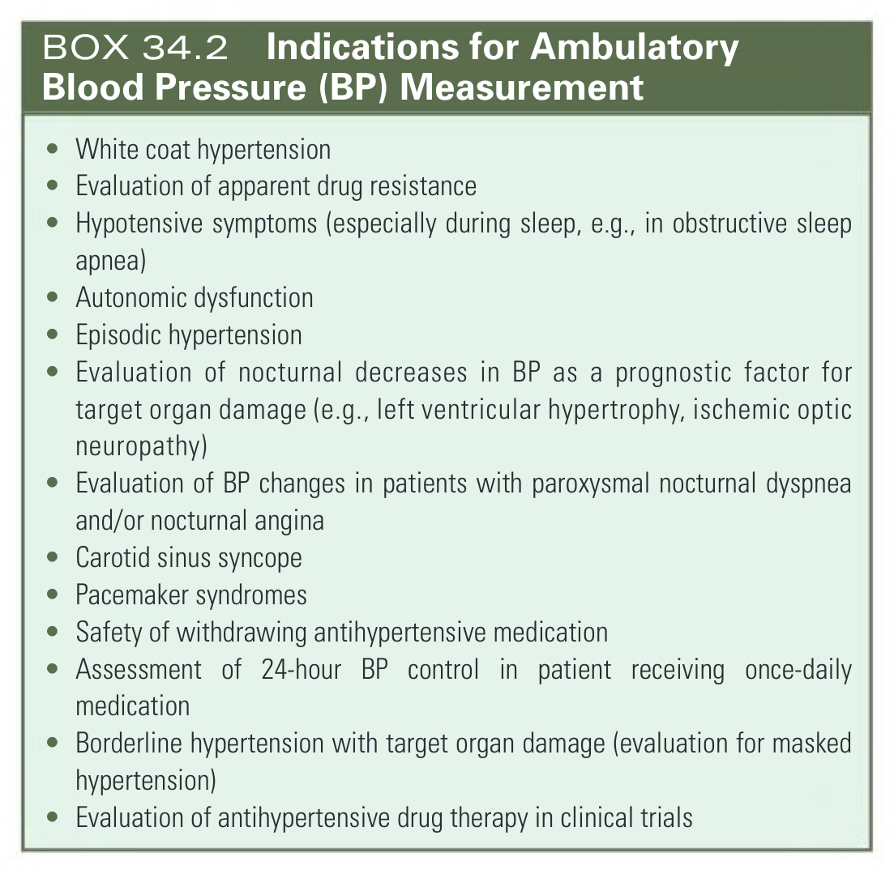

#### Box Text

```markdown
* White coat hypertension
* Evaluation of apparent drug resistance
* Hypotensive symptoms (especially during sleep, e.g., in obstructive sleep apnea)
* Autonomic dysfunction
* Episodic hypertension
* Evaluation of nocturnal decreases in BP as a prognostic factor for target organ damage (e.g., left ventricular hypertrophy, ischemic optic neuropathy)
* Evaluation of BP changes in patients with paroxysmal nocturnal dyspnea and/or nocturnal angina
* Carotid sinus syncope
* Pacemaker syndromes
* Safety of withdrawing antihypertensive medication
* Assessment of 24-hour BP control in patient receiving once-daily medication
* Borderline hypertension with target organ damage (evaluation for masked hypertension)
* Evaluation of antihypertensive drug therapy in clinical trials
```

BOX 34.2 Indications for Ambulatory Blood Pressure (BP) Measurement

---
