# 035. Primary Hypertension - Figures and Tables Index

This document lists all figures, tables and boxes extracted from `035. Primary Hypertension.pdf`.

## Table of Contents
- [Figures](#figures)
- [Tables](#tables)
- [Boxes](#boxes)

---

## Figures

### Fig_35_1

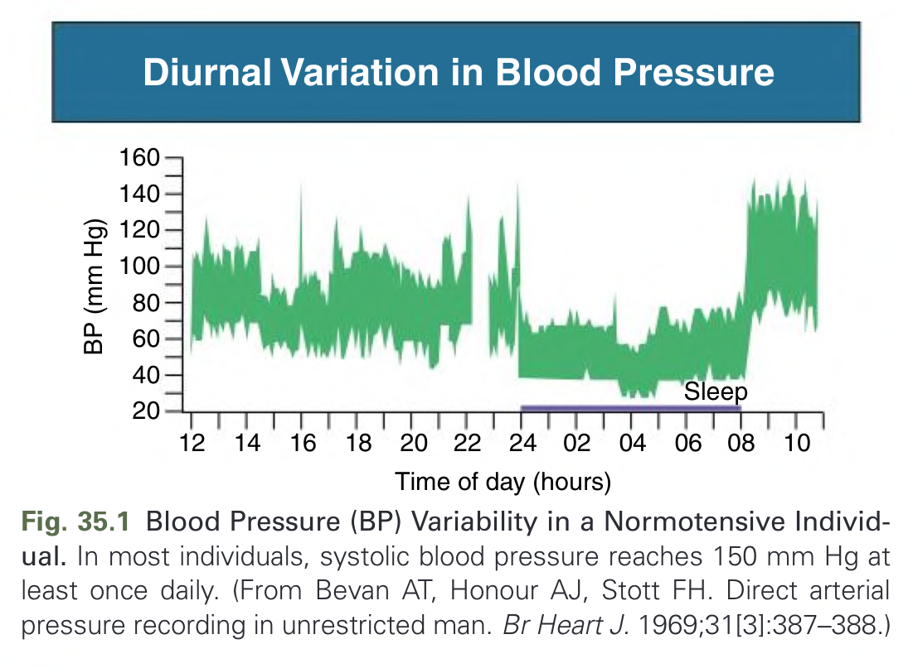

Fig. 35.1 Blood Pressure (BP) Variability in a Normotensive Individual. In most individuals, systolic blood pressure reaches 150 mm Hg at least once daily. (From Bevan AT, Honour AJ, Stott FH. Direct arterial pressure recording in unrestricted man. Br Heart J. 1969;31[3]:387–388.)

---

### Fig_35_2

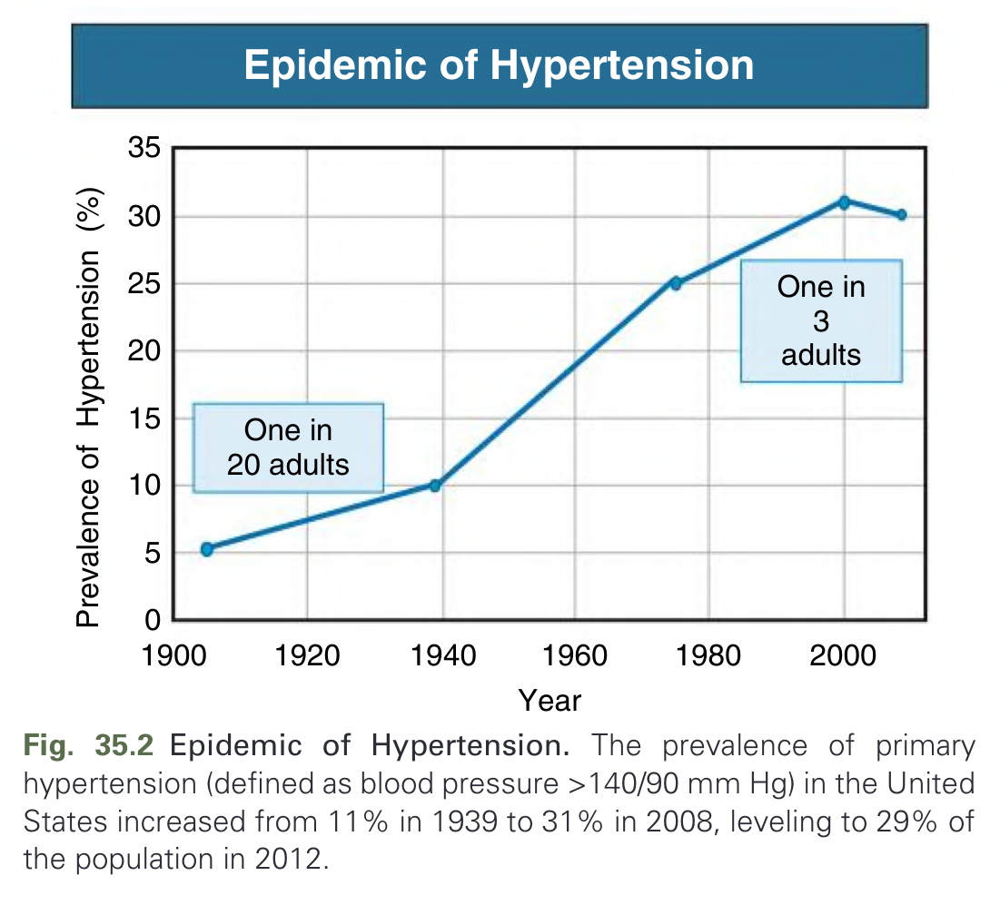

Fig. 35.2 Epidemic of Hypertension. The prevalence of primary hypertension (defined as blood pressure >140/90 mm Hg) in the United States increased from 11% in 1939 to 31% in 2008, leveling to 29% of the population in 2012.

---

### Fig_35_3

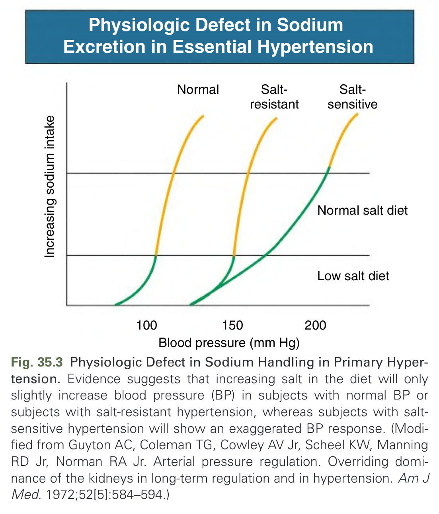

Fig. 35.3 Physiologic Defect in Sodium Handling in Primary Hypertension. Evidence suggests that increasing salt in the diet will only slightly increase blood pressure (BP) in subjects with normal BP or subjects with salt-resistant hypertension, whereas subjects with salt-sensitive hypertension will show an exaggerated BP response. (Modified from Guyton AC, Coleman TG, Cowley AV Jr, Scheel KW, Manning RD Jr, Norman RA Jr. Arterial pressure regulation. Overriding dominance of the kidneys in long-term regulation and in hypertension. Am J Med. 1972;52[5]:584–594.)

---

### Fig_35_4

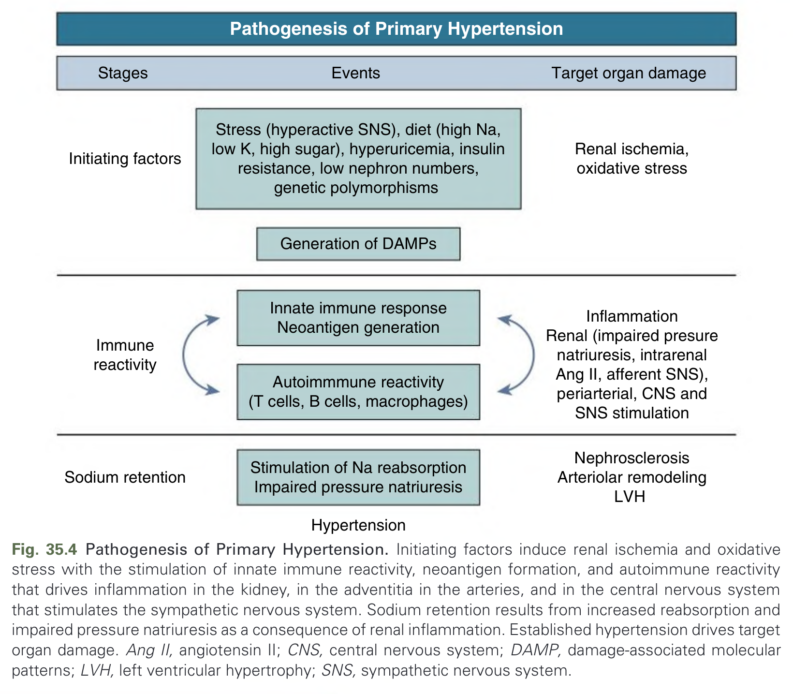

Fig. 35.4 Pathogenesis of Primary Hypertension. Initiating factors induce renal ischemia and oxidative stress with the stimulation of innate immune reactivity, neoantigen formation, and autoimmune reactivity that drives inflammation in the kidney, in the adventitia in the arteries, and in the central nervous system that stimulates the sympathetic nervous system. Sodium retention results from increased reabsorption and impaired pressure natriuresis as a consequence of renal inflammation. Established hypertension drives target organ damage. Ang II, angiotensin II; CNS, central nervous system; DAMP, damage-associated molecular patterns; LVH, left ventricular hypertrophy; SNS, sympathetic nervous system.

---

### Fig_35_5

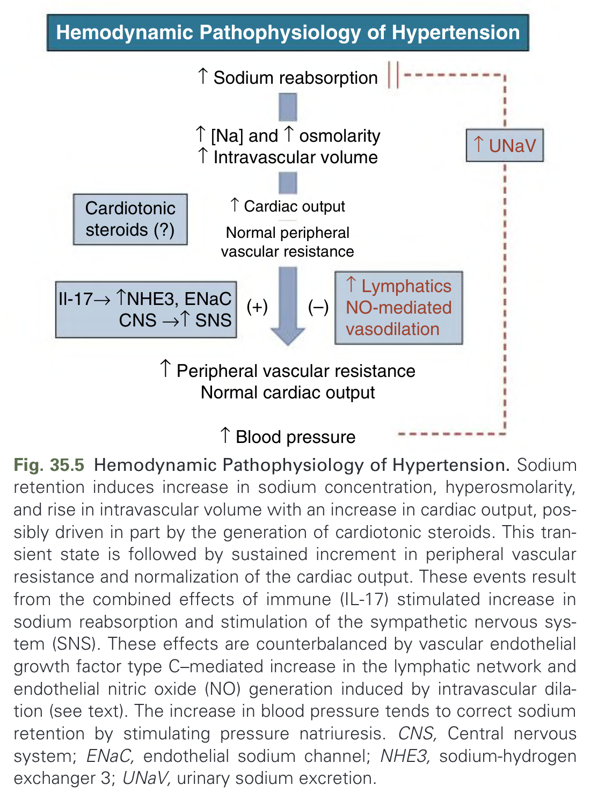

Fig. 35.5 Hemodynamic Pathophysiology of Hypertension. Sodium retention induces increase in sodium concentration, hyperosmolarity, and rise in intravascular volume with an increase in cardiac output, possibly driven in part by the generation of cardiotonic steroids. This transient state is followed by sustained increment in peripheral vascular resistance and normalization of the cardiac output. These events result from the combined effects of immune (IL-17) stimulated increase in sodium reabsorption and stimulation of the sympathetic nervous system (SNS). These effects are counterbalanced by vascular endothelial growth factor type C–mediated increase in the lymphatic network and endothelial nitric oxide (NO) generation induced by intravascular dilation (see text). The increase in blood pressure tends to correct sodium retention by stimulating pressure natriuresis. CNS, Central nervous system; ENaC, endothelial sodium channel; NHE3, sodium-hydrogen exchanger 3; UNaV, urinary sodium excretion.

---

### Fig_35_6

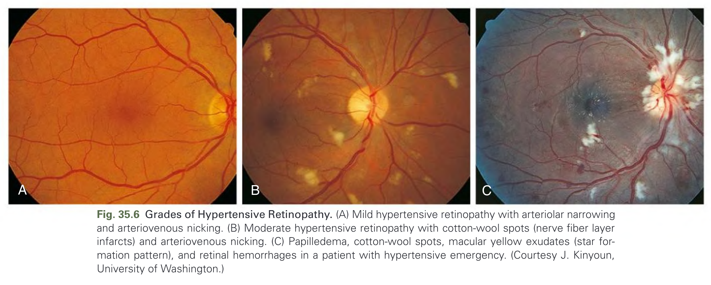

Fig. 35.6 Grades of Hypertensive Retinopathy. (A) Mild hypertensive retinopathy with arteriolar narrowing and arteriovenous nicking. (B) Moderate hypertensive retinopathy with cotton-wool spots (nerve fiber layer infarcts) and arteriovenous nicking. (C) Papilledema, cotton-wool spots, macular yellow exudates (star formation pattern), and retinal hemorrhages in a patient with hypertensive emergency. (Courtesy J. Kinyoun, University of Washington.)

---

### Fig_35_7

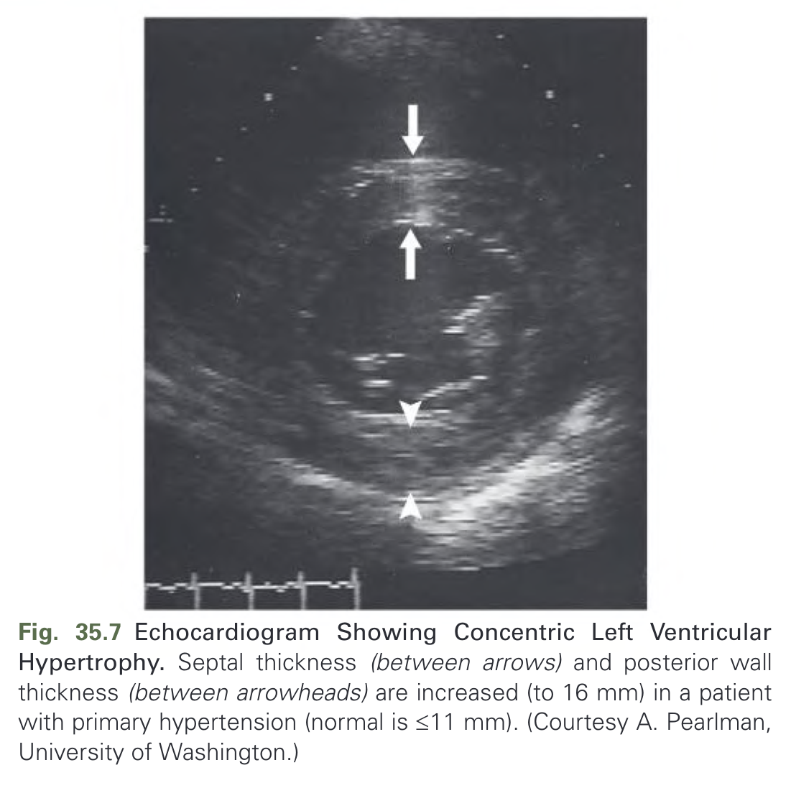

Fig. 35.7 Echocardiogram Showing Concentric Left Ventricular Hypertrophy. Septal thickness (between arrows) and posterior wall thickness (between arrowheads) are increased (to 16 mm) in a patient with primary hypertension (normal is ≤11 mm). (Courtesy A. Pearlman, University of Washington.)

---

### Fig_35_8

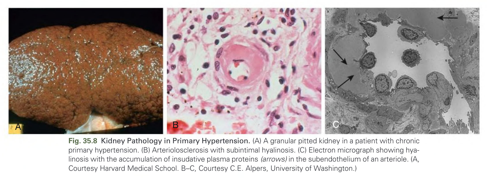

Fig. 35.8 Kidney Pathology in Primary Hypertension. (A) A granular pitted kidney in a patient with chronic primary hypertension. (B) Arteriolosclerosis with subintimal hyalinosis. (C) Electron micrograph showing hyalinosis with the accumulation of insudative plasma proteins (arrows) in the subendothelium of an arteriole. (A, Courtesy Harvard Medical School. B–C, Courtesy C.E. Alpers, University of Washington.)

---

### Fig_35_9

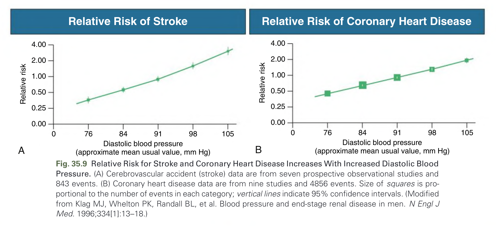

Fig. 35.9 Relative Risk for Stroke and Coronary Heart Disease Increases With Increased Diastolic Blood Pressure. (A) Cerebrovascular accident (stroke) data are from seven prospective observational studies and 843 events. (B) Coronary heart disease data are from nine studies and 4856 events. Size of squares is proportional to the number of events in each category; vertical lines indicate 95% confidence intervals. (Modified from Klag MJ, Whelton PK, Randall BL, et al. Blood pressure and end-stage renal disease in men. N Engl J Med. 1996;334[1]:13–18.)

---

### Fig_35_10

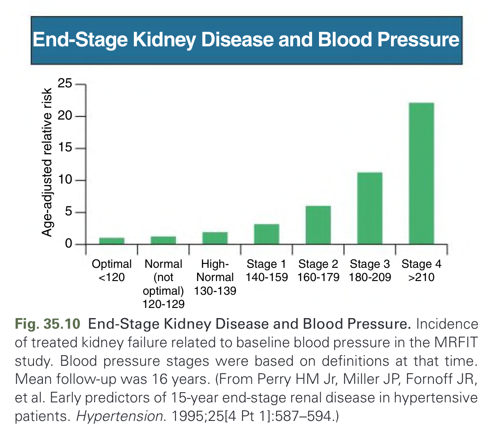

Fig. 35.10 End-Stage Kidney Disease and Blood Pressure. Incidence of treated kidney failure related to baseline blood pressure in the MRFIT study. Blood pressure stages were based on definitions at that time. Mean follow-up was 16 years. (From Perry HM Jr, Miller JP, Fornoff JR, et al. Early predictors of 15-year end-stage renal disease in hypertensive patients. Hypertension. 1995;25[4 Pt 1]:587–594.)

---

### Fig_35_11

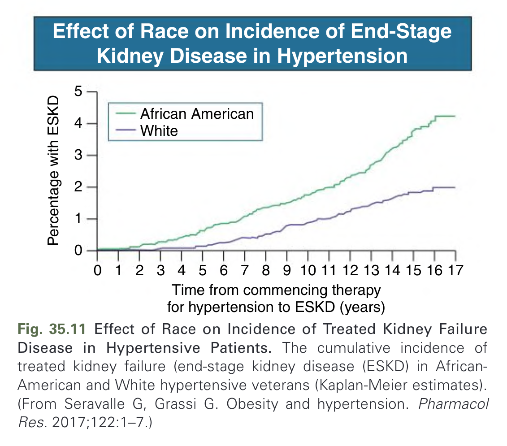

Fig. 35.11 Effect of Race on Incidence of Treated Kidney Failure Disease in Hypertensive Patients. The cumulative incidence of treated kidney failure (end-stage kidney disease (ESKD) in African-American and White hypertensive veterans (Kaplan-Meier estimates). (From Seravalle G, Grassi G. Obesity and hypertension. Pharmacol Res. 2017;122:1–7.)

---

### Fig_35_12

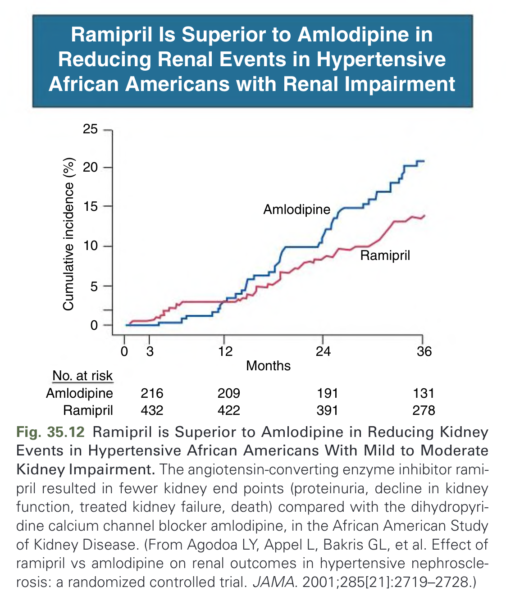

Fig. 35.12 Ramipril is Superior to Amlodipine in Reducing Kidney Events in Hypertensive African Americans With Mild to Moderate Kidney Impairment. The angiotensin-converting enzyme inhibitor ramipril resulted in fewer kidney end points (proteinuria, decline in kidney function, treated kidney failure, death) compared with the dihydropyridine calcium channel blocker amlodipine, in the African American Study of Kidney Disease. (From Agodoa LY, Appel L, Bakris GL, et al. Effect of ramipril vs amlodipine on renal outcomes in hypertensive nephrosclerosis: a randomized controlled trial. JAMA. 2001;285[21]:2719–2728.)

---

## Tables

### Table_35_1

#### Table Image

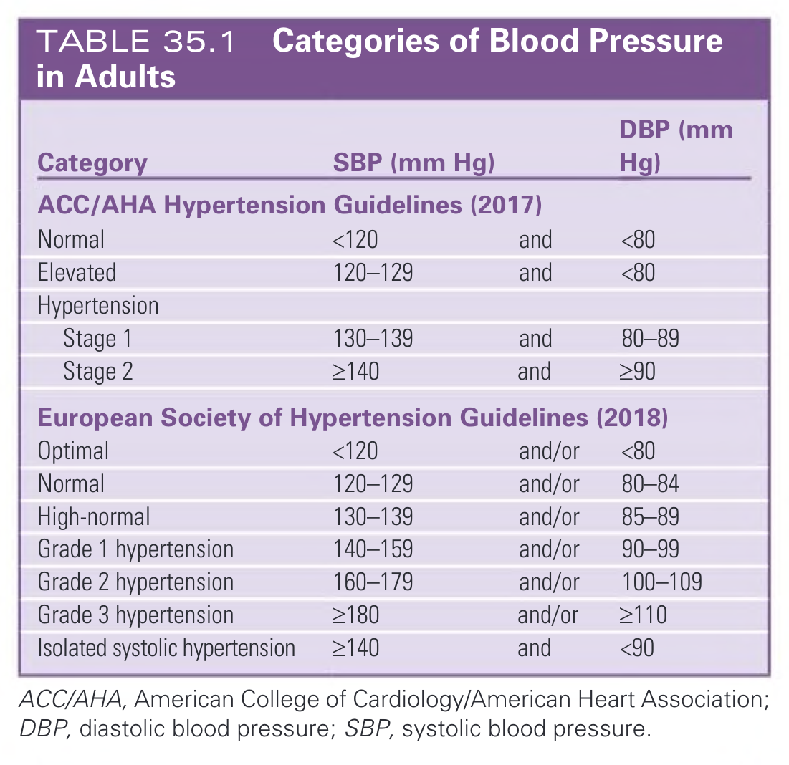

#### Table Data (CSV: [Table_35_1.csv](Table_35_1.csv))

```markdown
| Category | SBP (mm Hg) | | DBP (mm Hg) |
| :--- | :--- | :--- | :--- |
| **ACC/AHA Hypertension Guidelines (2017)** | | | |
| Normal | <120 | and | <80 |
| Elevated | 120-129 | and | <80 |
| **Hypertension** | | | |
| Stage 1 | 130-139 | and | 80-89 |
| Stage 2 | ≥140 | and | ≥90 |
| **European Society of Hypertension Guidelines (2018)** | | | |
| Optimal | <120 | and/or | <80 |
| Normal | 120-129 | and/or | 80-84 |
| High-normal | 130-139 | and/or | 85-89 |
| Grade 1 hypertension | 140-159 | and/or | 90-99 |
| Grade 2 hypertension | 160-179 | and/or | 100-109 |
| Grade 3 hypertension | ≥180 | and/or | ≥110 |
| Isolated systolic hypertension | ≥140 | and | <90 |

ACC/AHA, American College of Cardiology/American Heart Association; DBP, diastolic blood pressure; SBP, systolic blood pressure.
```

TABLE 35.1 Categories of Blood Pressure in Adults

---

### Table_35_2

#### Table Image

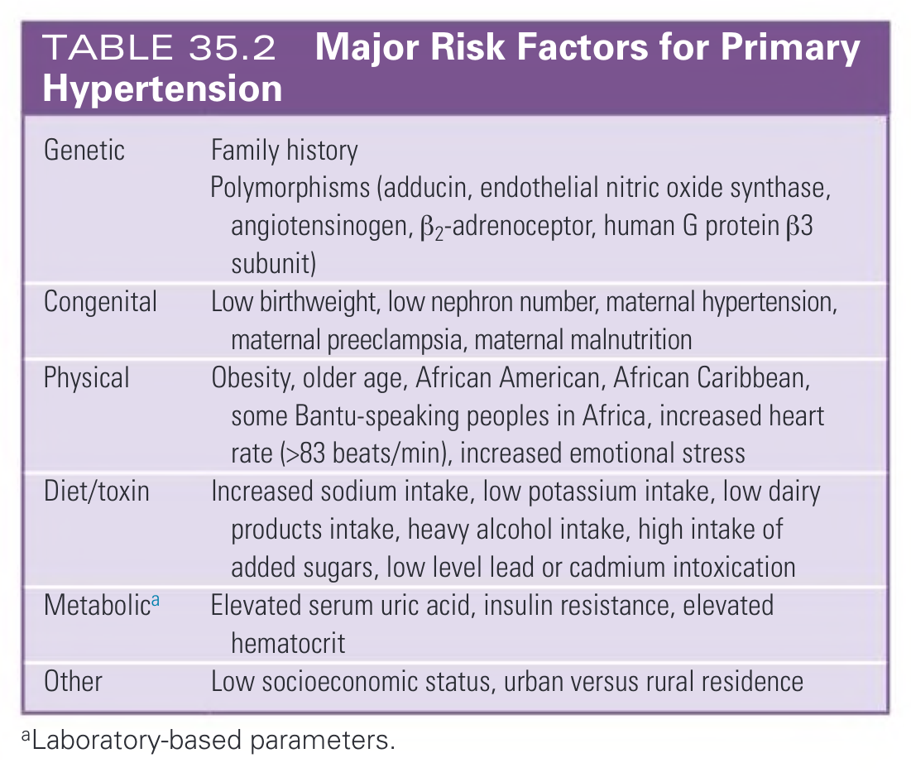

#### Table Data (CSV: [Table_35_2.csv](Table_35_2.csv))

```markdown
| | |
| :--- | :--- |
| **Genetic** | Family history Polymorphisms (adducin, endothelial nitric oxide synthase, angiotensinogen, β2-adrenoceptor, human G protein β3 subunit) |
| **Congenital** | Low birthweight, low nephron number, maternal hypertension, maternal preeclampsia, maternal malnutrition |
| **Physical** | Obesity, older age, African American, African Caribbean, some Bantu-speaking peoples in Africa, increased heart rate (>83 beats/min), increased emotional stress |
| **Diet/toxin** | Increased sodium intake, low potassium intake, low dairy products intake, heavy alcohol intake, high intake of added sugars, low level lead or cadmium intoxication |
| **Metabolica** | Elevated serum uric acid, insulin resistance, elevated hematocrit |
| **Other** | Low socioeconomic status, urban versus rural residence |

aLaboratory-based parameters.
```

TABLE 35.2 Major Risk Factors for Primary Hypertension

---

### Table_35_3

#### Table Image

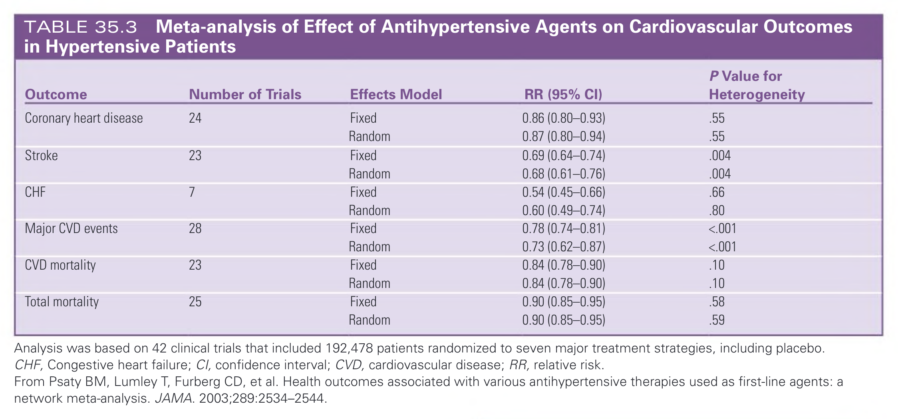

#### Table Data (CSV: [Table_35_3.csv](Table_35_3.csv))

```markdown
| Outcome | Number of Trials | Effects Model | RR (95% CI) | P Value for Heterogeneity |
| :--- | :--- | :--- | :--- | :--- |
| Coronary heart disease | 24 | Fixed | 0.86 (0.80-0.93) | .55 |
| | | Random | 0.87 (0.80-0.94) | .55 |
| Stroke | 23 | Fixed | 0.69 (0.64-0.74) | .004 |
| | | Random | 0.68 (0.61-0.76) | .004 |
| CHF | 7 | Fixed | 0.54 (0.45-0.66) | .66 |
| | | Random | 0.60 (0.49-0.74) | .80 |
| Major CVD events | 28 | Fixed | 0.78 (0.74-0.81) | <.001 |
| | | Random | 0.73 (0.62-0.87) | <.001 |
| CVD mortality | 23 | Fixed | 0.84 (0.78-0.90) | .10 |
| | | Random | 0.84 (0.78-0.90) | .10 |
| Total mortality | 25 | Fixed | 0.90 (0.85-0.95) | .58 |
| | | Random | 0.90 (0.85-0.95) | .59 |

Analysis was based on 42 clinical trials that included 192,478 patients randomized to seven major treatment strategies, including placebo. CHF, Congestive heart failure; CI, confidence interval; CVD, cardiovascular disease; RR, relative risk. From Psaty BM, Lumley T, Furberg CD, et al. Health outcomes associated with various antihypertensive therapies used as first-line agents: a network meta-analysis. JAMA. 2003;289:2534-2544.
```

TABLE 35.3 Meta-analysis of Effect of Antihypertensive Agents on Cardiovascular Outcomes in Hypertensive Patients

---

## Boxes

*No boxes resolved for this chapter.*
