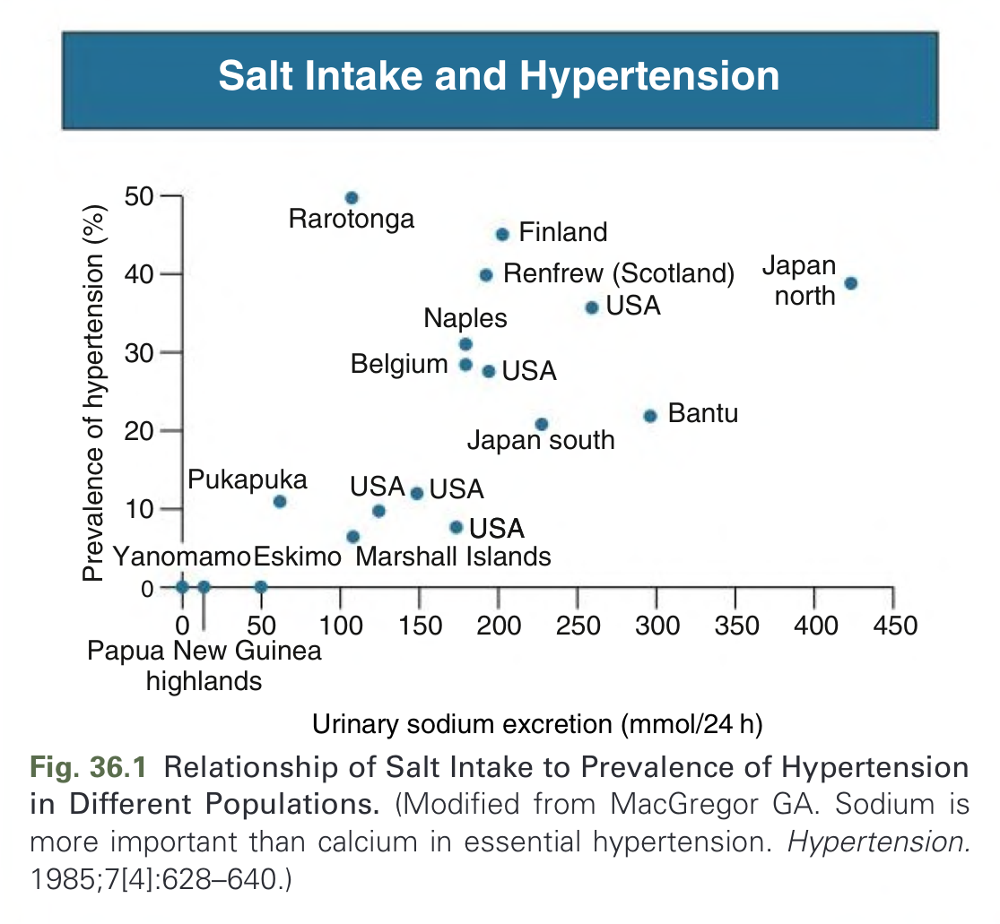
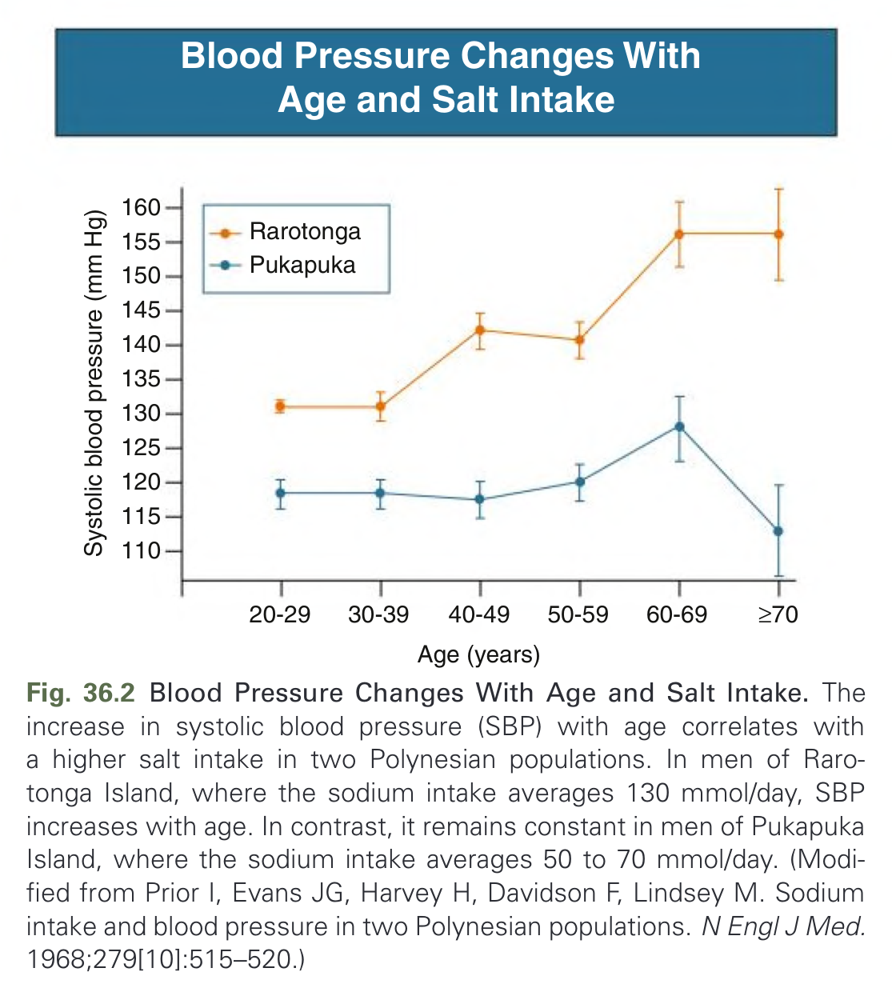
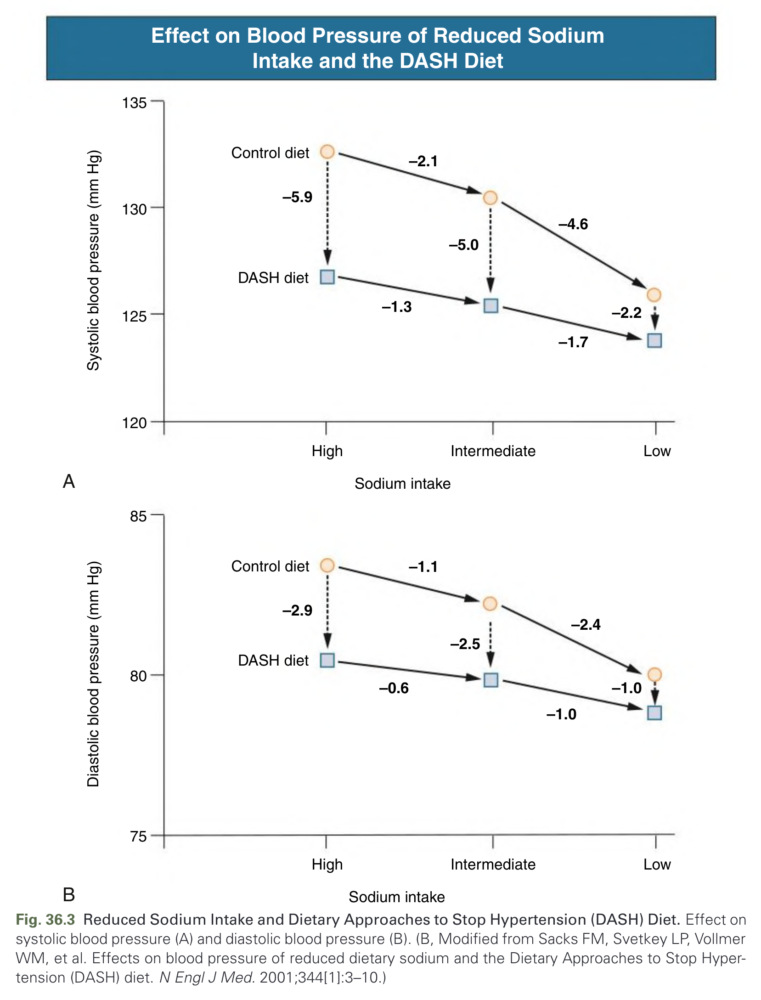
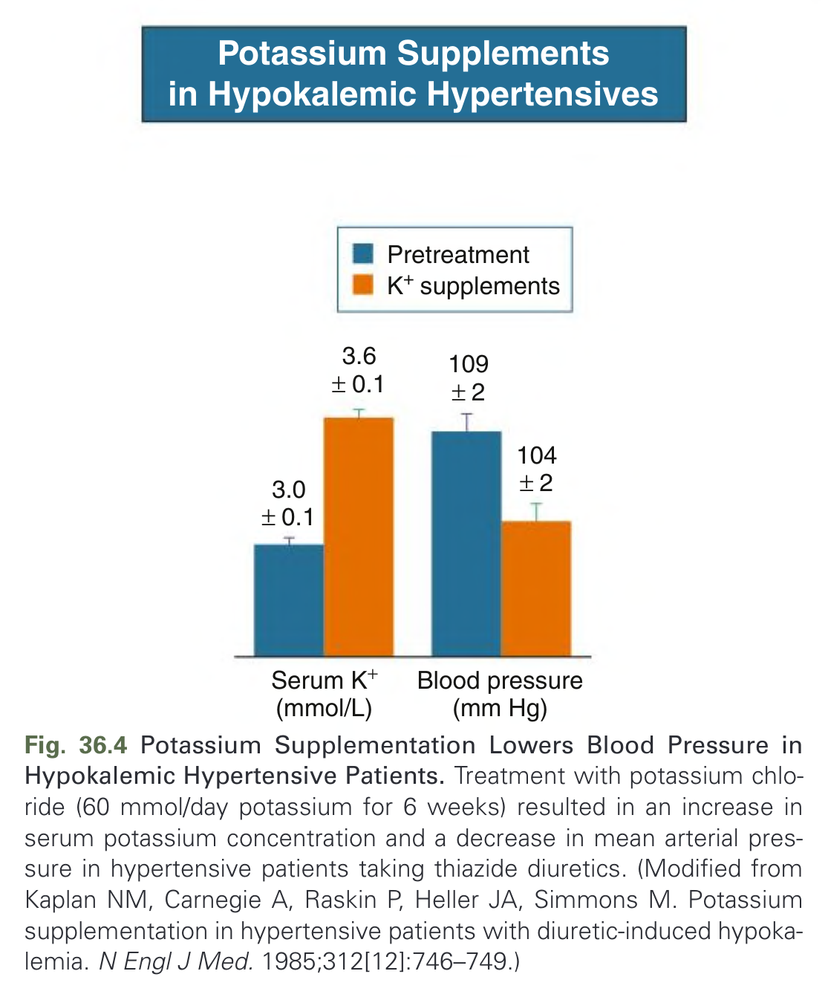
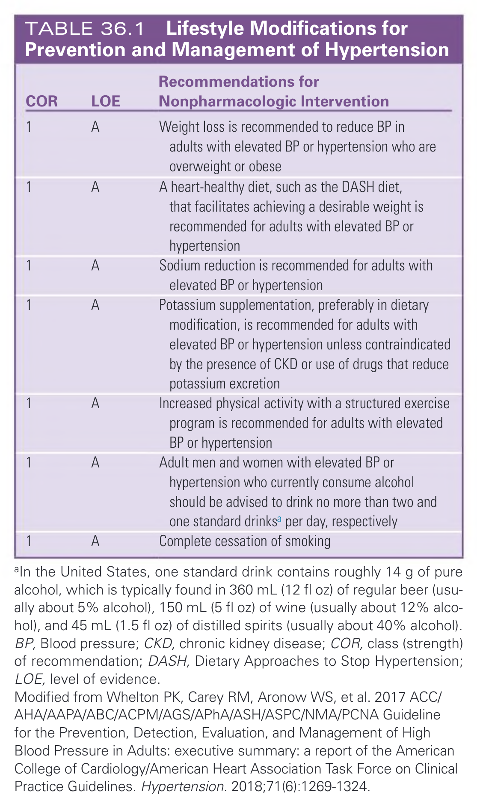
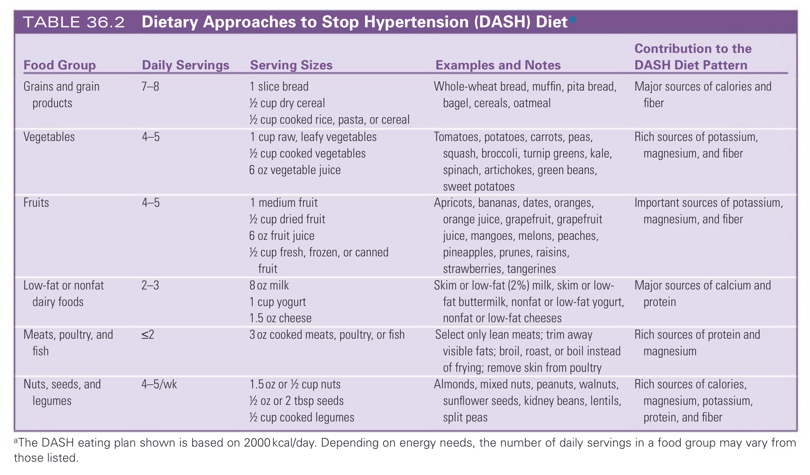
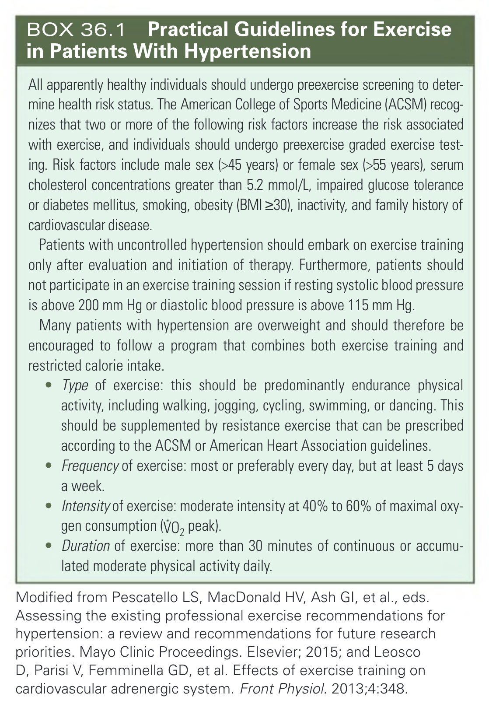

# 036. Nonpharmacologic Prevention and Treatment of Hypertension - Figures and Tables Index

This document lists all figures, tables and boxes extracted from `036. Nonpharmacologic Prevention and Treatment of Hypertension.pdf`.

## Table of Contents
- [Figures](#figures)
- [Tables](#tables)
- [Boxes](#boxes)

---

## Figures

### Fig_36_1



Fig. 36.1 Relationship of Salt Intake to Prevalence of Hypertension in Different Populations. (Modified from MacGregor GA. Sodium is more important than calcium in essential hypertension. Hypertension. 1985;7[4]:628–640.)

---

### Fig_36_2



Fig. 36.2 Blood Pressure Changes With Age and Salt Intake. The increase in systolic blood pressure (SBP) with age correlates with a higher salt intake in two Polynesian populations. In men of Rarotonga Island, where the sodium intake averages 130 mmol/day, SBP increases with age. In contrast, it remains constant in men of Pukapuka Island, where the sodium intake averages 50 to 70 mmol/day. (Modified from Prior I, Evans JG, Harvey H, Davidson F, Lindsey M. Sodium intake and blood pressure in two Polynesian populations. N Engl J Med. 1968;279[10]:515–520.)

---

### Fig_36_3



Fig. 36.3 Reduced Sodium Intake and Dietary Approaches to Stop Hypertension (DASH) Diet. Effect on systolic blood pressure (A) and diastolic blood pressure (B). (B, Modified from Sacks FM, Svetkey LP, Vollmer WM, et al. Effects on blood pressure of reduced dietary sodium and the Dietary Approaches to Stop Hypertension (DASH) diet. N Engl J Med. 2001;344[1]:3–10.)

---

### Fig_36_4



Fig. 36.4 Potassium Supplementation Lowers Blood Pressure in Hypokalemic Hypertensive Patients. Treatment with potassium chloride (60 mmol/day potassium for 6 weeks) resulted in an increase in serum potassium concentration and a decrease in mean arterial pressure in hypertensive patients taking thiazide diuretics. (Modified from Kaplan NM, Carnegie A, Raskin P, Heller JA, Simmons M. Potassium supplementation in hypertensive patients with diuretic-induced hypokalemia. N Engl J Med. 1985;312[12]:746–749.)

---

## Tables

### Table_36_1

#### Table Image



#### Table Data (CSV: [Table_36_1.csv](Table_36_1.csv))

```markdown
| COR | LOE | Recommendations for Nonpharmacologic Intervention |
| :-- | :-- | :--- |
| 1 | A | Weight loss is recommended to reduce BP in adults with elevated BP or hypertension who are overweight or obese |
| 1 | A | A heart-healthy diet, such as the DASH diet, that facilitates achieving a desirable weight is recommended for adults with elevated BP or hypertension |
| 1 | A | Sodium reduction is recommended for adults with elevated BP or hypertension |
| 1 | A | Potassium supplementation, preferably in dietary modification, is recommended for adults with elevated BP or hypertension unless contraindicated by the presence of CKD or use of drugs that reduce potassium excretion |
| 1 | A | Increased physical activity with a structured exercise program is recommended for adults with elevated BP or hypertension |
| 1 | A | Adult men and women with elevated BP or hypertension who currently consume alcohol should be advised to drink no more than two and one standard drinksa per day, respectively |
| 1 | A | Complete cessation of smoking |

aIn the United States, one standard drink contains roughly 14 g of pure alcohol, which is typically found in 360 mL (12 fl oz) of regular beer (usually about 5% alcohol), 150 mL (5 fl oz) of wine (usually about 12% alcohol), and 45 mL (1.5 fl oz) of distilled spirits (usually about 40% alcohol).
BP, Blood pressure; CKD, chronic kidney disease; COR, class (strength) of recommendation; DASH, Dietary Approaches to Stop Hypertension; LOE, level of evidence.
Modified from Whelton PK, Carey RM, Aronow WS, et al. 2017 ACC/AHA/AAPA/ABC/ACPM/AGS/APhA/ASH/ASPC/NMA/PCNA Guideline for the Prevention, Detection, Evaluation, and Management of High Blood Pressure in Adults: executive summary: a report of the American College of Cardiology/American Heart Association Task Force on Clinical Practice Guidelines. Hypertension. 2018;71(6):1269-1324.
```

TABLE 36.1 Lifestyle Modifications for Prevention and Management of Hypertension

---

### Table_36_2

#### Table Image



#### Table Data (CSV: [Table_36_2.csv](Table_36_2.csv))

```markdown
| Food Group | Daily Servings | Serving Sizes | Examples and Notes | Contribution to the DASH Diet Pattern |
| :--- | :--- | :--- | :--- | :--- |
| Grains and grain products | 7-8 | 1 slice bread, 1/2 cup dry cereal, 1/2 cup cooked rice, pasta, or cereal | Whole-wheat bread, muffin, pita bread, bagel, cereals, oatmeal | Major sources of calories and fiber |
| Vegetables | 4-5 | 1 cup raw, leafy vegetables, 1/2 cup cooked vegetables, 6 oz vegetable juice | Tomatoes, potatoes, carrots, peas, squash, broccoli, turnip greens, kale, spinach, artichokes, green beans, sweet potatoes | Rich sources of potassium, magnesium, and fiber |
| Fruits | 4-5 | 1 medium fruit, 1/2 cup dried fruit, 6 oz fruit juice, 1/2 cup fresh, frozen, or canned fruit | Apricots, bananas, dates, oranges, orange juice, grapefruit, grapefruit juice, mangoes, melons, peaches, pineapples, prunes, raisins, strawberries, tangerines | Important sources of potassium, magnesium, and fiber |
| Low-fat or nonfat dairy foods | 2-3 | 8 oz milk, 1 cup yogurt, 1.5 oz cheese | Skim or low-fat (2%) milk, skim or low-fat buttermilk, nonfat or low-fat yogurt, nonfat or low-fat cheeses | Major sources of calcium and protein |
| Meats, poultry, and fish | ≤2 | 3 oz cooked meats, poultry, or fish | Select only lean meats; trim away visible fats; broil, roast, or boil instead of frying; remove skin from poultry | Rich sources of protein and magnesium |
| Nuts, seeds, and legumes | 4-5/wk | 1.5 oz or 1/2 cup nuts, 1/2 oz or 2 tbsp seeds, 1/2 cup cooked legumes | Almonds, mixed nuts, peanuts, walnuts, sunflower seeds, kidney beans, lentils, split peas | Rich sources of calories, magnesium, potassium, protein, and fiber |

aThe DASH eating plan shown is based on 2000 kcal/day. Depending on energy needs, the number of daily servings in a food group may vary from those listed.
```

TABLE 36.2 Dietary Approaches to Stop Hypertension (DASH) Diet a

---

## Boxes

### Box_36_1



#### Box Text

```markdown
All apparently healthy individuals should undergo preexercise screening to determine health risk status. The American College of Sports Medicine (ACSM) recognizes that two or more of the following risk factors increase the risk associated with exercise, and individuals should undergo preexercise graded exercise testing. Risk factors include male sex (>45 years) or female sex (>55 years), serum cholesterol concentrations greater than 5.2 mmol/L, impaired glucose tolerance or diabetes mellitus, smoking, obesity (BMI ≥30), inactivity, and family history of cardiovascular disease.
Patients with uncontrolled hypertension should embark on exercise training only after evaluation and initiation of therapy. Furthermore, patients should not participate in an exercise training session if resting systolic blood pressure is above 200 mm Hg or diastolic blood pressure is above 115 mm Hg.
Many patients with hypertension are overweight and should therefore be encouraged to follow a program that combines both exercise training and restricted calorie intake.
*   Type of exercise: this should be predominantly endurance physical activity, including walking, jogging, cycling, swimming, or dancing. This should be supplemented by resistance exercise that can be prescribed according to the ACSM or American Heart Association guidelines.
*   Frequency of exercise: most or preferably every day, but at least 5 days a week.
*   Intensity of exercise: moderate intensity at 40% to 60% of maximal oxygen consumption (VO₂ peak).
*   Duration of exercise: more than 30 minutes of continuous or accumulated moderate physical activity daily.

Modified from Pescatello LS, MacDonald HV, Ash GI, et al., eds. Assessing the existing professional exercise recommendations for hypertension: a review and recommendations for future research priorities. Mayo Clinic Proceedings. Elsevier; 2015; and Leosco D, Parisi V, Femminella GD, et al. Effects of exercise training on cardiovascular adrenergic system. Front Physiol. 2013;4:348.
```

BOX 36.1 Practical Guidelines for Exercise in Patients With Hypertension

---
