# 037. Pharmacologic Treatment of Hypertension - Figures and Tables Index

This document lists all figures, tables and boxes extracted from `037. Pharmacologic Treatment of Hypertension.pdf`.

## Table of Contents
- [Figures](#figures)
- [Tables](#tables)
- [Boxes](#boxes)

---

## Figures

### Fig_37_1

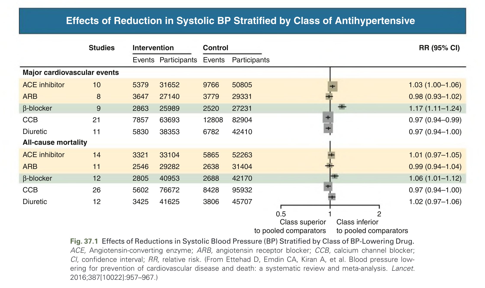

Fig. 37.1 Effects of Reductions in Systolic Blood Pressure (BP) Stratified by Class of BP-Lowering Drug. ACE, Angiotensin-converting enzyme; ARB, angiotensin receptor blocker; CCB, calcium channel blocker; CI, confidence interval; RR, relative risk. (From Ettehad D, Emdin CA, Kiran A, et al. Blood pressure low-ering for prevention of cardiovascular disease and death: a systematic review and meta-analysis. Lancet. 2016;387[10022]:957–967.)

---

### Fig_37_2

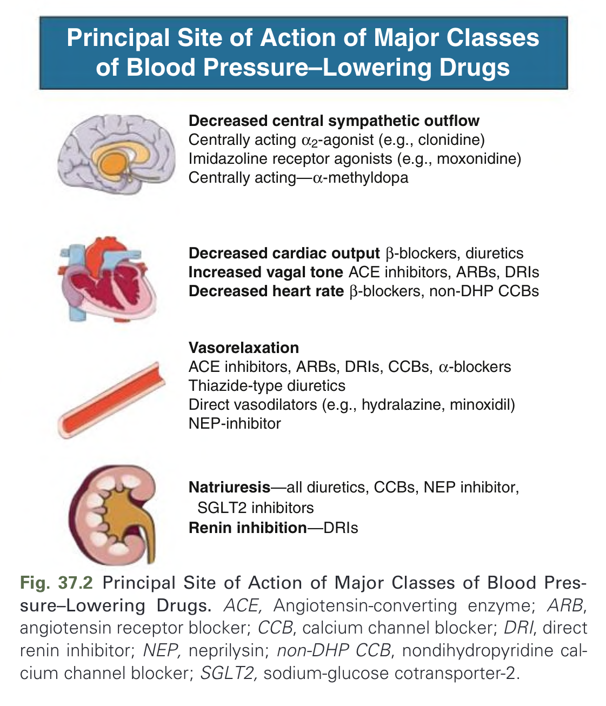

Fig. 37.2 Principal Site of Action of Major Classes of Blood Pres-sure–Lowering Drugs. ACE, Angiotensin-converting enzyme; ARB, angiotensin receptor blocker; CCB, calcium channel blocker; DRI, direct renin inhibitor; NEP, neprilysin; non-DHP CCB, nondihydropyridine cal-cium channel blocker; SGLT2, sodium-glucose cotransporter-2.

---

### Fig_37_3

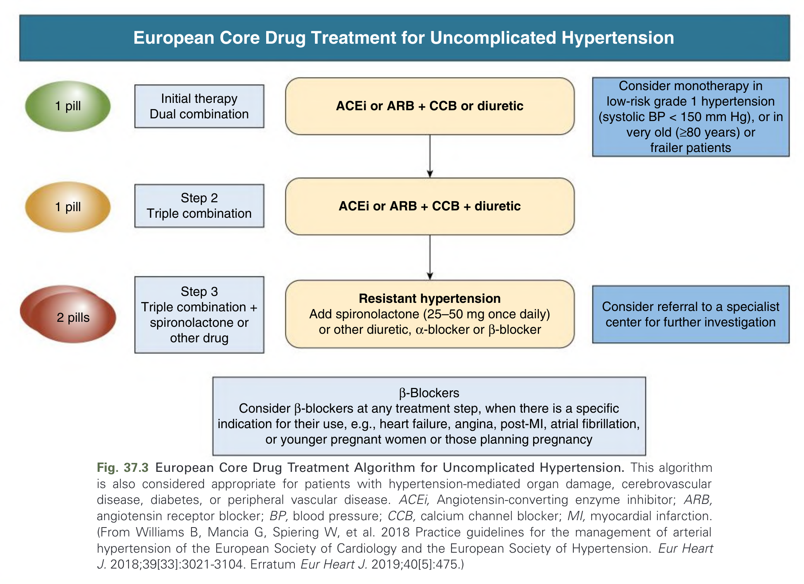

Fig. 37.3 European Core Drug Treatment Algorithm for Uncomplicated Hypertension. This algorithm is also considered appropriate for patients with hypertension-mediated organ damage, cerebrovascular disease, diabetes, or peripheral vascular disease. ACEi, Angiotensin-converting enzyme inhibitor; ARB, angiotensin receptor blocker; BP, blood pressure; CCB, calcium channel blocker; MI, myocardial infarction. (From Williams B, Mancia G, Spiering W, et al. 2018 Practice guidelines for the management of arterial hypertension of the European Society of Cardiology and the European Society of Hypertension. Eur Heart J. 2018;39[33]:3021-3104. Erratum Eur Heart J. 2019;40[5]:475.)

---

### Fig_37_4

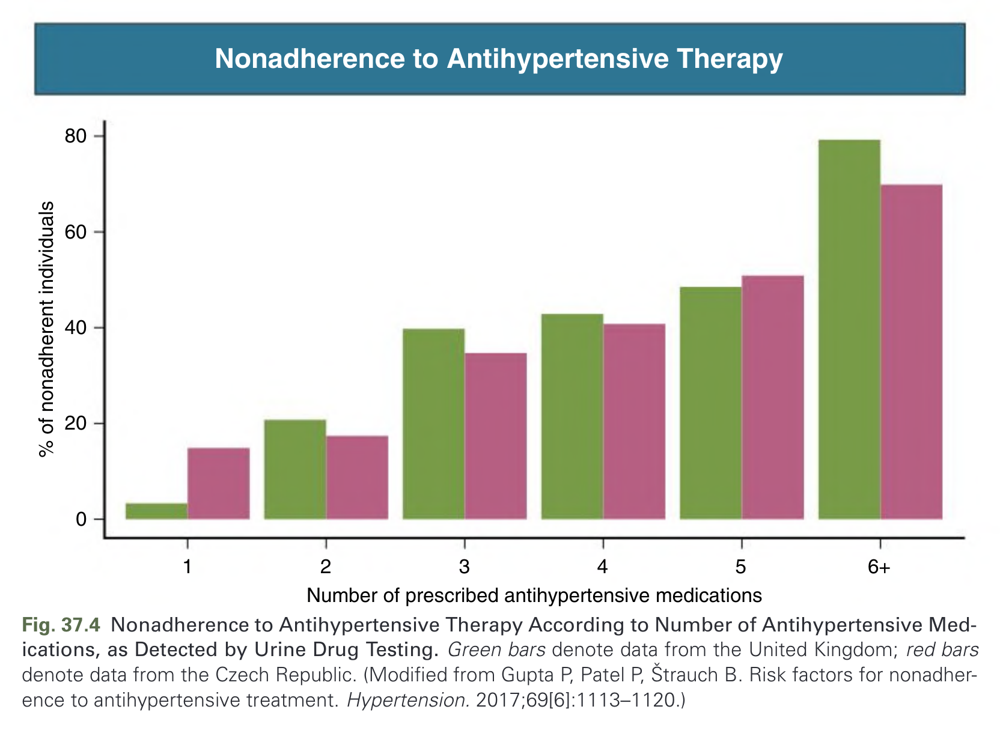

Fig. 37.4 Nonadherence to Antihypertensive Therapy According to Number of Antihypertensive Medications, as Detected by Urine Drug Testing. Green bars denote data from the United Kingdom; red bars denote data from the Czech Republic. (Modified from Gupta P, Patel P, Štrauch B. Risk factors for nonadherence to antihypertensive treatment. Hypertension. 2017;69[6]:1113–1120.)

---

### Fig_37_5

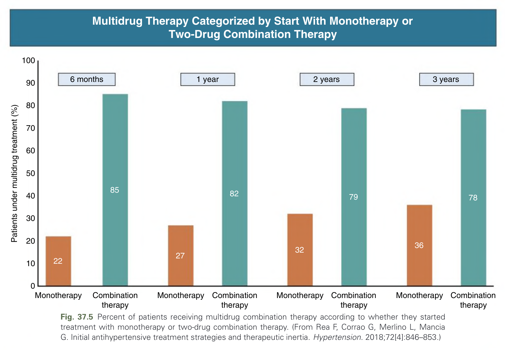

Fig. 37.5 Percent of patients receiving multidrug combination therapy according to whether they started treatment with monotherapy or two-drug combination therapy. (From Rea F, Corrao G, Merlino L, Mancia G. Initial antihypertensive treatment strategies and therapeutic inertia. Hypertension. 2018;72[4]:846–853.)

---

### Fig_37_6

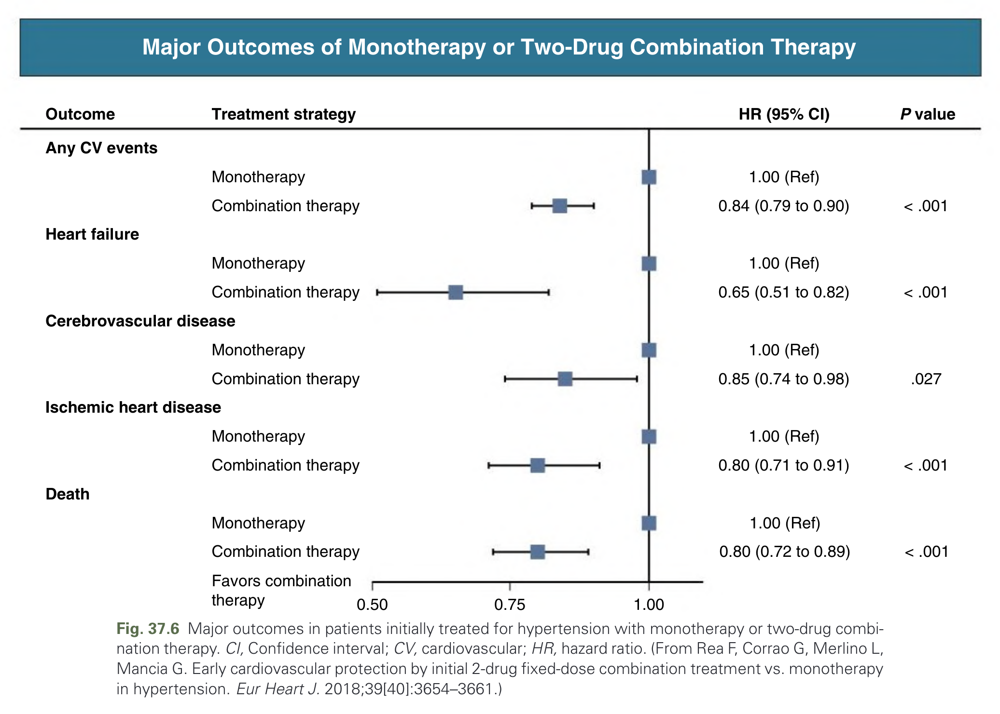

Fig. 37.6 Major outcomes in patients initially treated for hypertension with monotherapy or two-drug combination therapy. CI, Confidence interval; CV, cardiovascular; HR, hazard ratio. (From Rea F, Corrao G, Merlino L, Mancia G. Early cardiovascular protection by initial 2-drug fixed-dose combination treatment vs. monotherapy in hypertension. Eur Heart J. 2018;39[40]:3654–3661.)

---

## Tables

### Table_37_1

#### Table Image

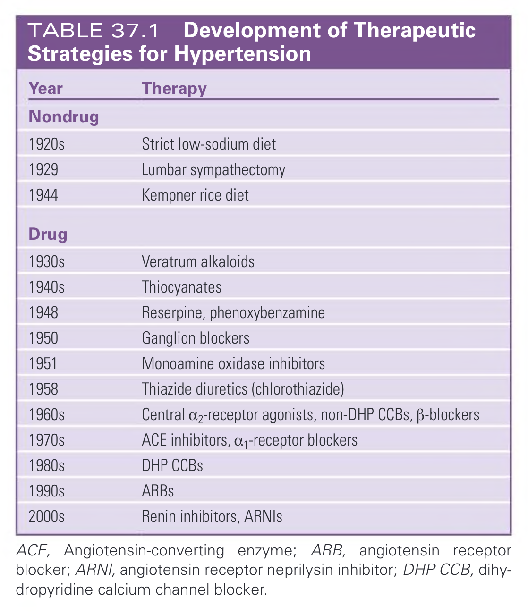

#### Table Data (CSV: [Table_37_1.csv](Table_37_1.csv))

```markdown
| Year | Therapy |
| :--- | :--- |
| **Nondrug** | |
| 1920s | Strict low-sodium diet |
| 1929 | Lumbar sympathectomy |
| 1944 | Kempner rice diet |
| **Drug** | |
| 1930s | Veratrum alkaloids |
| 1940s | Thiocyanates |
| 1948 | Reserpine, phenoxybenzamine |
| 1950 | Ganglion blockers |
| 1951 | Monoamine oxidase inhibitors |
| 1958 | Thiazide diuretics (chlorothiazide) |
| 1960s | Central α₂-receptor agonists, non-DHP CCBs, β-blockers |
| 1970s | ACE inhibitors, α₁-receptor blockers |
| 1980s | DHP CCBs |
| 1990s | ARBs |
| 2000s | Renin inhibitors, ARNIs |

ACE, Angiotensin-converting enzyme; ARB, angiotensin receptor blocker; ARNI, angiotensin receptor neprilysin inhibitor; DHP CCB, dihydropyridine calcium channel blocker.
```

TABLE 37.1 Development of Therapeutic Strategies for Hypertension

---

### Table_37_2

#### Table Image

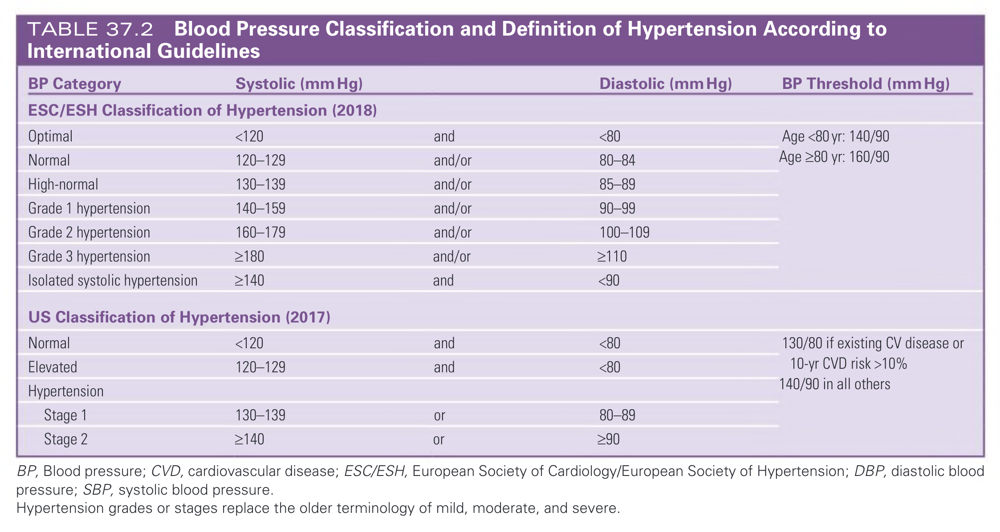

#### Table Data (CSV: [Table_37_2.csv](Table_37_2.csv))

```markdown
| BP Category | Systolic (mmHg) | | Diastolic (mmHg) | BP Threshold (mmHg) |
| :--- | :--- | :--- | :--- | :--- |
| **ESC/ESH Classification of Hypertension (2018)** | | | | |
| Optimal | <120 | and | <80 | Age <80 yr: 140/90 |
| Normal | 120-129 | and/or | 80-84 | Age ≥80 yr: 160/90 |
| High-normal | 130-139 | and/or | 85-89 | |
| Grade 1 hypertension | 140-159 | and/or | 90-99 | |
| Grade 2 hypertension | 160-179 | and/or | 100-109 | |
| Grade 3 hypertension | ≥180 | and/or | ≥110 | |
| Isolated systolic hypertension | ≥140 | and | <90 | |
| **US Classification of Hypertension (2017)** | | | | |
| Normal | <120 | and | <80 | 130/80 if existing CV disease or |
| Elevated | 120-129 | and | <80 | 10-yr CVD risk >10% |
| Hypertension | | | | 140/90 in all others |
| Stage 1 | 130-139 | or | 80-89 | |
| Stage 2 | ≥140 | or | ≥90 | |

BP, Blood pressure; CVD, cardiovascular disease; ESC/ESH, European Society of Cardiology/European Society of Hypertension; DBP, diastolic blood pressure; SBP, systolic blood pressure.
Hypertension grades or stages replace the older terminology of mild, moderate, and severe.
```

TABLE 37.2 Blood Pressure Classification and Definition of Hypertension According to International Guidelines

---

### Table_37_3

#### Table Image

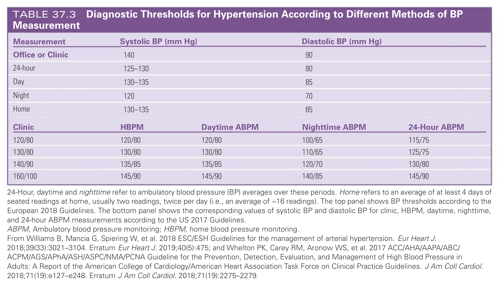

#### Table Data (CSV: [Table_37_3.csv](Table_37_3.csv))

```markdown
| Measurement | Systolic BP (mm Hg) | Diastolic BP (mm Hg) | | |
| :--- | :--- | :--- | :--- | :--- |
| **Office or Clinic** | 140 | 90 | | |
| 24-hour | 125-130 | 80 | | |
| Day | 130-135 | 85 | | |
| Night | 120 | 70 | | |
| Home | 130-135 | 85 | | |
| **Clinic** | **HBPM** | **Daytime ABPM** | **Nighttime ABPM** | **24-Hour ABPM** |
| 120/80 | 120/80 | 120/80 | 100/65 | 115/75 |
| 130/80 | 130/80 | 130/80 | 110/65 | 125/75 |
| 140/90 | 135/85 | 135/85 | 120/70 | 130/80 |
| 160/100 | 145/90 | 145/90 | 140/85 | 145/90 |

24-Hour, daytime and nighttime refer to ambulatory blood pressure (BP) averages over these periods. Home refers to an average of at least 4 days of seated readings at home, usually two readings, twice per day (i.e., an average of ~16 readings). The top panel shows BP thresholds according to the European 2018 Guidelines. The bottom panel shows the corresponding values of systolic BP and diastolic BP for clinic, HBPM, daytime, nighttime, and 24-hour ABPM measurements according to the US 2017 Guidelines.
ABPM, Ambulatory blood pressure monitoring; HBPM, home blood pressure monitoring.
From Williams B, Mancia G, Spiering W, et al. 2018 ESC/ESH Guidelines for the management of arterial hypertension. Eur Heart J. 2018;39(33):3021–3104. Erratum Eur Heart J. 2019;40(5):475; and Whelton PK, Carey RM, Aronow WS, et al. 2017 ACC/AHA/AAPA/ABC/ACPM/AGS/APhA/ASH/ASPC/NMA/PCNA Guideline for the Prevention, Detection, Evaluation, and Management of High Blood Pressure in Adults: A Report of the American College of Cardiology/American Heart Association Task Force on Clinical Practice Guidelines. J Am Coll Cardiol. 2018;71(19):e127–e248. Erratum J Am Coll Cardiol. 2018;71(19):2275–2279.
```

TABLE 37.3 Diagnostic Thresholds for Hypertension According to Different Methods of BP Measurement

---

### Table_37_4

#### Table Image

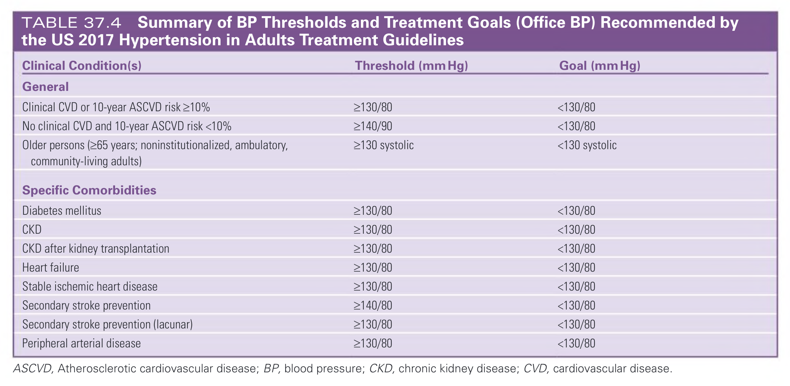

#### Table Data (CSV: [Table_37_4.csv](Table_37_4.csv))

```markdown
| Clinical Condition(s) | Threshold (mmHg) | Goal (mmHg) |
| :--- | :--- | :--- |
| **General** | | |
| Clinical CVD or 10-year ASCVD risk ≥10% | ≥130/80 | <130/80 |
| No clinical CVD and 10-year ASCVD risk <10% | ≥140/90 | <130/80 |
| Older persons (≥65 years; noninstitutionalized, ambulatory, community-living adults) | ≥130 systolic | <130 systolic |
| **Specific Comorbidities** | | |
| Diabetes mellitus | ≥130/80 | <130/80 |
| CKD | ≥130/80 | <130/80 |
| CKD after kidney transplantation | ≥130/80 | <130/80 |
| Heart failure | ≥130/80 | <130/80 |
| Stable ischemic heart disease | ≥130/80 | <130/80 |
| Secondary stroke prevention | ≥140/80 | <130/80 |
| Secondary stroke prevention (lacunar) | ≥130/80 | <130/80 |
| Peripheral arterial disease | ≥130/80 | <130/80 |

ASCVD, Atherosclerotic cardiovascular disease; BP, blood pressure; CKD, chronic kidney disease; CVD, cardiovascular disease.
```

TABLE 37.4 Summary of BP Thresholds and Treatment Goals (Office BP) Recommended by the US 2017 Hypertension in Adults Treatment Guidelines

---

### Table_37_5

#### Table Image

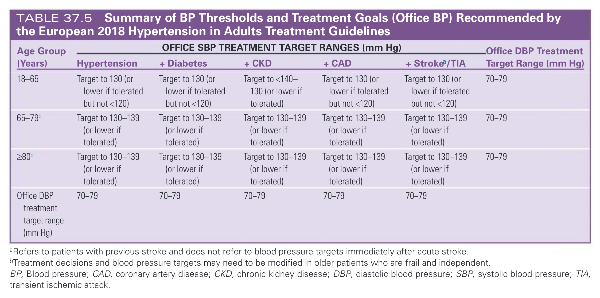

#### Table Data (CSV: [Table_37_5.csv](Table_37_5.csv))

```markdown
| Age Group (Years) | Hypertension | + Diabetes | + CKD | + CAD | + Strokea/TIA | Office DBP Treatment Target Range (mm Hg) |
| :--- | :--- | :--- | :--- | :--- | :--- | :--- |
| **OFFICE SBP TREATMENT TARGET RANGES (mm Hg)** | | | | | | |
| 18-65 | Target to 130 (or lower if tolerated but not <120) | Target to 130 (or lower if tolerated but not <120) | Target to <140-130 (or lower if tolerated) | Target to 130 (or lower if tolerated but not <120) | Target to 130 (or lower if tolerated but not <120) | 70-79 |
| 65-79b | Target to 130-139 (or lower if tolerated) | Target to 130-139 (or lower if tolerated) | Target to 130-139 (or lower if tolerated) | Target to 130-139 (or lower if tolerated) | Target to 130-139 (or lower if tolerated) | 70-79 |
| ≥80b | Target to 130-139 (or lower if tolerated) | Target to 130-139 (or lower if tolerated) | Target to 130-139 (or lower if tolerated) | Target to 130-139 (or lower if tolerated) | Target to 130-139 (or lower if tolerated) | 70-79 |
| Office DBP treatment target range (mm Hg) | 70-79 | 70-79 | 70-79 | 70-79 | 70-79 | |

aRefers to patients with previous stroke and does not refer to blood pressure targets immediately after acute stroke.
bTreatment decisions and blood pressure targets may need to be modified in older patients who are frail and independent.
BP, Blood pressure; CAD, coronary artery disease; CKD, chronic kidney disease; DBP, diastolic blood pressure; SBP, systolic blood pressure; TIA, transient ischemic attack.
```

TABLE 37.5 Summary of BP Thresholds and Treatment Goals (Office BP) Recommended by the European 2018 Hypertension in Adults Treatment Guidelines

---

### Table_37_6

#### Table Image

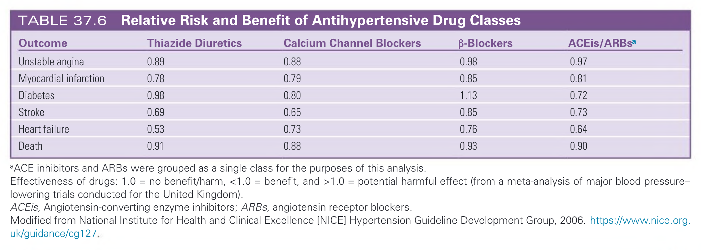

#### Table Data (CSV: [Table_37_6.csv](Table_37_6.csv))

```markdown
| Outcome | Thiazide Diuretics | Calcium Channel Blockers | β-Blockers | ACEis/ARBsa |
| :--- | :--- | :--- | :--- | :--- |
| Unstable angina | 0.89 | 0.88 | 0.98 | 0.97 |
| Myocardial infarction | 0.78 | 0.79 | 0.85 | 0.81 |
| Diabetes | 0.98 | 0.80 | 1.13 | 0.72 |
| Stroke | 0.69 | 0.65 | 0.85 | 0.73 |
| Heart failure | 0.53 | 0.73 | 0.76 | 0.64 |
| Death | 0.91 | 0.88 | 0.93 | 0.90 |

aACE inhibitors and ARBs were grouped as a single class for the purposes of this analysis.
Effectiveness of drugs: 1.0 = no benefit/harm, <1.0 = benefit, and >1.0 = potential harmful effect (from a meta-analysis of major blood pressure–lowering trials conducted for the United Kingdom).
ACEis, Angiotensin-converting enzyme inhibitors; ARBs, angiotensin receptor blockers.
Modified from National Institute for Health and Clinical Excellence [NICE] Hypertension Guideline Development Group, 2006. https://www.nice.org.uk/guidance/cg127
```

TABLE 37.6 Relative Risk and Benefit of Antihypertensive Drug Classes

---

### Table_37_7

#### Table Image

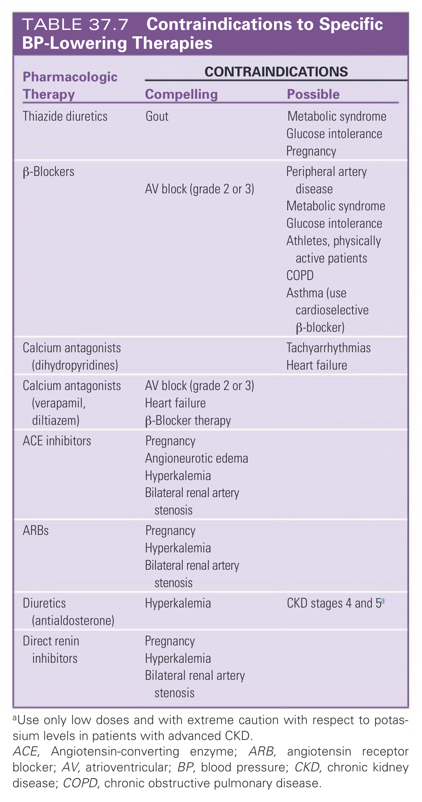

#### Table Data (CSV: [Table_37_7.csv](Table_37_7.csv))

```markdown
| Pharmacologic Therapy | CONTRAINDICATIONS | |
| :--- | :--- | :--- |
| | **Compelling** | **Possible** |
| Thiazide diuretics | Gout | Metabolic syndrome, Glucose intolerance, Pregnancy |
| β-Blockers | AV block (grade 2 or 3) | Peripheral artery disease, Metabolic syndrome, Glucose intolerance, Athletes, physically active patients, COPD, Asthma (use cardioselective β-blocker) |
| Calcium antagonists (dihydropyridines) | | Tachyarrhythmias, Heart failure |
| Calcium antagonists (verapamil, diltiazem) | AV block (grade 2 or 3), Heart failure, β-Blocker therapy | |
| ACE inhibitors | Pregnancy, Angioneurotic edema, Hyperkalemia, Bilateral renal artery stenosis | |
| ARBs | Pregnancy, Hyperkalemia, Bilateral renal artery stenosis | |
| Diuretics (antialdosterone) | Hyperkalemia | CKD stages 4 and 5a |
| Direct renin inhibitors | Pregnancy, Hyperkalemia, Bilateral renal artery stenosis | |

aUse only low doses and with extreme caution with respect to potassium levels in patients with advanced CKD.
ACE, Angiotensin-converting enzyme; ARB, angiotensin receptor blocker; AV, atrioventricular; BP, blood pressure; CKD, chronic kidney disease; COPD, chronic obstructive pulmonary disease.
```

TABLE 37.7 Contraindications to Specific BP-Lowering Therapies

---

### Table_37_8

#### Table Image

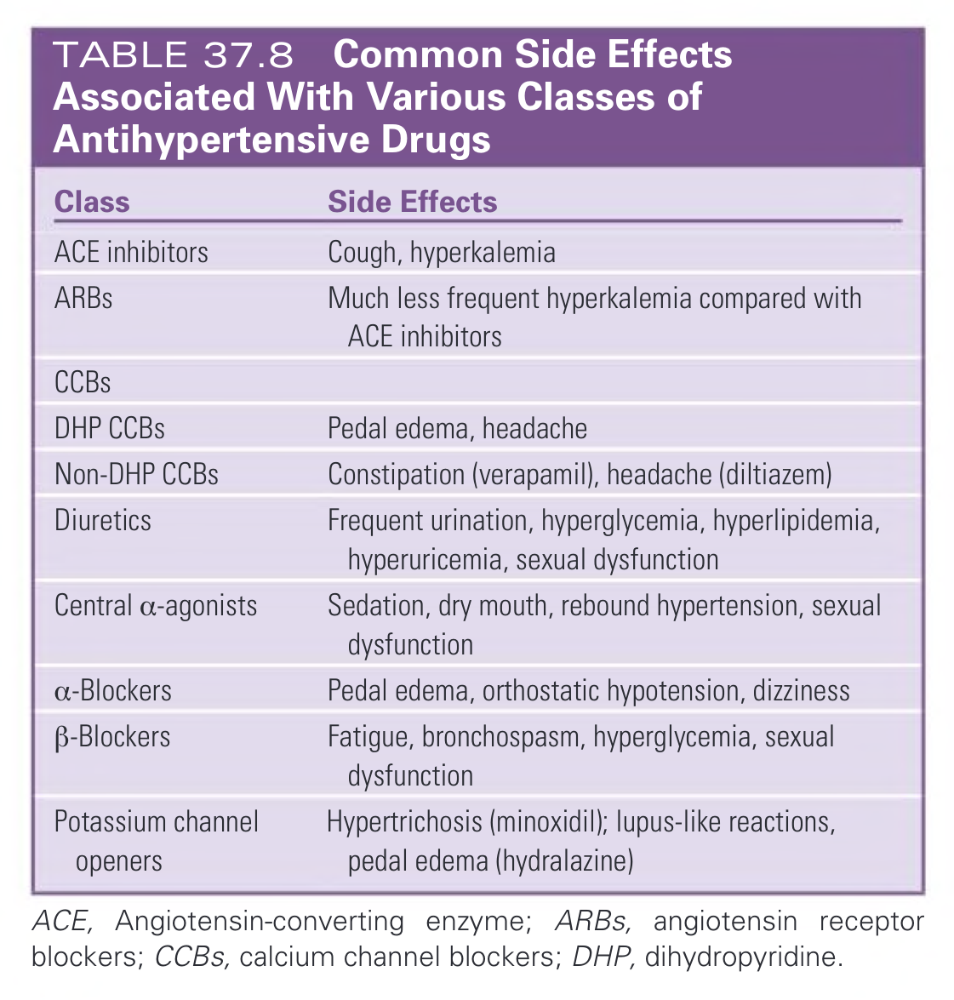

#### Table Data (CSV: [Table_37_8.csv](Table_37_8.csv))

```markdown
| Class | Side Effects |
| :--- | :--- |
| ACE inhibitors | Cough, hyperkalemia |
| ARBs | Much less frequent hyperkalemia compared with ACE inhibitors |
| CCBs | |
| DHP CCBs | Pedal edema, headache |
| Non-DHP CCBs | Constipation (verapamil), headache (diltiazem) |
| Diuretics | Frequent urination, hyperglycemia, hyperlipidemia, hyperuricemia, sexual dysfunction |
| Central α-agonists | Sedation, dry mouth, rebound hypertension, sexual dysfunction |
| α-Blockers | Pedal edema, orthostatic hypotension, dizziness |
| β-Blockers | Fatigue, bronchospasm, hyperglycemia, sexual dysfunction |
| Potassium channel openers | Hypertrichosis (minoxidil); lupus-like reactions, pedal edema (hydralazine) |

ACE, Angiotensin-converting enzyme; ARBs, angiotensin receptor blockers; CCBs, calcium channel blockers; DHP, dihydropyridine.
```

TABLE 37.8 Common Side Effects Associated With Various Classes of Antihypertensive Drugs

---

### Table_37_9

#### Table Image

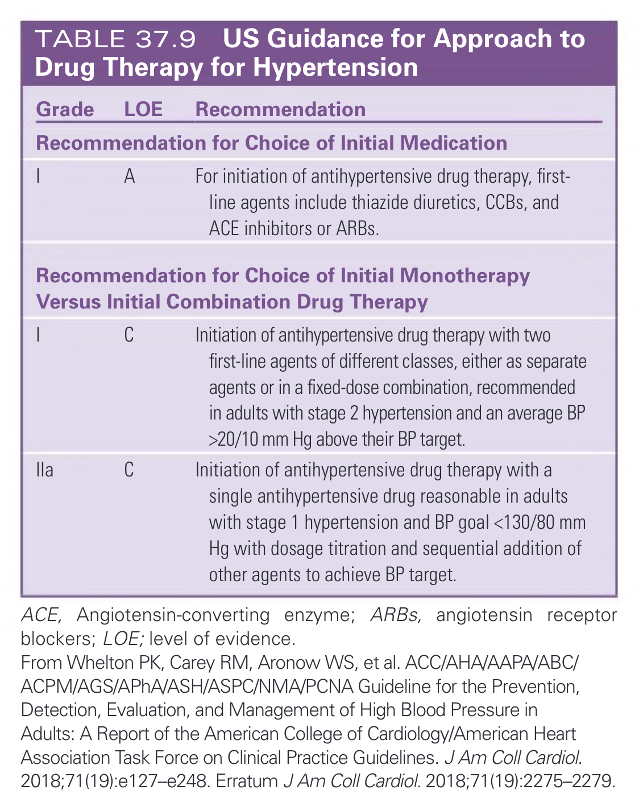

#### Table Data (CSV: [Table_37_9.csv](Table_37_9.csv))

```markdown
| Grade | LOE | Recommendation |
| :--- | :--- | :--- |
| **Recommendation for Choice of Initial Medication** | | |
| I | A | For initiation of antihypertensive drug therapy, first-line agents include thiazide diuretics, CCBs, and ACE inhibitors or ARBs. |
| **Recommendation for Choice of Initial Monotherapy Versus Initial Combination Drug Therapy** | | |
| I | C | Initiation of antihypertensive drug therapy with two first-line agents of different classes, either as separate agents or in a fixed-dose combination, recommended in adults with stage 2 hypertension and an average BP >20/10 mm Hg above their BP target. |
| IIa | C | Initiation of antihypertensive drug therapy with a single antihypertensive drug reasonable in adults with stage 1 hypertension and BP goal <130/80 mm Hg with dosage titration and sequential addition of other agents to achieve BP target. |

ACE, Angiotensin-converting enzyme; ARBs, angiotensin receptor blockers; LOE; level of evidence.
From Whelton PK, Carey RM, Aronow WS, et al. ACC/AHA/AAPA/ABC/ACPM/AGS/APhA/ASH/ASPC/NMA/PCNA Guideline for the Prevention, Detection, Evaluation, and Management of High Blood Pressure in Adults: A Report of the American College of Cardiology/American Heart Association Task Force on Clinical Practice Guidelines. J Am Coll Cardiol. 2018;71(19):e127–e248. Erratum J Am Coll Cardiol. 2018;71(19):2275–2279.
```

TABLE 37.9 US Guidance for Approach to Drug Therapy for Hypertension

---

### Table_37_10

#### Table Image

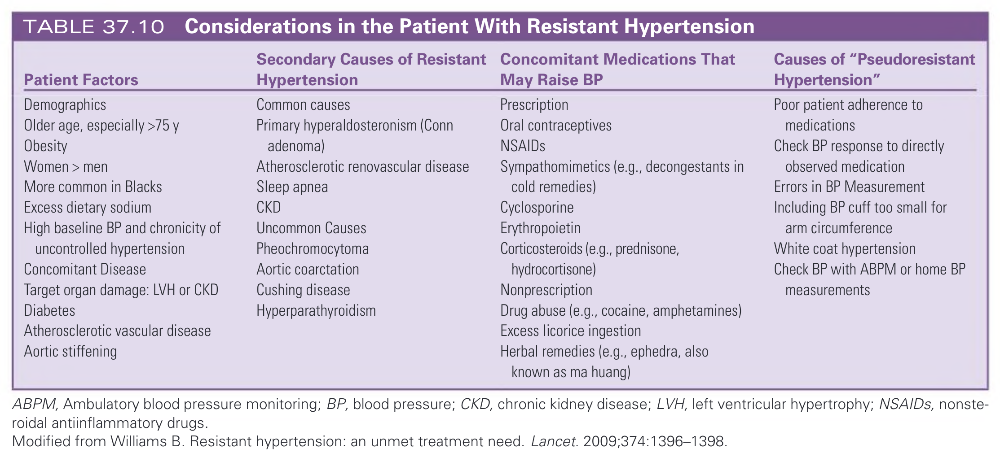

#### Table Data (CSV: [Table_37_10.csv](Table_37_10.csv))

```markdown
| Patient Factors | Secondary Causes of Resistant Hypertension | Concomitant Medications That May Raise BP | Causes of "Pseudoresistant Hypertension" |
| :--- | :--- | :--- | :--- |
| **Demographics**<br>Older age, especially >75 y<br>Obesity<br>Women > men<br>More common in Blacks<br>Excess dietary sodium<br>High baseline BP and chronicity of uncontrolled hypertension | **Common causes**<br>Primary hyperaldosteronism (Conn adenoma)<br>Atherosclerotic renovascular disease<br>Sleep apnea<br>CKD | **Prescription**<br>Oral contraceptives<br>NSAIDs<br>Sympathomimetics (e.g., decongestants in cold remedies)<br>Cyclosporine<br>Erythropoietin<br>Corticosteroids (e.g., prednisone, hydrocortisone) | **Poor patient adherence to medications**<br>Check BP response to directly observed medication |
| **Concomitant Disease**<br>Target organ damage: LVH or CKD<br>Diabetes<br>Atherosclerotic vascular disease<br>Aortic stiffening | **Uncommon Causes**<br>Pheochromocytoma<br>Aortic coarctation<br>Cushing disease<br>Hyperparathyroidism | **Nonprescription**<br>Drug abuse (e.g., cocaine, amphetamines)<br>Excess licorice ingestion<br>Herbal remedies (e.g., ephedra, also known as ma huang) | **Errors in BP Measurement**<br>Including BP cuff too small for arm circumference<br>**White coat hypertension**<br>Check BP with ABPM or home BP measurements |

ABPM, Ambulatory blood pressure monitoring; BP, blood pressure; CKD, chronic kidney disease; LVH, left ventricular hypertrophy; NSAIDs, nonsteroidal antiinflammatory drugs.
Modified from Williams B. Resistant hypertension: an unmet treatment need. Lancet. 2009;374:1396–1398.
```

TABLE 37.10 Considerations in the Patient With Resistant Hypertension

---

## Boxes

### Box_37_1

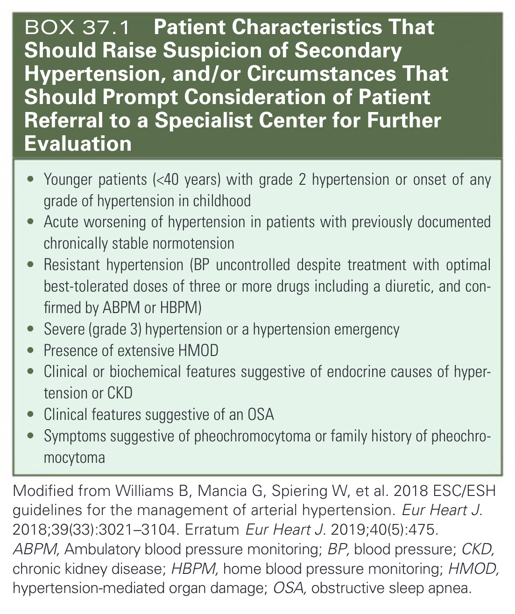

#### Box Text

```markdown
*   Younger patients (<40 years) with grade 2 hypertension or onset of any grade of hypertension in childhood
*   Acute worsening of hypertension in patients with previously documented chronically stable normotension
*   Resistant hypertension (BP uncontrolled despite treatment with optimal best-tolerated doses of three or more drugs including a diuretic, and confirmed by ABPM or HBPM)
*   Severe (grade 3) hypertension or a hypertension emergency
*   Presence of extensive HMOD
*   Clinical or biochemical features suggestive of endocrine causes of hypertension or CKD
*   Clinical features suggestive of an OSA
*   Symptoms suggestive of pheochromocytoma or family history of pheochromocytoma

ABPM, Ambulatory blood pressure monitoring; BP, blood pressure; CKD, chronic kidney disease; HBPM, home blood pressure monitoring; HMOD, hypertension-mediated organ damage; OSA, obstructive sleep apnea.
```

BOX 37.1 Patient Characteristics That Should Raise Suspicion of Secondary Hypertension, and/or Circumstances That Should Prompt Consideration of Patient Referral to a Specialist Center for Further Evaluation

---
