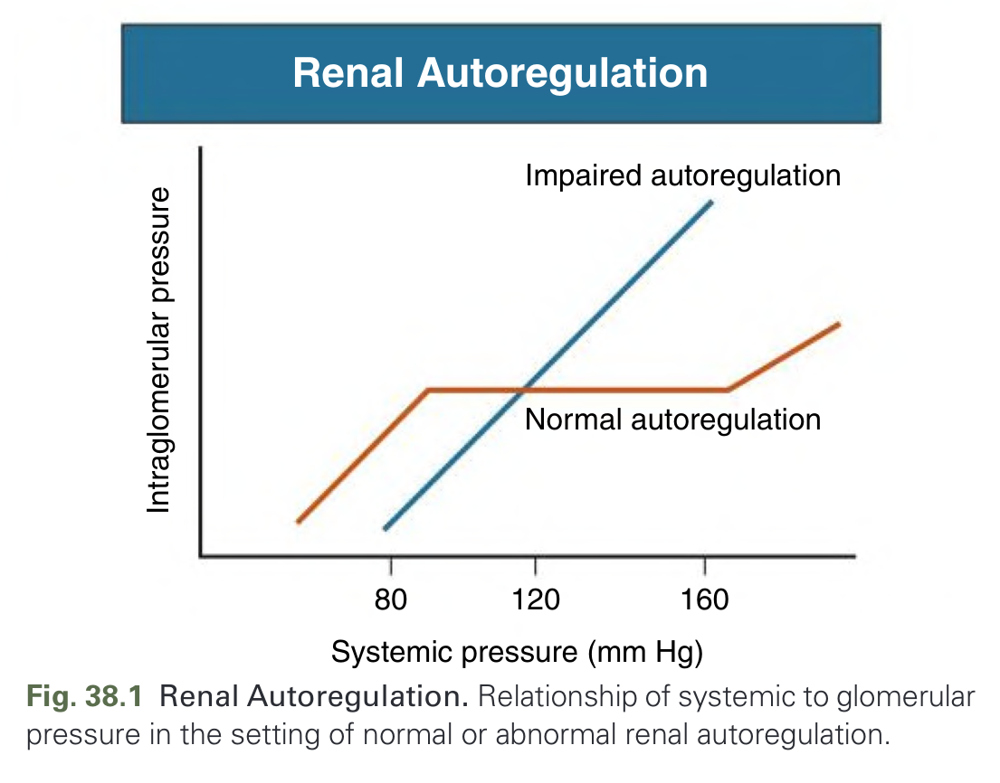
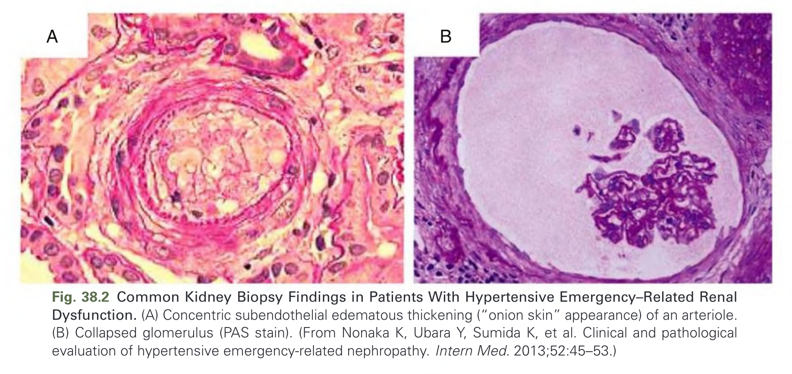
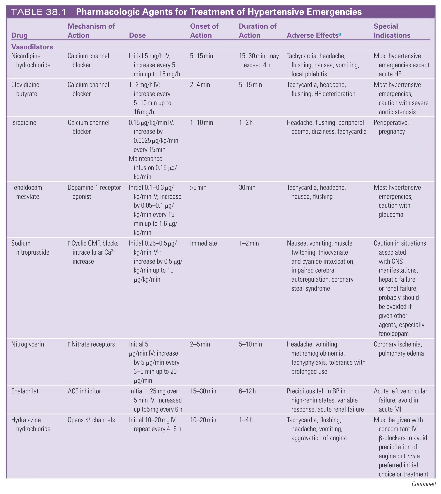
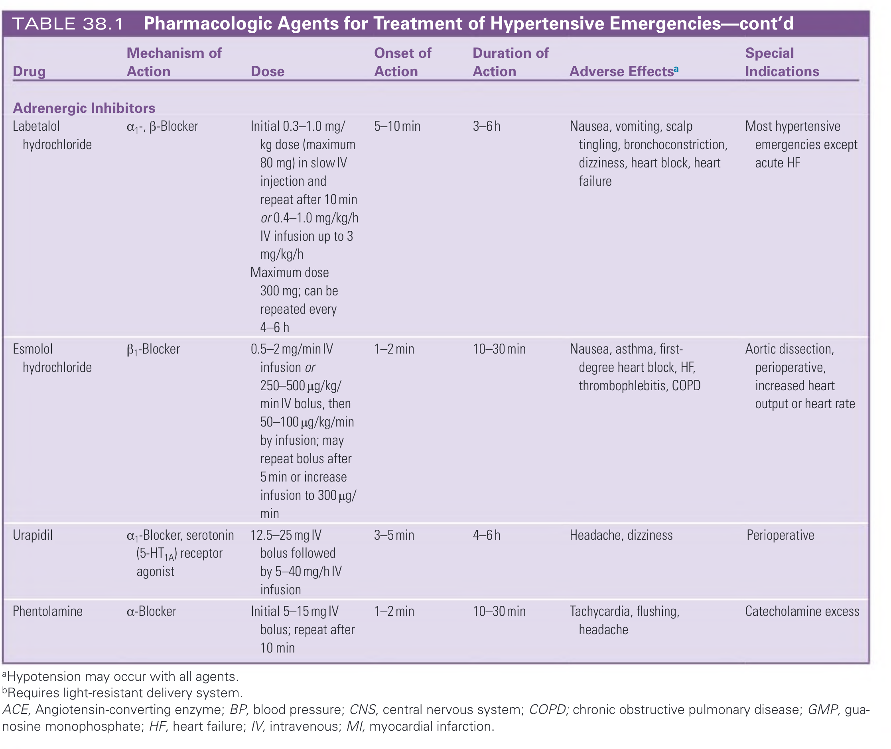
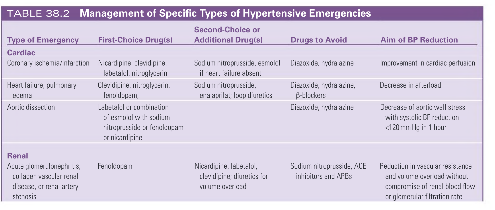
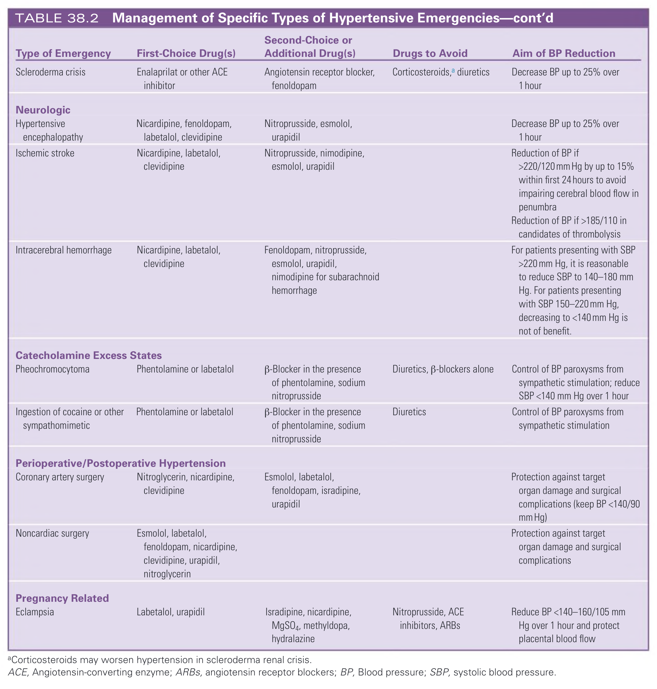
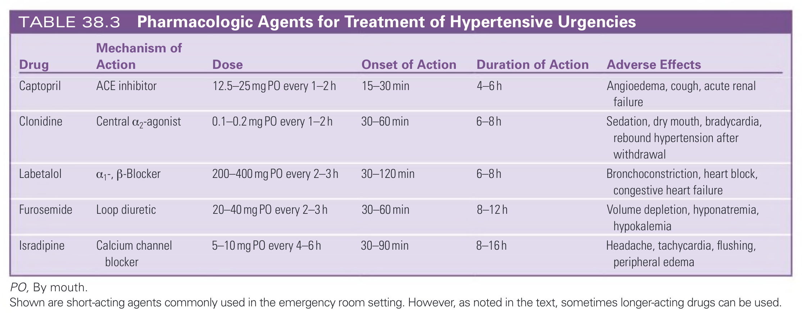
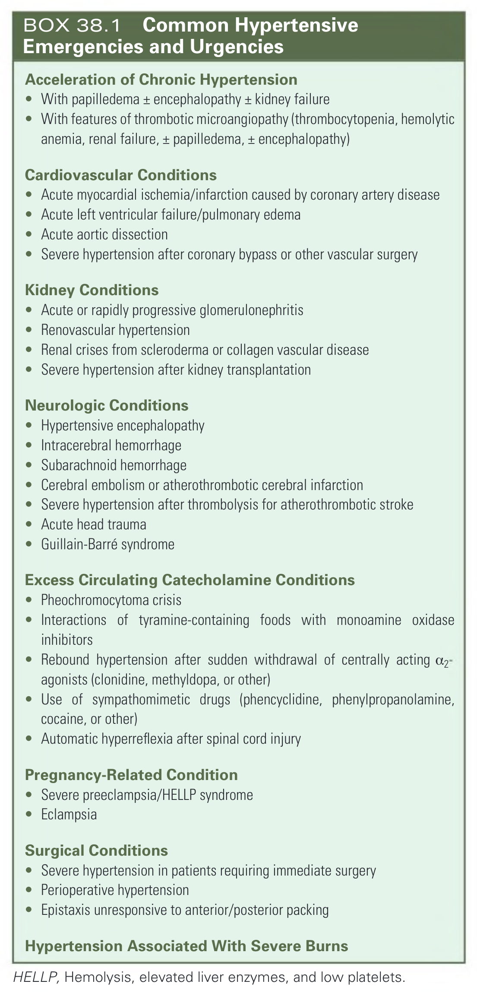
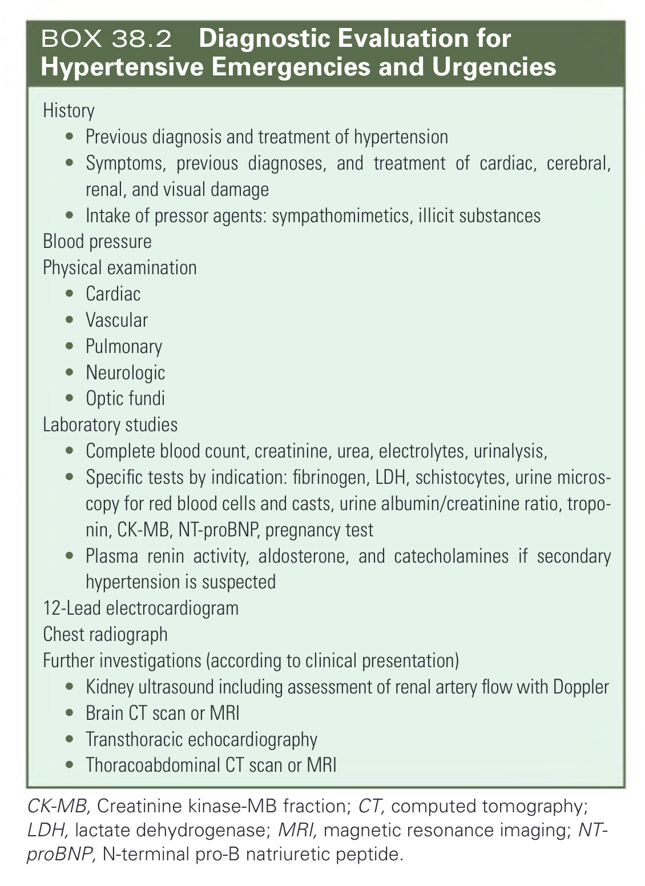

# 038. Evaluation and Treatment of Hypertensive Urgencies and Emergencies - Figures and Tables Index

This document lists all figures, tables and boxes extracted from `038. Evaluation and Treatment of Hypertensive Urgencies and Emergencies.pdf`.

## Table of Contents
- [Figures](#figures)
- [Tables](#tables)
- [Boxes](#boxes)

---

## Figures

### Fig_38_1



Fig. 38.1 Renal Autoregulation. Relationship of systemic to glomerular pressure in the setting of normal or abnormal renal autoregulation.

---

### Fig_38_2



Fig. 38.2 Common Kidney Biopsy Findings in Patients With Hypertensive Emergency–Related Renal Dysfunction. (A) Concentric subendothelial edematous thickening (“onion skin” appearance) of an arteriole. (B) Collapsed glomerulus (PAS stain). (From Nonaka K, Ubara Y, Sumida K, et al. Clinical and pathological evaluation of hypertensive emergency-related nephropathy. Intern Med. 2013;52:45–53.)

---

## Tables

### Table_38_1

#### Table Image





#### Table Data (CSV: [Table_38_1.csv](Table_38_1.csv))

```markdown
| Drug | Mechanism of Action | Dose | Onset of Action | Duration of Action | Adverse Effectsa | Special Indications |
| :--- | :--- | :--- | :--- | :--- | :--- | :--- |
| **Vasodilators** | | | | | | |
| Nicardipine hydrochloride | Calcium channel blocker | Initial 5 mg/h IV; increase every 5 min up to 15 mg/h | 5-15 min | 15-30 min, may exceed 4 h | Tachycardia, headache, flushing, nausea, vomiting, local phlebitis | Most hypertensive emergencies except acute HF |
| Clevidipine butyrate | Calcium channel blocker | 1-2 mg/h IV; increase every 5-10 min up to 16 mg/h | 2-4 min | 5-15 min | Tachycardia, headache, flushing, HF deterioration | Most hypertensive emergencies; caution with severe aortic stenosis |
| Isradipine | Calcium channel blocker | 0.15 µg/kg/min IV, increase by 0.0025 µg/kg/min every 15 min<br>Maintenance infusion 0.15 µg/kg/min | 1-10 min | 1-2h | Headache, flushing, peripheral edema, dizziness, tachycardia | Perioperative, pregnancy |
| Fenoldopam mesylate | Dopamine-1 receptor agonist | Initial 0.1-0.3 µg/kg/min IV; increase by 0.05-0.1 µg/kg/min every 15 min up to 1.6 µg/kg/min | >5 min | 30 min | Tachycardia, headache, nausea, flushing | Most hypertensive emergencies; caution with glaucoma |
| Sodium nitroprusside | ↑ Cyclic GMP, blocks intracellular Ca²⁺ increase | Initial 0.25-0.5 µg/kg/min IVb; increase by 0.5 µg/kg/min up to 10 µg/kg/min | Immediate | 1-2 min | Nausea, vomiting, muscle twitching, thiocyanate and cyanide intoxication, impaired cerebral autoregulation, coronary steal syndrome | Caution in situations associated with CNS manifestations, hepatic failure or renal failure; probably should be avoided if given other agents, especially fenoldopam |
| Nitroglycerin | ↑ Nitrate receptors | Initial 5 µg/min IV; increase by 5 µg/min every 3-5 min up to 20 µg/min | 2-5 min | 5-10 min | Headache, vomiting, methemoglobinemia, tachyphylaxis, tolerance with prolonged use | Coronary ischemia, pulmonary edema |
| Enalaprilat | ACE inhibitor | Initial 1.25 mg over 5 min IV; increased up to5 mg every 6h | 15-30 min | 6-12h | Precipitous fall in BP in high-renin states, variable response, acute renal failure | Acute left ventricular failure; avoid in acute MI |
| Hydralazine hydrochloride | Opens K+ channels | Initial 10-20 mg IV; repeat every 4-6 h | 10-20 min | 1-4h | Tachycardia, flushing, headache, vomiting, aggravation of angina | Must be given with concomitant IV β-blockers to avoid precipitation of angina but not a preferred initial choice or treatment |
| **Adrenergic Inhibitors** | | | | | | |
| Labetalol hydrochloride | α₁-, β-Blocker | Initial 0.3-1.0 mg/kg dose (maximum 80 mg) in slow IV injection and repeat after 10 min or 0.4-1.0 mg/kg/h IV infusion up to 3 mg/kg/h<br>Maximum dose 300 mg; can be repeated every 4-6 h | 5-10 min | 3-6h | Nausea, vomiting, scalp tingling, bronchoconstriction, dizziness, heart block, heart failure | Most hypertensive emergencies except acute HF |
| Esmolol hydrochloride | β₁-Blocker | 0.5-2 mg/min IV infusion or 250-500 µg/kg/min IV bolus, then 50-100 µg/kg/min by infusion; may repeat bolus after 5 min or increase infusion to 300 µg/min | 1-2 min | 10-30 min | Nausea, asthma, first-degree heart block, HF, thrombophlebitis, COPD | Aortic dissection, perioperative, increased heart output or heart rate |
| Urapidil | α₁-Blocker, serotonin (5-HT₁A) receptor agonist | 12.5-25 mg IV bolus followed by 5-40 mg/h IV infusion | 3-5 min | 4-6 h | Headache, dizziness | Perioperative |
| Phentolamine | α-Blocker | Initial 5-15 mg IV bolus; repeat after 10 min | 1-2 min | 10-30 min | Tachycardia, flushing, headache | Catecholamine excess |

aHypotension may occur with all agents.
bRequires light-resistant delivery system.
ACE, Angiotensin-converting enzyme; BP, blood pressure; CNS, central nervous system; COPD; chronic obstructive pulmonary disease; GMP, guanosine monophosphate; HF, heart failure; IV, intravenous; MI, myocardial infarction.
```

TABLE 38.1 Pharmacologic Agents for Treatment of Hypertensive Emergencies

---

### Table_38_2

#### Table Image





#### Table Data (CSV: [Table_38_2.csv](Table_38_2.csv))

```markdown
| Type of Emergency | First-Choice Drug(s) | Second-Choice or Additional Drug(s) | Drugs to Avoid | Aim of BP Reduction |
| :--- | :--- | :--- | :--- | :--- |
| **Cardiac** | | | | |
| Coronary ischemia/infarction | Nicardipine, clevidipine, labetalol, nitroglycerin | Sodium nitroprusside, esmolol if heart failure absent | Diazoxide, hydralazine | Improvement in cardiac perfusion |
| Heart failure, pulmonary edema | Clevidipine, nitroglycerin, fenoldopam, | Sodium nitroprusside, enalaprilat; loop diuretics | Diazoxide, hydralazine; β-blockers | Decrease in afterload |
| Aortic dissection | Labetalol or combination of esmolol with sodium nitroprusside or fenoldopam or nicardipine | | Diazoxide, hydralazine | Decrease of aortic wall stress with systolic BP reduction <120 mm Hg in 1 hour |
| **Renal** | | | | |
| Acute glomerulonephritis, collagen vascular renal disease, or renal artery stenosis | Fenoldopam | Nicardipine, labetalol, clevidipine; diuretics for volume overload | Sodium nitroprusside; ACE inhibitors and ARBs | Reduction in vascular resistance and volume overload without compromise of renal blood flow or glomerular filtration rate |
| Scleroderma crisis | Enalaprilat or other ACE inhibitor | Angiotensin receptor blocker, fenoldopam | Corticosteroids,a diuretics | Decrease BP up to 25% over 1 hour |
| **Neurologic** | | | | |
| Hypertensive encephalopathy | Nicardipine, fenoldopam, labetalol, clevidipine | Nitroprusside, esmolol, urapidil | | Decrease BP up to 25% over 1 hour |
| Ischemic stroke | Nicardipine, labetalol, clevidipine | Nitroprusside, nimodipine, esmolol, urapidil | | Reduction of BP if >220/120 mm Hg by up to 15% within first 24 hours to avoid impairing cerebral blood flow in penumbra<br>Reduction of BP if >185/110 in candidates of thrombolysis |
| Intracerebral hemorrhage | Nicardipine, labetalol, clevidipine | Fenoldopam, nitroprusside, esmolol, urapidil, nimodipine for subarachnoid hemorrhage | | For patients presenting with SBP >220 mm Hg, it is reasonable to reduce SBP to 140-180 mm Hg. For patients presenting with SBP 150-220 mm Hg, decreasing to <140 mm Hg is not of benefit. |
| **Catecholamine Excess States** | | | | |
| Pheochromocytoma | Phentolamine or labetalol | β-Blocker in the presence of phentolamine, sodium nitroprusside | Diuretics, β-blockers alone | Control of BP paroxysms from sympathetic stimulation; reduce SBP <140 mm Hg over 1 hour |
| Ingestion of cocaine or other sympathomimetic | Phentolamine or labetalol | β-Blocker in the presence of phentolamine, sodium nitroprusside | Diuretics | Control of BP paroxysms from sympathetic stimulation |
| **Perioperative/Postoperative Hypertension** | | | | |
| Coronary artery surgery | Nitroglycerin, nicardipine, clevidipine | Esmolol, labetalol, fenoldopam, isradipine, urapidil | | Protection against target organ damage and surgical complications (keep BP <140/90 mm Hg) |
| Noncardiac surgery | Esmolol, labetalol, fenoldopam, nicardipine, clevidipine, urapidil, nitroglycerin | | | Protection against target organ damage and surgical complications |
| **Pregnancy Related** | | | | |
| Eclampsia | Labetalol, urapidil | Isradipine, nicardipine, MgSO₄, methyldopa, hydralazine | Nitroprusside, ACE inhibitors, ARBs | Reduce BP <140-160/105 mm Hg over 1 hour and protect placental blood flow |

aCorticosteroids may worsen hypertension in scleroderma renal crisis.
ACE, Angiotensin-converting enzyme; ARBs, angiotensin receptor blockers; BP, Blood pressure; SBP, systolic blood pressure.
```

TABLE 38.2 Management of Specific Types of Hypertensive Emergencies

---

### Table_38_3

#### Table Image



#### Table Data (CSV: [Table_38_3.csv](Table_38_3.csv))

```markdown
| Drug | Mechanism of Action | Dose | Onset of Action | Duration of Action | Adverse Effects |
| :--- | :--- | :--- | :--- | :--- | :--- |
| Captopril | ACE inhibitor | 12.5-25 mg PO every 1-2h | 15-30 min | 4-6 h | Angioedema, cough, acute renal failure |
| Clonidine | Central α₂-agonist | 0.1-0.2 mg PO every 1-2h | 30-60 min | 6-8h | Sedation, dry mouth, bradycardia, rebound hypertension after withdrawal |
| Labetalol | α₁-, β-Blocker | 200-400 mg PO every 2-3 h | 30-120 min | 6-8h | Bronchoconstriction, heart block, congestive heart failure |
| Furosemide | Loop diuretic | 20-40 mg PO every 2-3h | 30-60 min | 8-12h | Volume depletion, hyponatremia, hypokalemia |
| Isradipine | Calcium channel blocker | 5-10 mg PO every 4-6 h | 30-90 min | 8-16h | Headache, tachycardia, flushing, peripheral edema |
PO, By mouth.
Shown are short-acting agents commonly used in the emergency room setting. However, as noted in the text, sometimes longer-acting drugs can be used.
```

TABLE 38.3 Pharmacologic Agents for Treatment of Hypertensive Urgencies

---

## Boxes

### Box_38_1



#### Box Text

```markdown
**Acceleration of Chronic Hypertension**
* With papilledema ± encephalopathy ± kidney failure
* With features of thrombotic microangiopathy (thrombocytopenia, hemolytic anemia, renal failure, ± papilledema, ± encephalopathy)

**Cardiovascular Conditions**
* Acute myocardial ischemia/infarction caused by coronary artery disease
* Acute left ventricular failure/pulmonary edema
* Acute aortic dissection
* Severe hypertension after coronary bypass or other vascular surgery

**Kidney Conditions**
* Acute or rapidly progressive glomerulonephritis
* Renovascular hypertension
* Renal crises from scleroderma or collagen vascular disease
* Severe hypertension after kidney transplantation

**Neurologic Conditions**
* Hypertensive encephalopathy
* Intracerebral hemorrhage
* Subarachnoid hemorrhage
* Cerebral embolism or atherothrombotic cerebral infarction
* Severe hypertension after thrombolysis for atherothrombotic stroke
* Acute head trauma
* Guillain-Barré syndrome

**Excess Circulating Catecholamine Conditions**
* Pheochromocytoma crisis
* Interactions of tyramine-containing foods with monoamine oxidase inhibitors
* Rebound hypertension after sudden withdrawal of centrally acting α2 agonists (clonidine, methyldopa, or other)
* Use of sympathomimetic drugs (phencyclidine, phenylpropanolamine, cocaine, or other)
* Autonomic hyperreflexia after spinal cord injury

**Pregnancy-Related Condition**
* Severe preeclampsia/HELLP syndrome
* Eclampsia

**Surgical Conditions**
* Severe hypertension in patients requiring immediate surgery
* Perioperative hypertension
* Epistaxis unresponsive to anterior/posterior packing

**Hypertension Associated With Severe Burns**

HELLP, Hemolysis, elevated liver enzymes, and low platelets.
```

BOX 38.1 Common Hypertensive Emergencies and Urgencies

---

### Box_38_2



#### Box Text

```markdown
**History**
* Previous diagnosis and treatment of hypertension
* Symptoms, previous diagnoses, and treatment of cardiac, cerebral, renal, and visual damage
* Intake of pressor agents: sympathomimetics, illicit substances
**Blood pressure**
**Physical examination**
* Cardiac
* Vascular
* Pulmonary
* Neurologic
* Optic fundi
**Laboratory studies**
* Complete blood count, creatinine, urea, electrolytes, urinalysis,
* Specific tests by indication: fibrinogen, LDH, schistocytes, urine microscopy for red blood cells and casts, urine albumin/creatinine ratio, troponin, CK-MB, NT-proBNP, pregnancy test
* Plasma renin activity, aldosterone, and catecholamines if secondary hypertension is suspected
**12-Lead electrocardiogram**
**Chest radiograph**
**Further investigations (according to clinical presentation)**
* Kidney ultrasound including assessment of renal artery flow with Doppler
* Brain CT scan or MRI
* Transthoracic echocardiography
* Thoracoabdominal CT scan or MRI

CK-MB, Creatinine kinase-MB fraction; CT, computed tomography; LDH, lactate dehydrogenase; MRI, magnetic resonance imaging; NT-proBNP, N-terminal pro-B natriuretic peptide.
```

BOX 38.2 Diagnostic Evaluation for Hypertensive Emergencies and Urgencies

---
