# 039. Endocrine Causes of Hypertension- Aldosterone - Figures and Tables Index

This document lists all figures, tables and boxes extracted from `039. Endocrine Causes of Hypertension- Aldosterone.pdf`.

## Table of Contents
- [Figures](#figures)
- [Tables](#tables)
- [Boxes](#boxes)

---

## Figures

### Fig_39_1

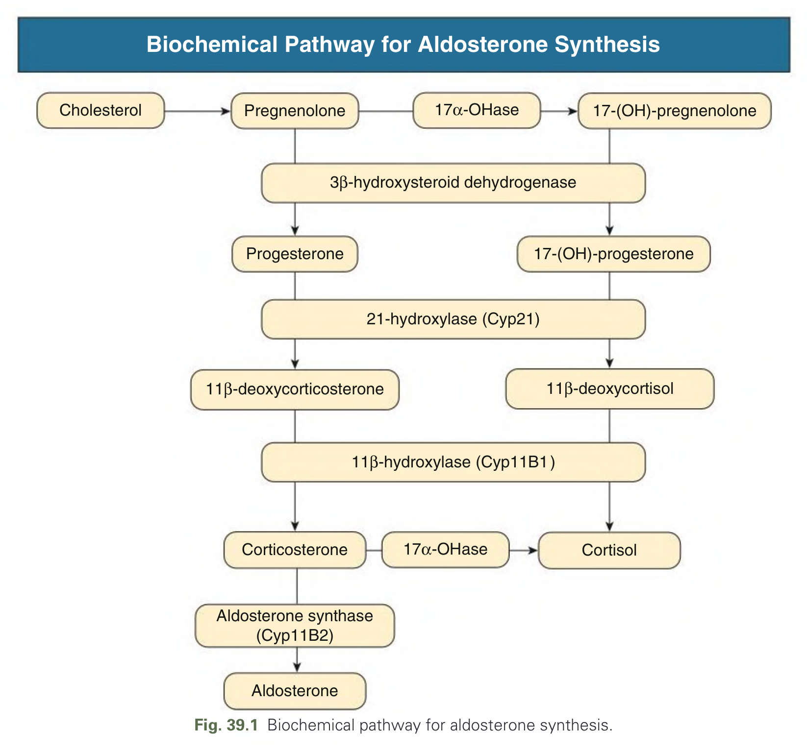

Fig. 39.1 Biochemical pathway for aldosterone synthesis.

---

### Fig_39_2

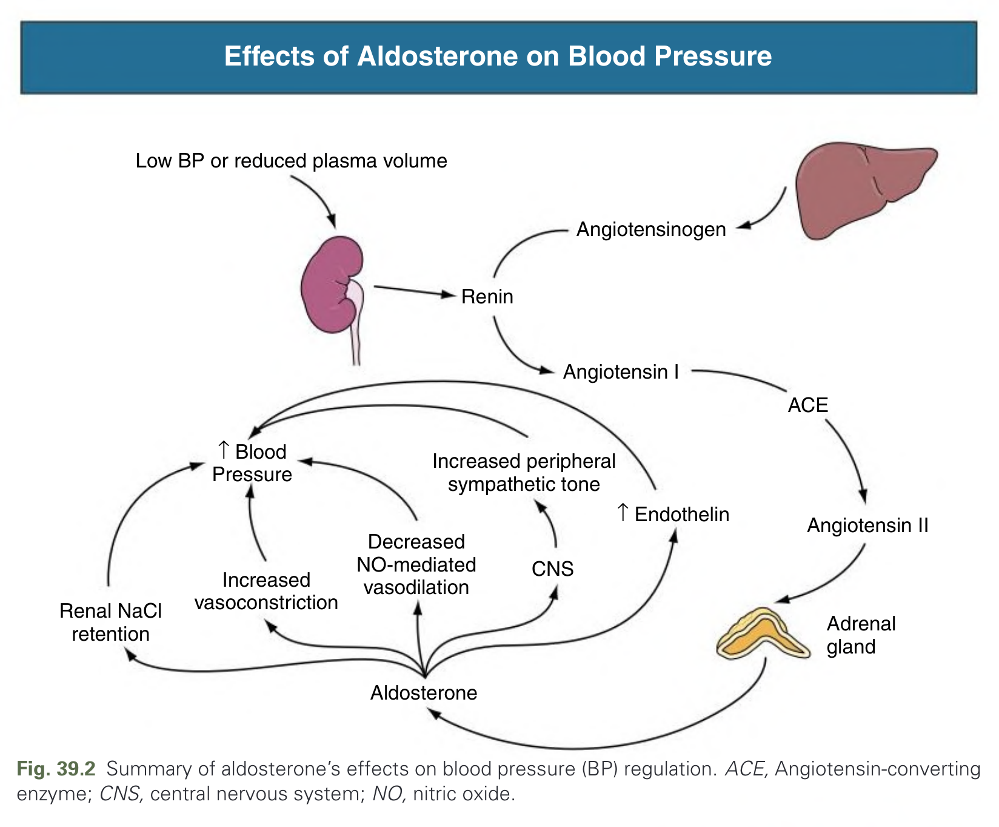

Fig. 39.2 Summary of aldosterone’s effects on blood pressure (BP) regulation. ACE, Angiotensin-converting enzyme; CNS, central nervous system; NO, nitric oxide.

---

### Fig_39_3

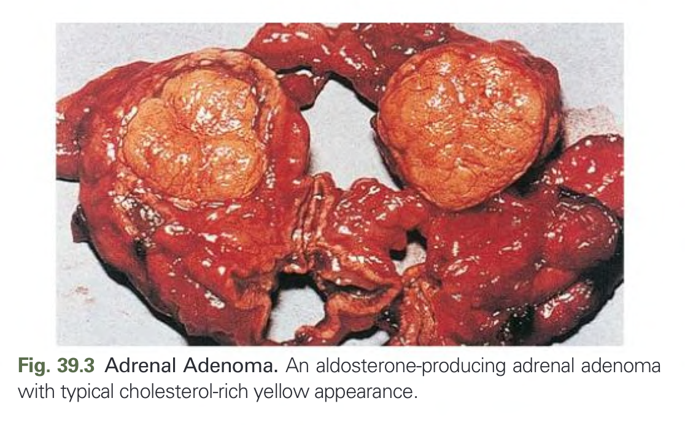

Fig. 39.3 Adrenal Adenoma. An aldosterone-producing adrenal adenoma with typical cholesterol-rich yellow appearance.

---

### Fig_39_4

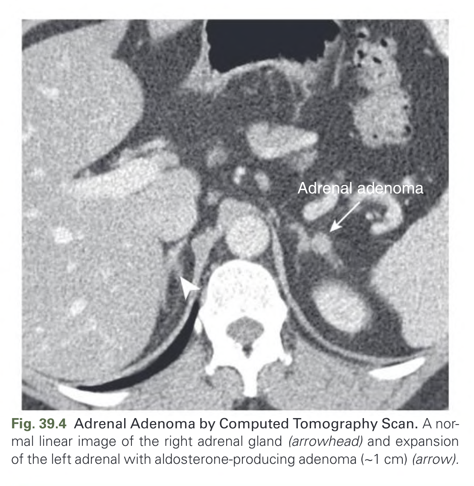

Fig. 39.4 Adrenal Adenoma by Computed Tomography Scan. A normal linear image of the right adrenal gland (arrowhead) and expansion of the left adrenal with aldosterone-producing adenoma (~1 cm) (arrow).

---

### Fig_39_5

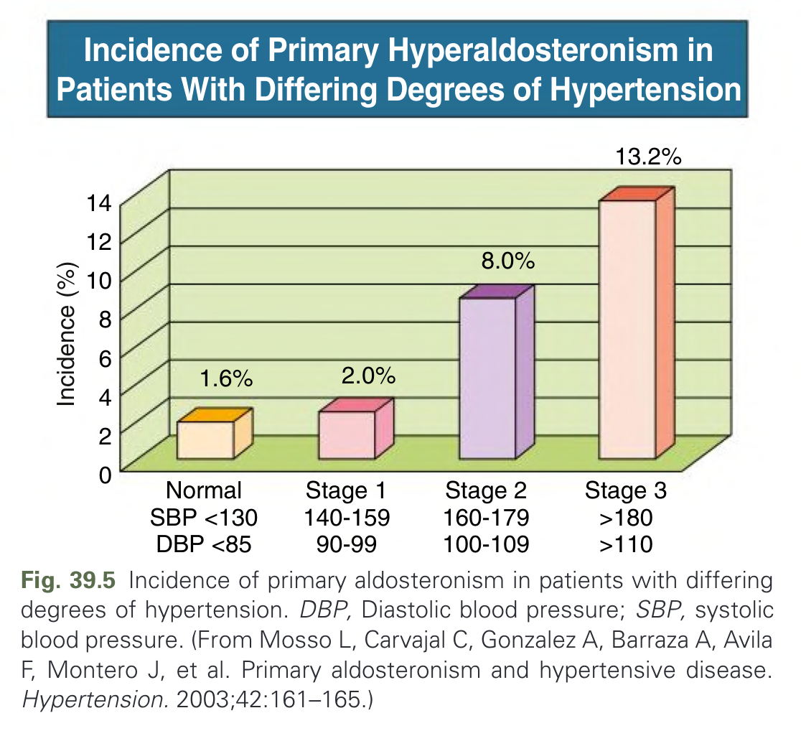

Fig. 39.5 Incidence of primary aldosteronism in patients with differing degrees of hypertension. DBP, Diastolic blood pressure; SBP, systolic blood pressure. (From Mosso L, Carvajal C, Gonzalez A, Barraza A, Avila F, Montero J, et al. Primary aldosteronism and hypertensive disease. Hypertension. 2003;42:161–165.)

---

### Fig_39_6

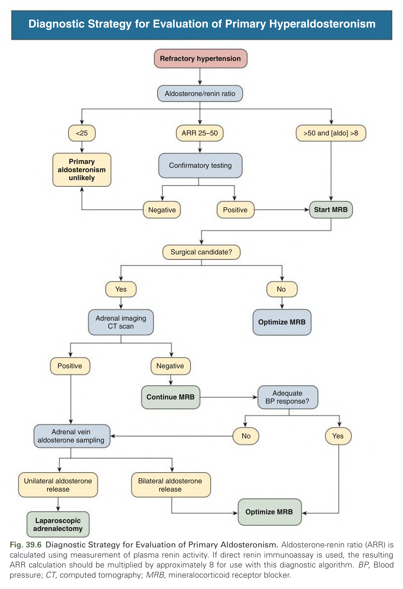

Fig. 39.6 Diagnostic Strategy for Evaluation of Primary Aldosteronism. Aldosterone-renin ratio (ARR) is calculated using measurement of plasma renin activity. If direct renin immunoassay is used, the resulting ARR calculation should be multiplied by approximately 8 for use with this diagnostic algorithm. BP, Blood pressure; CT, computed tomography; MRB, mineralocorticoid receptor blocker.

---

### Fig_39_7

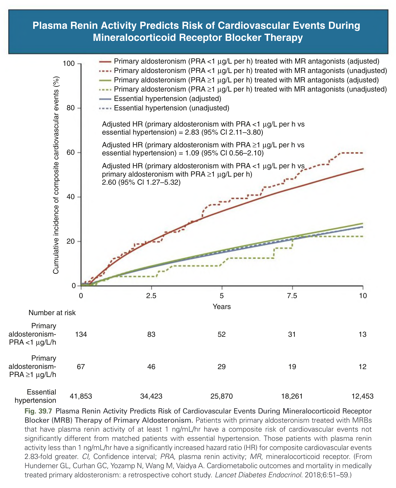

Fig. 39.7 Plasma Renin Activity Predicts Risk of Cardiovascular Events During Mineralocorticoid Receptor Blocker (MRB) Therapy of Primary Aldosteronism. Patients with primary aldosteronism treated with MRBs that have plasma renin activity of at least 1 ng/mL/hr have a composite risk of cardiovascular events not significantly different from matched patients with essential hypertension. Those patients with plasma renin activity less than 1 ng/mL/hr have a significantly increased hazard ratio (HR) for composite cardiovascular events 2.83-fold greater. CI, Confidence interval; PRA, plasma renin activity; MR, mineralocorticoid receptor. (From Hundemer GL, Curhan GC, Yozamp N, Wang M, Vaidya A. Cardiometabolic outcomes and mortality in medically treated primary aldosteronism: a retrospective cohort study. Lancet Diabetes Endocrinol. 2018;6:51–59.)

---

## Tables

### Table_39_1

#### Table Image

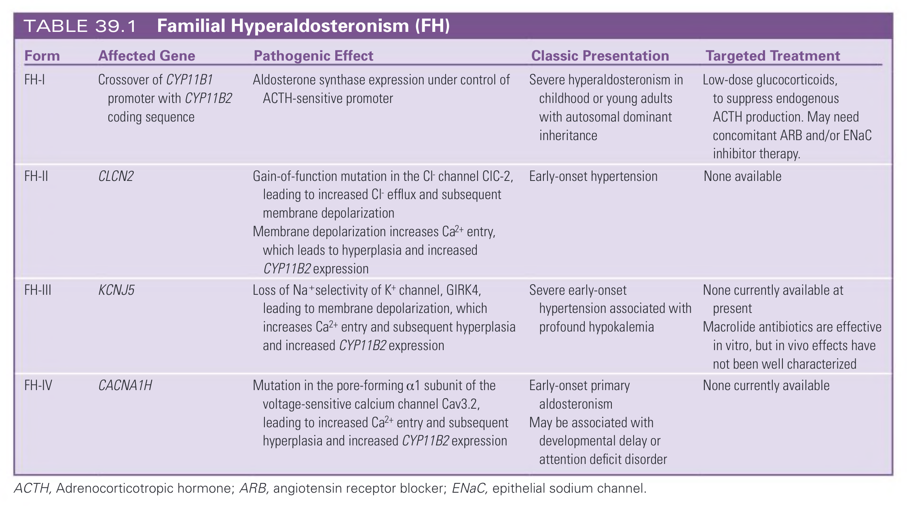

#### Table Data (CSV: [Table_39_1.csv](Table_39_1.csv))

```markdown
| Form | Affected Gene | Pathogenic Effect | Classic Presentation | Targeted Treatment |
| :--- | :--- | :--- | :--- | :--- |
| FH-I | Crossover of CYP11B1 promoter with CYP11B2 coding sequence | Aldosterone synthase expression under control of ACTH-sensitive promoter | Severe hyperaldosteronism in childhood or young adults with autosomal dominant inheritance | Low-dose glucocorticoids, to suppress endogenous ACTH production. May need concomitant ARB and/or ENaC inhibitor therapy. |
| FH-II | CLCN2 | Gain-of-function mutation in the Cl- channel CIC-2, leading to increased Cl- efflux and subsequent membrane depolarization. Membrane depolarization increases Ca2+ entry, which leads to hyperplasia and increased CYP11B2 expression | Early-onset hypertension | None available |
| FH-III | KCNJ5 | Loss of Na+selectivity of K+ channel, GIRK4, leading to membrane depolarization, which increases Ca2+ entry and subsequent hyperplasia and increased CYP11B2 expression | Severe early-onset hypertension associated with profound hypokalemia | None currently available at present. Macrolide antibiotics are effective in vitro, but in vivo effects have not been well characterized |
| FH-IV | CACNA1H | Mutation in the pore-forming α1 subunit of the voltage-sensitive calcium channel Cav3.2, leading to increased Ca2+ entry and subsequent hyperplasia and increased CYP11B2 expression | Early-onset primary aldosteronism. May be associated with developmental delay or attention deficit disorder | None currently available |
ACTH, Adrenocorticotropic hormone; ARB, angiotensin receptor blocker; ENaC, epithelial sodium channel.
```

TABLE 39.1 Familial Hyperaldosteronism (FH)

---

### Table_39_2

#### Table Image

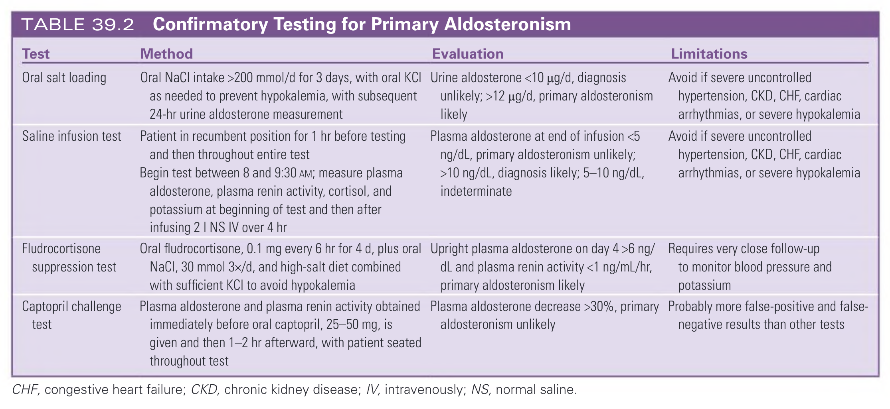

#### Table Data (CSV: [Table_39_2.csv](Table_39_2.csv))

```markdown
| Test | Method | Evaluation | Limitations |
| :--- | :--- | :--- | :--- |
| Oral salt loading | Oral NaCl intake >200 mmol/d for 3 days, with oral KCI as needed to prevent hypokalemia, with subsequent 24-hr urine aldosterone measurement | Urine aldosterone <10 µg/d, diagnosis unlikely; >12 µg/d, primary aldosteronism likely | Avoid if severe uncontrolled hypertension, CKD, CHF, cardiac arrhythmias, or severe hypokalemia |
| Saline infusion test | Patient in recumbent position for 1 hr before testing and then throughout entire test. Begin test between 8 and 9:30 AM; measure plasma aldosterone, plasma renin activity, cortisol, and potassium at beginning of test and then after infusing 2 L NS IV over 4 hr | Plasma aldosterone at end of infusion <5 ng/dL, primary aldosteronism unlikely; >10 ng/dL, diagnosis likely; 5-10 ng/dL, indeterminate | Avoid if severe uncontrolled hypertension, CKD, CHF, cardiac arrhythmias, or severe hypokalemia |
| Fludrocortisone suppression test | Oral fludrocortisone, 0.1 mg every 6 hr for 4 d, plus oral NaCl, 30 mmol 3x/d, and high-salt diet combined with sufficient KCI to avoid hypokalemia | Upright plasma aldosterone on day 4 >6 ng/dL and plasma renin activity <1 ng/mL/hr, primary aldosteronism likely | Requires very close follow-up to monitor blood pressure and potassium |
| Captopril challenge test | Plasma aldosterone and plasma renin activity obtained immediately before oral captopril, 25-50 mg, is given and then 1-2 hr afterward, with patient seated throughout test | Plasma aldosterone decrease >30%, primary aldosteronism unlikely | Probably more false-positive and false-negative results than other tests |
CHF, congestive heart failure; CKD, chronic kidney disease; IV, intravenously; NS, normal saline.
```

TABLE 39.2 Confirmatory Testing for Primary Aldosteronism

---

### Table_39_3

#### Table Image

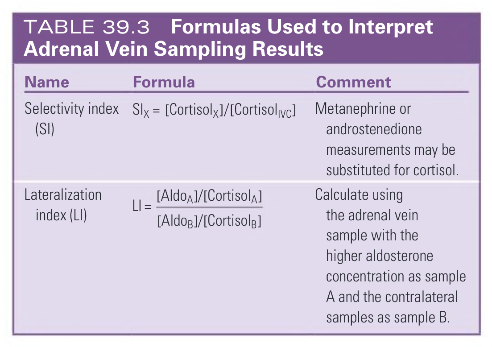

#### Table Data (CSV: [Table_39_3.csv](Table_39_3.csv))

```markdown
| Name | Formula | Comment |
| :--- | :--- | :--- |
| Selectivity index (SI) | SI<sub>X</sub> = [Cortisol<sub>X</sub>]/[Cortisol<sub>IVC</sub>] | Metanephrine or androstenedione measurements may be substituted for cortisol. |
| Lateralization index (LI) | LI = ([Aldo<sub>A</sub>]/[Cortisol<sub>A</sub>]) / ([Aldo<sub>B</sub>]/[Cortisol<sub>B</sub>]) | Calculate using the adrenal vein sample with the higher aldosterone concentration as sample A and the contralateral samples as sample B. |
```

TABLE 39.3 Formulas Used to Interpret Adrenal Vein Sampling Results

---

## Boxes

### Box_39_1

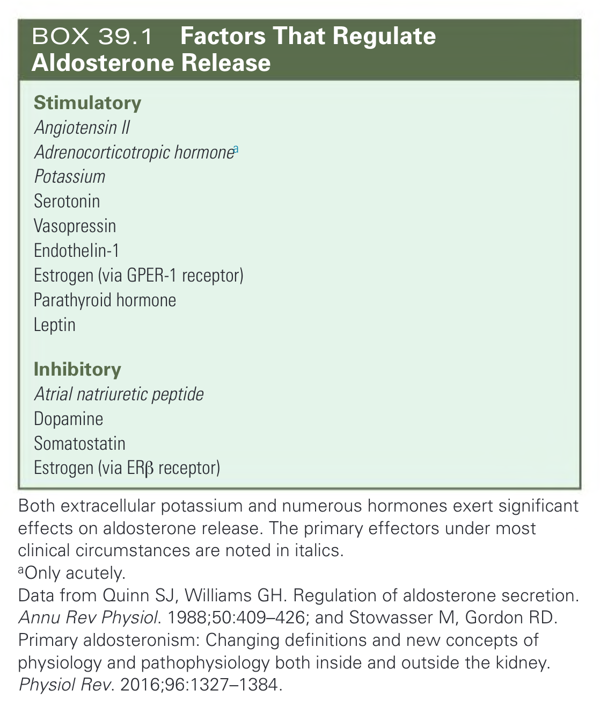

#### Box Text

```markdown
**Stimulatory**
* Angiotensin II
* Adrenocorticotropic hormoneᵃ
* Potassium
* Serotonin
* Vasopressin
* Endothelin-1
* Estrogen (via GPER-1 receptor)
* Parathyroid hormone
* Leptin

**Inhibitory**
* Atrial natriuretic peptide
* Dopamine
* Somatostatin
* Estrogen (via ERβ receptor)

Both extracellular potassium and numerous hormones exert significant effects on aldosterone release. The primary effectors under most clinical circumstances are noted in italics.
ᵃOnly acutely.
Data from Quinn SJ, Williams GH. Regulation of aldosterone secretion. Annu Rev Physiol. 1988;50:409-426; and Stowasser M, Gordon RD. Primary aldosteronism: Changing definitions and new concepts of physiology and pathophysiology both inside and outside the kidney. Physiol Rev. 2016;96:1327-1384.
```

BOX 39.1 Factors That Regulate Aldosterone Release

---
