# 040. Other Endocrine Causes of Hypertension - Figures and Tables Index

This document lists all figures, tables and boxes extracted from `040. Other Endocrine Causes of Hypertension.pdf`.

## Table of Contents
- [Figures](#figures)
- [Tables](#tables)
- [Boxes](#boxes)

---

## Figures

### Fig_40_1

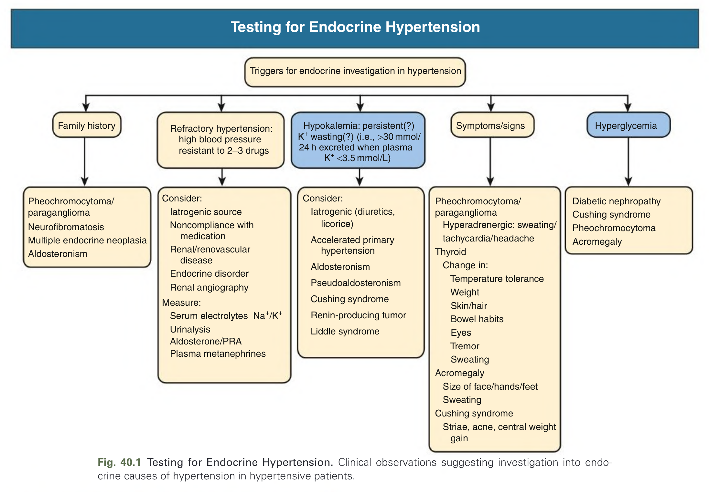

Fig. 40.1 Testing for Endocrine Hypertension. Clinical observations suggesting investigation into endocrine causes of hypertension in hypertensive patients.

---

### Fig_40_2

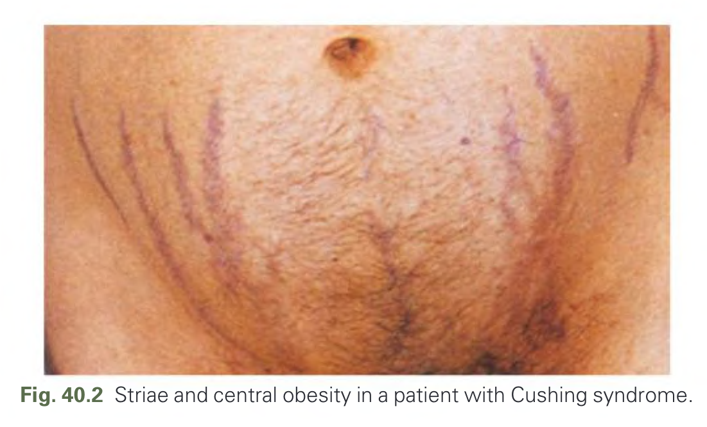

Fig. 40.2 Striae and central obesity in a patient with Cushing syndrome.

---

### Fig_40_3

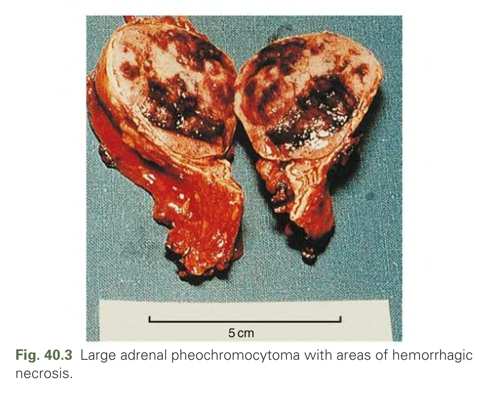

Fig. 40.3 Large adrenal pheochromocytoma with areas of hemorrhagic necrosis.

---

### Fig_40_4

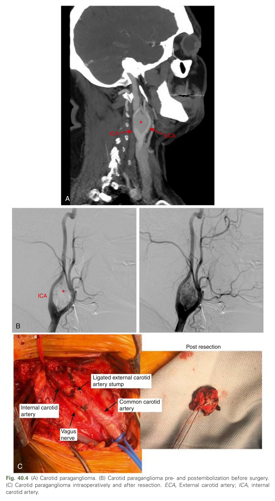

Fig. 40.4 (A) Carotid paraganglioma. (B) Carotid paraganglioma pre- and postembolization before surgery. (C) Carotid paraganglioma intraoperatively and after resection. ECA, External carotid artery; ICA, internal carotid artery.

---

### Fig_40_5

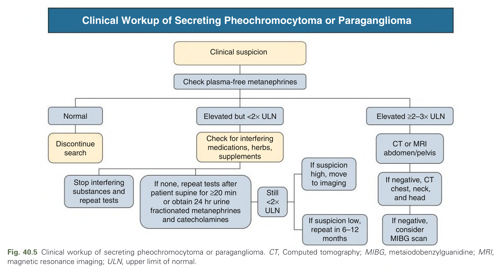

Fig. 40.5 Clinical workup of secreting pheochromocytoma or paraganglioma. CT, Computed tomography; MIBG, metaiodobenzylguanidine; MRI, magnetic resonance imaging; ULN, upper limit of normal.

---

### Fig_40_6

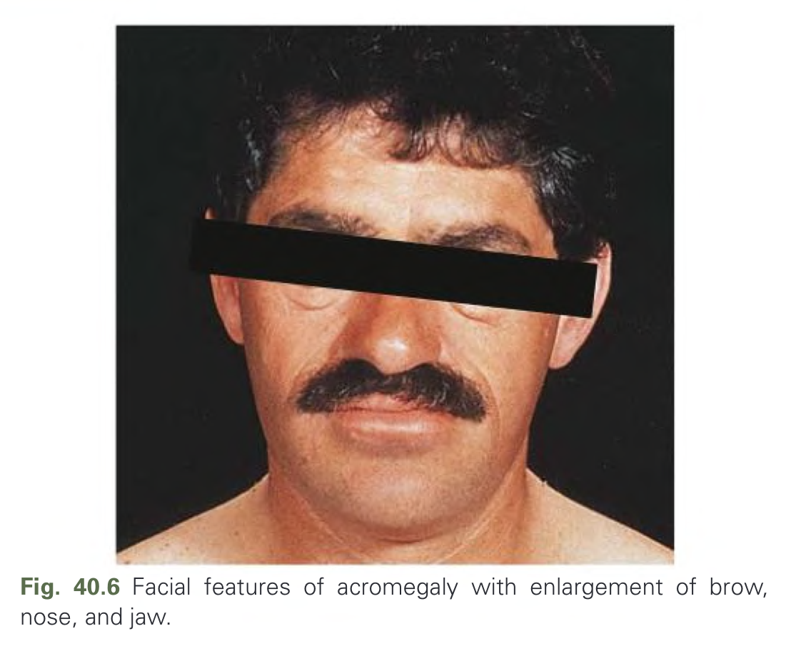

Fig. 40.6 Facial features of acromegaly with enlargement of brow, nose, and jaw.

---

### Fig_40_7

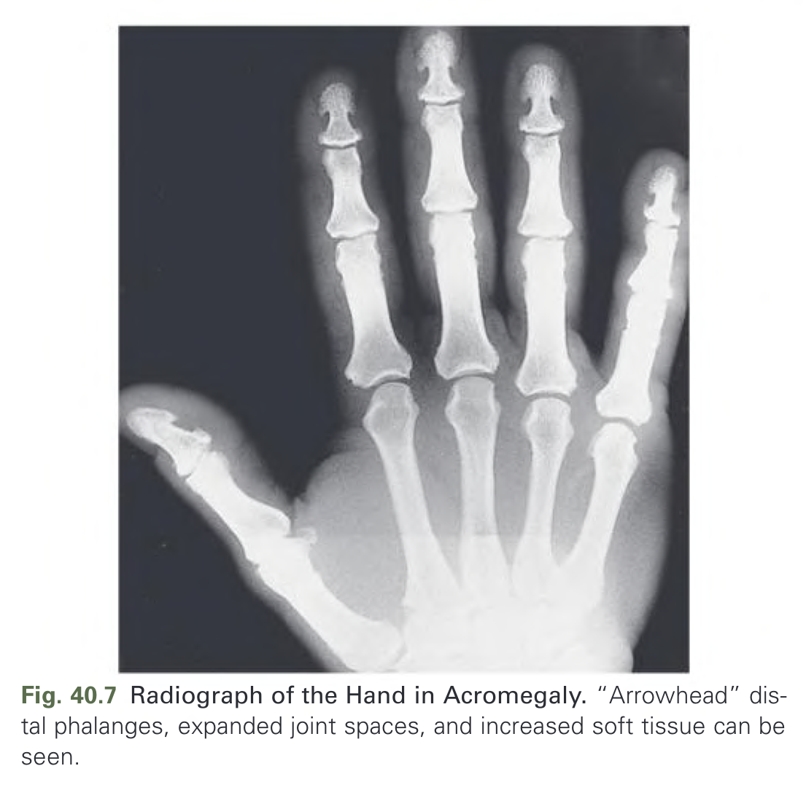

Fig. 40.7 Radiograph of the Hand in Acromegaly. “Arrowhead” distal phalanges, expanded joint spaces, and increased soft tissue can be seen.

---

## Tables

### Table_40_1

#### Table Image

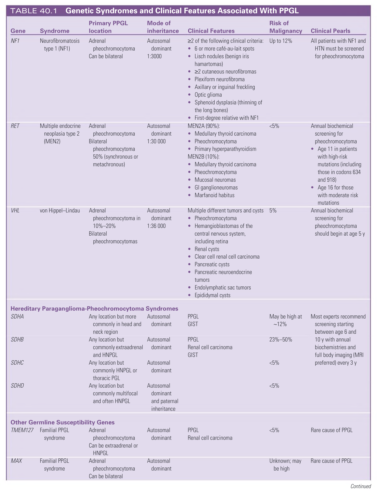

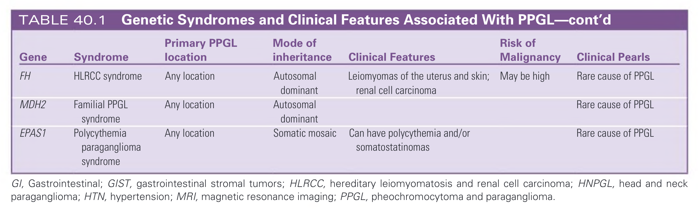

#### Table Data (CSV: [Table_40_1.csv](Table_40_1.csv))

```markdown
| Gene | Syndrome | Primary PPGL location | Mode of inheritance | Clinical Features | Risk of Malignancy | Clinical Pearls |
| :--- | :--- | :--- | :--- | :--- | :--- | :--- |
| **NF1** | Neurofibromatosis type 1 (NF1) | Adrenal pheochromocytoma; Can be bilateral | Autosomal dominant; 1:3000 | ≥2 of the following clinical criteria:<br>• 6 or more café-au-lait spots<br>• Lisch nodules (benign iris hamartomas)<br>• ≥2 cutaneous neurofibromas<br>• Plexiform neurofibroma<br>• Axillary or inguinal freckling<br>• Optic glioma<br>• Sphenoid dysplasia (thinning of the long bones)<br>• First-degree relative with NF1 | Up to 12% | All patients with NF1 and HTN must be screened for pheochromocytoma |
| **RET** | Multiple endocrine neoplasia type 2 (MEN2) | Adrenal pheochromocytoma; Bilateral pheochromocytoma 50% (synchronous or metachronous) | Autosomal dominant; 1:30 000 | MEN2A (90%):<br>• Medullary thyroid carcinoma<br>• Pheochromocytoma<br>• Primary hyperparathyroidism<br>MEN2B (10%):<br>• Medullary thyroid carcinoma<br>• Pheochromocytoma<br>• Mucosal neuromas<br>• GI ganglioneuromas<br>• Marfanoid habitus | <5% | Annual biochemical screening for pheochromocytoma:<br>• Age 11 in patients with high-risk mutations (including those in codons 634 and 918)<br>• Age 16 for those with moderate risk mutations |
| **VHL** | von Hippel-Lindau | Adrenal pheochromocytoma in 10%–20%; Bilateral pheochromocytomas | Autosomal dominant; 1:36 000 | Multiple different tumors and cysts:<br>• Pheochromocytoma<br>• Hemangioblastomas of the central nervous system, including retina<br>• Renal cysts<br>• Clear cell renal cell carcinoma<br>• Pancreatic cysts<br>• Pancreatic neuroendocrine tumors<br>• Endolymphatic sac tumors<br>• Epididymal cysts | 5% | Annual biochemical screening for pheochromocytoma should begin at age 5 y |
| **Hereditary Paraganglioma-Pheochromocytoma Syndromes** | | | | | | |
| **SDHA** | | Any location but more commonly in head and neck region | Autosomal dominant | PPGL; GIST | May be high at ~12% | Most experts recommend screening starting between age 6 and 10 y with annual biochemistries and full body imaging (MRI preferred) every 3 y |
| **SDHB** | | Any location but commonly extraadrenal and HNPGL | Autosomal dominant | PPGL; Renal cell carcinoma; GIST | 23%–50% | |
| **SDHC** | | Any location but commonly HNPGL or thoracic PGL | Autosomal dominant | | <5% | |
| **SDHD** | | Any location but commonly multifocal and often HNPGL | Autosomal dominant and paternal inheritance | | <5% | |
| **Other Germline Susceptibility Genes** | | | | | | |
| **TMEM127** | Familial PPGL syndrome | Adrenal pheochromocytoma; Can be extraadrenal or HNPGL | Autosomal dominant | PPGL; Renal cell carcinoma | <5% | Rare cause of PPGL |
| **MAX** | Familial PPGL syndrome | Adrenal pheochromocytoma; Can be bilateral | Autosomal dominant | | Unknown; may be high | Rare cause of PPGL |
| **FH** | HLRCC syndrome | Any location | Autosomal dominant | Leiomyomas of the uterus and skin; renal cell carcinoma | May be high | Rare cause of PPGL |
| **MDH2** | Familial PPGL syndrome | Any location | Autosomal dominant | | | Rare cause of PPGL |
| **EPAS1** | Polycythemia paraganglioma syndrome | Any location | Somatic mosaic | Can have polycythemia and/or somatostatinomas | | Rare cause of PPGL |

GI, Gastrointestinal; GIST, gastrointestinal stromal tumors; HLRCC, hereditary leiomyomatosis and renal cell carcinoma; HNPGL, head and neck paraganglioma; HTN, hypertension; MRI, magnetic resonance imaging; PPGL, pheochromocytoma and paraganglioma.
```

TABLE 40.1 Genetic Syndromes and Clinical Features Associated With PPGL

---

### Table_40_2

#### Table Image

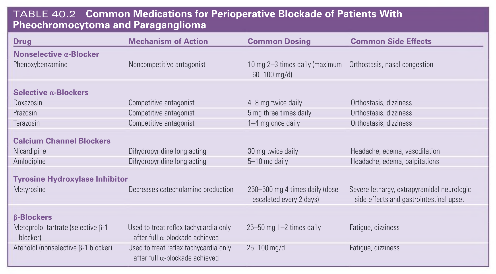

#### Table Data (CSV: [Table_40_2.csv](Table_40_2.csv))

```markdown
| Drug | Mechanism of Action | Common Dosing | Common Side Effects |
| :--- | :--- | :--- | :--- |
| **Nonselective α-Blocker** | | | |
| Phenoxybenzamine | Noncompetitive antagonist | 10 mg 2-3 times daily (maximum 60-100 mg/d) | Orthostasis, nasal congestion |
| **Selective α-Blockers** | | | |
| Doxazosin | Competitive antagonist | 4-8 mg twice daily | Orthostasis, dizziness |
| Prazosin | Competitive antagonist | 5 mg three times daily | Orthostasis, dizziness |
| Terazosin | Competitive antagonist | 1-4 mg once daily | Orthostasis, dizziness |
| **Calcium Channel Blockers** | | | |
| Nicardipine | Dihydropyridine long acting | 30 mg twice daily | Headache, edema, vasodilation |
| Amlodipine | Dihydropyridine long acting | 5-10 mg daily | Headache, edema, palpitations |
| **Tyrosine Hydroxylase Inhibitor** | | | |
| Metyrosine | Decreases catecholamine production | 250-500 mg 4 times daily (dose escalated every 2 days) | Severe lethargy, extrapyramidal neurologic side effects and gastrointestinal upset |
| **β-Blockers** | | | |
| Metoprolol tartrate (selective β-1 blocker) | Used to treat reflex tachycardia only after full α-blockade achieved | 25-50 mg 1-2 times daily | Fatigue, dizziness |
| Atenolol (nonselective β-1 blocker) | Used to treat reflex tachycardia only after full α-blockade achieved | 25-100 mg/d | Fatigue, dizziness |
```

TABLE 40.2 Common Medications for Perioperative Blockade of Patients With Pheochromocytoma and Paraganglioma

---

## Boxes

### Box_40_1

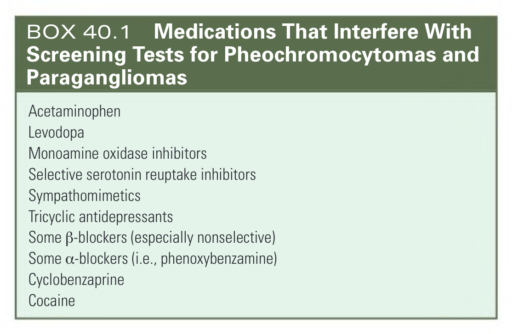

#### Box Text

```markdown
* Acetaminophen
* Levodopa
* Monoamine oxidase inhibitors
* Selective serotonin reuptake inhibitors
* Sympathomimetics
* Tricyclic antidepressants
* Some B-blockers (especially nonselective)
* Some a-blockers (i.e., phenoxybenzamine)
* Cyclobenzaprine
* Cocaine
```

BOX 40.1 Medications That Interfere With Screening Tests for Pheochromocytomas and Paragangliomas

---

### Box_40_2

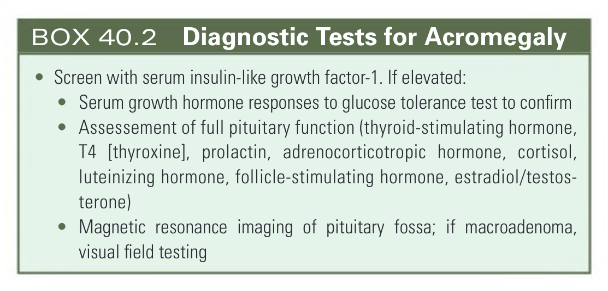

#### Box Text

```markdown
* Screen with serum insulin-like growth factor-1. If elevated:
* Serum growth hormone responses to glucose tolerance test to confirm
* Assessement of full pituitary function (thyroid-stimulating hormone, T4 [thyroxine], prolactin, adrenocorticotropic hormone, cortisol, luteinizing hormone, follicle-stimulating hormone, estradiol/testosterone)
* Magnetic resonance imaging of pituitary fossa; if macroadenoma, visual field testing
```

BOX 40.2 Diagnostic Tests for Acromegaly

---
