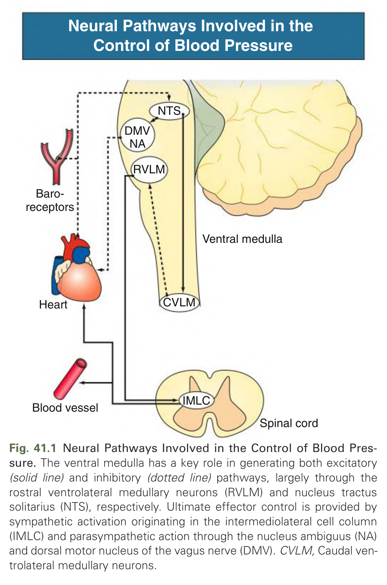
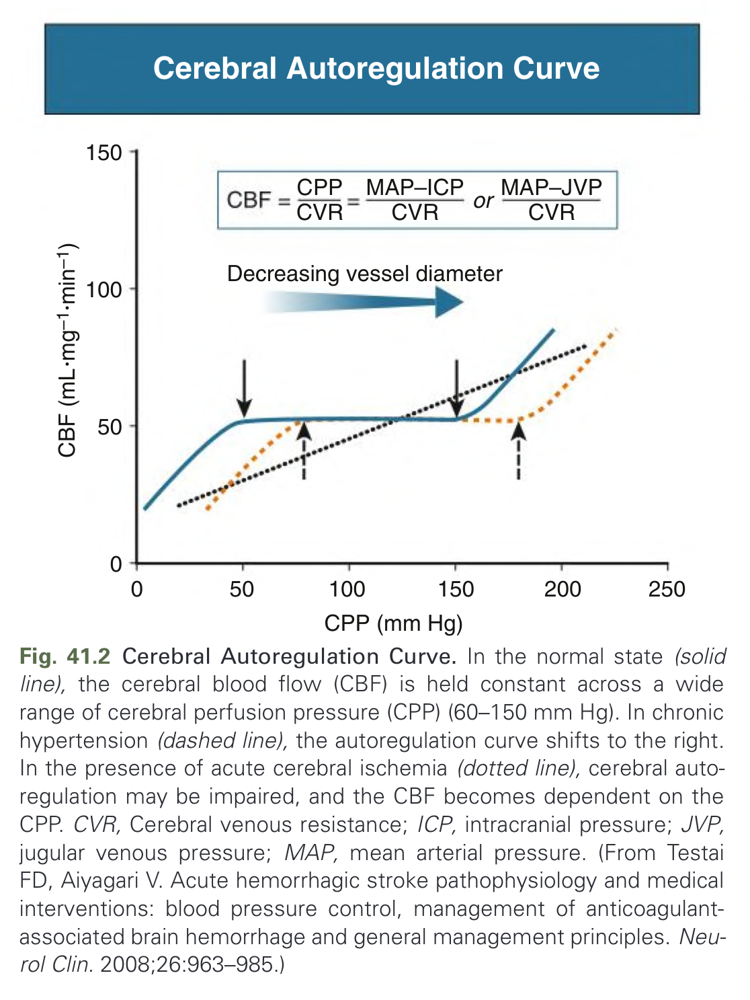
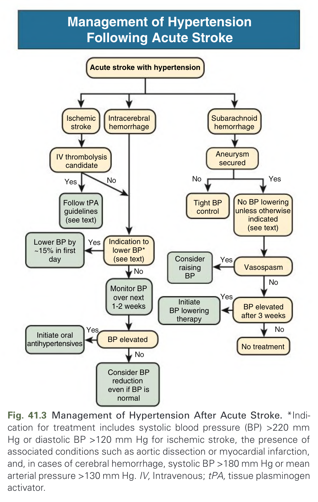
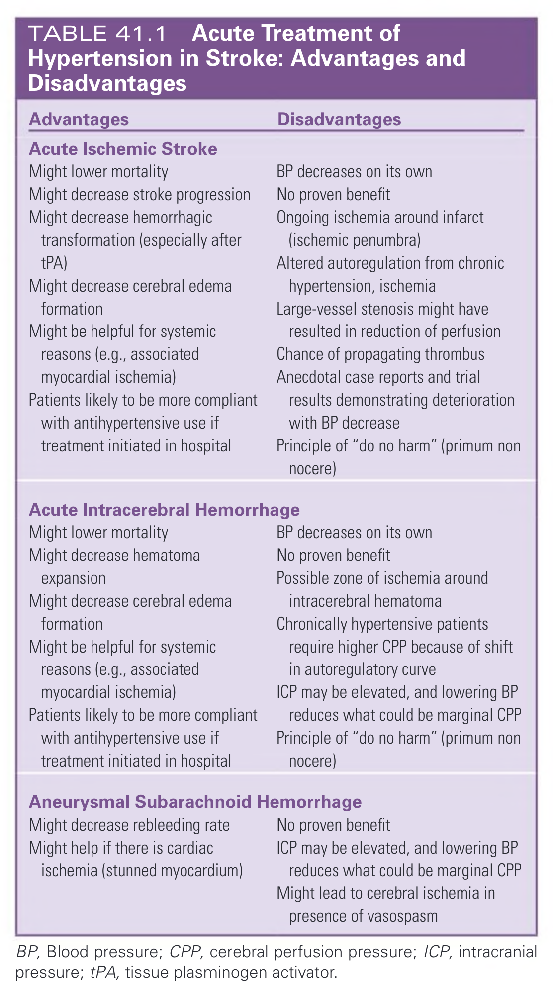
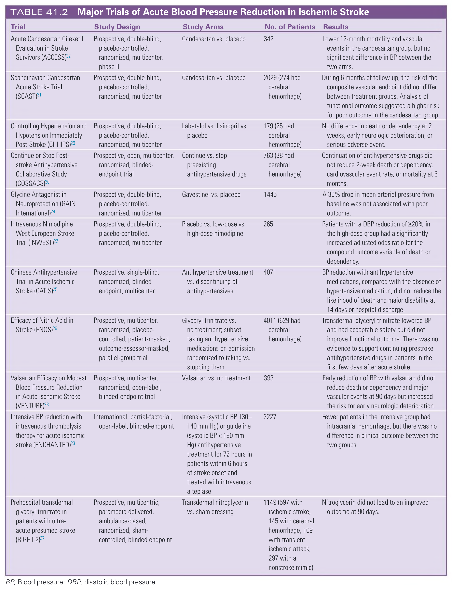
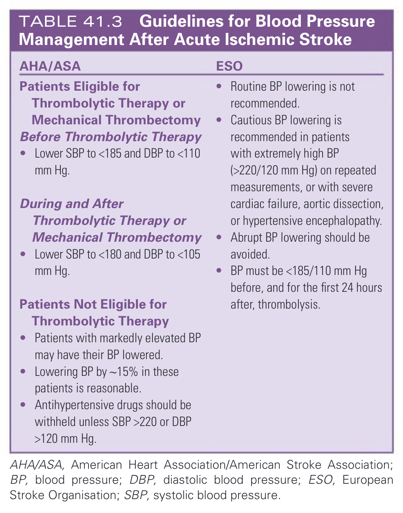
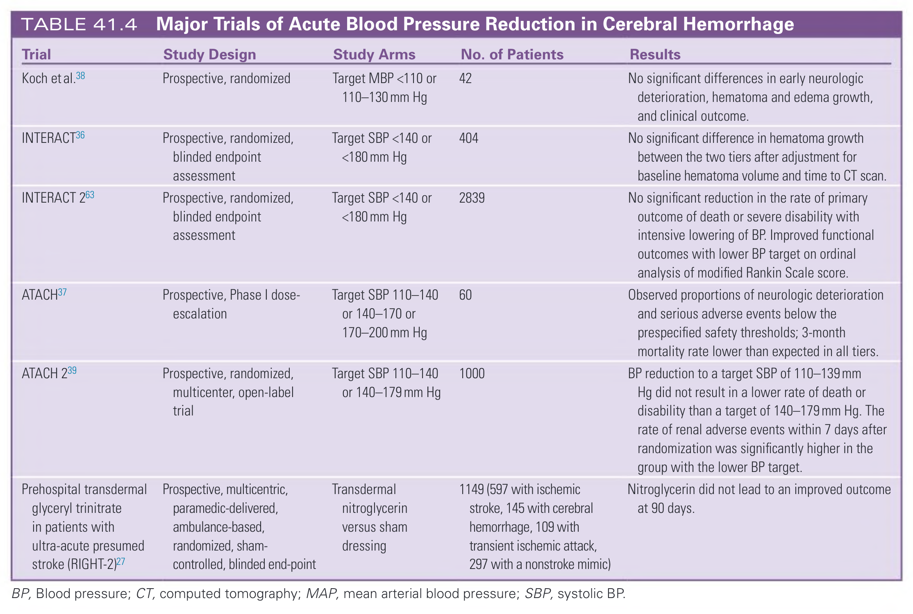
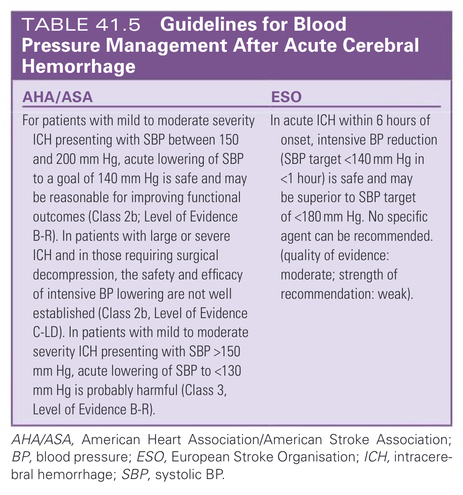
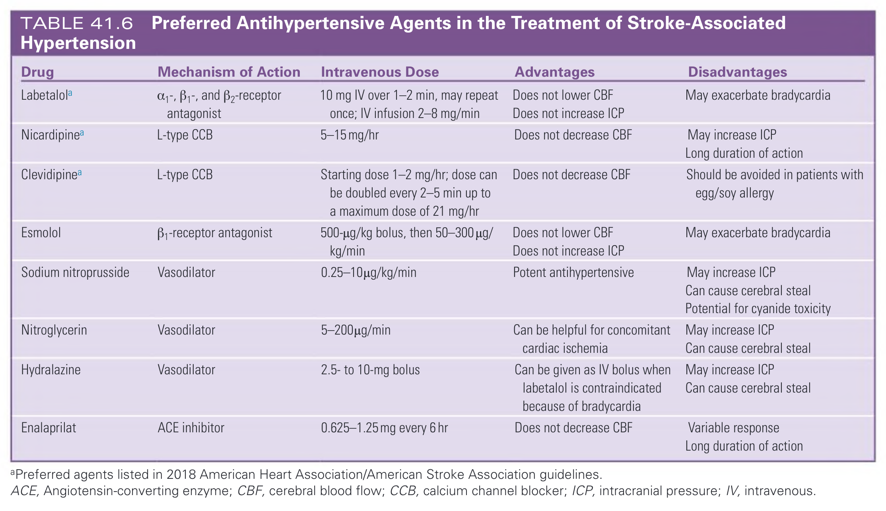
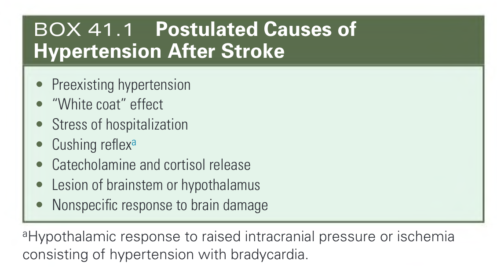

# 041. Neurogenic Hypertension, Including Hypertension Associated With Stroke or Spinal Cord Injury - Figures and Tables Index

This document lists all figures, tables and boxes extracted from `041. Neurogenic Hypertension, Including Hypertension Associated With Stroke or Spinal Cord Injury.pdf`.

## Table of Contents
- [Figures](#figures)
- [Tables](#tables)
- [Boxes](#boxes)

---

## Figures

### Fig_41_1



Fig. 41.1 Neural Pathways Involved in the Control of Blood Pressure. The ventral medulla has a key role in generating both excitatory (solid line) and inhibitory (dotted line) pathways, largely through the rostral ventrolateral medullary neurons (RVLM) and nucleus tractus solitarius (NTS), respectively. Ultimate effector control is provided by sympathetic activation originating in the intermediolateral cell column (IMLC) and parasympathetic action through the nucleus ambiguus (NA) and dorsal motor nucleus of the vagus nerve (DMV). CVLM, Caudal ventrolateral medullary neurons.

---

### Fig_41_2



Fig. 41.2 Cerebral Autoregulation Curve. In the normal state (solid line), the cerebral blood flow (CBF) is held constant across a wide range of cerebral perfusion pressure (CPP) (60–150 mm Hg). In chronic hypertension (dashed line), the autoregulation curve shifts to the right. In the presence of acute cerebral ischemia (dotted line), cerebral autoregulation may be impaired, and the CBF becomes dependent on the CPP. CVR, Cerebral venous resistance; ICP, intracranial pressure; JVP, jugular venous pressure; MAP, mean arterial pressure. (From Testai FD, Aiyagari V. Acute hemorrhagic stroke pathophysiology and medical interventions: blood pressure control, management of anticoagulant-associated brain hemorrhage and general management principles. Neurol Clin. 2008;26:963–985.)

---

### Fig_41_3



Fig. 41.3 Management of Hypertension After Acute Stroke. *Indication for treatment includes systolic blood pressure (BP) >220 mm Hg or diastolic BP >120 mm Hg for ischemic stroke, the presence of associated conditions such as aortic dissection or myocardial infarction, and, in cases of cerebral hemorrhage, systolic BP >180 mm Hg or mean arterial pressure >130 mm Hg. IV, Intravenous; tPA, tissue plasminogen activator.

---

## Tables

### Table_41_1

#### Table Image



#### Table Data (CSV: [Table_41_1.csv](Table_41_1.csv))

```markdown
| Advantages | Disadvantages |
| :--- | :--- |
| **Acute Ischemic Stroke** | |
| Might lower mortality | BP decreases on its own |
| Might decrease stroke progression | No proven benefit |
| Might decrease hemorrhagic transformation (especially after tPA) | Ongoing ischemia around infarct (ischemic penumbra) |
| Might decrease cerebral edema formation | Altered autoregulation from chronic hypertension, ischemia |
| Might be helpful for systemic reasons (e.g., associated myocardial ischemia) | Large-vessel stenosis might have resulted in reduction of perfusion |
| Patients likely to be more compliant with antihypertensive use if treatment initiated in hospital | Chance of propagating thrombus |
| | Anecdotal case reports and trial results demonstrating deterioration with BP decrease |
| | Principle of "do no harm" (primum non nocere) |
| **Acute Intracerebral Hemorrhage** | |
| Might lower mortality | BP decreases on its own |
| Might decrease hematoma expansion | No proven benefit |
| Might decrease cerebral edema formation | Possible zone of ischemia around intracerebral hematoma |
| Might be helpful for systemic reasons (e.g., associated myocardial ischemia) | Chronically hypertensive patients require higher CPP because of shift in autoregulatory curve |
| Patients likely to be more compliant with antihypertensive use if treatment initiated in hospital | ICP may be elevated, and lowering BP reduces what could be marginal CPP |
| | Principle of "do no harm" (primum non nocere) |
| **Aneurysmal Subarachnoid Hemorrhage** | |
| Might decrease rebleeding rate | No proven benefit |
| Might help if there is cardiac ischemia (stunned myocardium) | ICP may be elevated, and lowering BP reduces what could be marginal CPP |
| | Might lead to cerebral ischemia in presence of vasospasm |

BP, Blood pressure; CPP, cerebral perfusion pressure; ICP, intracranial pressure; tPA, tissue plasminogen activator.
```

TABLE 41.1 Acute Treatment of Hypertension in Stroke: Advantages and Disadvantages

---

### Table_41_2

#### Table Image



#### Table Data (CSV: [Table_41_2.csv](Table_41_2.csv))

```markdown
| Trial | Study Design | Study Arms | No. of Patients | Results |
| :--- | :--- | :--- | :--- | :--- |
| Acute Candesartan Cilexetil Evaluation in Stroke Survivors (ACCESS) | Prospective, double-blind, placebo-controlled, randomized, multicenter, phase II | Candesartan vs. placebo | 342 | Lower 12-month mortality and vascular events in the candesartan group, but no significant difference in BP between the two arms. |
| Scandinavian Candesartan Acute Stroke Trial (SCAST) | Prospective, double-blind, placebo-controlled, randomized, multicenter | Candesartan vs. placebo | 2029 (274 had cerebral hemorrhage) | During 6 months of follow-up, the risk of the composite vascular endpoint did not differ between treatment groups. Analysis of functional outcome suggested a higher risk for poor outcome in the candesartan group. |
| Controlling Hypertension and Hypotension Immediately Post-Stroke (CHHIPS) | Prospective, double-blind, placebo-controlled, randomized, multicenter | Labetalol vs. lisinopril vs. placebo | 179 (25 had cerebral hemorrhage) | No difference in death or dependency at 2 weeks, early neurologic deterioration, or serious adverse event. |
| Continue or Stop Post-stroke Antihypertensive Collaborative Study (COSSACS) | Prospective, open, multicenter, randomized, blinded-endpoint trial | Continue vs. stop preexisting antihypertensive drugs | 763 (38 had cerebral hemorrhage) | Continuation of antihypertensive drugs did not reduce 2-week death or dependency, cardiovascular event rate, or mortality at 6 months. |
| Glycine Antagonist in Neuroprotection (GAIN International) | Prospective, double-blind, placebo-controlled, randomized, multicenter | Gavestinel vs. placebo | 1445 | A 30% drop in mean arterial pressure from baseline was not associated with poor outcome. |
| Intravenous Nimodipine West European Stroke Trial (INWEST) | Prospective, double-blind, placebo-controlled, randomized, multicenter | Placebo vs. low-dose vs. high-dose nimodipine | 265 | Patients with a DBP reduction of ≥20% in the high-dose group had a significantly increased adjusted odds ratio for the compound outcome variable of death or dependency. |
| Chinese Antihypertensive Trial in Acute Ischemic Stroke (CATIS) | Prospective, single-blind, randomized, blinded endpoint, multicenter | Antihypertensive treatment vs. discontinuing all antihypertensives | 4071 | BP reduction with antihypertensive medications, compared with the absence of hypertensive medication, did not reduce the likelihood of death and major disability at 14 days or hospital discharge. |
| Efficacy of Nitric Acid in Stroke (ENOS) | Prospective, multicenter, randomized, placebo-controlled, patient-masked, outcome-assessor-masked, parallel-group trial | Glyceryl trinitrate vs. no treatment; subset taking antihypertensive medications on admission randomized to taking vs. stopping them | 4011 (629 had cerebral hemorrhage) | Transdermal glyceryl trinitrate lowered BP and had acceptable safety but did not improve functional outcome. There was no evidence to support continuing prestroke antihypertensive drugs in patients in the first few days after acute stroke. |
| Valsartan Efficacy on Modest Blood Pressure Reduction in Acute Ischemic Stroke (VENTURE) | Prospective, multicenter, randomized, open-label, blinded-endpoint trial | Valsartan vs. no treatment | 393 | Early reduction of BP with valsartan did not reduce death or dependency and major vascular events at 90 days but increased the risk for early neurologic deterioration. |
| Intensive BP reduction with intravenous thrombolysis therapy for acute ischemic stroke (ENCHANTED) | International, partial-factorial, open-label, blinded-endpoint | Intensive (systolic BP 130-140 mm Hg) or guideline (systolic BP < 180 mm Hg) antihypertensive treatment for 72 hours in patients within 6 hours of stroke onset and treated with intravenous alteplase | 2227 | Fewer patients in the intensive group had intracranial hemorrhage, but there was no difference in clinical outcome between the two groups. |
| Prehospital transdermal glyceryl trinitrate in patients with ultra-acute presumed stroke (RIGHT-2) | Prospective, multicentric, paramedic-delivered, ambulance-based, randomized, sham-controlled, blinded endpoint | Transdermal nitroglycerin vs. sham dressing | 1149 (597 with ischemic stroke, 145 with cerebral hemorrhage, 109 with transient ischemic attack, 297 with a nonstroke mimic) | Nitroglycerin did not lead to an improved outcome at 90 days. |

BP, Blood pressure; DBP, diastolic blood pressure.
```

TABLE 41.2 Major Trials of Acute Blood Pressure Reduction in Ischemic Stroke

---

### Table_41_3

#### Table Image



#### Table Data (CSV: [Table_41_3.csv](Table_41_3.csv))

```markdown
| AHA/ASA | ESO |
| :--- | :--- |
| **Patients Eligible for Thrombolytic Therapy or Mechanical Thrombectomy** | |
| **Before Thrombolytic Therapy** | |
| • Lower SBP to <185 and DBP to <110 mm Hg. | • Routine BP lowering is not recommended. |
| **During and After Thrombolytic Therapy or Mechanical Thrombectomy** | • Cautious BP lowering is recommended in patients with extremely high BP (>220/120 mm Hg) on repeated measurements, or with severe cardiac failure, aortic dissection, or hypertensive encephalopathy. |
| • Lower SBP to <180 and DBP to <105 mm Hg. | • Abrupt BP lowering should be avoided. |
| **Patients Not Eligible for Thrombolytic Therapy** | • BP must be <185/110 mm Hg before, and for the first 24 hours after, thrombolysis. |
| • Patients with markedly elevated BP may have their BP lowered. | |
| • Lowering BP by ~15% in these patients is reasonable. | |
| • Antihypertensive drugs should be withheld unless SBP >220 or DBP >120 mm Hg. | |

AHA/ASA, American Heart Association/American Stroke Association; BP, blood pressure; DBP, diastolic blood pressure; ESO, European Stroke Organisation; SBP, systolic blood pressure.
```

TABLE 41.3 Guidelines for Blood Pressure Management After Acute Ischemic Stroke

---

### Table_41_4

#### Table Image



#### Table Data (CSV: [Table_41_4.csv](Table_41_4.csv))

```markdown
| Trial | Study Design | Study Arms | No. of Patients | Results |
| :--- | :--- | :--- | :--- | :--- |
| Koch et al. | Prospective, randomized | Target MBP <110 or 110-130 mm Hg | 42 | No significant differences in early neurologic deterioration, hematoma and edema growth, and clinical outcome. |
| INTERACT | Prospective, randomized, blinded endpoint assessment | Target SBP <140 or <180 mm Hg | 404 | No significant difference in hematoma growth between the two tiers after adjustment for baseline hematoma volume and time to CT scan. |
| INTERACT 2 | Prospective, randomized, blinded endpoint assessment | Target SBP <140 or <180 mm Hg | 2839 | No significant reduction in the rate of primary outcome of death or severe disability with intensive lowering of BP. Improved functional outcomes with lower BP target on ordinal analysis of modified Rankin Scale score. |
| ATACH | Prospective, Phase I dose-escalation | Target SBP 110-140 or 140-170 or 170-200 mm Hg | 60 | Observed proportions of neurologic deterioration and serious adverse events below the prespecified safety thresholds; 3-month mortality rate lower than expected in all tiers. |
| ATACH 2 | Prospective, randomized, multicenter, open-label trial | Target SBP 110-140 or 140-179 mm Hg | 1000 | BP reduction to a target SBP of 110-139 mm Hg did not result in a lower rate of death or disability than a target of 140-179 mm Hg. The rate of renal adverse events within 7 days after randomization was significantly higher in the group with the lower BP target. |
| Prehospital transdermal glyceryl trinitrate in patients with ultra-acute presumed stroke (RIGHT-2) | Prospective, multicentric, paramedic-delivered, ambulance-based, randomized, sham-controlled, blinded end-point | Transdermal nitroglycerin versus sham dressing | 1149 (597 with ischemic stroke, 145 with cerebral hemorrhage, 109 with transient ischemic attack, 297 with a nonstroke mimic) | Nitroglycerin did not lead to an improved outcome at 90 days. |

BP, Blood pressure; CT, computed tomography; MAP, mean arterial blood pressure; SBP, systolic BP.
```

TABLE 41.4 Major Trials of Acute Blood Pressure Reduction in Cerebral Hemorrhage

---

### Table_41_5

#### Table Image



#### Table Data (CSV: [Table_41_5.csv](Table_41_5.csv))

```markdown
| AHA/ASA | ESO |
| :--- | :--- |
| For patients with mild to moderate severity ICH presenting with SBP between 150 and 200 mm Hg, acute lowering of SBP to a goal of 140 mm Hg is safe and may be reasonable for improving functional outcomes (Class 2b; Level of Evidence B-R). In patients with large or severe ICH and in those requiring surgical decompression, the safety and efficacy of intensive BP lowering are not well established (Class 2b, Level of Evidence C-LD). In patients with mild to moderate severity ICH presenting with SBP >150 mm Hg, acute lowering of SBP to <130 mm Hg is probably harmful (Class 3, Level of Evidence B-R). | In acute ICH within 6 hours of onset, intensive BP reduction (SBP target <140 mm Hg in <1 hour) is safe and may be superior to SBP target of <180 mm Hg. No specific agent can be recommended. (quality of evidence: moderate; strength of recommendation: weak). |

AHA/ASA, American Heart Association/American Stroke Association; BP, blood pressure; ESO, European Stroke Organisation; ICH, intracerebral hemorrhage; SBP, systolic BP.
```

TABLE 41.5 Guidelines for Blood Pressure Management After Acute Cerebral Hemorrhage

---

### Table_41_6

#### Table Image



#### Table Data (CSV: [Table_41_6.csv](Table_41_6.csv))

```markdown
| Drug | Mechanism of Action | Intravenous Dose | Advantages | Disadvantages |
| :--- | :--- | :--- | :--- | :--- |
| Labetalola | α₁-, β₁-, and β₂-receptor antagonist | 10 mg IV over 1-2 min, may repeat once; IV infusion 2-8 mg/min | Does not lower CBF<br>Does not increase ICP | May exacerbate bradycardia |
| Nicardipinea | L-type CCB | 5-15 mg/hr | Does not decrease CBF | May increase ICP<br>Long duration of action |
| Clevidipinea | L-type CCB | Starting dose 1-2 mg/hr; dose can be doubled every 2-5 min up to a maximum dose of 21 mg/hr | Does not decrease CBF | Should be avoided in patients with egg/soy allergy |
| Esmolol | β₁-receptor antagonist | 500-µg/kg bolus, then 50-300 µg/kg/min | Does not lower CBF<br>Does not increase ICP | May exacerbate bradycardia |
| Sodium nitroprusside | Vasodilator | 0.25-10µg/kg/min | Potent antihypertensive | May increase ICP<br>Can cause cerebral steal<br>Potential for cyanide toxicity |
| Nitroglycerin | Vasodilator | 5-200µg/min | Can be helpful for concomitant cardiac ischemia | May increase ICP<br>Can cause cerebral steal |
| Hydralazine | Vasodilator | 2.5- to 10-mg bolus | Can be given as IV bolus when labetalol is contraindicated because of bradycardia | May increase ICP<br>Can cause cerebral steal |
| Enalaprilat | ACE inhibitor | 0.625-1.25 mg every 6 hr | Does not decrease CBF | Variable response<br>Long duration of action |

aPreferred agents listed in 2018 American Heart Association/American Stroke Association guidelines.
ACE, Angiotensin-converting enzyme; CBF, cerebral blood flow; CCB, calcium channel blocker; ICP, intracranial pressure; IV, intravenous.
```

TABLE 41.6 Preferred Antihypertensive Agents in the Treatment of Stroke-Associated Hypertension

---

## Boxes

### Box_41_1



#### Box Text

```markdown
* Preexisting hypertension
* "White coat" effect
* Stress of hospitalization
* Cushing reflexa
* Catecholamine and cortisol release
* Lesion of brainstem or hypothalamus
* Nonspecific response to brain damage

aHypothalamic response to raised intracranial pressure or ischemia consisting of hypertension with bradycardia.
```

BOX 41.1 Postulated Causes of Hypertension After Stroke

---
