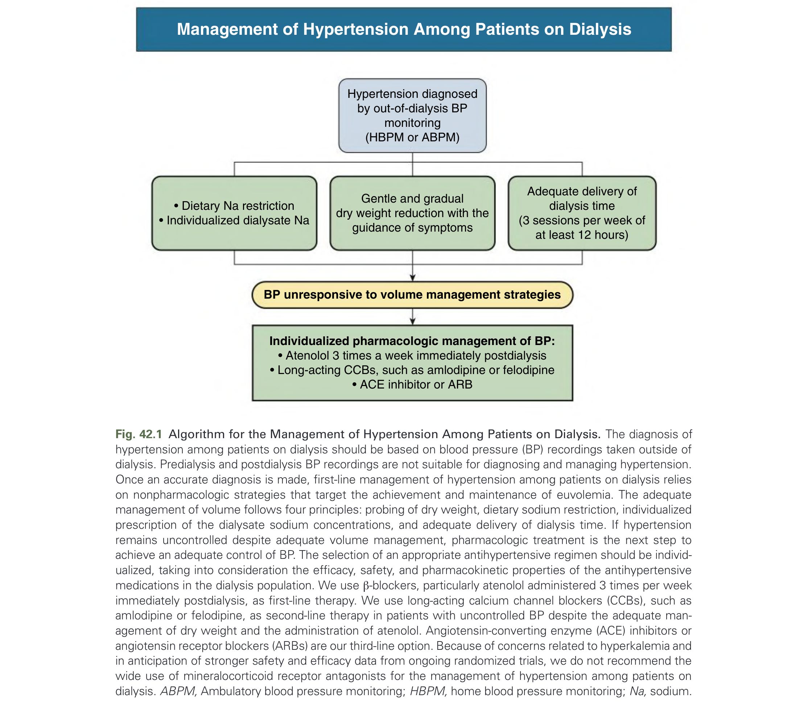
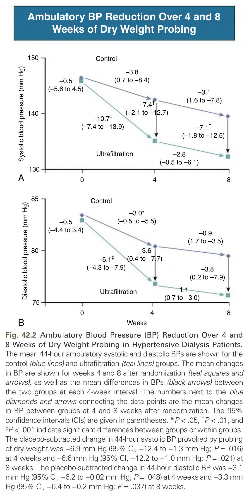
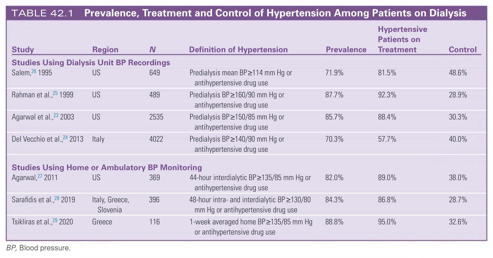
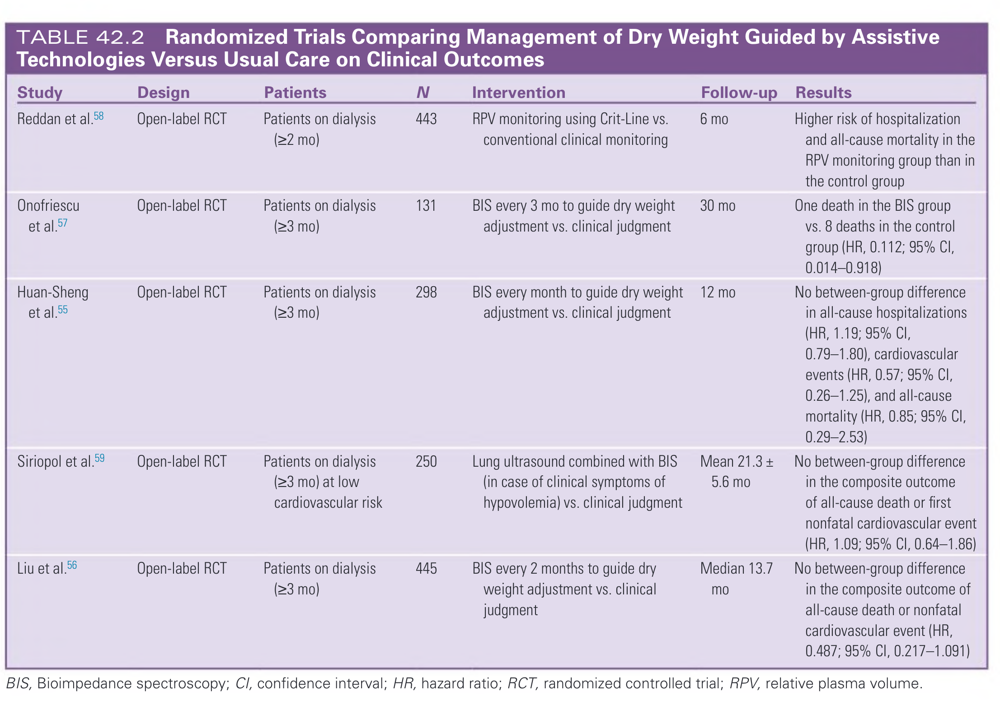
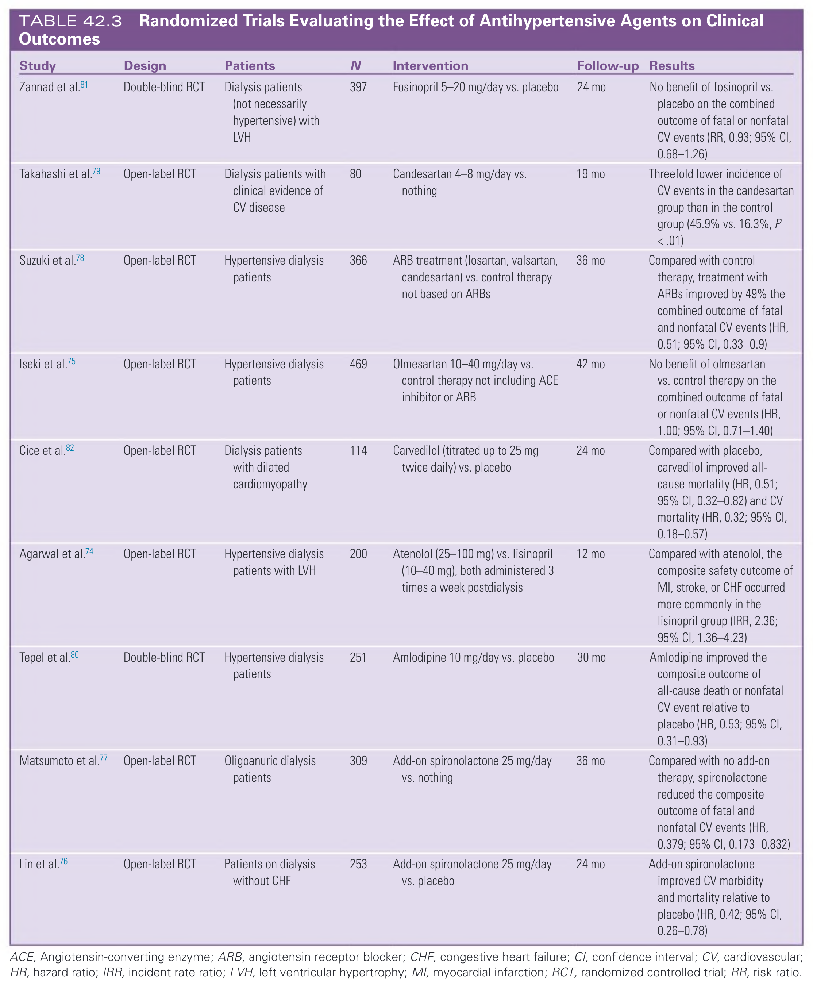
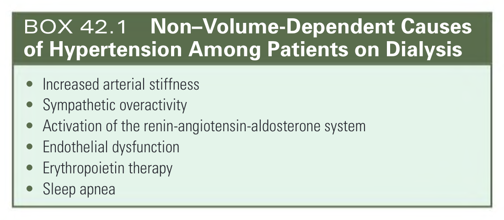
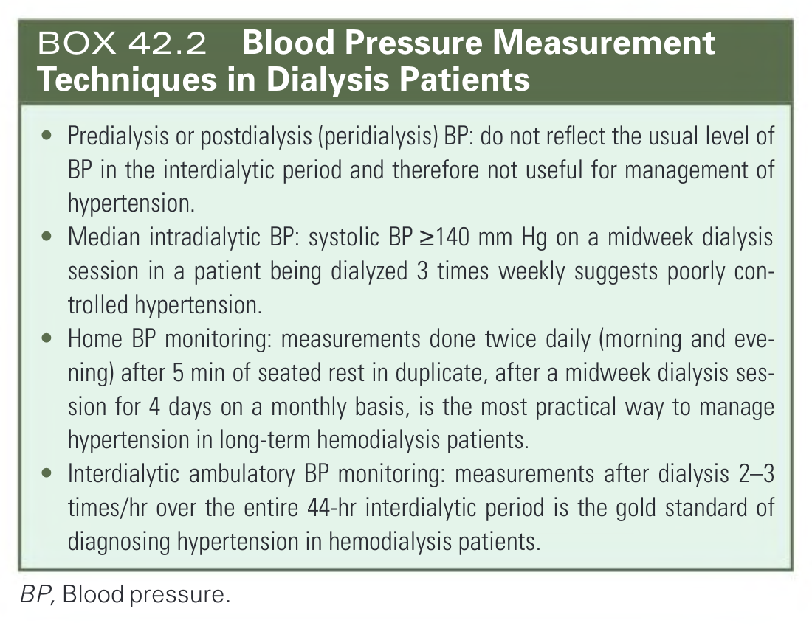
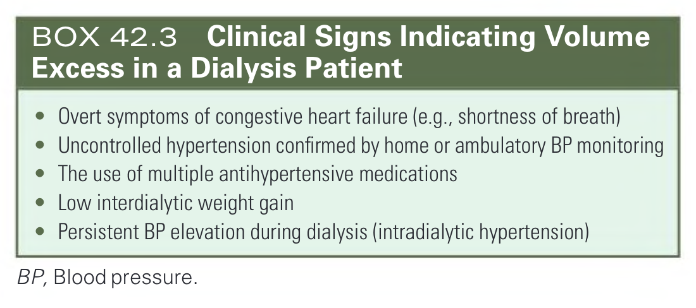
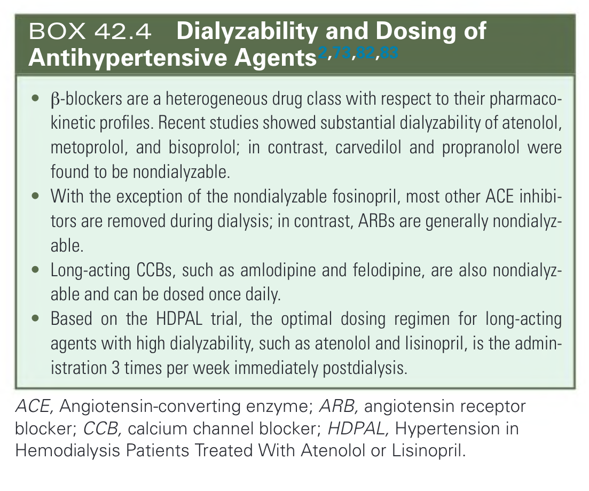

# 042. Blood Pressure Management in the Dialysis Patient - Figures and Tables Index

This document lists all figures, tables and boxes extracted from `042. Blood Pressure Management in the Dialysis Patient.pdf`.

## Table of Contents
- [Figures](#figures)
- [Tables](#tables)
- [Boxes](#boxes)

---

## Figures

### Fig_42_1



Fig. 42.1 Algorithm for the Management of Hypertension Among Patients on Dialysis. The diagnosis of hypertension among patients on dialysis should be based on blood pressure (BP) recordings taken outside of dialysis. Predialysis and postdialysis BP recordings are not suitable for diagnosing and managing hypertension. Once an accurate diagnosis is made, first-line management of hypertension among patients on dialysis relies on nonpharmacologic strategies that target the achievement and maintenance of euvolemia. The adequate management of volume follows four principles: probing of dry weight, dietary sodium restriction, individualized prescription of the dialysate sodium concentrations, and adequate delivery of dialysis time. If hypertension remains uncontrolled despite adequate volume management, pharmacologic treatment is the next step to achieve an adequate control of BP. The selection of an appropriate antihypertensive regimen should be individualized, taking into consideration the efficacy, safety, and pharmacokinetic properties of the antihypertensive medications in the dialysis population. We use β-blockers, particularly atenolol administered 3 times per week immediately postdialysis, as first-line therapy. We use long-acting calcium channel blockers (CCBs), such as amlodipine or felodipine, as second-line therapy in patients with uncontrolled BP despite the adequate management of dry weight and the administration of atenolol. Angiotensin-converting enzyme (ACE) inhibitors or angiotensin receptor blockers (ARBs) are our third-line option. Because of concerns related to hyperkalemia and in anticipation of stronger safety and efficacy data from ongoing randomized trials, we do not recommend the wide use of mineralocorticoid receptor antagonists for the management of hypertension among patients on dialysis. ABPM, Ambulatory blood pressure monitoring; HBPM, home blood pressure monitoring; Na, sodium.

---

### Fig_42_2



Fig. 42.2 Ambulatory Blood Pressure (BP) Reduction Over 4 and 8 Weeks of Dry Weight Probing in Hypertensive Dialysis Patients. The mean 44-hour ambulatory systolic and diastolic BPs are shown for the control (blue lines) and ultrafiltration (teal lines) groups. The mean changes in BP are shown for weeks 4 and 8 after randomization (teal squares and arrows), as well as the mean differences in BPs (black arrows) between the two groups at each 4-week interval. The numbers next to the blue diamonds and arrows connecting the data points are the mean changes in BP between groups at 4 and 8 weeks after randomization. The 95% confidence intervals (CIs) are given in parentheses. *P < .05, †P < .01, and ‡P < .001 indicate significant differences between groups or within groups. The placebo-subtracted change in 44-hour systolic BP provoked by probing of dry weight was −6.9 mm Hg (95% CI, −12.4 to −1.3 mm Hg; P = .016) at 4 weeks and −6.6 mm Hg (95% CI, −12.2 to −1.0 mm Hg; P = .021) at 8 weeks. The placebo-subtracted change in 44-hour diastolic BP was −3.1 mm Hg (95% CI, −6.2 to −0.02 mm Hg; P = .048) at 4 weeks and −3.3 mm Hg (95% CI, −6.4 to −0.2 mm Hg; P = .037) at 8 weeks.

---

## Tables

### Table_42_1

#### Table Image



#### Table Data (CSV: [Table_42_1.csv](Table_42_1.csv))

```markdown
| Study | Region | N | Definition of Hypertension | Prevalence | Hypertensive Patients on Treatment | Control |
| :--- | :--- | :--- | :--- | :--- | :--- | :--- |
| **Studies Using Dialysis Unit BP Recordings** | | | | | | |
| Salem, 1995 | US | 649 | Predialysis mean BP≥114 mm Hg or antihypertensive drug use | 71.9% | 81.5% | 48.6% |
| Rahman et al., 1999 | US | 489 | Predialysis BP≥160/90 mm Hg or antihypertensive drug use | 87.7% | 92.3% | 28.9% |
| Agarwal et al., 2003 | US | 2535 | Predialysis BP≥150/85 mm Hg or antihypertensive drug use | 85.7% | 88.4% | 30.3% |
| Del Vecchio et al., 2013 | Italy | 4022 | Predialysis BP≥140/90 mm Hg or antihypertensive drug use | 70.3% | 57.7% | 40.0% |
| **Studies Using Home or Ambulatory BP Monitoring** | | | | | | |
| Agarwal, 2011 | US | 369 | 44-hour interdialytic BP≥135/85 mm Hg or antihypertensive drug use | 82.0% | 89.0% | 38.0% |
| Sarafidis et al., 2019 | Italy, Greece, Slovenia | 396 | 48-hour intra- and interdialytic BP≥130/80 mm Hg or antihypertensive drug use | 84.3% | 86.8% | 28.7% |
| Tsikliras et al., 2020 | Greece | 116 | 1-week averaged home BP≥135/85 mm Hg or antihypertensive drug use | 88.8% | 95.0% | 32.6% |

BP, Blood pressure.
```

TABLE 42.1 Prevalence, Treatment and Control of Hypertension Among Patients on Dialysis

---

### Table_42_2

#### Table Image



#### Table Data (CSV: [Table_42_2.csv](Table_42_2.csv))

```markdown
| Study | Design | Patients | N | Intervention | Follow-up | Results |
| :--- | :--- | :--- | :--- | :--- | :--- | :--- |
| Reddan et al. | Open-label RCT | Patients on dialysis (≥2 mo) | 443 | RPV monitoring using Crit-Line vs. conventional clinical monitoring | 6 mo | Higher risk of hospitalization and all-cause mortality in the RPV monitoring group than in the control group |
| Onofriescu et al. | Open-label RCT | Patients on dialysis (≥3 mo) | 131 | BIS every 3 mo to guide dry weight adjustment vs. clinical judgment | 30 mo | One death in the BIS group vs. 8 deaths in the control group (HR, 0.112; 95% CI, 0.014-0.918) |
| Huan-Sheng et al. | Open-label RCT | Patients on dialysis (≥3 mo) | 298 | BIS every month to guide dry weight adjustment vs. clinical judgment | 12 mo | No between-group difference in all-cause hospitalizations (HR, 1.19; 95% CI, 0.79-1.80), cardiovascular events (HR, 0.57; 95% CI, 0.26-1.25), and all-cause mortality (HR, 0.85; 95% CI, 0.29-2.53) |
| Siriopol et al. | Open-label RCT | Patients on dialysis (≥3 mo) at low cardiovascular risk | 250 | Lung ultrasound combined with BIS (in case of clinical symptoms of hypovolemia) vs. clinical judgment | Mean 21.3 ± 5.6 mo | No between-group difference in the composite outcome of all-cause death or first nonfatal cardiovascular event (HR, 1.09; 95% CI, 0.64-1.86) |
| Liu et al. | Open-label RCT | Patients on dialysis (≥3 mo) | 445 | BIS every 2 months to guide dry weight adjustment vs. clinical judgment | Median 13.7 mo | No between-group difference in the composite outcome of all-cause death or nonfatal cardiovascular event (HR, 0.487; 95% CI, 0.217-1.091) |

BIS, Bioimpedance spectroscopy; CI, confidence interval; HR, hazard ratio; RCT, randomized controlled trial; RPV, relative plasma volume.
```

TABLE 42.2 Randomized Trials Comparing Management of Dry Weight Guided by Assistive Technologies Versus Usual Care on Clinical Outcomes

---

### Table_42_3

#### Table Image



#### Table Data (CSV: [Table_42_3.csv](Table_42_3.csv))

```markdown
| Study | Design | Patients | N | Intervention | Follow-up | Results |
| :--- | :--- | :--- | :--- | :--- | :--- | :--- |
| Zannad et al. | Double-blind RCT | Dialysis patients (not necessarily hypertensive) with LVH | 397 | Fosinopril 5-20 mg/day vs. placebo | 24 mo | No benefit of fosinopril vs. placebo on the combined outcome of fatal or nonfatal CV events (RR, 0.93; 95% CI, 0.68-1.26) |
| Takahashi et al. | Open-label RCT | Dialysis patients with clinical evidence of CV disease | 80 | Candesartan 4-8 mg/day vs. nothing | 19 mo | Threefold lower incidence of CV events in the candesartan group than in the control group (45.9% vs. 16.3%, P <.01) |
| Suzuki et al. | Open-label RCT | Hypertensive dialysis patients | 366 | ARB treatment (losartan, valsartan, candesartan) vs. control therapy not based on ARBs | 36 mo | Compared with control therapy, treatment with ARBs improved by 49% the combined outcome of fatal and nonfatal CV events (HR, 0.51; 95% CI, 0.33-0.9) |
| Iseki et al. | Open-label RCT | Hypertensive dialysis patients | 469 | Olmesartan 10-40 mg/day vs. control therapy not including ACE inhibitor or ARB | 42 mo | No benefit of olmesartan vs. control therapy on the combined outcome of fatal or nonfatal CV events (HR, 1.00; 95% CI, 0.71-1.40) |
| Cice et al. | Open-label RCT | Dialysis patients with dilated cardiomyopathy | 114 | Carvedilol (titrated up to 25 mg twice daily) vs. placebo | 24 mo | Compared with placebo, carvedilol improved all-cause mortality (HR, 0.51; 95% CI, 0.32-0.82) and CV mortality (HR, 0.32; 95% CI, 0.18-0.57) |
| Agarwal et al. | Open-label RCT | Hypertensive dialysis patients with LVH | 200 | Atenolol (25-100 mg) vs. lisinopril (10-40 mg), both administered 3 times a week postdialysis | 12 mo | Compared with atenolol, the composite safety outcome of MI, stroke, or CHF occurred more commonly in the lisinopril group (IRR, 2.36; 95% CI, 1.36-4.23) |
| Tepel et al. | Double-blind RCT | Hypertensive dialysis patients | 251 | Amlodipine 10 mg/day vs. placebo | 30 mo | Amlodipine improved the composite outcome of all-cause death or nonfatal CV event relative to placebo (HR, 0.53; 95% CI, 0.31-0.93) |
| Matsumoto et al. | Open-label RCT | Oligoanuric dialysis patients | 309 | Add-on spironolactone 25 mg/day vs. nothing | 36 mo | Compared with no add-on therapy, spironolactone reduced the composite outcome of fatal and nonfatal CV events (HR, 0.379; 95% CI, 0.173-0.832) |
| Lin et al. | Open-label RCT | Patients on dialysis without CHF | 253 | Add-on spironolactone 25 mg/day vs. placebo | 24 mo | Add-on spironolactone improved CV morbidity and mortality relative to placebo (HR, 0.42; 95% CI, 0.26-0.78) |

ACE, Angiotensin-converting enzyme; ARB, angiotensin receptor blocker; CHF, congestive heart failure; CI, confidence interval; CV, cardiovascular; HR, hazard ratio; IRR, incident rate ratio; LVH, left ventricular hypertrophy; MI, myocardial infarction; RCT, randomized controlled trial; RR, risk ratio.
```

TABLE 42.3 Randomized Trials Evaluating the Effect of Antihypertensive Agents on Clinical Outcomes

---

## Boxes

### Box_42_1



#### Box Text

```markdown
*   Increased arterial stiffness
*   Sympathetic overactivity
*   Activation of the renin-angiotensin-aldosterone system
*   Endothelial dysfunction
*   Erythropoietin therapy
*   Sleep apnea
```

BOX 42.1 Non–Volume-Dependent Causes of Hypertension Among Patients on Dialysis

---

### Box_42_2



#### Box Text

```markdown
*   Predialysis or postdialysis (peridialysis) BP: do not reflect the usual level of BP in the interdialytic period and therefore not useful for management of hypertension.
*   Median intradialytic BP: systolic BP ≥140 mm Hg on a midweek dialysis session in a patient being dialyzed 3 times weekly suggests poorly controlled hypertension.
*   Home BP monitoring: measurements done twice daily (morning and evening) after 5 min of seated rest in duplicate, after a midweek dialysis session for 4 days on a monthly basis, is the most practical way to manage hypertension in long-term hemodialysis patients.
*   Interdialytic ambulatory BP monitoring: measurements after dialysis 2-3 times/hr over the entire 44-hr interdialytic period is the gold standard of diagnosing hypertension in hemodialysis patients.

BP, Blood pressure.
```

BOX 42.2 Blood Pressure Measurement Techniques in Dialysis Patients

---

### Box_42_3



#### Box Text

```markdown
*   Overt symptoms of congestive heart failure (e.g., shortness of breath)
*   Uncontrolled hypertension confirmed by home or ambulatory BP monitoring
*   The use of multiple antihypertensive medications
*   Low interdialytic weight gain
*   Persistent BP elevation during dialysis (intradialytic hypertension)

BP, Blood pressure.
```

BOX 42.3 Clinical Signs Indicating Volume Excess in a Dialysis Patient

---

### Box_42_4



#### Box Text

```markdown
*   β-blockers are a heterogeneous drug class with respect to their pharmacokinetic profiles. Recent studies showed substantial dialyzability of atenolol, metoprolol, and bisoprolol; in contrast, carvedilol and propranolol were found to be nondialyzable.
*   With the exception of the nondialyzable fosinopril, most other ACE inhibitors are removed during dialysis; in contrast, ARBs are generally nondialyzable.
*   Long-acting CCBs, such as amlodipine and felodipine, are also nondialyzable and can be dosed once daily.
*   Based on the HDPAL trial, the optimal dosing regimen for long-acting agents with high dialyzability, such as atenolol and lisinopril, is the administration 3 times per week immediately postdialysis.

ACE, Angiotensin-converting enzyme; ARB, angiotensin receptor blocker; CCB, calcium channel blocker; HDPAL, Hypertension in Hemodialysis Patients Treated With Atenolol or Lisinopril.
```

BOX 42.4 Dialyzability and Dosing of Antihypertensive Agents2,73,82,83

---
