# 043. Renovascular Hypertension, Atherosclerotic Renal Vascular Disease, and Thromboembolic Kidney Disease - Figures and Tables Index

This document lists all figures, tables and boxes extracted from `043. Renovascular Hypertension, Atherosclerotic Renal Vascular Disease, and Thromboembolic Kidney Disease.pdf`.

## Table of Contents
- [Figures](#figures)
- [Tables](#tables)
- [Boxes](#boxes)

---

## Figures

### Fig_43_1

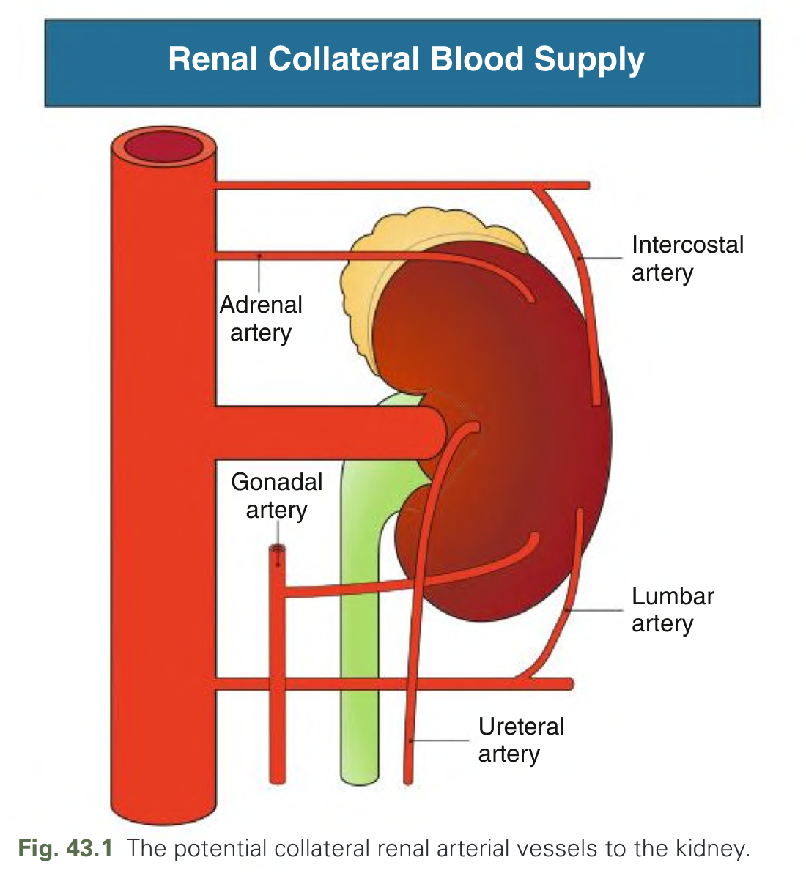

Fig. 43.1 The potential collateral renal arterial vessels to the kidney.

---

### Fig_43_2

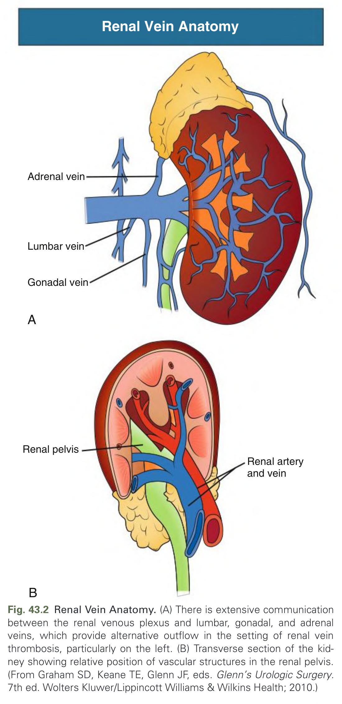

Fig. 43.2 Renal Vein Anatomy. (A) There is extensive communication between the renal venous plexus and lumbar, gonadal, and adrenal veins, which provide alternative outflow in the setting of renal vein thrombosis, particularly on the left. (B) Transverse section of the kidney showing relative position of vascular structures in the renal pelvis. (From Graham SD, Keane TE, Glenn JF, eds. Glenn’s Urologic Surgery. 7th ed. Wolters Kluwer/Lippincott Williams & Wilkins Health; 2010.)

---

### Fig_43_3

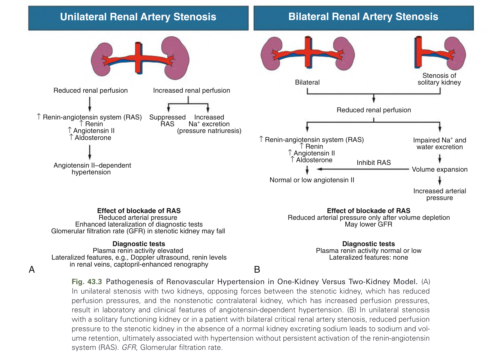

Fig. 43.3 Pathogenesis of Renovascular Hypertension in One-Kidney Versus Two-Kidney Model. (A) In unilateral stenosis with two kidneys, opposing forces between the stenotic kidney, which has reduced perfusion pressures, and the nonstenotic contralateral kidney, which has increased perfusion pressures, result in laboratory and clinical features of angiotensin-dependent hypertension. (B) In unilateral stenosis with a solitary functioning kidney or in a patient with bilateral critical renal artery stenosis, reduced perfusion pressure to the stenotic kidney in the absence of a normal kidney excreting sodium leads to sodium and volume retention, ultimately associated with hypertension without persistent activation of the renin-angiotensin system (RAS). GFR, Glomerular filtration rate.

---

### Fig_43_4

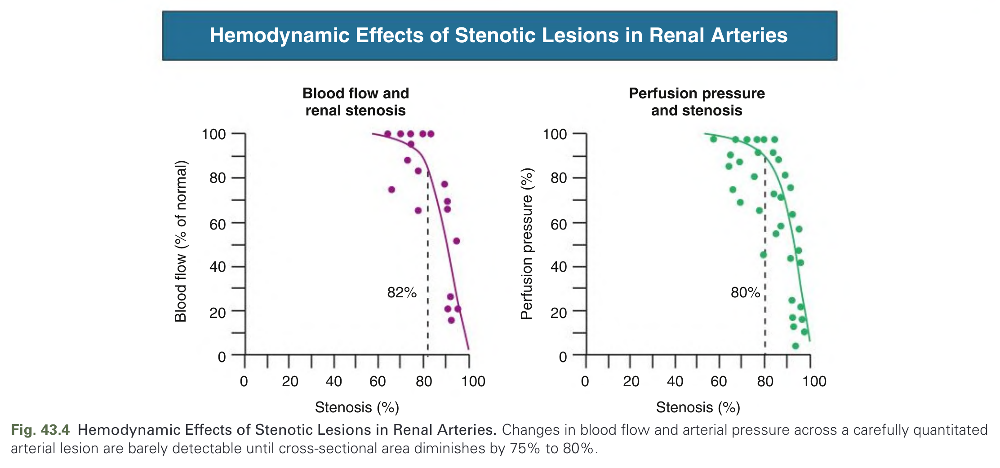

Fig. 43.4 Hemodynamic Effects of Stenotic Lesions in Renal Arteries. Changes in blood flow and arterial pressure across a carefully quantitated arterial lesion are barely detectable until cross-sectional area diminishes by 75% to 80%.

---

### Fig_43_5

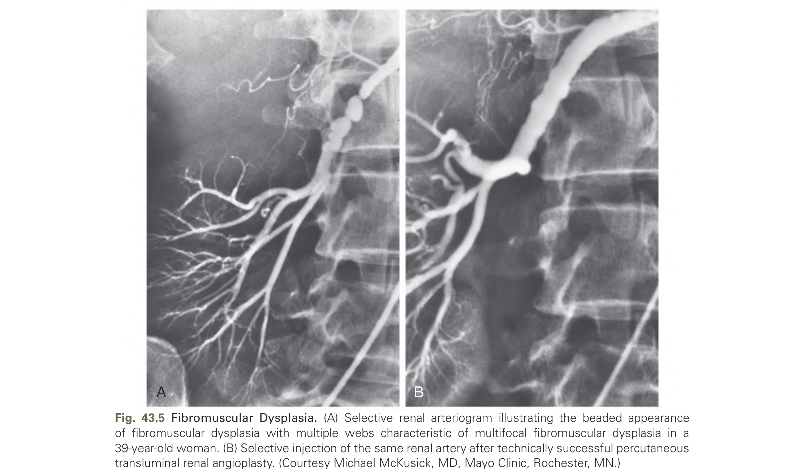

Fig. 43.5 Fibromuscular Dysplasia. (A) Selective renal arteriogram illustrating the beaded appearance of fibromuscular dysplasia with multiple webs characteristic of multifocal fibromuscular dysplasia in a 39-year-old woman. (B) Selective injection of the same renal artery after technically successful percutaneous transluminal renal angioplasty. (Courtesy Michael McKusick, MD, Mayo Clinic, Rochester, MN.)

---

### Fig_43_6

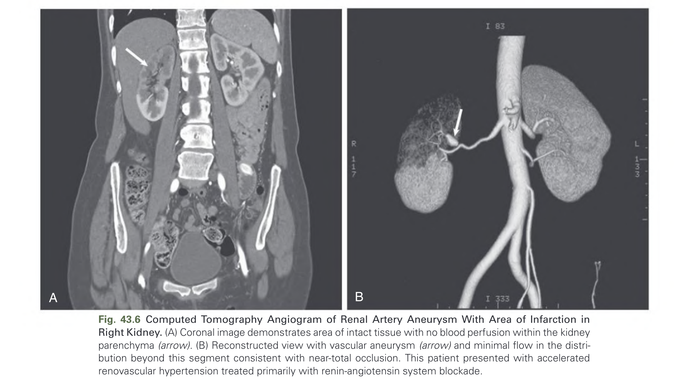

Fig. 43.6 Computed Tomography Angiogram of Renal Artery Aneurysm With Area of Infarction in Right Kidney. (A) Coronal image demonstrates area of intact tissue with no blood perfusion within the kidney parenchyma (arrow). (B) Reconstructed view with vascular aneurysm (arrow) and minimal flow in the distribution beyond this segment consistent with near-total occlusion. This patient presented with accelerated renovascular hypertension treated primarily with renin-angiotensin system blockade.

---

### Fig_43_7

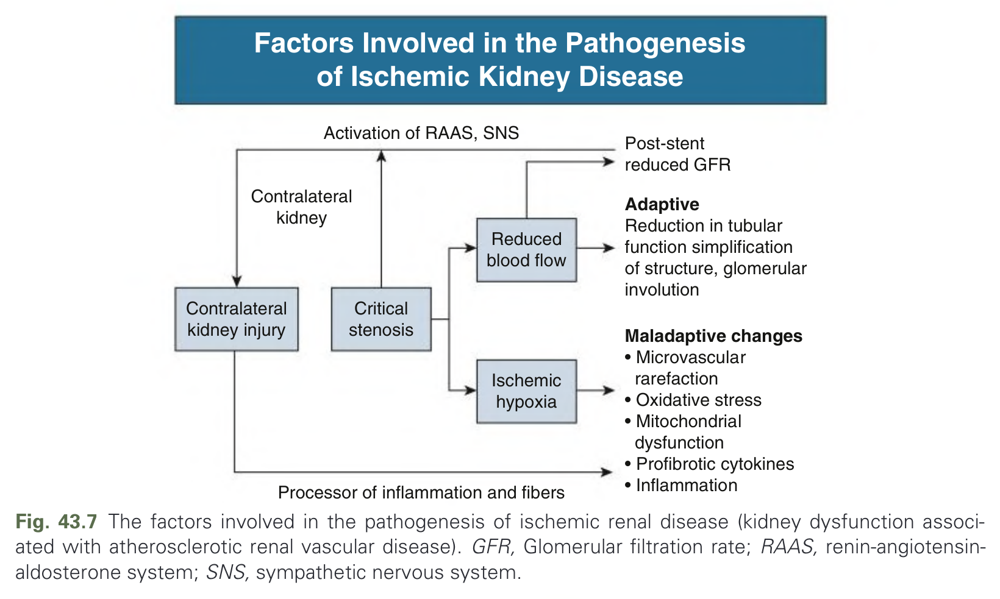

Fig. 43.7 The factors involved in the pathogenesis of ischemic renal disease (kidney dysfunction associated with atherosclerotic renal vascular disease). GFR, Glomerular filtration rate; RAAS, renin-angiotensin-aldosterone system; SNS, sympathetic nervous system.

---

### Fig_43_8

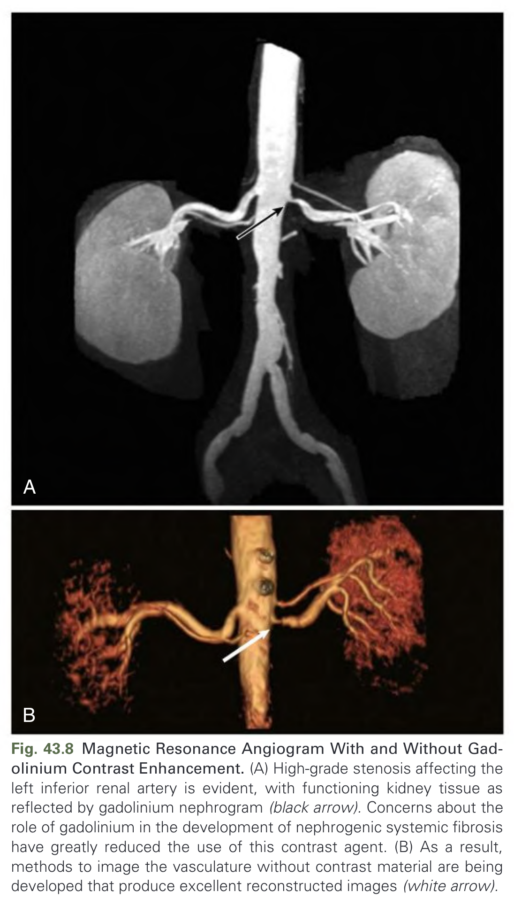

Fig. 43.8 Magnetic Resonance Angiogram With and Without Gadolinium Contrast Enhancement. (A) High-grade stenosis affecting the left inferior renal artery is evident, with functioning kidney tissue as reflected by gadolinium nephrogram (black arrow). Concerns about the role of gadolinium in the development of nephrogenic systemic fibrosis have greatly reduced the use of this contrast agent. (B) As a result, methods to image the vasculature without contrast material are being developed that produce excellent reconstructed images (white arrow).

---

### Fig_43_9

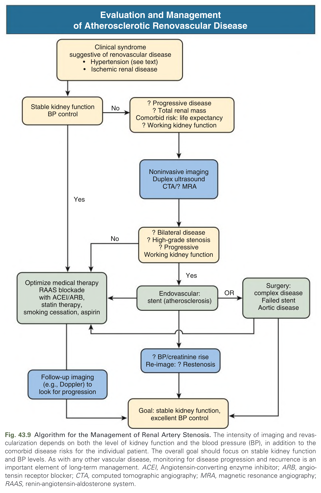

Fig. 43.9 Algorithm for the Management of Renal Artery Stenosis. The intensity of imaging and revascularization depends on both the level of kidney function and the blood pressure (BP), in addition to the comorbid disease risks for the individual patient. The overall goal should focus on stable kidney function and BP levels. As with any other vascular disease, monitoring for disease progression and recurrence is an important element of long-term management. ACEI, Angiotensin-converting enzyme inhibitor; ARB, angiotensin receptor blocker; CTA, computed tomographic angiography; MRA, magnetic resonance angiography; RAAS, renin-angiotensin-aldosterone system.

---

### Fig_43_10

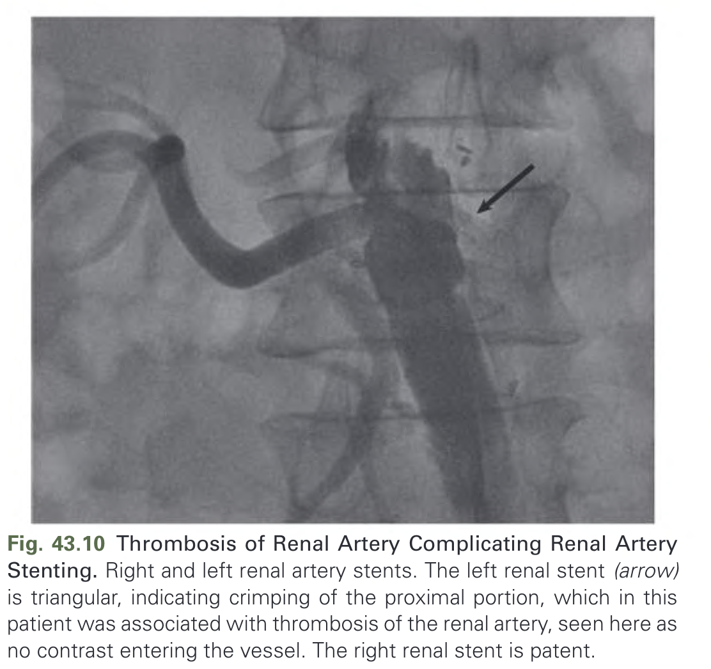

Fig. 43.10 Thrombosis of Renal Artery Complicating Renal Artery Stenting. Right and left renal artery stents. The left renal stent (arrow) is triangular, indicating crimping of the proximal portion, which in this patient was associated with thrombosis of the renal artery, seen here as no contrast entering the vessel. The right renal stent is patent.

---

### Fig_43_11

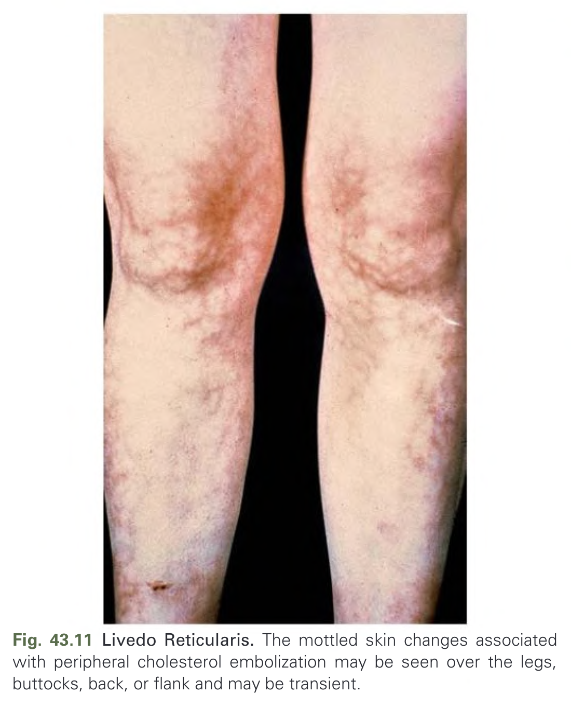

Fig. 43.11 Livedo Reticularis. The mottled skin changes associated with peripheral cholesterol embolization may be seen over the legs, buttocks, back, or flank and may be transient.

---

### Fig_43_12

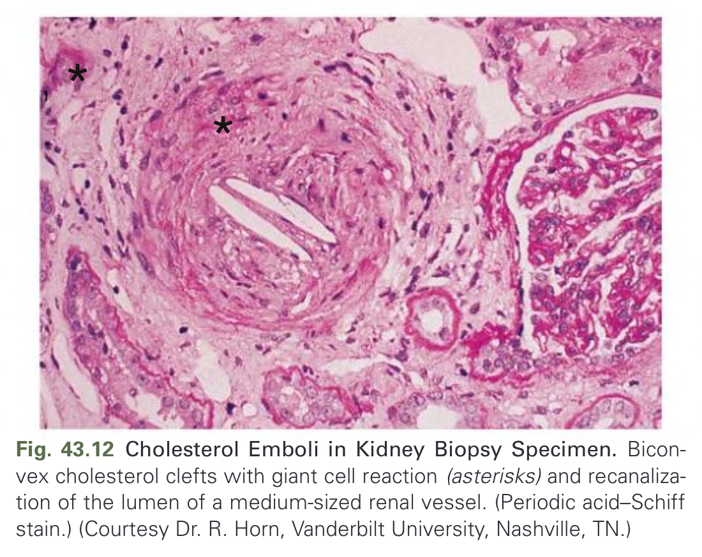

Fig. 43.12 Cholesterol Emboli in Kidney Biopsy Specimen. Biconvex cholesterol clefts with giant cell reaction (asterisks) and recanalization of the lumen of a medium-sized renal vessel. (Periodic acid–Schiff stain.) (Courtesy Dr. R. Horn, Vanderbilt University, Nashville, TN.)

---

### Fig_43_13

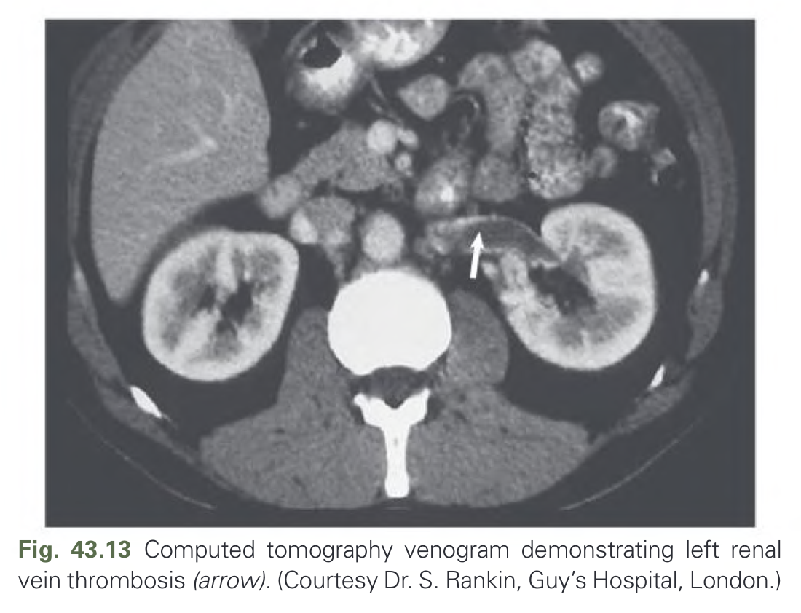

Fig. 43.13 Computed tomography venogram demonstrating left renal vein thrombosis (arrow). (Courtesy Dr. S. Rankin, Guy’s Hospital, London.)

---

## Tables

### Table_43_1

#### Table Image

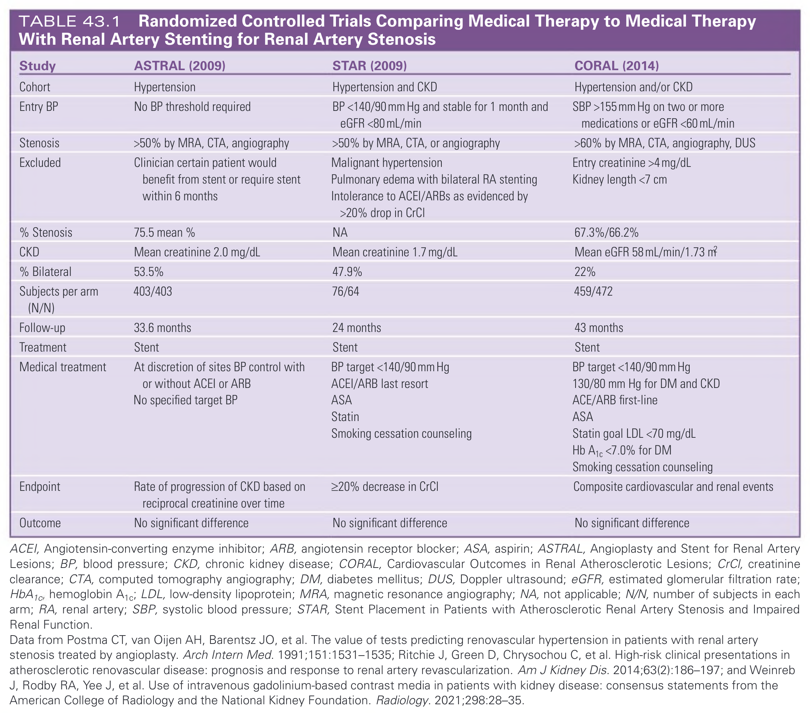

#### Table Data (CSV: [Table_43_1.csv](Table_43_1.csv))

```markdown
| **Study** | **ASTRAL (2009)** | **STAR (2009)** | **CORAL (2014)** |
| :--- | :--- | :--- | :--- |
| Cohort | Hypertension | Hypertension and CKD | Hypertension and/or CKD |
| Entry BP | No BP threshold required | BP <140/90 mm Hg and stable for 1 month and eGFR <80 mL/min | SBP >155 mm Hg on two or more medications or eGFR <60 mL/min |
| Stenosis | >50% by MRA, CTA, angiography | >50% by MRA, CTA, or angiography | >60% by MRA, CTA, angiography, DUS |
| Excluded | Clinician certain patient would benefit from stent or require stent within 6 months | Malignant hypertension, Pulmonary edema with bilateral RA stenting, Intolerance to ACEI/ARBs as evidenced by >20% drop in CrCl | Entry creatinine >4 mg/dL, Kidney length <7 cm |
| % Stenosis | 75.5 mean % | NA | 67.3%/66.2% |
| CKD | Mean creatinine 2.0 mg/dL | Mean creatinine 1.7 mg/dL | Mean eGFR 58 mL/min/1.73 m² |
| % Bilateral | 53.5% | 47.9% | 22% |
| Subjects per arm (N/N) | 403/403 | 76/64 | 459/472 |
| Follow-up | 33.6 months | 24 months | 43 months |
| Treatment | Stent | Stent | Stent |
| Medical treatment | At discretion of sites BP control with or without ACEI or ARB. No specified target BP | BP target <140/90 mm Hg, ACEI/ARB last resort, ASA, Statin, Smoking cessation counseling | BP target <140/90 mm Hg, 130/80 mm Hg for DM and CKD, ACE/ARB first-line, ASA, Statin goal LDL <70 mg/dL, Hb A1c <7.0% for DM, Smoking cessation counseling |
| Endpoint | Rate of progression of CKD based on reciprocal creatinine over time | ≥20% decrease in CrCl | Composite cardiovascular and renal events |
| Outcome | No significant difference | No significant difference | No significant difference |

ACEI, Angiotensin-converting enzyme inhibitor; ARB, angiotensin receptor blocker; ASA, aspirin; ASTRAL, Angioplasty and Stent for Renal Artery Lesions; BP, blood pressure; CKD, chronic kidney disease; CORAL, Cardiovascular Outcomes in Renal Atherosclerotic Lesions; CrCl, creatinine clearance; CTA, computed tomography angiography; DM, diabetes mellitus; DUS, Doppler ultrasound; eGFR, estimated glomerular filtration rate; HbA1c, hemoglobin A1c; LDL, low-density lipoprotein; MRA, magnetic resonance angiography; NA, not applicable; N/N, number of subjects in each arm; RA, renal artery; SBP, systolic blood pressure; STAR, Stent Placement in Patients with Atherosclerotic Renal Artery Stenosis and Impaired Renal Function.

Data from Postma CT, van Oijen AH, Barentsz JO, et al. The value of tests predicting renovascular hypertension in patients with renal artery stenosis treated by angioplasty. Arch Intern Med. 1991;151:1531–1535; Ritchie J, Green D, Chrysochou C, et al. High-risk clinical presentations in atherosclerotic renovascular disease: prognosis and response to renal artery revascularization. Am J Kidney Dis. 2014;63(2):186–197; and Weinreb J, Rodby RA, Yee J, et al. Use of intravenous gadolinium-based contrast media in patients with kidney disease: consensus statements from the American College of Radiology and the National Kidney Foundation. Radiology. 2021;298:28–35.
```

TABLE 43.1 Randomized Controlled Trials Comparing Medical Therapy to Medical Therapy With Renal Artery Stenting for Renal Artery Stenosis

---

## Boxes

### Box_43_1

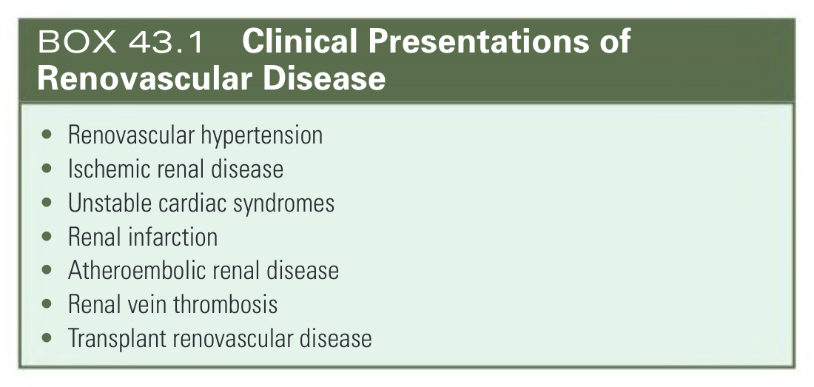

#### Box Text

```markdown
* Renovascular hypertension
* Ischemic renal disease
* Unstable cardiac syndromes
* Renal infarction
* Atheroembolic renal disease
* Renal vein thrombosis
* Transplant renovascular disease
```

BOX 43.1 Clinical Presentations of Renovascular Disease

---

### Box_43_2

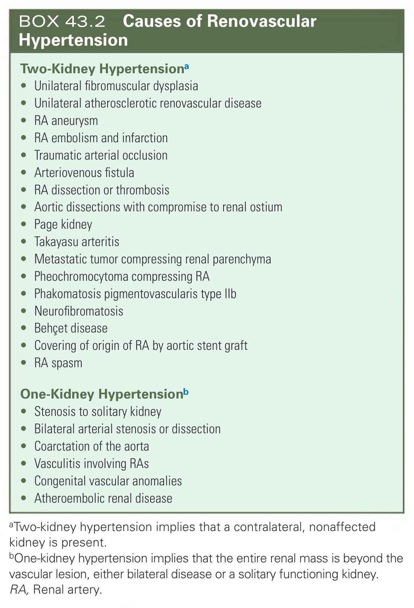

#### Box Text

```markdown
**Two-Kidney Hypertensiona**
* Unilateral fibromuscular dysplasia
* Unilateral atherosclerotic renovascular disease
* RA aneurysm
* RA embolism and infarction
* Traumatic arterial occlusion
* Arteriovenous fistula
* RA dissection or thrombosis
* Aortic dissections with compromise to renal ostium
* Page kidney
* Takayasu arteritis
* Metastatic tumor compressing renal parenchyma
* Pheochromocytoma compressing RA
* Phakomatosis pigmentovascularis type Ilb
* Neurofibromatosis
* Behçet disease
* Covering of origin of RA by aortic stent graft
* RA spasm

**One-Kidney Hypertensionb**
* Stenosis to solitary kidney
* Bilateral arterial stenosis or dissection
* Coarctation of the aorta
* Vasculitis involving RAs
* Congenital vascular anomalies
* Atheroembolic renal disease

aTwo-kidney hypertension implies that a contralateral, nonaffected kidney is present.
bOne-kidney hypertension implies that the entire renal mass is beyond the vascular lesion, either bilateral disease or a solitary functioning kidney.
RA, Renal artery.
```

BOX 43.2 Causes of Renovascular Hypertension

---

### Box_43_3

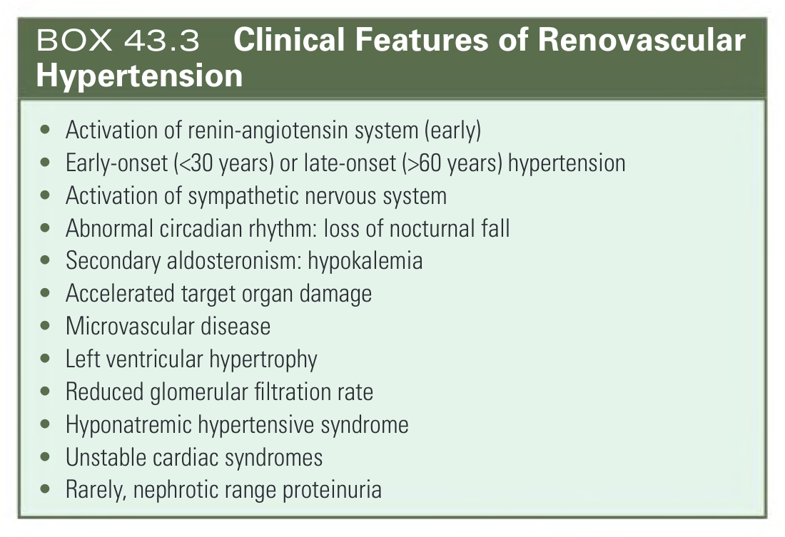

#### Box Text

```markdown
* Activation of renin-angiotensin system (early)
* Early-onset (<30 years) or late-onset (>60 years) hypertension
* Activation of sympathetic nervous system
* Abnormal circadian rhythm: loss of nocturnal fall
* Secondary aldosteronism: hypokalemia
* Accelerated target organ damage
* Microvascular disease
* Left ventricular hypertrophy
* Reduced glomerular filtration rate
* Hyponatremic hypertensive syndrome
* Unstable cardiac syndromes
* Rarely, nephrotic range proteinuria
```

BOX 43.3 Clinical Features of Renovascular Hypertension

---

### Box_43_4

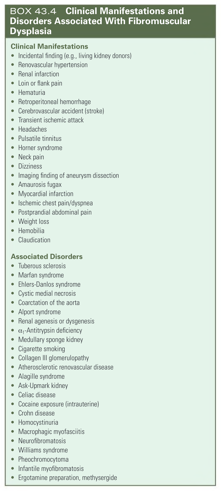

#### Box Text

```markdown
**Clinical Manifestations**
* Incidental finding (e.g., living kidney donors)
* Renovascular hypertension
* Renal infarction
* Loin or flank pain
* Hematuria
* Retroperitoneal hemorrhage
* Cerebrovascular accident (stroke)
* Transient ischemic attack
* Headaches
* Pulsatile tinnitus
* Horner syndrome
* Neck pain
* Dizziness
* Imaging finding of aneurysm dissection
* Amaurosis fugax
* Myocardial infarction
* Ischemic chest pain/dyspnea
* Postprandial abdominal pain
* Weight loss
* Hemobilia
* Claudication

**Associated Disorders**
* Tuberous sclerosis
* Marfan syndrome
* Ehlers-Danlos syndrome
* Cystic medial necrosis
* Coarctation of the aorta
* Alport syndrome
* Renal agenesis or dysgenesis
* α₁-Antitrypsin deficiency
* Medullary sponge kidney
* Cigarette smoking
* Collagen III glomerulopathy
* Atherosclerotic renovascular disease
* Alagille syndrome
* Ask-Upmark kidney
* Celiac disease
* Cocaine exposure (intrauterine)
* Crohn disease
* Homocystinuria
* Macrophagic myofasciitis
* Neurofibromatosis
* Williams syndrome
* Pheochromocytoma
* Infantile myofibromatosis
* Ergotamine preparation, methysergide
```

BOX 43.4 Clinical Manifestations and Disorders Associated With Fibromuscular Dysplasia

---

### Box_43_5

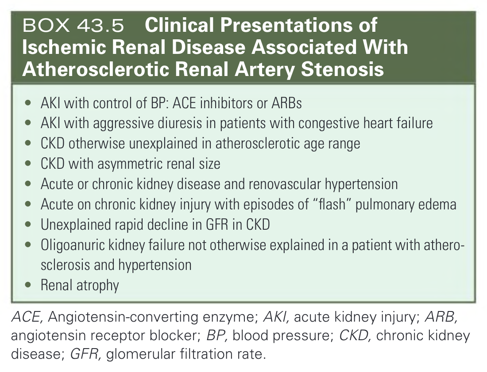

#### Box Text

```markdown
* AKI with control of BP: ACE inhibitors or ARBs
* AKI with aggressive diuresis in patients with congestive heart failure
* CKD otherwise unexplained in atherosclerotic age range
* CKD with asymmetric renal size
* Acute or chronic kidney disease and renovascular hypertension
* Acute on chronic kidney injury with episodes of "flash" pulmonary edema
* Unexplained rapid decline in GFR in CKD
* Oligoanuric kidney failure not otherwise explained in a patient with atherosclerosis and hypertension
* Renal atrophy

ACE, Angiotensin-converting enzyme; AKI, acute kidney injury; ARB, angiotensin receptor blocker; BP, blood pressure; CKD, chronic kidney disease; GFR, glomerular filtration rate.
```

BOX 43.5 Clinical Presentations of Ischemic Renal Disease Associated With Atherosclerotic Renal Artery Stenosis

---

### Box_43_6

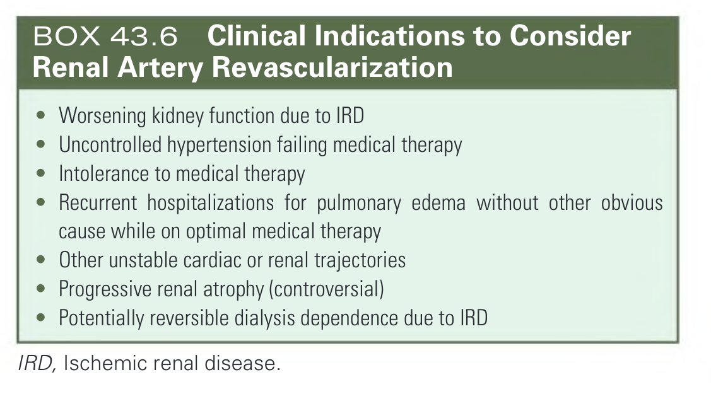

#### Box Text

```markdown
* Worsening kidney function due to IRD
* Uncontrolled hypertension failing medical therapy
* Intolerance to medical therapy
* Recurrent hospitalizations for pulmonary edema without other obvious cause while on optimal medical therapy
* Other unstable cardiac or renal trajectories
* Progressive renal atrophy (controversial)
* Potentially reversible dialysis dependence due to IRD

IRD, Ischemic renal disease.
```

BOX 43.6 Clinical Indications to Consider Renal Artery Revascularization

---

### Box_43_7

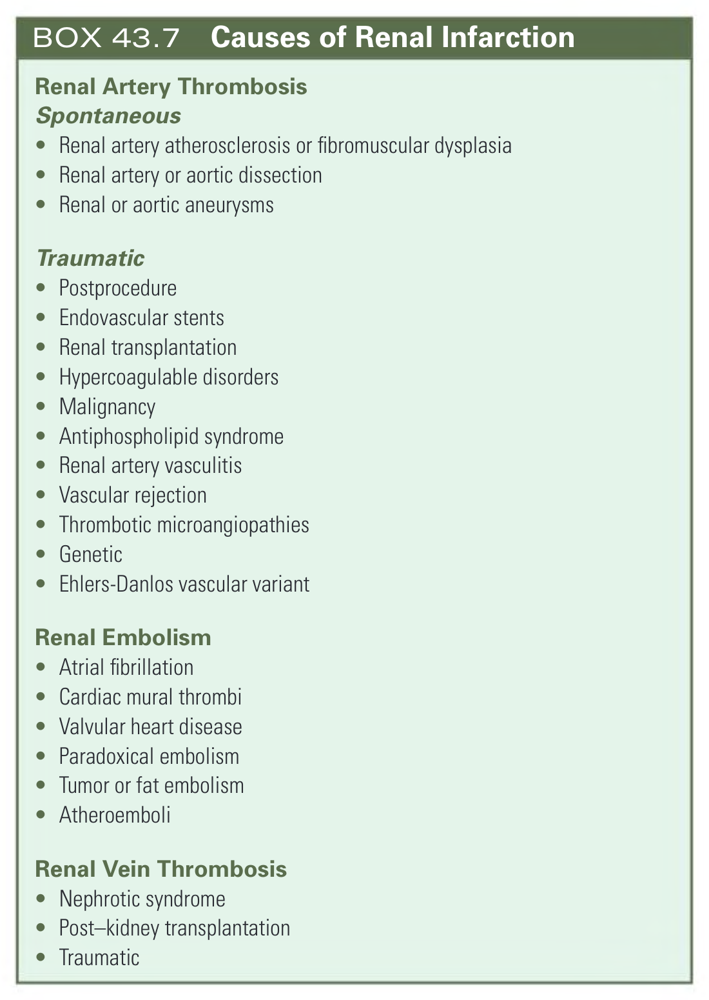

#### Box Text

```markdown
**Renal Artery Thrombosis**
* **Spontaneous**
	* Renal artery atherosclerosis or fibromuscular dysplasia
	* Renal artery or aortic dissection
	* Renal or aortic aneurysms
* **Traumatic**
	* Postprocedure
	* Endovascular stents
	* Renal transplantation
	* Hypercoagulable disorders
	* Malignancy
	* Antiphospholipid syndrome
	* Renal artery vasculitis
	* Vascular rejection
	* Thrombotic microangiopathies
	* Genetic
	* Ehlers-Danlos vascular variant

**Renal Embolism**
* Atrial fibrillation
* Cardiac mural thrombi
* Valvular heart disease
* Paradoxical embolism
* Tumor or fat embolism
* Atheroemboli

**Renal Vein Thrombosis**
* Nephrotic syndrome
* Post-kidney transplantation
* Traumatic
```

BOX 43.7 Causes of Renal Infarction

---

### Box_43_8

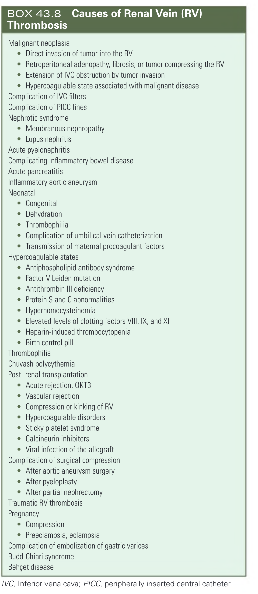

#### Box Text

```markdown
**Malignant neoplasia**
* Direct invasion of tumor into the RV
* Retroperitoneal adenopathy, fibrosis, or tumor compressing the RV
* Extension of IVC obstruction by tumor invasion
* Hypercoagulable state associated with malignant disease
**Complication of IVC filters**
**Complication of PICC lines**
**Nephrotic syndrome**
* Membranous nephropathy
* Lupus nephritis
**Acute pyelonephritis**
**Complicating inflammatory bowel disease**
**Acute pancreatitis**
**Inflammatory aortic aneurysm**
**Neonatal**
* Congenital
* Dehydration
* Thrombophilia
* Complication of umbilical vein catheterization
* Transmission of maternal procoagulant factors
**Hypercoagulable states**
* Antiphospholipid antibody syndrome
* Factor V Leiden mutation
* Antithrombin III deficiency
* Protein S and C abnormalities
* Hyperhomocysteinemia
* Elevated levels of clotting factors VIII, IX, and XI
* Heparin-induced thrombocytopenia
* Birth control pill
**Thrombophilia**
**Chuvash polycythemia**
**Post-renal transplantation**
* Acute rejection, OKT3
* Vascular rejection
* Compression or kinking of RV
* Hypercoagulable disorders
* Sticky platelet syndrome
* Calcineurin inhibitors
* Viral infection of the allograft
**Complication of surgical compression**
* After aortic aneurysm surgery
* After pyeloplasty
* After partial nephrectomy
**Traumatic RV thrombosis**
**Pregnancy**
* Compression
* Preeclampsia, eclampsia
**Complication of embolization of gastric varices**
**Budd-Chiari syndrome**
**Behçet disease**

IVC, Inferior vena cava; PICC, peripherally inserted central catheter.
```

BOX 43.8 Causes of Renal Vein (RV) Thrombosis

---
