# 044. Kidney Physiology and Complications in Normal Pregnancy - Figures and Tables Index

This document lists all figures, tables and boxes extracted from `044. Kidney Physiology and Complications in Normal Pregnancy.pdf`.

## Table of Contents
- [Figures](#figures)
- [Tables](#tables)
- [Boxes](#boxes)

---

## Figures

### Fig_44_1

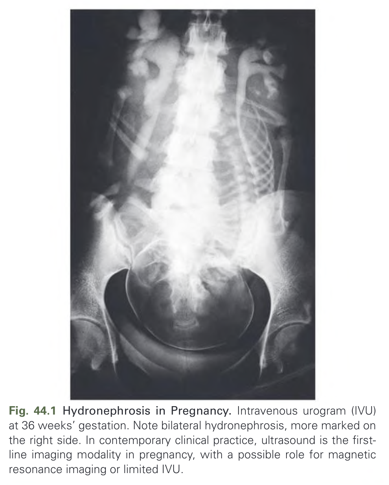

Fig. 44.1 Hydronephrosis in Pregnancy. Intravenous urogram (IVU) at 36 weeks’ gestation. Note bilateral hydronephrosis, more marked on the right side. In contemporary clinical practice, ultrasound is the first-line imaging modality in pregnancy, with a possible role for magnetic resonance imaging or limited IVU.

---

### Fig_44_2

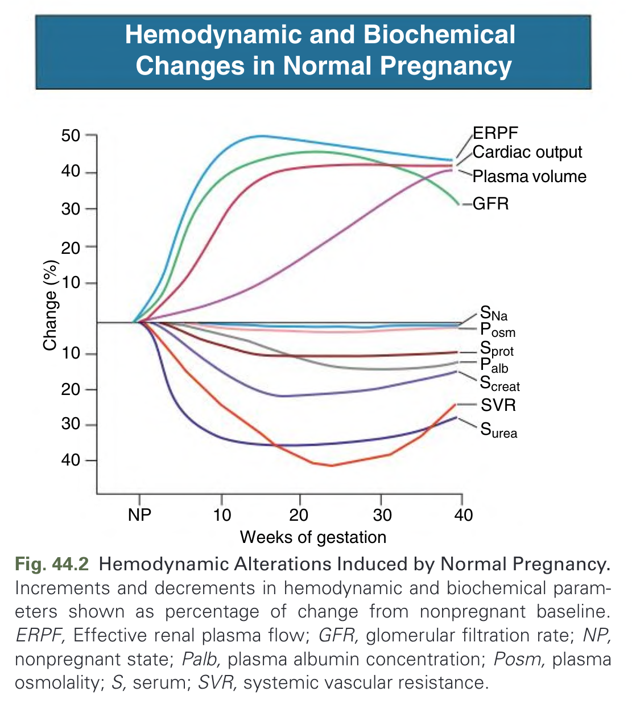

Fig. 44.2 Hemodynamic Alterations Induced by Normal Pregnancy. Increments and decrements in hemodynamic and biochemical parameters shown as percentage of change from nonpregnant baseline. ERPF, Effective renal plasma flow; GFR, glomerular filtration rate; NP, nonpregnant state; Palb, plasma albumin concentration; Posm, plasma osmolality; S, serum; SVR, systemic vascular resistance.

---

### Fig_44_3

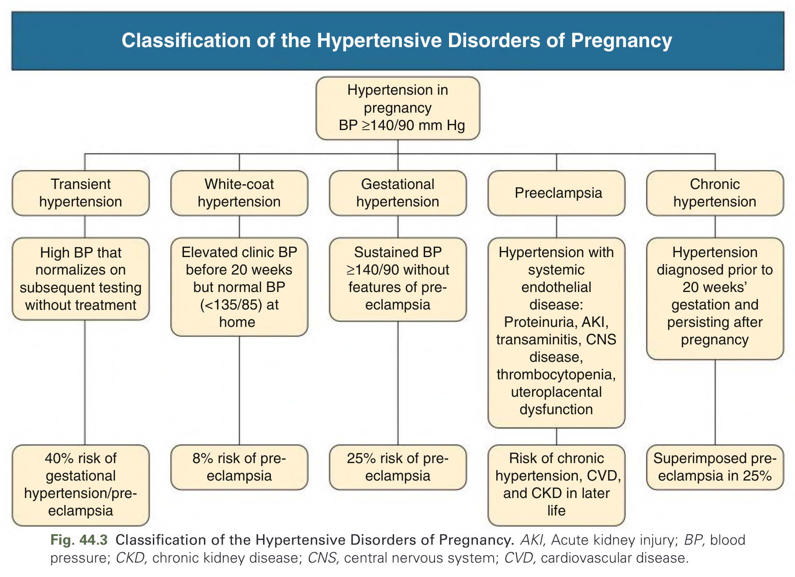

Fig. 44.3 Classification of the Hypertensive Disorders of Pregnancy. AKI, Acute kidney injury; BP, blood pressure; CKD, chronic kidney disease; CNS, central nervous system; CVD, cardiovascular disease.

---

### Fig_44_4

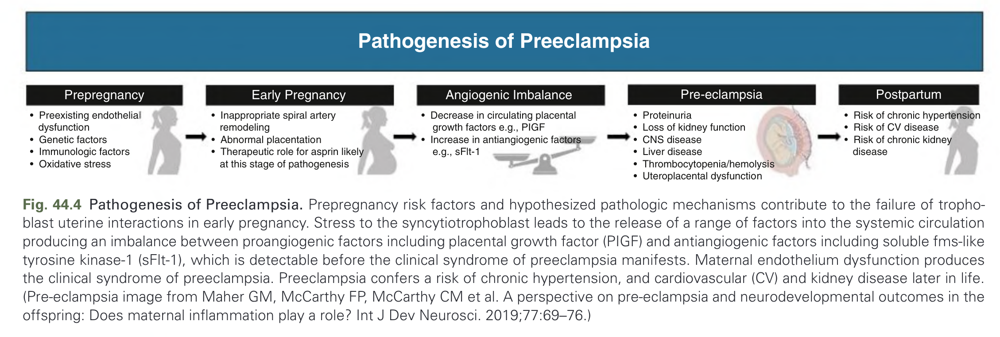

Fig. 44.4 Pathogenesis of Preeclampsia. Prepregnancy risk factors and hypothesized pathologic mechanisms contribute to the failure of trophoblast invasion and remodeling of the spiral arteries. This causes placental hypoxia with the release of soluble antiangiogenic factors that lead to widespread maternal endothelial dysfunction, vascular leak, and vasospasm.

---

### Fig_44_5

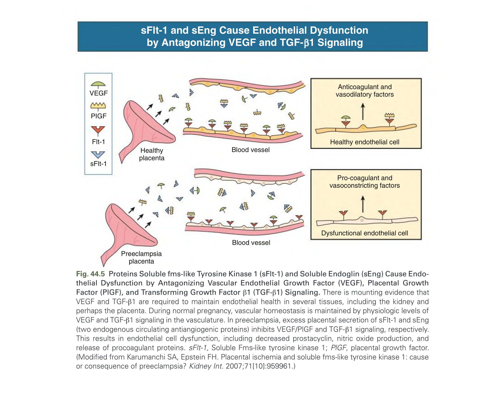

Fig. 44.5 Proteins Soluble fms-like Tyrosine Kinase 1 (sFlt-1) and Soluble Endoglin (sEng) Cause Endothelial Dysfunction in Preeclampsia by Neutralizing Circulating Vascular Endothelial Growth Factor (VEGF), Placental Growth Factor (PlGF), and Transforming Growth Factor-β (TGFβ). Loss of these proangiogenic factors leads to reduced synthesis of prostacyclin and nitric oxide and increased production of endothelin-1, with systemic vasoconstriction, vascular leak, and generalized endothelial damage.

---

### Fig_44_6

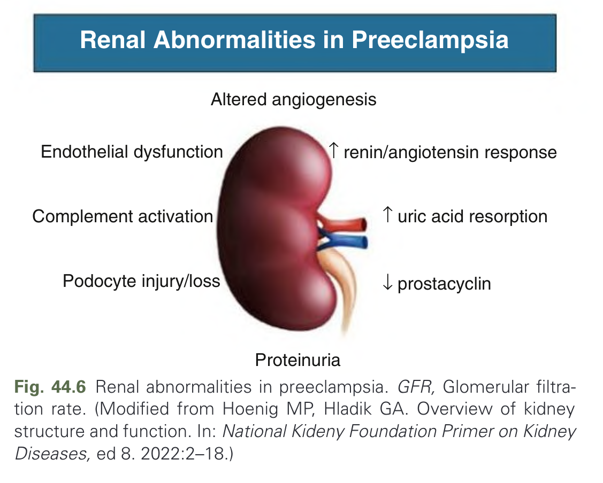

Fig. 44.6 Renal abnormalities in preeclampsia. GFR, Glomerular filtration rate.

---

### Fig_44_7

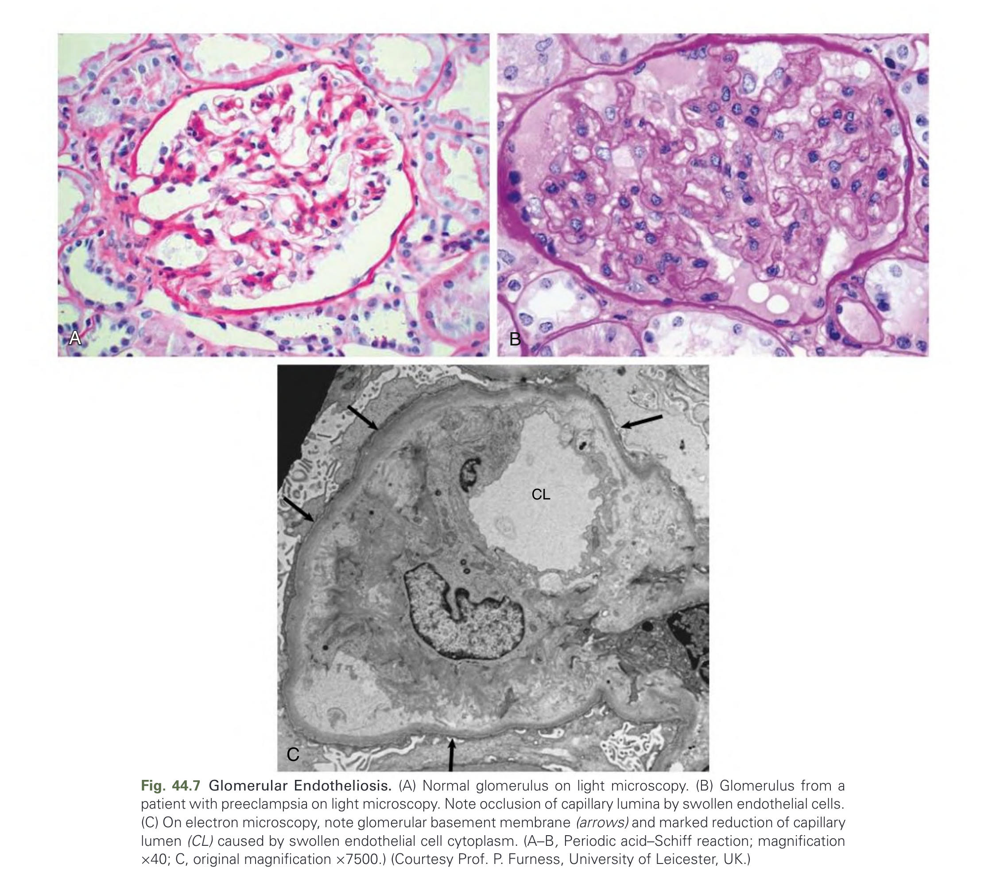

Fig. 44.7 Glomerular Endotheliosis. (A) Normal glomerulus on light microscopy. (B) Glomerulus from a woman with preeclampsia showing severe endotheliosis with swelling of endothelial cells resulting in marked capillary lumen occlusion and tuft enlargement. (C) High-power view demonstrating subendothelial fibrinoid deposits and swollen endothelial cells.

---

### Fig_44_8

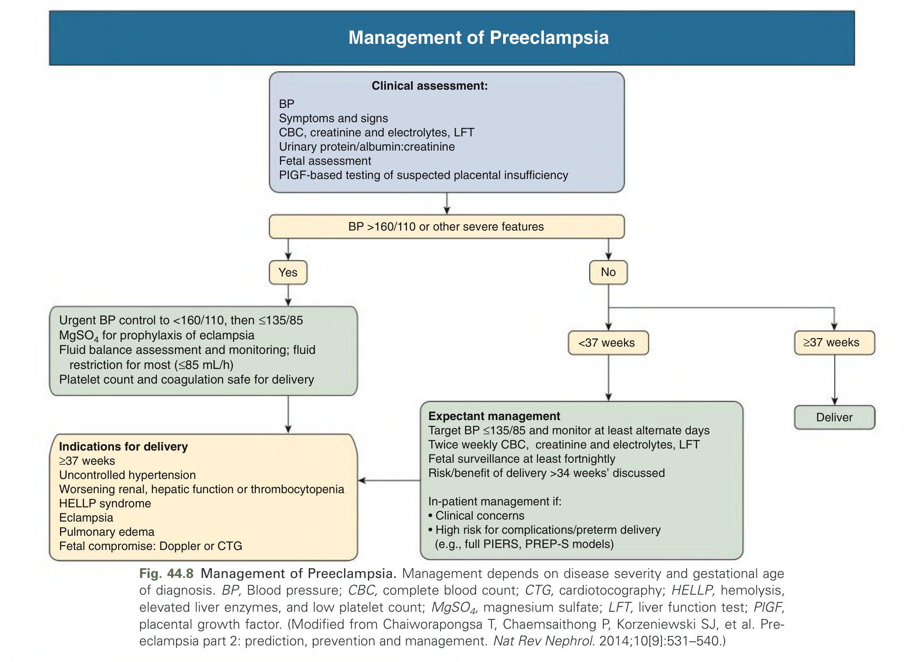

Fig. 44.8 Management of Preeclampsia. Management depends on disease severity and gestational age of diagnosis. BP, Blood pressure; CBC, complete blood count; CTG, cardiotocography; HELLP, hemolysis, elevated liver enzymes, and low platelet count; MgSO4, magnesium sulfate; LFT, liver function test; PlGF, placental growth factor. (Modified from Chaiworapongsa T, Chaemsaithong P, Korzeniewski SJ, et al. Pre-eclampsia part 2: prediction, prevention and management. Nat Rev Nephrol. 2014;10[9]:531–540.)

---

## Tables

### Table_44_1

#### Table Image

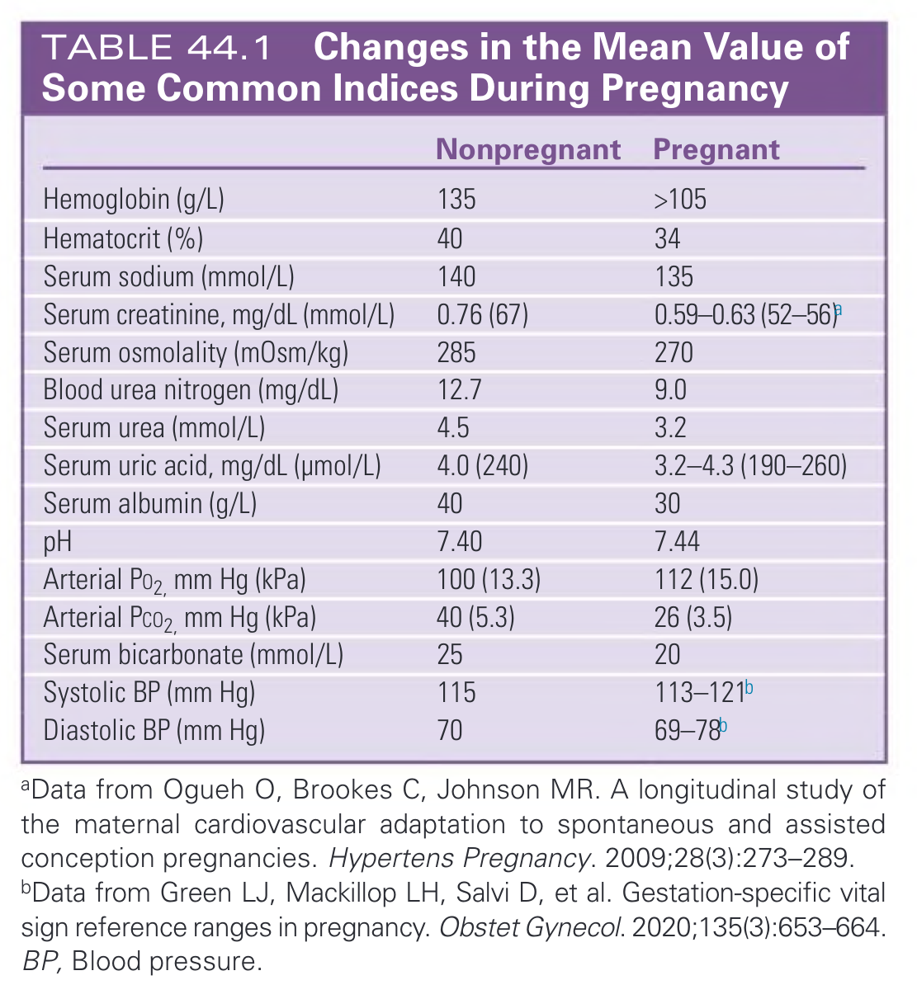

#### Table Data (CSV: [Table_44_1.csv](Table_44_1.csv))

```markdown
| | Nonpregnant | Pregnant |
| :--- | :--- | :--- |
| Hemoglobin (g/L) | 135 | >105 |
| Hematocrit (%) | 40 | 34 |
| Serum sodium (mmol/L) | 140 | 135 |
| Serum creatinine, mg/dL (mmol/L) | 0.76 (67) | 0.59-0.63 (52-56)a |
| Serum osmolality (mOsm/kg) | 285 | 270 |
| Blood urea nitrogen (mg/dL) | 12.7 | 9.0 |
| Serum urea (mmol/L) | 4.5 | 3.2 |
| Serum uric acid, mg/dL (µmol/L) | 4.0 (240) | 3.2-4.3 (190-260) |
| Serum albumin (g/L) | 40 | 30 |
| pH | 7.40 | 7.44 |
| Arterial Po₂, mm Hg (kPa) | 100 (13.3) | 112 (15.0) |
| Arterial Pco₂, mm Hg (kPa) | 40 (5.3) | 26 (3.5) |
| Serum bicarbonate (mmol/L) | 25 | 20 |
| Systolic BP (mm Hg) | 115 | 113-121b |
| Diastolic BP (mm Hg) | 70 | 69-78b |

aData from Ogueh O, Brookes C, Johnson MR. A longitudinal study of the maternal cardiovascular adaptation to spontaneous and assisted conception pregnancies. Hypertens Pregnancy. 2009;28(3):273-289.
bData from Green LJ, Mackillop LH, Salvi D, et al. Gestation-specific vital sign reference ranges in pregnancy. Obstet Gynecol. 2020; 135(3):653-664.
BP, Blood pressure.
```

TABLE 44.1 Changes in the Mean Value of Some Common Indices During Pregnancy

---

### Table_44_2

#### Table Image

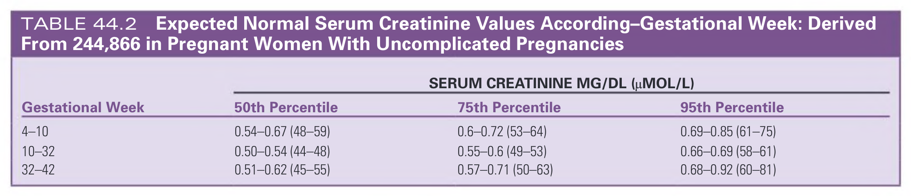

#### Table Data (CSV: [Table_44_2.csv](Table_44_2.csv))

```markdown
| **Gestational Week** | **Serum Creatinine mg/dL (µmol/L): 50th Percentile** | **Serum Creatinine mg/dL (µmol/L): 75th Percentile** | **Serum Creatinine mg/dL (µmol/L): 95th Percentile** |
| :--- | :--- | :--- | :--- |
| 4–10 | 0.54–0.67 (48–59) | 0.6–0.72 (53–64) | 0.69–0.85 (61–75) |
| 10–32 | 0.50–0.54 (44–48) | 0.55–0.6 (49–53) | 0.66–0.69 (58–61) |
| 32–42 | 0.51–0.62 (45–55) | 0.57–0.71 (50–63) | 0.68–0.92 (60–81) |
```

TABLE 44.2 Expected Normal Serum Creatinine Values According–Gestational Week: Derived From 244,866 in Pregnant Women With Uncomplicated Pregnancies

---

### Table_44_3

#### Table Image

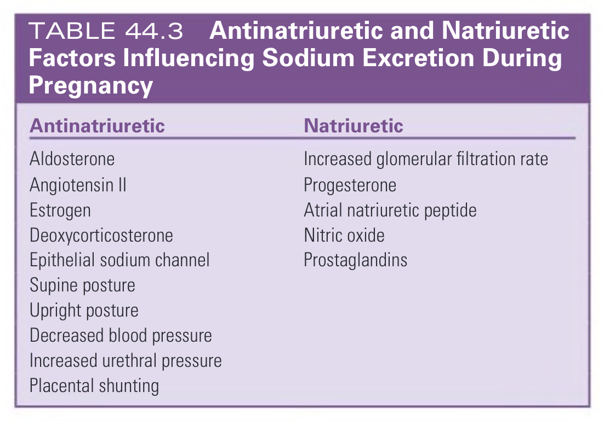

#### Table Data (CSV: [Table_44_3.csv](Table_44_3.csv))

```markdown
| Antinatriuretic | Natriuretic |
| :--- | :--- |
| Aldosterone | Increased glomerular filtration rate |
| Angiotensin II | Progesterone |
| Estrogen | Atrial natriuretic peptide |
| Deoxycorticosterone | Nitric oxide |
| Epithelial sodium channel | Prostaglandins |
| Supine posture | |
| Upright posture | |
| Decreased blood pressure | |
| Increased urethral pressure | |
| Placental shunting | |
```

TABLE 44.3 Antinatriuretic and Natriuretic Factors Influencing Sodium Excretion During Pregnancy

---

### Table_44_4

#### Table Image

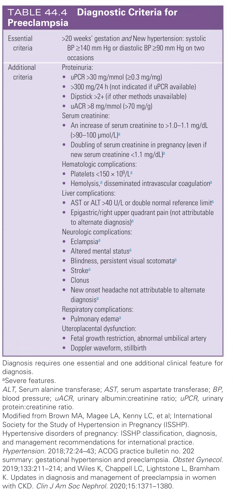

#### Table Data (CSV: [Table_44_4.csv](Table_44_4.csv))

```markdown
| | |
| :--- | :--- |
| **Essential criteria** | >20 weeks' gestation and New hypertension: systolic BP ≥140 mm Hg or diastolic BP ≥90 mm Hg on two occasions |
| **Additional criteria** | Proteinuria: |
| | • uPCR >30 mg/mmol (≥0.3 mg/mg) |
| | • >300 mg/24 h (not indicated if uPCR available) |
| | • Dipstick >2+ (if other methods unavailable) |
| | • uACR >8 mg/mmol (>70 mg/g) |
| | Serum creatinine: |
| | • An increase of serum creatinine to >1.0-1.1 mg/dL (>90-100 µmol/L)a |
| | • Doubling of serum creatinine in pregnancy (even if new serum creatinine <1.1 mg/dL)a |
| | Hematologic complications: |
| | • Platelets <150 × 10⁹/La |
| | • Hemolysis,a disseminated intravascular coagulationa |
| | Liver complications: |
| | • AST or ALT >40 U/L or double normal reference limita |
| | • Epigastric/right upper quadrant pain (not attributable to alternate diagnosis)a |
| | Neurologic complications: |
| | • Eclampsiaa |
| | • Altered mental statusa |
| | • Blindness, persistent visual scotomataa |
| | • Strokea |
| | • Clonus |
| | • New onset headache not attributable to alternate diagnosisa |
| | Respiratory complications: |
| | • Pulmonary edemaa |
| | Uteroplacental dysfunction: |
| | • Fetal growth restriction, abnormal umbilical artery |
| | • Doppler waveform, stillbirth |

Diagnosis requires one essential and one additional clinical feature for diagnosis.
aSevere features.
ALT, Serum alanine transferase; AST, serum aspartate transferase; BP, blood pressure; uACR, urinary albumin:creatinine ratio; uPCR, urinary protein:creatinine ratio.
Modified from Brown MA, Magee LA, Kenny LC, et al; International Society for the Study of Hypertension in Pregnancy (ISSHP). Hypertensive disorders of pregnancy: ISSHP classification, diagnosis, and management recommendations for international practice. Hypertension. 2018;72:24–43; ACOG practice bulletin no. 202 summary: gestational hypertension and preeclampsia. Obstet Gynecol. 2019;133:211-214; and Wiles K, Chappell LC, Lightstone L, Bramham K. Updates in diagnosis and management of preeclampsia in women with CKD. Clin J Am Soc Nephrol. 2020;15:1371-1380.
```

TABLE 44.4 Diagnostic Criteria for Preeclampsia

---

### Table_44_5

#### Table Image

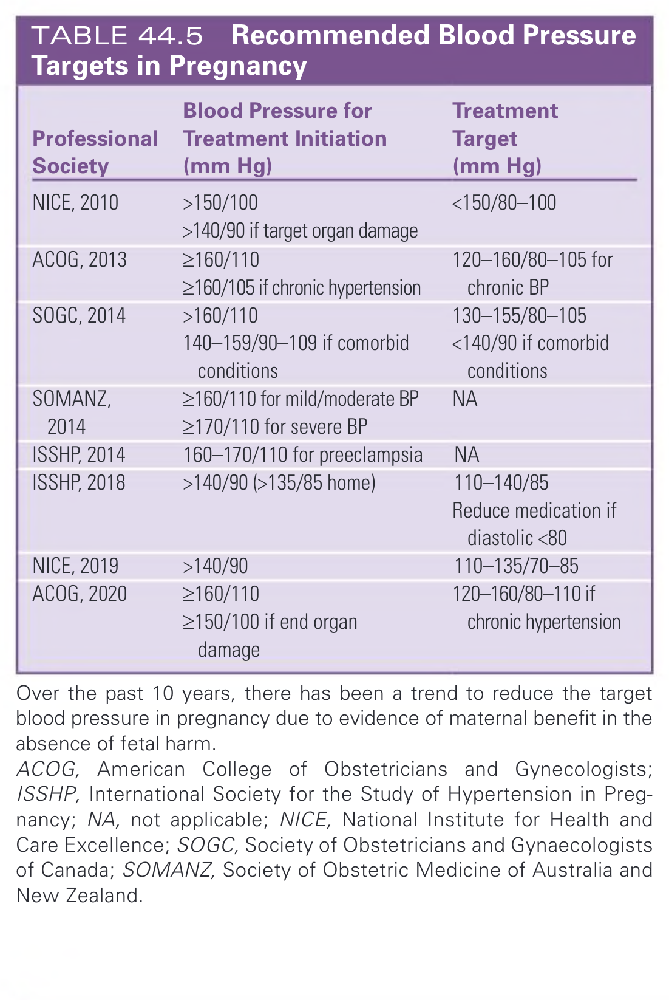

#### Table Data (CSV: [Table_44_5.csv](Table_44_5.csv))

```markdown
| Professional Society | Blood Pressure for Treatment Initiation (mm Hg) | Treatment Target (mm Hg) |
| :--- | :--- | :--- |
| NICE, 2010 | >150/100 >140/90 if target organ damage | <150/80-100 |
| ACOG, 2013 | ≥160/110 ≥160/105 if chronic hypertension | 120-160/80-105 for chronic BP |
| SOGC, 2014 | >160/110 140-159/90-109 if comorbid conditions | 130-155/80-105 <140/90 if comorbid conditions |
| SOMANZ, 2014 | ≥160/110 for mild/moderate BP ≥170/110 for severe BP | NA |
| ISSHP, 2014 | 160-170/110 for preeclampsia | NA |
| ISSHP, 2018 | >140/90 (>135/85 home) | 110-140/85 Reduce medication if diastolic <80 |
| NICE, 2019 | >140/90 | 110-135/70-85 |
| ACOG, 2020 | ≥160/110 ≥150/100 if end organ damage | 120-160/80-110 if chronic hypertension |
Over the past 10 years, there has been a trend to reduce the target blood pressure in pregnancy due to evidence of maternal benefit in the absence of fetal harm.
ACOG, American College of Obstetricians and Gynecologists; ISSHP, International Society for the Study of Hypertension in Pregnancy; NA, not applicable; NICE, National Institute for Health and Care Excellence; SOGC, Society of Obstetricians and Gynaecologists of Canada; SOMANZ, Society of Obstetric Medicine of Australia and New Zealand.
```

TABLE 44.5 Recommended Blood Pressure Targets in Pregnancy

---

### Table_44_6

#### Table Image

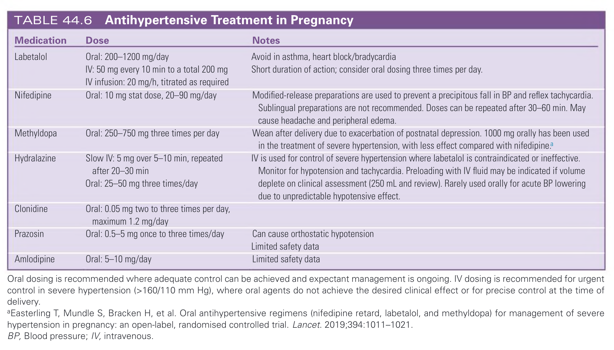

#### Table Data (CSV: [Table_44_6.csv](Table_44_6.csv))

```markdown
| Medication | Dose | Notes |
| :--- | :--- | :--- |
| Labetalol | Oral: 200-1200 mg/day IV: 50 mg every 10 min to a total 200 mg IV infusion: 20 mg/h, titrated as required | Avoid in asthma, heart block/bradycardia Short duration of action; consider oral dosing three times per day. |
| Nifedipine | Oral: 10 mg stat dose, 20-90 mg/day | Modified-release preparations are used to prevent a precipitous fall in BP and reflex tachycardia. Sublingual preparations are not recommended. Doses can be repeated after 30-60 min. May cause headache and peripheral edema. |
| Methyldopa | Oral: 250-750 mg three times per day | Wean after delivery due to exacerbation of postnatal depression. 1000 mg orally has been used in the treatment of severe hypertension, with less effect compared with nifedipine.a |
| Hydralazine | Slow IV: 5 mg over 5-10 min, repeated after 20-30 min Oral: 25-50 mg three times/day | IV is used for control of severe hypertension where labetalol is contraindicated or ineffective. Monitor for hypotension and tachycardia. Preloading with IV fluid may be indicated if volume deplete on clinical assessment (250 mL and review). Rarely used orally for acute BP lowering due to unpredictable hypotensive effect. |
| Clonidine | Oral: 0.05 mg two to three times per day, maximum 1.2 mg/day | |
| Prazosin | Oral: 0.5-5 mg once to three times/day | Can cause orthostatic hypotension Limited safety data |
| Amlodipine | Oral: 5-10 mg/day | Limited safety data |
Oral dosing is recommended where adequate control can be achieved and expectant management is ongoing. IV dosing is recommended for urgent control in severe hypertension (>160/110 mm Hg), where oral agents do not achieve the desired clinical effect or for precise control at the time of delivery.
aEasterling T, Mundle S, Bracken H, et al. Oral antihypertensive regimens (nifedipine retard, labetalol, and methyldopa) for management of severe hypertension in pregnancy: an open-label, randomised controlled trial. Lancet. 2019;394:1011-1021.
BP, Blood pressure; IV, intravenous.
```

TABLE 44.6 Antihypertensive Treatment in Pregnancy

---

### Table_44_7

#### Table Image

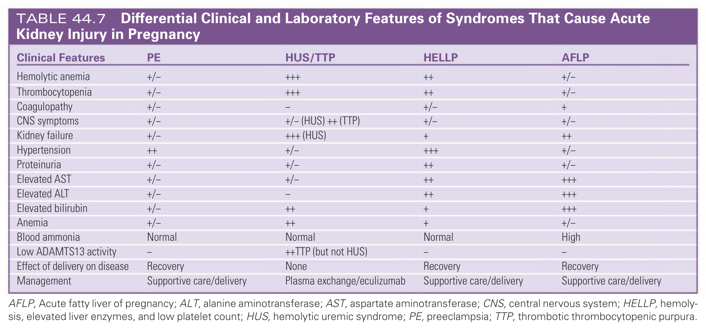

#### Table Data (CSV: [Table_44_7.csv](Table_44_7.csv))

```markdown
| Clinical Features | PE | HUS/TTP | HELLP | AFLP |
| :--- | :--- | :--- | :--- | :--- |
| Hemolytic anemia | +/- | +++ | ++ | +/- |
| Thrombocytopenia | +/- | +++ | ++ | +/- |
| Coagulopathy | +/- | – | +/- | + |
| CNS symptoms | +/- | +/- (HUS) ++ (TTP) | +/- | +/- |
| Kidney failure | +/- | +++ (HUS) | + | ++ |
| Hypertension | ++ | +/- | +++ | +/- |
| Proteinuria | +/- | +/- | ++ | +/- |
| Elevated AST | +/- | +/- | ++ | +++ |
| Elevated ALT | +/- | – | ++ | +++ |
| Elevated bilirubin | +/- | ++ | + | +++ |
| Anemia | +/- | ++ | + | +/- |
| Blood ammonia | Normal | Normal | Normal | High |
| Low ADAMTS13 activity | – | ++TTP (but not HUS) | – | – |
| Effect of delivery on disease | Recovery | None | Recovery | Recovery |
| Management | Supportive care/delivery | Plasma exchange/eculizumab | Supportive care/delivery | Supportive care/delivery |
AFLP, Acute fatty liver of pregnancy; ALT, alanine aminotransferase; AST, aspartate aminotransferase; CNS, central nervous system; HELLP, hemolysis, elevated liver enzymes, and low platelet count; HUS, hemolytic uremic syndrome; PE, preeclampsia; TTP, thrombotic thrombocytopenic purpura.
```

TABLE 44.7 Differential Clinical and Laboratory Features of Syndromes That Cause Acute Kidney Injury in Pregnancy

---

### Table_44_8

#### Table Image

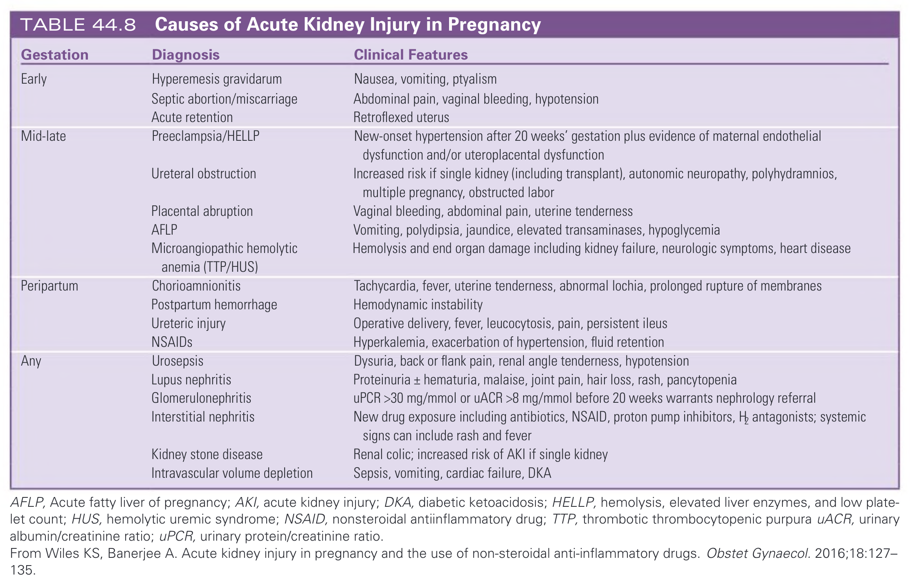

#### Table Data (CSV: [Table_44_8.csv](Table_44_8.csv))

```markdown
| Gestation | Diagnosis | Clinical Features |
| :--- | :--- | :--- |
| Early | Hyperemesis gravidarum | Nausea, vomiting, ptyalism |
| | Septic abortion/miscarriage | Abdominal pain, vaginal bleeding, hypotension |
| | Acute retention | Retroflexed uterus |
| Mid-late | Preeclampsia/HELLP | New-onset hypertension after 20 weeks' gestation plus evidence of maternal endothelial dysfunction and/or uteroplacental dysfunction |
| | Ureteral obstruction | Increased risk if single kidney (including transplant), autonomic neuropathy, polyhydramnios, multiple pregnancy, obstructed labor |
| | Placental abruption | Vaginal bleeding, abdominal pain, uterine tenderness |
| | AFLP | Vomiting, polydipsia, jaundice, elevated transaminases, hypoglycemia |
| | Microangiopathic hemolytic anemia (TTP/HUS) | Hemolysis and end organ damage including kidney failure, neurologic symptoms, heart disease |
| Peripartum | Chorioamnionitis | Tachycardia, fever, uterine tenderness, abnormal lochia, prolonged rupture of membranes |
| | Postpartum hemorrhage | Hemodynamic instability |
| | Ureteric injury | Operative delivery, fever, leucocytosis, pain, persistent ileus |
| | NSAIDs | Hyperkalemia, exacerbation of hypertension, fluid retention |
| Any | Urosepsis | Dysuria, back or flank pain, renal angle tenderness, hypotension |
| | Lupus nephritis | Proteinuria ± hematuria, malaise, joint pain, hair loss, rash, pancytopenia |
| | Glomerulonephritis | uPCR >30 mg/mmol or uACR >8 mg/mmol before 20 weeks warrants nephrology referral |
| | Interstitial nephritis | New drug exposure including antibiotics, NSAID, proton pump inhibitors, H₂ antagonists; systemic signs can include rash and fever |
| | Kidney stone disease | Renal colic; increased risk of AKI if single kidney |
| | Intravascular volume depletion | Sepsis, vomiting, cardiac failure, DKA |
AFLP, Acute fatty liver of pregnancy; AKI, acute kidney injury; DKA, diabetic ketoacidosis; HELLP, hemolysis, elevated liver enzymes, and low platelet count; HUS, hemolytic uremic syndrome; NSAID, nonsteroidal antiinflammatory drug; TTP, thrombotic thrombocytopenic purpura uACR, urinary albumin/creatinine ratio; uPCR, urinary protein/creatinine ratio.
From Wiles KS, Banerjee A. Acute kidney injury in pregnancy and the use of non-steroidal anti-inflammatory drugs. Obstet Gynaecol. 2016;18:127-135.
```

TABLE 44.8 Causes of Acute Kidney Injury in Pregnancy

---

## Boxes

### Box_44_1

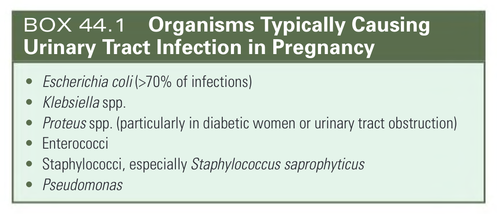

#### Box Text

```markdown
* Escherichia coli (>70% of infections)
* Klebsiella spp.
* Proteus spp. (particularly in diabetic women or urinary tract obstruction)
* Enterococci
* Staphylococci, especially Staphylococcus saprophyticus
* Pseudomonas
```

BOX 44.1 Organisms Typically Causing Urinary Tract Infection in Pregnancy

---

### Box_44_2

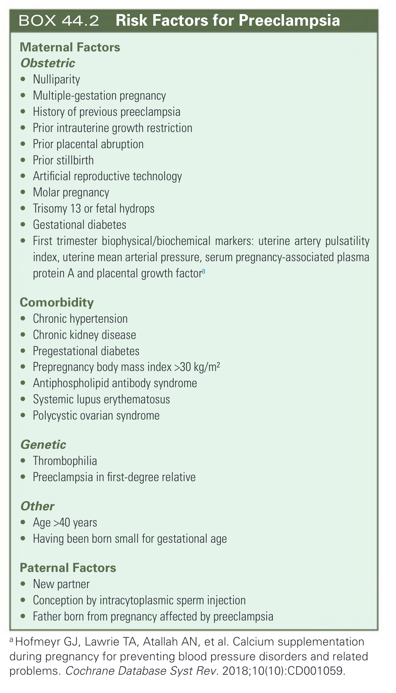

#### Box Text

```markdown
**Maternal Factors**
**Obstetric**
* Nulliparity
* Multiple-gestation pregnancy
* History of previous preeclampsia
* Prior intrauterine growth restriction
* Prior placental abruption
* Prior stillbirth
* Artificial reproductive technology
* Molar pregnancy
* Trisomy 13 or fetal hydrops
* Gestational diabetes
* First trimester biophysical/biochemical markers: uterine artery pulsatility index, uterine mean arterial pressure, serum pregnancy-associated plasma protein A and placental growth factora

**Comorbidity**
* Chronic hypertension
* Chronic kidney disease
* Pregestational diabetes
* Prepregnancy body mass index >30 kg/m²
* Antiphospholipid antibody syndrome
* Systemic lupus erythematosus
* Polycystic ovarian syndrome

**Genetic**
* Thrombophilia
* Preeclampsia in first-degree relative

**Other**
* Age >40 years
* Having been born small for gestational age

**Paternal Factors**
* New partner
* Conception by intracytoplasmic sperm injection
* Father born from pregnancy affected by preeclampsia

a Hofmeyr GJ, Lawrie TA, Atallah AN, et al. Calcium supplementation during pregnancy for preventing blood pressure disorders and related problems. Cochrane Database Syst Rev. 2018;10(10):CD001059.
```

BOX 44.2 Risk Factors for Preeclampsia

---

### Box_44_3

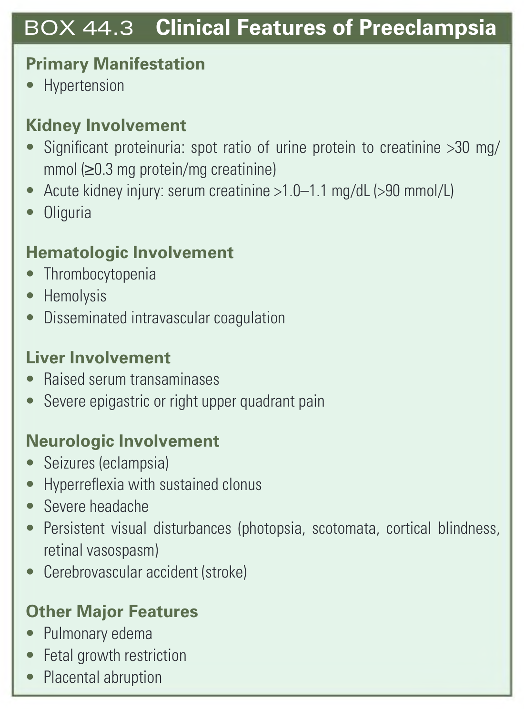

#### Box Text

```markdown
**Primary Manifestation**
* Hypertension

**Kidney Involvement**
* Significant proteinuria: spot ratio of urine protein to creatinine >30 mg/mmol (≥0.3 mg protein/mg creatinine)
* Acute kidney injury: serum creatinine >1.0-1.1 mg/dL (>90 mmol/L)
* Oliguria

**Hematologic Involvement**
* Thrombocytopenia
* Hemolysis
* Disseminated intravascular coagulation

**Liver Involvement**
* Raised serum transaminases
* Severe epigastric or right upper quadrant pain

**Neurologic Involvement**
* Seizures (eclampsia)
* Hyperreflexia with sustained clonus
* Severe headache
* Persistent visual disturbances (photopsia, scotomata, cortical blindness, retinal vasospasm)
* Cerebrovascular accident (stroke)

**Other Major Features**
* Pulmonary edema
* Fetal growth restriction
* Placental abruption
```

BOX 44.3 Clinical Features of Preeclampsia

---

### Box_44_4

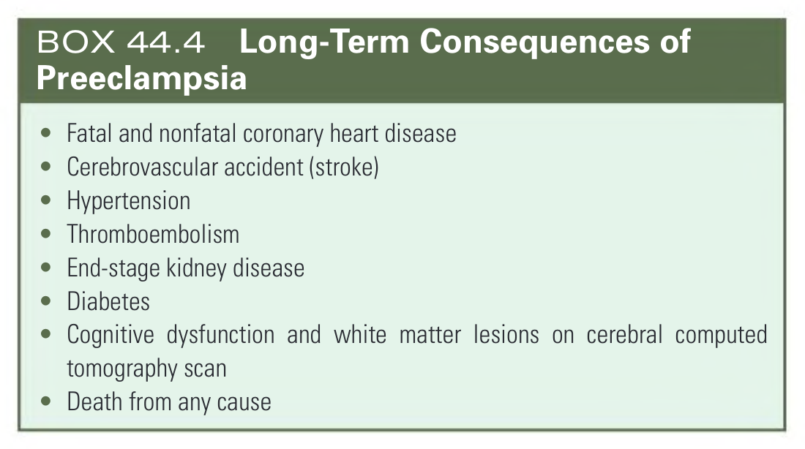

#### Box Text

```markdown
* Fatal and nonfatal coronary heart disease
* Cerebrovascular accident (stroke)
* Hypertension
* Thromboembolism
* End-stage kidney disease
* Diabetes
* Cognitive dysfunction and white matter lesions on cerebral computed tomography scan
* Death from any cause
```

BOX 44.4 Long-Term Consequences of Preeclampsia

---

### Box_44_5

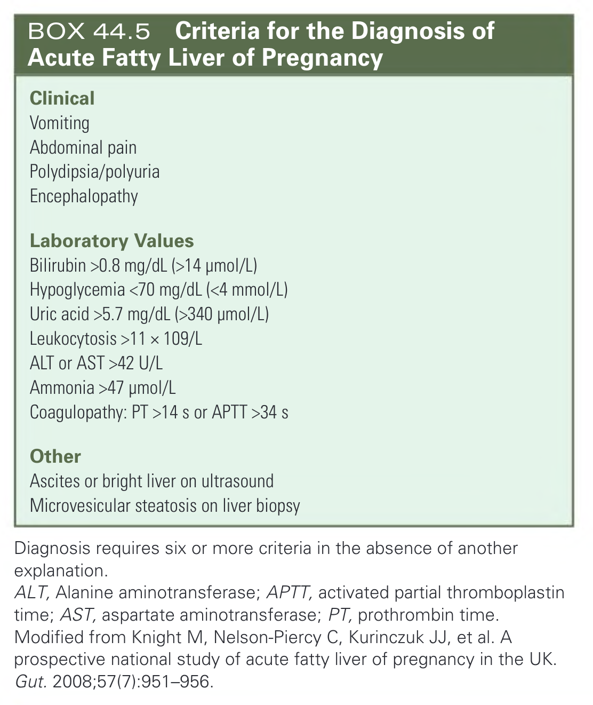

#### Box Text

```markdown
**Clinical**
* Vomiting
* Abdominal pain
* Polydipsia/polyuria
* Encephalopathy

**Laboratory Values**
* Bilirubin >0.8 mg/dL (>14 µmol/L)
* Hypoglycemia <70 mg/dL (<4 mmol/L)
* Uric acid >5.7 mg/dL (>340 µmol/L)
* Leukocytosis >11 × 109/L
* ALT or AST >42 U/L
* Ammonia >47 µmol/L
* Coagulopathy: PT >14 s or APTT >34 s

**Other**
* Ascites or bright liver on ultrasound
* Microvesicular steatosis on liver biopsy

Diagnosis requires six or more criteria in the absence of another explanation.
ALT, Alanine aminotransferase; APTT, activated partial thromboplastin time; AST, aspartate aminotransferase; PT, prothrombin time.
Modified from Knight M, Nelson-Piercy C, Kurinczuk JJ, et al. A prospective national study of acute fatty liver of pregnancy in the UK. Gut. 2008;57(7):951-956.
```

BOX 44.5 Criteria for the Diagnosis of Acute Fatty Liver of Pregnancy

---
