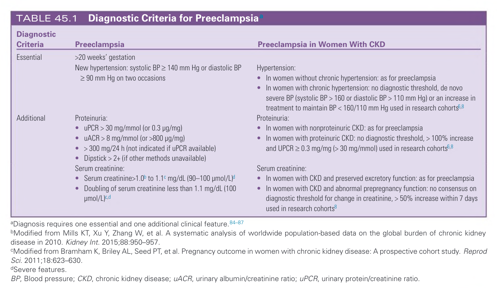
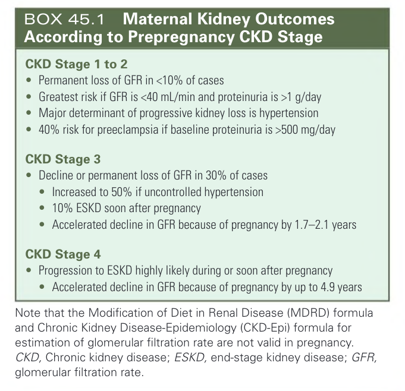
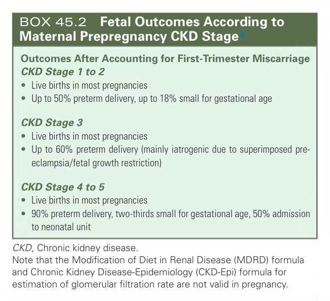
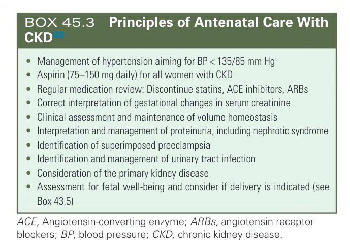
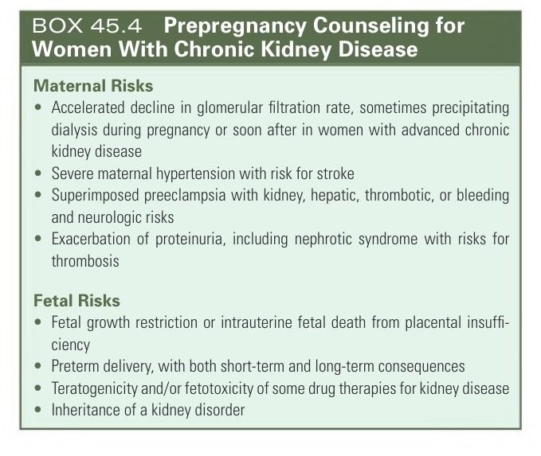
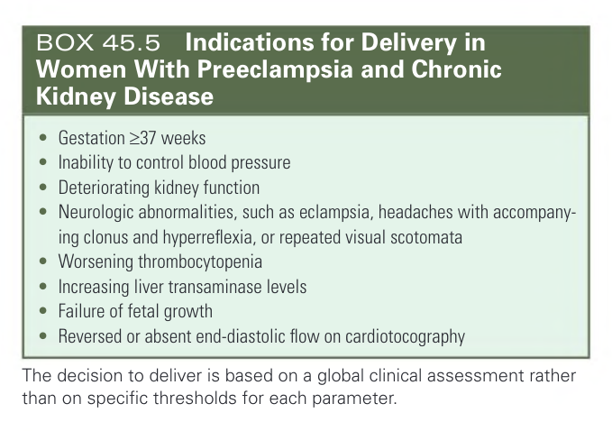
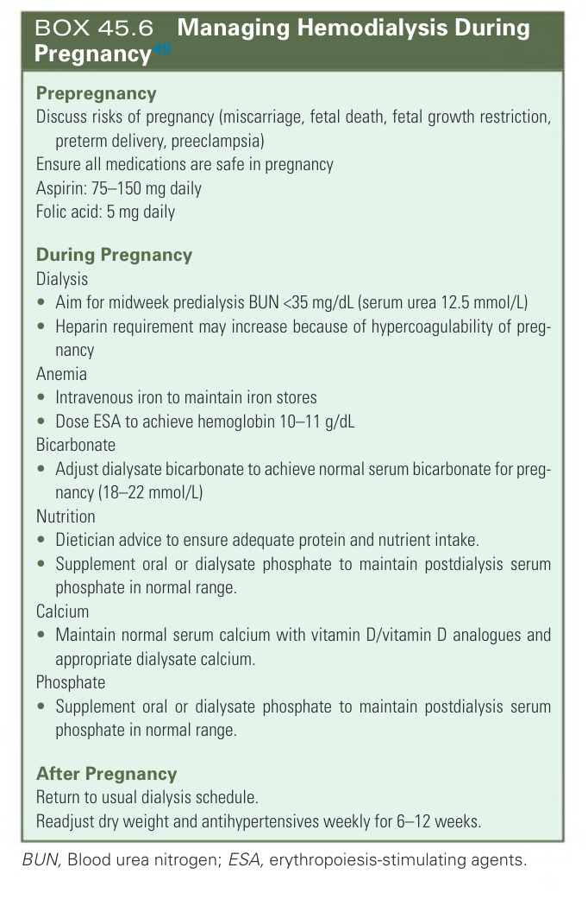
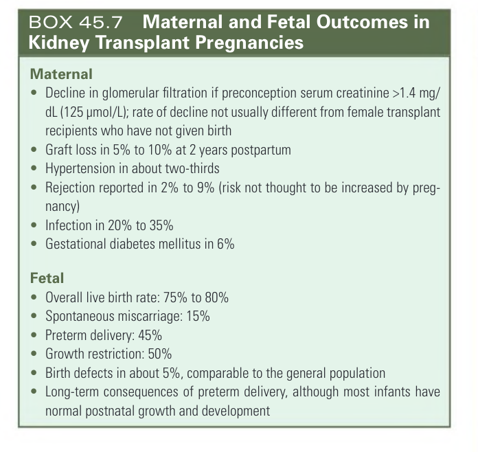
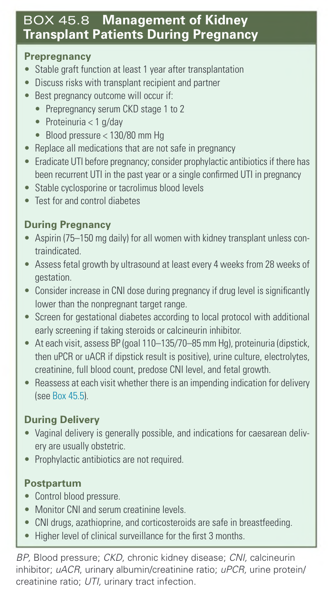
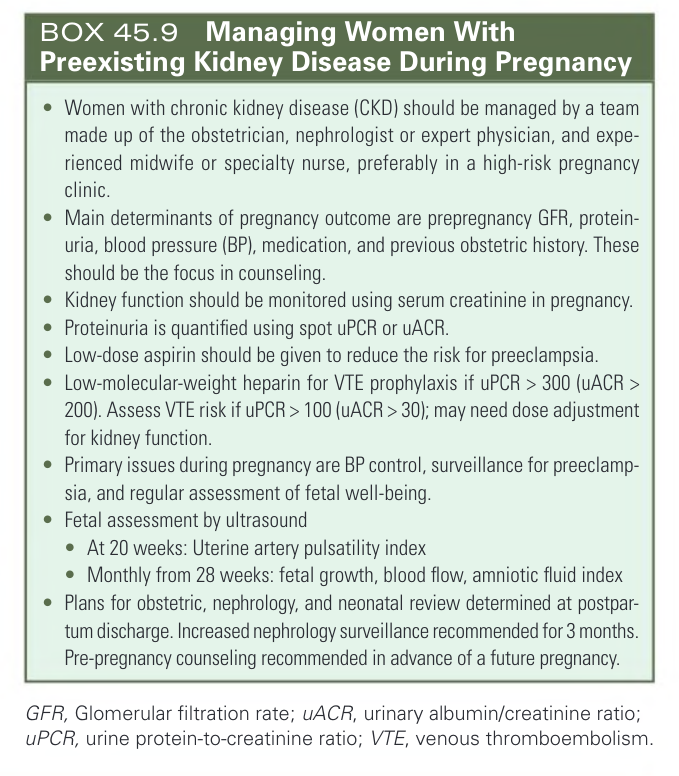

# 045. Pregnancy With Preexisting Kidney Disease - Figures and Tables Index

This document lists all figures, tables and boxes extracted from `045. Pregnancy With Preexisting Kidney Disease.pdf`.

## Table of Contents
- [Figures](#figures)
- [Tables](#tables)
- [Boxes](#boxes)

---

## Figures

*No figures resolved for this chapter.*

## Tables

### Table_45_1

#### Table Image



#### Table Data (CSV: [Table_45_1.csv](Table_45_1.csv))

```markdown
| Diagnostic Criteria | Preeclampsia | Preeclampsia in Women With CKD |
| :--- | :--- | :--- |
| **Essential** | >20 weeks' gestation<br>New hypertension: systolic BP ≥ 140 mm Hg or diastolic BP ≥ 90 mm Hg on two occasions | **Hypertension:**<br>• In women without chronic hypertension: as for preeclampsia<br>• In women with chronic hypertension: no diagnostic threshold, de novo severe BP (systolic BP > 160 or diastolic BP > 110 mm Hg) or an increase in treatment to maintain BP < 160/110 mm Hg used in research cohorts |
| **Additional** | **Proteinuria:**<br>• uPCR > 30 mg/mmol (or 0.3 µg/mg)<br>• uACR > 8 mg/mmol (or >800 µg/mg)<br>• > 300 mg/24 h (not indicated if uPCR available)<br>• Dipstick > 2+ (if other methods unavailable)<br>**Serum creatinine:**<br>• Serum creatinine>1.0 to 1.1 mg/dL (90–100 µmol/L)<br>• Doubling of serum creatinine less than 1.1 mg/dL (100 µmol/L) | **Proteinuria:**<br>• In women with nonproteinuric CKD: as for preeclampsia<br>• In women with proteinuric CKD: no diagnostic threshold, > 100% increase and UPCR ≥ 0.3 mg/mg (> 30 mg/mmol) used in research cohorts<br>**Serum creatinine:**<br>• In women with CKD and preserved excretory function: as for preeclampsia<br>• In women with CKD and abnormal prepregnancy function: no consensus on diagnostic threshold for change in creatinine, > 50% increase within 7 days used in research cohorts |

aDiagnosis requires one essential and one additional clinical feature.
bModified from Mills KT, Xu Y, Zhang W, et al. A systematic analysis of worldwide population-based data on the global burden of chronic kidney disease in 2010. Kidney Int. 2015;88:950-957.
cModified from Bramham K, Briley AL, Seed PT, et al. Pregnancy outcome in women with chronic kidney disease: A prospective cohort study. Reprod Sci. 2011;18:623-630.
dSevere features.
BP, Blood pressure; CKD, chronic kidney disease; uACR, urinary albumin/creatinine ratio; uPCR, urinary protein/creatinine ratio.
```

TABLE 45.1 Diagnostic Criteria for Preeclampsia

---

## Boxes

### Box_45_1



#### Box Text

```markdown
**CKD Stage 1 to 2**
*   Permanent loss of GFR in <10% of cases
*   Greatest risk if GFR is <40 mL/min and proteinuria is >1 g/day
*   Major determinant of progressive kidney loss is hypertension
*   40% risk for preeclampsia if baseline proteinuria is >500 mg/day

**CKD Stage 3**
*   Decline or permanent loss of GFR in 30% of cases
*   Increased to 50% if uncontrolled hypertension
*   10% ESKD soon after pregnancy
*   Accelerated decline in GFR because of pregnancy by 1.7-2.1 years

**CKD Stage 4**
*   Progression to ESKD highly likely during or soon after pregnancy
*   Accelerated decline in GFR because of pregnancy by up to 4.9 years

Note that the Modification of Diet in Renal Disease (MDRD) formula and Chronic Kidney Disease-Epidemiology (CKD-Epi) formula for estimation of glomerular filtration rate are not valid in pregnancy.
CKD, Chronic kidney disease; ESKD, end-stage kidney disease; GFR, glomerular filtration rate.
```

BOX 45.1 Maternal Kidney Outcomes According to Prepregnancy CKD Stage CKD Stage 1 to 2 • Permanent loss of GFR in <10% of cases • Greatest risk if GFR is <40 mL/min and proteinuria is >1 g/day • Major determinant of progressive kidney loss is hypertension • 40% risk for preeclampsia if baseline proteinuria is >500 mg/day CKD Stage 3 • Decline or permanent loss of GFR in 30% of cases • Increased to 50% if uncontrolled hypertension • 10% ESKD soon after pregnancy • Accelerated decline in GFR because of pregnancy by 1.7–2.1 years CKD Stage 4 • Progression to ESKD highly likely during or soon after pregnancy • Accelerated decline in GFR because of pregnancy by up to 4.9 years Note that the Modification of Diet in Renal Disease (MDRD) formula and Chronic Kidney Disease-Epidemiology (CKD-Epi) formula for estimation of glomerular filtration rate are not valid in pregnancy. CKD, Chronic kidney disease; ESKD, end-stage kidney disease; GFR, glomerular filtration rate.

---

### Box_45_2



#### Box Text

```markdown
**Outcomes After Accounting for First-Trimester Miscarriage**
**CKD Stage 1 to 2**
*   Live births in most pregnancies
*   Up to 50% preterm delivery, up to 18% small for gestational age

**CKD Stage 3**
*   Live births in most pregnancies
*   Up to 60% preterm delivery (mainly iatrogenic due to superimposed pre-eclampsia/fetal growth restriction)

**CKD Stage 4 to 5**
*   Live births in most pregnancies
*   90% preterm delivery, two-thirds small for gestational age, 50% admission to neonatal unit

CKD, Chronic kidney disease.
Note that the Modification of Diet in Renal Disease (MDRD) formula and Chronic Kidney Disease-Epidemiology (CKD-Epi) formula for estimation of glomerular filtration rate are not valid in pregnancy.
```

BOX 45.2 Fetal Outcomes According to Maternal Prepregnancy CKD Stage3 Outcomes After Accounting for First-Trimester Miscarriage CKD Stage 1 to 2 • Live births in most pregnancies • Up to 50% preterm delivery, up to 18% small for gestational age CKD Stage 3 • Live births in most pregnancies • Up to 60% preterm delivery (mainly iatrogenic due to superimposed preeclampsia/fetal growth restriction) CKD Stage 4 to 5 • Live births in most pregnancies • 90% preterm delivery, two-thirds small for gestational age, 50% admission to neonatal unit CKD Chronic kidney disease C , C o c d ey d sease Note that the Modification of Diet in Renal Disease (MDRD) formula and Chronic Kidney Disease-Epidemiology (CKD-Epi) formula for estimation of glomerular filtration rate are not valid in pregnancy.

---

### Box_45_3



#### Box Text

```markdown
*   Management of hypertension aiming for BP < 135/85 mm Hg
*   Aspirin (75-150 mg daily) for all women with CKD
*   Regular medication review: Discontinue statins, ACE inhibitors, ARBs
*   Correct interpretation of gestational changes in serum creatinine
*   Clinical assessment and maintenance of volume homeostasis
*   Interpretation and management of proteinuria, including nephrotic syndrome
*   Identification of superimposed preeclampsia
*   Identification and management of urinary tract infection
*   Consideration of the primary kidney disease
*   Assessment for fetal well-being and consider if delivery is indicated (see Box 43.5)

ACE, Angiotensin-converting enzyme; ARBs, angiotensin receptor blockers; BP, blood pressure; CKD, chronic kidney disease.
```

BOX 45.3 Principles of Antenatal Care With CKD88 • Management of hypertension aiming for BP < 135/85 mm Hg • Aspirin (75–150 mg daily) for all women with CKD • Regular medication review: Discontinue statins, ACE inhibitors, ARBs • Correct interpretation of gestational changes in serum creatinine • Clinical assessment and maintenance of volume homeostasis • Interpretation and management of proteinuria, including nephrotic syndrome • Identification of superimposed preeclampsia • Identification and management of urinary tract infection • Consideration of the primary kidney disease • Assessment for fetal well-being and consider if delivery is indicated (see Box 43.5) ACE, Angiotensin-converting enzyme; ARBs, angiotensin receptor blockers; BP, blood pressure; CKD, chronic kidney disease.

---

### Box_45_4



#### Box Text

```markdown
**Maternal Risks**
*   Accelerated decline in glomerular filtration rate, sometimes precipitating dialysis during pregnancy or soon after in women with advanced chronic kidney disease
*   Severe maternal hypertension with risk for stroke
*   Superimposed preeclampsia with kidney, hepatic, thrombotic, or bleeding and neurologic risks
*   Exacerbation of proteinuria, including nephrotic syndrome with risks for thrombosis

**Fetal Risks**
*   Fetal growth restriction or intrauterine fetal death from placental insufficiency
*   Preterm delivery, with both short-term and long-term consequences
*   Teratogenicity and/or fetotoxicity of some drug therapies for kidney disease
*   Inheritance of a kidney disorder
```

BOX 45.4 Prepregnancy Counseling for Women With Chronic Kidney Disease Maternal Risks • Accelerated decline in glomerular filtration rate, sometimes precipitating dialysis during pregnancy or soon after in women with advanced chronic kidney disease • Severe maternal hypertension with risk for stroke • Superimposed preeclampsia with kidney, hepatic, thrombotic, or bleeding and neurologic risks • Exacerbation of proteinuria, including nephrotic syndrome with risks for thrombosis Fetal Risks • Fetal growth restriction or intrauterine fetal death from placental insufficiency • Preterm delivery, with both short-term and long-term consequences • Teratogenicity and/or fetotoxicity of some drug therapies for kidney disease • Inheritance of a kidney disorder

---

### Box_45_5



#### Box Text

```markdown
*   Gestation ≥37 weeks
*   Inability to control blood pressure
*   Deteriorating kidney function
*   Neurologic abnormalities, such as eclampsia, headaches with accompanying clonus and hyperreflexia, or repeated visual scotomata
*   Worsening thrombocytopenia
*   Increasing liver transaminase levels
*   Failure of fetal growth
*   Reversed or absent end-diastolic flow on cardiotocography

The decision to deliver is based on a global clinical assessment rather than on specific thresholds for each parameter.
```

BOX 45.5 Indications for Delivery in Women With Preeclampsia and Chronic Kidney Disease • Gestation ≥37 weeks • Inability to control blood pressure • Deteriorating kidney function • Neurologic abnormalities, such as eclampsia, headaches with accompanying clonus and hyperreflexia, or repeated visual scotomata • Worsening thrombocytopenia • Increasing liver transaminase levels • Failure of fetal growth • Reversed or absent end-diastolic flow on cardiotocography The decision to deliver is based on a global clinical assessment rather than on specific thresholds for each parameter.

---

### Box_45_6



#### Box Text

```markdown
**Prepregnancy**
Discuss risks of pregnancy (miscarriage, fetal death, fetal growth restriction, preterm delivery, preeclampsia)
Ensure all medications are safe in pregnancy
Aspirin: 75-150 mg daily
Folic acid: 5 mg daily

**During Pregnancy**
**Dialysis**
*   Aim for midweek predialysis BUN <35 mg/dL (serum urea 12.5 mmol/L)
*   Heparin requirement may increase because of hypercoagulability of pregnancy
**Anemia**
*   Intravenous iron to maintain iron stores
*   Dose ESA to achieve hemoglobin 10-11 g/dL
**Bicarbonate**
*   Adjust dialysate bicarbonate to achieve normal serum bicarbonate for pregnancy (18-22 mmol/L)
**Nutrition**
*   Dietician advice to ensure adequate protein and nutrient intake.
*   Supplement oral or dialysate phosphate to maintain postdialysis serum phosphate in normal range.
**Calcium**
*   Maintain normal serum calcium with vitamin D/vitamin D analogues and appropriate dialysate calcium.
**Phosphate**
*   Supplement oral or dialysate phosphate to maintain postdialysis serum phosphate in normal range.

**After Pregnancy**
Return to usual dialysis schedule.
Readjust dry weight and antihypertensives weekly for 6-12 weeks.

BUN, Blood urea nitrogen; ESA, erythropoiesis-stimulating agents.
```

BOX 45.6 Managing Hemodialysis During Pregnancy49 Prepregnancy Discuss risks of pregnancy (miscarriage, fetal death, fetal growth restriction, preterm delivery, preeclampsia) Ensure all medications are safe in pregnancy Aspirin: 75–150 mg daily Folic acid: 5 mg daily During Pregnancy Dialysis • Aim for midweek predialysis BUN <35 mg/dL (serum urea 12.5 mmol/L) • Heparin requirement may increase because of hypercoagulability of pregnancy Anemia • Intravenous iron to maintain iron stores • Dose ESA to achieve hemoglobin 10–11 g/dL Bicarbonate • Adjust dialysate bicarbonate to achieve normal serum bicarbonate for pregnancy (18–22 mmol/L) Nutrition • Dietician advice to ensure adequate protein and nutrient intake. • Supplement oral or dialysate phosphate to maintain postdialysis serum phosphate in normal range. Calcium • Maintain normal serum calcium with vitamin D/vitamin D analogues and appropriate dialysate calcium. Phosphate • Supplement oral or dialysate phosphate to maintain postdialysis serum phosphate in normal range. After Pregnancy Return to usual dialysis schedule. Readjust dry weight and antihypertensives weekly for 6–12 weeks. BUN, Blood urea nitrogen; ESA, erythropoiesis-stimulating agents.

---

### Box_45_7



#### Box Text

```markdown
**Maternal**
*   Decline in glomerular filtration if preconception serum creatinine >1.4 mg/dL (125 µmol/L); rate of decline not usually different from female transplant recipients who have not given birth
*   Graft loss in 5% to 10% at 2 years postpartum
*   Hypertension in about two-thirds
*   Rejection reported in 2% to 9% (risk not thought to be increased by pregnancy)
*   Infection in 20% to 35%
*   Gestational diabetes mellitus in 6%

**Fetal**
*   Overall live birth rate: 75% to 80%
*   Spontaneous miscarriage: 15%
*   Preterm delivery: 45%
*   Growth restriction: 50%
*   Birth defects in about 5%, comparable to the general population
*   Long-term consequences of preterm delivery, although most infants have normal postnatal growth and development
```

BOX 45.7 Maternal and Fetal Outcomes in Kidney Transplant Pregnancies Maternal • Decline in glomerular filtration if preconception serum creatinine >1.4 mg/ dL (125 μmol/L); rate of decline not usually different from female transplant recipients who have not given birth • Graft loss in 5% to 10% at 2 years postpartum • Hypertension in about two-thirds • Rejection reported in 2% to 9% (risk not thought to be increased by pregnancy) • Infection in 20% to 35% • Gestational diabetes mellitus in 6% Fetal • Overall live birth rate: 75% to 80% • Spontaneous miscarriage: 15% • Preterm delivery: 45% • Growth restriction: 50% • Birth defects in about 5%, comparable to the general population • Long-term consequences of preterm delivery, although most infants have normal postnatal growth and development

---

### Box_45_8



#### Box Text

```markdown
**Prepregnancy**
*   Stable graft function at least 1 year after transplantation
*   Discuss risks with transplant recipient and partner
*   Best pregnancy outcome will occur if:
*   Prepregnancy serum CKD stage 1 to 2
*   Proteinuria < 1 g/day
*   Blood pressure < 130/80 mm Hg
*   Replace all medications that are not safe in pregnancy
*   Eradicate UTI before pregnancy; consider prophylactic antibiotics if there has been recurrent UTI in the past year or a single confirmed UTI in pregnancy
*   Stable cyclosporine or tacrolimus blood levels
*   Test for and control diabetes

**During Pregnancy**
*   Aspirin (75-150 mg daily) for all women with kidney transplant unless contraindicated.
*   Assess fetal growth by ultrasound at least every 4 weeks from 28 weeks of gestation.
*   Consider increase in CNI dose during pregnancy if drug level is significantly lower than the nonpregnant target range.
*   Screen for gestational diabetes according to local protocol with additional early screening if taking steroids or calcineurin inhibitor.
*   At each visit, assess BP (goal 110–135/70-85 mm Hg), proteinuria (dipstick, then uPCR or uACR if dipstick result is positive), urine culture, electrolytes, creatinine, full blood count, predose CNI level, and fetal growth.
*   Reassess at each visit whether there is an impending indication for delivery (see Box 45.5).

**During Delivery**
*   Vaginal delivery is generally possible, and indications for caesarean delivery are usually obstetric.
*   Prophylactic antibiotics are not required.

**Postpartum**
*   Control blood pressure.
*   Monitor CNI and serum creatinine levels.
*   CNI drugs, azathioprine, and corticosteroids are safe in breastfeeding.
*   Higher level of clinical surveillance for the first 3 months.

BP, Blood pressure; CKD, chronic kidney disease; CNI, calcineurin inhibitor; uACR, urinary albumin/creatinine ratio; uPCR, urine protein/creatinine ratio; UTI, urinary tract infection.
```

BOX 45.8 Management of Kidney Transplant Patients During Pregnancy Prepregnancy • Stable graft function at least 1 year after transplantation • Discuss risks with transplant recipient and partner • Best pregnancy outcome will occur if: • Prepregnancy serum CKD stage 1 to 2 • Proteinuria < 1 g/day • Blood pressure < 130/80 mm Hg • Replace all medications that are not safe in pregnancy • Eradicate UTI before pregnancy; consider prophylactic antibiotics if there has been recurrent UTI in the past year or a single confirmed UTI in pregnancy • Stable cyclosporine or tacrolimus blood levels • Test for and control diabetes During Pregnancy • Aspirin (75–150 mg daily) for all women with kidney transplant unless contraindicated. • Assess fetal growth by ultrasound at least every 4 weeks from 28 weeks of gestation. • Consider increase in CNI dose during pregnancy if drug level is significantly lower than the nonpregnant target range. • Screen for gestational diabetes according to local protocol with additional early screening if taking steroids or calcineurin inhibitor. • At each visit, assess BP (goal 110–135/70–85 mm Hg), proteinuria (dipstick, then uPCR or uACR if dipstick result is positive), urine culture, electrolytes, creatinine, full blood count, predose CNI level, and fetal growth. • Reassess at each visit whether there is an impending indication for delivery (see Box 45.5). During Delivery • Vaginal delivery is generally possible, and indications for caesarean delivery are usually obstetric. • Prophylactic antibiotics are not required. Postpartum • Control blood pressure. • Monitor CNI and serum creatinine levels. • CNI drugs, azathioprine, and corticosteroids are safe in breastfeeding. • Higher level of clinical surveillance for the first 3 months. BP, Blood pressure; CKD, chronic kidney disease; CNI, calcineurin inhibitor; uACR urinary albumin/creatinine ratio; uPCR urine protein/ y p creatinine ratio; UTI, urinary tract infection.

---

### Box_45_9



#### Box Text

```markdown
*   Women with chronic kidney disease (CKD) should be managed by a team made up of the obstetrician, nephrologist or expert physician, and experienced midwife or specialty nurse, preferably in a high-risk pregnancy clinic.
*   Main determinants of pregnancy outcome are prepregnancy GFR, proteinuria, blood pressure (BP), medication, and previous obstetric history. These should be the focus in counseling.
*   Kidney function should be monitored using serum creatinine in pregnancy.
*   Proteinuria is quantified using spot uPCR or uACR.
*   Low-dose aspirin should be given to reduce the risk for preeclampsia.
*   Low-molecular-weight heparin for VTE prophylaxis if uPCR > 300 (uACR > 200). Assess VTE risk if uPCR > 100 (uACR > 30); may need dose adjustment for kidney function.
*   Primary issues during pregnancy are BP control, surveillance for preeclampsia, and regular assessment of fetal well-being.
*   Fetal assessment by ultrasound
    *   At 20 weeks: Uterine artery pulsatility index
    *   Monthly from 28 weeks: fetal growth, blood flow, amniotic fluid index
*   Plans for obstetric, nephrology, and neonatal review determined at postpartum discharge. Increased nephrology surveillance recommended for 3 months. Pre-pregnancy counseling recommended in advance of a future pregnancy.

GFR, Glomerular filtration rate; uACR, urinary albumin/creatinine ratio; uPCR, urine protein-to-creatinine ratio; VTE, venous thromboembolism.
```

BOX 45.9 Managing Women With Preexisting Kidney Disease During Pregnancy • Women with chronic kidney disease (CKD) should be managed by a team made up of the obstetrician, nephrologist or expert physician, and experienced midwife or specialty nurse, preferably in a high-risk pregnancy clinic. • Main determinants of pregnancy outcome are prepregnancy GFR, proteinuria, blood pressure (BP), medication, and previous obstetric history. These should be the focus in counseling. • Kidney function should be monitored using serum creatinine in pregnancy. • Proteinuria is quantified using spot uPCR or uACR. • Low-dose aspirin should be given to reduce the risk for preeclampsia. • Low-molecular-weight heparin for VTE prophylaxis if uPCR > 300 (uACR > 200). Assess VTE risk if uPCR > 100 (uACR > 30); may need dose adjustment for kidney function. • Primary issues during pregnancy are BP control, surveillance for preeclampsia, and regular assessment of fetal well-being. • Fetal assessment by ultrasound • At 20 weeks: Uterine artery pulsatility index • Monthly from 28 weeks: fetal growth, blood flow, amniotic fluid index • Plans for obstetric, nephrology, and neonatal review determined at postpartum discharge. Increased nephrology surveillance recommended for 3 months. Pre-pregnancy counseling recommended in advance of a future pregnancy. GFR, Glomerular filtration rate; uACR, urinary albumin/creatinine ratio; uPCR, urine protein-to-creatinine ratio; VTE, venous thromboembolism.

---
