# 046. Autosomal Dominant Polycystic Kidney Disease - Figures and Tables Index

This document lists all figures, tables and boxes extracted from `046. Autosomal Dominant Polycystic Kidney Disease.pdf`.

## Table of Contents
- [Figures](#figures)
- [Tables](#tables)
- [Boxes](#boxes)

---

## Figures

### Fig_46_1

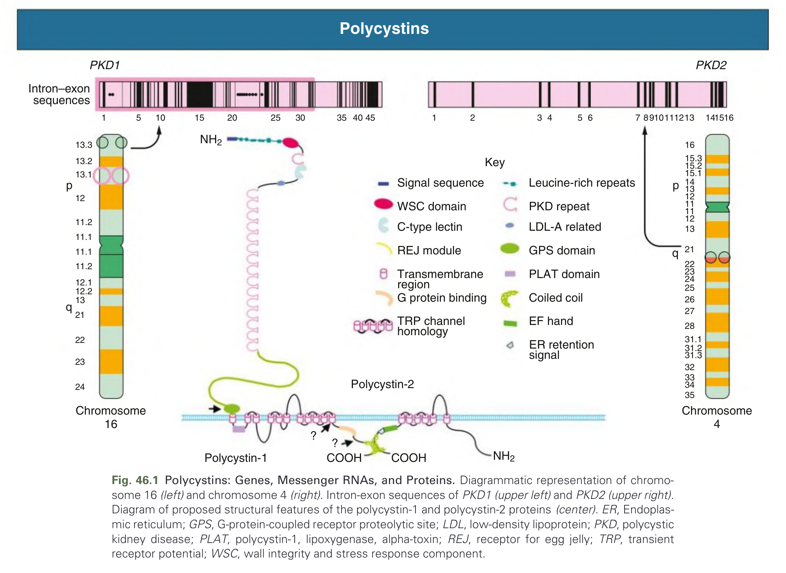

Fig. 46.1 Polycystins: Genes, Messenger RNAs, and Proteins. Diagrammatic representation of chromosome 16 (left) and chromosome 4 (right), PKD1 and PKD2 genes, PC1 and PC2 transcripts, and predicted PC1 and PC2 domain structures. Cleavage at the GPS site generates an N-terminal (NTF) and a C-terminal (CTF) fragment that remain tethered. C-type lectin, Carbohydrate recognition domain; EF, EF-hand motif; ER, endoplasmic reticulum; GPS, G protein–coupled receptor proteolytic site; Ig, immunoglobulin-like domain; LRR, leucine-rich repeat; PKD, polycystic kidney disease motif; PLAT, polycystin/lipoxygenase/α-toxin domain; REJ, receptor for egg jelly domain; TM, transmembrane domain; WNT, WNT-binding domain. (From Harris PC, Torres VE. Polycystic kidney disease. Annu Rev Med. 2009;60:321–337.)

---

### Fig_46_2

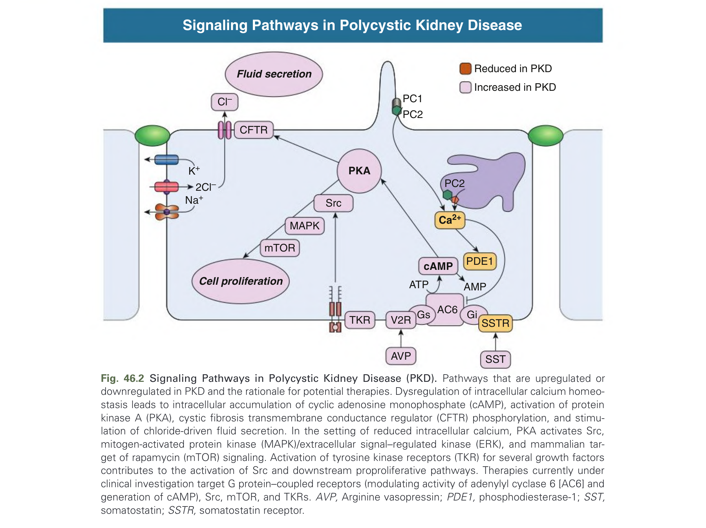

Fig. 46.2 Signaling Pathways in Polycystic Kidney Disease (PKD). Pathways that are upregulated or downregulated in PKD are depicted. Polycystin-1 and polycystin-2 modulate several signaling pathways, including intracellular Ca2+, cAMP, and other signaling proteins. Reduction in PC1 or PC2 alters these pathways, causing cell proliferation, fluid secretion, cyst enlargement, and loss of kidney function. AC6, Adenylate cyclase 6; CFTR, cystic fibrosis transmembrane conductance regulator; ENaC, epithelial sodium channel; MAPK, mitogen-activated protein kinase; PDE1, phosphodiesterase 1; PKA, protein kinase A; TMEM16A, transmembrane member 16A; TRPP2, transient receptor potential polycystic 2. (Adapted from Torres VE, Harris PC. Strategies targeting cAMP signaling in the treatment of polycystic kidney disease. J Am Soc Nephrol. 2014;25(1):18–32.)

---

### Fig_46_3

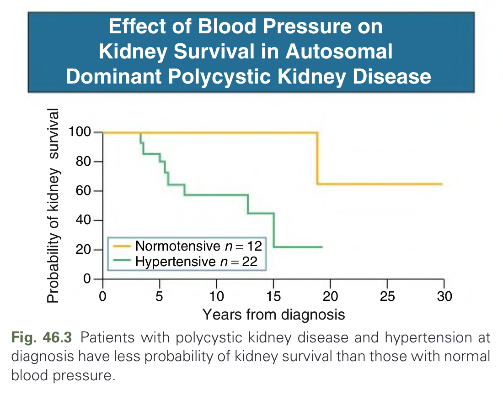

Fig. 46.3 Patients with polycystic kidney disease and hypertension at diagnosis have less probability of kidney survival than those with normal blood pressure. Cumulative kidney survival from the time of diagnosis of autosomal dominant polycystic kidney disease is shown. ESKD, End-stage kidney disease. (From Gabow PA, Johnson AM, Kaehny WD, et al. Factors affecting the progression of renal disease in autosomal-dominant polycystic kidney disease. Kidney Int. 1992;41(5):1311–1319.)

---

### Fig_46_4

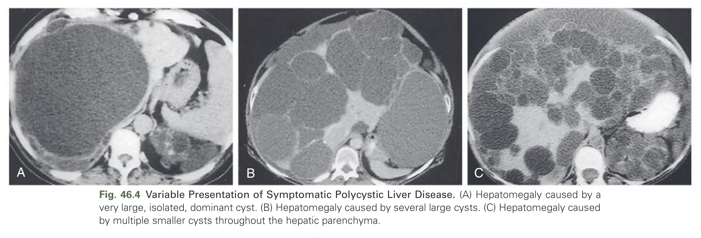

Fig. 46.4 Variable Presentation of Symptomatic Polycystic Liver Disease. (A) Hepatomegaly caused by a very large, isolated, dominant cyst. (B) Hepatomegaly caused by several large cysts. (C) Hepatomegaly caused by multiple smaller cysts throughout the hepatic parenchyma.

---

### Fig_46_5

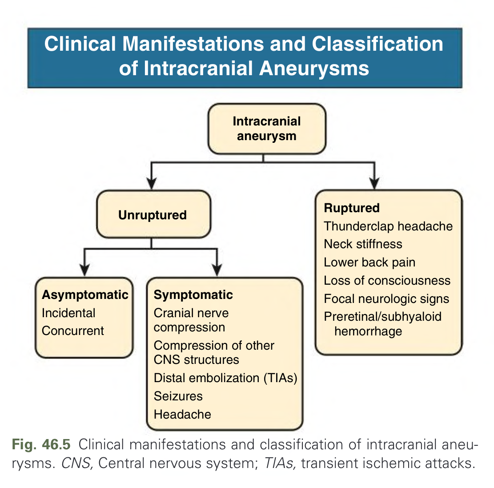

Fig. 46.5 Clinical manifestations and classification of intracranial aneurysms. CNS, Central nervous system; TIAs, transient ischemic attacks. (From Xu HW, Yu SQ, Mei CL, et al. Screening for intracranial aneurysm in 355 patients with autosomal-dominant polycystic kidney disease. Stroke. 2011;42(1):204–206.)

---

### Fig_46_6

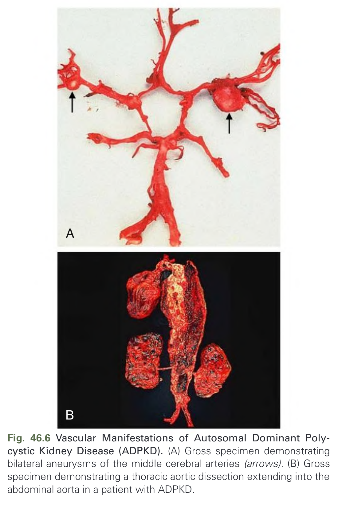

Fig. 46.6 Vascular Manifestations of Autosomal Dominant Polycystic Kidney Disease (ADPKD). (A) Gross specimen demonstrating a ruptured berry aneurysm (arrow) at the bifurcation of the anterior cerebral and anterior communicating arteries. (B) Thoracic aortic aneurysm (arrow) detected in a 47-year-old man with ADPKD. (From Bae KT, Grantham JJ. Vascular complications in autosomal dominant polycystic kidney disease. In: Watson ML, Torres VE, eds. Polycystic Kidney Disease. Oxford University Press; 1999:275–302.)

---

### Fig_46_7

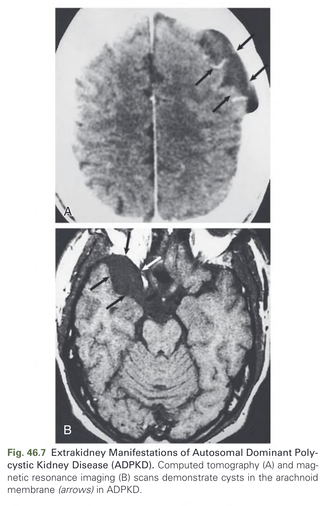

Fig. 46.7 Extrakidney Manifestations of Autosomal Dominant Polycystic Kidney Disease (ADPKD). Computed tomography (A) and three-dimensional surface-rendered reconstruction (B) of a massive incisional hernia in an ADPKD patient. (From Watson ML, Torres VE, eds. Polycystic Kidney Disease. Oxford University Press; 1999.)

---

### Fig_46_8

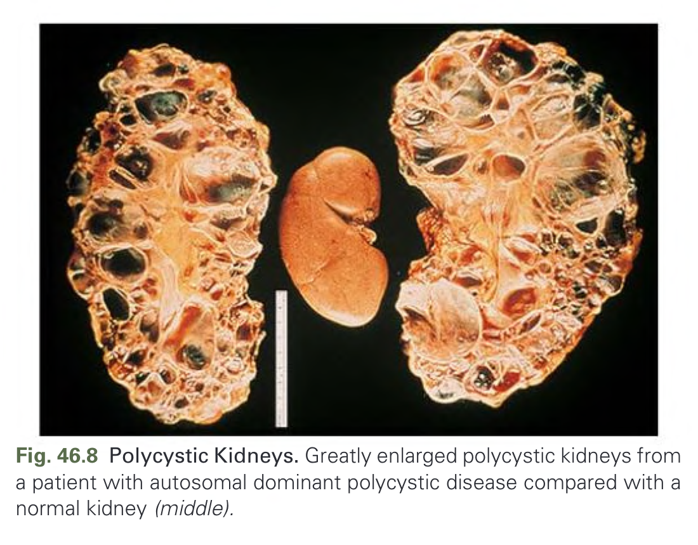

Fig. 46.8 Polycystic Kidneys. Greatly enlarged polycystic kidneys from a patient with autosomal dominant polycystic kidney disease who presented with bilateral palpable abdominal masses. (From Gabow PA. Autosomal dominant polycystic kidney disease. N Engl J Med. 1993;329(5):332–342.)

---

### Fig_46_9

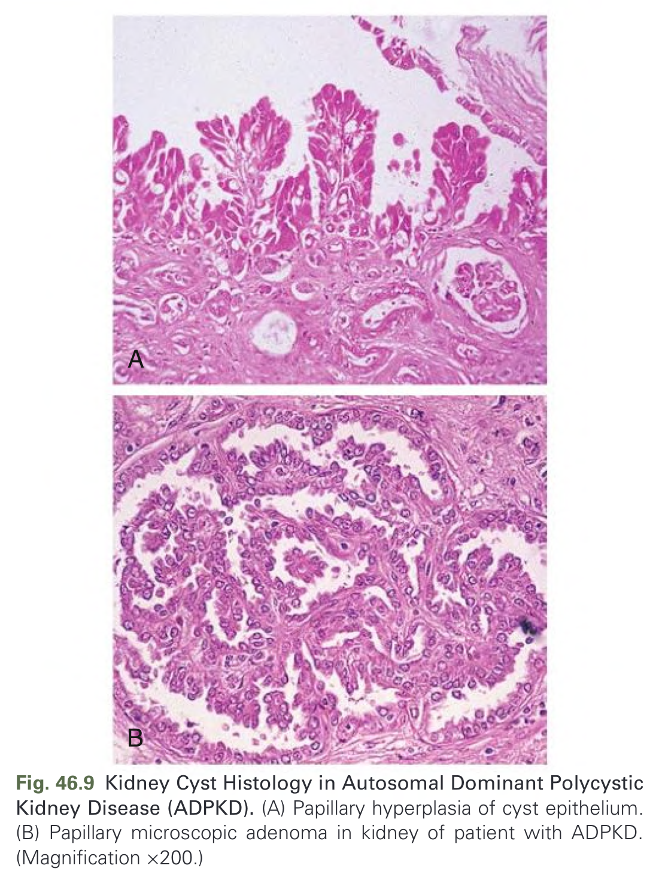

Fig. 46.9 Kidney Cyst Histology in Autosomal Dominant Polycystic Kidney Disease (ADPKD). (A) Papillary hyperplasia of cyst-lining epithelium. (B) Segmental microcyst formation in a renal tubule. (C) Detached cyst lined by flattened epithelial cells. (From Watson ML, Torres VE, eds. Polycystic Kidney Disease. Oxford University Press; 1999.)

---

### Fig_46_10

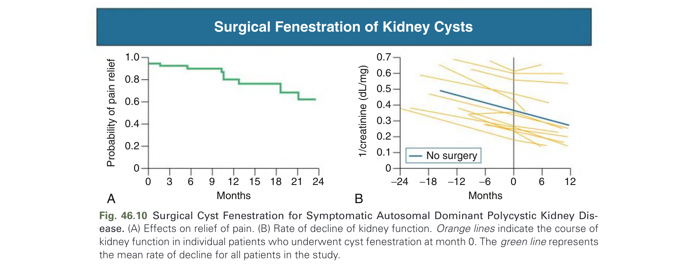

Fig. 46.10 Surgical Cyst Fenestration for Symptomatic Autosomal Dominant Polycystic Kidney Disease. (A) Effects on relief of chronic pain in 30 patients. (B) Laparoscopic cyst fenestration: a large cyst dome is excised (arrow). (From Elzinga LW, Barry JM, Torres VE, et al. Cyst decompression surgery for autosomal dominant polycystic kidney disease. J Am Soc Nephrol. 1992;3(2):187–194.)

---

### Fig_46_11

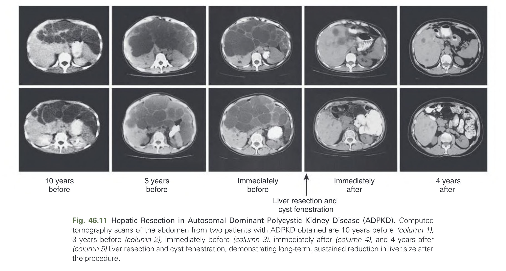

Fig. 46.11 Hepatic Resection in Autosomal Dominant Polycystic Kidney Disease (ADPKD). Computed tomography of the liver before (A) and after (B) combined partial hepatic resection and cyst fenestration in a patient with massive polycystic liver disease. (From Que F, Nagorney DM, Gross JB Jr, et al. Liver resection and cyst fenestration in the treatment of severe polycystic liver disease. Gastroenterology. 1995;108(2):487–494.)

---

## Tables

### Table_46_1

#### Table Image

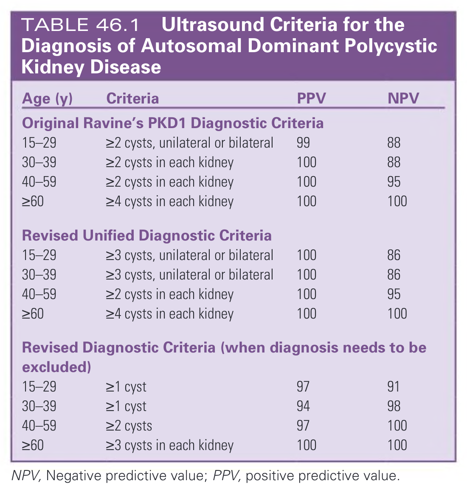

#### Table Data (CSV: [Table_46_1.csv](Table_46_1.csv))

```markdown
| Age (y) | Criteria | PPV | NPV |
| :--- | :--- | :--- | :--- |
| **Original Ravine's PKD1 Diagnostic Criteria** | | | |
| 15-29 | ≥2 cysts, unilateral or bilateral | 99 | 88 |
| 30-39 | ≥2 cysts in each kidney | 100 | 88 |
| 40-59 | ≥2 cysts in each kidney | 100 | 95 |
| ≥60 | ≥4 cysts in each kidney | 100 | 100 |
| **Revised Unified Diagnostic Criteria** | | | |
| 15-29 | ≥3 cysts, unilateral or bilateral | 100 | 86 |
| 30-39 | ≥3 cysts, unilateral or bilateral | 100 | 86 |
| 40-59 | ≥2 cysts in each kidney | 100 | 95 |
| ≥60 | ≥4 cysts in each kidney | 100 | 100 |
| **Revised Diagnostic Criteria (when diagnosis needs to be excluded)** | | | |
| 15-29 | ≥1 cyst | 97 | 91 |
| 30-39 | ≥1 cyst | 94 | 98 |
| 40-59 | ≥2 cysts | 97 | 100 |
| ≥60 | ≥3 cysts in each kidney | 100 | 100 |

NPV, Negative predictive value; PPV, positive predictive value.
```

TABLE 46.1 Ultrasound Criteria for the Diagnosis of Autosomal Dominant Polycystic Kidney Disease

---

## Boxes

### Box_46_1

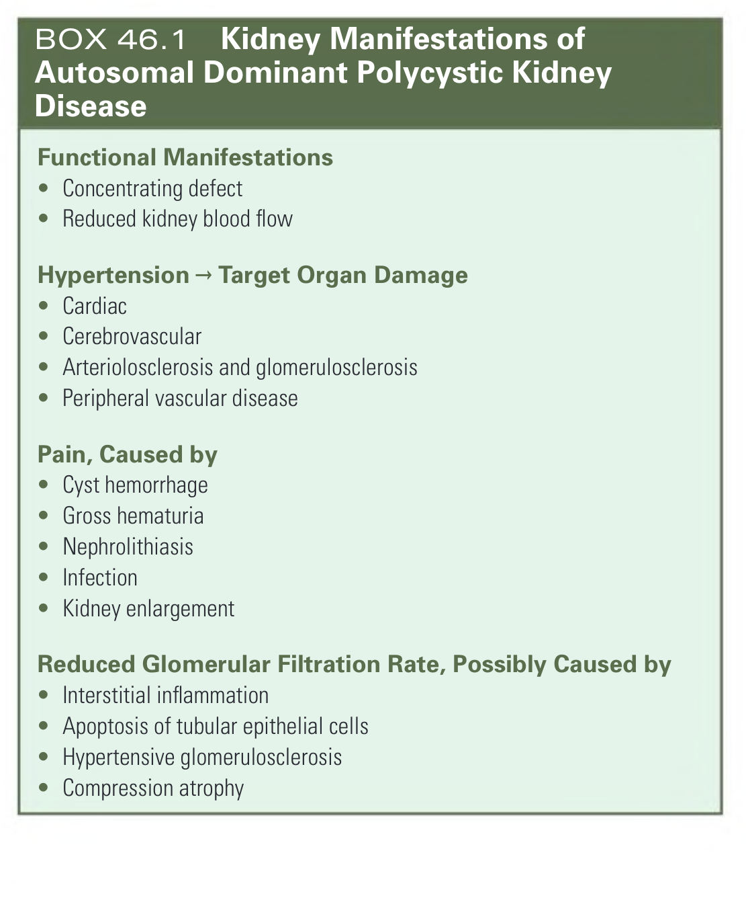

#### Box Text

```markdown
**Functional Manifestations**
* Concentrating defect
* Reduced kidney blood flow

**Hypertension → Target Organ Damage**
* Cardiac
* Cerebrovascular
* Arteriolosclerosis and glomerulosclerosis
* Peripheral vascular disease

**Pain, Caused by**
* Cyst hemorrhage
* Gross hematuria
* Nephrolithiasis
* Infection
* Kidney enlargement

**Reduced Glomerular Filtration Rate, Possibly Caused by**
* Interstitial inflammation
* Apoptosis of tubular epithelial cells
* Hypertensive glomerulosclerosis
* Compression atrophy
```

BOX 46.1 Kidney Manifestations of Autosomal Dominant Polycystic Kidney Disease

---
