# 047. Other Cystic Kidney Diseases - Figures and Tables Index

This document lists all figures, tables and boxes extracted from `047. Other Cystic Kidney Diseases.pdf`.

## Table of Contents
- [Figures](#figures)
- [Tables](#tables)
- [Boxes](#boxes)

---

## Figures

### Fig_47_1

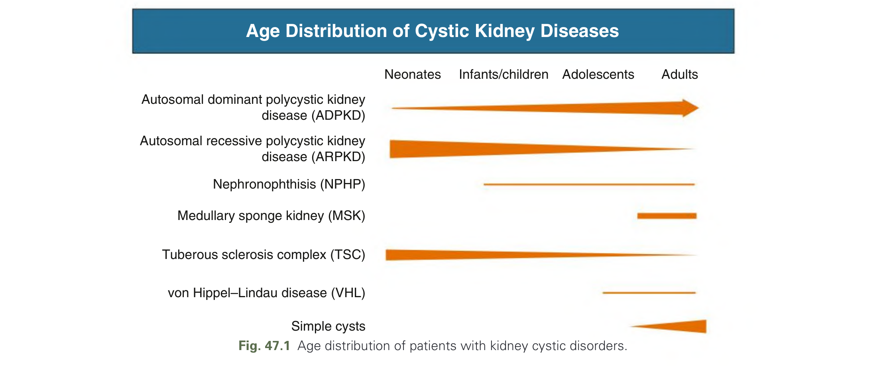

Fig. 47.1 Age distribution of patients with kidney cystic disorders.

---

### Fig_47_2

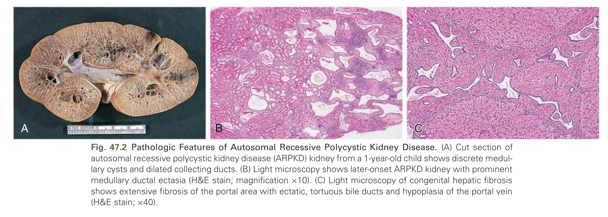

Fig. 47.2 Pathologic Features of Autosomal Recessive Polycystic Kidney Disease. (A) Cut section of autosomal recessive polycystic kidney disease (ARPKD) kidney shows marked enlargement, preserved kidney configuration, and diffuse, radially arranged fusiform cysts extending from the medulla to the cortex. (B) High-power view shows the fusiform, radially oriented cysts in the cortex (hematoxylin and eosin [H&E] stain; ×10). (C) In liver with ARPKD (congenital hepatic fibrosis), the portal tracts are enlarged and uncharacteristically bridged by bands of fibrous tissue. The intrahepatic bile ducts are increased in number and ectatic, containing bile plugs (H&E stain; ×20).

---

### Fig_47_3

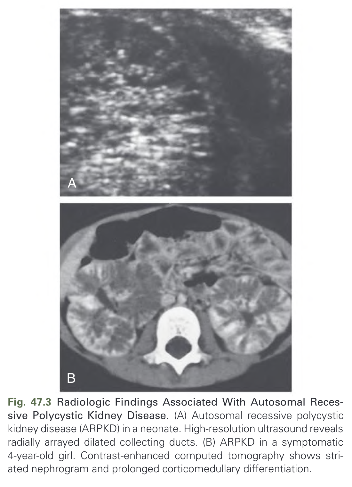

Fig. 47.3 Radiologic Findings Associated With Autosomal Recessive Polycystic Kidney Disease. (A) Autosomal recessive polycystic kidney disease (ARPKD) kidneys are enlarged and echogenic, with poor corticomedullary differentiation on ultrasound. (B) Delayed computed tomography image of kidneys in a patient with ARPKD shows persistent nephrogram with radiodense striations (arrowheads) and nonopaque, radially oriented cylindrical collections (arrows).

---

### Fig_47_4

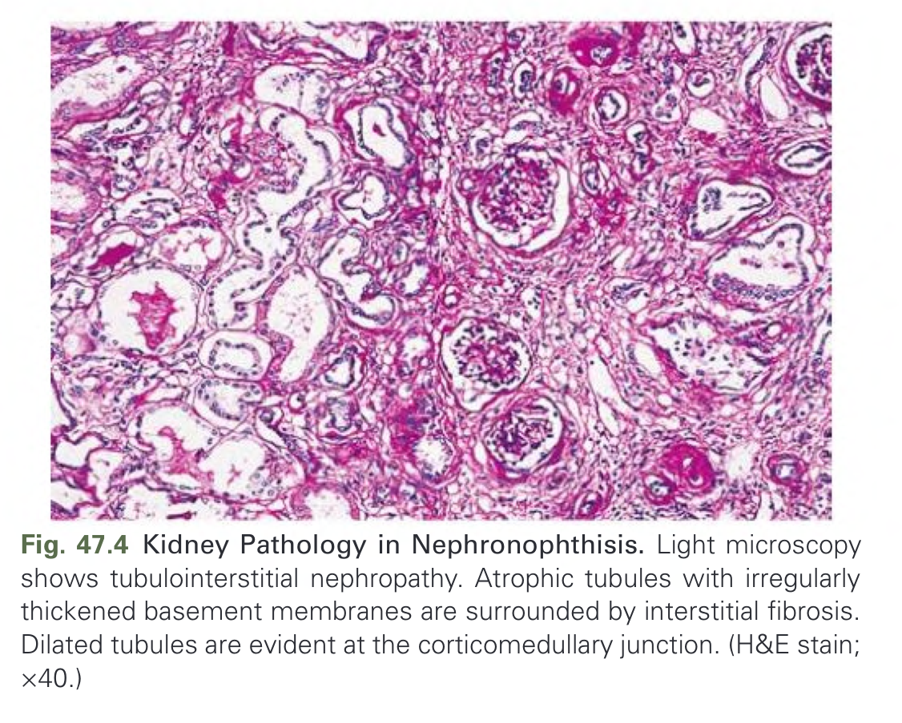

Fig. 47.4 Kidney Pathology in Nephronophthisis. Light microscopy shows tubulointerstitial nephropathy. Atrophic tubules with thickened basement membranes and interstitial fibrosis are seen (H&E stain; ×200).

---

### Fig_47_5

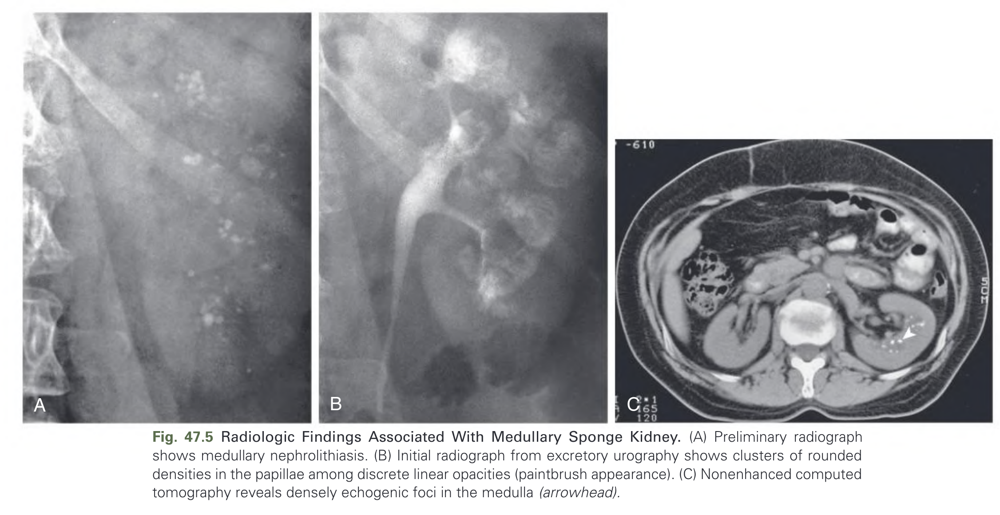

Fig. 47.5 Radiologic Findings Associated With Medullary Sponge Kidney. (A) Preliminary radiograph shows medullary nephrocalcinosis (arrows). (B) Excretory urogram demonstrates ectatic collecting ducts filled with contrast medium (“paint brush” appearance, arrows). (C) Computed tomography (maximum intensity projection reconstruction) shows bilateral medullary calcifications (arrows).

---

### Fig_47_6

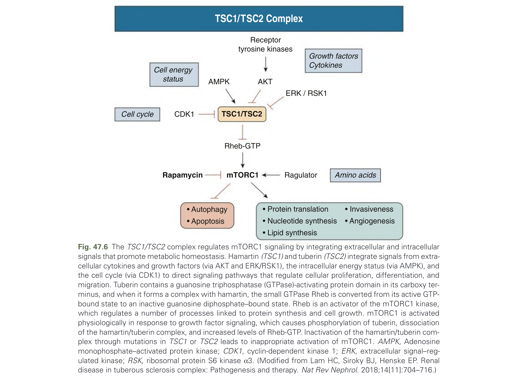

Fig. 47.6 The TSC1/TSC2 complex regulates mTORC1 signaling by integrating extracellular and intracellular signals that promote metabolic homeostasis. Under conditions that promote cell growth, the hamartin-tuberin complex is inactivated by Akt, leading to Rheb activation and the phosphorylation of S6 kinase (S6K) and 4E-BP1 by mTORC1. Conversely, energy deprivation activates AMPK, which phosphorylates tuberin, activating the hamartin-tuberin complex to inactivate Rheb and mTORC1, thereby inhibiting cell growth. mTORC1 inhibitors act by binding to FKBP12, which interacts with mTORC1 to inhibit downstream signaling. (Modified from Inoki K, Corradetti MN, Guan KL. Dysregulation of the TSC-mTOR pathway in human disease. Nat Genet. 2005;37(1):19–24.)

---

### Fig_47_7

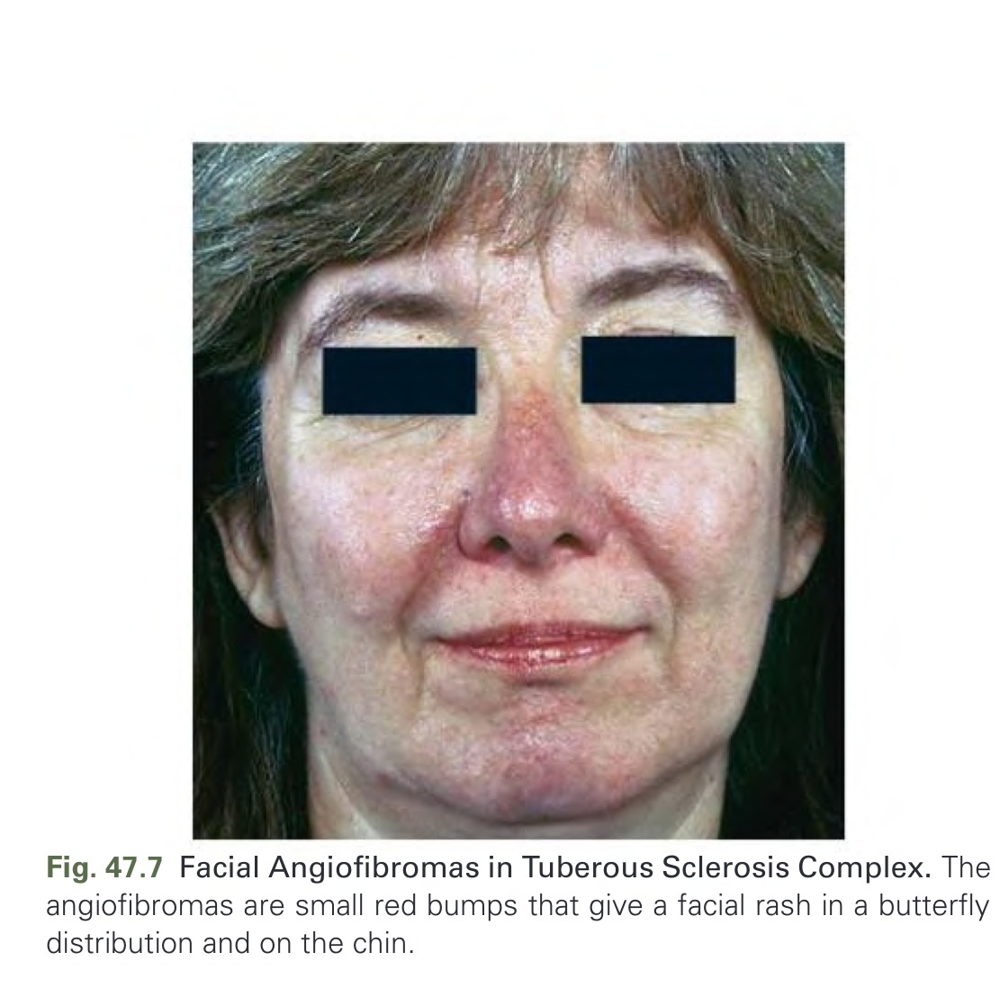

Fig. 47.7 Facial Angiofibromas in Tuberous Sclerosis Complex. The angiofibromas are small red bumps that give a facial rash in a butterfly distribution and on the chin.

---

### Fig_47_8

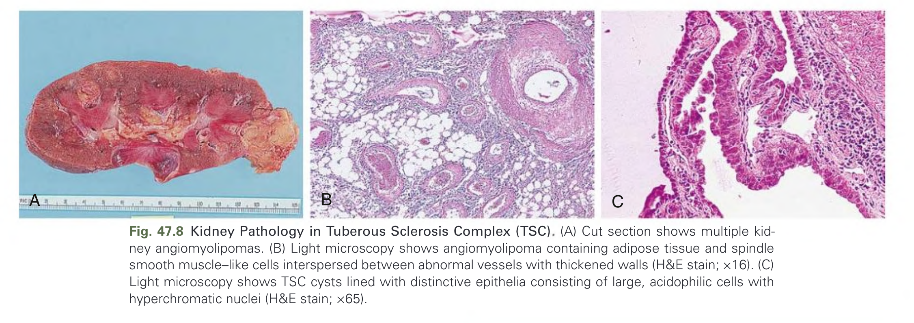

Fig. 47.8 Kidney Pathology in Tuberous Sclerosis Complex (TSC) (A) Cut section shows multiple kidney angiomyolipomas. (B) Light microscopy shows angiomyolipoma containing adipose tissue and spindle smooth muscle–like cells interspersed between abnormal vessels with thickened walls (H&E stain; ×16). (C) Light microscopy shows TSC cysts lined with distinctive epithelia consisting of large, acidophilic cells with hyperchromatic nuclei (H&E stain; ×65).

---

### Fig_47_9

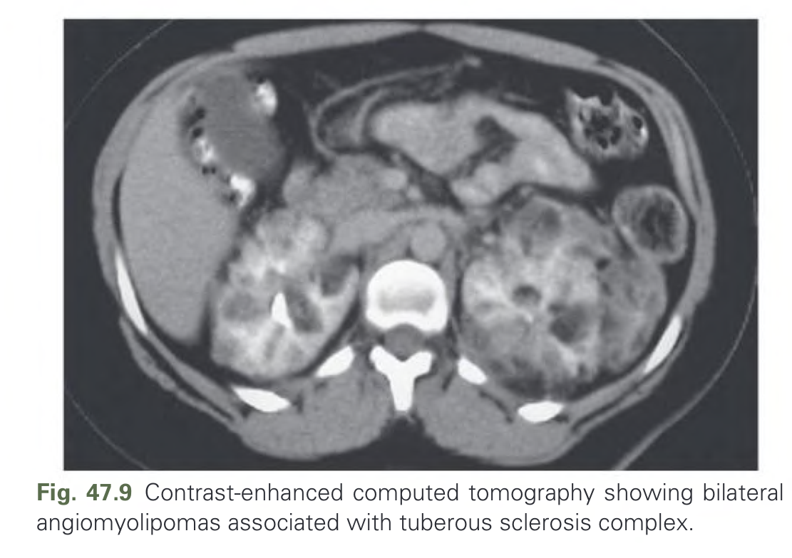

Fig. 47.9 Contrast-enhanced computed tomography showing bilateral angiomyolipomas associated with tuberous sclerosis complex.

---

### Fig_47_10

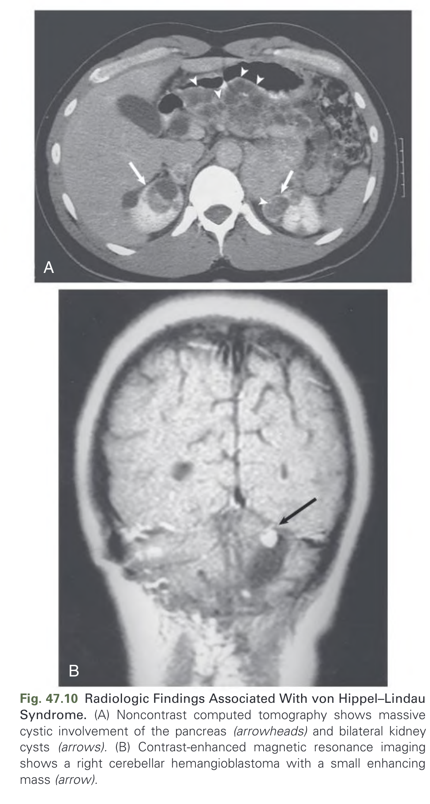

Fig. 47.10 Radiologic Findings Associated With von Hippel–Lindau Syndrome. (A) Noncontrast computed tomography shows massive cystic involvement of the pancreas (arrowheads) and bilateral kidney cysts (arrows). (B) Contrast-enhanced magnetic resonance imaging shows a right cerebellar hemangioblastoma with a small enhancing mass (arrow).

---

### Fig_47_11

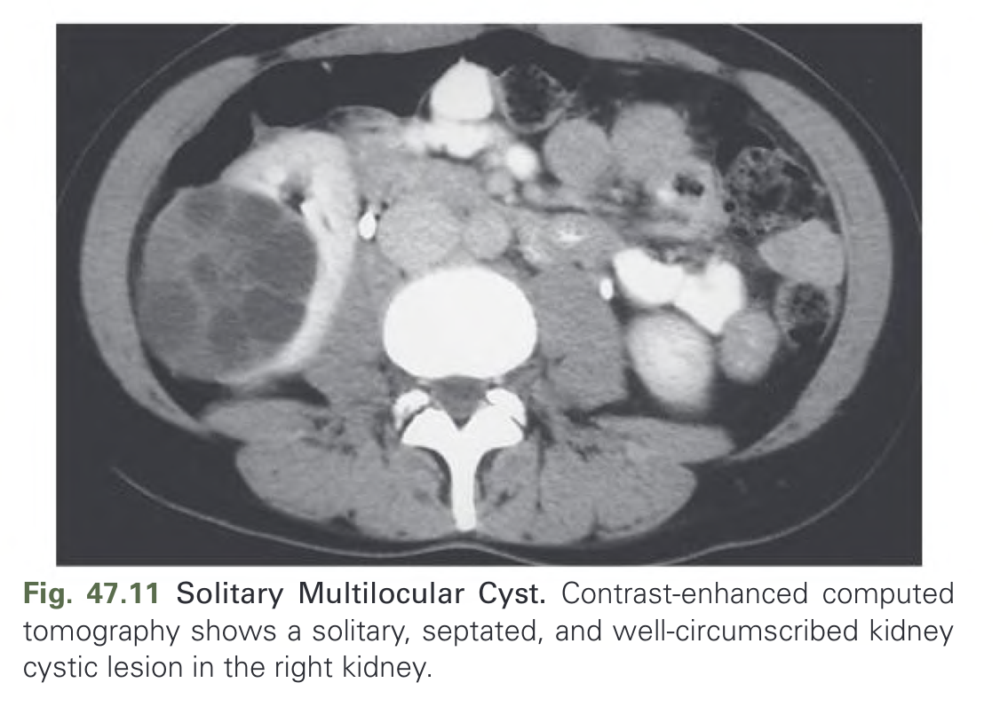

Fig. 47.11 Solitary Multilocular Cyst. Contrast-enhanced computed tomography shows a solitary, septated, and well-circumscribed kidney cystic lesion in the right kidney.

---

## Tables

### Table_47_1

#### Table Image

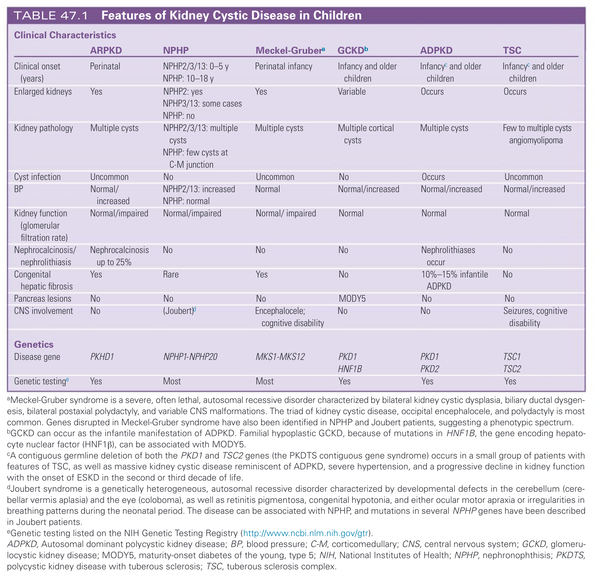

#### Table Data (CSV: [Table_47_1.csv](Table_47_1.csv))

```markdown
| Clinical Characteristics | ARPKD | NPHP | Meckel-Grubera | GCKDb | ADPKD | TSC |
| :--- | :--- | :--- | :--- | :--- | :--- | :--- |
| **Clinical onset (years)** | Perinatal | NPHP2/3/13: 0-5 y, NPHP: 10-18 y | Perinatal infancy | Infancy and older children | Infancyc and older children | Infancyc and older children |
| **Enlarged kidneys** | Yes | NPHP2: yes, NPHP3/13: some cases, NPHP: no | Yes | Variable | Occurs | Occurs |
| **Kidney pathology** | Multiple cysts | NPHP2/3/13: multiple cysts, NPHP: few cysts at C-M junction | Multiple cysts | Multiple cortical cysts | Multiple cysts | Few to multiple cysts angiomyolipoma |
| **Cyst infection** | Uncommon | No | Uncommon | No | Occurs | Uncommon |
| **BP** | Normal/ increased | NPHP2/13: increased, NPHP: normal | Normal | Normal/increased | Normal/increased | Normal/increased |
| **Kidney function (glomerular filtration rate)** | Normal/impaired | Normal/impaired | Normal/impaired | Normal | Normal | Normal |
| **Nephrocalcinosis/ nephrolithiasis** | Nephrocalcinosis up to 25% | No | No | No | Nephrolithiases occur | No |
| **Congenital hepatic fibrosis** | Yes | Rare | Yes | No | 10%-15% infantile ADPKD | No |
| **Pancreas lesions** | No | No | No | MODY5 | No | No |
| **CNS involvement** | No | (Joubert)d | Encephalocele; cognitive disability | No | No | Seizures, cognitive disability |
| **Genetics** | | | | | | |
| **Disease gene** | PKHD1 | NPHP1-NPHP20 | MKS1-MKS12 | PKD1 HNF1B | PKD1 PKD2 | TSC1 TSC2 |
| **Genetic testinge** | Yes | Most | Most | Yes | Yes | Yes |

aMeckel-Gruber syndrome is a severe, often lethal, autosomal recessive disorder characterized by bilateral kidney cystic dysplasia, biliary ductal dysgenesis, bilateral postaxial polydactyly, and variable CNS malformations. The triad of kidney cystic disease, occipital encephalocele, and polydactyly is most common. Genes disrupted in Meckel-Gruber syndrome have also been identified in NPHP and Joubert patients, suggesting a phenotypic spectrum.
bGCKD can occur as the infantile manifestation of ADPKD. Familial hypoplastic GCKD, because of mutations in HNF1B, the gene encoding hepatocyte nuclear factor (HNF1β), can be associated with MODY5.
cA contiguous germline deletion of both the PKD1 and TSC2 genes (the PKDTS contiguous gene syndrome) occurs in a small group of patients with features of TSC, as well as massive kidney cystic disease reminiscent of ADPKD, severe hypertension, and a progressive decline in kidney function with the onset of ESKD in the second or third decade of life.
dJoubert syndrome is a genetically heterogeneous, autosomal recessive disorder characterized by developmental defects in the cerebellum (cerebellar vermis aplasia) and the eye (coloboma), as well as retinitis pigmentosa, congenital hypotonia, and either ocular motor apraxia or irregularities in breathing patterns during the neonatal period. The disease can be associated with NPHP, and mutations in several NPHP genes have been described in Joubert patients.
eGenetic testing listed on the NIH Genetic Testing Registry (http://www.ncbi.nlm.nih.gov/gtr).
ADPKD, Autosomal dominant polycystic kidney disease; BP, blood pressure; C-M, corticomedullary; CNS, central nervous system; GCKD, glomerulocystic kidney disease; MODY5, maturity-onset diabetes of the young, type 5; NIH, National Institutes of Health; NPHP, nephronophthisis; PKDTS, polycystic kidney disease with tuberous sclerosis; TSC, tuberous sclerosis complex.
```

TABLE 47.1 Features of Kidney Cystic Disease in Children

---

### Table_47_2

#### Table Image

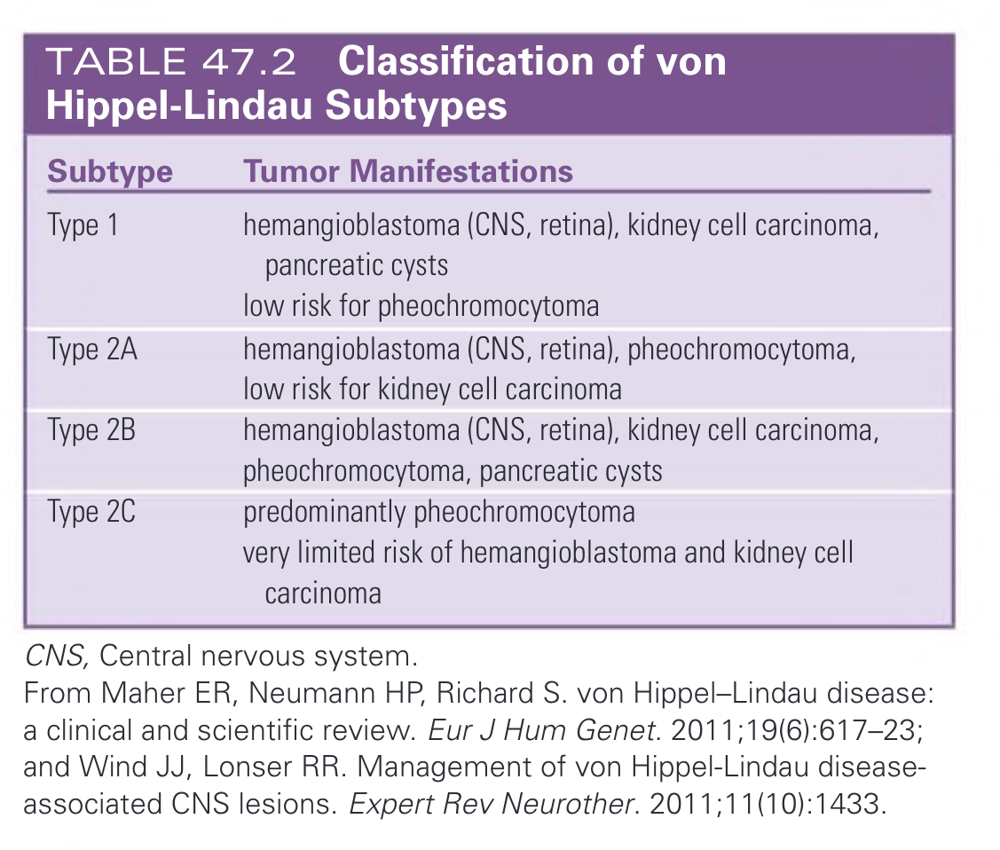

#### Table Data (CSV: [Table_47_2.csv](Table_47_2.csv))

```markdown
| Subtype | Tumor Manifestations |
| :--- | :--- |
| **Type 1** | hemangioblastoma (CNS, retina), kidney cell carcinoma, pancreatic cysts<br>low risk for pheochromocytoma |
| **Type 2A** | hemangioblastoma (CNS, retina), pheochromocytoma, low risk for kidney cell carcinoma |
| **Type 2B** | hemangioblastoma (CNS, retina), kidney cell carcinoma, pheochromocytoma, pancreatic cysts |
| **Type 2C** | predominantly pheochromocytoma<br>very limited risk of hemangioblastoma and kidney cell carcinoma |
CNS, Central nervous system.
From Maher ER, Neumann HP, Richard S. von Hippel-Lindau disease: a clinical and scientific review. Eur J Hum Genet. 2011;19(6):617-23; and Wind JJ, Lonser RR. Management of von Hippel-Lindau disease-associated CNS lesions. Expert Rev Neurother. 2011;11(10):1433.
```

TABLE 47.2 Classification of von Hippel-Lindau Subtypes

---

### Table_47_3

#### Table Image

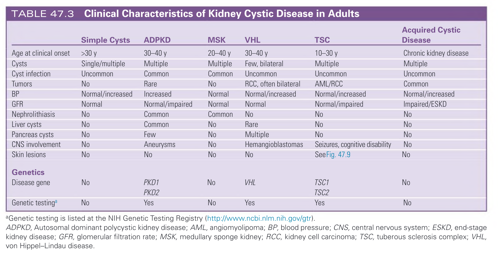

#### Table Data (CSV: [Table_47_3.csv](Table_47_3.csv))

```markdown
| | Simple Cysts | ADPKD | MSK | VHL | TSC | Acquired Cystic Disease |
| :--- | :--- | :--- | :--- | :--- | :--- | :--- |
| **Age at clinical onset** | >30 y | 30-40 y | 20-40 y | 30-40 y | 10-30 y | Chronic kidney disease |
| **Cysts** | Single/multiple | Multiple | Multiple | Few, bilateral | Multiple | Multiple |
| **Cyst infection** | Uncommon | Common | Common | Uncommon | Uncommon | Uncommon |
| **Tumors** | No | Rare | No | RCC, often bilateral | AML/RCC | Common |
| **BP** | Normal/increased | Increased | Normal | Normal/increased | Normal/increased | Normal/increased |
| **GFR** | Normal | Normal/impaired | Normal | Normal | Normal/impaired | Impaired/ESKD |
| **Nephrolithiasis** | No | Common | Common | No | No | No |
| **Liver cysts** | No | Common | No | Rare | No | No |
| **Pancreas cysts** | No | Few | No | Multiple | No | No |
| **CNS involvement** | No | Aneurysms | No | Hemangioblastomas | Seizures, cognitive disability | No |
| **Skin lesions** | No | No | No | No | SeeFig. 47.9 | No |
| **Genetics** | | | | | | |
| **Disease gene** | No | PKD1 PKD2 | No | VHL | TSC1 TSC2 | No |
| **Genetic testinga** | No | Yes | No | Yes | Yes | No |

aGenetic testing is listed at the NIH Genetic Testing Registry (http://www.ncbi.nlm.nih.gov/gtr).
ADPKD, Autosomal dominant polycystic kidney disease; AML, angiomyolipoma; BP, blood pressure; CNS, central nervous system; ESKD, end-stage kidney disease; GFR, glomerular filtration rate; MSK, medullary sponge kidney; RCC, kidney cell carcinoma; TSC, tuberous sclerosis complex; VHL, von Hippel-Lindau disease.
```

TABLE 47.3 Clinical Characteristics of Kidney Cystic Disease in Adults

---

## Boxes

### Box_47_1

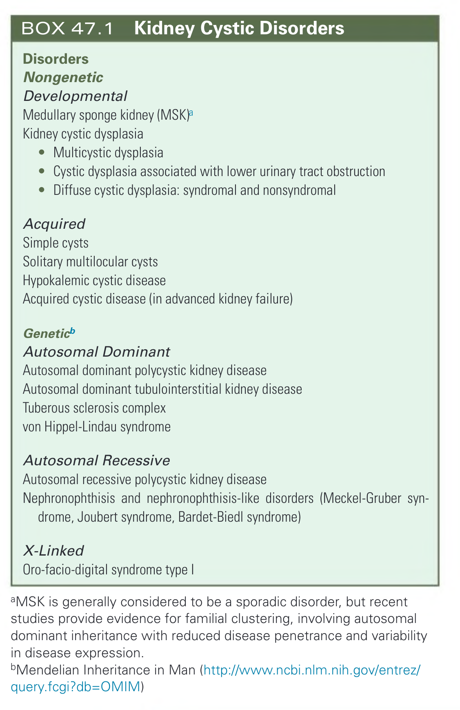

#### Box Text

```markdown
**Disorders**
**Nongenetic**
**Developmental**
Medullary sponge kidney (MSK)a
Kidney cystic dysplasia
* Multicystic dysplasia
* Cystic dysplasia associated with lower urinary tract obstruction
* Diffuse cystic dysplasia: syndromal and nonsyndromal

**Acquired**
Simple cysts
Solitary multilocular cysts
Hypokalemic cystic disease
Acquired cystic disease (in advanced kidney failure)

**Genetich**
**Autosomal Dominant**
Autosomal dominant polycystic kidney disease
Autosomal dominant tubulointerstitial kidney disease
Tuberous sclerosis complex
von Hippel-Lindau syndrome

**Autosomal Recessive**
Autosomal recessive polycystic kidney disease
Nephronophthisis and nephronophthisis-like disorders (Meckel-Gruber syndrome, Joubert syndrome, Bardet-Biedl syndrome)

**X-Linked**
Oro-facio-digital syndrome type I

aMSK is generally considered to be a sporadic disorder, but recent studies provide evidence for familial clustering, involving autosomal dominant inheritance with reduced disease penetrance and variability in disease expression.
bMendelian Inheritance in Man (http://www.ncbi.nlm.nih.gov/entrez/query.fcgi?db=OMIM)
```

BOX 47.1 Kidney Cystic Disorders

---

### Box_47_2

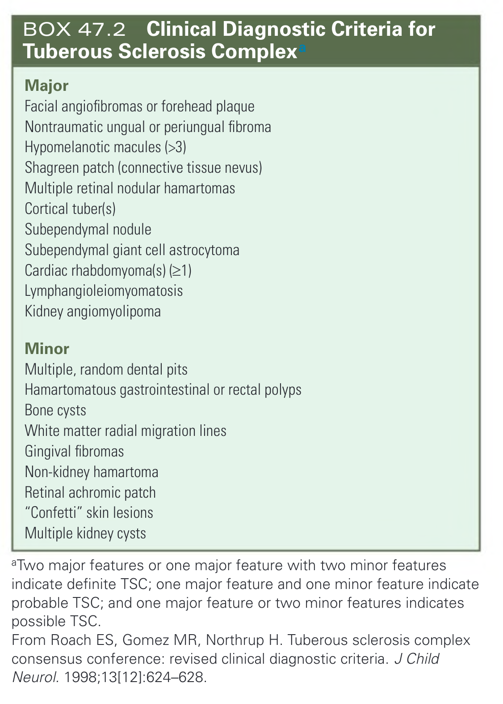

#### Box Text

```markdown
**Major**
Facial angiofibromas or forehead plaque
Nontraumatic ungual or periungual fibroma
Hypomelanotic macules (>3)
Shagreen patch (connective tissue nevus)
Multiple retinal nodular hamartomas
Cortical tuber(s)
Subependymal nodule
Subependymal giant cell astrocytoma
Cardiac rhabdomyoma(s) (≥1)
Lymphangioleiomyomatosis
Kidney angiomyolipoma

**Minor**
Multiple, random dental pits
Hamartomatous gastrointestinal or rectal polyps
Bone cysts
White matter radial migration lines
Gingival fibromas
Non-kidney hamartoma
Retinal achromic patch
"Confetti" skin lesions
Multiple kidney cysts

aTwo major features or one major feature with two minor features indicate definite TSC; one major feature and one minor feature indicate probable TSC; and one major feature or two minor features indicates possible TSC.
From Roach ES, Gomez MR, Northrup H. Tuberous sclerosis complex consensus conference: revised clinical diagnostic criteria. J Child Neurol. 1998;13[12]:624-628.
```

BOX 47.2 Clinical Diagnostic Criteria for Tuberous Sclerosis Complexa

---
