# 048. Alport Syndrome and Other Familial Glomerular Syndromes - Figures and Tables Index

This document lists all figures, tables and boxes extracted from `048. Alport Syndrome and Other Familial Glomerular Syndromes.pdf`.

## Table of Contents
- [Figures](#figures)
- [Tables](#tables)
- [Boxes](#boxes)

---

## Figures

### Fig_48_1

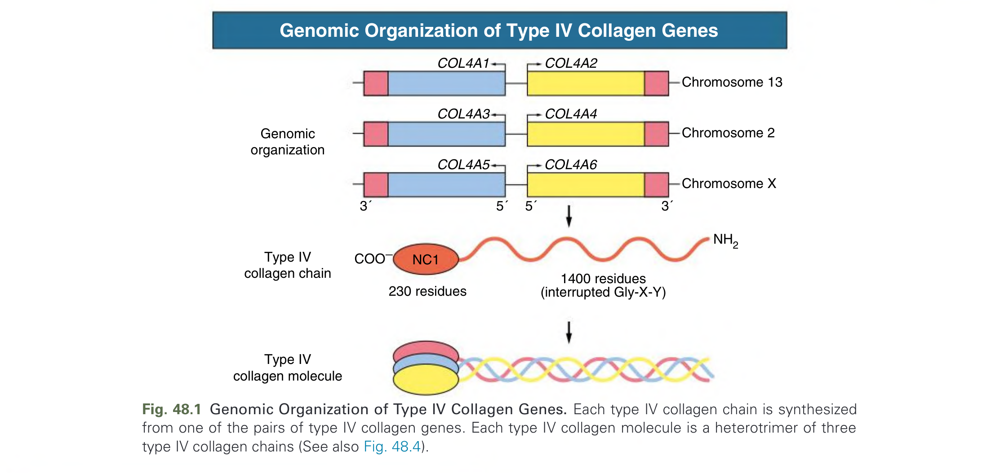

Fig. 48.1 Genomic Organization of Type IV Collagen Genes. Each type IV collagen chain is synthesized from one of six distinct genes, which are arranged in head-to-head pairs on three different chromosomes. The COL4A5 and COL4A6 genes are on the X chromosome, the COL4A3 and COL4A4 genes are on chromosome 2, and the COL4A1 and COL4A2 genes are on chromosome 13.

---

### Fig_48_2

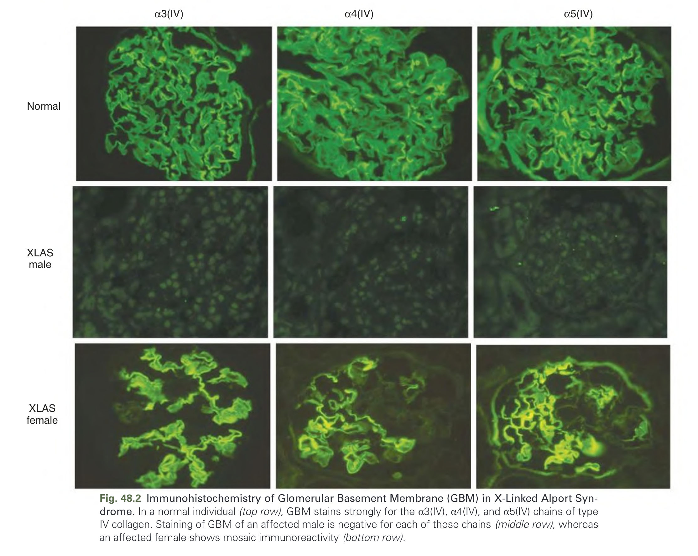

Fig. 48.2 Immunohistochemistry of Glomerular Basement Membrane (GBM) in X-Linked Alport Syndrome. In a normal kidney, both α1/α2(IV) (A) and α5(IV) (B) are present in the GBM. In a male with X-linked Alport syndrome, α1/α2(IV) is present in the GBM (C), but α5(IV) is absent (D). In a female with X-linked Alport syndrome, α1/α2(IV) is present in the GBM (E), but α5(IV) shows a mosaic distribution (F), with alternating segments of α5-positive and α5-negative GBM.

---

### Fig_48_3

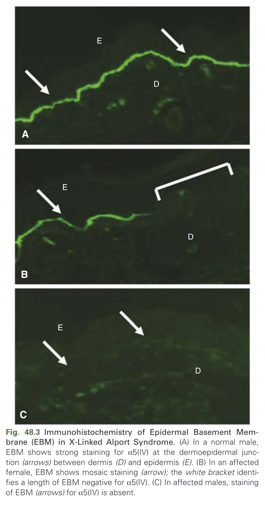

Fig. 48.3 Immunohistochemistry of Epidermal Basement Membrane (EBM) in X-Linked Alport Syndrome. (A) In a normal individual, α1/α2(IV) (left) and α5(IV) (right) are both present in the EBM. (B) In a male with X-linked Alport syndrome (XLAS), α1/α2(IV) is present in the EBM (left), but α5(IV) is absent (right). (C) In a female with XLAS, α1/α2(IV) is present in the EBM (left), and α5(IV) is present in a mosaic distribution (right), with intermittent expression along the EBM.

---

### Fig_48_4

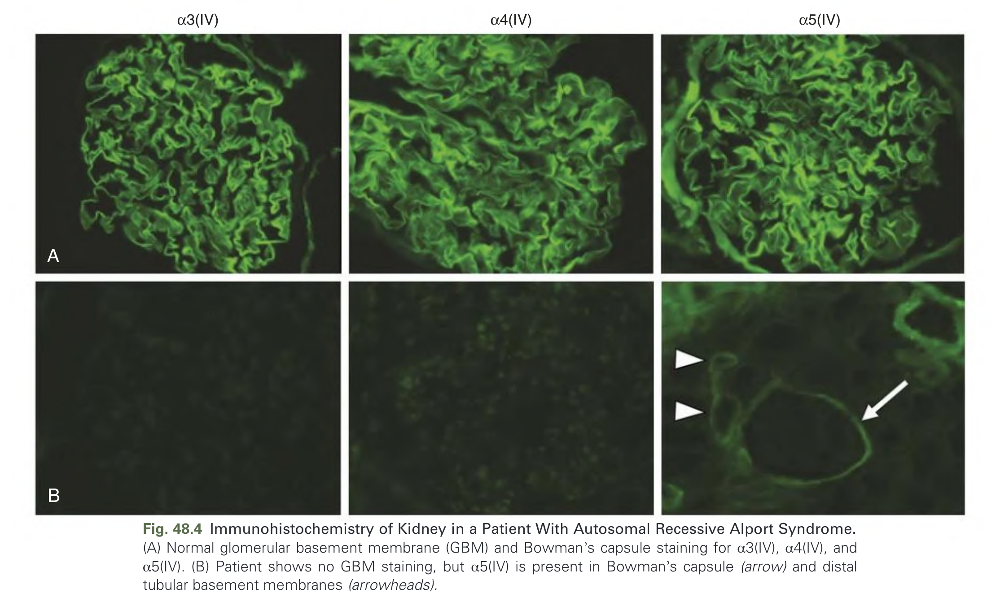

Fig. 48.4 Immunohistochemistry of Kidney in a Patient With Autosomal Recessive Alport Syndrome. (A) Normal glomerulus with expression of α5(IV) in both glomerular basement membrane (GBM) and Bowman capsule. (B) Kidney from a patient with autosomal recessive Alport syndrome (ARAS), with absence of α5(IV) from the GBM, but persistence in the basement membrane of Bowman capsule (arrow) and collecting ducts. (C) Normal skin showing expression of α5(IV) in epidermal basement membrane (EBM). (D) Skin from an ARAS patient showing normal expression of α5(IV) in the EBM.

---

### Fig_48_5

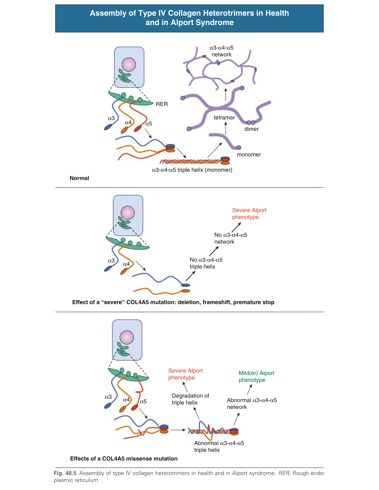

Fig. 48.5 Assembly of type IV collagen heterotrimers in health and in Alport syndrome. RER, Rough endoplasmic reticulum.

---

### Fig_48_6

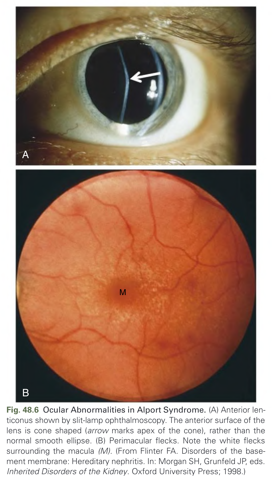

Fig. 48.6 Ocular Abnormalities in Alport Syndrome. (A) Anterior lenticonus shown by slit-lamp ophthalmoscopy (arrow). The clear central lens protrudes anteriorly into the anterior chamber. (B) Severe, widespread dot-and-fleck retinopathy in a 36-year-old man with X-linked Alport syndrome and chronic kidney failure.

---

### Fig_48_7

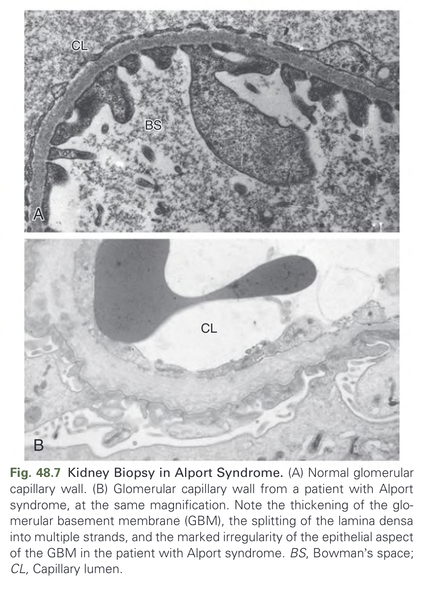

Fig. 48.7 Kidney Biopsy in Alport Syndrome. (A) Normal glomerular capillary wall. (B) Glomerular capillary wall in a patient with Alport syndrome, with thickening, lamellation, and attenuation of the lamina densa (transmission electron microscopy; ×10,000). CL, Capillary lumen; Ep, visceral epithelial cell; US, urinary space.

---

### Fig_48_8

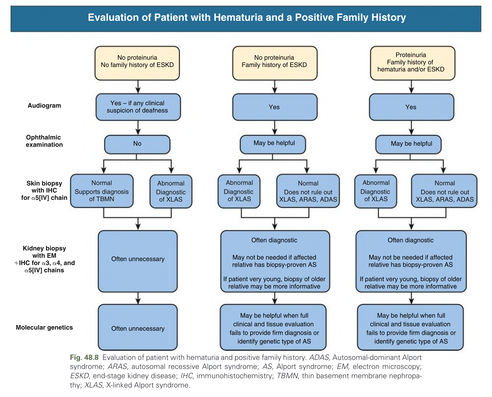

Fig. 48.8 Evaluation of patient with hematuria and positive family history. ADAS, Autosomal-dominant Alport syndrome; ARAS, autosomal-recessive Alport syndrome; EBM, epidermal basement membrane; GBM, glomerular basement membrane; TBMN, thin basement membrane nephropathy; XLAS, X-linked Alport syndrome.

---

### Fig_48_9

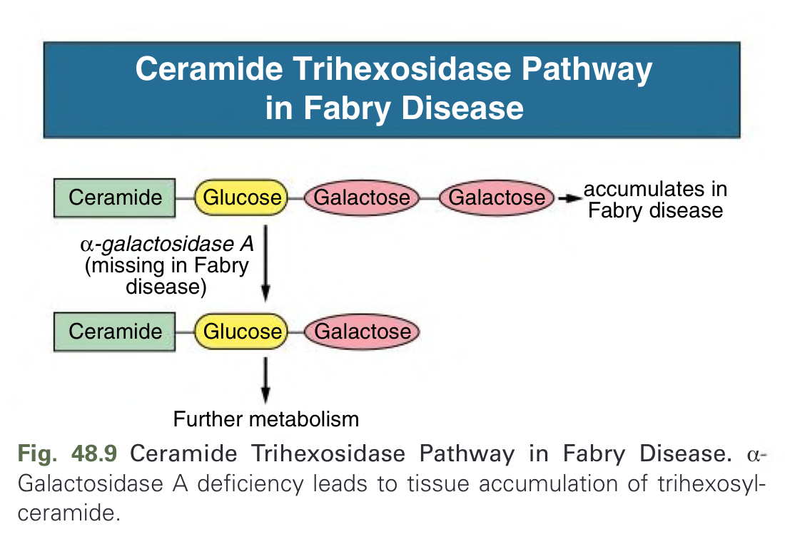

Fig. 48.9 Ceramide Trihexosidase Pathway in Fabry Disease. α Galactosidase A deficiency leads to tissue accumulation of globotriaosylceramide (Gb3).

---

### Fig_48_10

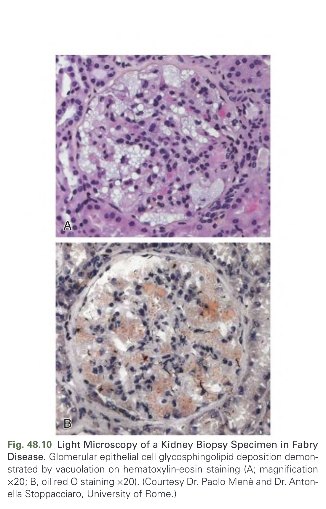

Fig. 48.10 Light Microscopy of a Kidney Biopsy Specimen in Fabry Disease. Glomerular epithelial cells pack with clear vacuoles representing glycosphingolipid extracted during tissue processing (toluidine blue; ×40).

---

### Fig_48_11

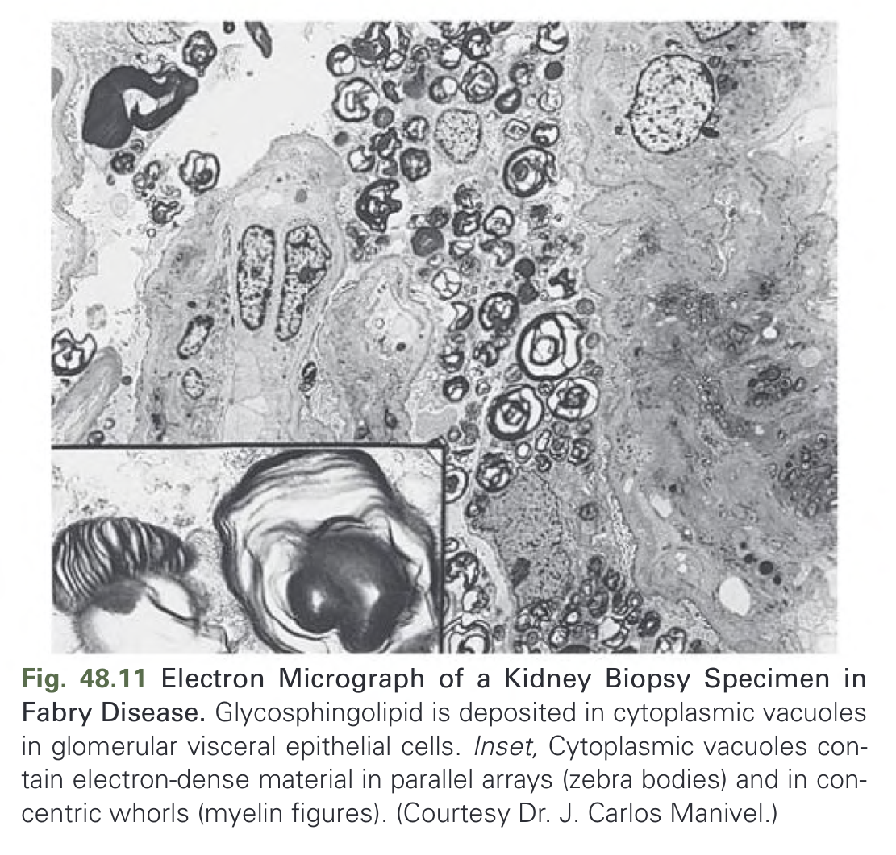

Fig. 48.11 Electron Micrograph of a Kidney Biopsy Specimen in Fabry Disease. Glycosphingolipid is deposited in concentric lamellar arrays in podocyte lysosomes (“myelin figures” or “zebra bodies,” arrows) (transmission electron microscopy; ×10,000).

---

### Fig_48_12

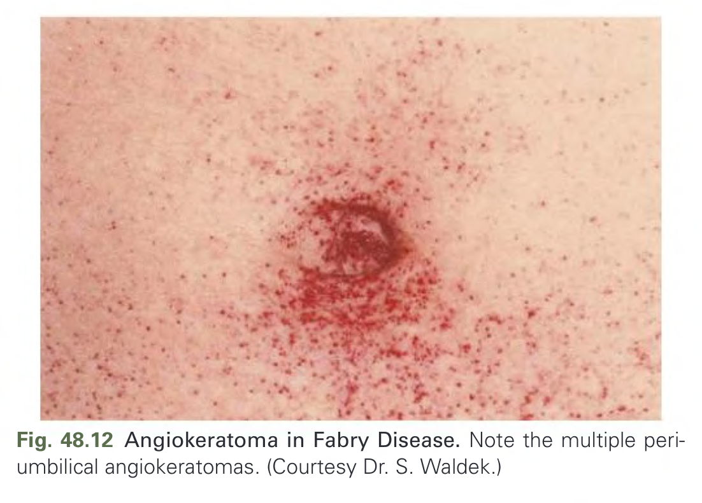

Fig. 48.12 Angiokeratoma in Fabry Disease. Note the multiple periumbilical angiokeratomas. (Courtesy Dr. S. Michael Mauer.)

---

### Fig_48_13

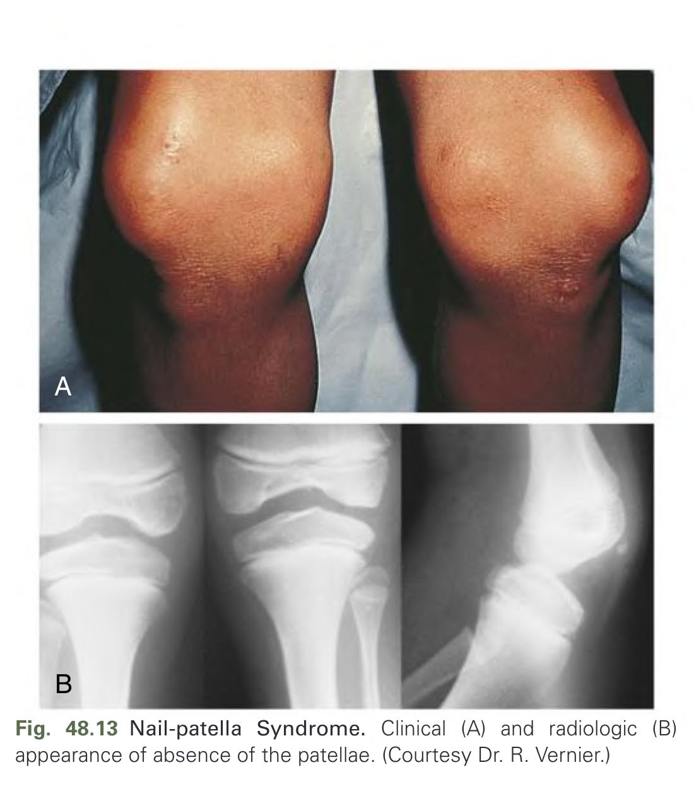

Fig. 48.13 Nail-patella Syndrome. Clinical (A) and radiologic (B) appearance of absence of the patellae. (Courtesy Dr. R. Vernier.)

---

### Fig_48_14

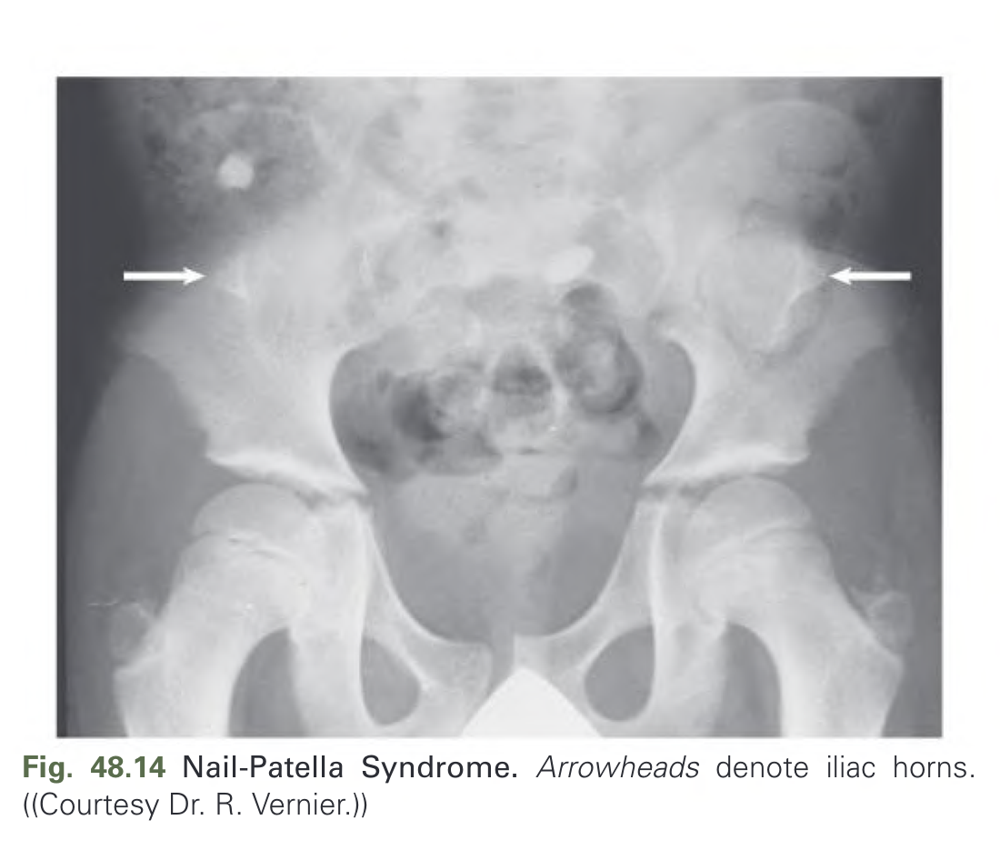

Fig. 48.14 Nail-Patella Syndrome. Arrowheads denote iliac horns. ((Courtesy Dr. R. Vernier.))

---

### Fig_48_15

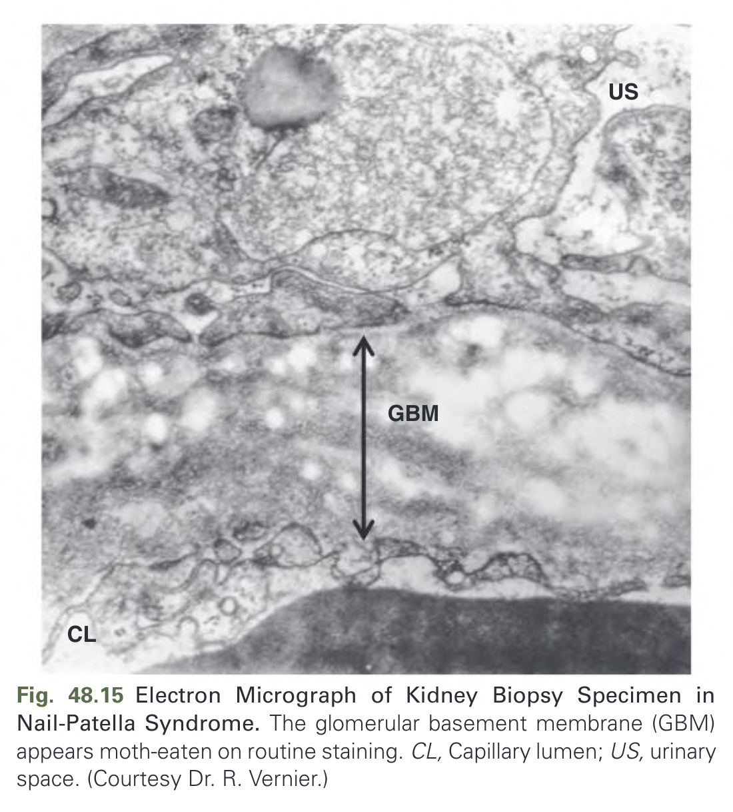

Fig. 48.15 Electron Micrograph of Kidney Biopsy Specimen in Nail-Patella Syndrome. The glomerular basement membrane is thickened and contains lucent areas (arrows), which in some regions contain fibrillar collagen-like material (transmission electron microscopy; ×13,500). (Courtesy Dr. R. Vernier.)

---

### Fig_48_16

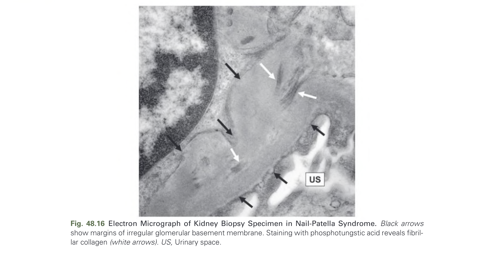

Fig. 48.16 Electron Micrograph of Kidney Biopsy Specimen in Nail-Patella Syndrome. Black arrows show margins of lucent areas in the glomerular basement membrane that contain banded collagen fibrils (white arrows) (phosphotungstic acid stain; ×40,000). (Courtesy Dr. R. Vernier.)

---

## Tables

### Table_48_1

#### Table Image

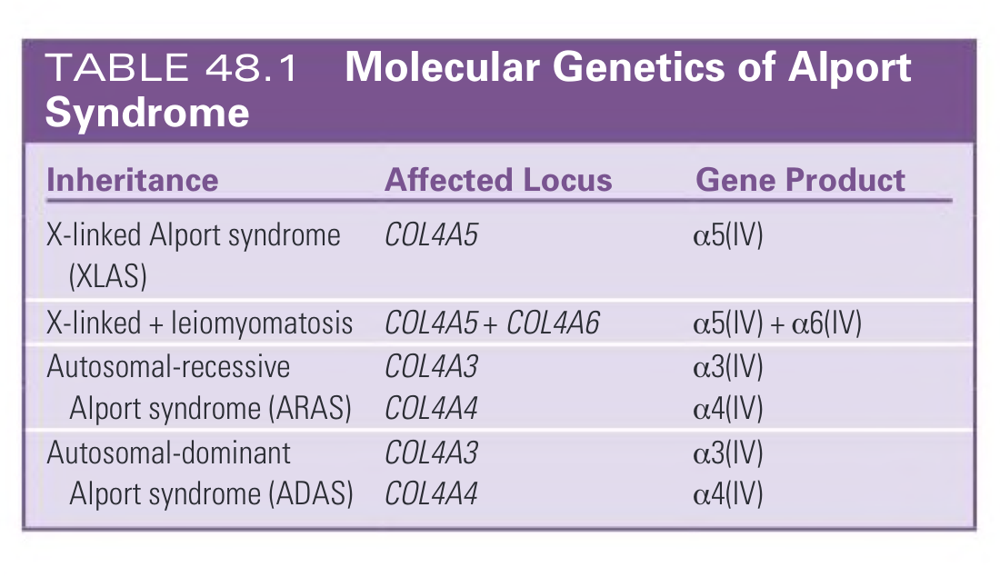

#### Table Data (CSV: [Table_48_1.csv](Table_48_1.csv))

```markdown
| Inheritance | Affected Locus | Gene Product |
| :--- | :--- | :--- |
| X-linked Alport syndrome (XLAS) | COL4A5 | α5(IV) |
| X-linked + leiomyomatosis | COL4A5+ COL4A6 | α5(IV) + α6(IV) |
| Autosomal-recessive Alport syndrome (ARAS) | COL4A3 | α3(IV) |
| | COL4A4 | α4(IV) |
| Autosomal-dominant Alport syndrome (ADAS) | COL4A3 | α3(IV) |
| | COL4A4 | α4(IV) |
```

TABLE 48.1 Molecular Genetics of Alport Syndrome

---

### Table_48_2

#### Table Image

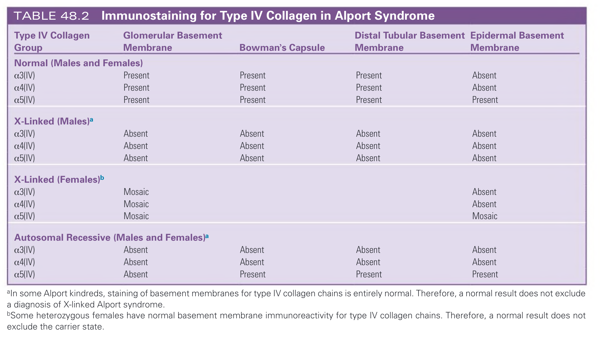

#### Table Data (CSV: [Table_48_2.csv](Table_48_2.csv))

```markdown
| Type IV Collagen Group | Glomerular Basement Membrane | Bowman's Capsule | Distal Tubular Basement Membrane | Epidermal Basement Membrane |
| :--- | :--- | :--- | :--- | :--- |
| **Normal (Males and Females)** | | | | |
| α3(IV) | Present | Present | Present | Absent |
| α4(IV) | Present | Present | Present | Absent |
| α5(IV) | Present | Present | Present | Present |
| **X-Linked (Males)a** | | | | |
| α3(IV) | Absent | Absent | Absent | Absent |
| α4(IV) | Absent | Absent | Absent | Absent |
| α5(IV) | Absent | Absent | Absent | Absent |
| **X-Linked (Females)b** | | | | |
| α3(IV) | Mosaic | | | Absent |
| α4(IV) | Mosaic | | | Absent |
| α5(IV) | Mosaic | | | Mosaic |
| **Autosomal Recessive (Males and Females)a** | | | | |
| α3(IV) | Absent | Absent | Absent | Absent |
| α4(IV) | Absent | Absent | Absent | Absent |
| α5(IV) | Absent | Present | Present | Present |

aIn some Alport kindreds, staining of basement membranes for type IV collagen chains is entirely normal. Therefore, a normal result does not exclude a diagnosis of X-linked Alport syndrome.
bSome heterozygous females have normal basement membrane immunoreactivity for type IV collagen chains. Therefore, a normal result does not exclude the carrier state.
```

TABLE 48.2 Immunostaining for Type IV Collagen in Alport Syndrome

---

## Boxes

*No boxes resolved for this chapter.*
