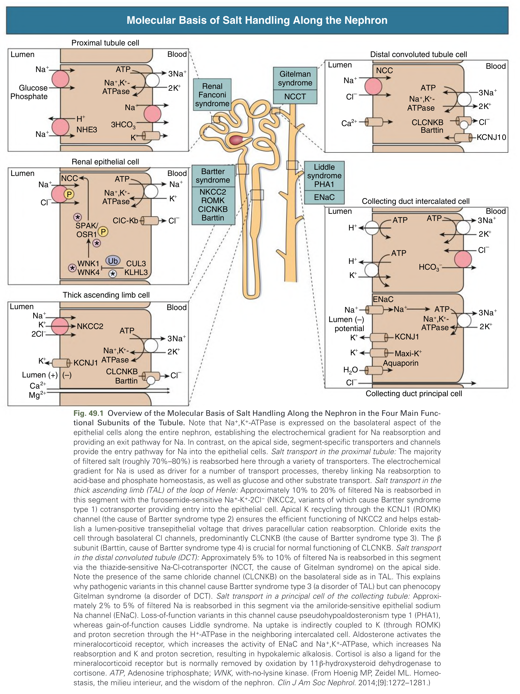
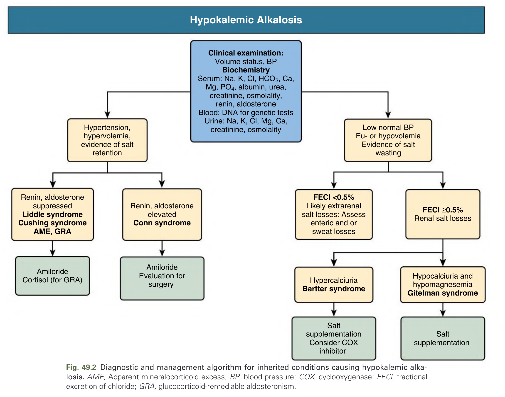
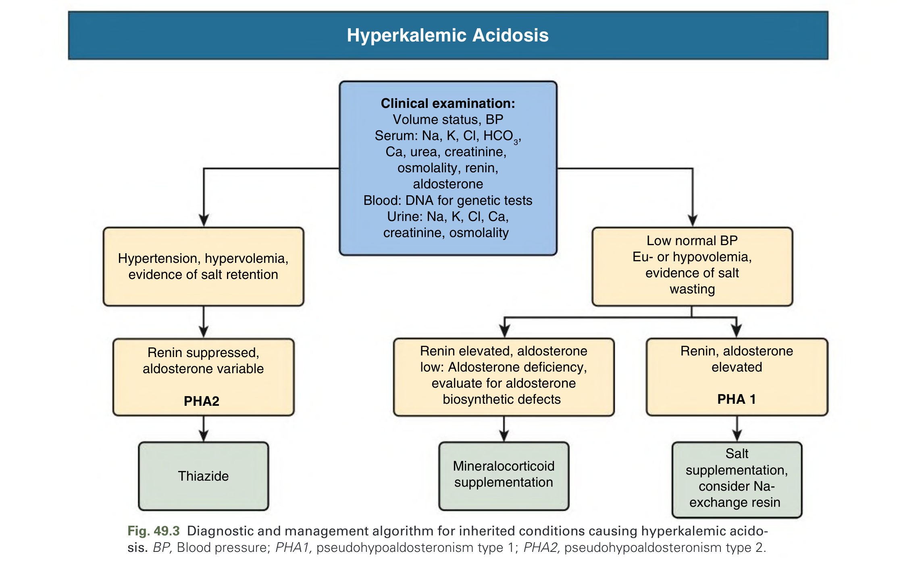
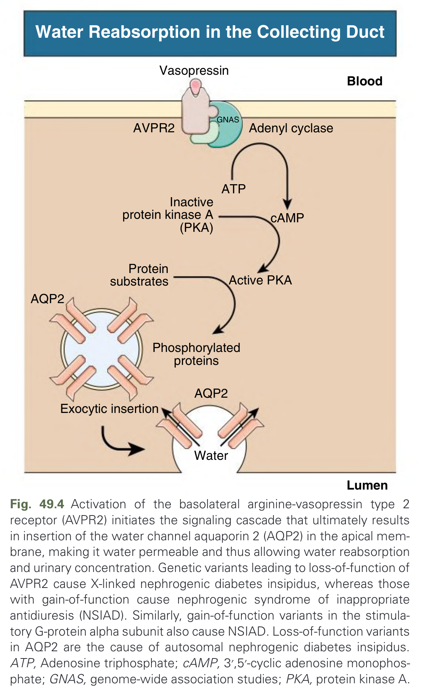
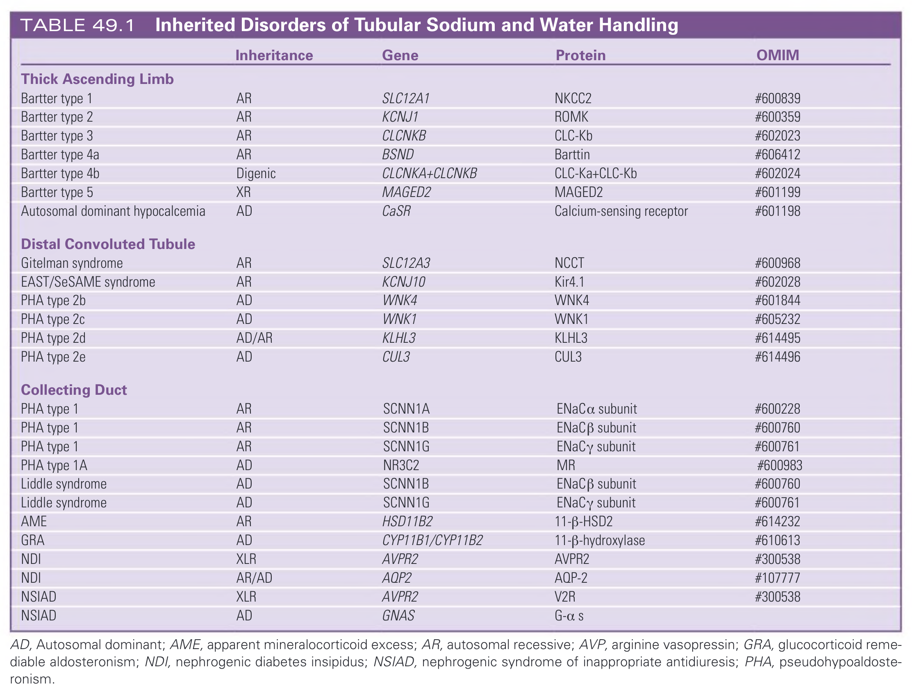
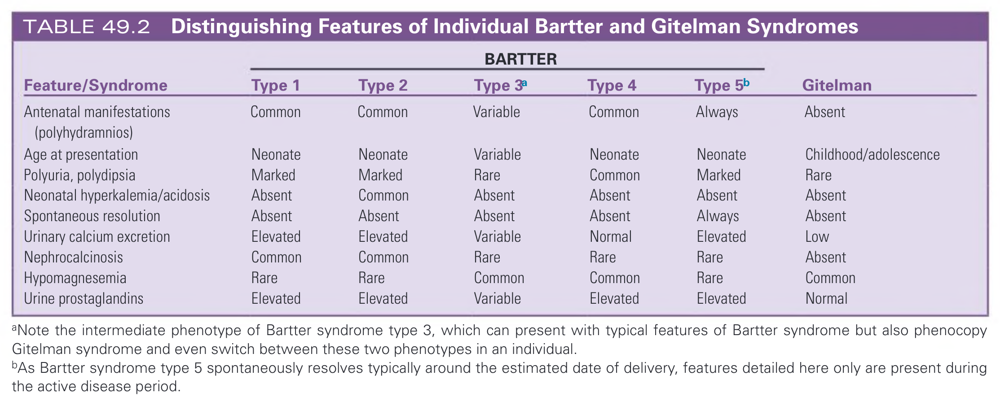
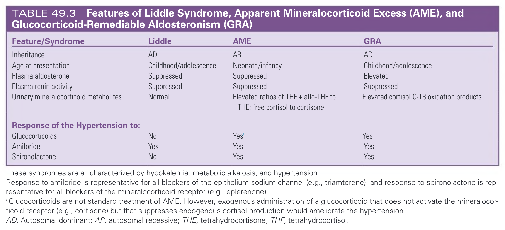

# 049. Inherited Disorders of Sodium and Water Handling - Figures and Tables Index

This document lists all figures, tables and boxes extracted from `049. Inherited Disorders of Sodium and Water Handling.pdf`.

## Table of Contents
- [Figures](#figures)
- [Tables](#tables)
- [Boxes](#boxes)

---

## Figures

### Fig_49_1



Fig. 49.1 Overview of the Molecular Basis of Salt Handling Along the Nephron in the Four Main Functional Subunits of the Tubule. Note that Na+,K+-ATPase is expressed on the basolateral aspect of the epithelial cells along the entire nephron, establishing the electrochemical gradient for Na reabsorption and providing an exit pathway for Na. In contrast, on the apical side, segment-specific transporters and channels provide the entry pathway for Na into the epithelial cells. Salt transport in the proximal tubule: The majority of filtered salt (roughly 70%–80%) is reabsorbed here through a variety of transporters. The electrochemical gradient for Na is used as driver for a number of transport processes, thereby linking Na reabsorption to acid-base and phosphate homeostasis, as well as glucose and other substrate transport. Salt transport in the thick ascending limb (TAL) of the loop of Henle: Approximately 10% to 20% of filtered Na is reabsorbed in this segment with the furosemide-sensitive Na+-K+-2Cl− (NKCC2, variants of which cause Bartter syndrome type 1) cotransporter providing entry into the epithelial cell. Apical K recycling through the KCNJ1 (ROMK) channel (the cause of Bartter syndrome type 2) ensures the efficient functioning of NKCC2 and helps establish a lumen-positive transepithelial voltage that drives paracellular cation reabsorption. Chloride exits the cell through basolateral Cl channels, predominantly CLCNKB (the cause of Bartter syndrome type 3). The β subunit (Barttin, cause of Bartter syndrome type 4) is crucial for normal functioning of CLCNKB. Salt transport in the distal convoluted tubule (DCT): Approximately 5% to 10% of filtered Na is reabsorbed in this segment via the thiazide-sensitive Na-Cl-cotransporter (NCCT, the cause of Gitelman syndrome) on the apical side. Note the presence of the same chloride channel (CLCNKB) on the basolateral side as in TAL. This explains why pathogenic variants in this channel cause Bartter syndrome type 3 (a disorder of TAL) but can phenocopy Gitelman syndrome (a disorder of DCT). Salt transport in a principal cell of the collecting tubule: Approximately 2% to 5% of filtered Na is reabsorbed in this segment via the amiloride-sensitive epithelial sodium Na channel (ENaC). Loss-of-function variants in this channel cause pseudohypoaldosteronism type 1 (PHA1), whereas gain-of-function causes Liddle syndrome. Na uptake is indirectly coupled to K (through ROMK) and proton secretion through the H+-ATPase in the neighboring intercalated cell. Aldosterone activates the mineralocorticoid receptor, which increases the activity of ENaC and Na+,K+-ATPase, which increases Na reabsorption and K and proton secretion, resulting in hypokalemic alkalosis. Cortisol is also a ligand for the mineralocorticoid receptor but is normally removed by oxidation by 11β-hydroxysteroid dehydrogenase to cortisone. ATP, Adenosine triphosphate; WNK, with-no-lysine kinase. (From Hoenig MP, Zeidel ML. Homeostasis, the milieu interieur, and the wisdom of the nephron. Clin J Am Soc Nephrol. 2014;[9]:1272–1281.)

---

### Fig_49_2



Fig. 49.2 Diagnostic and management algorithm for inherited conditions causing hypokalemic alkalosis. AME, Apparent mineralocorticoid excess; BP, blood pressure; COX, cyclooxygenase; FECl, fractional excretion of chloride; GRA, glucocorticoid-remediable aldosteronism.

---

### Fig_49_3



Fig. 49.3 Diagnostic and management algorithm for inherited conditions causing hyperkalemic acidosis. BP, Blood pressure; PHA1, pseudohypoaldosteronism type 1; PHA2, pseudohypoaldosteronism type 2.

---

### Fig_49_4



Fig. 49.4 Activation of the basolateral arginine-vasopressin type 2 receptor (AVPR2) initiates the signaling cascade that ultimately results in insertion of the water channel aquaporin 2 (AQP2) in the apical membrane, making it water permeable and thus allowing water reabsorption and urinary concentration. Genetic variants leading to loss-of-function of AVPR2 cause X-linked nephrogenic diabetes insipidus, whereas those with gain-of-function cause nephrogenic syndrome of inappropriate antidiuresis (NSIAD). Similarly, gain-of-function variants in the stimulatory G-protein alpha subunit also cause NSIAD. Loss-of-function variants in AQP2 are the cause of autosomal nephrogenic diabetes insipidus. ATP, Adenosine triphosphate; cAMP, 3′,5′-cyclic adenosine monophosphate; GNAS, genome-wide association studies; PKA, protein kinase A.

---

## Tables

### Table_49_1

#### Table Image



#### Table Data (CSV: [Table_49_1.csv](Table_49_1.csv))

```markdown
| | Inheritance | Gene | Protein | OMIM |
| :--- | :--- | :--- | :--- | :--- |
| **Thick Ascending Limb** | | | | |
| Bartter type 1 | AR | SLC12A1 | NKCC2 | #600839 |
| Bartter type 2 | AR | KCNJ1 | ROMK | #600359 |
| Bartter type 3 | AR | CLCNKB | CLC-Kb | #602023 |
| Bartter type 4a | AR | BSND | Barttin | #606412 |
| Bartter type 4b | Digenic | CLCNKA+CLCNKB | CLC-Ka+CLC-Kb | #602024 |
| Bartter type 5 | XR | MAGED2 | MAGED2 | #601199 |
| Autosomal dominant hypocalcemia | AD | CaSR | Calcium-sensing receptor | #601198 |
| **Distal Convoluted Tubule** | | | | |
| Gitelman syndrome | AR | SLC12A3 | NCCT | #600968 |
| EAST/SeSAME syndrome | AR | KCNJ10 | Kir4.1 | #602028 |
| PHA type 2b | AD | WNK4 | WNK4 | #601844 |
| PHA type 2c | AD | WNK1 | WNK1 | #605232 |
| PHA type 2d | AD/AR | KLHL3 | KLHL3 | #614495 |
| PHA type 2e | AD | CUL3 | CUL3 | #614496 |
| **Collecting Duct** | | | | |
| PHA type 1 | AR | SCNN1A | ENaCα subunit | #600228 |
| PHA type 1 | AR | SCNN1B | ENaCβ subunit | #600760 |
| PHA type 1 | AR | SCNN1G | ENaCγ subunit | #600761 |
| PHA type 1A | AD | NR3C2 | MR | #600983 |
| Liddle syndrome | AD | SCNN1B | ENaCβ subunit | #600760 |
| Liddle syndrome | AD | SCNN1G | ENaCγ subunit | #600761 |
| AME | AR | HSD11B2 | 11-β-HSD2 | #614232 |
| GRA | AD | CYP11B1/CYP11B2 | 11-β-hydroxylase | #610613 |
| NDI | XLR | AVPR2 | AVPR2 | #300538 |
| NDI | AR/AD | AQP2 | AQP-2 | #107777 |
| NSIAD | XLR | AVPR2 | V2R | #300538 |
| NSIAD | AD | GNAS | G-α s | |

AD, Autosomal dominant; AME, apparent mineralocorticoid excess; AR, autosomal recessive; AVP, arginine vasopressin; GRA, glucocorticoid remediable aldosteronism; NDI, nephrogenic diabetes insipidus; NSIAD, nephrogenic syndrome of inappropriate antidiuresis; PHA, pseudohypoaldosteronism.
```

TABLE 49.1 Inherited Disorders of Tubular Sodium and Water Handling

---

### Table_49_2

#### Table Image



#### Table Data (CSV: [Table_49_2.csv](Table_49_2.csv))

```markdown
| Feature/Syndrome | BARTTER Type 1 | BARTTER Type 2 | BARTTER Type 3a | BARTTER Type 4 | BARTTER Type 5b | Gitelman |
| :--- | :--- | :--- | :--- | :--- | :--- | :--- |
| Antenatal manifestations (polyhydramnios) | Common | Common | Variable | Common | Always | Absent |
| Age at presentation | Neonate | Neonate | Variable | Neonate | Neonate | Childhood/adolescence |
| Polyuria, polydipsia | Marked | Marked | Rare | Common | Marked | Rare |
| Neonatal hyperkalemia/acidosis | Absent | Common | Absent | Absent | Absent | Absent |
| Spontaneous resolution | Absent | Absent | Absent | Absent | Always | Absent |
| Urinary calcium excretion | Elevated | Elevated | Variable | Normal | Elevated | Low |
| Nephrocalcinosis | Common | Common | Rare | Rare | Rare | Absent |
| Hypomagnesemia | Rare | Rare | Common | Common | Rare | Common |
| Urine prostaglandins | Elevated | Elevated | Variable | Elevated | Elevated | Normal |

aNote the intermediate phenotype of Bartter syndrome type 3, which can present with typical features of Bartter syndrome but also phenocopy Gitelman syndrome and even switch between these two phenotypes in an individual.
bAs Bartter syndrome type 5 spontaneously resolves typically around the estimated date of delivery, features detailed here only are present during the active disease period.
```

TABLE 49.2 Distinguishing Features of Individual Bartter and Gitelman Syndromes

---

### Table_49_3

#### Table Image



#### Table Data (CSV: [Table_49_3.csv](Table_49_3.csv))

```markdown
| Feature/Syndrome | Liddle | AME | GRA |
| :--- | :--- | :--- | :--- |
| Inheritance | AD | AR | AD |
| Age at presentation | Childhood/adolescence | Neonate/infancy | Childhood/adolescence |
| Plasma aldosterone | Suppressed | Suppressed | Elevated |
| Plasma renin activity | Suppressed | Suppressed | Suppressed |
| Urinary mineralocorticoid metabolites | Normal | Elevated ratios of THF + allo-THF to THE; free cortisol to cortisone | Elevated cortisol C-18 oxidation products |
| **Response of the Hypertension to:** | | | |
| Glucocorticoids | No | Yesa | Yes |
| Amiloride | Yes | Yes | Yes |
| Spironolactone | No | Yes | Yes |

These syndromes are all characterized by hypokalemia, metabolic alkalosis, and hypertension.
Response to amiloride is representative for all blockers of the epithelium sodium channel (e.g., triamterene), and response to spironolactone is representative for all blockers of the mineralocorticoid receptor (e.g., eplerenone).
aGlucocorticoids are not standard treatment of AME. However, exogenous administration of a glucocorticoid that does not activate the mineralocorticoid receptor (e.g., cortisone) but that suppresses endogenous cortisol production would ameliorate the hypertension.
AD, Autosomal dominant; AR, autosomal recessive; THE, tetrahydrocortisone; THF, tetrahydrocortisol.
```

TABLE 49.3 Features of Liddle Syndrome, Apparent Mineralocorticoid Excess (AME), and Glucocorticoid-Remediable Aldosteronism (GRA)

---

## Boxes

*No boxes resolved for this chapter.*
