# 050. Fanconi Syndrome and Other Proximal Tubule Disorders - Figures and Tables Index

This document lists all figures, tables and boxes extracted from `050. Fanconi Syndrome and Other Proximal Tubule Disorders.pdf`.

## Table of Contents
- [Figures](#figures)
- [Tables](#tables)
- [Boxes](#boxes)

---

## Figures

### Fig_50_1

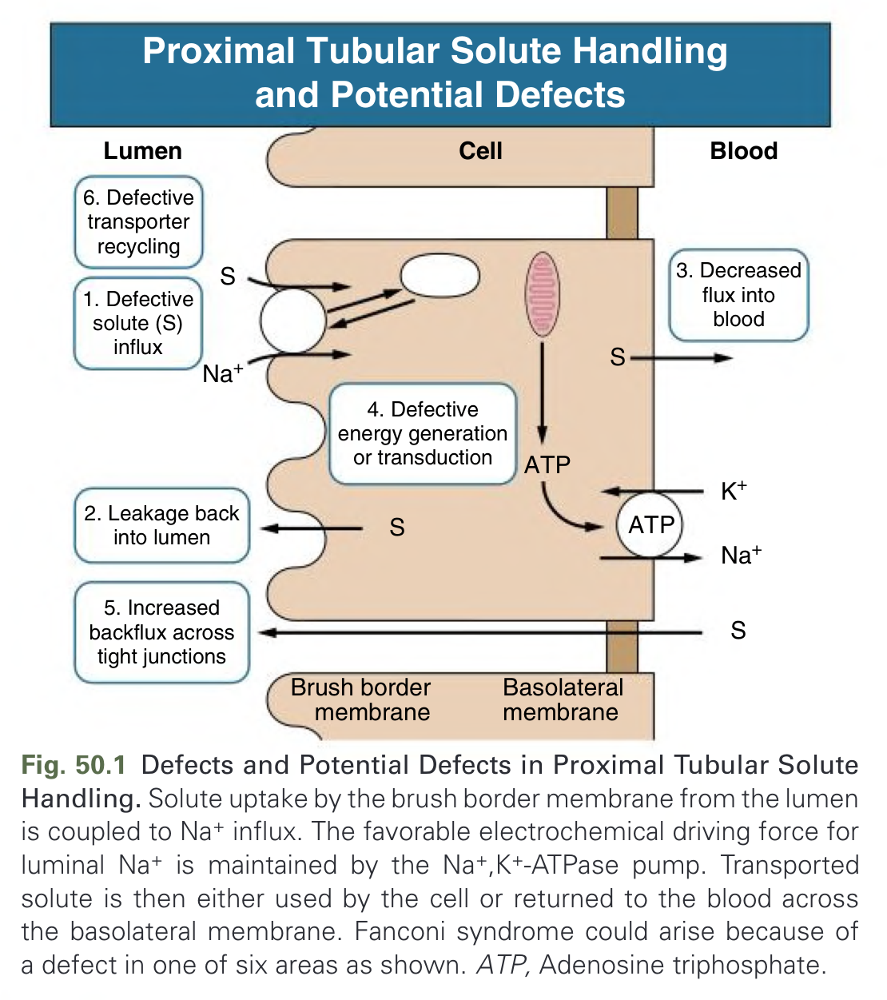

Fig. 50.1 Defects and Potential Defects in Proximal Tubular Solute Handling. Solute uptake by the brush border membrane from the lumen is coupled to Na+ influx. The favorable electrochemical driving force for luminal Na+ is maintained by the Na+,K+-ATPase pump. Transported solute is then either used by the cell or returned to the blood across the basolateral membrane. Fanconi syndrome could arise because of a defect in one of six areas as shown. ATP, Adenosine triphosphate.

---

### Fig_50_2

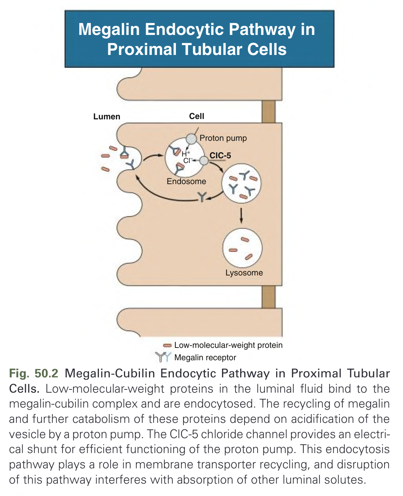

Fig. 50.2 Megalin-Cubilin Endocytic Pathway in Proximal Tubular Cells. Low-molecular-weight proteins in the luminal fluid bind to the megalin-cubilin complex and are endocytosed. The recycling of megalin and further catabolism of these proteins depend on acidification of the vesicle by a proton pump. The ClC-5 chloride channel provides an electrical shunt for efficient functioning of the proton pump. This endocytosis pathway plays a role in membrane transporter recycling, and disruption of this pathway interferes with absorption of other luminal solutes.

---

### Fig_50_3

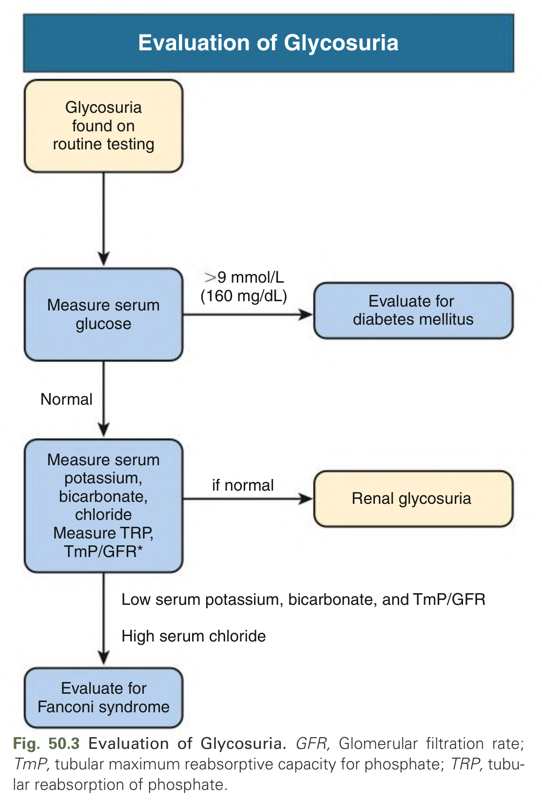

Fig. 50.3 Evaluation of Glycosuria. GFR, Glomerular filtration rate; TmP, tubular maximum reabsorptive capacity for phosphate; TRP, tubular reabsorption of phosphate.

---

### Fig_50_4

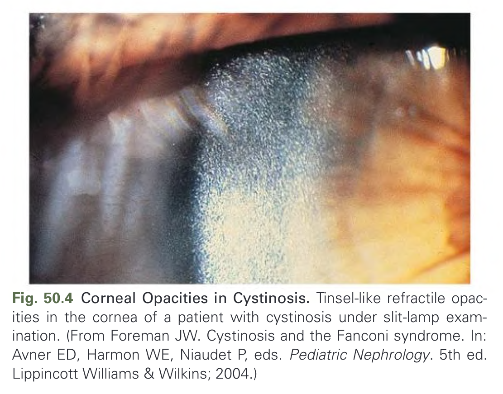

Fig. 50.4 Corneal Opacities in Cystinosis. Tinsel-like refractile opacities in the cornea of a patient with cystinosis under slit-lamp examination. (From Foreman JW. Cystinosis and the Fanconi syndrome. In: Avner ED, Harmon WE, Niaudet P, eds. Pediatric Nephrology. 5th ed. Lippincott Williams & Wilkins; 2004.)

---

### Fig_50_5

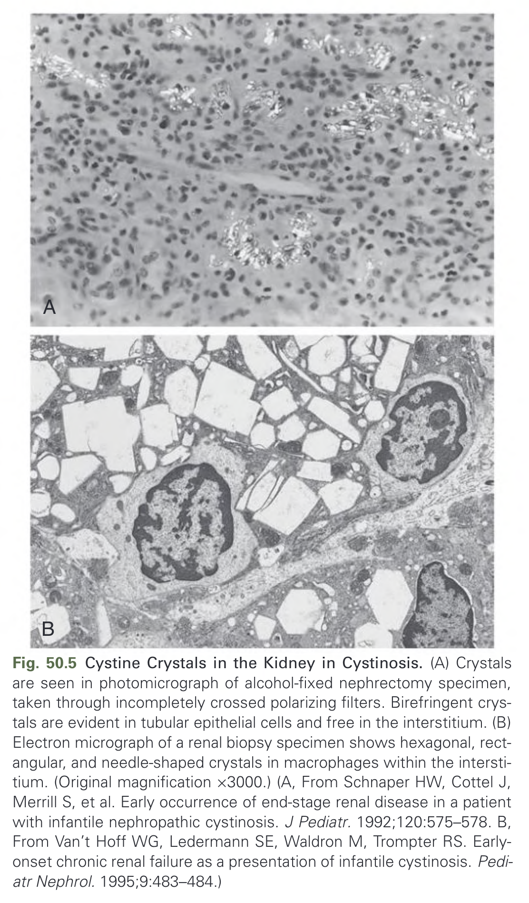

Fig. 50.5 Cystine Crystals in the Kidney in Cystinosis. (A) Crystals are seen in photomicrograph of alcohol-fixed nephrectomy specimen, taken through incompletely crossed polarizing filters. Birefringent crystals are evident in tubular epithelial cells and free in the interstitium. (B) Electron micrograph of a renal biopsy specimen shows hexagonal, rectangular, and needle-shaped crystals in macrophages within the interstitium. (Original magnification ×3000.) (A, From Schnaper HW, Cottel J, Merrill S, et al. Early occurrence of end-stage renal disease in a patient with infantile nephropathic cystinosis. J Pediatr. 1992;120:575–578. B, From Van’t Hoff WG, Ledermann SE, Waldron M, Trompter RS. Early-onset chronic renal failure as a presentation of infantile cystinosis. Pediatr Nephrol. 1995;9:483–484.)

---

### Fig_50_6

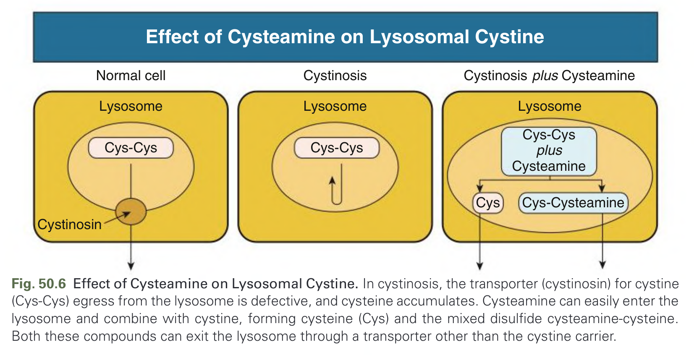

Fig. 50.6 Effect of Cysteamine on Lysosomal Cystine. In cystinosis, the transporter (cystinosin) for cystine (Cys-Cys) egress from the lysosome is defective, and cysteine accumulates. Cysteamine can easily enter the lysosome and combine with cystine, forming cysteine (Cys) and the mixed disulfide cysteamine-cysteine. Both these compounds can exit the lysosome through a transporter other than the cystine carrier.

---

### Fig_50_7

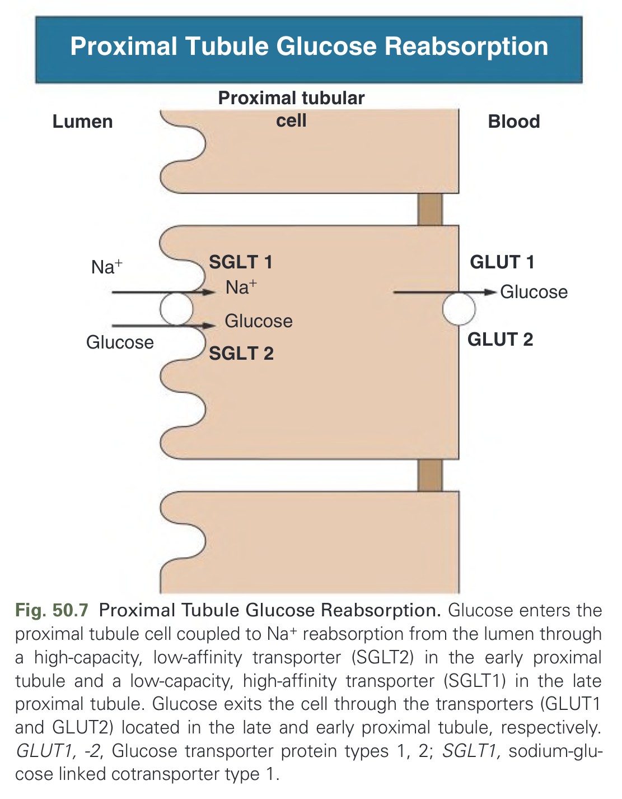

Fig. 50.7 Proximal Tubule Glucose Reabsorption. Glucose enters the proximal tubule cell coupled to Na+ reabsorption from the lumen through a high-capacity, low-affinity transporter (SGLT2) in the early proximal tubule and a low-capacity, high-affinity transporter (SGLT1) in the late proximal tubule. Glucose exits the cell through the transporters (GLUT1 and GLUT2) located in the late and early proximal tubule, respectively. GLUT1, -2, Glucose transporter protein types 1, 2; SGLT1, sodium-glucose linked cotransporter type 1.

---

### Fig_50_8

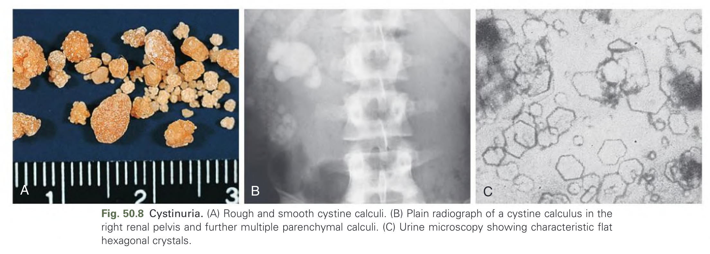

Fig. 50.8 Cystinuria. (A) Rough and smooth cystine calculi. (B) Plain radiograph of a cystine calculus in the right renal pelvis and further multiple parenchymal calculi. (C) Urine microscopy showing characteristic flat hexagonal crystals.

---

## Tables

### Table_50_1

#### Table Image

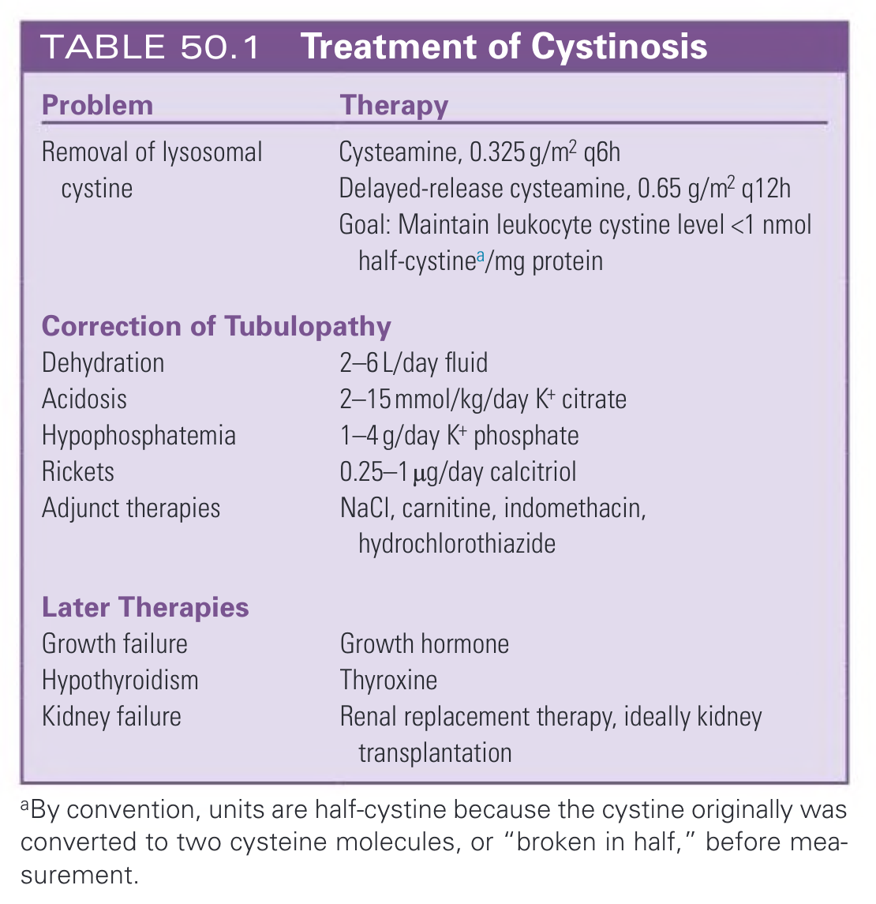

#### Table Data (CSV: [Table_50_1.csv](Table_50_1.csv))

```markdown
| Problem | Therapy |
| :--- | :--- |
| **Removal of lysosomal cystine** | Cysteamine, 0.325 g/m² q6h<br>Delayed-release cysteamine, 0.65 g/m² q12h<br>Goal: Maintain leukocyte cystine level <1 nmol half-cystinea/mg protein |
| **Correction of Tubulopathy** | |
| Dehydration | 2-6 L/day fluid |
| Acidosis | 2-15 mmol/kg/day K+ citrate |
| Hypophosphatemia | 1-4 g/day K+ phosphate |
| Rickets | 0.25-1 µg/day calcitriol |
| Adjunct therapies | NaCl, carnitine, indomethacin, hydrochlorothiazide |
| **Later Therapies** | |
| Growth failure | Growth hormone |
| Hypothyroidism | Thyroxine |
| Kidney failure | Renal replacement therapy, ideally kidney transplantation |
aBy convention, units are half-cystine because the cystine originally was converted to two cysteine molecules, or "broken in half," before measurement.
```

TABLE 50.1 Treatment of Cystinosis

---

### Table_50_2

#### Table Image

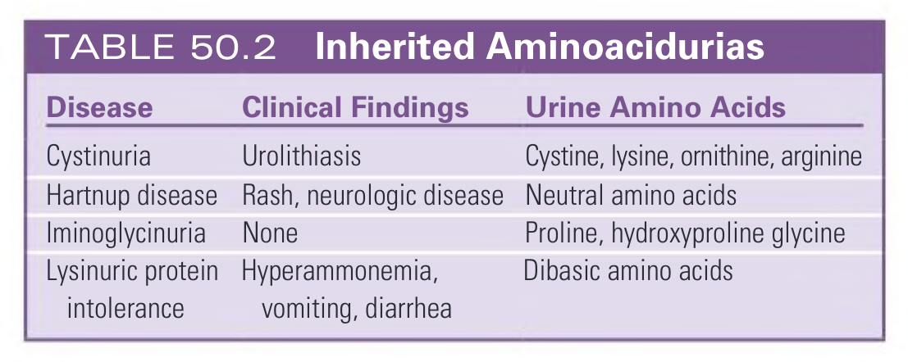

#### Table Data (CSV: [Table_50_2.csv](Table_50_2.csv))

```markdown
| Disease | Clinical Findings | Urine Amino Acids |
| :--- | :--- | :--- |
| Cystinuria | Urolithiasis | Cystine, lysine, ornithine, arginine |
| Hartnup disease | Rash, neurologic disease | Neutral amino acids |
| Iminoglycinuria | None | Proline, hydroxyproline glycine |
| Lysinuric protein intolerance | Hyperammonemia, vomiting, diarrhea | Dibasic amino acids |
```

TABLE 50.2 Inherited Aminoacidurias

---

## Boxes

### Box_50_1

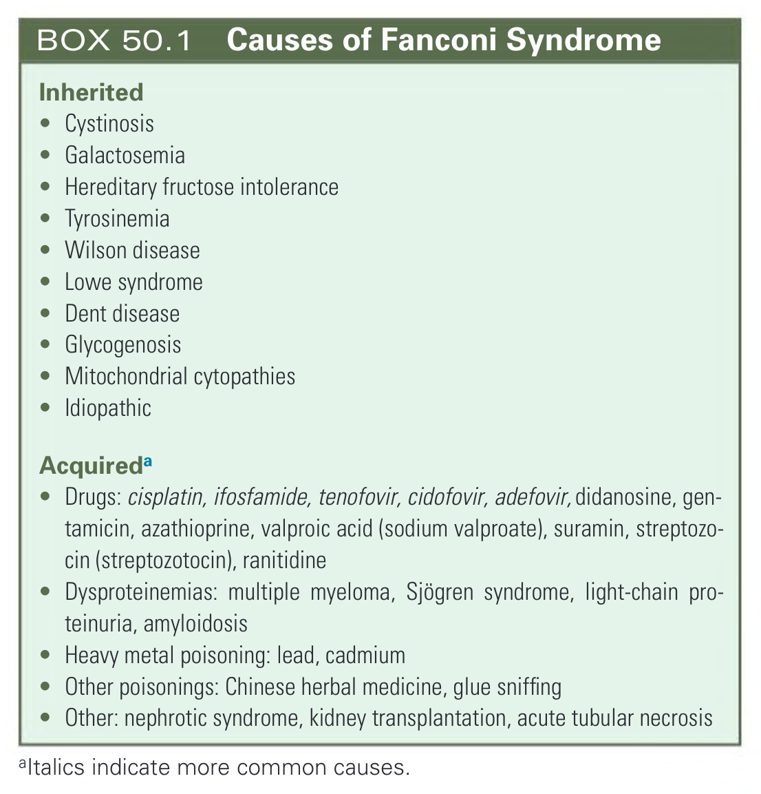

#### Box Text

```markdown
**Inherited**
* Cystinosis
* Galactosemia
* Hereditary fructose intolerance
* Tyrosinemia
* Wilson disease
* Lowe syndrome
* Dent disease
* Glycogenosis
* Mitochondrial cytopathies
* Idiopathic

**Acquired**
* Drugs: cisplatin, ifosfamide, tenofovir, cidofovir, adefovir, didanosine, gentamicin, azathioprine, valproic acid (sodium valproate), suramin, streptozocin (streptozotocin), ranitidine
* Dysproteinemias: multiple myeloma, Sjögren syndrome, light-chain proteinuria, amyloidosis
* Heavy metal poisoning: lead, cadmium
* Other poisonings: Chinese herbal medicine, glue sniffing
* Other: nephrotic syndrome, kidney transplantation, acute tubular necrosis
*Italics indicate more common causes.
```

BOX 50.1 Causes of Fanconi Syndrome

---

### Box_50_2

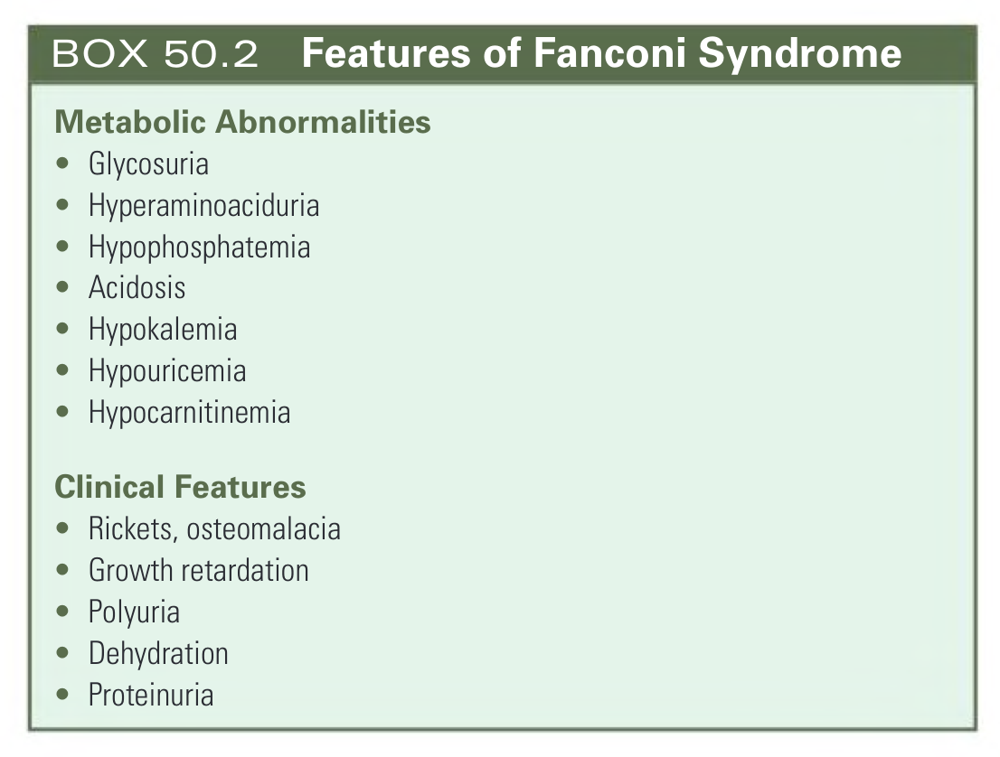

#### Box Text

```markdown
**Metabolic Abnormalities**
* Glycosuria
* Hyperaminoaciduria
* Hypophosphatemia
* Acidosis
* Hypokalemia
* Hypouricemia
* Hypocarnitinemia

**Clinical Features**
* Rickets, osteomalacia
* Growth retardation
* Polyuria
* Dehydration
* Proteinuria
```

BOX 50.2 Features of Fanconi Syndrome

---
