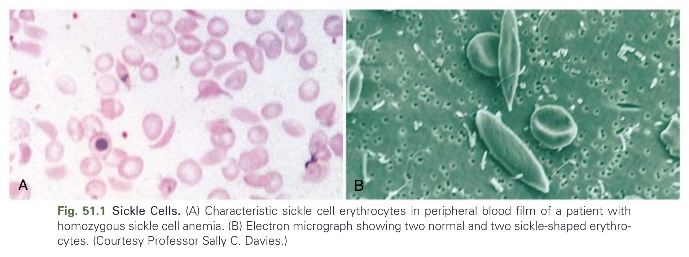
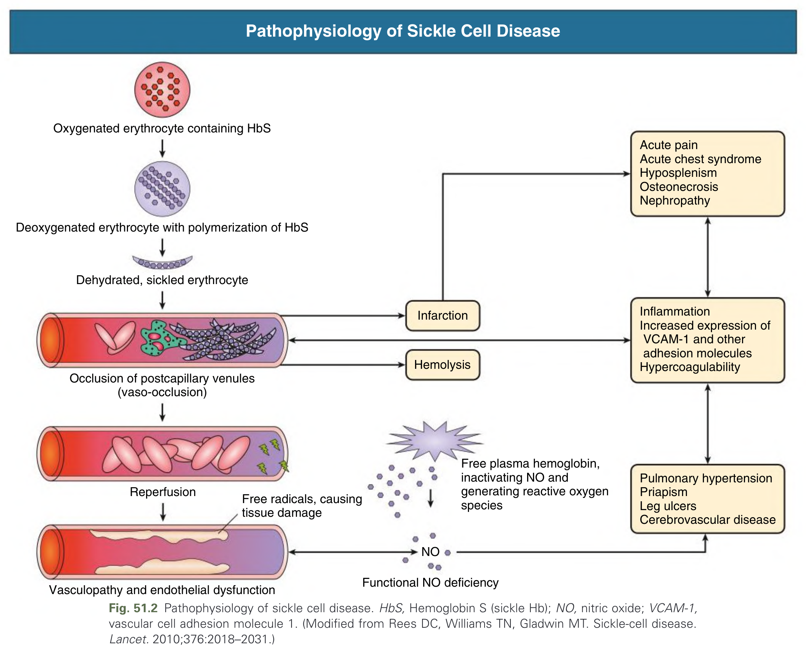
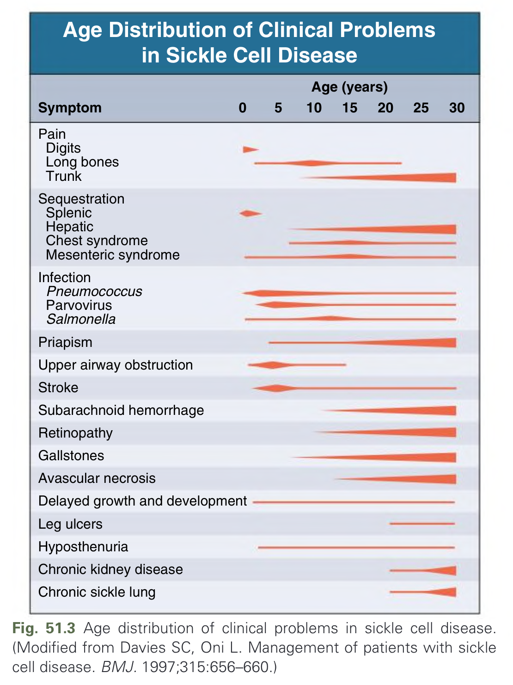
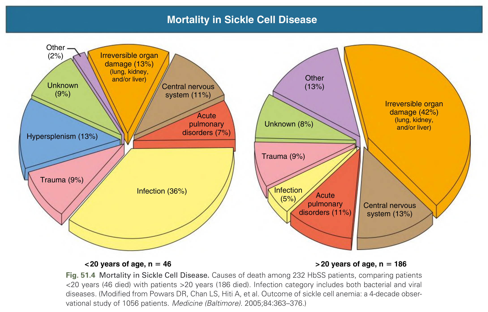
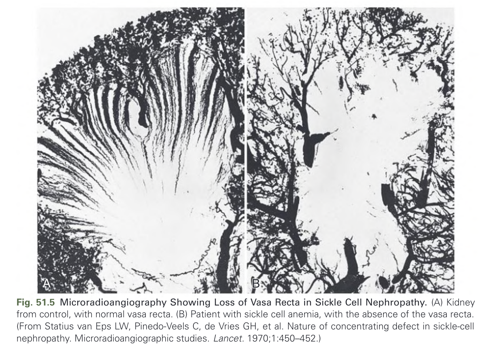
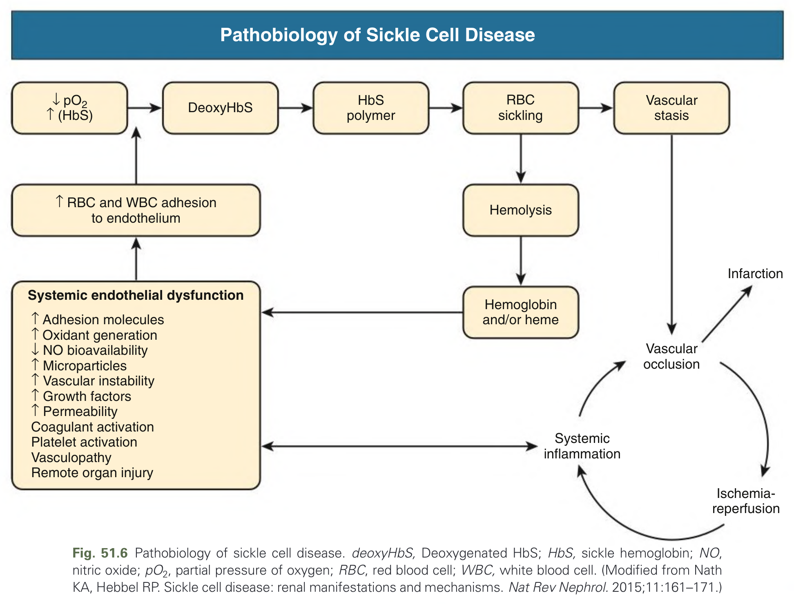
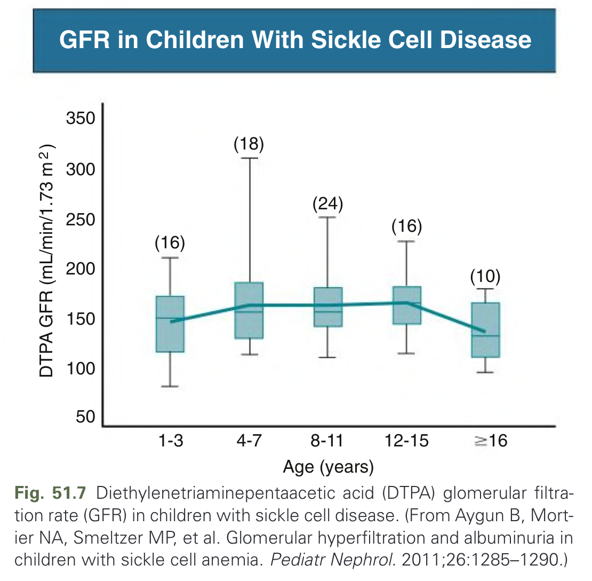
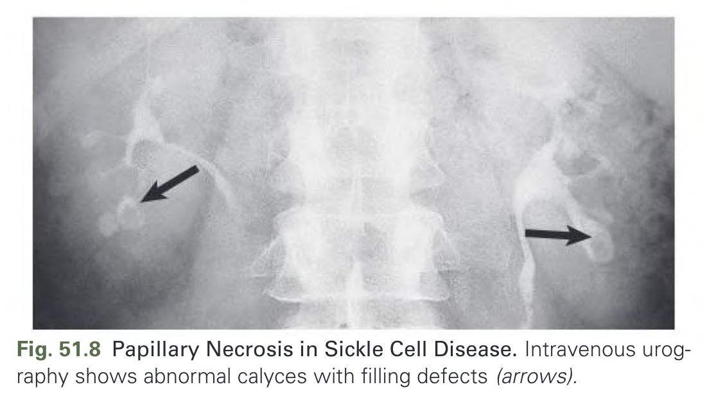
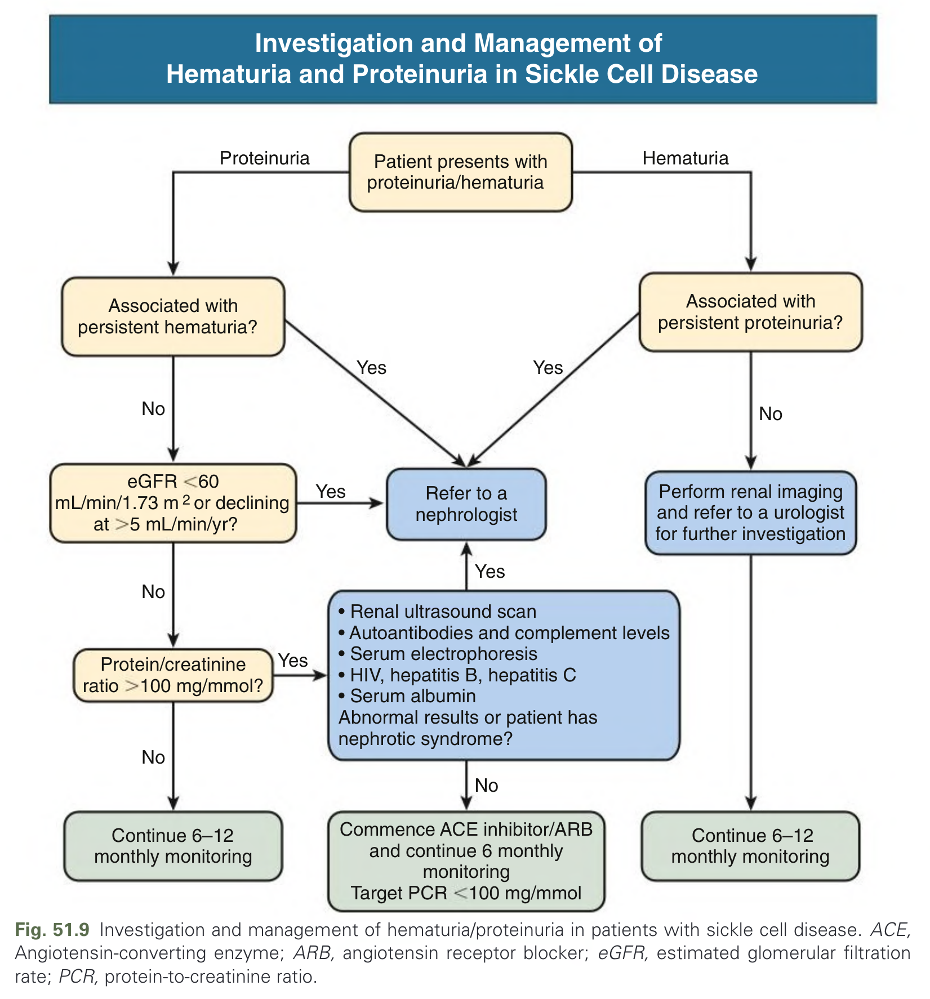
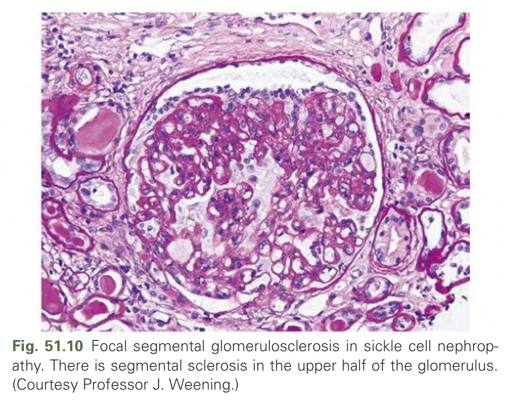

# 051. Sickle Cell Diseases and the Kidney - Figures and Tables Index

This document lists all figures, tables and boxes extracted from `051. Sickle Cell Diseases and the Kidney.pdf`.

## Table of Contents
- [Figures](#figures)
- [Tables](#tables)
- [Boxes](#boxes)

---

## Figures

### Fig_51_1

Fig. 51.1 Sickle Cells. (A) Characteristic sickle cell erythrocytes in peripheral blood film of a patient with homozygous sickle cell anemia. (B) Electron micrograph showing two normal and two sickle-shaped erythrocytes. (Courtesy Professor Sally C. Davies.)

---

### Fig_51_2

Fig. 51.2 Pathophysiology of sickle cell disease. HbS, Hemoglobin S (sickle Hb); NO, nitric oxide; VCAM-1, vascular cell adhesion molecule 1. (Modified from Rees DC, Williams TN, Gladwin MT. Sickle-cell disease. Lancet. 2010;376:2018–2031.)

---

### Fig_51_3

Fig. 51.3 Age distribution of clinical problems in sickle cell disease. (Modified from Davies SC, Oni L. Management of patients with sickle cell disease. BMJ. 1997;315:656–660.)

---

### Fig_51_4

Fig. 51.4 Mortality in Sickle Cell Disease. Causes of death among 232 HbSS patients, comparing patients <20 years (46 died) with patients >20 years (186 died). Infection category includes both bacterial and viral diseases. (Modified from Powars DR, Chan LS, Hiti A, et al. Outcome of sickle cell anemia: a 4-decade observational study of 1056 patients. Medicine (Baltimore). 2005;84:363–376.)

---

### Fig_51_5

Fig. 51.5 Microradioangiography Showing Loss of Vasa Recta in Sickle Cell Nephropathy. (A) Kidney from control, with normal vasa recta. (B) Patient with sickle cell anemia, with the absence of the vasa recta. (From Statius van Eps LW, Pinedo-Veels C, de Vries GH, et al. Nature of concentrating defect in sickle-cell nephropathy. Microradioangiographic studies. Lancet. 1970;1:450–452.)

---

### Fig_51_6

Fig. 51.6 Pathobiology of sickle cell disease. deoxyHbS, Deoxygenated HbS; HbS, sickle hemoglobin; NO, nitric oxide; pO2, partial pressure of oxygen; RBC, red blood cell; WBC, white blood cell. (Modified from Nath KA, Hebbel RP. Sickle cell disease: renal manifestations and mechanisms. Nat Rev Nephrol. 2015;11:161–171.)

---

### Fig_51_7

Fig. 51.7 Diethylenetriaminepentaacetic acid (DTPA) glomerular filtration rate (GFR) in children with sickle cell disease. (From Aygun B, Mortier NA, Smeltzer MP, et al. Glomerular hyperfiltration and albuminuria in children with sickle cell anemia. Pediatr Nephrol. 2011;26:1285–1290.)

---

### Fig_51_8

Fig. 51.8 Papillary Necrosis in Sickle Cell Disease. Intravenous urography shows abnormal calyces with filling defects (arrows).

---

### Fig_51_9

Fig. 51.9 Investigation and management of hematuria/proteinuria in patients with sickle cell disease. ACE, Angiotensin-converting enzyme; ARB, angiotensin receptor blocker; eGFR, estimated glomerular filtration rate; PCR, protein-to-creatinine ratio.

---

### Fig_51_10

Fig. 51.10 Focal segmental glomerulosclerosis in sickle cell nephropathy. There is segmental sclerosis in the upper half of the glomerulus. (Courtesy Professor J. Weening.)

---

## Tables

*No tables resolved for this chapter.*

## Boxes

*No boxes resolved for this chapter.*
