# 052. Congenital Anomalies of the Kidney and Urinary Tract - Figures and Tables Index

This document lists all figures, tables and boxes extracted from `052. Congenital Anomalies of the Kidney and Urinary Tract.pdf`.

## Table of Contents
- [Figures](#figures)
- [Tables](#tables)
- [Boxes](#boxes)

---

## Figures

### Fig_52_1

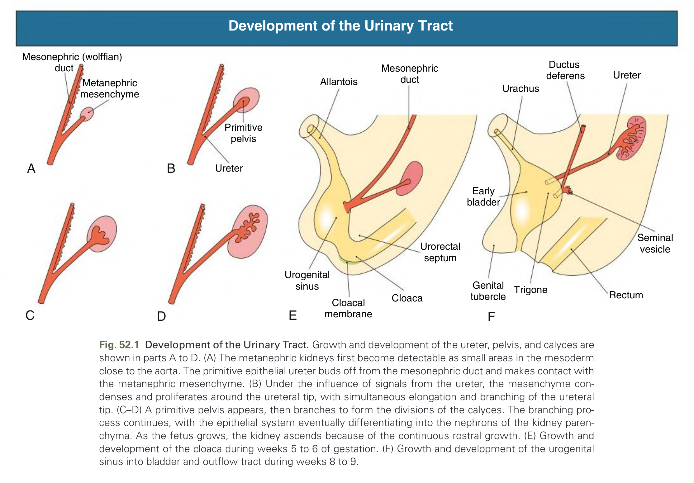

Fig. 52.1 Development of the Urinary Tract. Growth and development of the ureter, pelvis, and calyces are shown in parts A to D. (A) The metanephric kidneys first become detectable as small areas in the mesoderm close to the aorta. The primitive epithelial ureter buds off from the mesonephric duct and makes contact with the metanephric mesenchyme. (B) Under the influence of signals from the ureter, the mesenchyme condenses and proliferates around the ureteral tip, with simultaneous elongation and branching of the ureteral tip. (C–D) A primitive pelvis appears, then branches to form the divisions of the calyces. The branching process continues, with the epithelial system eventually differentiating into the nephrons of the kidney parenchyma. As the fetus grows, the kidney ascends because of the continuous rostral growth. (E) Growth and development of the cloaca during weeks 5 to 6 of gestation. (F) Growth and development of the urogenital sinus into bladder and outflow tract during weeks 8 to 9.

---

### Fig_52_2

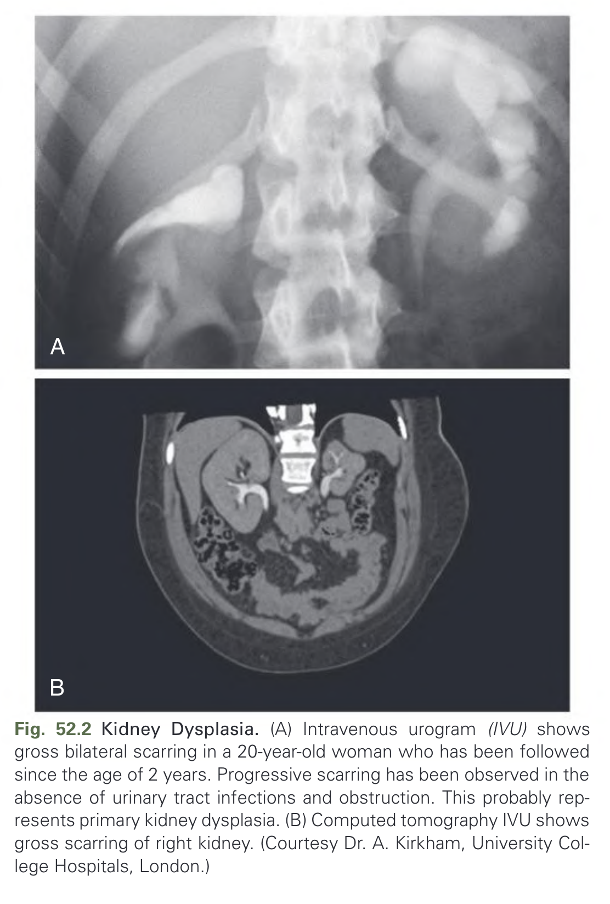

Fig. 52.2 Kidney Dysplasia. (A) Intravenous urogram (IVU) shows gross bilateral scarring in a 20-year-old woman who has been followed since the age of 2 years. Progressive scarring has been observed in the absence of urinary tract infections and obstruction. This probably represents primary kidney dysplasia. (B) Computed tomography IVU shows gross scarring of right kidney. (Courtesy Dr. A. Kirkham, University College Hospitals, London.)

---

### Fig_52_3

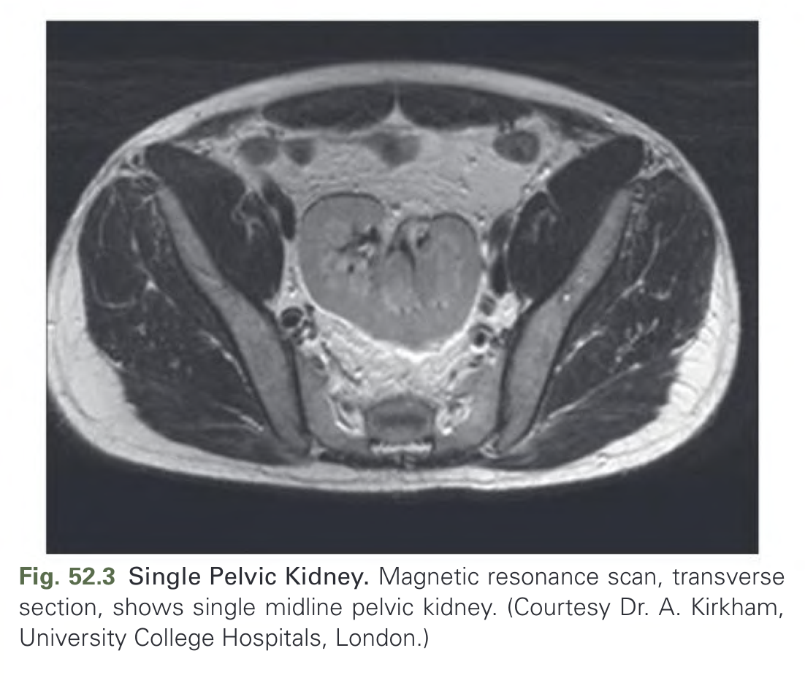

Fig. 52.3 Single Pelvic Kidney. Magnetic resonance scan, transverse section, shows single midline pelvic kidney. (Courtesy Dr. A. Kirkham, University College Hospitals, London.)

---

### Fig_52_4

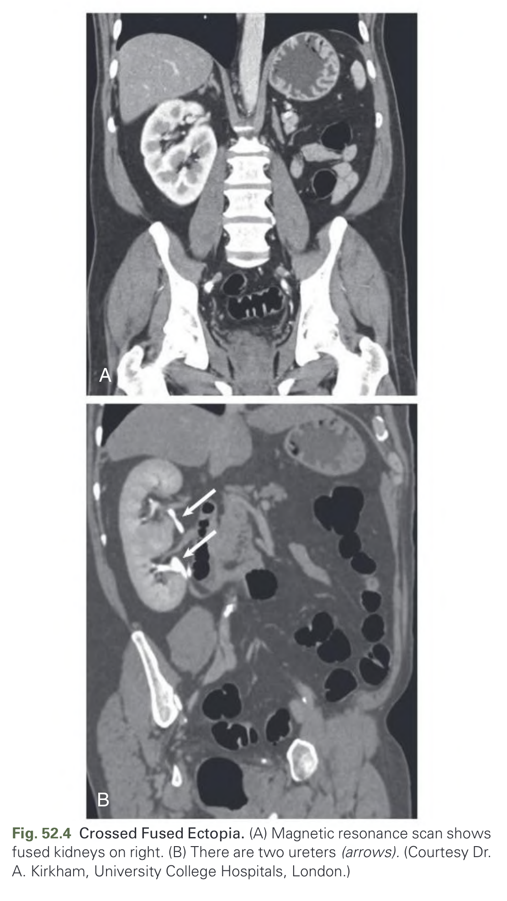

Fig. 52.4 Crossed Fused Ectopia. (A) Magnetic resonance scan shows fused kidneys on right. (B) There are two ureters (arrows). (Courtesy Dr. A. Kirkham, University College Hospitals, London.)

---

### Fig_52_5

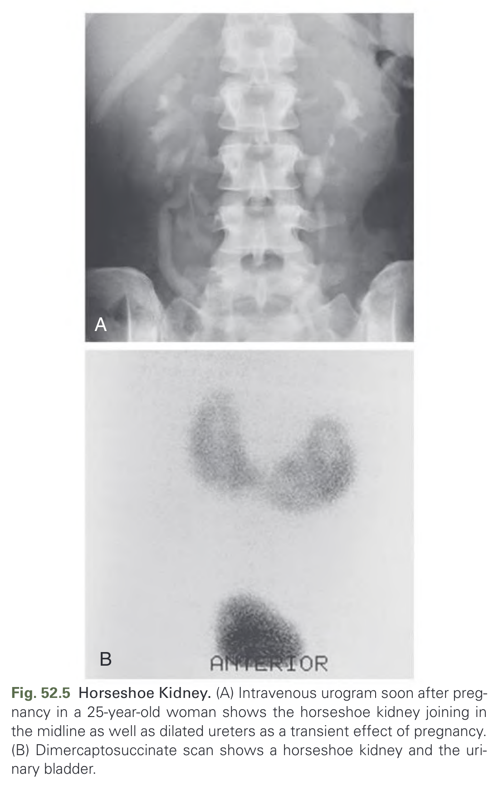

Fig. 52.5 Horseshoe Kidney. (A) Intravenous urogram soon after pregnancy in a 25-year-old woman shows the horseshoe kidney joining in the midline as well as dilated ureters as a transient effect of pregnancy. (B) Dimercaptosuccinate scan shows a horseshoe kidney and the urinary bladder.

---

### Fig_52_6

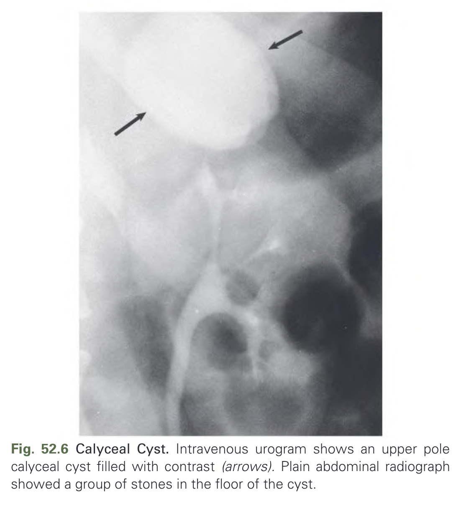

Fig. 52.6 Calyceal Cyst. Intravenous urogram shows an upper pole calyceal cyst filled with contrast (arrows). Plain abdominal radiograph showed a group of stones in the floor of the cyst.

---

### Fig_52_7

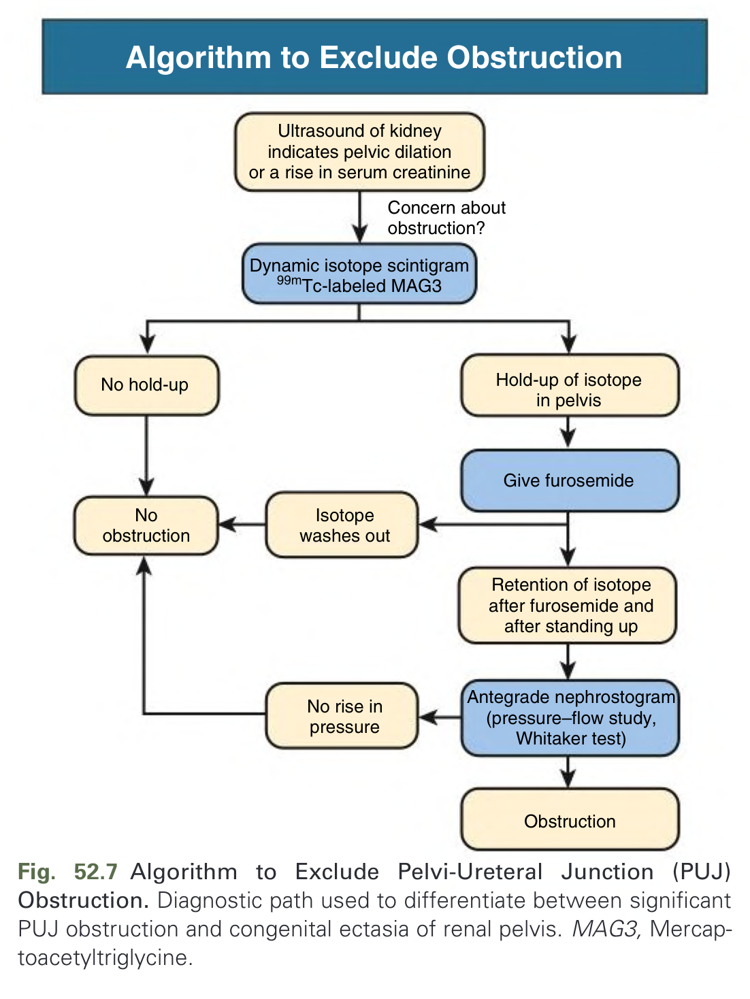

Fig. 52.7 Algorithm to Exclude Pelvi-Ureteral Junction (PUJ) Obstruction. Diagnostic path used to differentiate between significant PUJ obstruction and congenital ectasia of renal pelvis. MAG3, Mercaptoacetyltriglycine.

---

### Fig_52_8

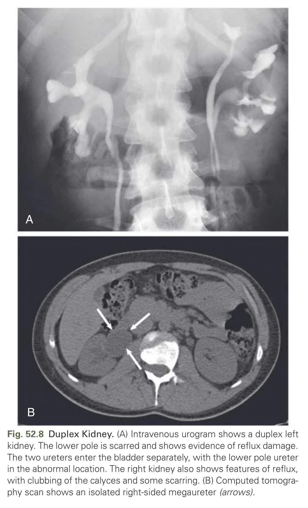

Fig. 52.8 Duplex Kidney. (A) Intravenous urogram shows a duplex left kidney. The lower pole is scarred and shows evidence of reflux damage. The two ureters enter the bladder separately, with the lower pole ureter in the abnormal location. The right kidney also shows features of reflux, with clubbing of the calyces and some scarring. (B) Computed tomography scan shows an isolated right-sided megaureter (arrows).

---

### Fig_52_9

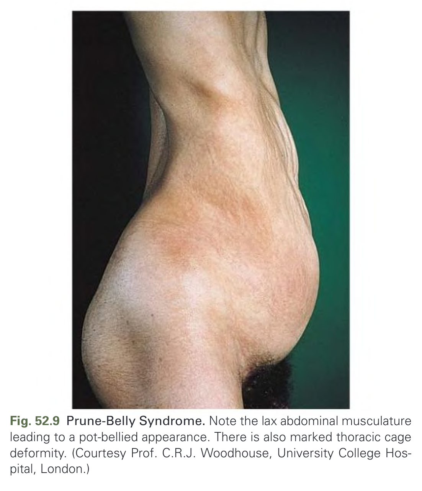

Fig. 52.9 Prune-Belly Syndrome. Note the lax abdominal musculature leading to a pot-bellied appearance. There is also marked thoracic cage deformity. (Courtesy Prof. C.R.J. Woodhouse, University College Hospital, London.)

---

### Fig_52_10

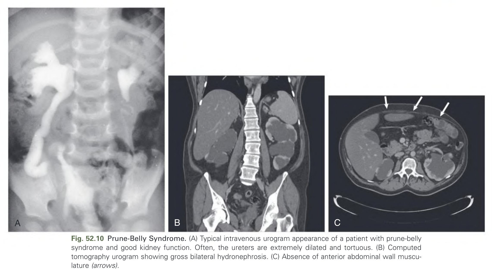

Fig. 52.10 Prune-Belly Syndrome. (A) Typical intravenous urogram appearance of a patient with prune-belly syndrome and good kidney function. Often, the ureters are extremely dilated and tortuous. (B) Computed tomography urogram showing gross bilateral hydronephrosis. (C) Absence of anterior abdominal wall musculature (arrows).

---

### Fig_52_11

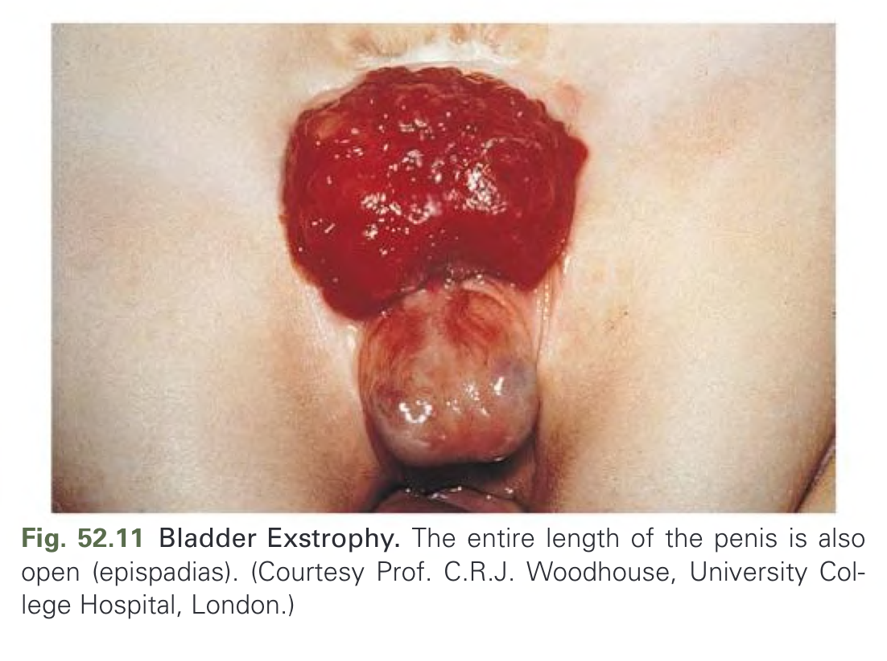

Fig. 52.11 Bladder Exstrophy. The entire length of the penis is also open (epispadias). (Courtesy Prof. C.R.J. Woodhouse, University College Hospital, London.)

---

### Fig_52_12

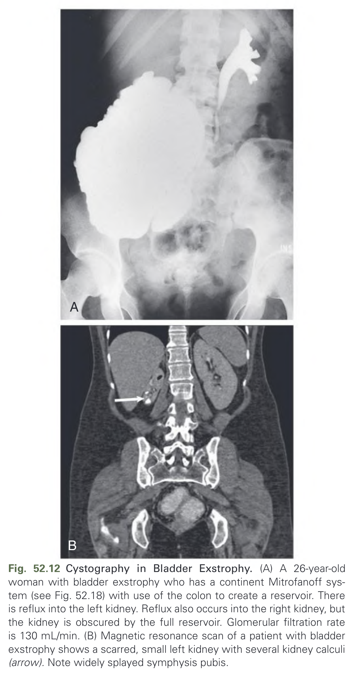

Fig. 52.12 Cystography in Bladder Exstrophy. (A) A 26-year-old woman with bladder exstrophy who has a continent Mitrofanoff system (see Fig. 52.18) with use of the colon to create a reservoir. There is reflux into the left kidney. Reflux also occurs into the right kidney, but the kidney is obscured by the full reservoir. Glomerular filtration rate is 130 mL/min. (B) Magnetic resonance scan of a patient with bladder exstrophy shows a scarred, small left kidney with several kidney calculi (arrow). Note widely splayed symphysis pubis.

---

### Fig_52_13

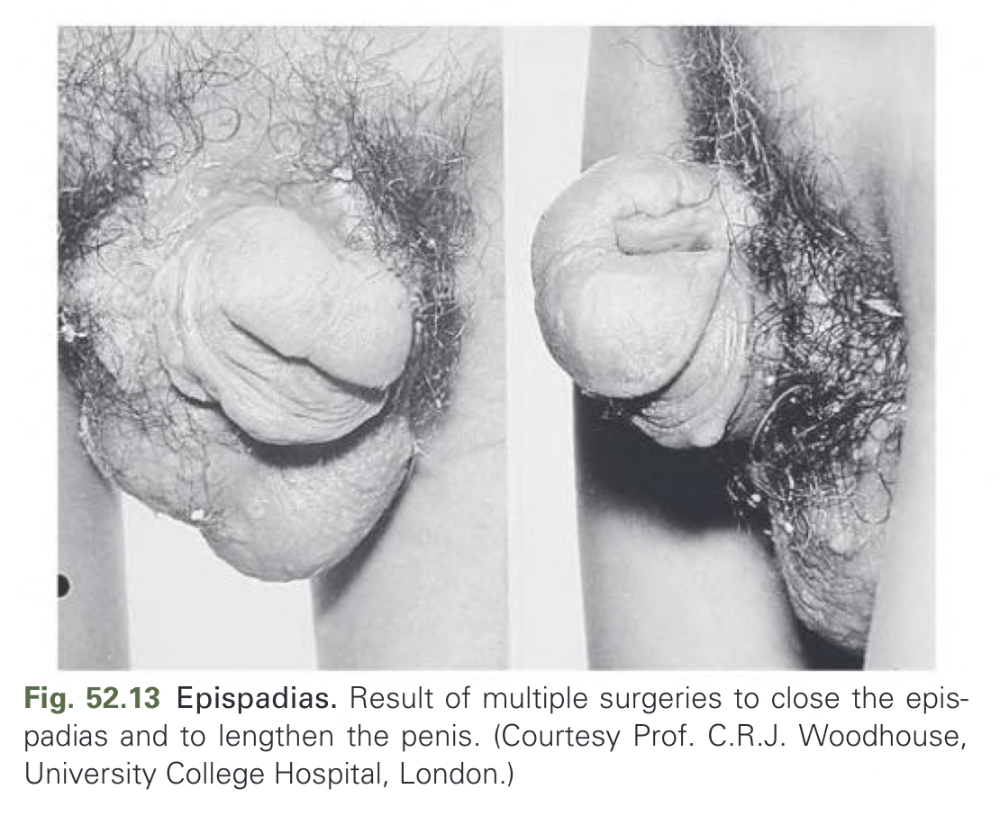

Fig. 52.13 Epispadias. Result of multiple surgeries to close the epispadias and to lengthen the penis. (Courtesy Prof. C.R.J. Woodhouse, University College Hospital, London.)

---

### Fig_52_14

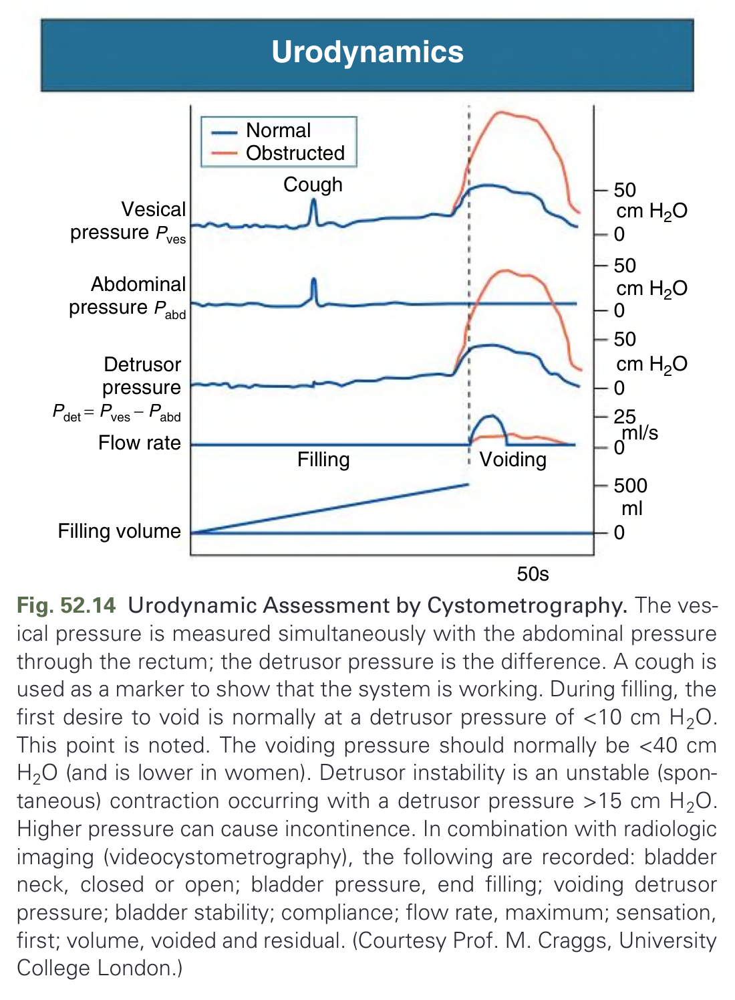

Fig. 52.14 Urodynamic Assessment by Cystometrography. The vesical pressure is measured simultaneously with the abdominal pressure through the rectum; the detrusor pressure is the difference. A cough is used as a marker to show that the system is working. During filling, the first desire to void is normally at a detrusor pressure of <10 cm H2O. This point is noted. The voiding pressure should normally be <40 cm H2O (and is lower in women). Detrusor instability is an unstable (spontaneous) contraction occurring with a detrusor pressure >15 cm H2O. Higher pressure can cause incontinence. In combination with radiologic imaging (videocystometrography), the following are recorded: bladder neck, closed or open; bladder pressure, end filling; voiding detrusor pressure; bladder stability; compliance; flow rate, maximum; sensation, first; volume, voided and residual. (Courtesy Prof. M. Craggs, University College London.)

---

### Fig_52_15

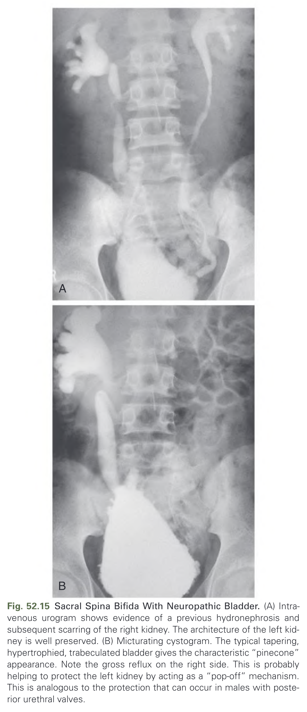

Fig. 52.15 Sacral Spina Bifida With Neuropathic Bladder. (A) Intravenous urogram shows evidence of a previous hydronephrosis and subsequent scarring of the right kidney. The architecture of the left kidney is well preserved. (B) Micturating cystogram. The typical tapering, hypertrophied, trabeculated bladder gives the characteristic “pinecone” appearance. Note the gross reflux on the right side. This is probably helping to protect the left kidney by acting as a “pop-off” mechanism. This is analogous to the protection that can occur in males with posterior urethral valves.

---

### Fig_52_16

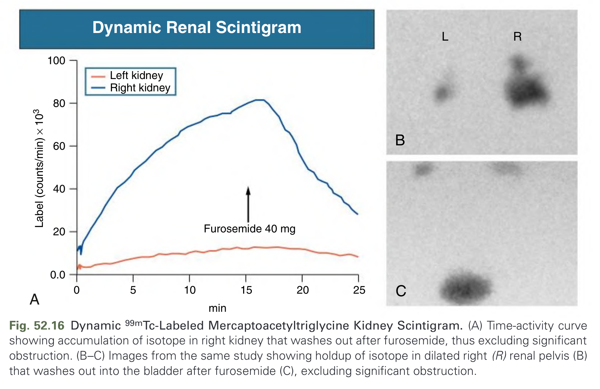

Fig. 52.16 Dynamic 99mTc-Labeled Mercaptoacetyltriglycine Kidney Scintigram. (A) Time-activity curve showing accumulation of isotope in right kidney that washes out after furosemide, thus excluding significant obstruction. (B–C) Images from the same study showing holdup of isotope in dilated right (R) renal pelvis (B) that washes out into the bladder after furosemide (C), excluding significant obstruction.

---

### Fig_52_17

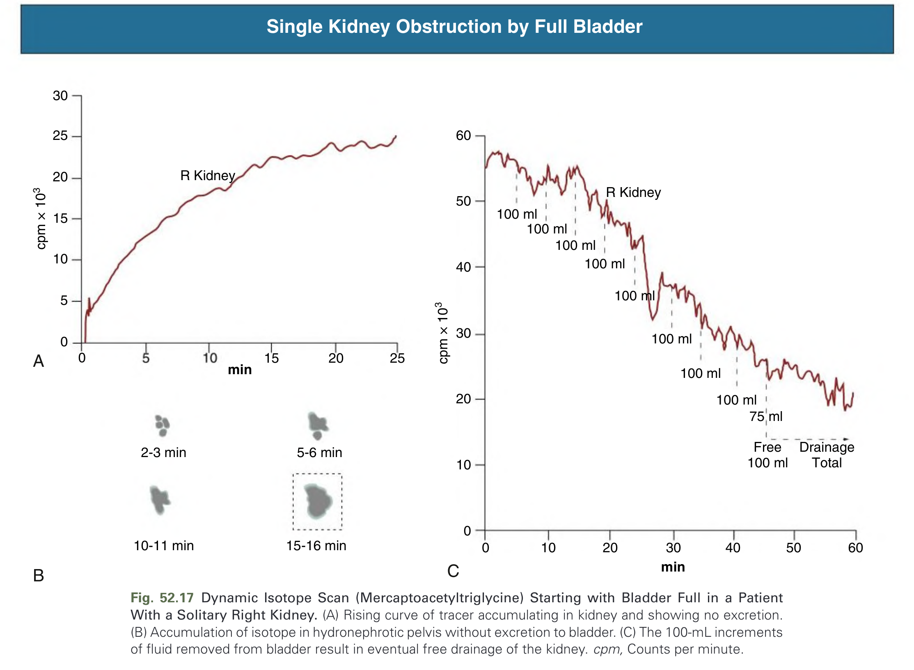

Fig. 52.17 Dynamic Isotope Scan (Mercaptoacetyltriglycine) Starting with Bladder Full in a Patient With a Solitary Right Kidney. (A) Rising curve of tracer accumulating in kidney and showing no excretion. (B) Accumulation of isotope in hydronephrotic pelvis without excretion to bladder. (C) The 100-mL increments of fluid removed from bladder result in eventual free drainage of the kidney. cpm, Counts per minute.

---

### Fig_52_18

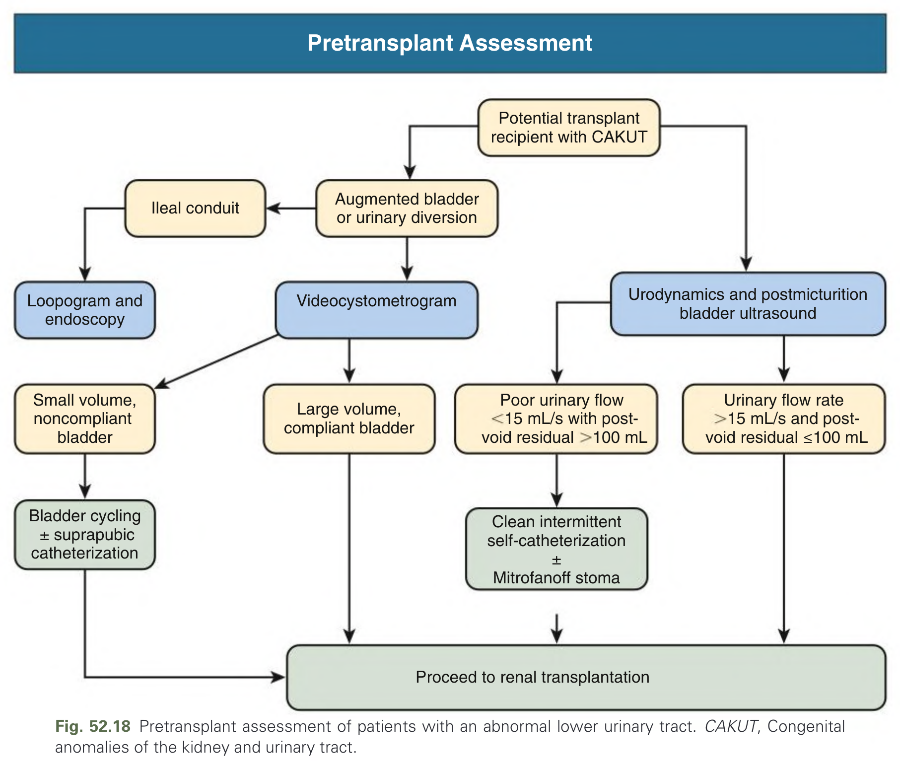

Fig. 52.18 Pretransplant assessment of patients with an abnormal lower urinary tract. CAKUT, Congenital anomalies of the kidney and urinary tract.

---

### Fig_52_19

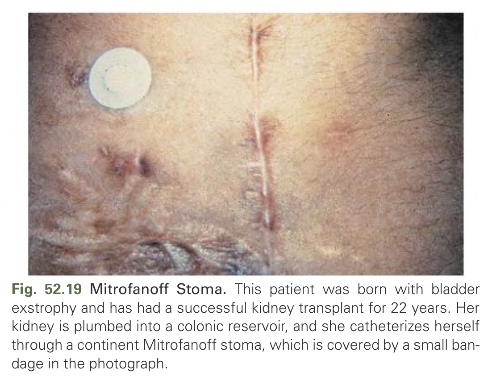

Fig. 52.19 Mitrofanoff Stoma. This patient was born with bladder exstrophy and has had a successful kidney transplant for 22 years. Her kidney is plumbed into a colonic reservoir, and she catheterizes herself through a continent Mitrofanoff stoma, which is covered by a small bandage in the photograph.

---

## Tables

### Table_52_1

#### Table Image

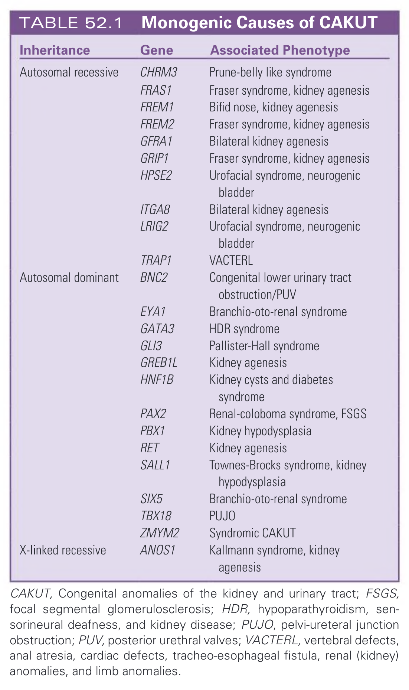

#### Table Data (CSV: [Table_52_1.csv](Table_52_1.csv))

```markdown
| Inheritance | Gene | Associated Phenotype |
| :--- | :--- | :--- |
| Autosomal recessive | CHRM3 | Prune-belly like syndrome |
| | FRAS1 | Fraser syndrome, kidney agenesis |
| | FREM1 | Bifid nose, kidney agenesis |
| | FREM2 | Fraser syndrome, kidney agenesis |
| | GFRA1 | Bilateral kidney agenesis |
| | GRIP1 | Fraser syndrome, kidney agenesis |
| | HPSE2 | Urofacial syndrome, neurogenic bladder |
| | ITGA8 | Bilateral kidney agenesis |
| | LRIG2 | Urofacial syndrome, neurogenic bladder |
| | TRAP1 | VACTERL |
| Autosomal dominant | BNC2 | Congenital lower urinary tract obstruction/PUV |
| | EYA1 | Branchio-oto-renal syndrome |
| | GATA3 | HDR syndrome |
| | GLI3 | Pallister-Hall syndrome |
| | GREB1L | Kidney agenesis |
| | HNF1B | Kidney cysts and diabetes syndrome |
| | PAX2 | Renal-coloboma syndrome, FSGS |
| | PBX1 | Kidney hypodysplasia |
| | RET | Kidney agenesis |
| | SALL1 | Townes-Brocks syndrome, kidney hypodysplasia |
| | SIX5 | Branchio-oto-renal syndrome |
| | TBX18 | PUJO |
| | ZMYM2 | Syndromic CAKUT |
| X-linked recessive | ANOS1 | Kallmann syndrome, kidney agenesis |

CAKUT, Congenital anomalies of the kidney and urinary tract; FSGS, focal segmental glomerulosclerosis; HDR, hypoparathyroidism, sensorineural deafness, and kidney disease; PUJO, pelvi-ureteral junction obstruction; PUV, posterior urethral valves; VACTERL, vertebral defects, anal atresia, cardiac defects, tracheo-esophageal fistula, renal (kidney) anomalies, and limb anomalies.
```

TABLE 52.1 Monogenic Causes of CAKUT

---

### Table_52_2

#### Table Image

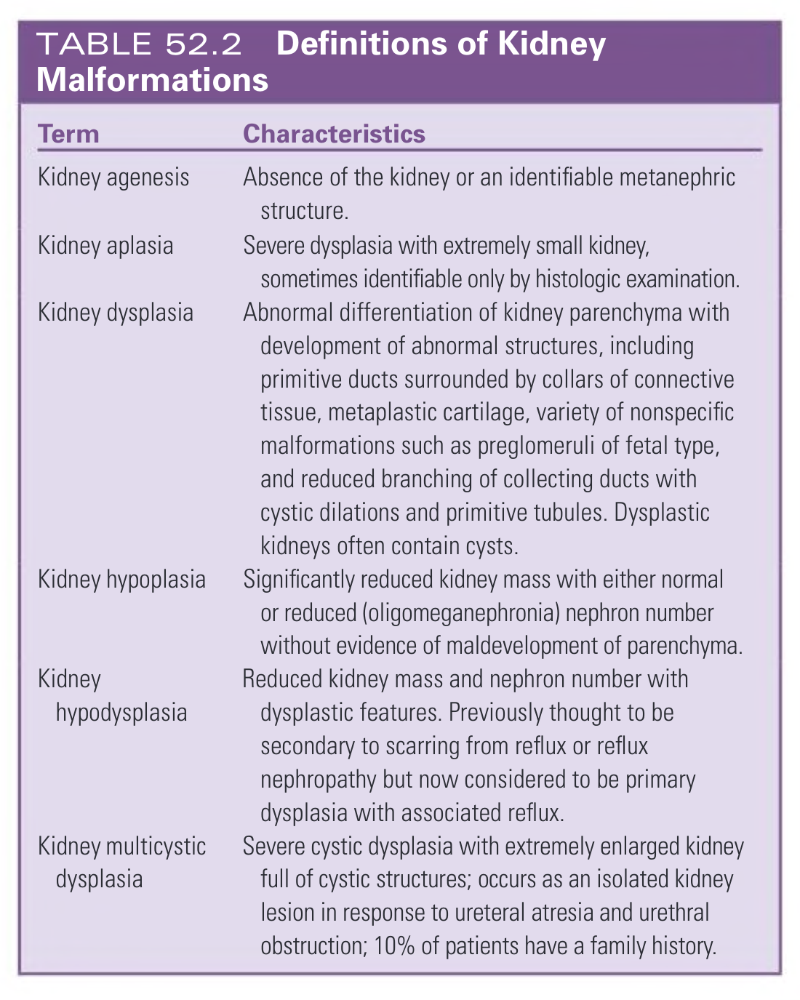

#### Table Data (CSV: [Table_52_2.csv](Table_52_2.csv))

```markdown
| Term | Characteristics |
| :--- | :--- |
| Kidney agenesis | Absence of the kidney or an identifiable metanephric structure. |
| Kidney aplasia | Severe dysplasia with extremely small kidney, sometimes identifiable only by histologic examination. |
| Kidney dysplasia | Abnormal differentiation of kidney parenchyma with development of abnormal structures, including primitive ducts surrounded by collars of connective tissue, metaplastic cartilage, variety of nonspecific malformations such as preglomeruli of fetal type, and reduced branching of collecting ducts with cystic dilations and primitive tubules. Dysplastic kidneys often contain cysts. |
| Kidney hypoplasia | Significantly reduced kidney mass with either normal or reduced (oligomeganephronia) nephron number without evidence of maldevelopment of parenchyma. |
| Kidney hypodysplasia | Reduced kidney mass and nephron number with dysplastic features. Previously thought to be secondary to scarring from reflux or reflux nephropathy but now considered to be primary dysplasia with associated reflux. |
| Kidney multicystic dysplasia | Severe cystic dysplasia with extremely enlarged kidney full of cystic structures; occurs as an isolated kidney lesion in response to ureteral atresia and urethral obstruction; 10% of patients have a family history. |
```

TABLE 52.2 Definitions of Kidney Malformations

---

### Table_52_3

#### Table Image

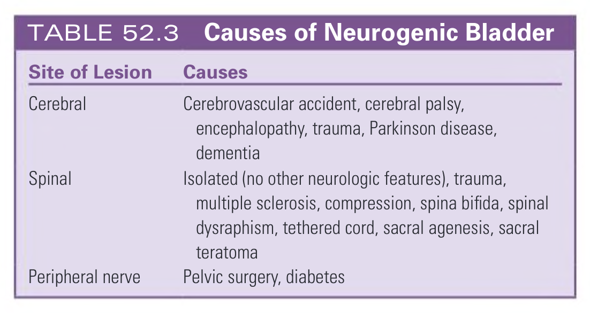

#### Table Data (CSV: [Table_52_3.csv](Table_52_3.csv))

```markdown
| Site of Lesion | Causes |
| :--- | :--- |
| Cerebral | Cerebrovascular accident, cerebral palsy, encephalopathy, trauma, Parkinson disease, dementia |
| Spinal | Isolated (no other neurologic features), trauma, multiple sclerosis, compression, spina bifida, spinal dysraphism, tethered cord, sacral agenesis, sacral teratoma |
| Peripheral nerve | Pelvic surgery, diabetes |
```

TABLE 52.3 Causes of Neurogenic Bladder

---

### Table_52_4

#### Table Image

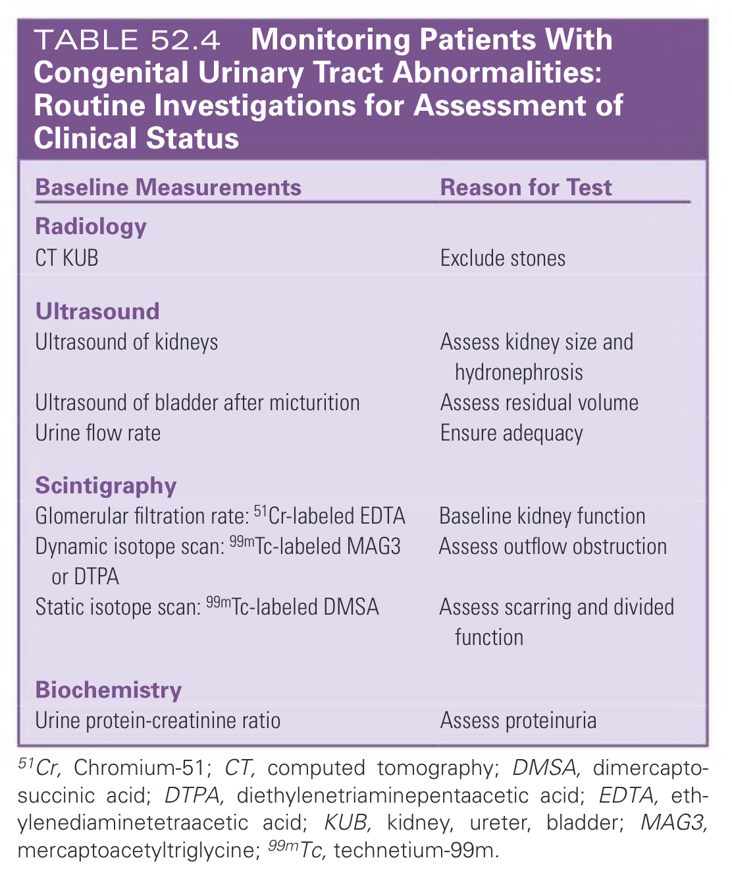

#### Table Data (CSV: [Table_52_4.csv](Table_52_4.csv))

```markdown
| Baseline Measurements | Reason for Test |
| :--- | :--- |
| **Radiology** | |
| CT KUB | Exclude stones |
| **Ultrasound** | |
| Ultrasound of kidneys | Assess kidney size and hydronephrosis |
| Ultrasound of bladder after micturition | Assess residual volume |
| Urine flow rate | Ensure adequacy |
| **Scintigraphy** | |
| Glomerular filtration rate: 51Cr-labeled EDTA | Baseline kidney function |
| Dynamic isotope scan: 99mTc-labeled MAG3 or DTPA | Assess outflow obstruction |
| Static isotope scan: 99mTc-labeled DMSA | Assess scarring and divided function |
| **Biochemistry** | |
| Urine protein-creatinine ratio | Assess proteinuria |

51Cr, Chromium-51; CT, computed tomography; DMSA, dimercaptosuccinic acid; DTPA, diethylenetriaminepentaacetic acid; EDTA, ethylenediaminetetraacetic acid; KUB, kidney, ureter, bladder; MAG3, mercaptoacetyltriglycine; 99mTc, technetium-99m.
```

TABLE 52.4 Monitoring Patients With Congenital Urinary Tract Abnormalities: Routine Investigations for Assessment of Clinical Status

---

## Boxes

### Box_52_1

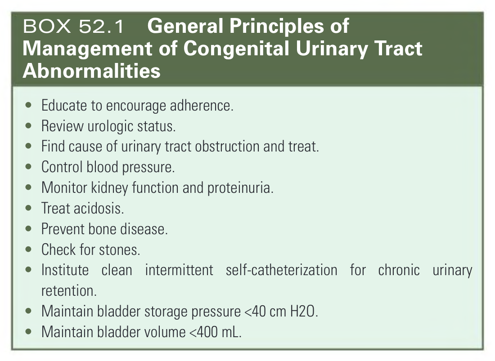

#### Box Text

```markdown
* Educate to encourage adherence.
* Review urologic status.
* Find cause of urinary tract obstruction and treat.
* Control blood pressure.
* Monitor kidney function and proteinuria.
* Treat acidosis.
* Prevent bone disease.
* Check for stones.
* Institute clean intermittent self-catheterization for chronic urinary retention.
* Maintain bladder storage pressure <40 cm H2O.
* Maintain bladder volume <400 mL.
```

BOX 52.1 General Principles of Management of Congenital Urinary Tract Abnormalities

---

### Box_52_2

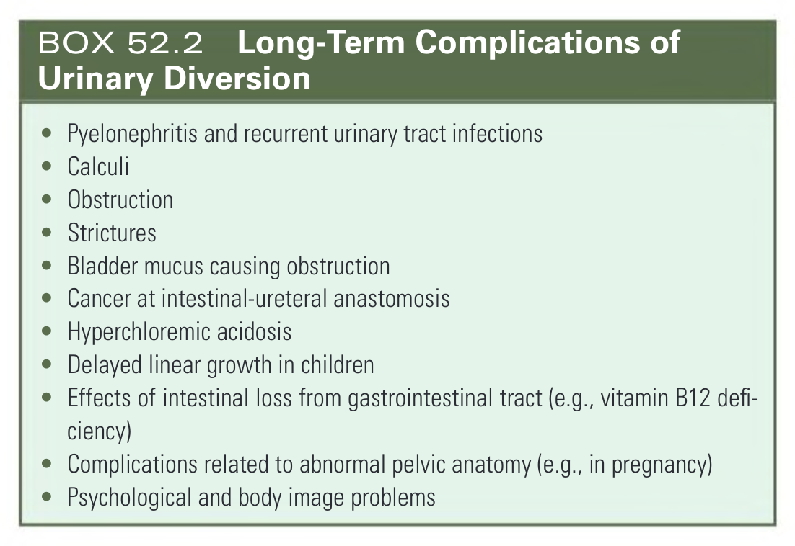

#### Box Text

```markdown
* Pyelonephritis and recurrent urinary tract infections
* Calculi
* Obstruction
* Strictures
* Bladder mucus causing obstruction
* Cancer at intestinal-ureteral anastomosis
* Hyperchloremic acidosis
* Delayed linear growth in children
* Effects of intestinal loss from gastrointestinal tract (e.g., vitamin B12 deficiency)
* Complications related to abnormal pelvic anatomy (e.g., in pregnancy)
* Psychological and body image problems
```

BOX 52.2 Long-Term Complications of Urinary Diversion

---
