# 053. Urinary Tract Infections in Adults - Figures and Tables Index

This document lists all figures, tables and boxes extracted from `053. Urinary Tract Infections in Adults.pdf`.

## Table of Contents
- [Figures](#figures)
- [Tables](#tables)
- [Boxes](#boxes)

---

## Figures

### Fig_53_1

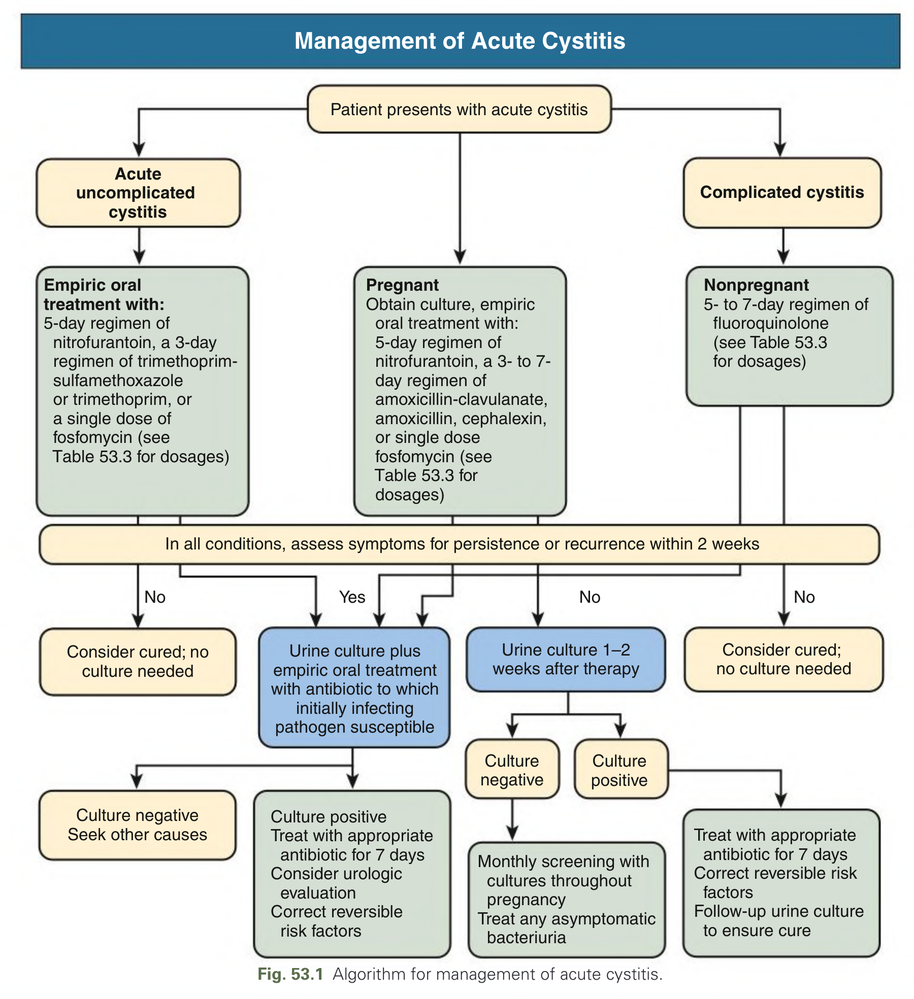

Fig. 53.1 Algorithm for management of acute cystitis.

---

### Fig_53_2

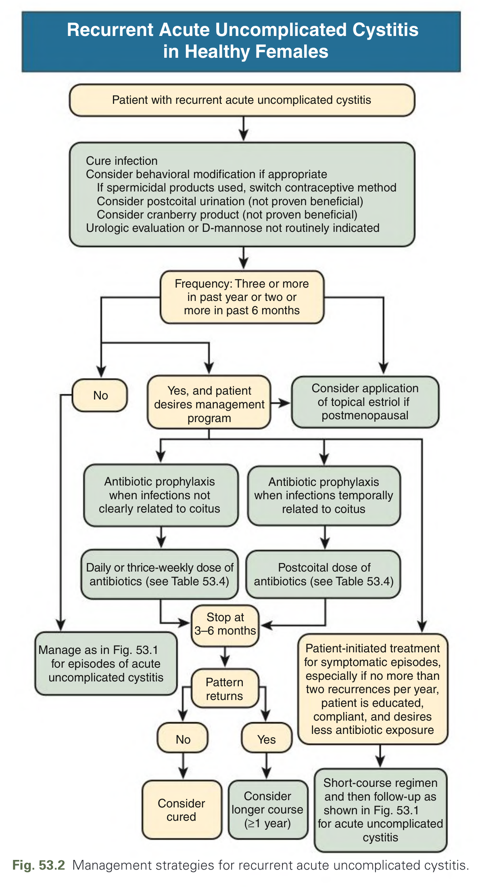

Fig. 53.2 Management strategies for recurrent acute uncomplicated cystitis.

---

### Fig_53_3

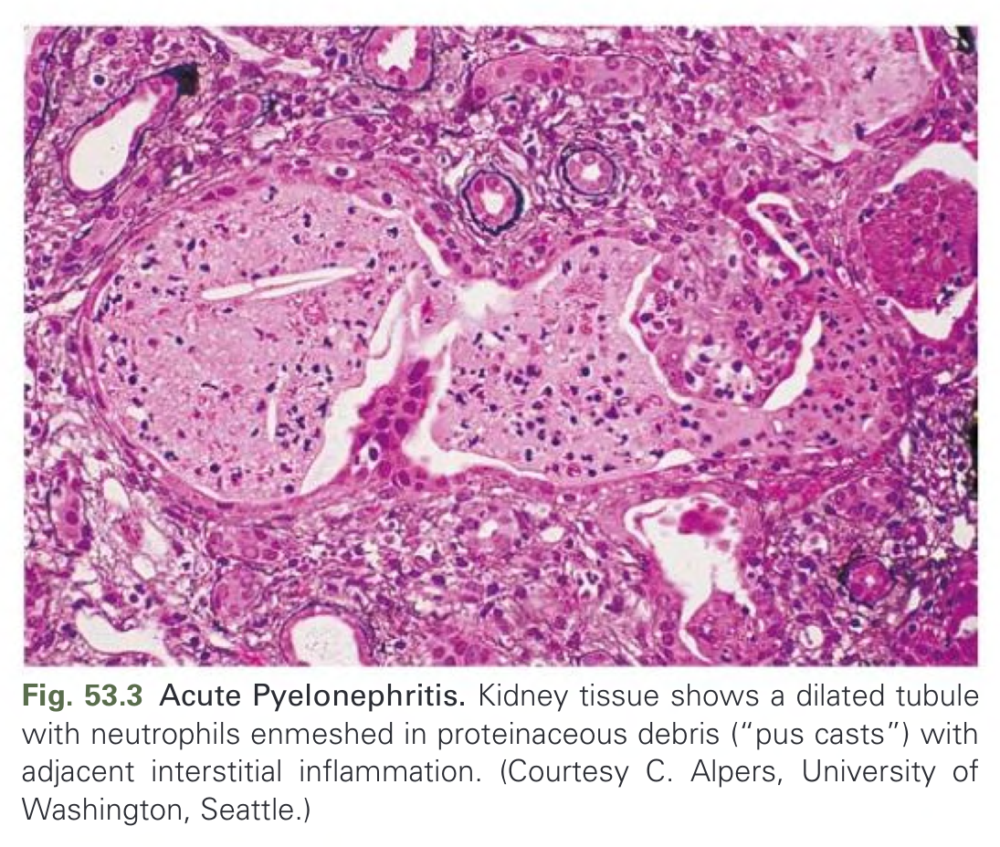

Fig. 53.3 Acute Pyelonephritis. Kidney tissue shows a dilated tubule with neutrophils enmeshed in proteinaceous debris (“pus casts”) with adjacent interstitial inflammation. (Courtesy C. Alpers, University of Washington, Seattle.)

---

### Fig_53_4

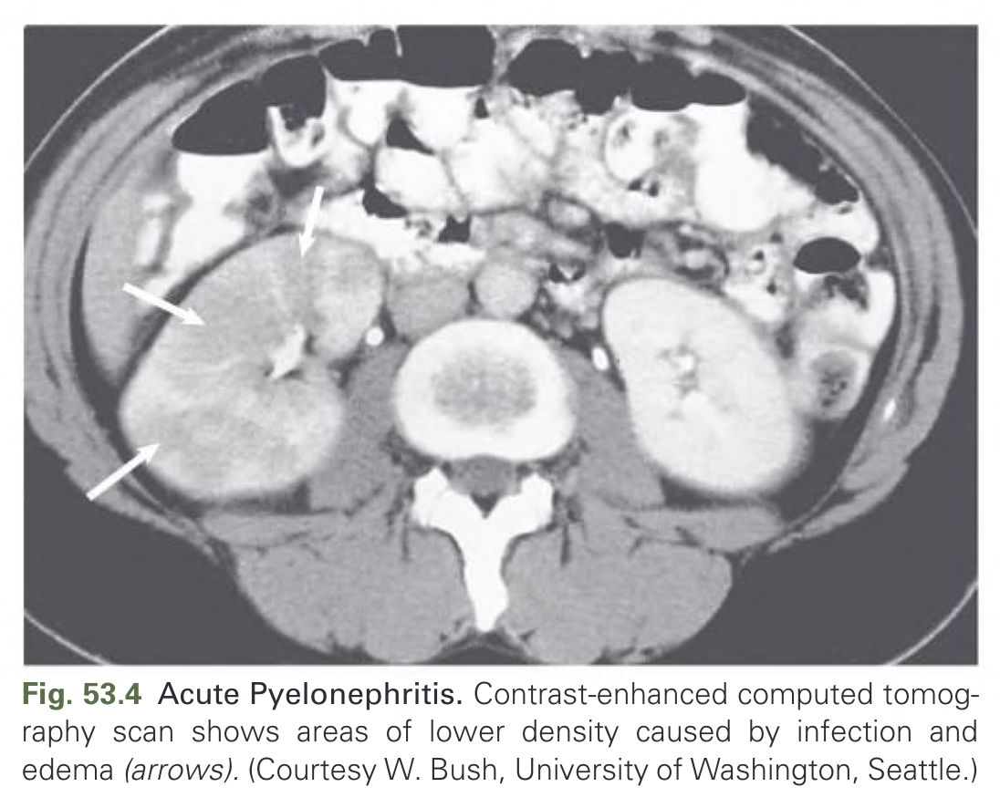

Fig. 53.4 Acute Pyelonephritis. Contrast-enhanced computed tomography scan shows areas of lower density caused by infection and edema (arrows). (Courtesy W. Bush, University of Washington, Seattle.)

---

### Fig_53_5

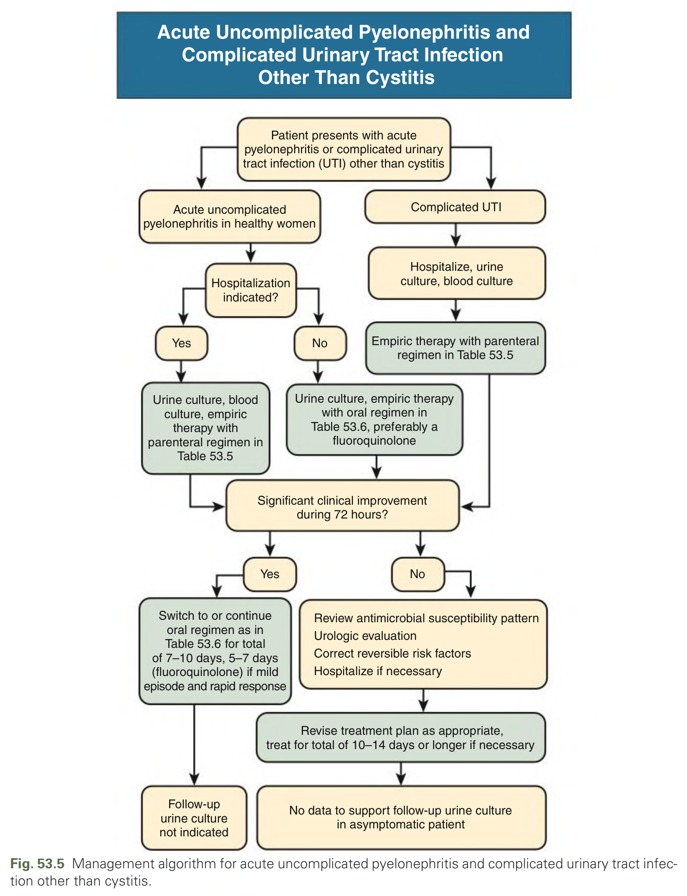

Fig. 53.5 Management algorithm for acute uncomplicated pyelonephritis and complicated urinary tract infection other than cystitis.

---

### Fig_53_6

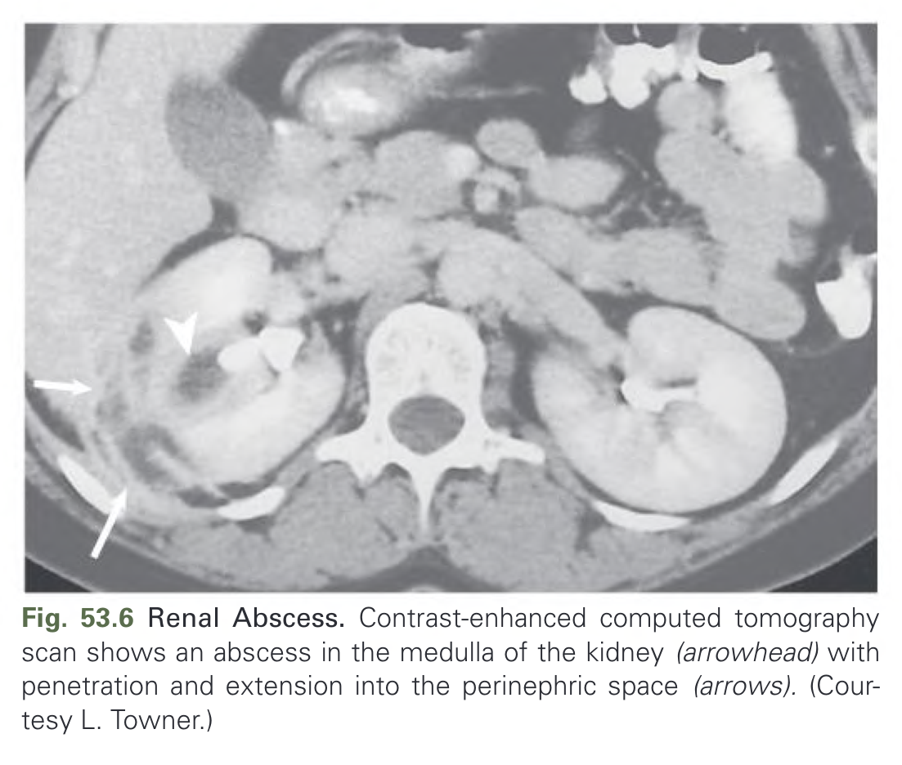

Fig. 53.6 Renal Abscess. Contrast-enhanced computed tomography scan shows an abscess in the medulla of the kidney (arrowhead) with penetration and extension into the perinephric space (arrows). (Courtesy L. Towner.)

---

### Fig_53_7

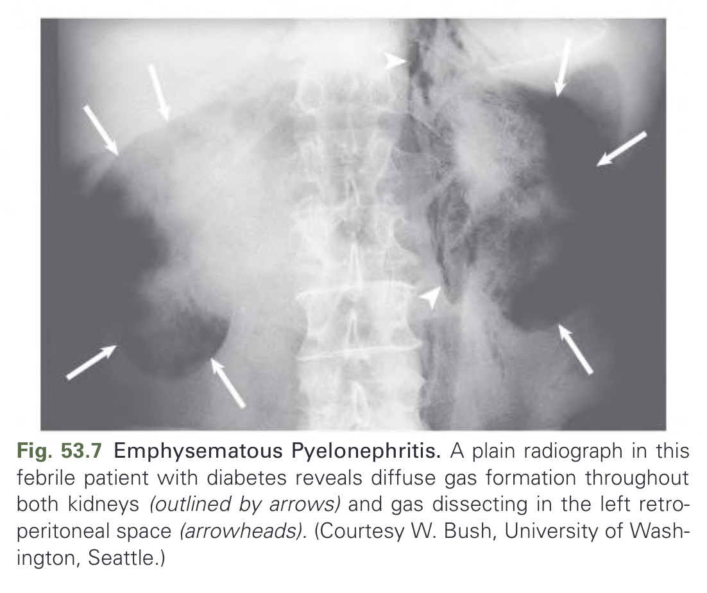

Fig. 53.7 Emphysematous Pyelonephritis. A plain radiograph in this febrile patient with diabetes reveals diffuse gas formation throughout both kidneys (outlined by arrows) and gas dissecting in the left retroperitoneal space (arrowheads). (Courtesy W. Bush, University of Washington, Seattle.)

---

### Fig_53_8

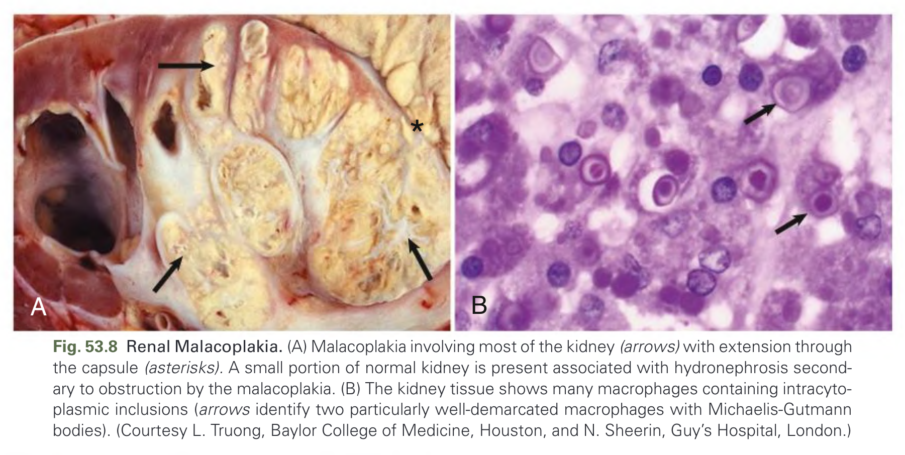

Fig. 53.8 Renal Malacoplakia. (A) Malacoplakia involving most of the kidney (arrows) with extension through the capsule (asterisks). A small portion of normal kidney is present associated with hydronephrosis secondary to obstruction by the malacoplakia. (B) The kidney tissue shows many macrophages containing intracytoplasmic inclusions (arrows identify two particularly well-demarcated macrophages with Michaelis-Gutmann bodies). (Courtesy L. Truong, Baylor College of Medicine, Houston, and N. Sheerin, Guy’s Hospital, London.)

---

### Fig_53_9

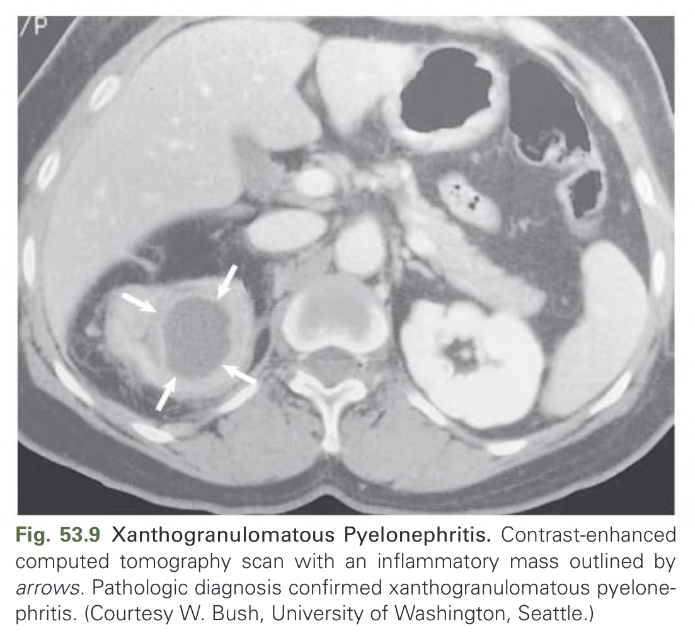

Fig. 53.9 Xanthogranulomatous Pyelonephritis. Contrast-enhanced computed tomography scan with an inflammatory mass outlined by arrows. Pathologic diagnosis confirmed xanthogranulomatous pyelonephritis. (Courtesy W. Bush, University of Washington, Seattle.)

---

## Tables

### Table_53_1

#### Table Image

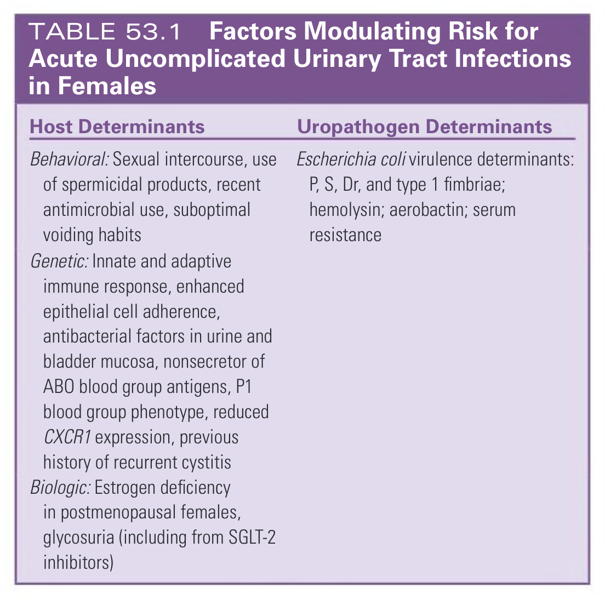

#### Table Data (CSV: [Table_53_1.csv](Table_53_1.csv))

```markdown
| Host Determinants | Uropathogen Determinants |
| :--- | :--- |
| **Behavioral:** Sexual intercourse, use of spermicidal products, recent antimicrobial use, suboptimal voiding habits | **Escherichia coli virulence determinants:** P, S, Dr, and type 1 fimbriae; hemolysin; aerobactin; serum resistance |
| **Genetic:** Innate and adaptive immune response, enhanced epithelial cell adherence, antibacterial factors in urine and bladder mucosa, nonsecretor of ABO blood group antigens, P1 blood group phenotype, reduced CXCR1 expression, previous history of recurrent cystitis | |
| **Biologic:** Estrogen deficiency in postmenopausal females, glycosuria (including from SGLT-2 inhibitors) | |
```

TABLE 53.1 Factors Modulating Risk for Acute Uncomplicated Urinary Tract Infections in Females

---

### Table_53_2

#### Table Image

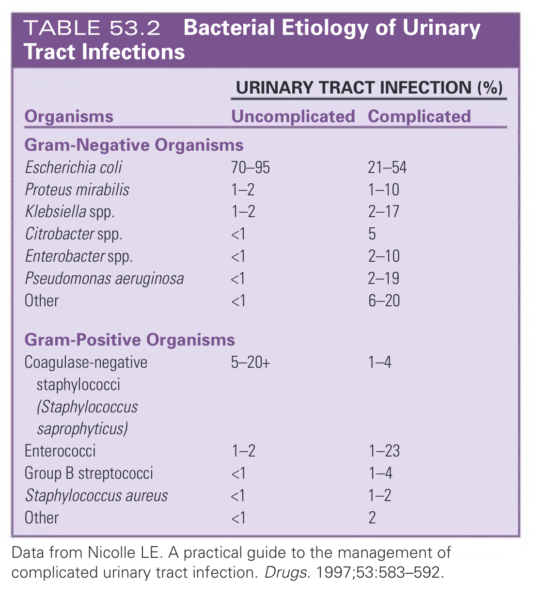

#### Table Data (CSV: [Table_53_2.csv](Table_53_2.csv))

```markdown
| Organisms | URINARY TRACT INFECTION (%) | |
| :--- | :--- | :--- |
| | **Uncomplicated** | **Complicated** |
| **Gram-Negative Organisms** | | |
| Escherichia coli | 70-95 | 21-54 |
| Proteus mirabilis | 1-2 | 1-10 |
| Klebsiella spp. | 1-2 | 2-17 |
| Citrobacter spp. | <1 | 5 |
| Enterobacter spp. | <1 | 2-10 |
| Pseudomonas aeruginosa | <1 | 2-19 |
| Other | <1 | 6-20 |
| **Gram-Positive Organisms** | | |
| Coagulase-negative staphylococci (Staphylococcus saprophyticus) | 5-20+ | 1-4 |
| Enterococci | 1-2 | 1-23 |
| Group B streptococci | <1 | 1-4 |
| Staphylococcus aureus | <1 | 1-2 |
| Other | <1 | 2 |
Data from Nicolle LE. A practical guide to the management of complicated urinary tract infection. Drugs. 1997;53:583-592.
```

TABLE 53.2 Bacterial Etiology of Urinary Tract Infections

---

### Table_53_3

#### Table Image

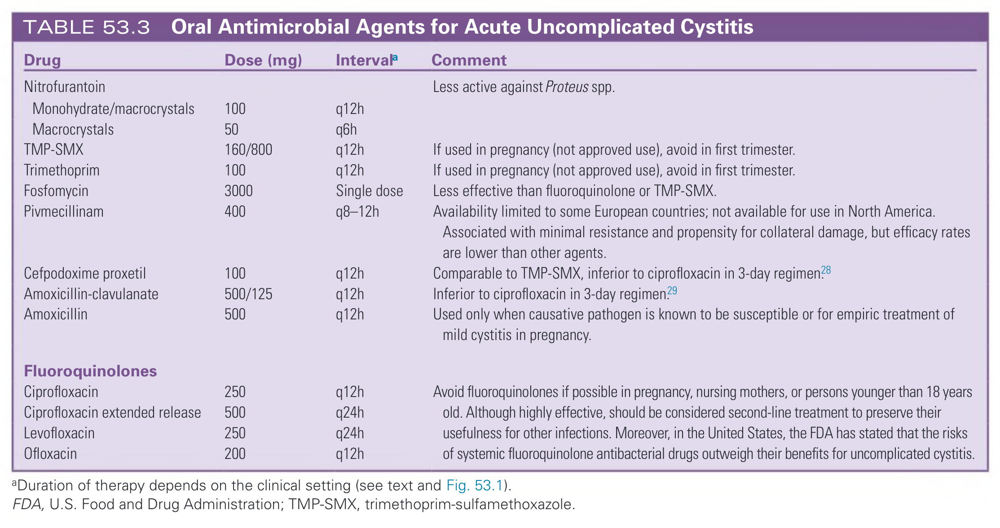

#### Table Data (CSV: [Table_53_3.csv](Table_53_3.csv))

```markdown
| Drug | Dose (mg) | Intervala | Comment |
| :--- | :--- | :--- | :--- |
| Nitrofurantoin | | | Less active against Proteus spp. |
| Monohydrate/macrocrystals | 100 | q12h | |
| Macrocrystals | 50 | q6h | |
| TMP-SMX | 160/800 | q12h | If used in pregnancy (not approved use), avoid in first trimester. |
| Trimethoprim | 100 | q12h | If used in pregnancy (not approved use), avoid in first trimester. |
| Fosfomycin | 3000 | Single dose | Less effective than fluoroquinolone or TMP-SMX. |
| Pivmecillinam | 400 | q8-12h | Availability limited to some European countries; not available for use in North America. Associated with minimal resistance and propensity for collateral damage, but efficacy rates are lower than other agents. |
| Cefpodoxime proxetil | 100 | q12h | Comparable to TMP-SMX, inferior to ciprofloxacin in 3-day regimen |
| Amoxicillin-clavulanate | 500/125 | q12h | Inferior to ciprofloxacin in 3-day regimen. |
| Amoxicillin | 500 | q12h | Used only when causative pathogen is known to be susceptible or for empiric treatment of mild cystitis in pregnancy. |
| **Fluoroquinolones** | | | |
| Ciprofloxacin | 250 | q12h | Avoid fluoroquinolones if possible in pregnancy, nursing mothers, or persons younger than 18 years old. Although highly effective, should be considered second-line treatment to preserve their usefulness for other infections. Moreover, in the United States, the FDA has stated that the risks of systemic fluoroquinolone antibacterial drugs outweigh their benefits for uncomplicated cystitis. |
| Ciprofloxacin extended release | 500 | q24h | |
| Levofloxacin | 250 | q24h | |
| Ofloxacin | 200 | q12h | |

aDuration of therapy depends on the clinical setting (see text and Fig. 53.1).
FDA, U.S. Food and Drug Administration; TMP-SMX, trimethoprim-sulfamethoxazole.
```

TABLE 53.3 Oral Antimicrobial Agents for Acute Uncomplicated Cystitis

---

### Table_53_4

#### Table Image

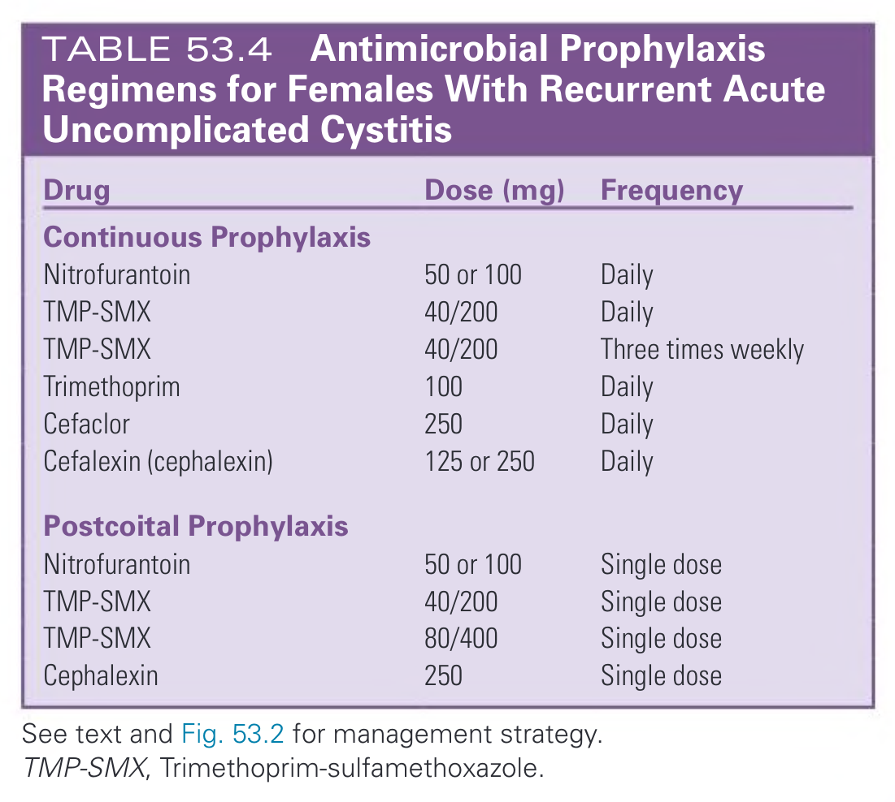

#### Table Data (CSV: [Table_53_4.csv](Table_53_4.csv))

```markdown
| Drug | Dose (mg) | Frequency |
| :--- | :--- | :--- |
| **Continuous Prophylaxis** | | |
| Nitrofurantoin | 50 or 100 | Daily |
| TMP-SMX | 40/200 | Daily |
| TMP-SMX | 40/200 | Three times weekly |
| Trimethoprim | 100 | Daily |
| Cefaclor | 250 | Daily |
| Cefalexin (cephalexin) | 125 or 250 | Daily |
| **Postcoital Prophylaxis** | | |
| Nitrofurantoin | 50 or 100 | Single dose |
| TMP-SMX | 40/200 | Single dose |
| TMP-SMX | 80/400 | Single dose |
| Cephalexin | 250 | Single dose |
See text and Fig. 53.2 for management strategy.
TMP-SMX, Trimethoprim-sulfamethoxazole.
```

TABLE 53.4 Antimicrobial Prophylaxis Regimens for Females With Recurrent Acute Uncomplicated Cystitis

---

### Table_53_5

#### Table Image

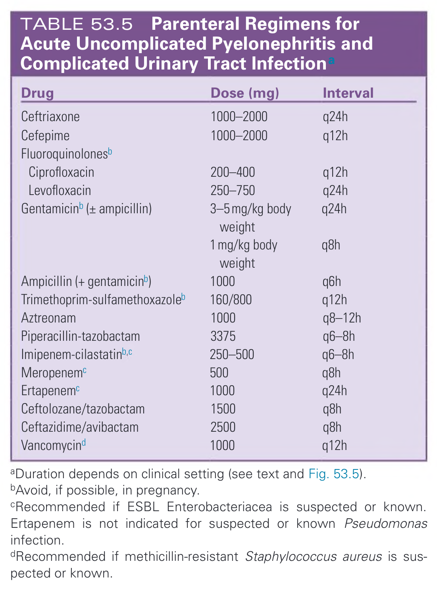

#### Table Data (CSV: [Table_53_5.csv](Table_53_5.csv))

```markdown
| Drug | Dose (mg) | Interval |
| :--- | :--- | :--- |
| Ceftriaxone | 1000-2000 | q24h |
| Cefepime | 1000-2000 | q12h |
| Fluoroquinolonesᵇ | | |
| Ciprofloxacin | 200-400 | q12h |
| Levofloxacin | 250-750 | q24h |
| Gentamicinᵇ (± ampicillin) | 3-5 mg/kg body weight | q24h |
| | 1 mg/kg body weight | q8h |
| Ampicillin (+ gentamicinᵇ) | 1000 | q6h |
| Trimethoprim-sulfamethoxazoleᵇ | 160/800 | q12h |
| Aztreonam | 1000 | q8-12h |
| Piperacillin-tazobactam | 3375 | q6-8h |
| Imipenem-cilastatinᵇ,ᶜ | 250-500 | q6-8h |
| Meropenemᶜ | 500 | q8h |
| Ertapenemᶜ | 1000 | q24h |
| Ceftolozane/tazobactam | 1500 | q8h |
| Ceftazidime/avibactam | 2500 | q8h |
| Vancomycinᵈ | 1000 | q12h |

ᵃDuration depends on clinical setting (see text and Fig. 53.5).
ᵇAvoid, if possible, in pregnancy.
ᶜRecommended if ESBL Enterobacteriacea is suspected or known. Ertapenem is not indicated for suspected or known Pseudomonas infection.
ᵈRecommended if methicillin-resistant Staphylococcus aureus is suspected or known.
```

TABLE 53.5 Parenteral Regimens for Acute Uncomplicated Pyelonephritis and Complicated Urinary Tract Infectiona

---

### Table_53_6

#### Table Image

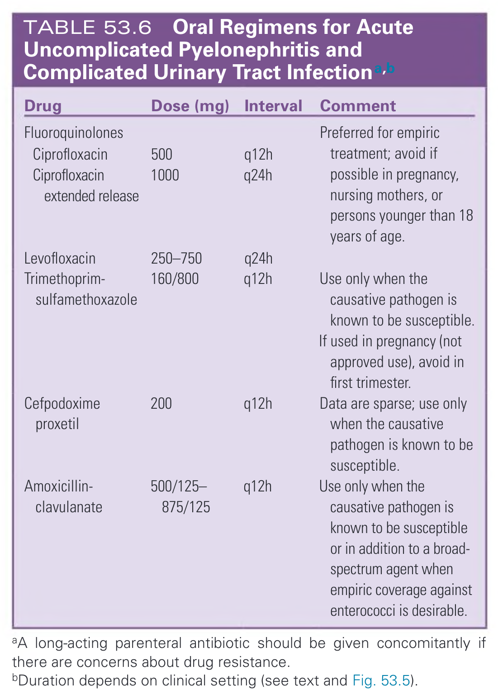

#### Table Data (CSV: [Table_53_6.csv](Table_53_6.csv))

```markdown
| Drug | Dose (mg) | Interval | Comment |
| :--- | :--- | :--- | :--- |
| Fluoroquinolones | | | Preferred for empiric treatment; avoid if possible in pregnancy, nursing mothers, or persons younger than 18 years of age. |
| Ciprofloxacin | 500 | q12h | |
| Ciprofloxacin extended release | 1000 | q24h | |
| Levofloxacin | 250-750 | q24h | |
| Trimethoprim-sulfamethoxazole | 160/800 | q12h | Use only when the causative pathogen is known to be susceptible. If used in pregnancy (not approved use), avoid in first trimester. |
| Cefpodoxime proxetil | 200 | q12h | Data are sparse; use only when the causative pathogen is known to be susceptible. |
| Amoxicillin-clavulanate | 500/125-875/125 | q12h | Use only when the causative pathogen is known to be susceptible or in addition to a broad-spectrum agent when empiric coverage against enterococci is desirable. |
aA long-acting parenteral antibiotic should be given concomitantly if there are concerns about drug resistance.
bDuration depends on clinical setting (see text and Fig. 53.5).
```

TABLE 53.6 Oral Regimens for Acute Uncomplicated Pyelonephritis and Complicated Urinary Tract Infectiona,b

---

## Boxes

### Box_53_1

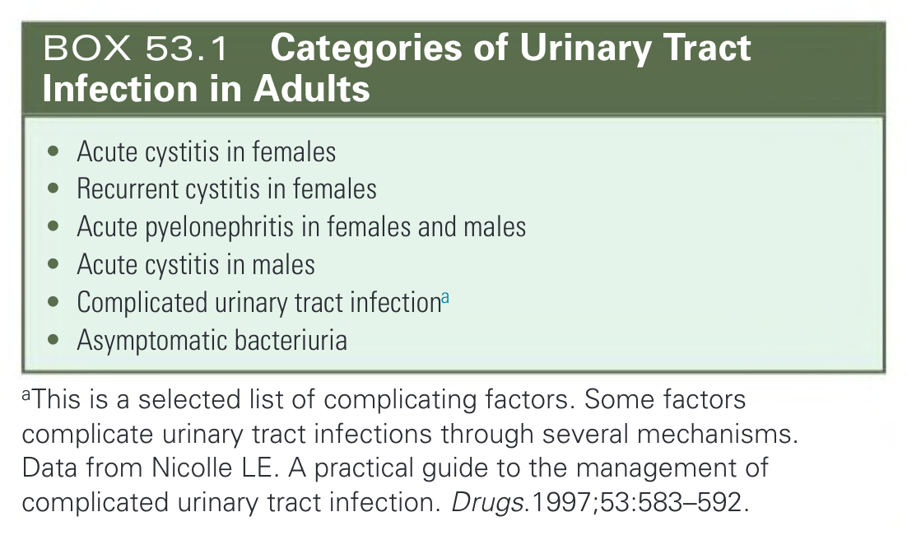

#### Box Text

```markdown
*   Acute cystitis in females
*   Recurrent cystitis in females
*   Acute pyelonephritis in females and males
*   Acute cystitis in males
*   Complicated urinary tract infectiona
*   Asymptomatic bacteriuria

aThis is a selected list of complicating factors. Some factors complicate urinary tract infections through several mechanisms. Data from Nicolle LE. A practical guide to the management of complicated urinary tract infection. Drugs.1997;53:583-592.
```

BOX 53.1 Categories of Urinary Tract Infection in Adults

---

### Box_53_2

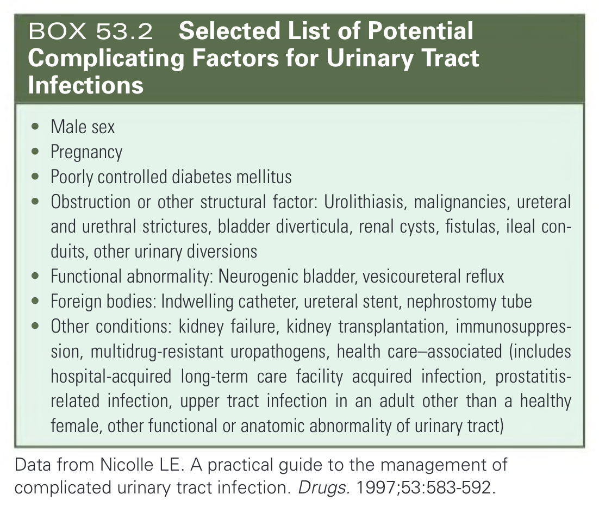

#### Box Text

```markdown
*   Male sex
*   Pregnancy
*   Poorly controlled diabetes mellitus
*   Obstruction or other structural factor: Urolithiasis, malignancies, ureteral and urethral strictures, bladder diverticula, renal cysts, fistulas, ileal conduits, other urinary diversions
*   Functional abnormality: Neurogenic bladder, vesicoureteral reflux
*   Foreign bodies: Indwelling catheter, ureteral stent, nephrostomy tube
*   Other conditions: kidney failure, kidney transplantation, immunosuppression, multidrug-resistant uropathogens, health care-associated (includes hospital-acquired long-term care facility acquired infection, prostatitis-related infection, upper tract infection in an adult other than a healthy female, other functional or anatomic abnormality of urinary tract)

Data from Nicolle LE. A practical guide to the management of complicated urinary tract infection. Drugs. 1997;53:583-592.
```

BOX 53.2 Selected List of Potential Complicating Factors for Urinary Tract Infections

---
