# 054. Tuberculosis of the Urinary Tract - Figures and Tables Index

This document lists all figures, tables and boxes extracted from `054. Tuberculosis of the Urinary Tract.pdf`.

## Table of Contents
- [Figures](#figures)
- [Tables](#tables)
- [Boxes](#boxes)

---

## Figures

### Fig_54_1

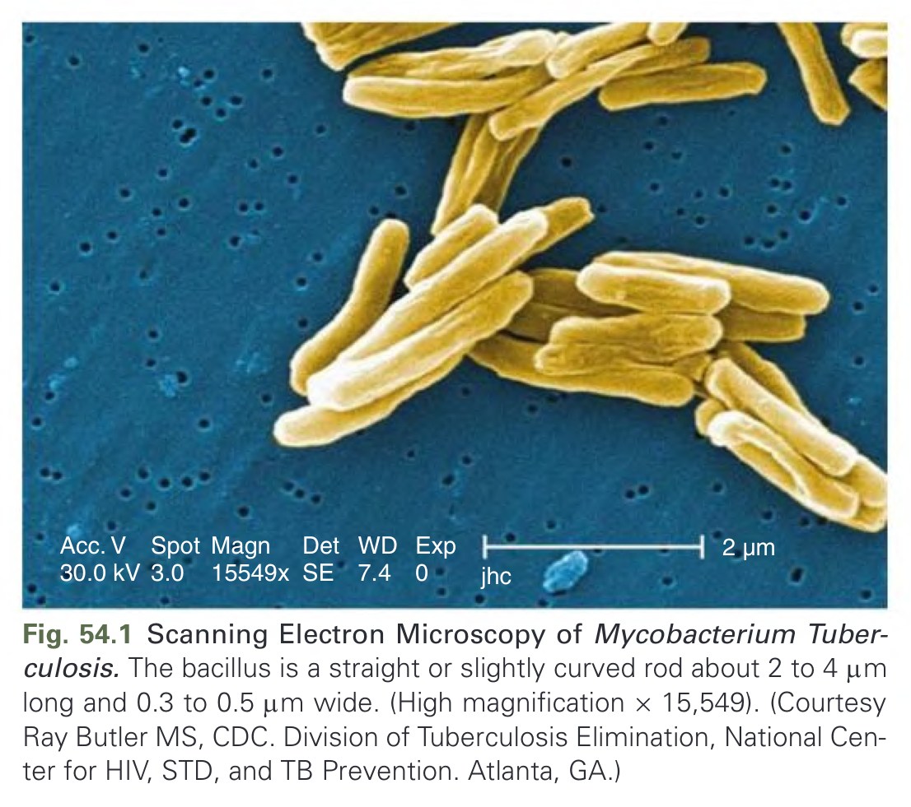

Fig. 54.1 Scanning Electron Microscopy of Mycobacterium Tuberculosis. The bacillus is a straight or slightly curved rod about 2 to 4 µm long and 0.3 to 0.5 µm wide. (High magnification × 15,549). (Courtesy Ray Butler MS, CDC. Division of Tuberculosis Elimination, National Center for HIV, STD, and TB Prevention. Atlanta, GA.)

---

### Fig_54_2

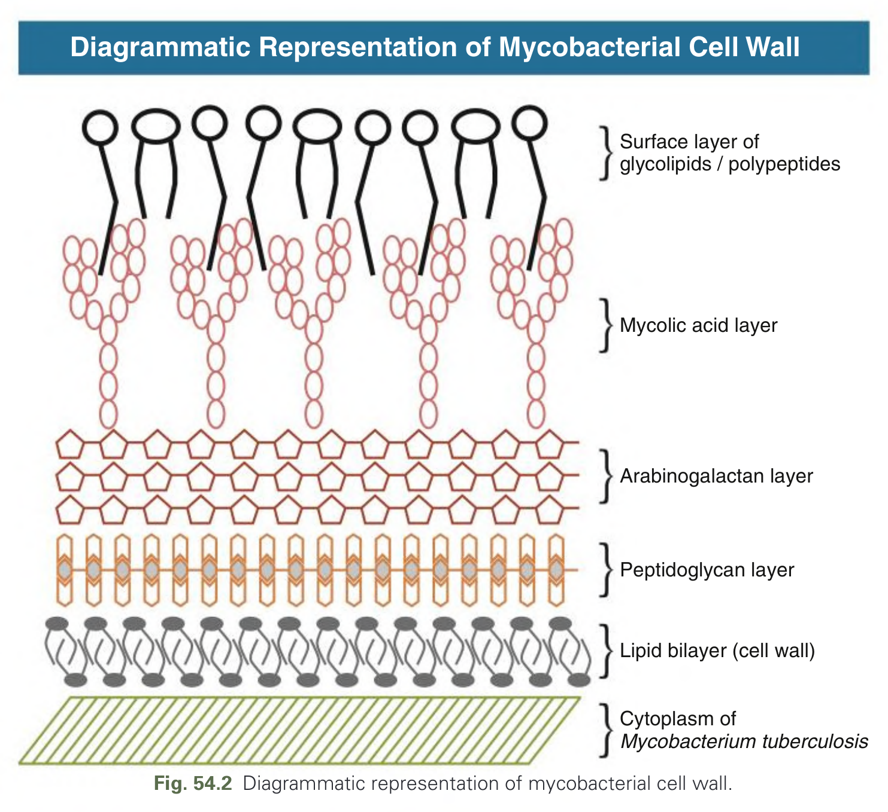

Fig. 54.2 Diagrammatic representation of mycobacterial cell wall.

---

### Fig_54_3

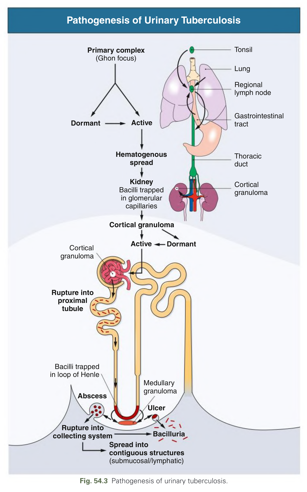

Fig. 54.3 Pathogenesis of urinary tuberculosis.

---

### Fig_54_4

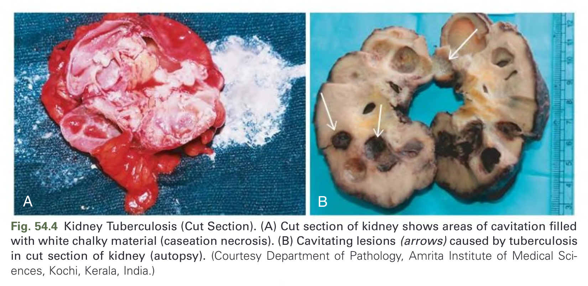

Fig. 54.4 Kidney Tuberculosis (Cut Section). (A) Cut section of kidney shows areas of cavitation filled with white chalky material (caseation necrosis). (B) Cavitating lesions (arrows) caused by tuberculosis in cut section of kidney (autopsy). (Courtesy Department of Pathology, Amrita Institute of Medical Sciences, Kochi, Kerala, India.)

---

### Fig_54_5

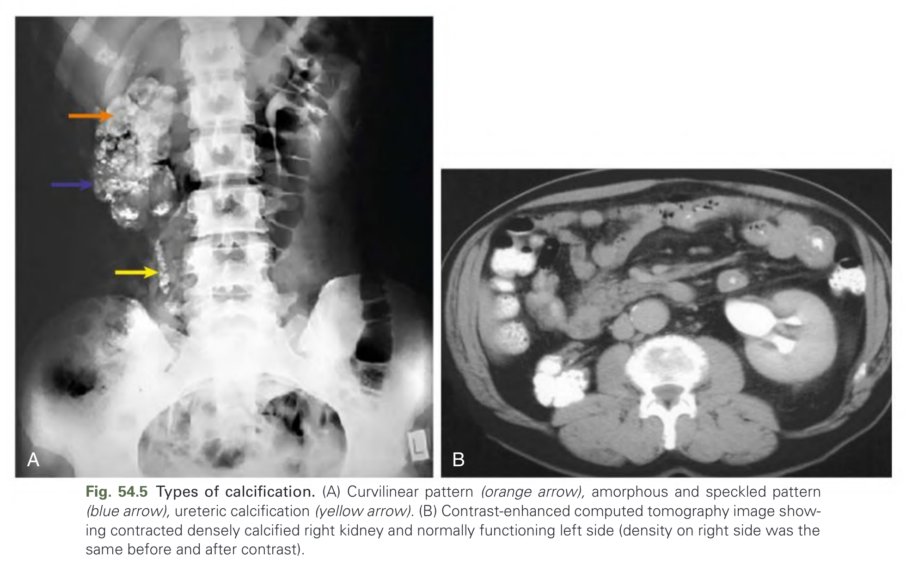

Fig. 54.5 Types of calcification. (A) Curvilinear pattern (orange arrow), amorphous and speckled pattern (blue arrow), ureteric calcification (yellow arrow). (B) Contrast-enhanced computed tomography image showing contracted densely calcified right kidney and normally functioning left side (density on right side was the same before and after contrast).

---

### Fig_54_6

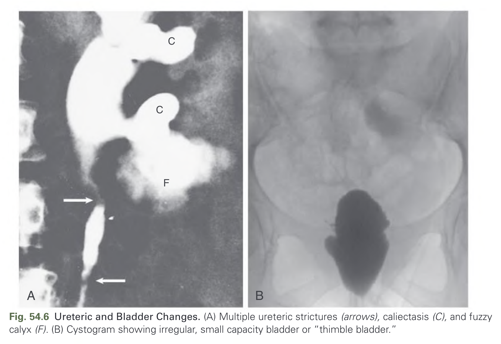

Fig. 54.6 Ureteric and Bladder Changes. (A) Multiple ureteric strictures (arrows), caliectasis (C), and fuzzy calyx (F). (B) Cystogram showing irregular, small capacity bladder or “thimble bladder.”

---

### Fig_54_7

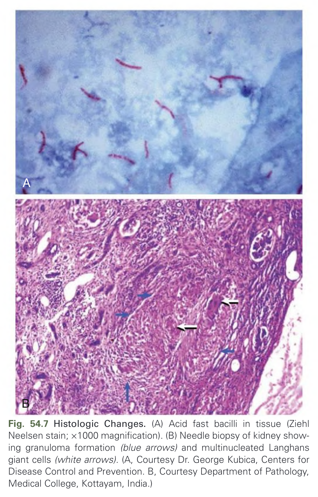

Fig. 54.7 Histologic Changes. (A) Acid fast bacilli in tissue (Ziehl Neelsen stain; ×1000 magnification). (B) Needle biopsy of kidney showing granuloma formation (blue arrows) and multinucleated Langhans giant cells (white arrows). (A, Courtesy Dr. George Kubica, Centers for Disease Control and Prevention. B, Courtesy Department of Pathology, Medical College, Kottayam, India.)

---

### Fig_54_8

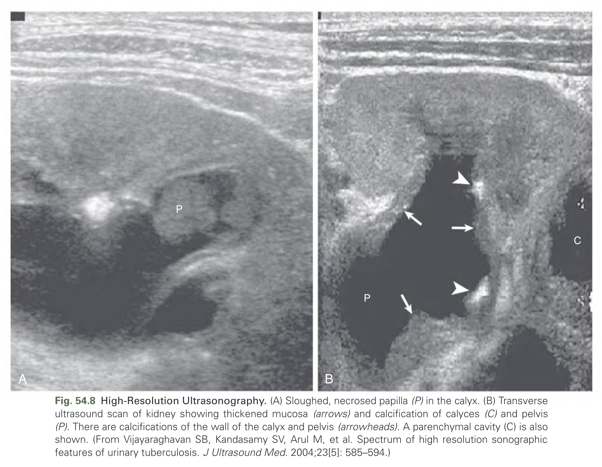

Fig. 54.8 High-Resolution Ultrasonography. (A) Sloughed, necrosed papilla (P) in the calyx. (B) Transverse ultrasound scan of kidney showing thickened mucosa (arrows) and calcification of calyces (C) and pelvis (P). There are calcifications of the wall of the calyx and pelvis (arrowheads). A parenchymal cavity (C) is also shown. (From Vijayaraghavan SB, Kandasamy SV, Arul M, et al. Spectrum of high resolution sonographic features of urinary tuberculosis. J Ultrasound Med. 2004;23[5]: 585–594.)

---

## Tables

### Table_54_1

#### Table Image

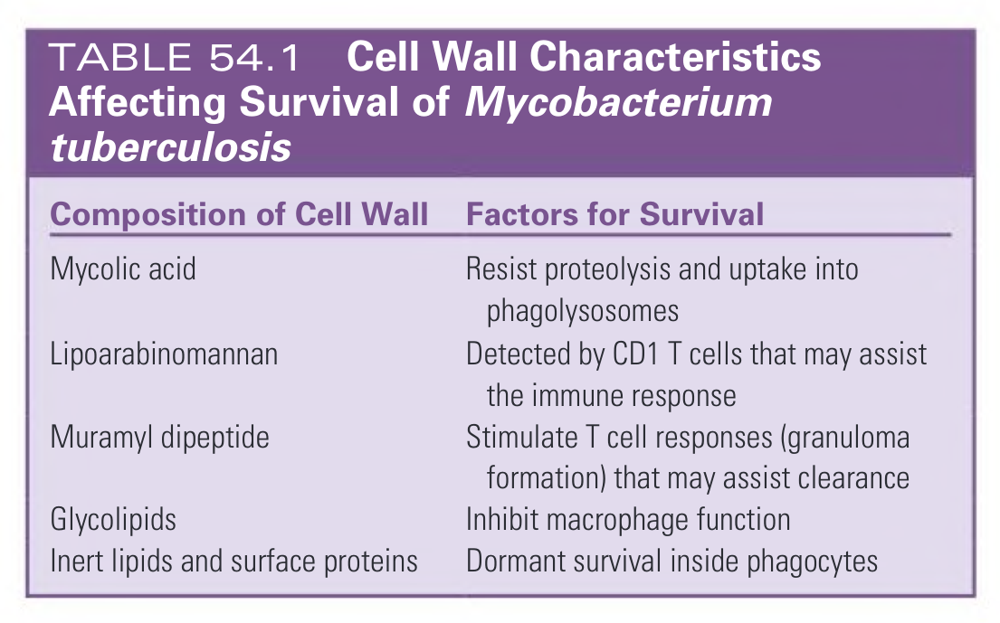

#### Table Data (CSV: [Table_54_1.csv](Table_54_1.csv))

```markdown
| Composition of Cell Wall | Factors for Survival |
| :--- | :--- |
| Mycolic acid | Resist proteolysis and uptake into phagolysosomes |
| Lipoarabinomannan | Detected by CD1 T cells that may assist the immune response |
| Muramyl dipeptide | Stimulate T cell responses (granuloma formation) that may assist clearance |
| Glycolipids | Inhibit macrophage function |
| Inert lipids and surface proteins | Dormant survival inside phagocytes |
```

TABLE 54.1 Cell Wall Characteristics Affecting Survival of Mycobacterium tuberculosis

---

### Table_54_2

#### Table Image

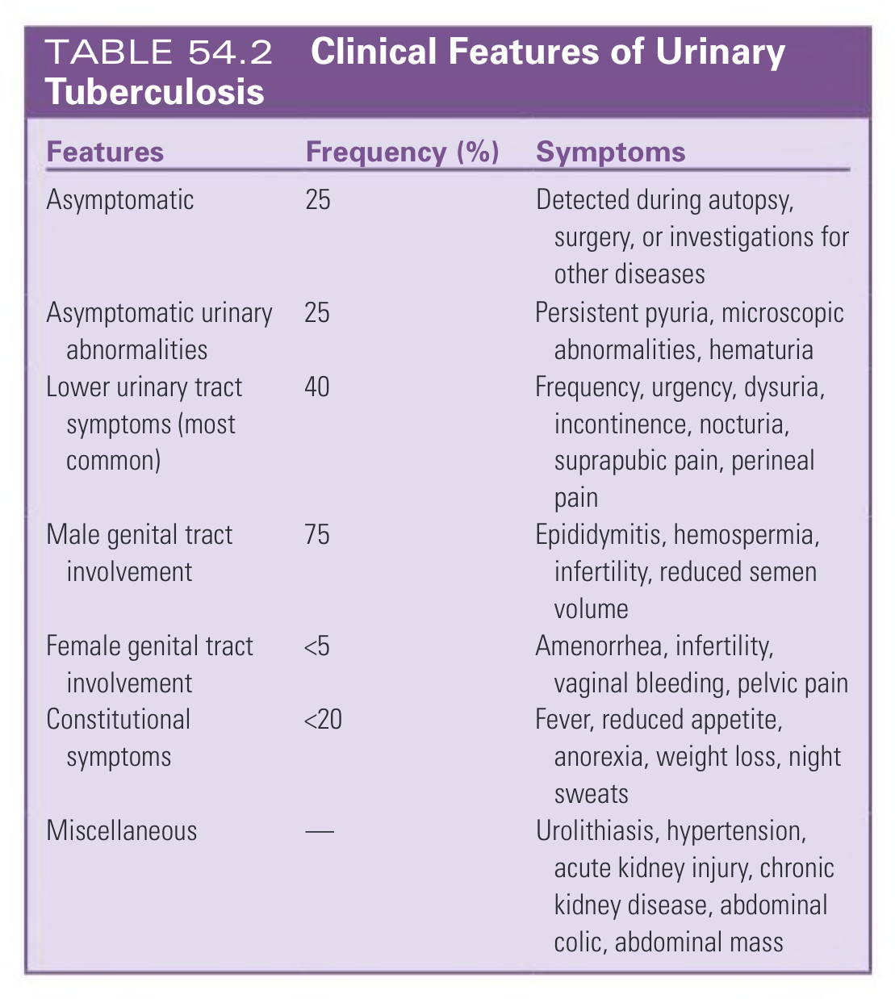

#### Table Data (CSV: [Table_54_2.csv](Table_54_2.csv))

```markdown
| Features | Frequency (%) | Symptoms |
| :--- | :--- | :--- |
| Asymptomatic | 25 | Detected during autopsy, surgery, or investigations for other diseases |
| Asymptomatic urinary abnormalities | 25 | Persistent pyuria, microscopic abnormalities, hematuria |
| Lower urinary tract symptoms (most common) | 40 | Frequency, urgency, dysuria, incontinence, nocturia, suprapubic pain, perineal pain |
| Male genital tract involvement | 75 | Epididymitis, hemospermia, infertility, reduced semen volume |
| Female genital tract involvement | <5 | Amenorrhea, infertility, vaginal bleeding, pelvic pain |
| Constitutional symptoms | <20 | Fever, reduced appetite, anorexia, weight loss, night sweats |
| Miscellaneous | — | Urolithiasis, hypertension, acute kidney injury, chronic kidney disease, abdominal colic, abdominal mass |
```

TABLE 54.2 Clinical Features of Urinary Tuberculosis

---

### Table_54_3

#### Table Image

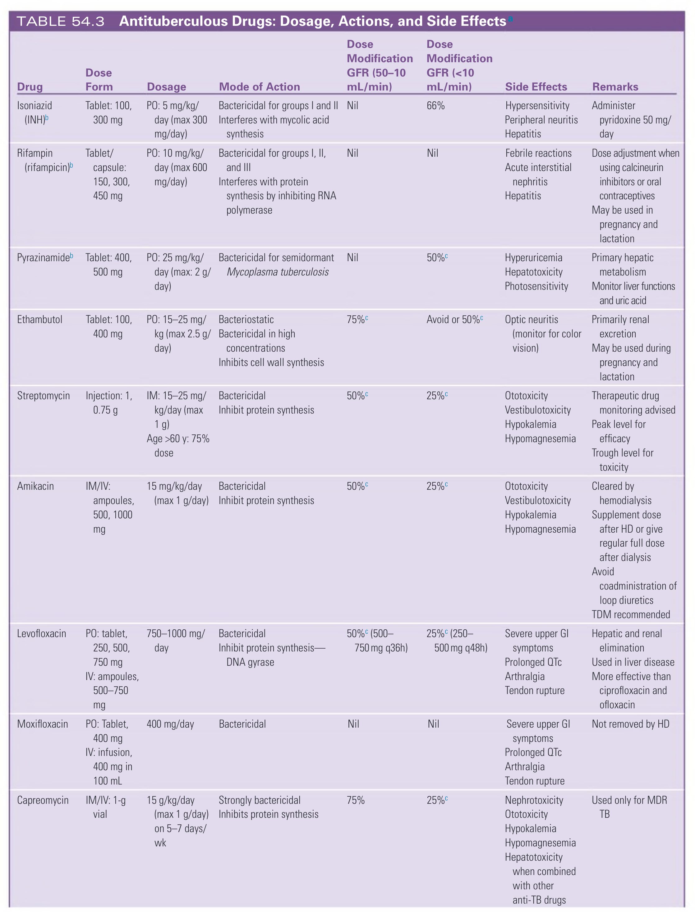

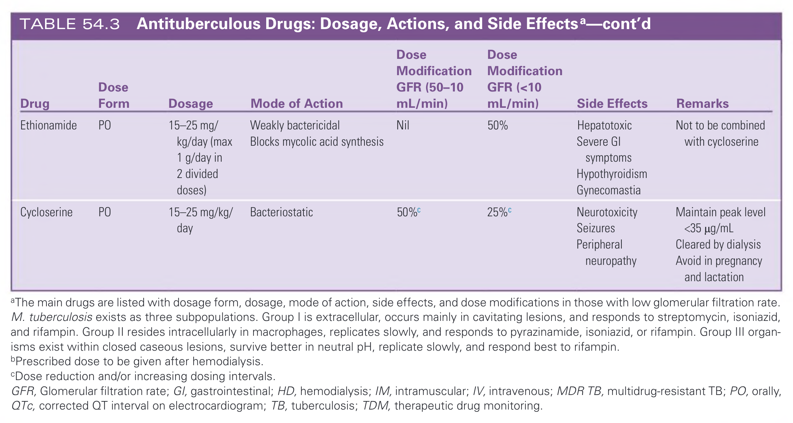

#### Table Data (CSV: [Table_54_3.csv](Table_54_3.csv))

```markdown
| Drug | Dose Form | Dosage | Mode of Action | Dose Modification GFR (50-10 mL/min) | Dose Modification GFR (<10 mL/min) | Side Effects | Remarks |
| :--- | :--- | :--- | :--- | :--- | :--- | :--- | :--- |
| Isoniazid (INH)b | Tablet: 100, 300 mg | PO: 5 mg/kg/day (max 300 mg/day) | Bactericidal for groups I and II. Interferes with mycolic acid synthesis | Nil | 66% | Hypersensitivity, Peripheral neuritis, Hepatitis | Administer pyridoxine 50 mg/day |
| Rifampin (rifampicin)b | Tablet/capsule: 150, 300, 450 mg | PO: 10 mg/kg/day (max 600 mg/day) | Bactericidal for groups I, II, and III. Interferes with protein synthesis by inhibiting RNA polymerase | Nil | Nil | Febrile reactions, Acute interstitial nephritis, Hepatitis | Dose adjustment when using calcineurin inhibitors or oral contraceptives. May be used in pregnancy and lactation |
| Pyrazinamideb | Tablet: 400, 500 mg | PO: 25 mg/kg/day (max: 2 g/day) | Bactericidal for semidormant Mycoplasma tuberculosis | Nil | 50%c | Hyperuricemia, Hepatotoxicity, Photosensitivity | Primary hepatic metabolism. Monitor liver functions and uric acid |
| Ethambutol | Tablet: 100, 400 mg | PO: 15-25 mg/kg (max 2.5 g/day) | Bacteriostatic. Bactericidal in high concentrations. Inhibits cell wall synthesis | 75%c | Avoid or 50%c | Optic neuritis (monitor for color vision) | Primarily renal excretion. May be used during pregnancy and lactation |
| Streptomycin | Injection: 1, 0.75 g | IM: 15-25 mg/kg/day (max 1 g). Age >60 y: 75% dose | Bactericidal. Inhibit protein synthesis | 50%c | 25%c | Ototoxicity, Vestibulotoxicity, Hypokalemia, Hypomagnesemia | Therapeutic drug monitoring advised. Peak level for efficacy. Trough level for toxicity |
| Amikacin | IM/IV: ampoules, 500, 1000 mg | 15 mg/kg/day (max 1 g/day) | Bactericidal. Inhibit protein synthesis | 50%c | 25%c | Ototoxicity, Vestibulotoxicity, Hypokalemia, Hypomagnesemia | Cleared by hemodialysis. Supplement dose after HD or give regular full dose after dialysis. Avoid coadministration of loop diuretics. TDM recommended |
| Levofloxacin | PO: tablet, 250, 500, 750 mg. IV: ampoules, 500-750 mg | 750-1000 mg/day | Bactericidal. Inhibit protein synthesis—DNA gyrase | 50%c (500-750 mg q36h) | 25%c (250-500 mg q48h) | Severe upper GI symptoms, Prolonged QTc, Arthralgia, Tendon rupture | Hepatic and renal elimination. Used in liver disease. More effective than ciprofloxacin and ofloxacin |
| Moxifloxacin | PO: Tablet, 400 mg. IV: infusion, 400 mg in 100 mL | 400 mg/day | Bactericidal | Nil | Nil | Severe upper GI symptoms, Prolonged QTc, Arthralgia, Tendon rupture | Not removed by HD |
| Capreomycin | IM/IV: 1-g vial | 15 g/kg/day (max 1 g/day) on 5-7 days/wk | Strongly bactericidal. Inhibits protein synthesis | 75% | 25%c | Nephrotoxicity, Ototoxicity, Hypokalemia, Hypomagnesemia, Hepatotoxicity when combined with other anti-TB drugs | Used only for MDR TB |
| Ethionamide | PO | 15-25 mg/kg/day (max 1 g/day in 2 divided doses) | Weakly bactericidal. Blocks mycolic acid synthesis | Nil | 50% | Hepatotoxic, Severe GI symptoms, Hypothyroidism, Gynecomastia | Not to be combined with cycloserine |
| Cycloserine | PO | 15-25 mg/kg/day | Bacteriostatic | 50%c | 25%c | Neurotoxicity, Seizures, Peripheral neuropathy | Maintain peak level <35 µg/mL. Cleared by dialysis. Avoid in pregnancy and lactation |
*aThe main drugs are listed with dosage form, dosage, mode of action, side effects, and dose modifications in those with low glomerular filtration rate. M. tuberculosis exists as three subpopulations. Group I is extracellular, occurs mainly in cavitating lesions, and responds to streptomycin, isoniazid, and rifampin. Group II resides intracellularly in macrophages, replicates slowly, and responds to pyrazinamide, isoniazid, or rifampin. Group III organisms exist within closed caseous lesions, survive better in neutral pH, replicate slowly, and respond best to rifampin.*
*bPrescribed dose to be given after hemodialysis.*
*cDose reduction and/or increasing dosing intervals.*
*GFR, Glomerular filtration rate; GI, gastrointestinal; HD, hemodialysis; IM, intramuscular; IV, intravenous; MDR TB, multidrug-resistant TB; PO, orally, QTc, corrected QT interval on electrocardiogram; TB, tuberculosis; TDM, therapeutic drug monitoring.*
```

TABLE 54.3 Antituberculous Drugs: Dosage, Actions, and Side Effects^a

---

### Table_54_4

#### Table Image

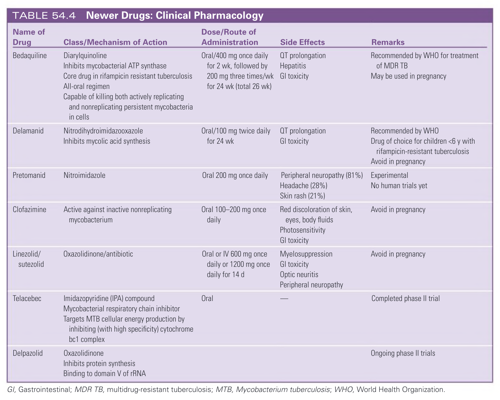

#### Table Data (CSV: [Table_54_4.csv](Table_54_4.csv))

```markdown
| Name of Drug | Class/Mechanism of Action | Dose/Route of Administration | Side Effects | Remarks |
| :--- | :--- | :--- | :--- | :--- |
| Bedaquiline | Diarylquinoline. Inhibits mycobacterial ATP synthase. Core drug in rifampicin resistant tuberculosis. All-oral regimen. Capable of killing both actively replicating and nonreplicating persistent mycobacteria in cells | Oral/400 mg once daily for 2 wk, followed by 200 mg three times/wk for 24 wk (total 26 wk) | QT prolongation, Hepatitis, GI toxicity | Recommended by WHO for treatment of MDR TB. May be used in pregnancy |
| Delamanid | Nitrodihydroimidazooxazole. Inhibits mycolic acid synthesis | Oral/100 mg twice daily for 24 wk | QT prolongation, GI toxicity | Recommended by WHO. Drug of choice for children <6 y with rifampicin-resistant tuberculosis. Avoid in pregnancy |
| Pretomanid | Nitroimidazole | Oral 200 mg once daily | Peripheral neuropathy (81%), Headache (28%), Skin rash (21%) | Experimental. No human trials yet |
| Clofazimine | Active against inactive nonreplicating mycobacterium | Oral 100-200 mg once daily | Red discoloration of skin, eyes, body fluids, Photosensitivity, GI toxicity | Avoid in pregnancy |
| Linezolid/sutezolid | Oxazolidinone/antibiotic | Oral or IV 600 mg once daily or 1200 mg once daily for 14 d | Myelosuppression, GI toxicity, Optic neuritis, Peripheral neuropathy | Avoid in pregnancy |
| Telacebec | Imidazopyridine (IPA) compound. Mycobacterial respiratory chain inhibitor. Targets MTB cellular energy production by inhibiting (with high specificity) cytochrome bc1 complex | Oral | | Completed phase II trial |
| Delpazolid | Oxazolidinone. Inhibits protein synthesis. Binding to domain V of rRNA | | | Ongoing phase II trials |
*GI, Gastrointestinal; MDR TB, multidrug-resistant tuberculosis; MTB, Mycobacterium tuberculosis; WHO, World Health Organization.*
```

TABLE 54.4 Newer Drugs: Clinical Pharmacology

---

## Boxes

*No boxes resolved for this chapter.*
