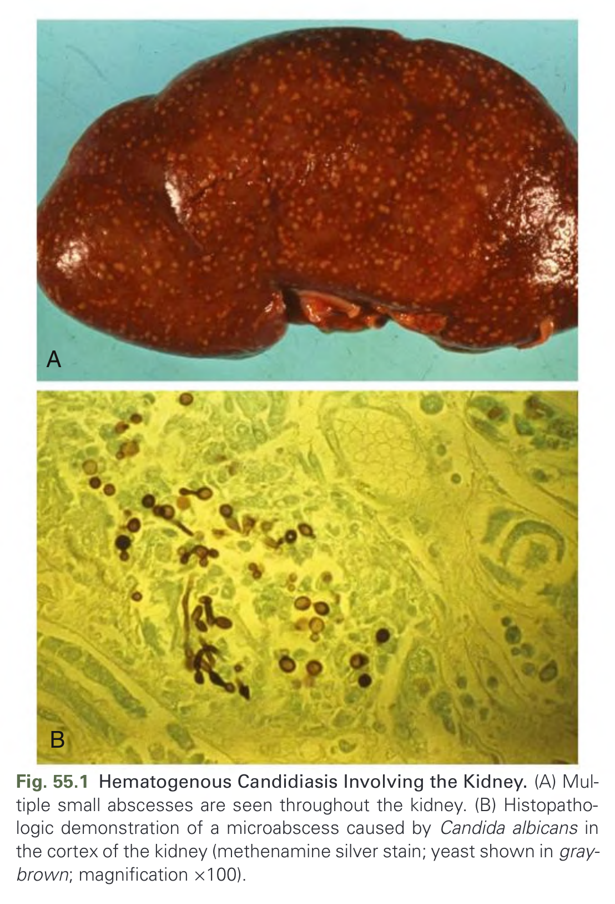
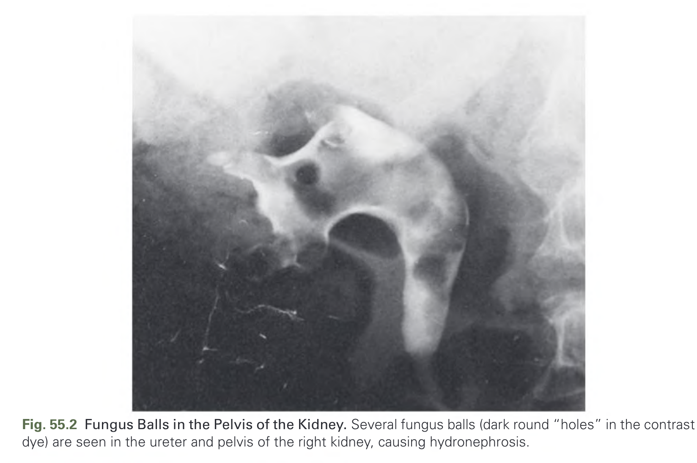
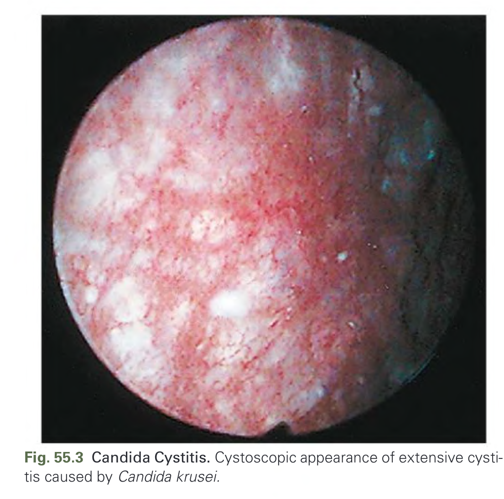
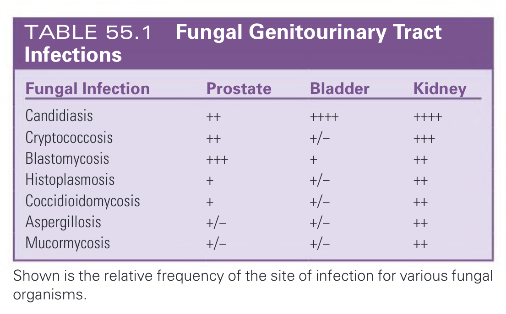
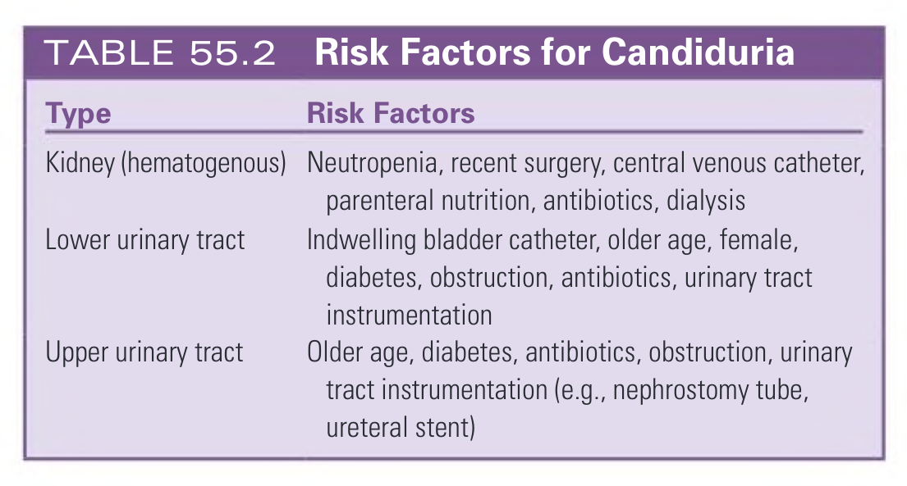
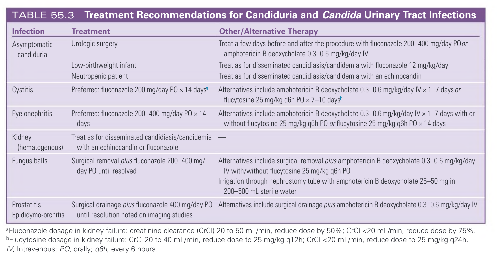

# 055. Fungal Infections of the Urinary Tract - Figures and Tables Index

This document lists all figures, tables and boxes extracted from `055. Fungal Infections of the Urinary Tract.pdf`.

## Table of Contents
- [Figures](#figures)
- [Tables](#tables)
- [Boxes](#boxes)

---

## Figures

### Fig_55_1



Fig. 55.1 Hematogenous Candidiasis Involving the Kidney. (A) Multiple small abscesses are seen throughout the kidney. (B) Histopathologic demonstration of a microabscess caused by Candida albicans in the cortex of the kidney (methenamine silver stain; yeast shown in gray-brown; magnification ×100).

---

### Fig_55_2



Fig. 55.2 Fungus Balls in the Pelvis of the Kidney. Several fungus balls (dark round “holes” in the contrast dye) are seen in the ureter and pelvis of the right kidney, causing hydronephrosis.

---

### Fig_55_3



Fig. 55.3 Candida Cystitis. Cystoscopic appearance of extensive cystitis caused by Candida krusei.

---

## Tables

### Table_55_1

#### Table Image



#### Table Data (CSV: [Table_55_1.csv](Table_55_1.csv))

```markdown
| Fungal Infection | Prostate | Bladder | Kidney |
| :--- | :--- | :--- | :--- |
| Candidiasis | ++ | ++++ | ++++ |
| Cryptococcosis | ++ | +/- | +++ |
| Blastomycosis | +++ | + | ++ |
| Histoplasmosis | + | +/- | ++ |
| Coccidioidomycosis | + | +/- | ++ |
| Aspergillosis | +/- | +/- | ++ |
| Mucormycosis | +/- | +/- | ++ |

Shown is the relative frequency of the site of infection for various fungal organisms.
```

TABLE 55.1 Fungal Genitourinary Tract Infections

---

### Table_55_2

#### Table Image



#### Table Data (CSV: [Table_55_2.csv](Table_55_2.csv))

```markdown
| Type | Risk Factors |
| :--- | :--- |
| Kidney (hematogenous) | Neutropenia, recent surgery, central venous catheter, parenteral nutrition, antibiotics, dialysis |
| Lower urinary tract | Indwelling bladder catheter, older age, female, diabetes, obstruction, antibiotics, urinary tract instrumentation |
| Upper urinary tract | Older age, diabetes, antibiotics, obstruction, urinary tract instrumentation (e.g., nephrostomy tube, ureteral stent) |
```

TABLE 55.2 Risk Factors for Candiduria

---

### Table_55_3

#### Table Image



#### Table Data (CSV: [Table_55_3.csv](Table_55_3.csv))

```markdown
| Infection | Treatment | Other/Alternative Therapy |
| :--- | :--- | :--- |
| **Asymptomatic candiduria** | Urologic surgery | Treat a few days before and after the procedure with fluconazole 200-400 mg/day PO or amphotericin B deoxycholate 0.3-0.6 mg/kg/day IV |
| | Low-birthweight infant | Treat as for disseminated candidiasis/candidemia with fluconazole 12 mg/kg/day |
| | Neutropenic patient | Treat as for disseminated candidiasis/candidemia with an echinocandin |
| **Cystitis** | Preferred: fluconazole 200 mg/day PO × 14 daysa | Alternatives include amphotericin B deoxycholate 0.3-0.6 mg/kg/day IV × 1-7 days or flucytosine 25 mg/kg q6h PO × 7-10 daysb |
| **Pyelonephritis** | Preferred: fluconazole 200-400 mg/day PO × 14 days | Alternatives include amphotericin B deoxycholate 0.3-0.6 mg/kg/day IV × 1-7 days with or without flucytosine 25 mg/kg q6h PO or flucytosine 25 mg/kg q6h PO × 14 days |
| **Kidney (hematogenous)** | Treat as for disseminated candidiasis/candidemia with an echinocandin or fluconazole | — |
| **Fungus balls** | Surgical removal plus fluconazole 200-400 mg/day PO until resolved | Alternatives include surgical removal plus amphotericin B deoxycholate 0.3-0.6 mg/kg/day IV with/without flucytosine 25 mg/kg q6h PO Irrigation through nephrostomy tube with amphotericin B deoxycholate 25-50 mg in 200-500 mL sterile water |
| **Prostatitis Epididymo-orchitis** | Surgical drainage plus fluconazole 400 mg/day PO until resolution noted on imaging studies | Alternatives include surgical drainage plus amphotericin B deoxycholate 0.3-0.6 mg/kg/day IV |

aFluconazole dosage in kidney failure: creatinine clearance (CrCl) 20 to 50 mL/min, reduce dose by 50%; CrCl <20 mL/min, reduce dose by 75%.
bFlucytosine dosage in kidney failure: CrCl 20 to 40 mL/min, reduce dose to 25 mg/kg q12h; CrCl <20 mL/min, reduce dose to 25 mg/kg q24h.
IV, Intravenous; PO, orally; q6h, every 6 hours.
```

TABLE 55.3 Treatment Recommendations for Candiduria and Candida Urinary Tract Infections

---

## Boxes

*No boxes resolved for this chapter.*
