# 056. The Kidney in Schistosomiasis - Figures and Tables Index

This document lists all figures, tables and boxes extracted from `056. The Kidney in Schistosomiasis.pdf`.

## Table of Contents
- [Figures](#figures)
- [Tables](#tables)
- [Boxes](#boxes)

---

## Figures

### Fig_56_1

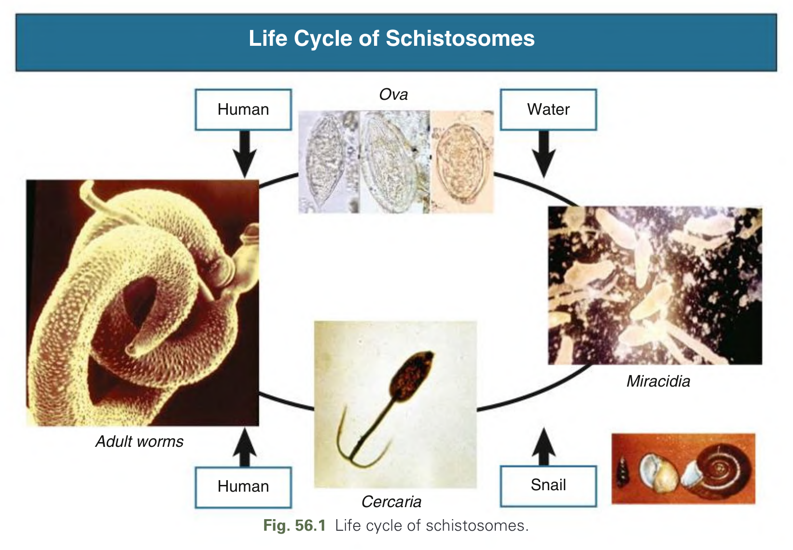

Fig. 56.1 Life cycle of schistosomes.

---

### Fig_56_2

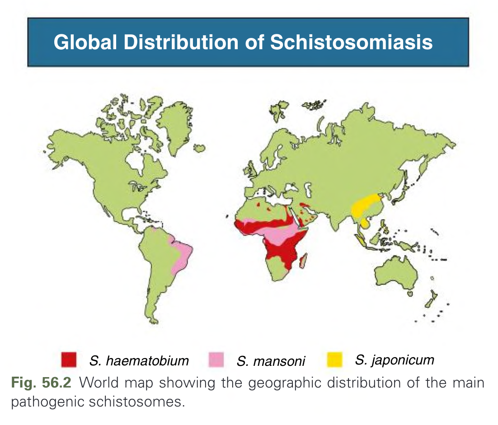

Fig. 56.2 World map showing the geographic distribution of the main pathogenic schistosomes.

---

### Fig_56_3

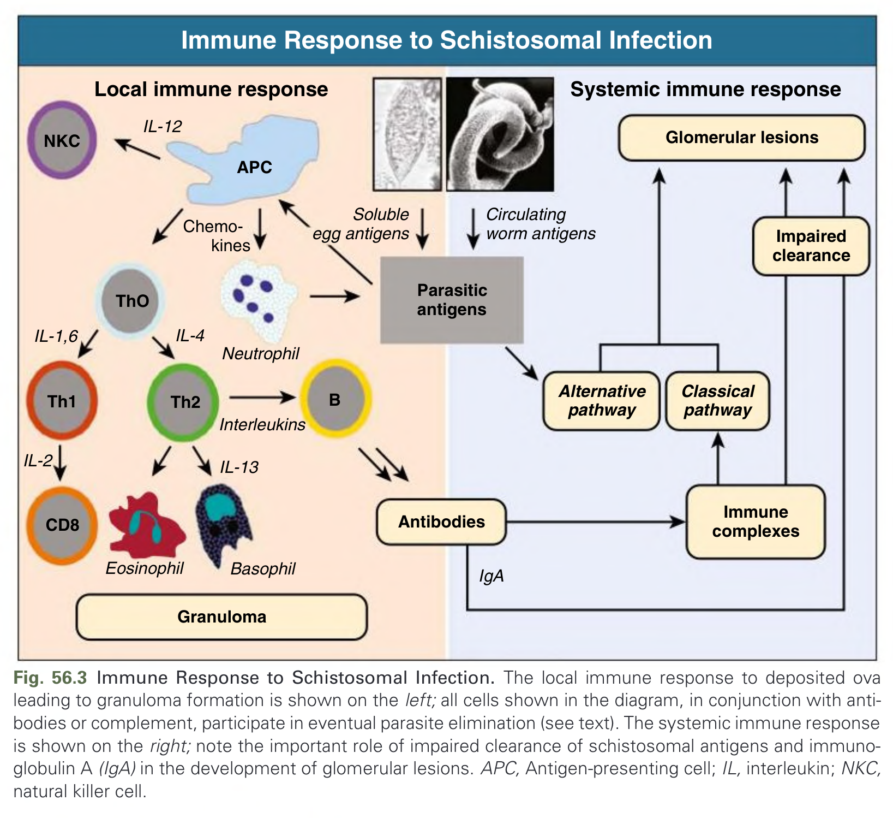

Fig. 56.3 Immune Response to Schistosomal Infection. The local immune response to deposited ova leading to granuloma formation is shown on the left; all cells shown in the diagram, in conjunction with antibodies or complement, participate in eventual parasite elimination (see text). The systemic immune response is shown on the right; note the important role of impaired clearance of schistosomal antigens and immunoglobulin A (IgA) in the development of glomerular lesions. APC, Antigen-presenting cell; IL, interleukin; NKC, natural killer cell.

---

### Fig_56_4

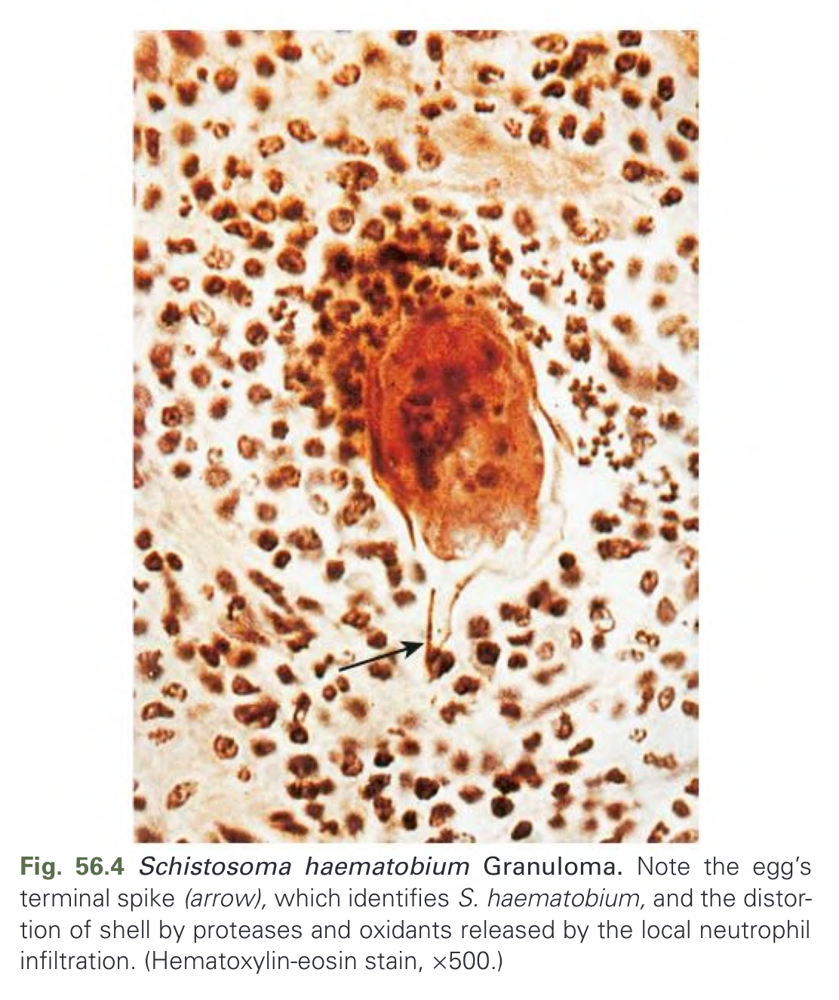

Fig. 56.4 Schistosoma haematobium Granuloma. Note the egg’s terminal spike (arrow), which identifies S. haematobium, and the distortion of shell by proteases and oxidants released by the local neutrophil infiltration. (Hematoxylin-eosin stain, ×500.)

---

### Fig_56_5

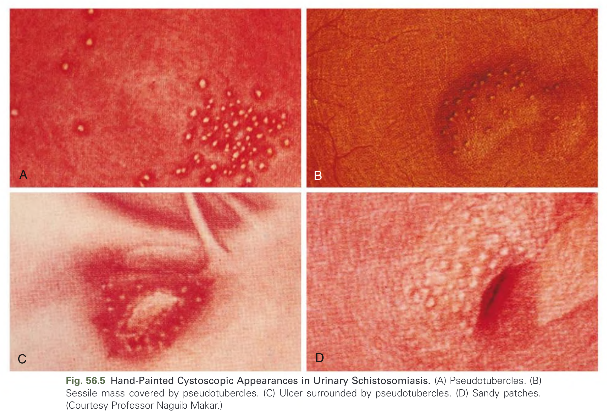

Fig. 56.5 Hand-Painted Cystoscopic Appearances in Urinary Schistosomiasis. (A) Pseudotubercles. (B) Sessile mass covered by pseudotubercles. (C) Ulcer surrounded by pseudotubercles. (D) Sandy patches. (Courtesy Professor Naguib Makar.)

---

### Fig_56_6

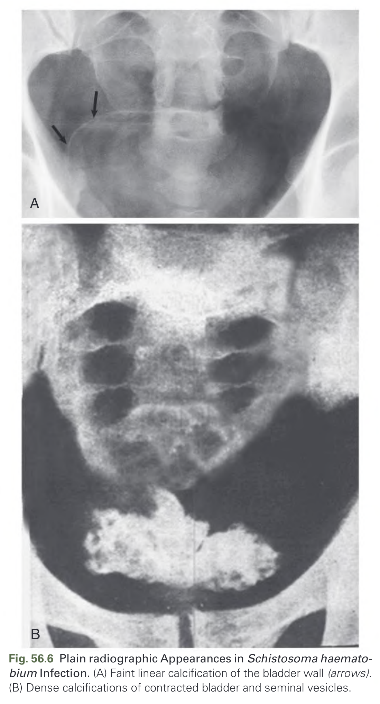

Fig. 56.6 Plain radiographic Appearances in Schistosoma haemato-bium Infection. (A) Faint linear calcification of the bladder wall (arrows). (B) Dense calcifications of contracted bladder and seminal vesicles.

---

### Fig_56_7

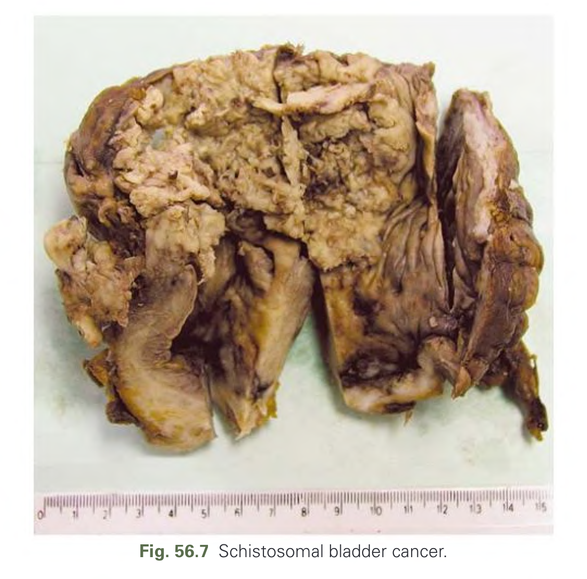

Fig. 56.7 Schistosomal bladder cancer.

---

### Fig_56_8

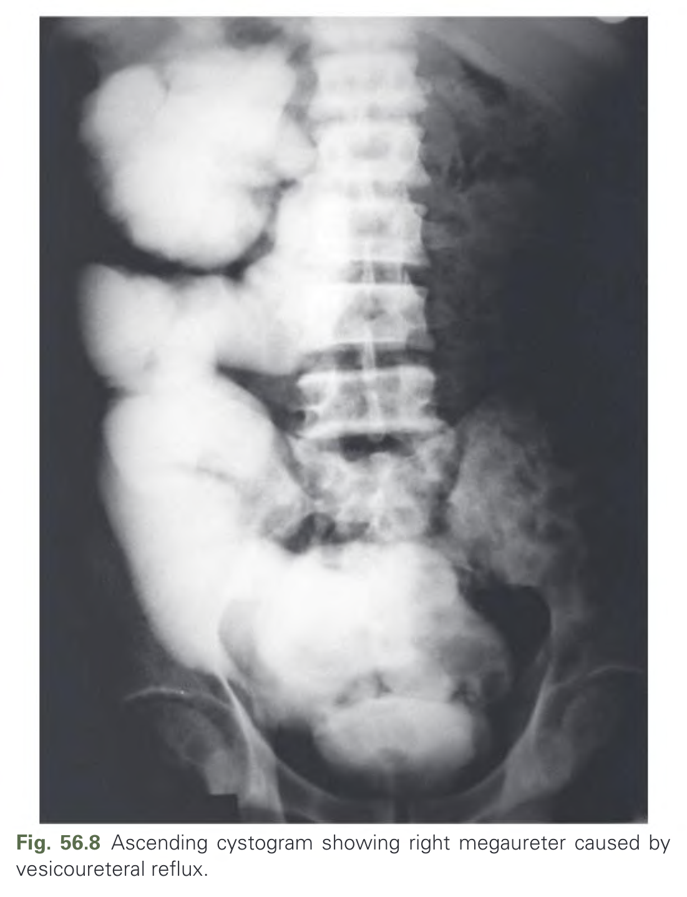

Fig. 56.8 Ascending cystogram showing right megaureter caused by vesicoureteral reflux.

---

### Fig_56_9

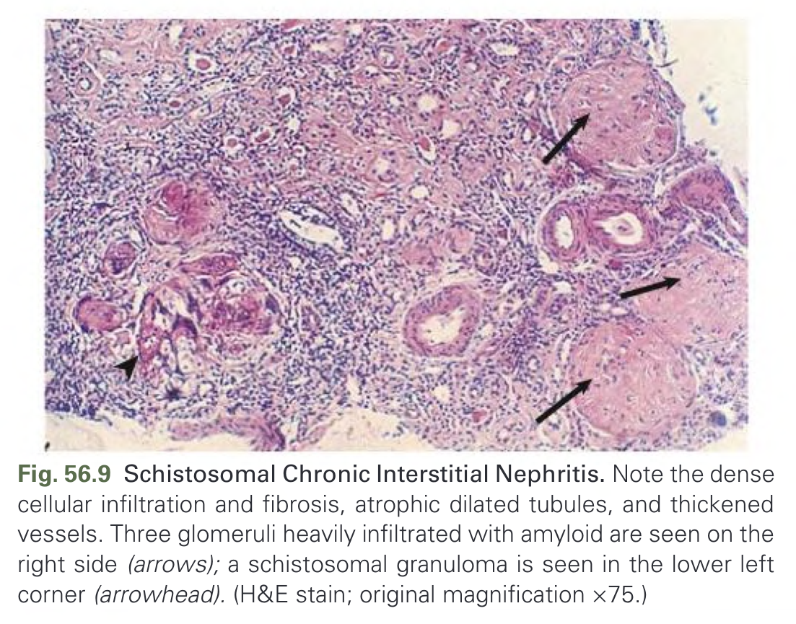

Fig. 56.9 Schistosomal Chronic Interstitial Nephritis. Note the dense cellular infiltration and fibrosis, atrophic dilated tubules, and thickened vessels. Three glomeruli heavily infiltrated with amyloid are seen on the right side (arrows); a schistosomal granuloma is seen in the lower left corner (arrowhead). (H&E stain; original magnification ×75.)

---

### Fig_56_10

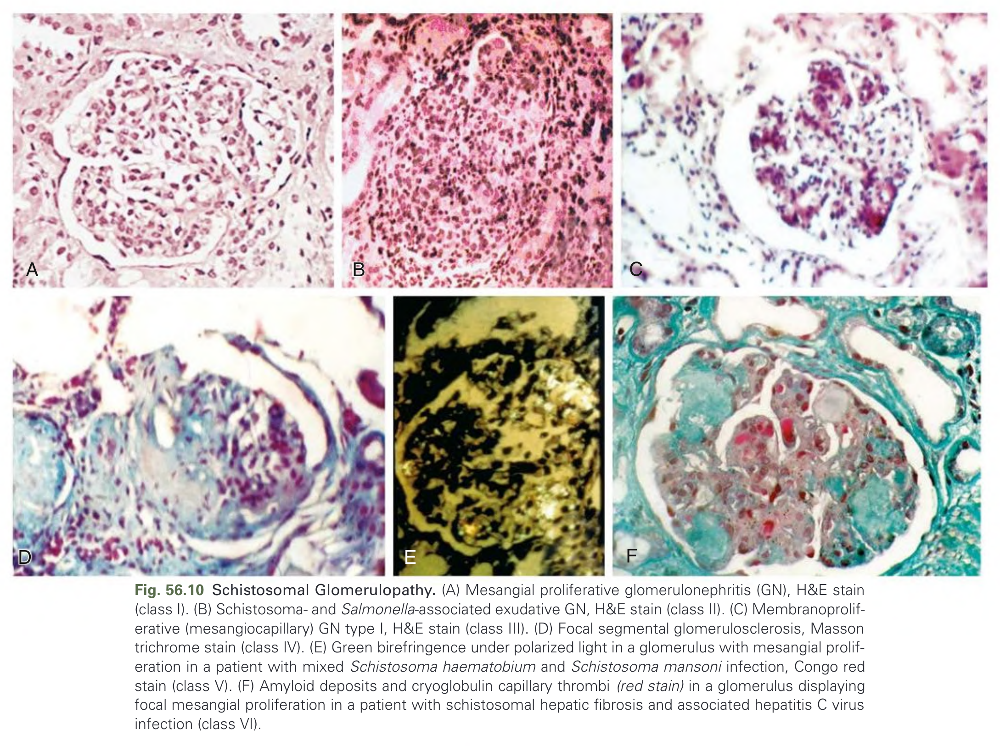

Fig. 56.10 Schistosomal Glomerulopathy. (A) Mesangial proliferative glomerulonephritis (GN), H&E stain (class I). (B) Schistosoma- and Salmonella-associated exudative GN, H&E stain (class II). (C) Membranoproliferative (mesangiocapillary) GN type I, H&E stain (class III). (D) Focal segmental glomerulosclerosis, Masson trichrome stain (class IV). (E) Green birefringence under polarized light in a glomerulus with mesangial proliferation in a patient with mixed Schistosoma haematobium and Schistosoma mansoni infection, Congo red stain (class V). (F) Amyloid deposits and cryoglobulin capillary thrombi (red stain) in a glomerulus displaying focal mesangial proliferation in a patient with schistosomal hepatic fibrosis and associated hepatitis C virus infection (class VI).

---

### Fig_56_11

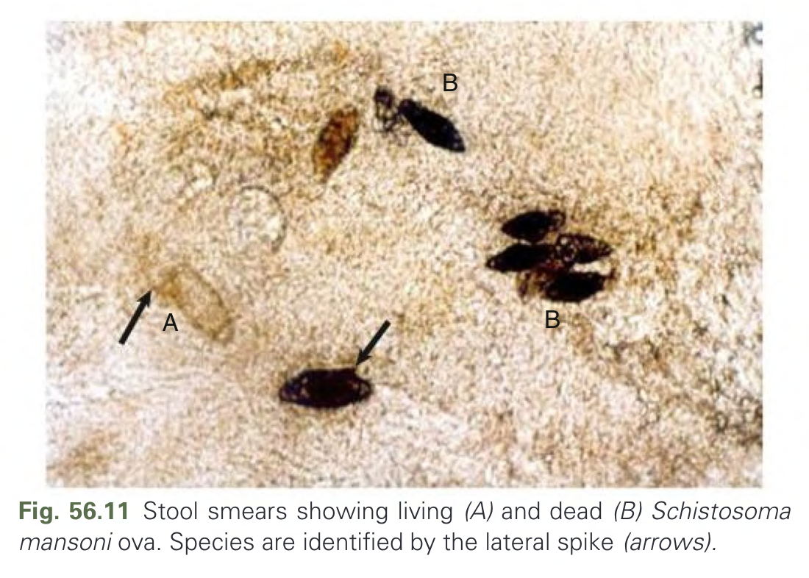

Fig. 56.11 Stool smears showing living (A) and dead (B) Schistosoma mansoni ova. Species are identified by the lateral spike (arrows).

---

## Tables

### Table_56_1

#### Table Image

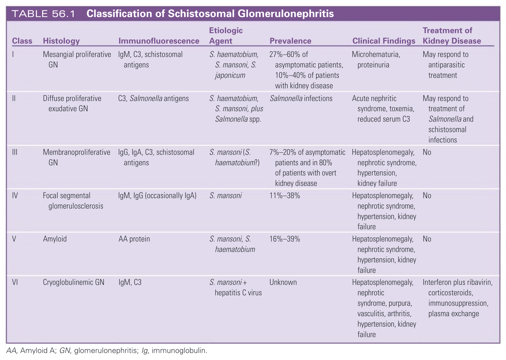

#### Table Data (CSV: [Table_56_1.csv](Table_56_1.csv))

```markdown
| Class | Histology | Immunofluorescence | Etiologic Agent | Prevalence | Clinical Findings | Treatment of Kidney Disease |
| :--- | :--- | :--- | :--- | :--- | :--- | :--- |
| I | Mesangial proliferative GN | IgM, C3, schistosomal antigens | S. haematobium, S. mansoni, S. japonicum | 27%–60% of asymptomatic patients, 10%–40% of patients with kidney disease | Microhematuria, proteinuria | May respond to antiparasitic treatment |
| II | Diffuse proliferative exudative GN | C3, Salmonella antigens | S. haematobium, S. mansoni, plus Salmonella spp. | Salmonella infections | Acute nephritic syndrome, toxemia, reduced serum C3 | May respond to treatment of Salmonella and schistosomal infections |
| III | Membranoproliferative GN | IgG, IgA, C3, schistosomal antigens | S. mansoni (S. haematobium?) | 7%–20% of asymptomatic patients and in 80% of patients with overt kidney disease | Hepatosplenomegaly, nephrotic syndrome, hypertension, kidney failure | No |
| IV | Focal segmental glomerulosclerosis | IgM, IgG (occasionally IgA) | S. mansoni | 11%–38% | Hepatosplenomegaly, nephrotic syndrome, hypertension, kidney failure | No |
| V | Amyloid | AA protein | S. mansoni, S. haematobium | 16%–39% | Hepatosplenomegaly, nephrotic syndrome, hypertension, kidney failure | No |
| VI | Cryoglobulinemic GN | IgM, C3 | S. mansoni + hepatitis C virus | Unknown | Hepatosplenomegaly, nephrotic syndrome, purpura, vasculitis, arthritis, hypertension, kidney failure | Interferon plus ribavirin, corticosteroids, immunosuppression, plasma exchange |
AA, Amyloid A; GN, glomerulonephritis; Ig, immunoglobulin.
```

TABLE 56.1 Classification of Schistosomal Glomerulonephritis

---

## Boxes

### Box_56_1

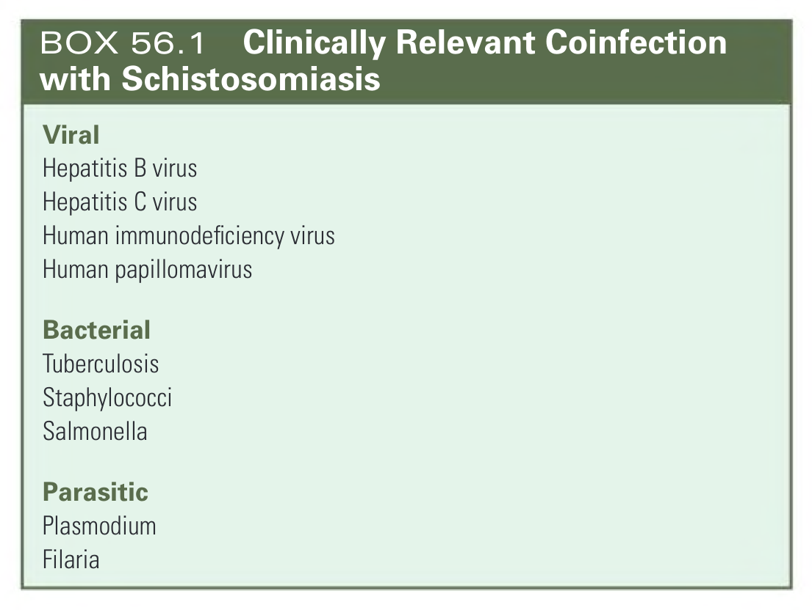

#### Box Text

```markdown
**Viral**
* Hepatitis B virus
* Hepatitis C virus
* Human immunodeficiency virus
* Human papillomavirus

**Bacterial**
* Tuberculosis
* Staphylococci
* Salmonella

**Parasitic**
* Plasmodium
* Filaria
```

BOX 56.1 Clinically Relevant Coinfection with Schistosomiasis

---
