# 057. Glomerular Diseases Associated With Infection - Figures and Tables Index

This document lists all figures, tables and boxes extracted from `057. Glomerular Diseases Associated With Infection.pdf`.

## Table of Contents
- [Figures](#figures)
- [Tables](#tables)
- [Boxes](#boxes)

---

## Figures

### Fig_57_1

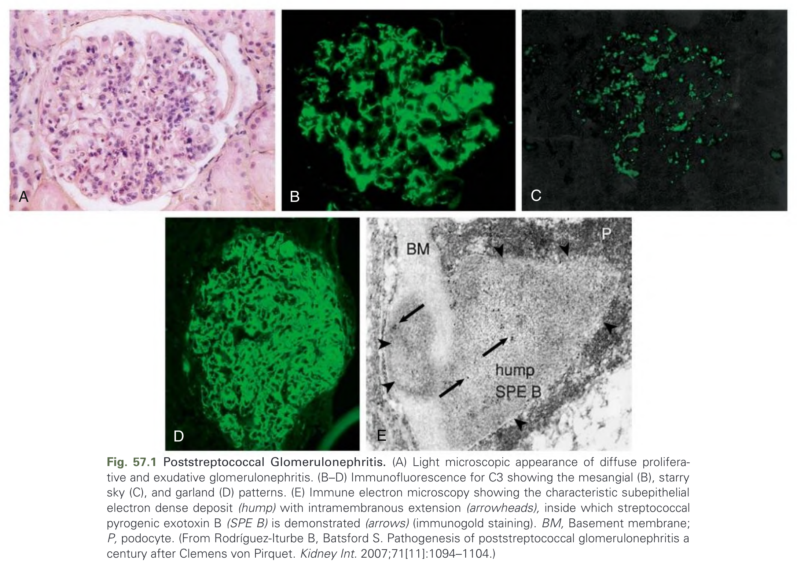

Fig. 57.1 Poststreptococcal Glomerulonephritis. (A) Light microscopic appearance of diffuse proliferative and exudative glomerulonephritis. (B–D) Immunofluorescence for C3 showing the mesangial (B), starry sky (C), and garland (D) patterns. (E) Immune electron microscopy showing the characteristic subepithelial electron dense deposit (hump) with intramembranous extension (arrowheads), inside which streptococcal pyrogenic exotoxin B (SPE B) is demonstrated (arrows) (immunogold staining). BM, Basement membrane; P, podocyte. (From Rodríguez-Iturbe B, Batsford S. Pathogenesis of poststreptococcal glomerulonephritis a century after Clemens von Pirquet. Kidney Int. 2007;71[11]:1094–1104.)

---

### Fig_57_2

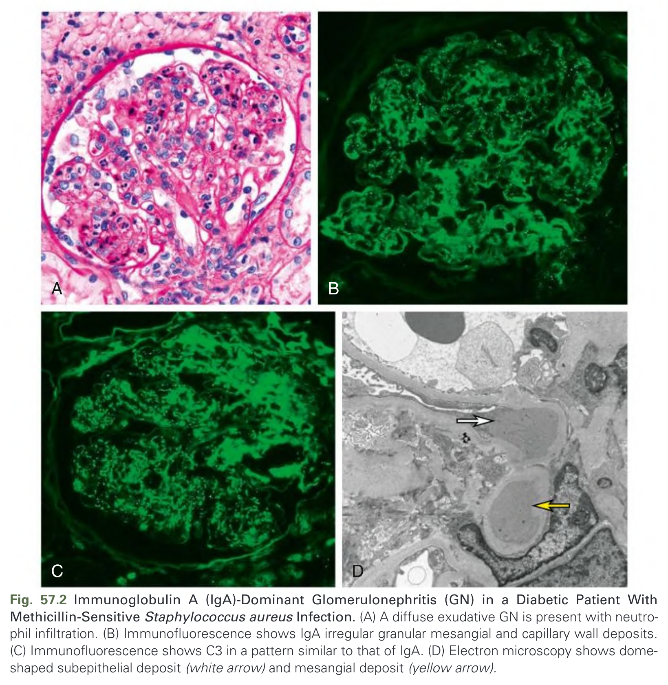

Fig. 57.2 Immunoglobulin A (IgA)-Dominant Glomerulonephritis (GN) in a Diabetic Patient With Methicillin-Sensitive Staphylococcus aureus Infection. (A) A diffuse exudative GN is present with neutrophil infiltration. (B) Immunofluorescence shows IgA irregular granular mesangial and capillary wall deposits. (C) Immunofluorescence shows C3 in a pattern similar to that of IgA. (D) Electron microscopy shows dome-shaped subepithelial deposit (white arrow) and mesangial deposit (yellow arrow).

---

### Fig_57_3

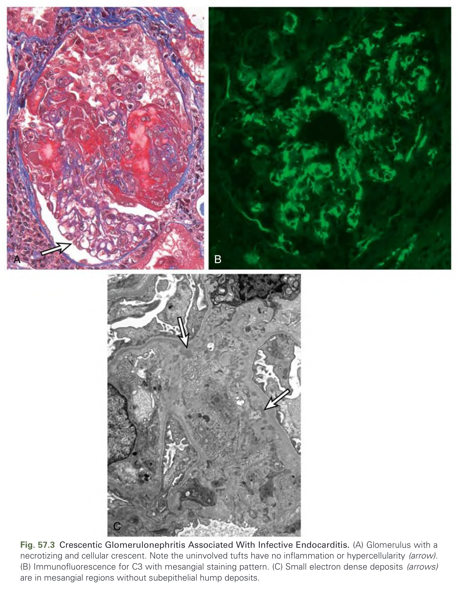

Fig. 57.3 Crescentic Glomerulonephritis Associated With Infective Endocarditis. (A) Glomerulus with a necrotizing and cellular crescent. Note the uninvolved tufts have no inflammation or hypercellularity (arrow). (B) Immunofluorescence for C3 with mesangial staining pattern. (C) Small electron dense deposits (arrows) are in mesangial regions without subepithelial hump deposits.

---

### Fig_57_4

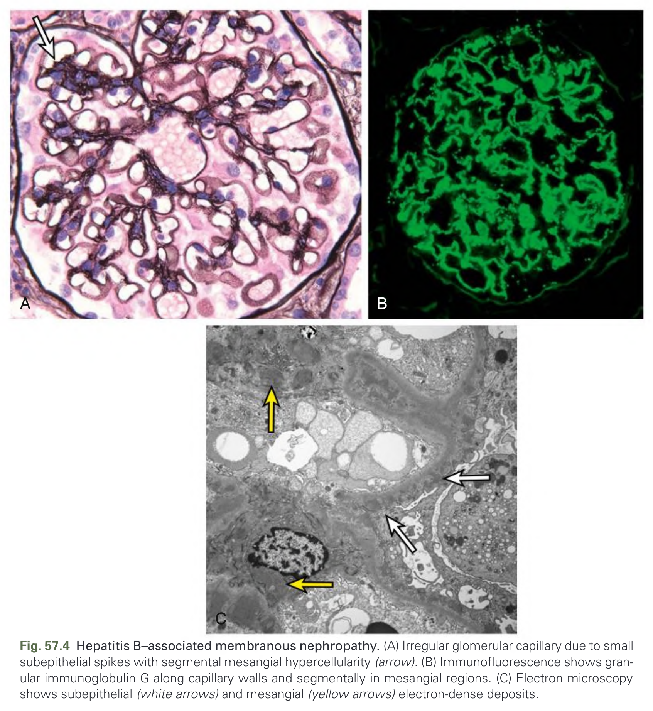

Fig. 57.4 Hepatitis B–associated membranous nephropathy. (A) Irregular glomerular capillary due to small subepithelial spikes with segmental mesangial hypercellularity (arrow). (B) Immunofluorescence shows granular immunoglobulin G along capillary walls and segmentally in mesangial regions. (C) Electron microscopy shows subepithelial (white arrows) and mesangial (yellow arrows) electron-dense deposits.

---

### Fig_57_5

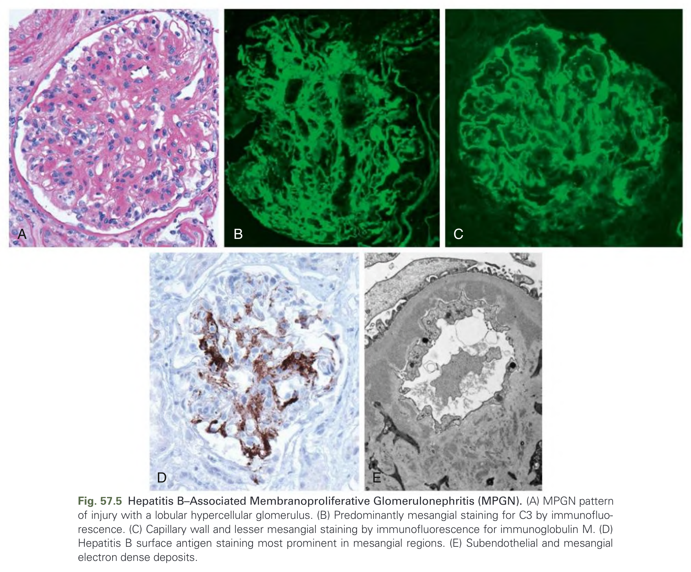

Fig. 57.5 Hepatitis B–Associated Membranoproliferative Glomerulonephritis (MPGN). (A) MPGN pattern of injury with a lobular hypercellular glomerulus. (B) Predominantly mesangial staining for C3 by immunofluorescence. (C) Capillary wall and lesser mesangial staining by immunofluorescence for immunoglobulin M. (D) Hepatitis B surface antigen staining most prominent in mesangial regions. (E) Subendothelial and mesangial electron dense deposits.

---

### Fig_57_6

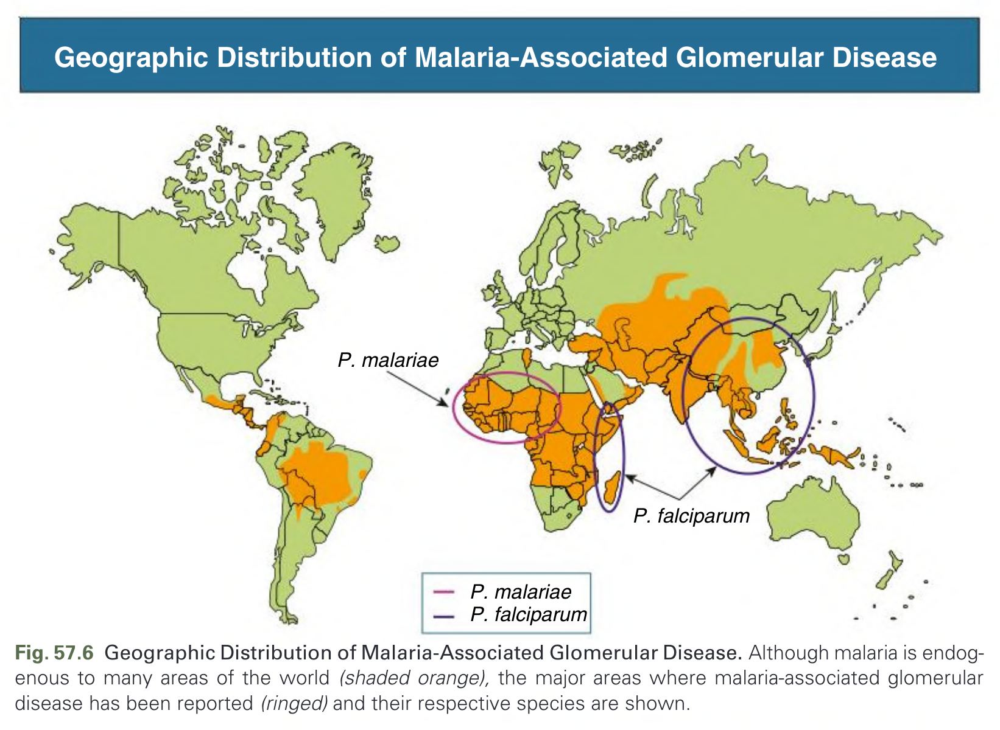

Fig. 57.6 Geographic Distribution of Malaria-Associated Glomerular Disease. Although malaria is endogenous to many areas of the world (shaded orange), the major areas where malaria-associated glomerular disease has been reported (ringed) and their respective species are shown.

---

### Fig_57_7

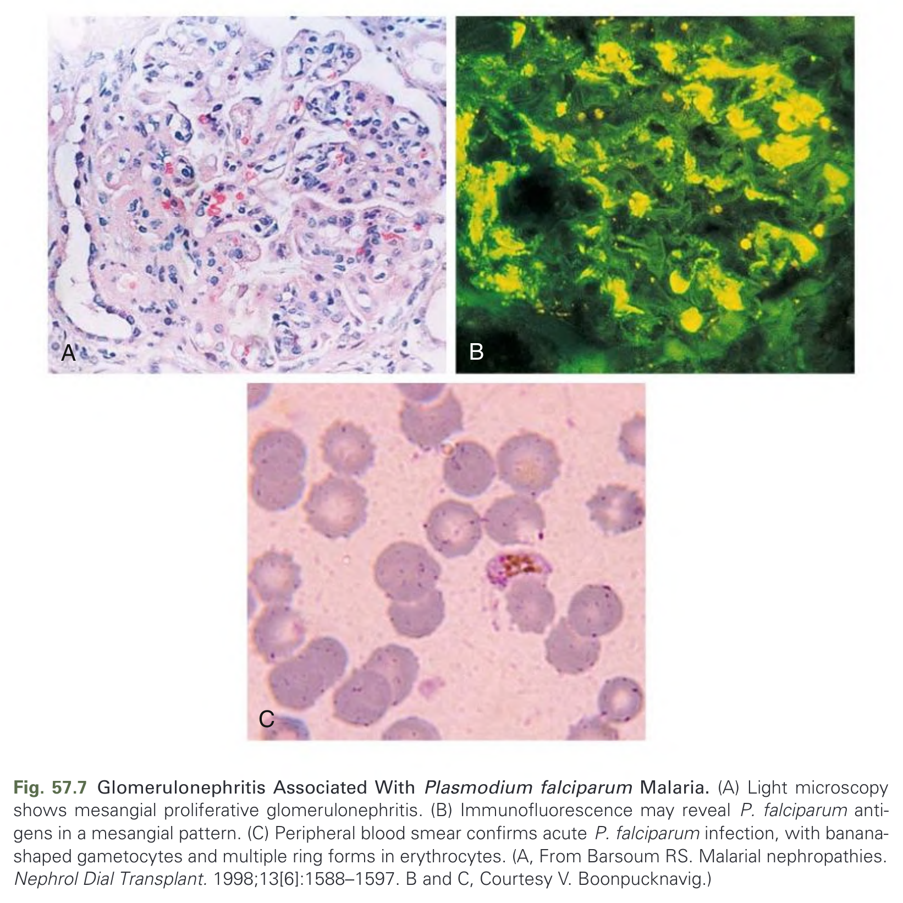

Fig. 57.7 Glomerulonephritis Associated With Plasmodium falciparum Malaria. (A) Light microscopy shows mesangial proliferative glomerulonephritis. (B) Immunofluorescence may reveal P. falciparum antigens in a mesangial pattern. (C) Peripheral blood smear confirms acute P. falciparum infection, with banana-shaped gametocytes and multiple ring forms in erythrocytes. (A, From Barsoum RS. Malarial nephropathies. Nephrol Dial Transplant. 1998;13[6]:1588–1597. B and C, Courtesy V. Boonpucknavig.)

---

### Fig_57_8

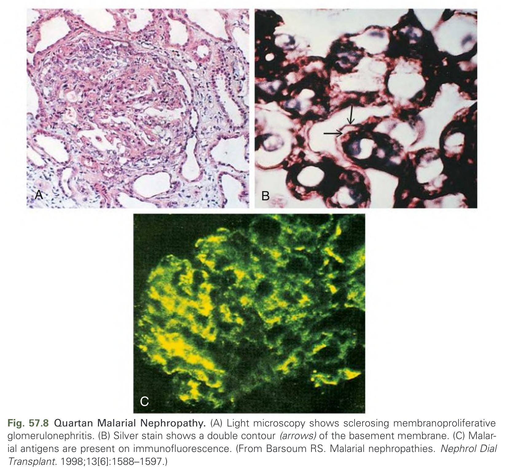

Fig. 57.8 Quartan Malarial Nephropathy. (A) Light microscopy shows sclerosing membranoproliferative glomerulonephritis. (B) Silver stain shows a double contour (arrows) of the basement membrane. (C) Malarial antigens are present on immunofluorescence. (From Barsoum RS. Malarial nephropathies. Nephrol Dial Transplant. 1998;13[6]:1588–1597.)

---

## Tables

### Table_57_1

#### Table Image

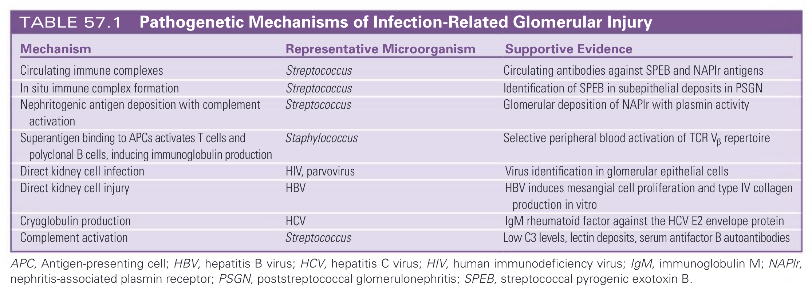

#### Table Data (CSV: [Table_57_1.csv](Table_57_1.csv))

```markdown
| Mechanism | Representative Microorganism | Supportive Evidence |
| :--- | :--- | :--- |
| Circulating immune complexes | Streptococcus | Circulating antibodies against SPEB and NAPIr antigens |
| In situ immune complex formation | Streptococcus | Identification of SPEB in subepithelial deposits in PSGN |
| Nephritogenic antigen deposition with complement activation | Streptococcus | Glomerular deposition of NAPIr with plasmin activity |
| Superantigen binding to APCs activates T cells and polyclonal B cells, inducing immunoglobulin production | Staphylococcus | Selective peripheral blood activation of TCR Vβ repertoire |
| Direct kidney cell infection | HIV, parvovirus | Virus identification in glomerular epithelial cells |
| Direct kidney cell injury | HBV | HBV induces mesangial cell proliferation and type IV collagen production in vitro |
| Cryoglobulin production | HCV | IgM rheumatoid factor against the HCV E2 envelope protein |
| Complement activation | Streptococcus | Low C3 levels, lectin deposits, serum antifactor B autoantibodies |
APC, Antigen-presenting cell; HBV, hepatitis B virus; HCV, hepatitis C virus; HIV, human immunodeficiency virus; IgM, immunoglobulin M; NAPIr, nephritis-associated plasmin receptor; PSGN, poststreptococcal glomerulonephritis; SPEB, streptococcal pyrogenic exotoxin B.
```

TABLE 57.1 Pathogenetic Mechanisms of Infection-Related Glomerular Injury

---

### Table_57_2

#### Table Image

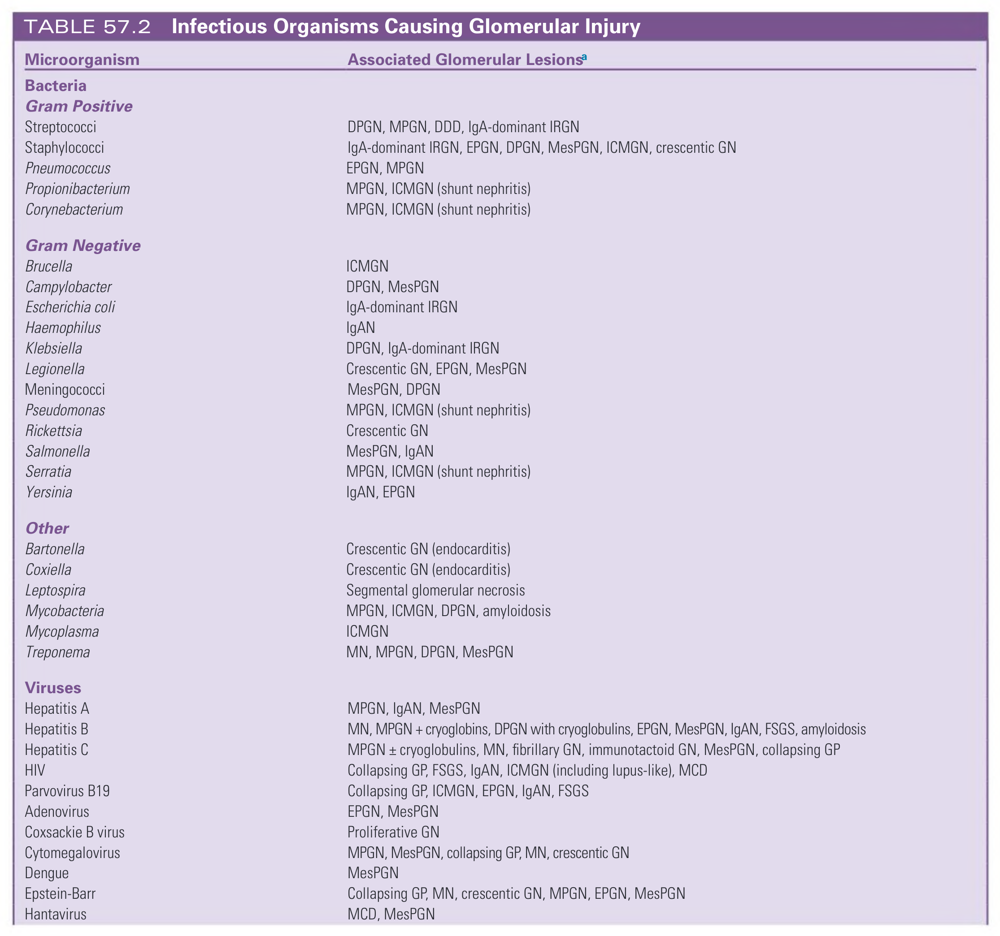

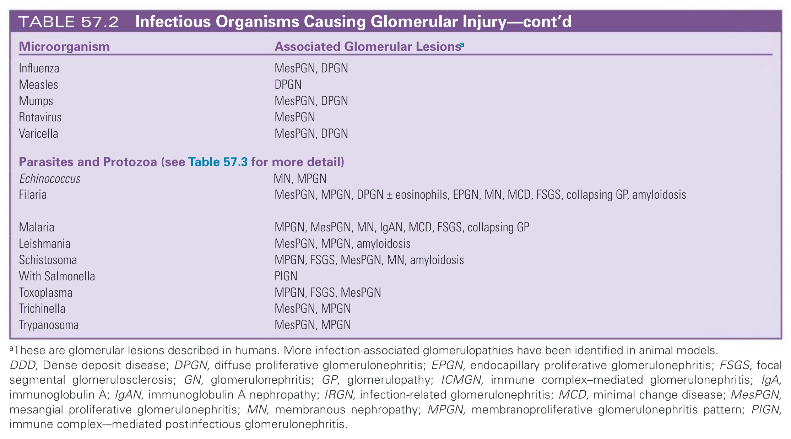

#### Table Data (CSV: [Table_57_2.csv](Table_57_2.csv))

```markdown
| Microorganism | Associated Glomerular Lesionsa |
| :--- | :--- |
| **Bacteria** | |
| **Gram Positive** | |
| Streptococci | DPGN, MPGN, DDD, IgA-dominant IRGN |
| Staphylococci | IgA-dominant IRGN, EPGN, DPGN, MesPGN, ICMGN, crescentic GN |
| Pneumococcus | EPGN, MPGN |
| Propionibacterium | MPGN, ICMGN (shunt nephritis) |
| Corynebacterium | MPGN, ICMGN (shunt nephritis) |
| **Gram Negative** | |
| Brucella | ICMGN |
| Campylobacter | DPGN, MesPGN |
| Escherichia coli | IgA-dominant IRGN |
| Haemophilus | IgAN |
| Klebsiella | DPGN, IgA-dominant IRGN |
| Legionella | Crescentic GN, EPGN, MesPGN |
| Meningococci | MesPGN, DPGN |
| Pseudomonas | MPGN, ICMGN (shunt nephritis) |
| Rickettsia | Crescentic GN |
| Salmonella | MesPGN, IgAN |
| Serratia | MPGN, ICMGN (shunt nephritis) |
| Yersinia | IgAN, EPGN |
| **Other** | |
| Bartonella | Crescentic GN (endocarditis) |
| Coxiella | Crescentic GN (endocarditis) |
| Leptospira | Segmental glomerular necrosis |
| Mycobacteria | MPGN, ICMGN, DPGN, amyloidosis |
| Mycoplasma | ICMGN |
| Treponema | MN, MPGN, DPGN, MesPGN |
| **Viruses** | |
| Hepatitis A | MPGN, IgAN, MesPGN |
| Hepatitis B | MN, MPGN + cryoglobins, DPGN with cryoglobulins, EPGN, MesPGN, IgAN, FSGS, amyloidosis |
| Hepatitis C | MPGN ± cryoglobulins, MN, fibrillary GN, immunotactoid GN, MesPGN, collapsing GP |
| HIV | Collapsing GP, FSGS, IgAN, ICMGN (including lupus-like), MCD |
| Parvovirus B19 | Collapsing GP, ICMGN, EPGN, IgAN, FSGS |
| Adenovirus | EPGN, MesPGN |
| Coxsackie B virus | Proliferative GN |
| Cytomegalovirus | MPGN, MesPGN, collapsing GP, MN, crescentic GN |
| Dengue | MesPGN |
| Epstein-Barr | Collapsing GP, MN, crescentic GN, MPGN, EPGN, MesPGN |
| Hantavirus | MCD, MesPGN |
| Influenza | MesPGN, DPGN |
| Measles | DPGN |
| Mumps | MesPGN, DPGN |
| Rotavirus | MesPGN |
| Varicella | MesPGN, DPGN |
| **Parasites and Protozoa (see Table 57.3 for more detail)** | |
| Echinococcus | MN, MPGN |
| Filaria | MesPGN, MPGN, DPGN ± eosinophils, EPGN, MN, MCD, FSGS, collapsing GP, amyloidosis |
| Malaria | MPGN, MesPGN, MN, IgAN, MCD, FSGS, collapsing GP |
| Leishmania | MesPGN, MPGN, amyloidosis |
| Schistosoma | MPGN, FSGS, MesPGN, MN, amyloidosis |
| With Salmonella | PIGN |
| Toxoplasma | MPGN, FSGS, MesPGN |
| Trichinella | MesPGN, MPGN |
| Trypanosoma | MesPGN, MPGN |
aThese are glomerular lesions described in humans. More infection-associated glomerulopathies have been identified in animal models.
DDD, Dense deposit disease; DPGN, diffuse proliferative glomerulonephritis; EPGN, endocapillary proliferative glomerulonephritis; FSGS, focal segmental glomerulosclerosis; GN, glomerulonephritis; GP, glomerulopathy; ICMGN, immune complex-mediated glomerulonephritis; IgA, immunoglobulin A; IgAN, immunoglobulin A nephropathy; IRGN, infection-related glomerulonephritis; MCD, minimal change disease; MesPGN, mesangial proliferative glomerulonephritis; MN, membranous nephropathy; MPGN, membranoproliferative glomerulonephritis pattern; PIGN, immune complex--mediated postinfectious glomerulonephritis.
```

TABLE 57.2 Infectious Organisms Causing Glomerular Injury

---

### Table_57_3

#### Table Image

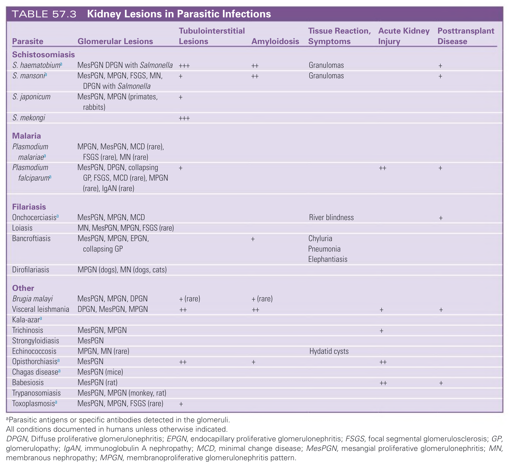

#### Table Data (CSV: [Table_57_3.csv](Table_57_3.csv))

```markdown
| Parasite | Glomerular Lesions | Tubulointerstitial Lesions | Amyloidosis | Tissue Reaction, Symptoms | Acute Kidney Injury | Posttransplant Disease |
| :--- | :--- | :--- | :--- | :--- | :--- | :--- |
| **Schistosomiasis** | | | | | | |
| S. haematobiuma | MesPGN DPGN with Salmonella | +++ | ++ | Granulomas | | + |
| S. mansonia | MesPGN, MPGN, FSGS, MN, DPGN with Salmonella | + | ++ | Granulomas | | + |
| S. japonicum | MesPGN, MPGN (primates, rabbits) | + | | | | |
| S. mekongi | | +++ | | | | |
| **Malaria** | | | | | | |
| Plasmodium malariaea | MPGN, MesPGN, MCD (rare), FSGS (rare), MN (rare) | | | | | |
| Plasmodium falciparuma | MesPGN, DPGN, collapsing GP, FSGS, MCD (rare), MPGN (rare), IgAN (rare) | + | | | ++ | + |
| **Filariasis** | | | | | | |
| Onchocerciasisa | MesPGN, MPGN, MCD | | | River blindness | | + |
| Loiasis | MN, MesPGN, MPGN, FSGS (rare) | | | | | |
| Bancroftiasis | MesPGN, MPGN, EPGN, collapsing GP | | + | Chyluria, Pneumonia, Elephantiasis | | |
| Dirofilariasis | MPGN (dogs), MN (dogs, cats) | | | | | |
| **Other** | | | | | | |
| Brugia malayi | MesPGN, MPGN, DPGN | + (rare) | + (rare) | | | |
| Visceral leishmania | DPGN, MesPGN, MPGN | ++ | ++ | | + | + |
| Kala-azara | | | | | | |
| Trichinosis | MesPGN, MPGN | | | | + | |
| Strongyloidiasis | MesPGN | | | | | |
| Echinococcosis | MPGN, MN (rare) | | | Hydatid cysts | | |
| Opisthorchiasisa | MesPGN | ++ | + | | ++ | |
| Chagas diseasea | MesPGN (mice) | | | | | |
| Babesiosis | MesPGN (rat) | | | | ++ | + |
| Trypanosomiasis | MesPGN, MPGN (monkey, rat) | | | | | |
| Toxoplasmosisa | MesPGN, MPGN, FSGS (rare) | + | | | | |
aParasitic antigens or specific antibodies detected in the glomeruli.
All conditions documented in humans unless otherwise indicated.
DPGN, Diffuse proliferative glomerulonephritis; EPGN, endocapillary proliferative glomerulonephritis; FSGS, focal segmental glomerulosclerosis; GP, glomerulopathy; IgAN, immunoglobulin A nephropathy; MCD, minimal change disease; MesPGN, mesangial proliferative glomerulonephritis; MN, membranous nephropathy; MPGN, membranoproliferative glomerulonephritis pattern.
```

TABLE 57.3 Kidney Lesions in Parasitic Infections

---

## Boxes

*No boxes resolved for this chapter.*
