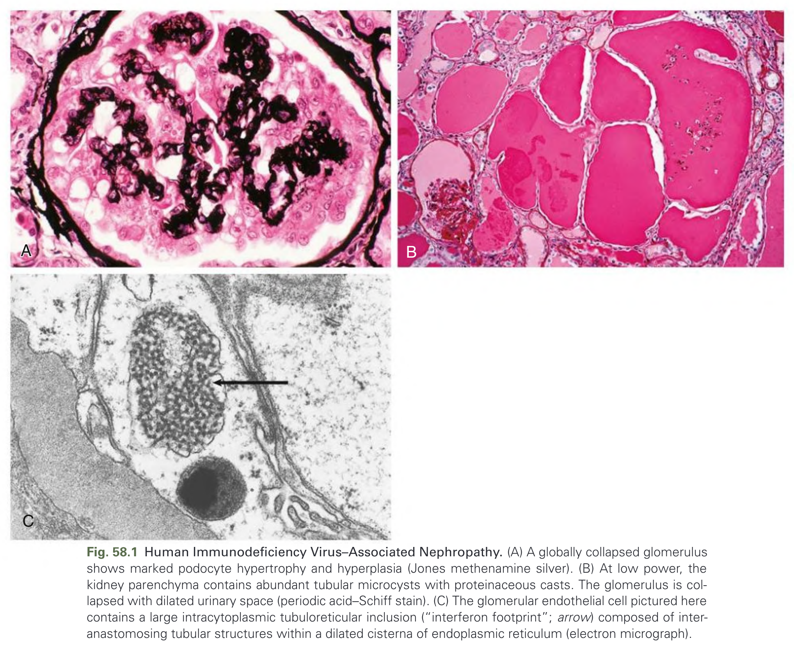
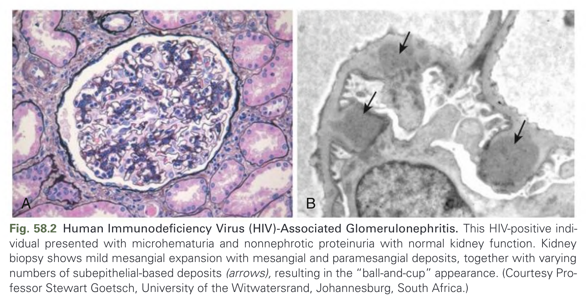
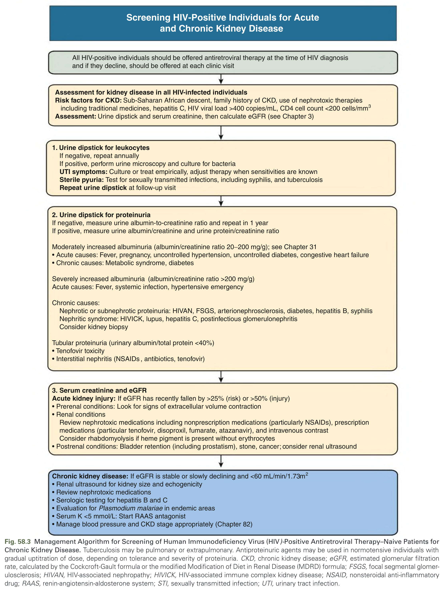
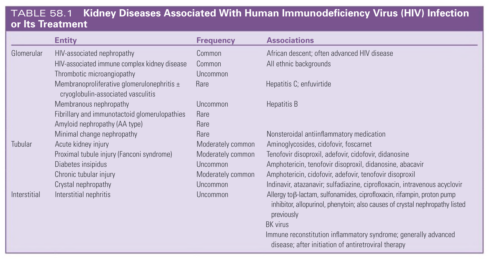
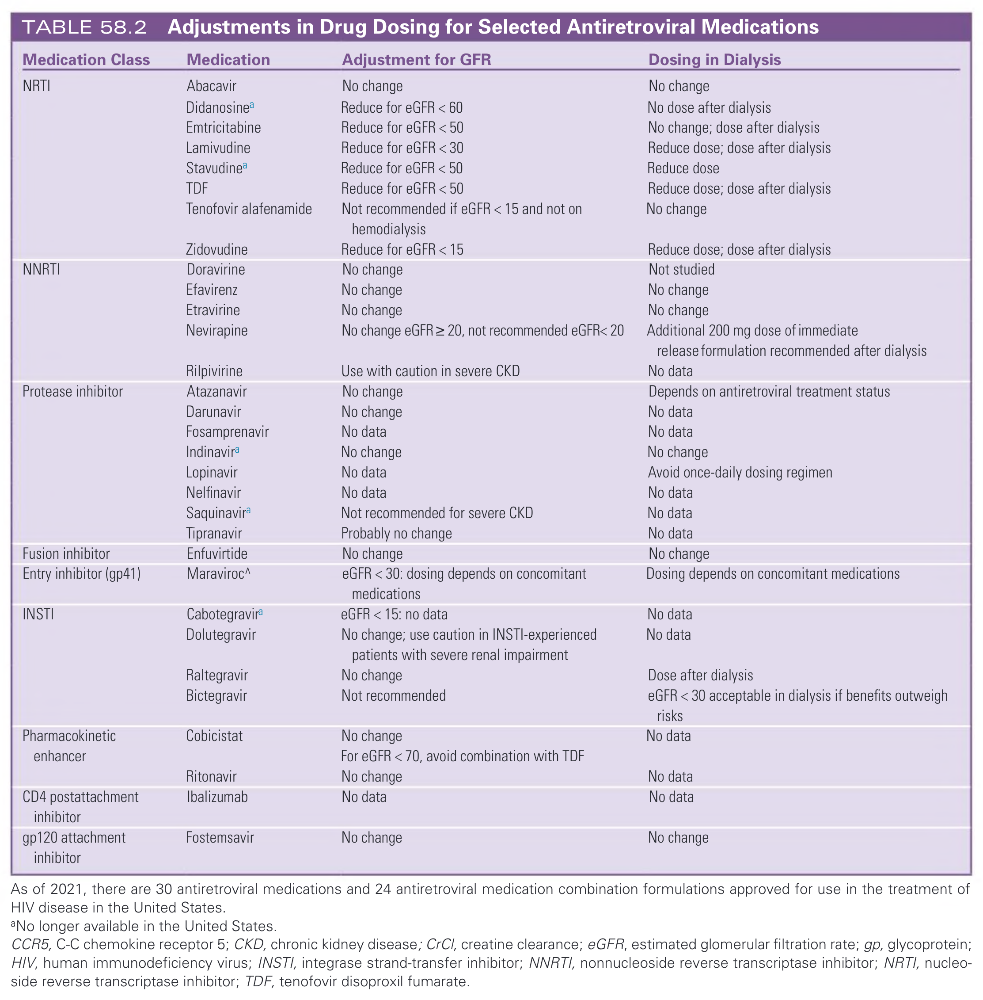
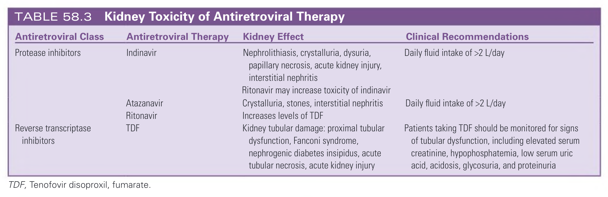

# 058. Human Immunodeficiency Virus Infection and the Kidney - Figures and Tables Index

This document lists all figures, tables and boxes extracted from `058. Human Immunodeficiency Virus Infection and the Kidney.pdf`.

## Table of Contents
- [Figures](#figures)
- [Tables](#tables)
- [Boxes](#boxes)

---

## Figures

### Fig_58_1



Fig. 58.1 Human Immunodeficiency Virus–Associated Nephropathy. (A) A globally collapsed glomerulus shows marked podocyte hypertrophy and hyperplasia (Jones methenamine silver). (B) At low power, the kidney parenchyma contains abundant tubular microcysts with proteinaceous casts. The glomerulus is collapsed with dilated urinary space (periodic acid–Schiff stain). (C) The glomerular endothelial cell pictured here contains a large intracytoplasmic tubuloreticular inclusion (“interferon footprint”; arrow) composed of inter-anastomosing tubular structures within a dilated cisterna of endoplasmic reticulum (electron micrograph).

---

### Fig_58_2



Fig. 58.2 Human Immunodeficiency Virus (HIV)-Associated Glomerulonephritis. This HIV-positive individual presented with microhematuria and nonnephrotic proteinuria with normal kidney function. Kidney biopsy shows mild mesangial expansion with mesangial and paramesangial deposits, together with varying numbers of subepithelial-based deposits (arrows), resulting in the “ball-and-cup” appearance. (Courtesy Professor Stewart Goetsch, University of the Witwatersrand, Johannesburg, South Africa.)

---

### Fig_58_3



Fig. 58.3 Management Algorithm for Screening of Human Immunodeficiency Virus (HIV)-Positive Antiretroviral Therapy–Naive Patients for Chronic Kidney Disease. Tuberculosis may be pulmonary or extrapulmonary. Antiproteinuric agents may be used in normotensive individuals with gradual uptitration of dose, depending on tolerance and severity of proteinuria. CKD, chronic kidney disease; eGFR, estimated glomerular filtration rate, calculated by the Cockcroft-Gault formula or the modified Modification of Diet in Renal Disease (MDRD) formula; FSGS, focal segmental glomerulosclerosis; HIVAN, HIV-associated nephropathy; HIVICK, HIV-associated immune complex kidney disease; NSAID, nonsteroidal anti-inflammatory drug; RAAS, renin-angiotensin-aldosterone system; STI, sexually transmitted infection; UTI, urinary tract infection.

---

## Tables

### Table_58_1

#### Table Image



#### Table Data (CSV: [Table_58_1.csv](Table_58_1.csv))

```markdown
| Entity | Frequency | Associations |
| :--- | :--- | :--- |
| **Glomerular** | | |
| HIV-associated nephropathy | Common | African descent; often advanced HIV disease |
| HIV-associated immune complex kidney disease | Common | All ethnic backgrounds |
| Thrombotic microangiopathy | Uncommon | |
| Membranoproliferative glomerulonephritis ± cryoglobulin-associated vasculitis | Rare | Hepatitis C; enfuvirtide |
| Membranous nephropathy | Uncommon | Hepatitis B |
| Fibrillary and immunotactoid glomerulopathies | Rare | |
| Amyloid nephropathy (AA type) | Rare | |
| Minimal change nephropathy | Rare | Nonsteroidal antiinflammatory medication |
| **Tubular** | | |
| Acute kidney injury | Moderately common | Aminoglycosides, cidofovir, foscarnet |
| Proximal tubule injury (Fanconi syndrome) | Moderately common | Tenofovir disoproxil, adefovir, cidofovir, didanosine |
| Diabetes insipidus | Uncommon | Amphotericin, tenofovir disoproxil, didanosine, abacavir |
| Chronic tubular injury | Moderately common | Amphotericin, cidofovir, adefovir, tenofovir disoproxil |
| Crystal nephropathy | Uncommon | Indinavir, atazanavir; sulfadiazine, ciprofloxacin, intravenous acyclovir |
| **Interstitial** | | |
| Interstitial nephritis | Uncommon | Allergy to β-lactam, sulfonamides, ciprofloxacin, rifampin, proton pump inhibitor, allopurinol, phenytoin; also causes of crystal nephropathy listed previously |
| | | BK virus |
| | | Immune reconstitution inflammatory syndrome; generally advanced disease; after initiation of antiretroviral therapy |
```

TABLE 58.1 Kidney Diseases Associated With Human Immunodeficiency Virus (HIV) Infection or Its Treatment

---

### Table_58_2

#### Table Image



#### Table Data (CSV: [Table_58_2.csv](Table_58_2.csv))

```markdown
| Medication Class | Medication | Adjustment for GFR | Dosing in Dialysis |
| :--- | :--- | :--- | :--- |
| NRTI | Abacavir | No change | No change |
| | Didanosineᵃ | Reduce for eGFR < 60 | No dose after dialysis |
| | Emtricitabine | Reduce for eGFR < 50 | No change; dose after dialysis |
| | Lamivudine | Reduce for eGFR < 30 | Reduce dose; dose after dialysis |
| | Stavudineᵃ | Reduce for eGFR < 50 | Reduce dose |
| | TDF | Reduce for eGFR < 50 | Reduce dose; dose after dialysis |
| | Tenofovir alafenamide | Not recommended if eGFR < 15 and not on hemodialysis | No change |
| | Zidovudine | Reduce for eGFR < 15 | Reduce dose; dose after dialysis |
| NNRTI | Doravirine | No change | Not studied |
| | Efavirenz | No change | No change |
| | Etravirine | No change | No change |
| | Nevirapine | No change eGFR ≥ 20, not recommended eGFR< 20 | Additional 200 mg dose of immediate release formulation recommended after dialysis |
| | Rilpivirine | Use with caution in severe CKD | No data |
| Protease inhibitor | Atazanavir | No change | Depends on antiretroviral treatment status |
| | Darunavir | No change | No data |
| | Fosamprenavir | No data | No data |
| | Indinavirᵃ | No change | No change |
| | Lopinavir | No data | Avoid once-daily dosing regimen |
| | Nelfinavir | No data | No data |
| | Saquinavirᵃ | Not recommended for severe CKD | No data |
| | Tipranavir | Probably no change | No data |
| Fusion inhibitor | Enfuvirtide | No change | No change |
| Entry inhibitor (gp41) | Maraviroc^ | eGFR < 30: dosing depends on concomitant medications | Dosing depends on concomitant medications |
| INSTI | Cabotegravirᵃ | eGFR < 15: no data | No data |
| | Dolutegravir | No change; use caution in INSTI-experienced patients with severe renal impairment | No data |
| | Raltegravir | No change | Dose after dialysis |
| | Bictegravir | Not recommended | eGFR < 30 acceptable in dialysis if benefits outweigh risks |
| Pharmacokinetic enhancer | Cobicistat | No change. For eGFR < 70, avoid combination with TDF | No data |
| | Ritonavir | No change | No data |
| CD4 postattachment inhibitor | Ibalizumab | No data | No data |
| gp120 attachment inhibitor | Fostemsavir | No change | No change |

As of 2021, there are 30 antiretroviral medications and 24 antiretroviral medication combination formulations approved for use in the treatment of HIV disease in the United States.
ᵃNo longer available in the United States.
CCR5, C-C chemokine receptor 5; CKD, chronic kidney disease; CrCl, creatine clearance; eGFR, estimated glomerular filtration rate; gp, glycoprotein; HIV, human immunodeficiency virus; INSTI, integrase strand-transfer inhibitor; NNRTI, nonnucleoside reverse transcriptase inhibitor; NRTI, nucleoside reverse transcriptase inhibitor; TDF, tenofovir disoproxil fumarate.
```

TABLE 58.2 Adjustments in Drug Dosing for Selected Antiretroviral Medications

---

### Table_58_3

#### Table Image



#### Table Data (CSV: [Table_58_3.csv](Table_58_3.csv))

```markdown
| Antiretroviral Class | Antiretroviral Therapy | Kidney Effect | Clinical Recommendations |
| :--- | :--- | :--- | :--- |
| Protease inhibitors | Indinavir | Nephrolithiasis, crystalluria, dysuria, papillary necrosis, acute kidney injury, interstitial nephritis<br>Ritonavir may increase toxicity of indinavir | Daily fluid intake of >2 L/day |
| | Atazanavir | Crystalluria, stones, interstitial nephritis | Daily fluid intake of >2 L/day |
| | Ritonavir | Increases levels of TDF | |
| Reverse transcriptase inhibitors | TDF | Kidney tubular damage: proximal tubular dysfunction, Fanconi syndrome, nephrogenic diabetes insipidus, acute tubular necrosis, acute kidney injury | Patients taking TDF should be monitored for signs of tubular dysfunction, including elevated serum creatinine, hypophosphatemia, low serum uric acid, acidosis, glycosuria, and proteinuria |

TDF, Tenofovir disoproxil, fumarate.
```

TABLE 58.3 Kidney Toxicity of Antiretroviral Therapy

---

## Boxes

*No boxes resolved for this chapter.*
