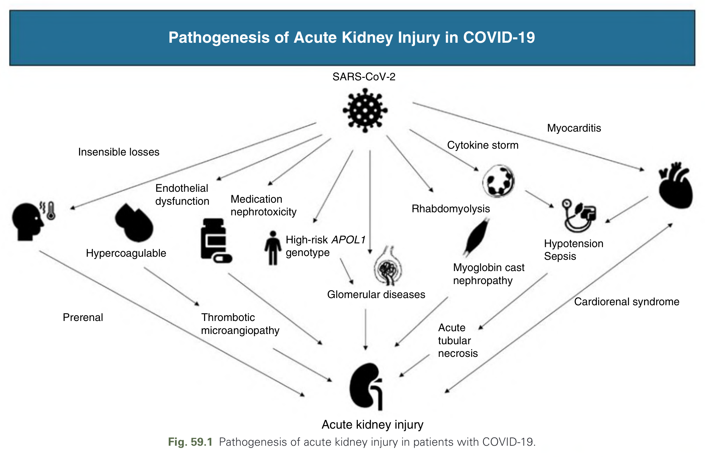
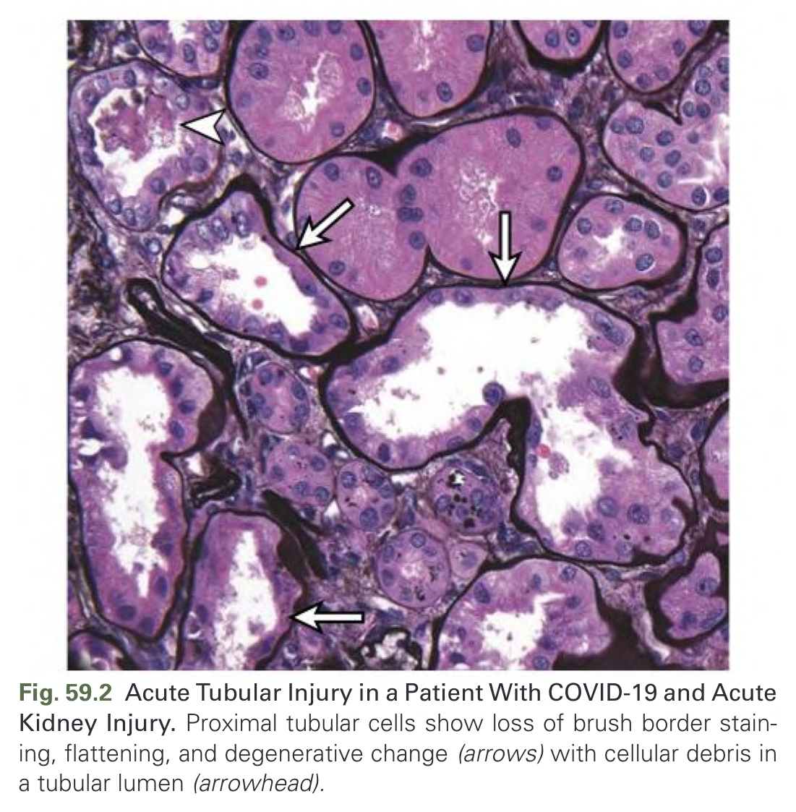
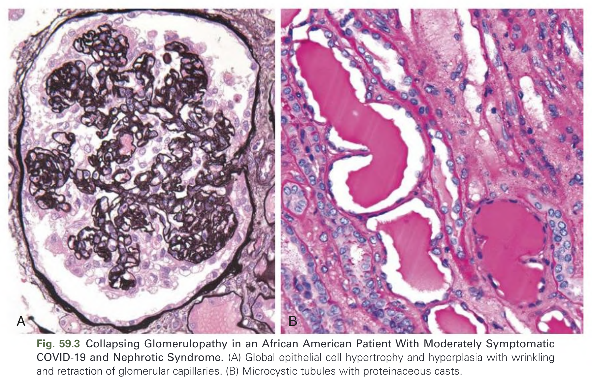
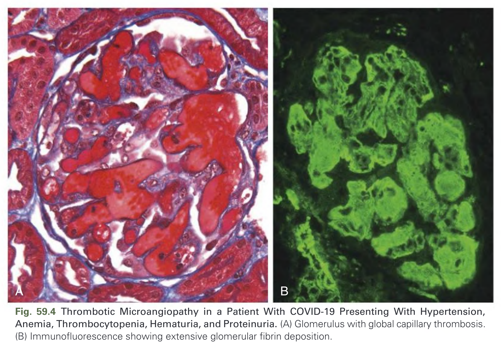

# 059. Kidney Diseases Associated With Coronaviruses - Figures and Tables Index

This document lists all figures, tables and boxes extracted from `059. Kidney Diseases Associated With Coronaviruses.pdf`.

## Table of Contents
- [Figures](#figures)
- [Tables](#tables)
- [Boxes](#boxes)

---

## Figures

### Fig_59_1

Fig. 59.1 Pathogenesis of acute kidney injury in patients with COVID-19.

---

### Fig_59_2

Fig. 59.2 Acute Tubular Injury in a Patient With COVID-19 and Acute Kidney Injury. Proximal tubular cells show loss of brush border staining, flattening, and degenerative change (arrows) with cellular debris in a tubular lumen (arrowhead).

---

### Fig_59_3

Fig. 59.3 Collapsing Glomerulopathy in an African American Patient With Moderately Symptomatic COVID-19 and Nephrotic Syndrome. (A) Global epithelial cell hypertrophy and hyperplasia with wrinkling and retraction of glomerular capillaries. (B) Microcystic tubules with proteinaceous casts.

---

### Fig_59_4

Fig. 59.4 Thrombotic Microangiopathy in a Patient With COVID-19 Presenting With Hypertension, Anemia, Thrombocytopenia, Hematuria, and Proteinuria. (A) Glomerulus with global capillary thrombosis. (B) Immunofluorescence showing extensive glomerular fibrin deposition.

---

## Tables

*No tables resolved for this chapter.*

## Boxes

*No boxes resolved for this chapter.*
