# 060. Nephrolithiasis and Nephrocalcinosis - Figures and Tables Index

This document lists all figures, tables and boxes extracted from `060. Nephrolithiasis and Nephrocalcinosis.pdf`.

## Table of Contents
- [Figures](#figures)
- [Tables](#tables)
- [Boxes](#boxes)

---

## Figures

### Fig_60_1

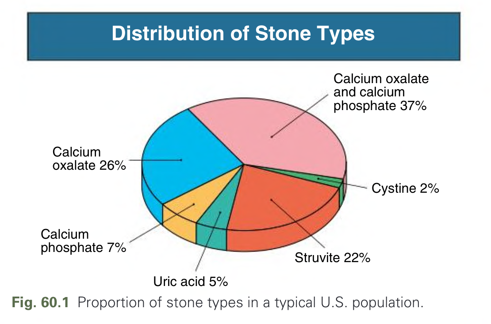

Fig. 60.1 Proportion of stone types in a typical U.S. population.

---

### Fig_60_2

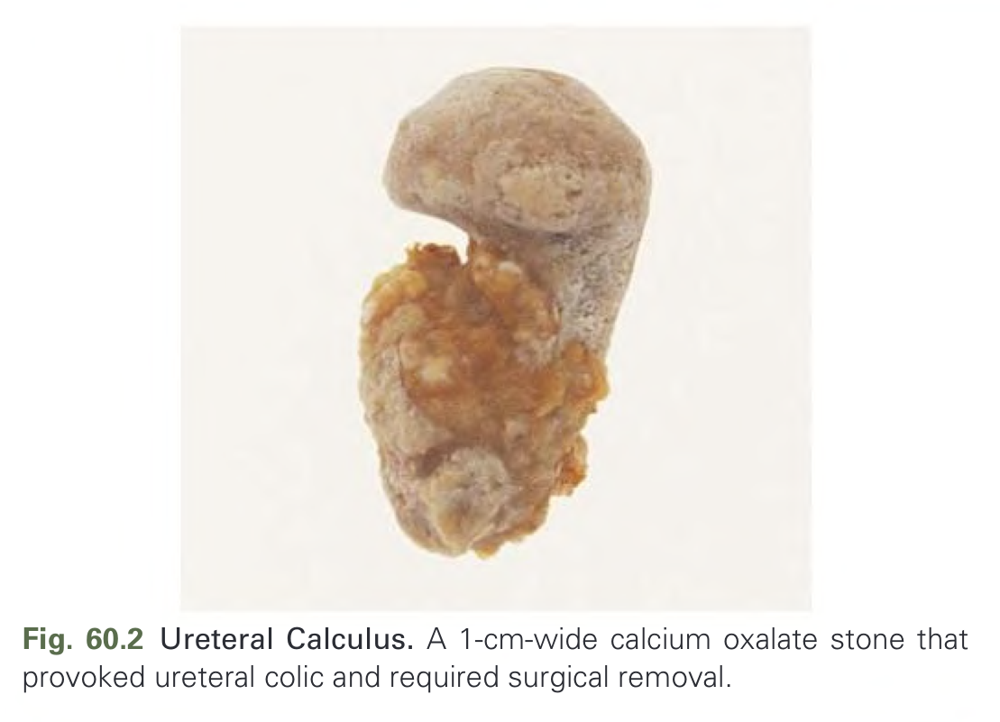

Fig. 60.2 Ureteral Calculus. A 1-cm-wide calcium oxalate stone that provoked ureteral colic and required surgical removal.

---

### Fig_60_3

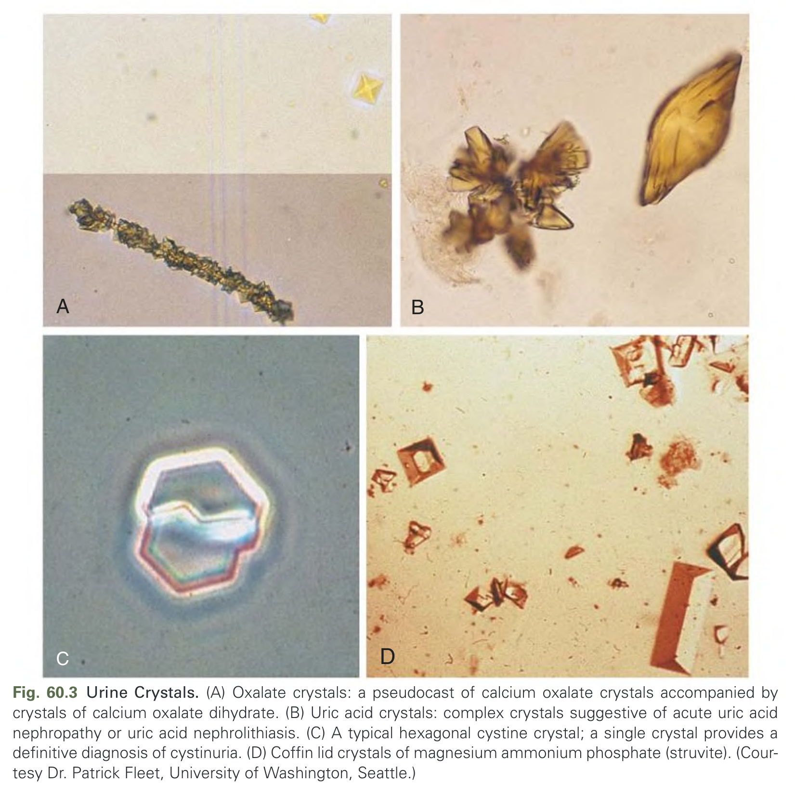

Fig. 60.3 Urine Crystals. (A) Oxalate crystals: a pseudocast of calcium oxalate crystals accompanied by crystals of calcium oxalate dihydrate. (B) Uric acid crystals: complex crystals suggestive of acute uric acid nephropathy or uric acid nephrolithiasis. (C) A typical hexagonal cystine crystal; a single crystal provides a definitive diagnosis of cystinuria. (D) Coffin lid crystals of magnesium ammonium phosphate (struvite). (Courtesy Dr. Patrick Fleet, University of Washington, Seattle.)

---

### Fig_60_4

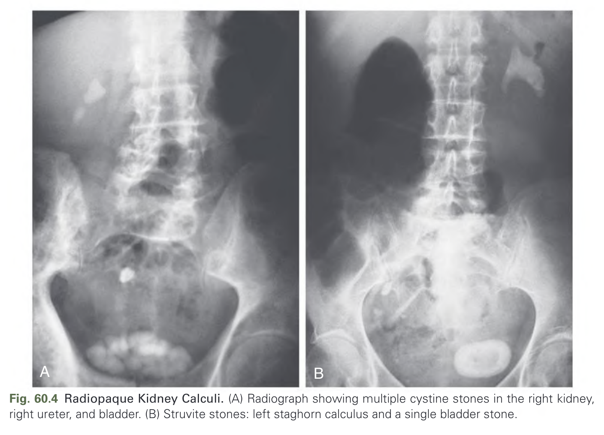

Fig. 60.4 Radiopaque Kidney Calculi. (A) Radiograph showing multiple cystine stones in the right kidney, right ureter, and bladder. (B) Struvite stones: left staghorn calculus and a single bladder stone.

---

### Fig_60_5

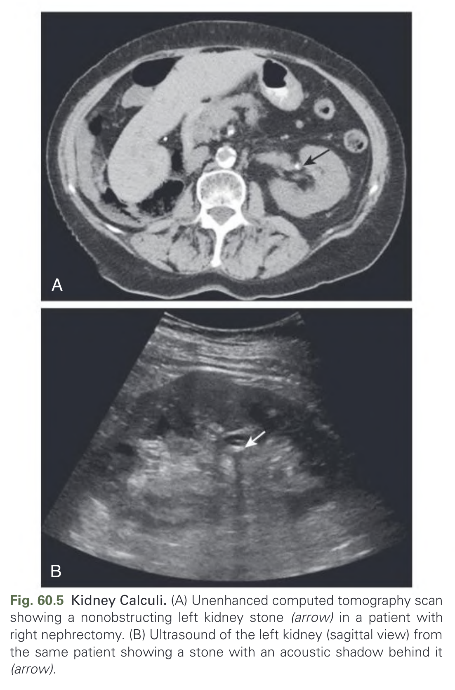

Fig. 60.5 Kidney Calculi. (A) Unenhanced computed tomography scan showing a nonobstructing left kidney stone (arrow) in a patient with right nephrectomy. (B) Ultrasound of the left kidney (sagittal view) from the same patient showing a stone with an acoustic shadow behind it (arrow).

---

### Fig_60_6

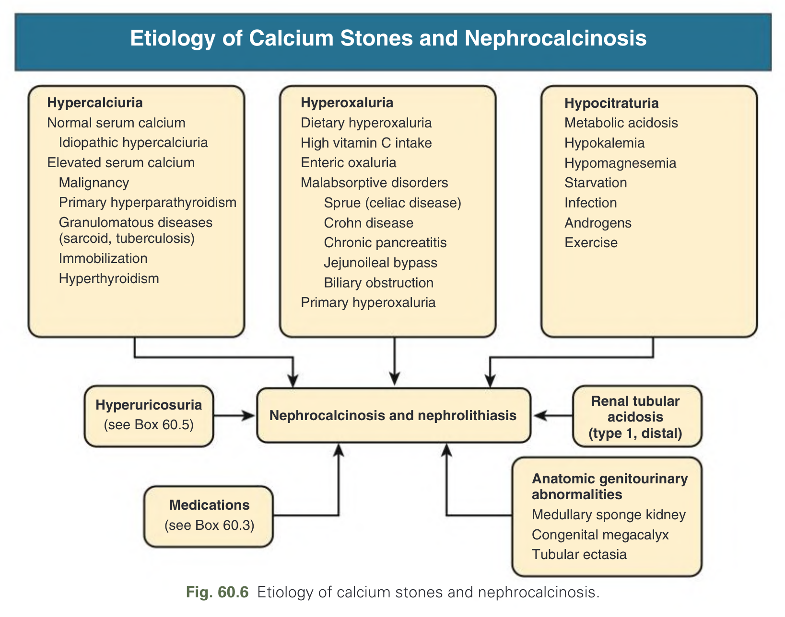

Fig. 60.6 Etiology of calcium stones and nephrocalcinosis.

---

### Fig_60_7

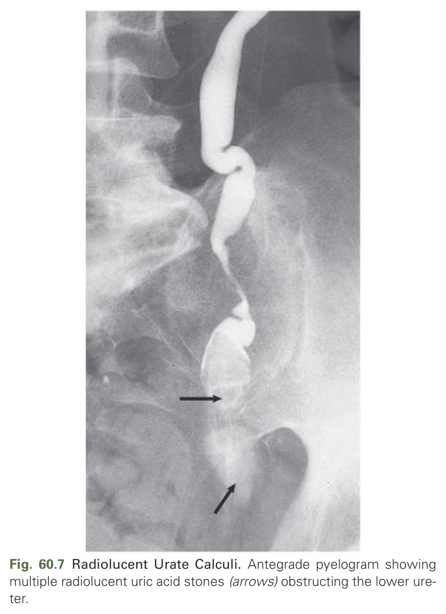

Fig. 60.7 Radiolucent Urate Calculi. Antegrade pyelogram showing multiple radiolucent uric acid stones (arrows) obstructing the lower ureter.

---

### Fig_60_8

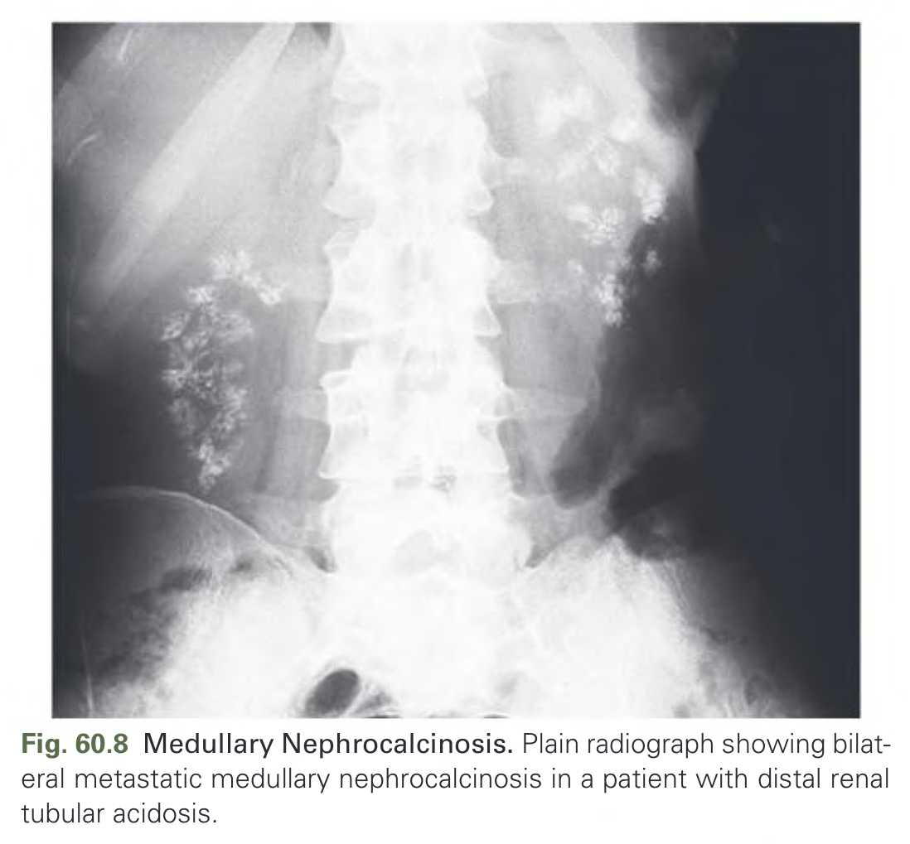

Fig. 60.8 Medullary Nephrocalcinosis. Plain radiograph showing bilateral metastatic medullary nephrocalcinosis in a patient with distal renal tubular acidosis.

---

### Fig_60_9

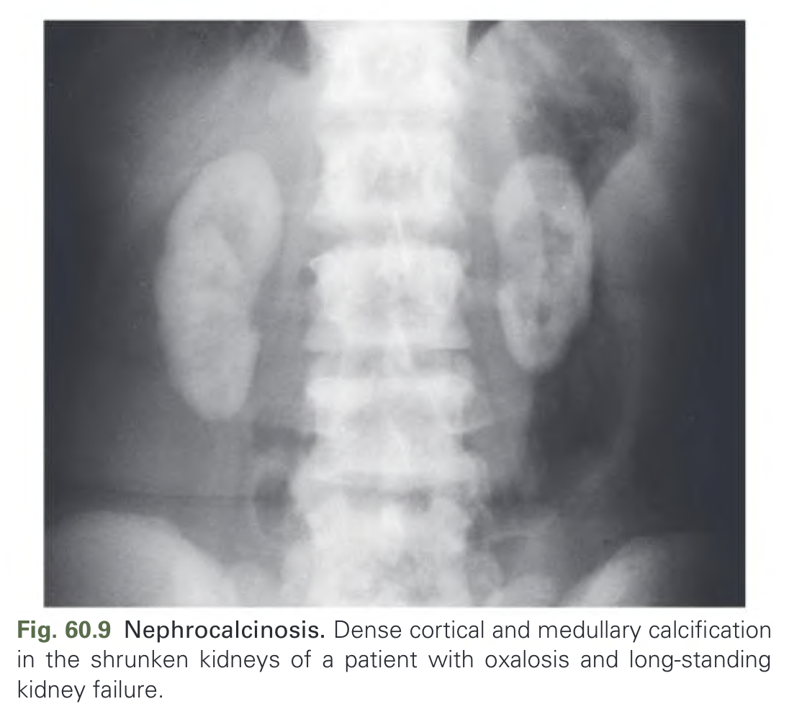

Fig. 60.9 Nephrocalcinosis. Dense cortical and medullary calcification in the shrunken kidneys of a patient with oxalosis and long-standing kidney failure.

---

### Fig_60_10

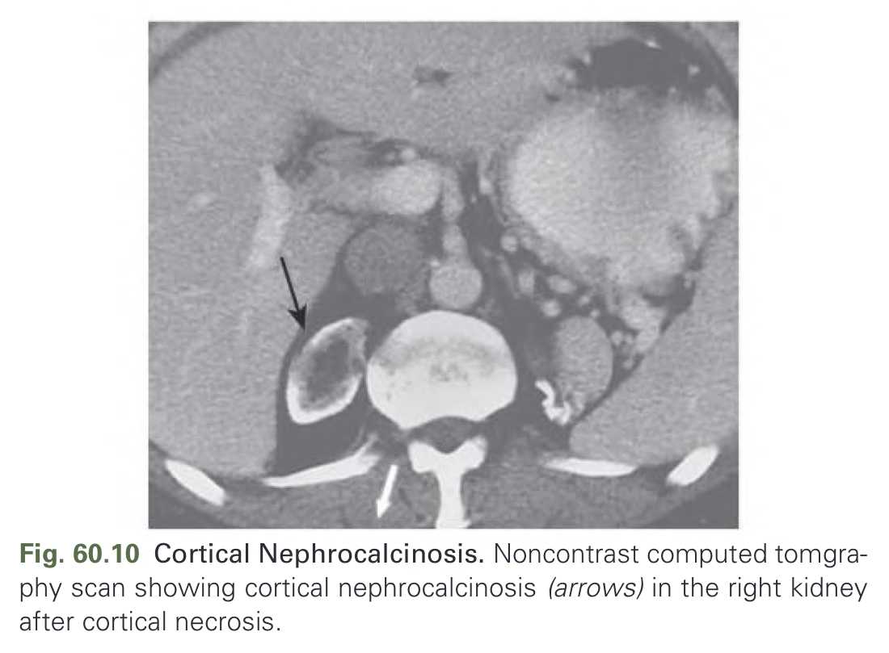

Fig. 60.10 Cortical Nephrocalcinosis. Noncontrast computed tomgraphy scan showing cortical nephrocalcinosis (arrows) in the right kidney after cortical necrosis.

---

## Tables

### Table_60_1

#### Table Image

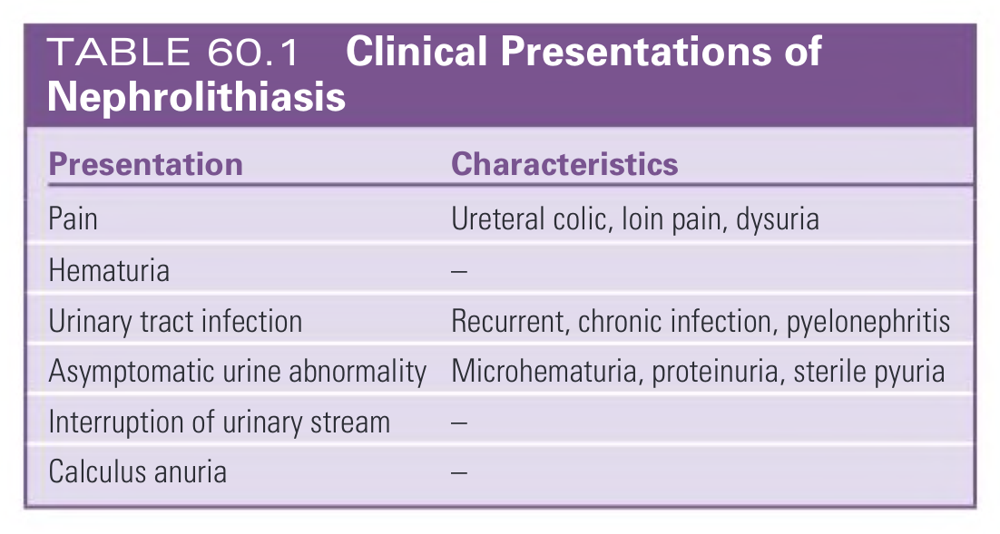

#### Table Data (CSV: [Table_60_1.csv](Table_60_1.csv))

```markdown
| Presentation | Characteristics |
| :--- | :--- |
| Pain | Ureteral colic, loin pain, dysuria |
| Hematuria | - |
| Urinary tract infection | Recurrent, chronic infection, pyelonephritis |
| Asymptomatic urine abnormality | Microhematuria, proteinuria, sterile pyuria |
| Interruption of urinary stream | - |
| Calculus anuria | - |
```

TABLE 60.1 Clinical Presentations of Nephrolithiasis

---

### Table_60_2

#### Table Image

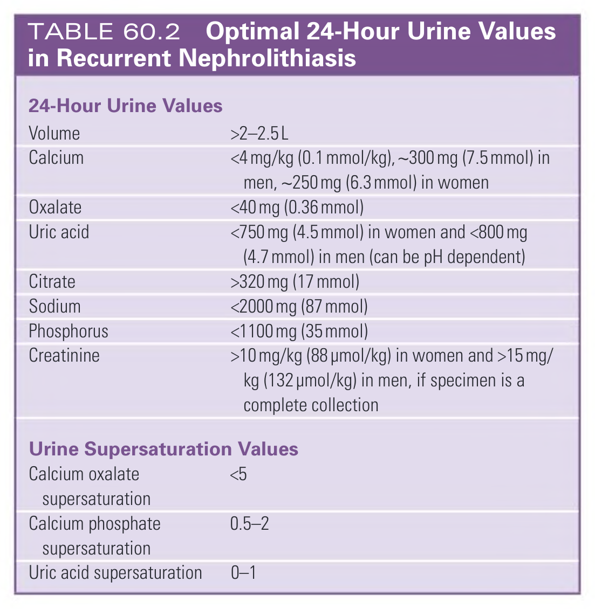

#### Table Data (CSV: [Table_60_2.csv](Table_60_2.csv))

```markdown
**24-Hour Urine Values**
| | |
| :--- | :--- |
| Volume | >2-2.5L |
| Calcium | <4 mg/kg (0.1 mmol/kg), ~300 mg (7.5 mmol) in men, ~250 mg (6.3 mmol) in women |
| Oxalate | <40 mg (0.36 mmol) |
| Uric acid | <750 mg (4.5 mmol) in women and <800 mg (4.7 mmol) in men (can be pH dependent) |
| Citrate | >320 mg (17 mmol) |
| Sodium | <2000 mg (87 mmol) |
| Phosphorus | <1100 mg (35 mmol) |
| Creatinine | >10mg/kg (88 µmol/kg) in women and >15 mg/ kg (132 µmol/kg) in men, if specimen is a complete collection |

**Urine Supersaturation Values**
| | |
| :--- | :--- |
| Calcium oxalate supersaturation | <5 |
| Calcium phosphate supersaturation | 0.5-2 |
| Uric acid supersaturation | 0-1 |
```

TABLE 60.2 Optimal 24-Hour Urine Values in Recurrent Nephrolithiasis

---

## Boxes

### Box_60_1

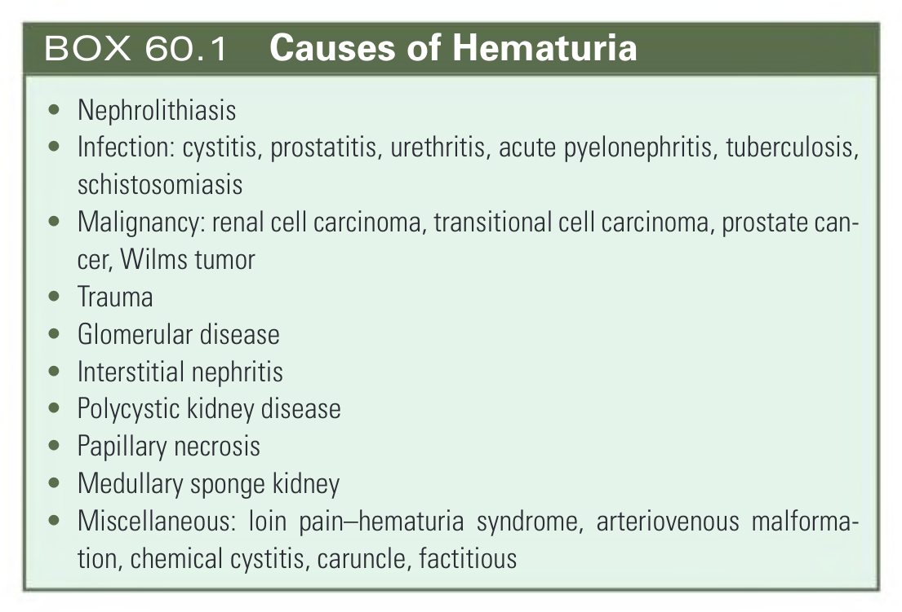

#### Box Text

```markdown
* Nephrolithiasis
* Infection: cystitis, prostatitis, urethritis, acute pyelonephritis, tuberculosis, schistosomiasis
* Malignancy: renal cell carcinoma, transitional cell carcinoma, prostate cancer, Wilms tumor
* Trauma
* Glomerular disease
* Interstitial nephritis
* Polycystic kidney disease
* Papillary necrosis
* Medullary sponge kidney
* Miscellaneous: loin pain-hematuria syndrome, arteriovenous malformation, chemical cystitis, caruncle, factitious
```

BOX 60.1 Causes of Hematuria

---

### Box_60_2

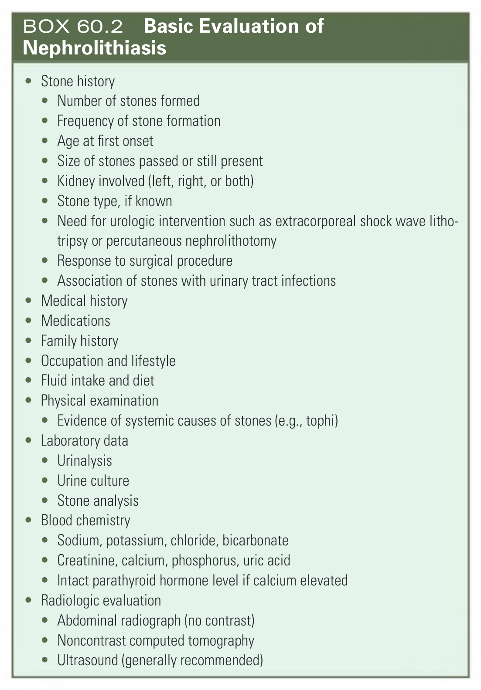

#### Box Text

```markdown
* Stone history
* Number of stones formed
* Frequency of stone formation
* Age at first onset
* Size of stones passed or still present
* Kidney involved (left, right, or both)
* Stone type, if known
* Need for urologic intervention such as extracorporeal shock wave lithotripsy or percutaneous nephrolithotomy
* Response to surgical procedure
* Association of stones with urinary tract infections
* Medical history
* Medications
* Family history
* Occupation and lifestyle
* Fluid intake and diet
* Physical examination
* Evidence of systemic causes of stones (e.g., tophi)
* Laboratory data
* Urinalysis
* Urine culture
* Stone analysis
* Blood chemistry
* Sodium, potassium, chloride, bicarbonate
* Creatinine, calcium, phosphorus, uric acid
* Intact parathyroid hormone level if calcium elevated
* Radiologic evaluation
* Abdominal radiograph (no contrast)
* Noncontrast computed tomography
* Ultrasound (generally recommended)
```

BOX 60.2 Basic Evaluation of Nephrolithiasis

---

### Box_60_3

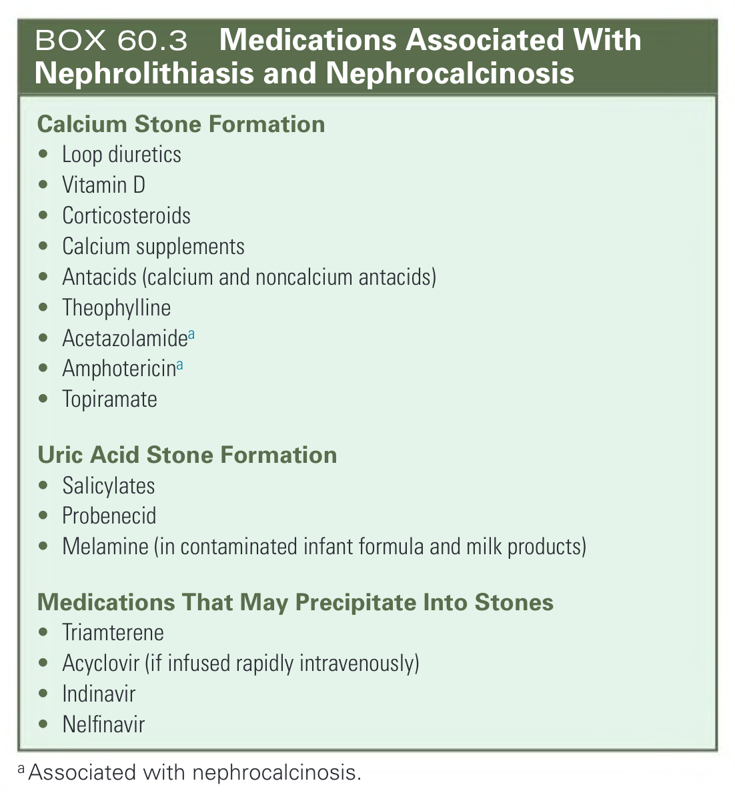

#### Box Text

```markdown
**Calcium Stone Formation**
* Loop diuretics
* Vitamin D
* Corticosteroids
* Calcium supplements
* Antacids (calcium and noncalcium antacids)
* Theophylline
* Acetazolamidea
* Amphotericina
* Topiramate

**Uric Acid Stone Formation**
* Salicylates
* Probenecid
* Melamine (in contaminated infant formula and milk products)

**Medications That May Precipitate Into Stones**
* Triamterene
* Acyclovir (if infused rapidly intravenously)
* Indinavir
* Nelfinavir

a Associated with nephrocalcinosis.
```

BOX 60.3 Medications Associated With Nephrolithiasis and Nephrocalcinosis

---

### Box_60_4

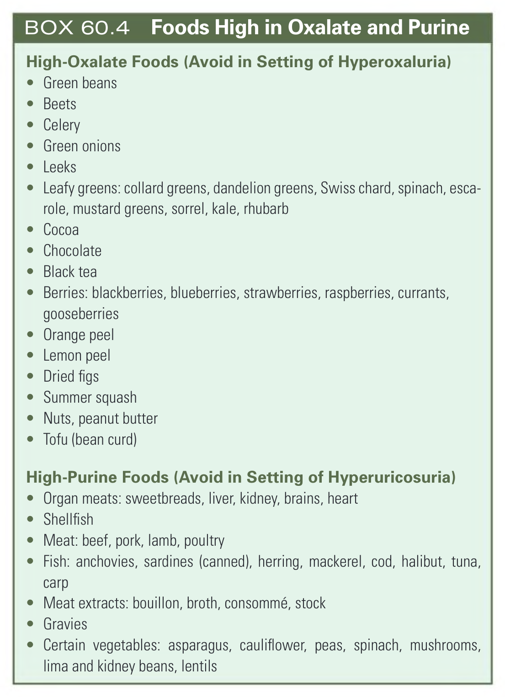

#### Box Text

```markdown
**High-Oxalate Foods (Avoid in Setting of Hyperoxaluria)**
* Green beans
* Beets
* Celery
* Green onions
* Leeks
* Leafy greens: collard greens, dandelion greens, Swiss chard, spinach, escarole, mustard greens, sorrel, kale, rhubarb
* Cocoa
* Chocolate
* Black tea
* Berries: blackberries, blueberries, strawberries, raspberries, currants, gooseberries
* Orange peel
* Lemon peel
* Dried figs
* Summer squash
* Nuts, peanut butter
* Tofu (bean curd)

**High-Purine Foods (Avoid in Setting of Hyperuricosuria)**
* Organ meats: sweetbreads, liver, kidney, brains, heart
* Shellfish
* Meat: beef, pork, lamb, poultry
* Fish: anchovies, sardines (canned), herring, mackerel, cod, halibut, tuna, carp
* Meat extracts: bouillon, broth, consommé, stock
* Gravies
* Certain vegetables: asparagus, cauliflower, peas, spinach, mushrooms, lima and kidney beans, lentils
```

BOX 60.4 Foods High in Oxalate and Purine

---

### Box_60_5

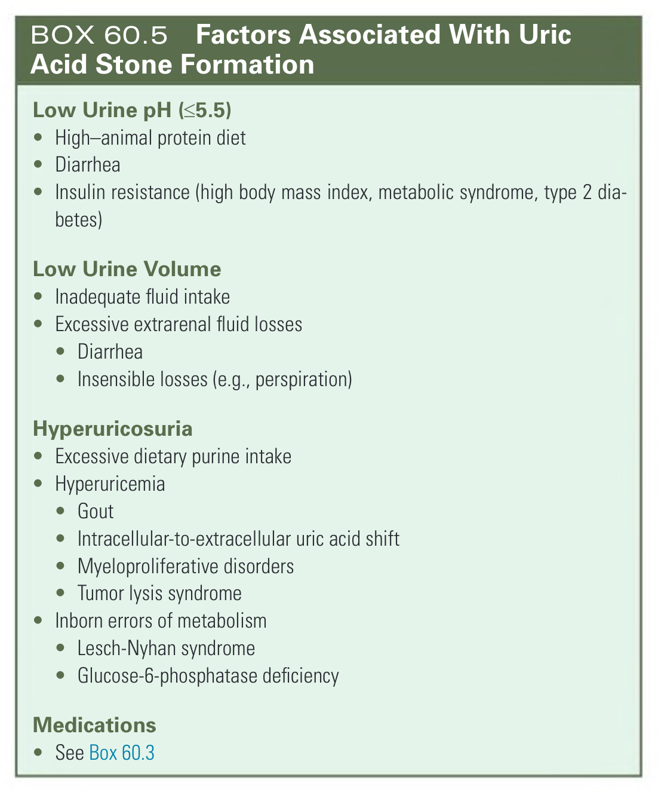

#### Box Text

```markdown
**Low Urine pH (≤5.5)**
* High-animal protein diet
* Diarrhea
* Insulin resistance (high body mass index, metabolic syndrome, type 2 diabetes)

**Low Urine Volume**
* Inadequate fluid intake
* Excessive extrarenal fluid losses
* Diarrhea
* Insensible losses (e.g., perspiration)

**Hyperuricosuria**
* Excessive dietary purine intake
* Hyperuricemia
* Gout
* Intracellular-to-extracellular uric acid shift
* Myeloproliferative disorders
* Tumor lysis syndrome
* Inborn errors of metabolism
* Lesch-Nyhan syndrome
* Glucose-6-phosphatase deficiency

**Medications**
* See Box 60.3
```

BOX 60.5 Factors Associated With Uric Acid Stone Formation

---

### Box_60_6

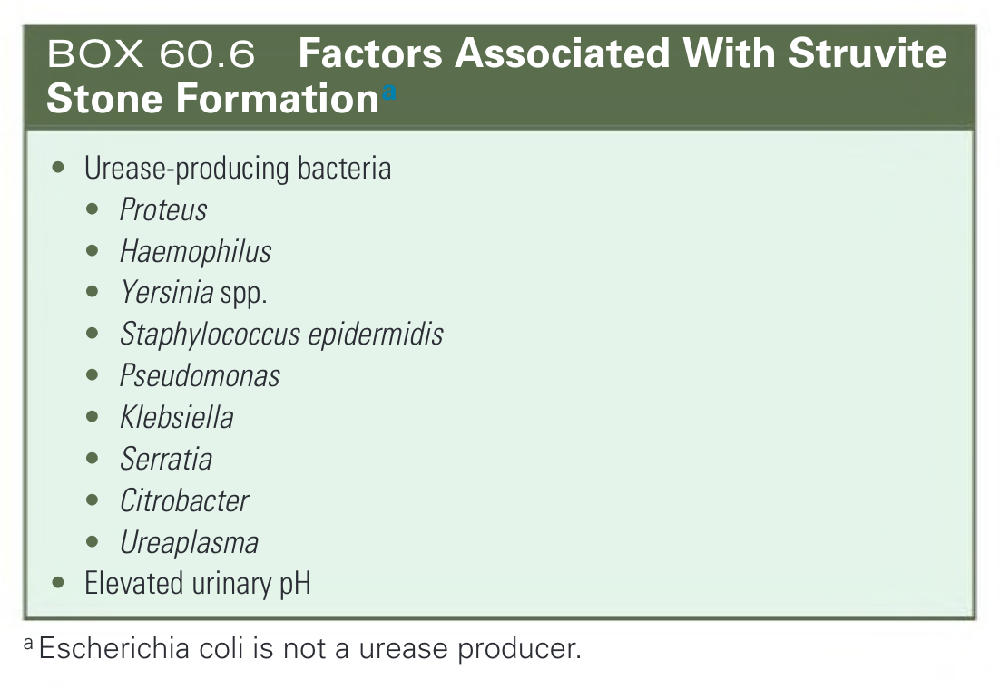

#### Box Text

```markdown
* Urease-producing bacteria
* Proteus
* Haemophilus
* Yersinia spp.
* Staphylococcus epidermidis
* Pseudomonas
* Klebsiella
* Serratia
* Citrobacter
* Ureaplasma
* Elevated urinary pH

a Escherichia coli is not a urease producer.
```

BOX 60.6 Factors Associated With Struvite Stone Formationa

---

### Box_60_7

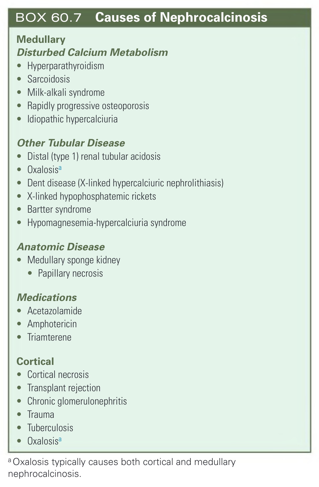

#### Box Text

```markdown
**Medullary**
* Disturbed Calcium Metabolism
	* Hyperparathyroidism
	* Sarcoidosis
	* Milk-alkali syndrome
	* Rapidly progressive osteoporosis
	* Idiopathic hypercalciuria
* Other Tubular Disease
	* Distal (type 1) renal tubular acidosis
	* Oxalosisa
	* Dent disease (X-linked hypercalciuric nephrolithiasis)
	* X-linked hypophosphatemic rickets
	* Bartter syndrome
	* Hypomagnesemia-hypercalciuria syndrome
* Anatomic Disease
	* Medullary sponge kidney
	* Papillary necrosis
* Medications
	* Acetazolamide
	* Amphotericin
	* Triamterene

**Cortical**
* Cortical necrosis
* Transplant rejection
* Chronic glomerulonephritis
* Trauma
* Tuberculosis
* Oxalosisa

a Oxalosis typically causes both cortical and medullary nephrocalcinosis.
```

BOX 60.7 Causes of Nephrocalcinosis

---
