# 061. Urinary Tract Obstruction - Figures and Tables Index

This document lists all figures, tables and boxes extracted from `061. Urinary Tract Obstruction.pdf`.

## Table of Contents
- [Figures](#figures)
- [Tables](#tables)
- [Boxes](#boxes)

---

## Figures

### Fig_61_1

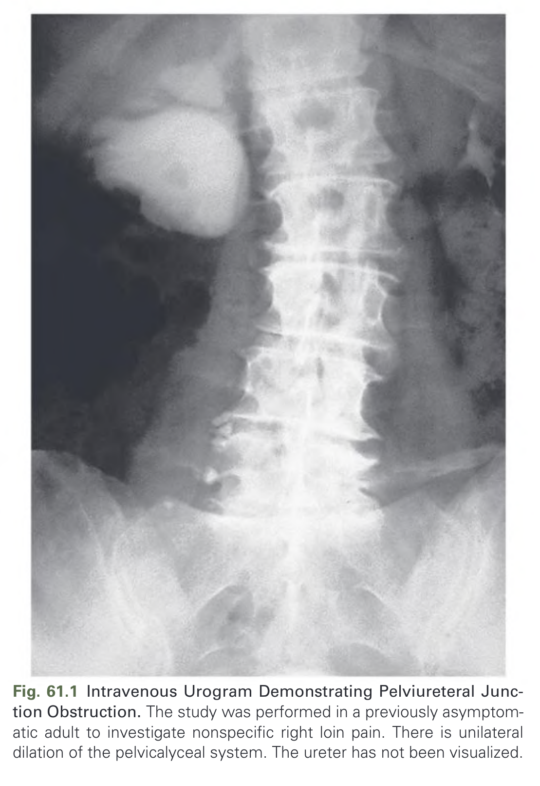

Fig. 61.1 Intravenous Urogram Demonstrating Pelviureteral Junction Obstruction. The study was performed in a previously asymptomatic adult to investigate nonspecific right loin pain. There is unilateral dilation of the pelvicalyceal system. The ureter has not been visualized.

---

### Fig_61_2

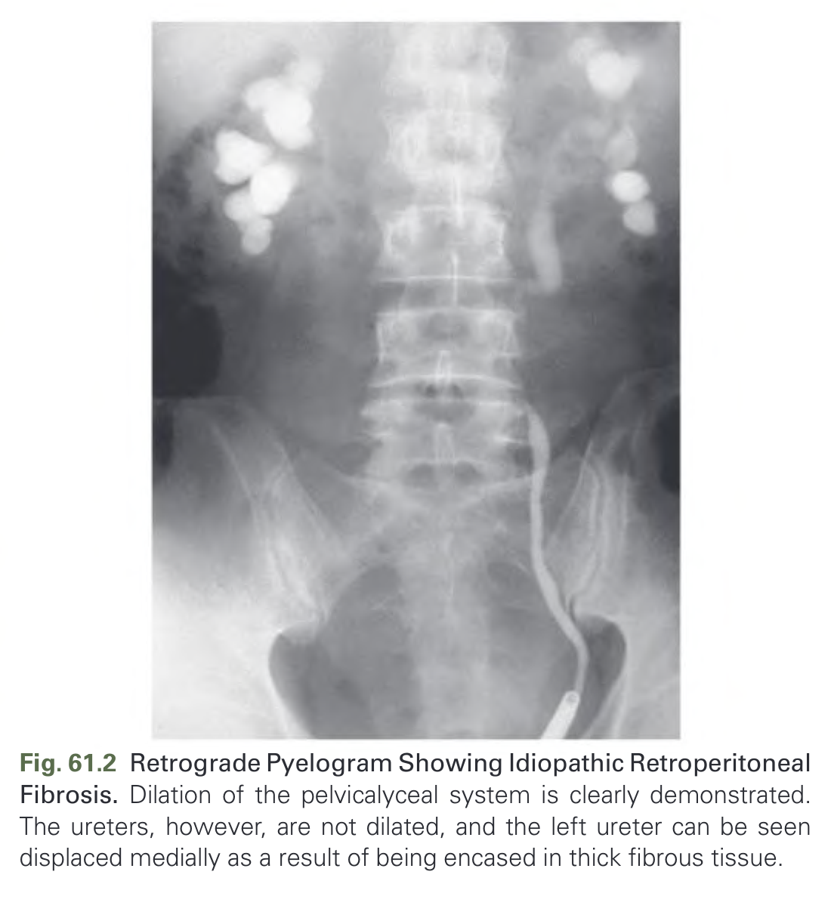

Fig. 61.2 Retrograde Pyelogram Showing Idiopathic Retroperitoneal Fibrosis. Dilation of the pelvicalyceal system is clearly demonstrated. The ureters, however, are not dilated, and the left ureter can be seen displaced medially as a result of being encased in thick fibrous tissue.

---

### Fig_61_3

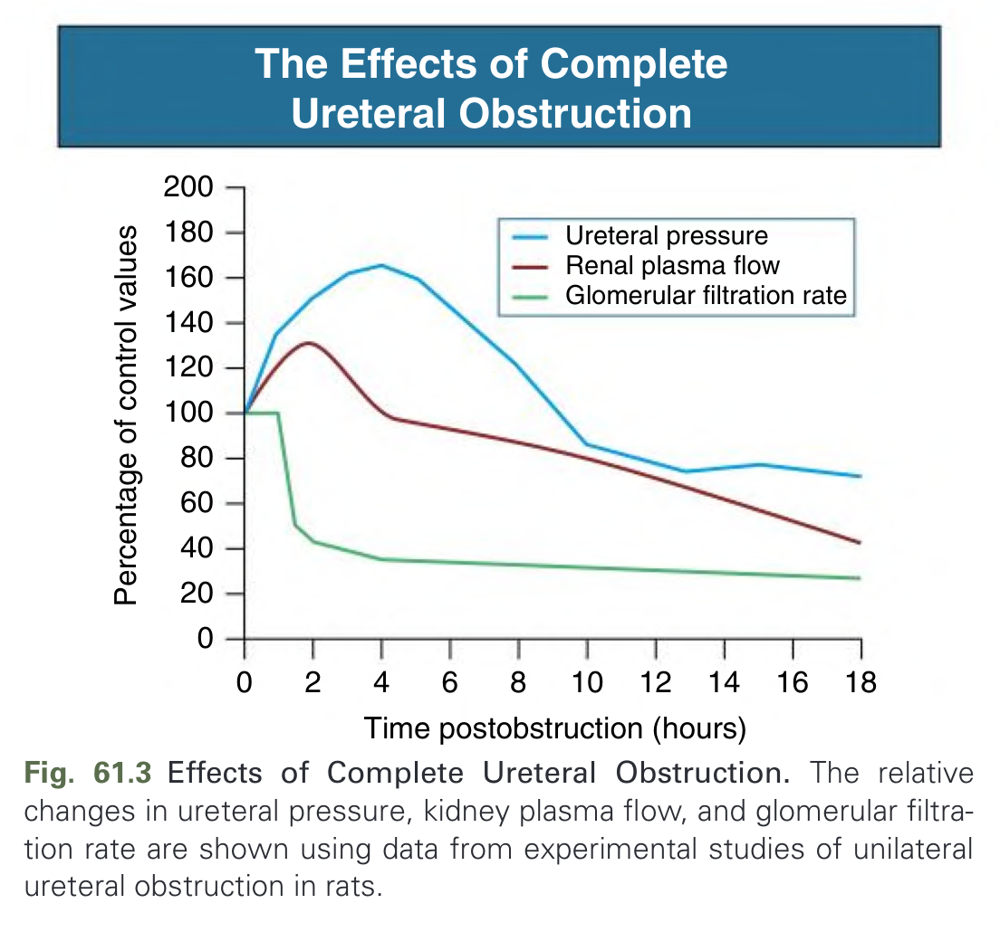

Fig. 61.3 Effects of Complete Ureteral Obstruction. The relative changes in ureteral pressure, kidney plasma flow, and glomerular filtration rate are shown using data from experimental studies of unilateral ureteral obstruction in rats.

---

### Fig_61_4

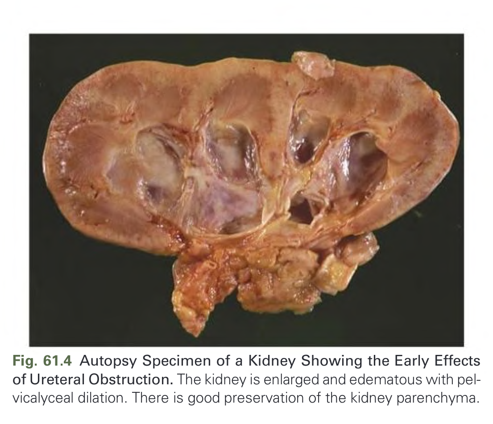

Fig. 61.4 Autopsy Specimen of a Kidney Showing the Early Effects of Ureteral Obstruction. The kidney is enlarged and edematous with pelvicalyceal dilation. There is good preservation of the kidney parenchyma.

---

### Fig_61_5

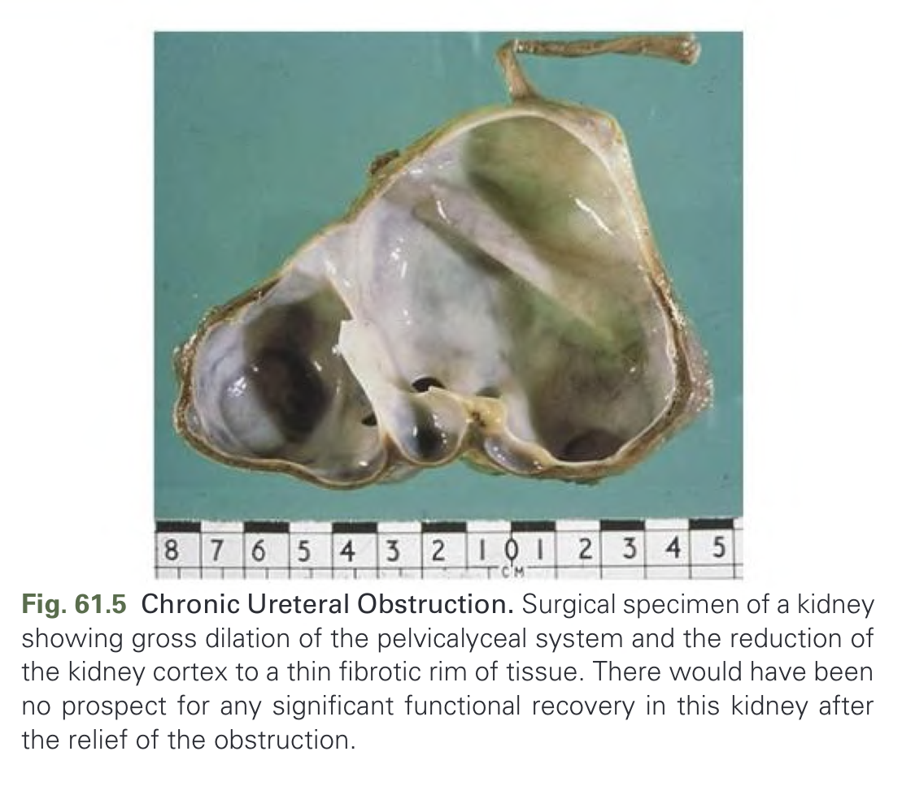

Fig. 61.5 Chronic Ureteral Obstruction. Surgical specimen of a kidney showing gross dilation of the pelvicalyceal system and the reduction of the kidney cortex to a thin fibrotic rim of tissue. There would have been no prospect for any significant functional recovery in this kidney after the relief of the obstruction.

---

### Fig_61_6

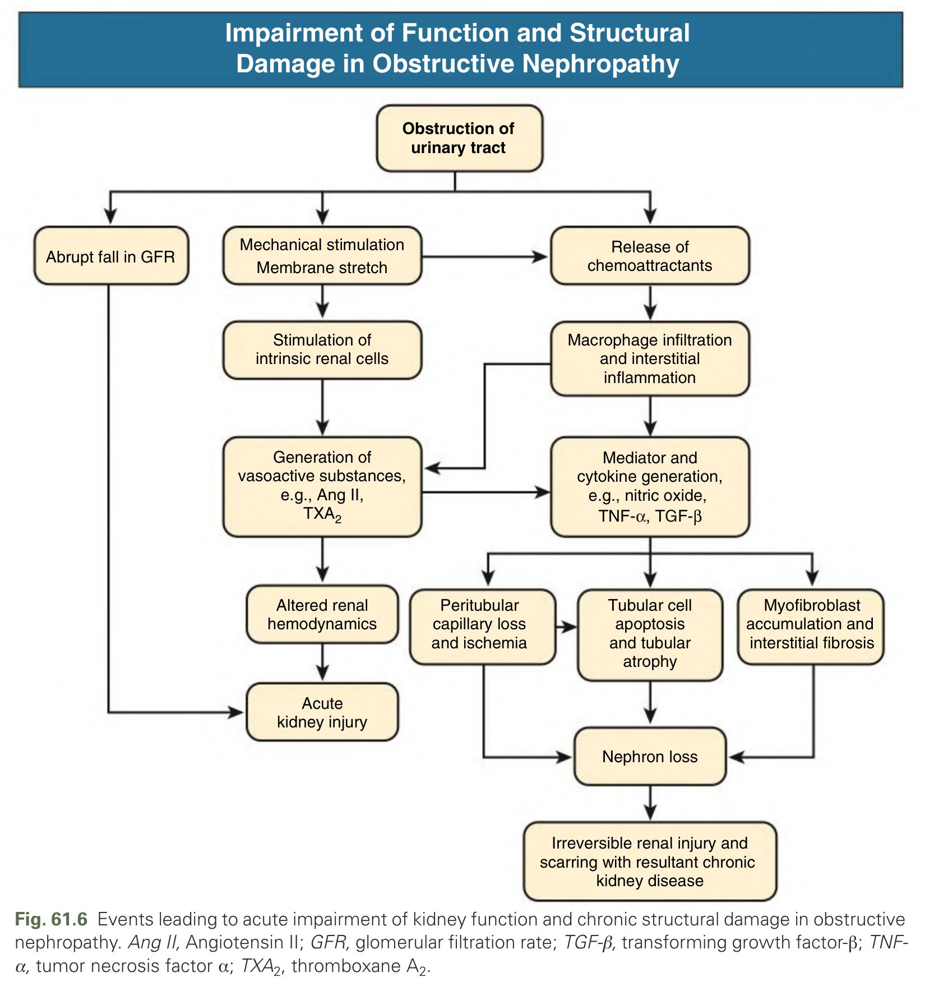

Fig. 61.6 Events leading to acute impairment of kidney function and chronic structural damage in obstructive nephropathy. Ang II, Angiotensin II; GFR, glomerular filtration rate; TGF-β, transforming growth factor-β; TNF-α, tumor necrosis factor α; TXA2, thromboxane A2.

---

### Fig_61_7

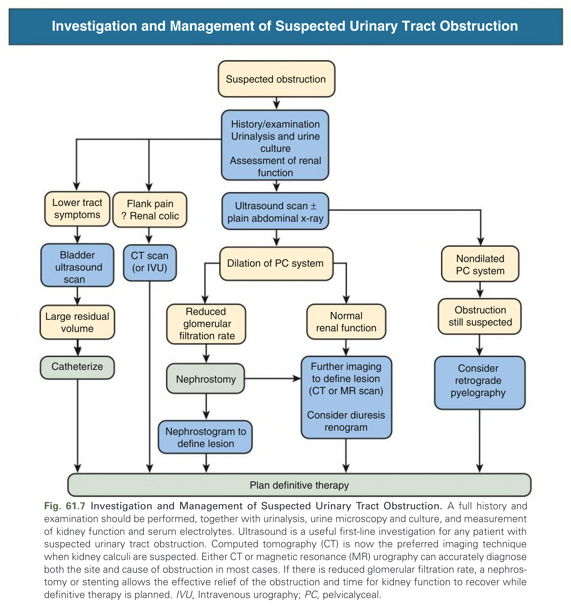

Fig. 61.7 Investigation and Management of Suspected Urinary Tract Obstruction. A full history and examination should be performed, together with urinalysis, urine microscopy and culture, and measurement of kidney function and serum electrolytes. Ultrasound is a useful first-line investigation for any patient with suspected urinary tract obstruction. Computed tomography (CT) is now the preferred imaging technique when kidney calculi are suspected. Either CT or magnetic resonance (MR) urography can accurately diagnose both the site and cause of obstruction in most cases. If there is reduced glomerular filtration rate, a nephrostomy or stenting allows the effective relief of the obstruction and time for kidney function to recover while definitive therapy is planned. IVU, Intravenous urography; PC, pelvicalyceal.

---

### Fig_61_8

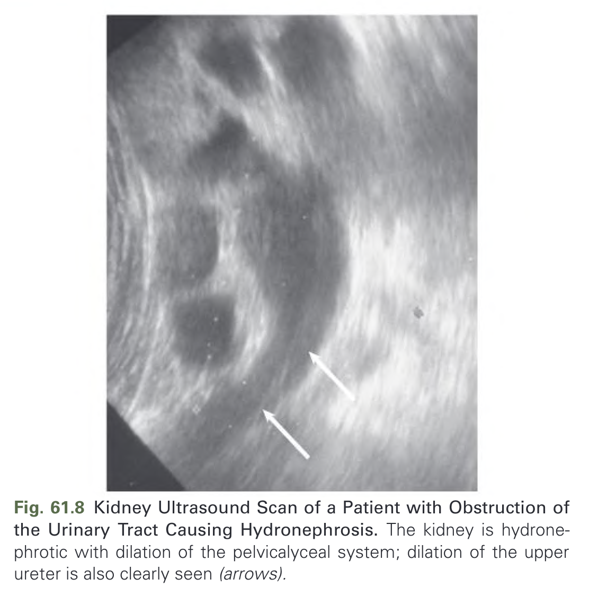

Fig. 61.8 Kidney Ultrasound Scan of a Patient with Obstruction of the Urinary Tract Causing Hydronephrosis. The kidney is hydronephrotic with dilation of the pelvicalyceal system; dilation of the upper ureter is also clearly seen (arrows).

---

### Fig_61_9

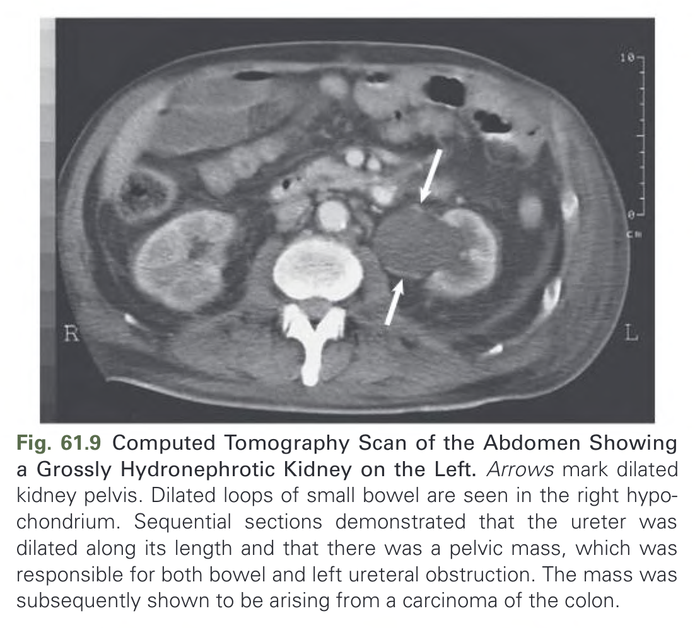

Fig. 61.9 Computed Tomography Scan of the Abdomen Showing a Grossly Hydronephrotic Kidney on the Left. Arrows mark dilated kidney pelvis. Dilated loops of small bowel are seen in the right hypochondrium. Sequential sections demonstrated that the ureter was dilated along its length and that there was a pelvic mass, which was responsible for both bowel and left ureteral obstruction. The mass was subsequently shown to be arising from a carcinoma of the colon.

---

### Fig_61_10

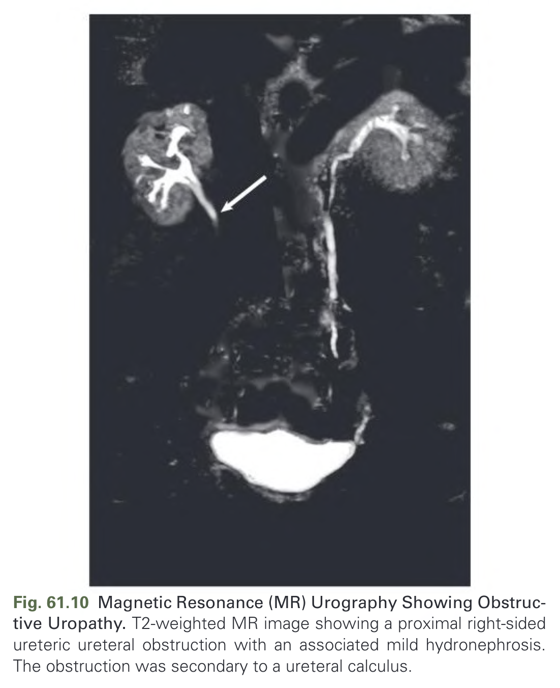

Fig. 61.10 Magnetic Resonance (MR) Urography Showing Obstructive Uropathy. T2-weighted MR image showing a proximal right-sided ureteric ureteral obstruction with an associated mild hydronephrosis. The obstruction was secondary to a ureteral calculus.

---

### Fig_61_11

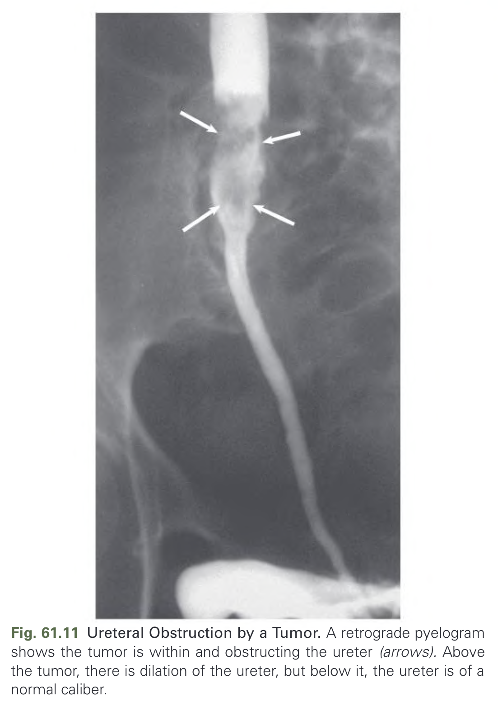

Fig. 61.11 Ureteral Obstruction by a Tumor. A retrograde pyelogram shows the tumor is within and obstructing the ureter (arrows). Above the tumor, there is dilation of the ureter, but below it, the ureter is of a normal caliber.

---

### Fig_61_12

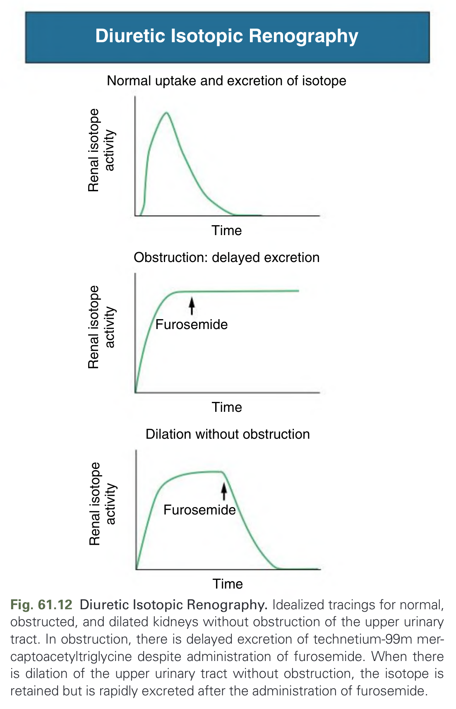

Fig. 61.12 Diuretic Isotopic Renography. Idealized tracings for normal, obstructed, and dilated kidneys without obstruction of the upper urinary tract. In obstruction, there is delayed excretion of technetium-99m mercaptoacetyltriglycine despite administration of furosemide. When there is dilation of the upper urinary tract without obstruction, the isotope is retained but is rapidly excreted after the administration of furosemide.

---

### Fig_61_13

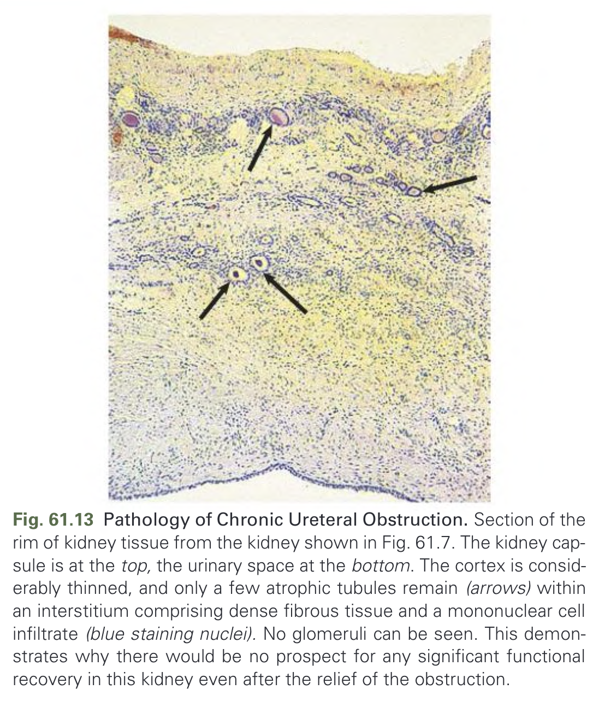

Fig. 61.13 Pathology of Chronic Ureteral Obstruction. Section of the rim of kidney tissue from the kidney shown in Fig. 61.7. The kidney capsule is at the top, the urinary space at the bottom. The cortex is considerably thinned, and only a few atrophic tubules remain (arrows) within an interstitium comprising dense fibrous tissue and a mononuclear cell infiltrate (blue staining nuclei). No glomeruli can be seen. This demonstrates why there would be no prospect for any significant functional recovery in this kidney even after the relief of the obstruction.

---

### Fig_61_14

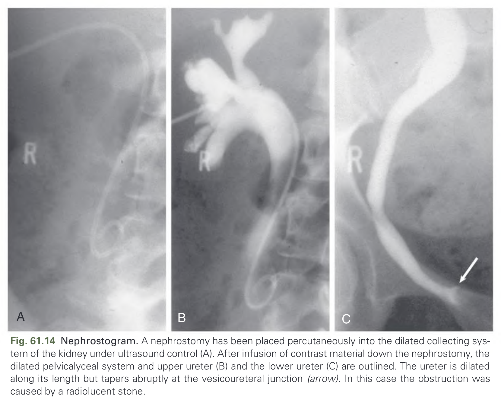

Fig. 61.14 Nephrostogram. A nephrostomy has been placed percutaneously into the dilated collecting system of the kidney under ultrasound control (A). After infusion of contrast material down the nephrostomy, the dilated pelvicalyceal system and upper ureter (B) and the lower ureter (C) are outlined. The ureter is dilated along its length but tapers abruptly at the vesicoureteral junction (arrow). In this case the obstruction was caused by a radiolucent stone.

---

## Tables

*No tables resolved for this chapter.*

## Boxes

### Box_61_1

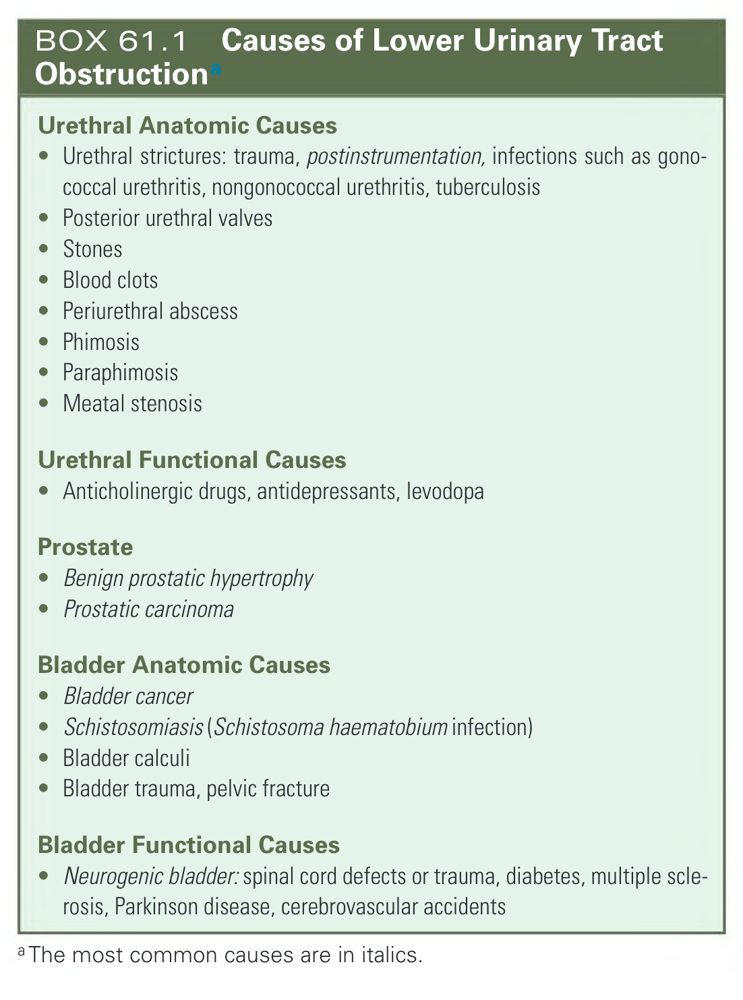

#### Box Text

```markdown
**Urethral Anatomic Causes**
* Urethral strictures: trauma, postinstrumentation, infections such as gonococcal urethritis, nongonococcal urethritis, tuberculosis
* Posterior urethral valves
* Stones
* Blood clots
* Periurethral abscess
* Phimosis
* Paraphimosis
* Meatal stenosis

**Urethral Functional Causes**
* Anticholinergic drugs, antidepressants, levodopa

**Prostate**
* Benign prostatic hypertrophy
* Prostatic carcinoma

**Bladder Anatomic Causes**
* Bladder cancer
* Schistosomiasis (Schistosoma haematobium infection)
* Bladder calculi
* Bladder trauma, pelvic fracture

**Bladder Functional Causes**
* Neurogenic bladder: spinal cord defects or trauma, diabetes, multiple sclerosis, Parkinson disease, cerebrovascular accidents

*The most common causes are in italics.*
```

BOX 61.1 Causes of Lower Urinary Tract Obstructiona

---

### Box_61_2

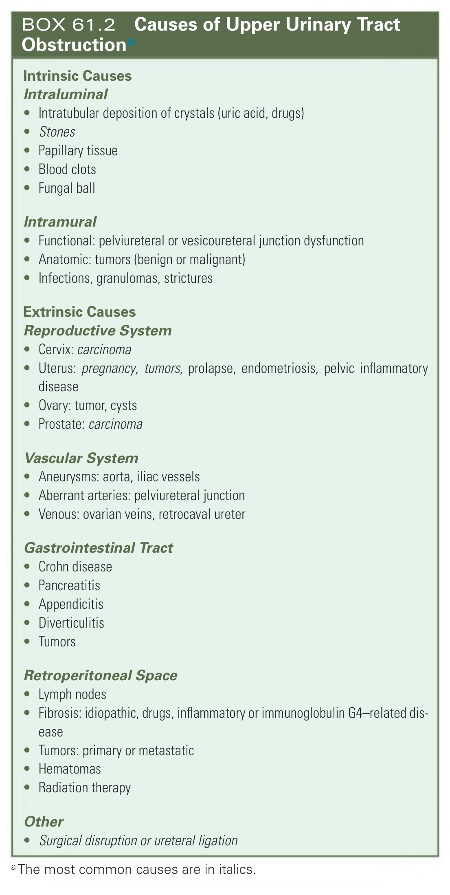

#### Box Text

```markdown
**Intrinsic Causes**
**Intraluminal**
* Intratubular deposition of crystals (uric acid, drugs)
* Stones
* Papillary tissue
* Blood clots
* Fungal ball

**Intramural**
* Functional: pelviureteral or vesicoureteral junction dysfunction
* Anatomic: tumors (benign or malignant)
* Infections, granulomas, strictures

**Extrinsic Causes**
**Reproductive System**
* Cervix: carcinoma
* Uterus: pregnancy, tumors, prolapse, endometriosis, pelvic inflammatory disease
* Ovary: tumor, cysts
* Prostate: carcinoma

**Vascular System**
* Aneurysms: aorta, iliac vessels
* Aberrant arteries: pelviureteral junction
* Venous: ovarian veins, retrocaval ureter

**Gastrointestinal Tract**
* Crohn disease
* Pancreatitis
* Appendicitis
* Diverticulitis
* Tumors

**Retroperitoneal Space**
* Lymph nodes
* Fibrosis: idiopathic, drugs, inflammatory or immunoglobulin G4-related disease
* Tumors: primary or metastatic
* Hematomas
* Radiation therapy

**Other**
* Surgical disruption or ureteral ligation

*The most common causes are in italics.*
```

BOX 61.2 Causes of Upper Urinary Tract Obstructiona

---
