# 062. Primary Vesicoureteral Reflux and Reflux Nephropathy - Figures and Tables Index

This document lists all figures, tables and boxes extracted from `062. Primary Vesicoureteral Reflux and Reflux Nephropathy.pdf`.

## Table of Contents
- [Figures](#figures)
- [Tables](#tables)
- [Boxes](#boxes)

---

## Figures

### Fig_62_1

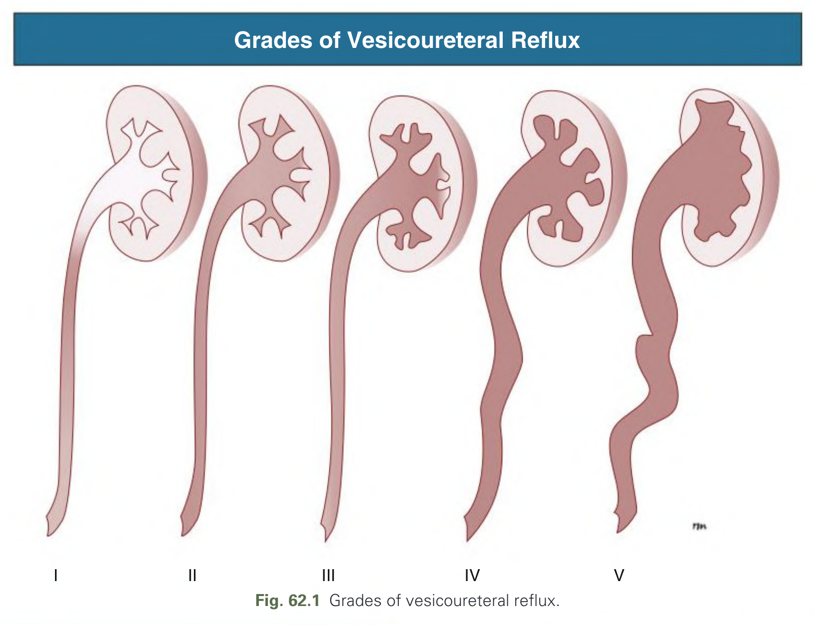

Fig. 62.1 Grades of vesicoureteral reflux.

---

### Fig_62_2

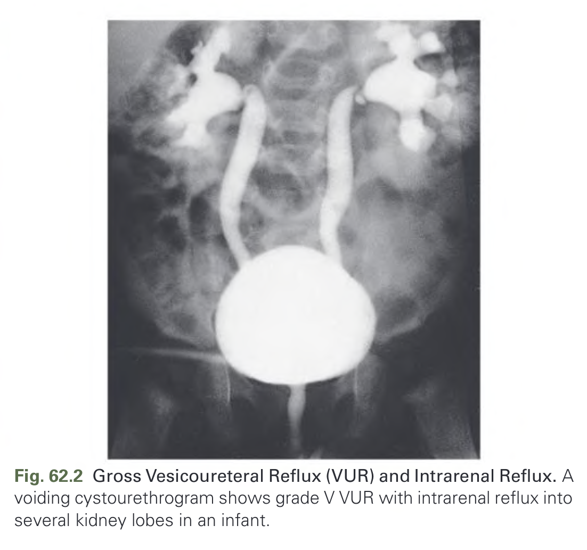

Fig. 62.2 Gross Vesicoureteral Reflux (VUR) and Intrarenal Reflux. A voiding cystourethrogram shows grade V VUR with intrarenal reflux into several kidney lobes in an infant.

---

### Fig_62_3

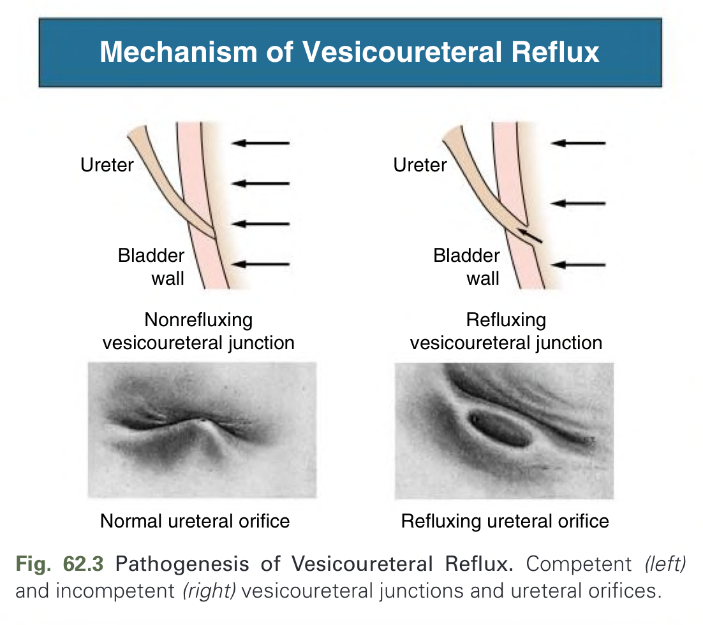

Fig. 62.3 Pathogenesis of Vesicoureteral Reflux. Competent (left) and incompetent (right) vesicoureteral junctions and ureteral orifices.

---

### Fig_62_4

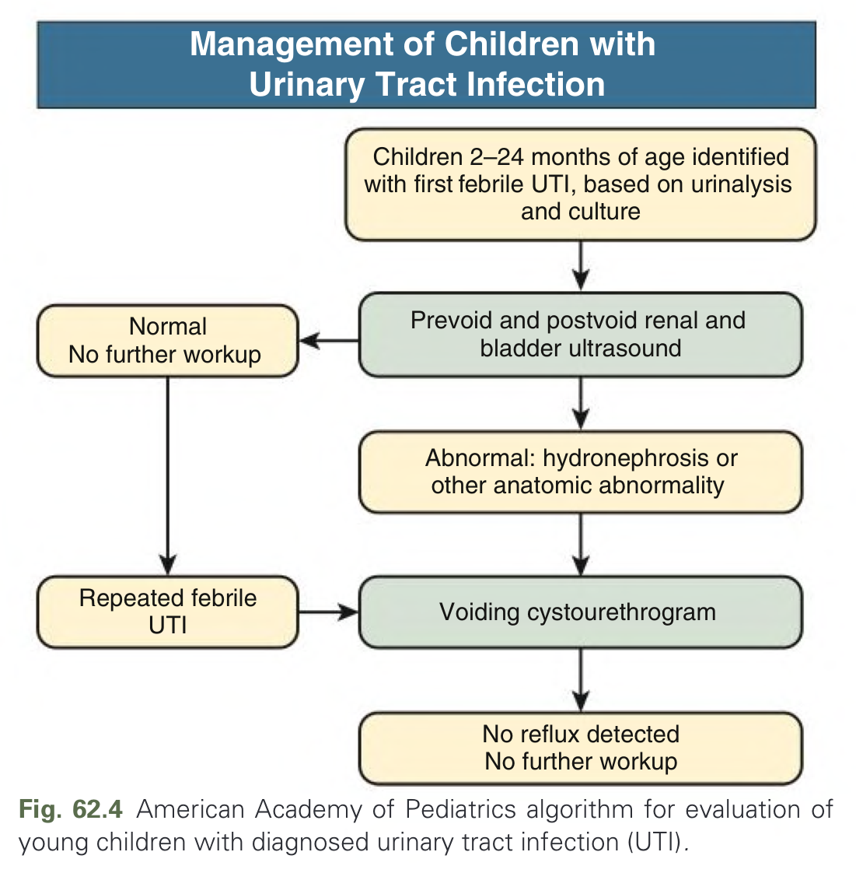

Fig. 62.4 American Academy of Pediatrics algorithm for evaluation of young children with diagnosed urinary tract infection (UTI).

---

### Fig_62_5

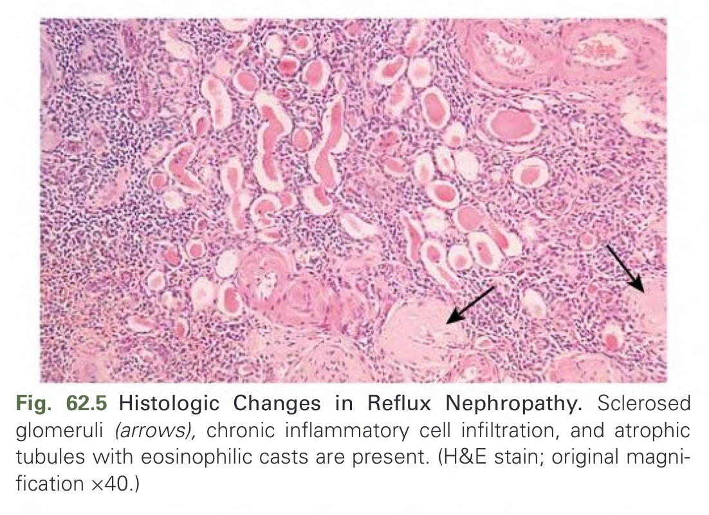

Fig. 62.5 Histologic Changes in Reflux Nephropathy. Sclerosed glomeruli (arrows), chronic inflammatory cell infiltration, and atrophic tubules with eosinophilic casts are present. (H&E stain; original magnification ×40.)

---

### Fig_62_6

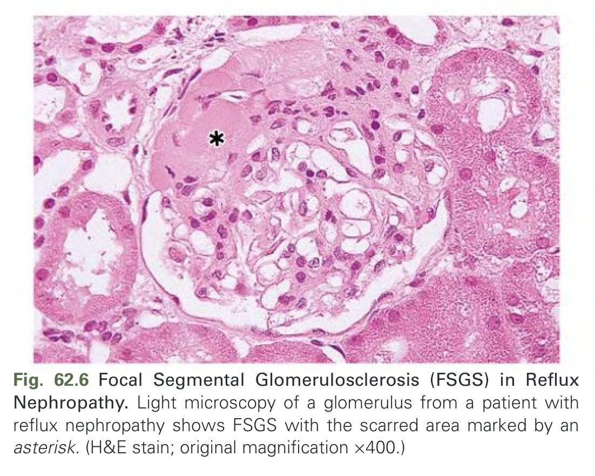

Fig. 62.6 Focal Segmental Glomerulosclerosis (FSGS) in Reflux Nephropathy. Light microscopy of a glomerulus from a patient with reflux nephropathy shows FSGS with the scarred area marked by an asterisk. (H&E stain; original magnification ×400.)

---

### Fig_62_7

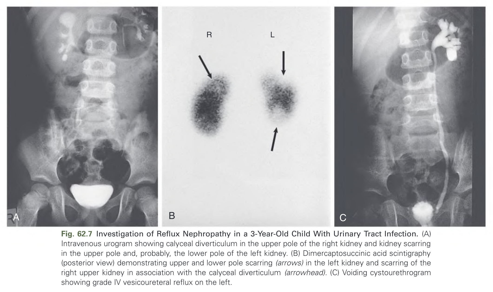

Fig. 62.7 Investigation of Reflux Nephropathy in a 3-Year-Old Child With Urinary Tract Infection. (A) Intravenous urogram showing calyceal diverticulum in the upper pole of the right kidney and kidney scarring in the upper pole and, probably, the lower pole of the left kidney. (B) Dimercaptosuccinic acid scintigraphy (posterior view) demonstrating upper and lower pole scarring (arrows) in the left kidney and scarring of the right upper kidney in association with the calyceal diverticulum (arrowhead). (C) Voiding cystourethrogram showing grade IV vesicoureteral reflux on the left.

---

## Tables

### Table_62_1

#### Table Image

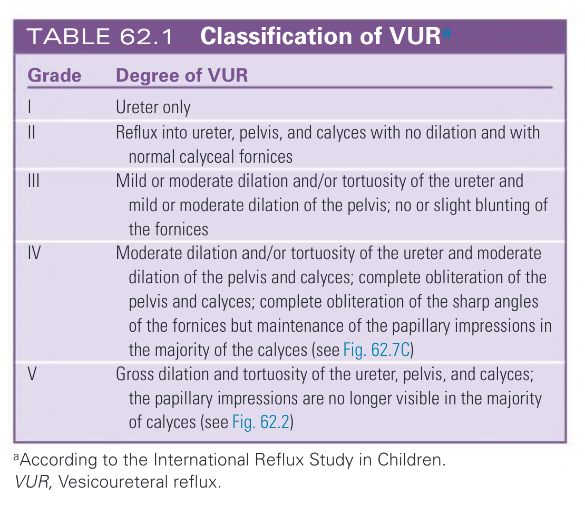

#### Table Data (CSV: [Table_62_1.csv](Table_62_1.csv))

```markdown
| Grade | Degree of VUR |
| :--- | :--- |
| I | Ureter only |
| II | Reflux into ureter, pelvis, and calyces with no dilation and with normal calyceal fornices |
| III | Mild or moderate dilation and/or tortuosity of the ureter and mild or moderate dilation of the pelvis; no or slight blunting of the fornices |
| IV | Moderate dilation and/or tortuosity of the ureter and moderate dilation of the pelvis and calyces; complete obliteration of the pelvis and calyces; complete obliteration of the sharp angles of the fornices but maintenance of the papillary impressions in the majority of the calyces (see Fig. 62.7C) |
| V | Gross dilation and tortuosity of the ureter, pelvis, and calyces; the papillary impressions are no longer visible in the majority of calyces (see Fig. 62.2) |
*^aAccording to the International Reflux Study in Children. VUR, Vesicoureteral reflux.*
```

TABLE 62.1 Classification of VUR^a

---

### Table_62_2

#### Table Image

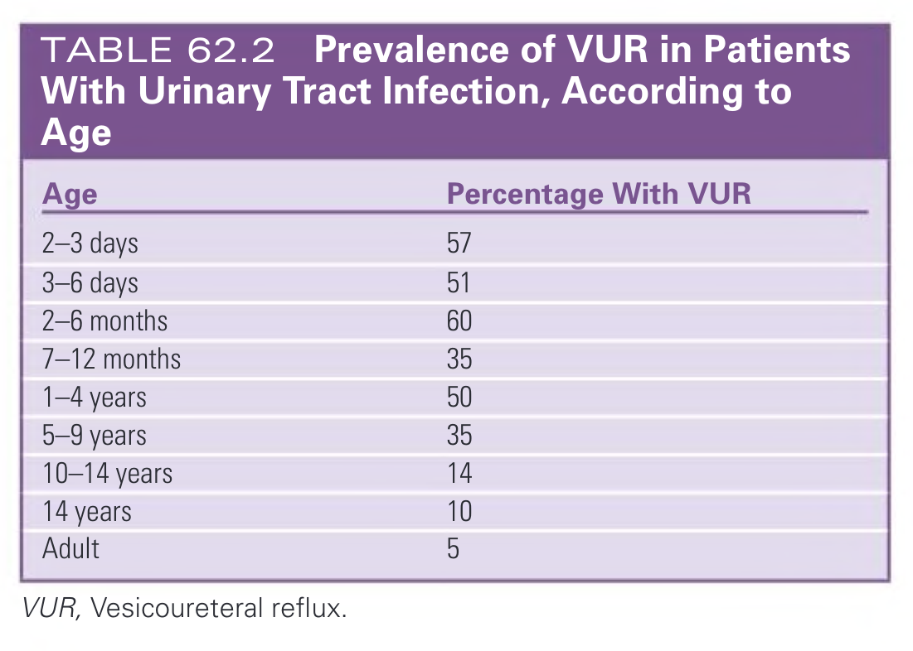

#### Table Data (CSV: [Table_62_2.csv](Table_62_2.csv))

```markdown
| Age | Percentage With VUR |
| :--- | :--- |
| 2-3 days | 57 |
| 3-6 days | 51 |
| 2-6 months | 60 |
| 7-12 months | 35 |
| 1-4 years | 50 |
| 5-9 years | 35 |
| 10-14 years | 14 |
| 14 years | 10 |
| Adult | 5 |
*VUR, Vesicoureteral reflux.*
```

TABLE 62.2 Prevalence of VUR in Patients With Urinary Tract Infection, According to Age

---

### Table_62_3

#### Table Image

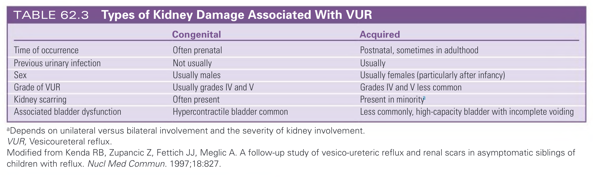

#### Table Data (CSV: [Table_62_3.csv](Table_62_3.csv))

```markdown
| | Congenital | Acquired |
| :--- | :--- | :--- |
| Time of occurrence | Often prenatal | Postnatal, sometimes in adulthood |
| Previous urinary infection | Not usually | Usually |
| Sex | Usually males | Usually females (particularly after infancy) |
| Grade of VUR | Usually grades IV and V | Grades IV and V less common |
| Kidney scarring | Often present | Present in minority^a |
| Associated bladder dysfunction | Hypercontractile bladder common | Less commonly, high-capacity bladder with incomplete voiding |
*^aDepends on unilateral versus bilateral involvement and the severity of kidney involvement. VUR, Vesicoureteral reflux.*
*Modified from Kenda RB, Zupancic Z, Fettich JJ, Meglic A. A follow-up study of vesico-ureteric reflux and renal scars in asymptomatic siblings of children with reflux. Nucl Med Commun. 1997;18:827.*
```

TABLE 62.3 Types of Kidney Damage Associated With VUR

---

### Table_62_4

#### Table Image

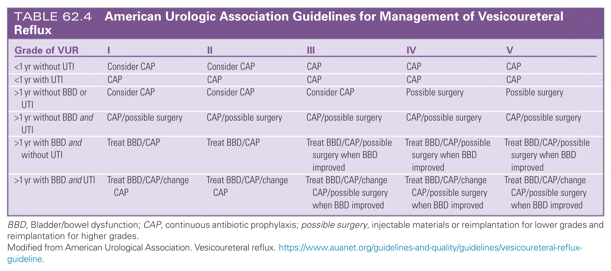

#### Table Data (CSV: [Table_62_4.csv](Table_62_4.csv))

```markdown
| Grade of VUR | I | II | III | IV | V |
| :--- | :--- | :--- | :--- | :--- | :--- |
| <1 yr without UTI | Consider CAP | Consider CAP | CAP | CAP | CAP |
| <1 yr with UTI | CAP | CAP | CAP | CAP | CAP |
| >1 yr without BBD or UTI | Consider CAP | Consider CAP | Consider CAP | Possible surgery | Possible surgery |
| >1 yr without BBD and UTI | CAP/possible surgery | CAP/possible surgery | CAP/possible surgery | CAP/possible surgery | CAP/possible surgery |
| >1 yr with BBD and without UTI | Treat BBD/CAP | Treat BBD/CAP | Treat BBD/CAP/possible surgery when BBD improved | Treat BBD/CAP/possible surgery when BBD improved | Treat BBD/CAP/possible surgery when BBD improved |
| >1 yr with BBD and UTI | Treat BBD/CAP/change CAP | Treat BBD/CAP/change CAP | Treat BBD/CAP/change CAP/possible surgery when BBD improved | Treat BBD/CAP/change CAP/possible surgery when BBD improved | Treat BBD/CAP/change CAP/possible surgery when BBD improved |
*BBD, Bladder/bowel dysfunction; CAP, continuous antibiotic prophylaxis; possible surgery, injectable materials or reimplantation for lower grades and reimplantation for higher grades.*
*Modified from American Urological Association. Vesicoureteral reflux. https://www.auanet.org/guidelines-and-quality/guidelines/vesicoureteral-reflux-guideline.*
```

TABLE 62.4 American Urologic Association Guidelines for Management of Vesicoureteral Reflux

---

### Table_62_5

#### Table Image

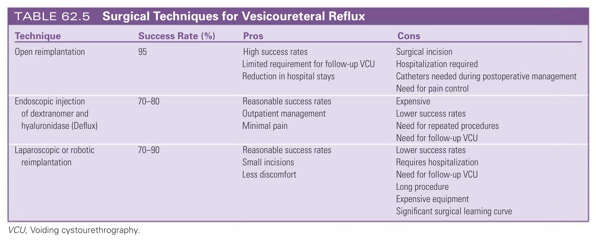

#### Table Data (CSV: [Table_62_5.csv](Table_62_5.csv))

```markdown
| Technique | Success Rate (%) | Pros | Cons |
| :--- | :--- | :--- | :--- |
| Open reimplantation | 95 | High success rates, Limited requirement for follow-up VCU, Reduction in hospital stays | Surgical incision, Hospitalization required, Catheters needed during postoperative management, Need for pain control |
| Endoscopic injection of dextranomer and hyaluronidase (Deflux) | 70–80 | Reasonable success rates, Outpatient management, Minimal pain | Expensive, Lower success rates, Need for repeated procedures, Need for follow-up VCU |
| Laparoscopic or robotic reimplantation | 70–90 | Reasonable success rates, Small incisions, Less discomfort | Lower success rates, Requires hospitalization, Need for follow-up VCU, Long procedure, Expensive equipment, Significant surgical learning curve |
*VCU, Voiding cystourethrography.*
```

TABLE 62.5 Surgical Techniques for Vesicoureteral Reflux

---

## Boxes

### Box_62_1

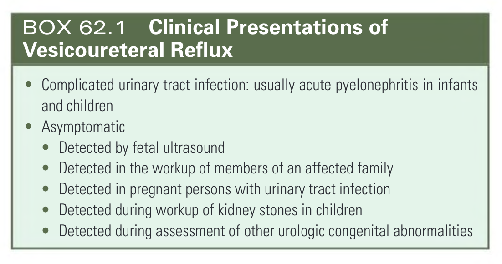

#### Box Text

```markdown
* Complicated urinary tract infection: usually acute pyelonephritis in infants and children
* Asymptomatic
* Detected by fetal ultrasound
* Detected in the workup of members of an affected family
* Detected in pregnant persons with urinary tract infection
* Detected during workup of kidney stones in children
* Detected during assessment of other urologic congenital abnormalities
```

BOX 62.1 Clinical Presentations of Vesicoureteral Reflux

---

### Box_62_2

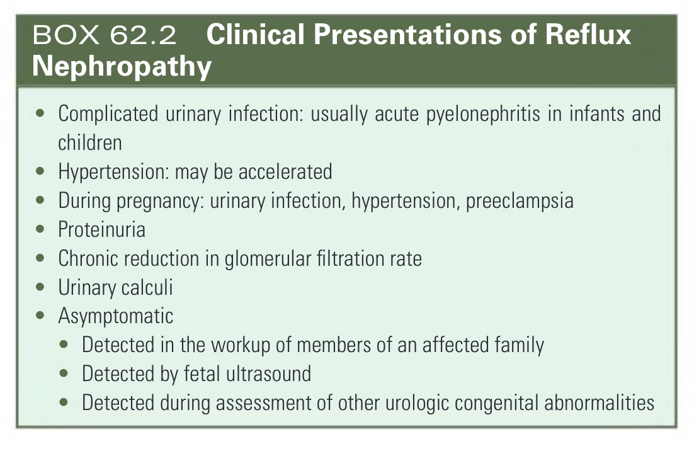

#### Box Text

```markdown
* Complicated urinary infection: usually acute pyelonephritis in infants and children
* Hypertension: may be accelerated
* During pregnancy: urinary infection, hypertension, preeclampsia
* Proteinuria
* Chronic reduction in glomerular filtration rate
* Urinary calculi
* Asymptomatic
	* Detected in the workup of members of an affected family
	* Detected by fetal ultrasound
	* Detected during assessment of other urologic congenital abnormalities
```

BOX 62.2 Clinical Presentations of Reflux Nephropathy

---
