# 063. Urologic Issues for the Nephrologist - Figures and Tables Index

This document lists all figures, tables and boxes extracted from `063. Urologic Issues for the Nephrologist.pdf`.

## Table of Contents
- [Figures](#figures)
- [Tables](#tables)
- [Boxes](#boxes)

---

## Figures

### Fig_63_1

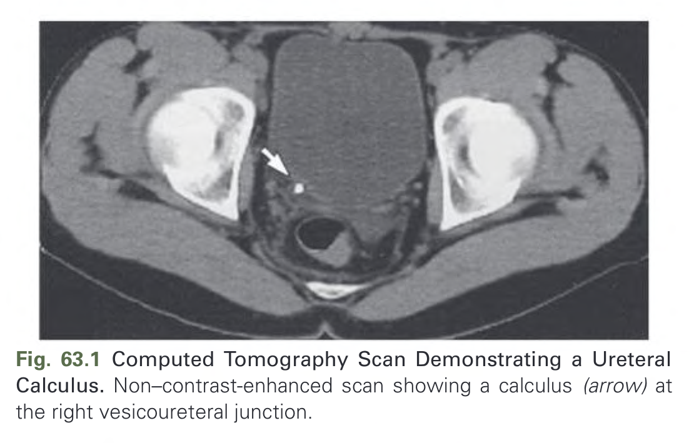

Fig. 63.1 Computed Tomography Scan Demonstrating a Ureteral Calculus. Non–contrast-enhanced scan showing a calculus (arrow) at the right vesicoureteral junction.

---

### Fig_63_2

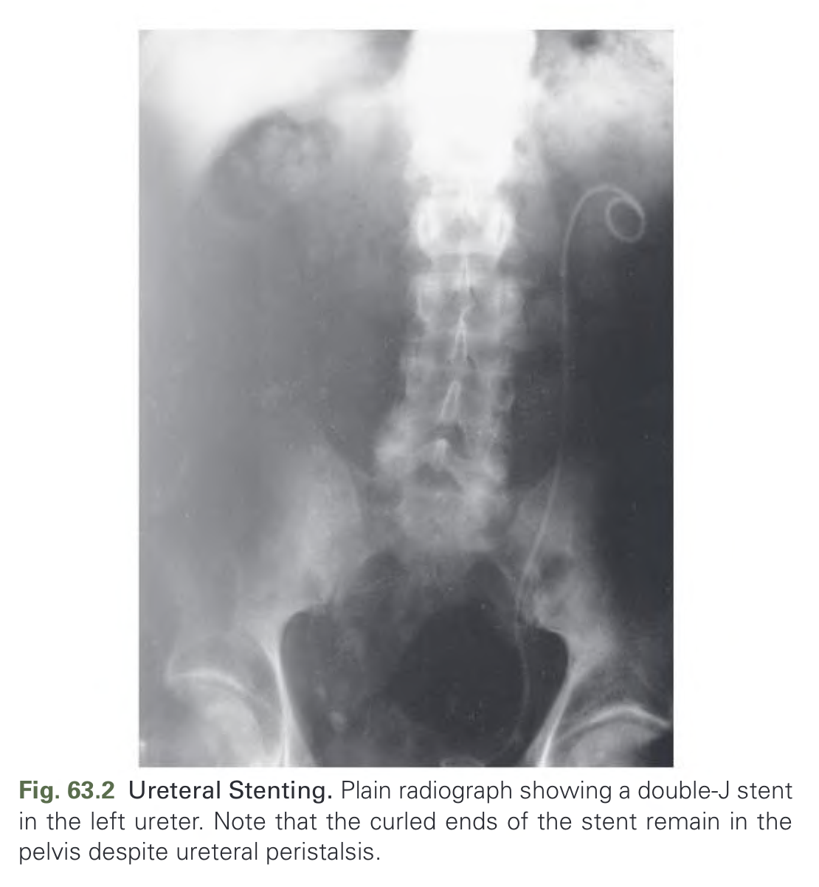

Fig. 63.2 Ureteral Stenting. Plain radiograph showing a double-J stent in the left ureter. Note that the curled ends of the stent remain in the pelvis despite ureteral peristalsis.

---

### Fig_63_3

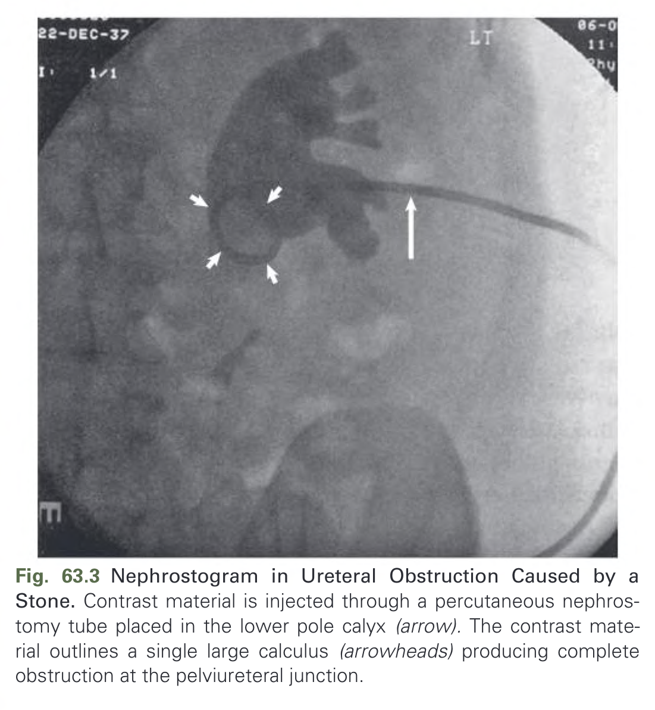

Fig. 63.3 Nephrostogram in Ureteral Obstruction Caused by a Stone. Contrast material is injected through a percutaneous nephrostomy tube placed in the lower pole calyx (arrow). The contrast material outlines a single large calculus (arrowheads) producing complete obstruction at the pelviureteral junction.

---

### Fig_63_4

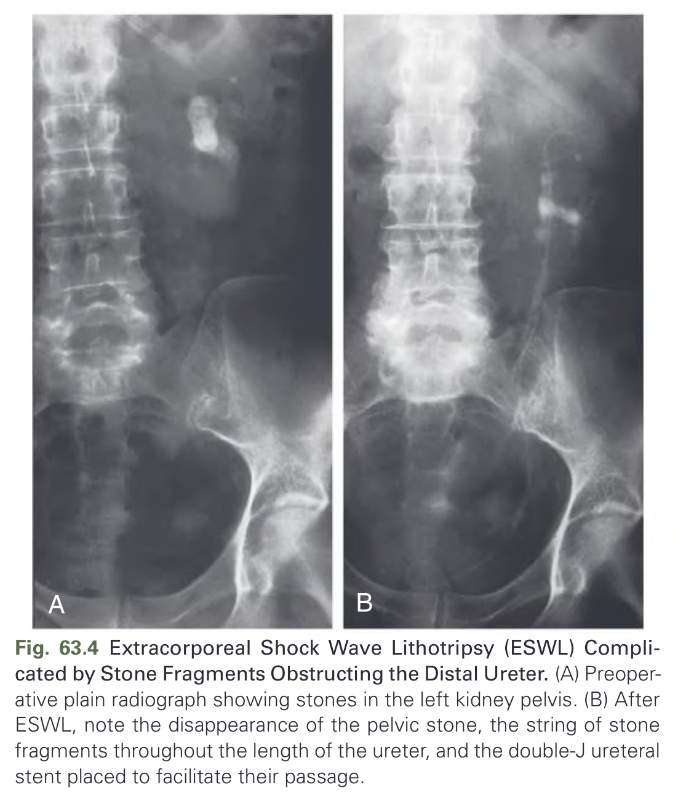

Fig. 63.4 Extracorporeal Shock Wave Lithotripsy (ESWL) Complicated by Stone Fragments Obstructing the Distal Ureter. (A) Preoperative plain radiograph showing stones in the left kidney pelvis. (B) After ESWL, note the disappearance of the pelvic stone, the string of stone fragments throughout the length of the ureter, and the double-J ureteral stent placed to facilitate their passage.

---

### Fig_63_5

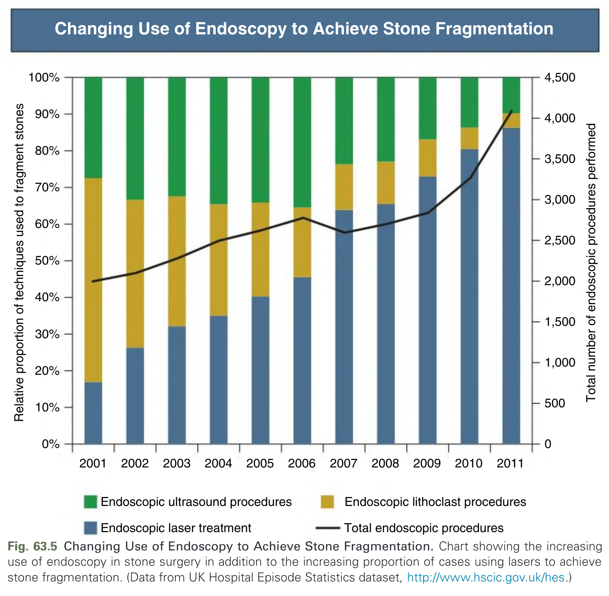

Fig. 63.5 Changing Use of Endoscopy to Achieve Stone Fragmentation. Chart showing the increasing use of endoscopy in stone surgery in addition to the increasing proportion of cases using lasers to achieve stone fragmentation. (Data from UK Hospital Episode Statistics dataset, http://www.hscic.gov.uk/hes.)

---

### Fig_63_6

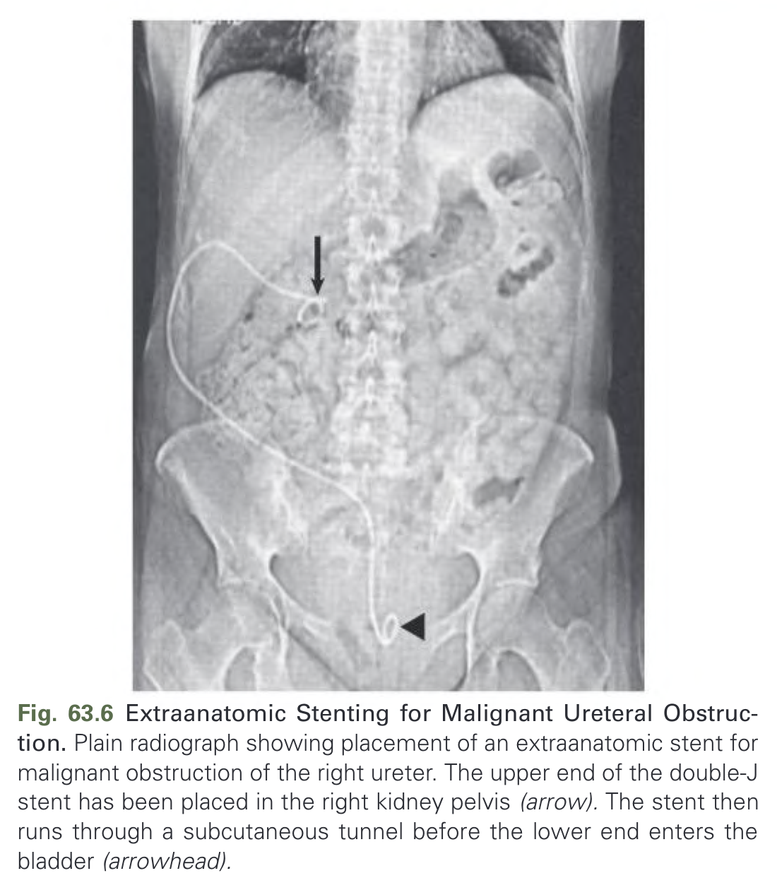

Fig. 63.6 Extraanatomic Stenting for Malignant Ureteral Obstruction. Plain radiograph showing placement of an extraanatomic stent for malignant obstruction of the right ureter. The upper end of the double-J stent has been placed in the right kidney pelvis (arrow). The stent then runs through a subcutaneous tunnel before the lower end enters the bladder (arrowhead).

---

### Fig_63_7

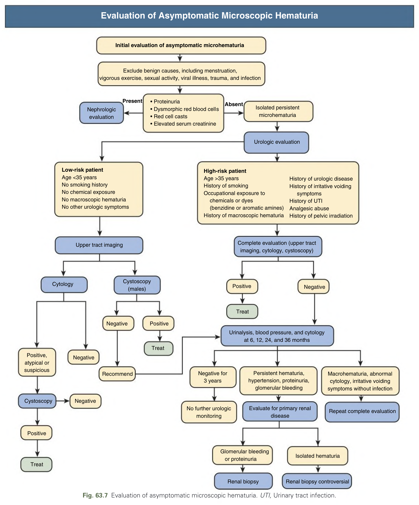

Fig. 63.7 Evaluation of asymptomatic microscopic hematuria. UTI, Urinary tract infection.

---

## Tables

### Table_63_1

#### Table Image

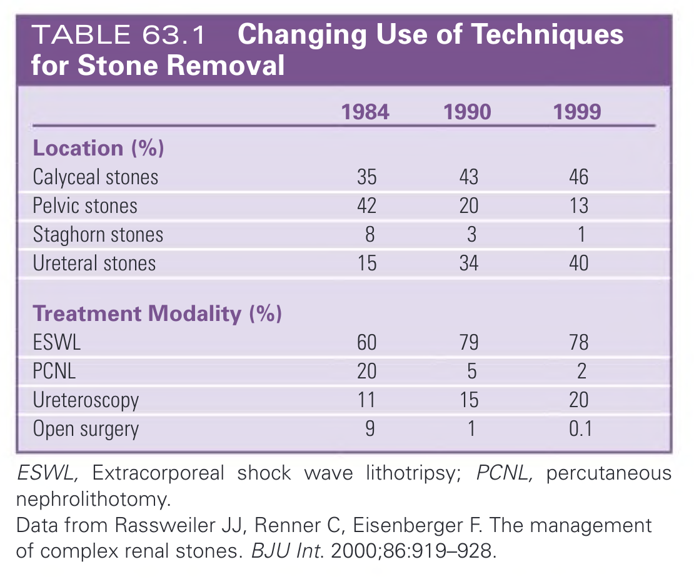

#### Table Data (CSV: [Table_63_1.csv](Table_63_1.csv))

```markdown
| | 1984 | 1990 | 1999 |
| :--- | :---: | :---: | :---: |
| **Location (%)** | | | |
| Calyceal stones | 35 | 43 | 46 |
| Pelvic stones | 42 | 20 | 13 |
| Staghorn stones | 8 | 3 | 1 |
| Ureteral stones | 15 | 34 | 40 |
| **Treatment Modality (%)** | | | |
| ESWL | 60 | 79 | 78 |
| PCNL | 20 | 5 | 2 |
| Ureteroscopy | 11 | 15 | 20 |
| Open surgery | 9 | 1 | 0.1 |
ESWL, Extracorporeal shock wave lithotripsy; PCNL, percutaneous nephrolithotomy. Data from Rassweiler JJ, Renner C, Eisenberger F. The management of complex renal stones. BJU Int. 2000;86:919-928.
```

TABLE 63.1 Changing Use of Techniques for Stone Removal

---

### Table_63_2

#### Table Image

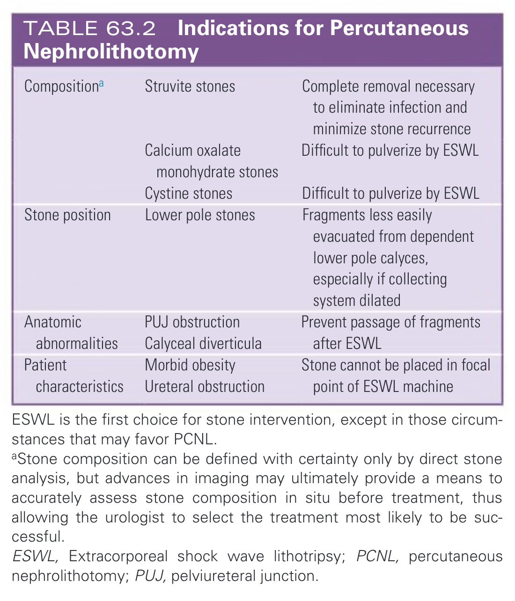

#### Table Data (CSV: [Table_63_2.csv](Table_63_2.csv))

```markdown
| | | |
| :--- | :--- | :--- |
| **Compositiona** | Struvite stones | Complete removal necessary to eliminate infection and minimize stone recurrence |
| | Calcium oxalate monohydrate stones | Difficult to pulverize by ESWL |
| | Cystine stones | Difficult to pulverize by ESWL |
| **Stone position** | Lower pole stones | Fragments less easily evacuated from dependent lower pole calyces, especially if collecting system dilated |
| **Anatomic abnormalities** | PUJ obstruction | Prevent passage of fragments after ESWL |
| | Calyceal diverticula | |
| **Patient characteristics** | Morbid obesity | Stone cannot be placed in focal point of ESWL machine |
| | Ureteral obstruction | |
ESWL is the first choice for stone intervention, except in those circumstances that may favor PCNL. aStone composition can be defined with certainty only by direct stone analysis, but advances in imaging may ultimately provide a means to accurately assess stone composition in situ before treatment, thus allowing the urologist to select the treatment most likely to be successful. ESWL, Extracorporeal shock wave lithotripsy; PCNL, percutaneous nephrolithotomy; PUJ, pelviureteral junction.
```

TABLE 63.2 Indications for Percutaneous Nephrolithotomy

---

### Table_63_3

#### Table Image

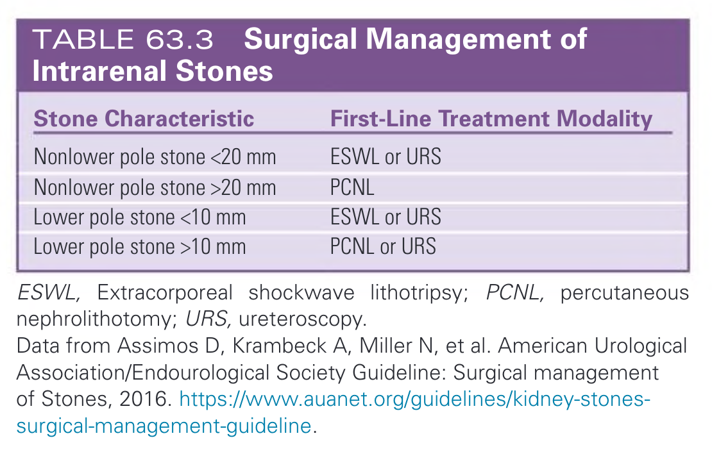

#### Table Data (CSV: [Table_63_3.csv](Table_63_3.csv))

```markdown
| Stone Characteristic | First-Line Treatment Modality |
| :--- | :--- |
| Nonlower pole stone <20 mm | ESWL or URS |
| Nonlower pole stone >20 mm | PCNL |
| Lower pole stone <10 mm | ESWL or URS |
| Lower pole stone >10 mm | PCNL or URS |
ESWL, Extracorporeal shockwave lithotripsy; PCNL, percutaneous nephrolithotomy; URS, ureteroscopy. Data from Assimos D, Krambeck A, Miller N, et al. American Urological Association/Endourological Society Guideline: Surgical management of Stones, 2016. https://www.auanet.org/guidelines/kidney-stones-surgical-management-guideline.
```

TABLE 63.3 Surgical Management of Intrarenal Stones

---

### Table_63_4

#### Table Image

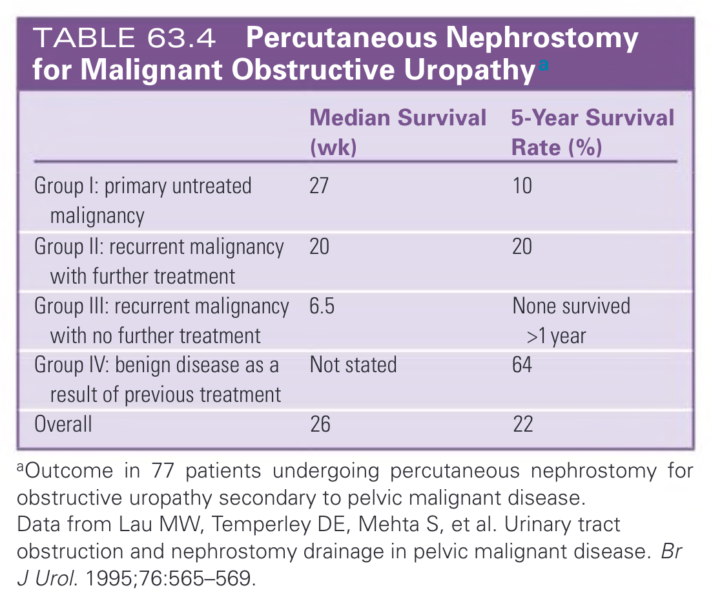

#### Table Data (CSV: [Table_63_4.csv](Table_63_4.csv))

```markdown
| | Median Survival (wk) | 5-Year Survival Rate (%) |
| :--- | :--- | :--- |
| Group I: primary untreated malignancy | 27 | 10 |
| Group II: recurrent malignancy with further treatment | 20 | 20 |
| Group III: recurrent malignancy with no further treatment | 6.5 | None survived >1 year |
| Group IV: benign disease as a result of previous treatment | Not stated | 64 |
| Overall | 26 | 22 |
aOutcome in 77 patients undergoing percutaneous nephrostomy for obstructive uropathy secondary to pelvic malignant disease. Data from Lau MW, Temperley DE, Mehta S, et al. Urinary tract obstruction and nephrostomy drainage in pelvic malignant disease. Br J Urol. 1995;76:565-569.
```

TABLE 63.4 Percutaneous Nephrostomy for Malignant Obstructive Uropathy^a

---

### Table_63_5

#### Table Image

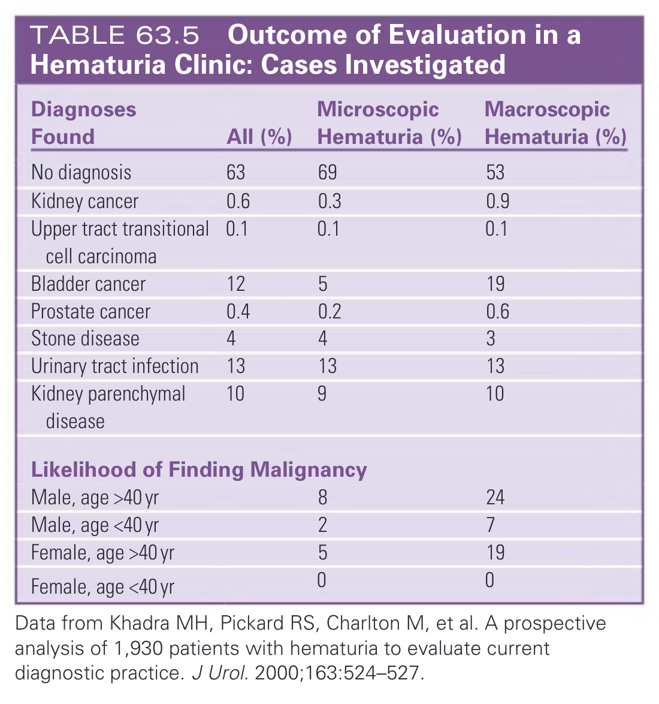

#### Table Data (CSV: [Table_63_5.csv](Table_63_5.csv))

```markdown
| Diagnoses Found | All (%) | Microscopic Hematuria (%) | Macroscopic Hematuria (%) |
| :--- | :---: | :---: | :---: |
| No diagnosis | 63 | 69 | 53 |
| Kidney cancer | 0.6 | 0.3 | 0.9 |
| Upper tract transitional cell carcinoma | 0.1 | 0.1 | 0.1 |
| Bladder cancer | 12 | 5 | 19 |
| Prostate cancer | 0.4 | 0.2 | 0.6 |
| Stone disease | 4 | 4 | 3 |
| Urinary tract infection | 13 | 13 | 13 |
| Kidney parenchymal disease | 10 | 9 | 10 |
| **Likelihood of Finding Malignancy** | | | |
| Male, age >40 yr | | 8 | 24 |
| Male, age <40 yr | | 2 | 7 |
| Female, age >40 yr | | 5 | 19 |
| Female, age <40 yr | | 0 | 0 |
Data from Khadra MH, Pickard RS, Charlton M, et al. A prospective analysis of 1,930 patients with hematuria to evaluate current diagnostic practice. J Urol. 2000;163:524-527.
```

TABLE 63.5 Outcome of Evaluation in a Hematuria Clinic: Cases Investigated

---

### Table_63_6

#### Table Image

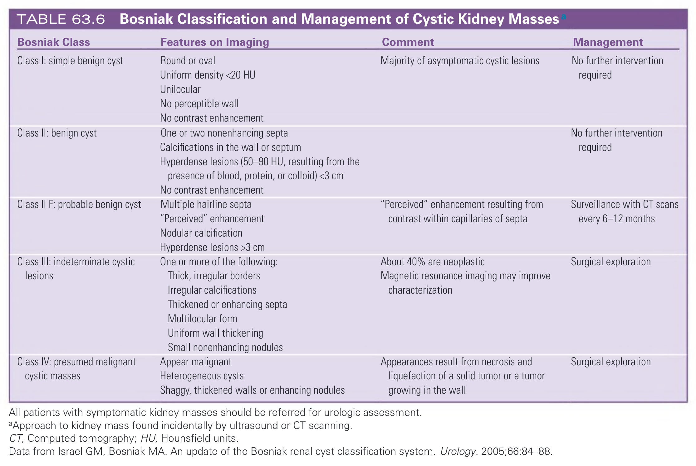

#### Table Data (CSV: [Table_63_6.csv](Table_63_6.csv))

```markdown
| Bosniak Class | Features on Imaging | Comment | Management |
| :--- | :--- | :--- | :--- |
| Class I: simple benign cyst | Round or oval<br>Uniform density <20 HU<br>Unilocular<br>No perceptible wall<br>No contrast enhancement | Majority of asymptomatic cystic lesions | No further intervention required |
| Class II: benign cyst | One or two nonenhancing septa<br>Calcifications in the wall or septum<br>Hyperdense lesions (50-90 HU, resulting from the presence of blood, protein, or colloid) <3 cm<br>No contrast enhancement | | No further intervention required |
| Class II F: probable benign cyst | Multiple hairline septa<br>"Perceived" enhancement<br>Nodular calcification<br>Hyperdense lesions >3 cm | "Perceived" enhancement resulting from contrast within capillaries of septa | Surveillance with CT scans every 6-12 months |
| Class III: indeterminate cystic lesions | One or more of the following:<br>Thick, irregular borders<br>Irregular calcifications<br>Thickened or enhancing septa<br>Multilocular form<br>Uniform wall thickening<br>Small nonenhancing nodules | About 40% are neoplastic<br>Magnetic resonance imaging may improve characterization | Surgical exploration |
| Class IV: presumed malignant cystic masses | Appear malignant<br>Heterogeneous cysts<br>Shaggy, thickened walls or enhancing nodules | Appearances result from necrosis and liquefaction of a solid tumor or a tumor growing in the wall | Surgical exploration |
All patients with symptomatic kidney masses should be referred for urologic assessment. aApproach to kidney mass found incidentally by ultrasound or CT scanning. CT, Computed tomography; HU, Hounsfield units. Data from Israel GM, Bosniak MA. An update of the Bosniak renal cyst classification system. Urology. 2005;66:84-88.
```

TABLE 63.6  Bosniak Classification and Management of Cystic Kidney Massesᵃ

---

### Table_63_7

#### Table Image

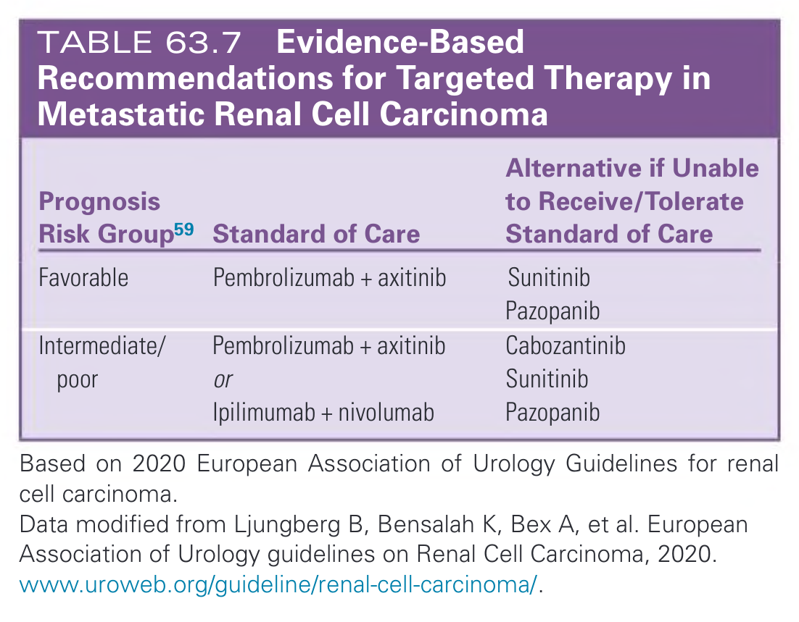

#### Table Data (CSV: [Table_63_7.csv](Table_63_7.csv))

```markdown
| Prognosis Risk Group | Standard of Care | Alternative if Unable to Receive/Tolerate Standard of Care |
| :--- | :--- | :--- |
| Favorable | Pembrolizumab + axitinib | Sunitinib<br>Pazopanib |
| Intermediate/ poor | Pembrolizumab + axitinib or Ipilimumab + nivolumab | Cabozantinib<br>Sunitinib<br>Pazopanib |
Based on 2020 European Association of Urology Guidelines for renal cell carcinoma. Data modified from Ljungberg B, Bensalah K, Bex A, et al. European Association of Urology guidelines on Renal Cell Carcinoma, 2020. www.uroweb.org/guideline/renal-cell-carcinoma/.
```

TABLE 63.7  Evidence-Based Recommendations for Targeted Therapy in Metastatic Renal Cell Carcinoma

---

## Boxes

### Box_63_1


#### Box Text

```markdown
* Male sex
* Age (>35 years)
* Past or current smoking
* Occupational or other exposure to chemicals or dyes (benzenes or aromatic amines)
* Analgesic abuse
* History of visible hematuria
* History of urologic disorder or disease
* History of irritative voiding symptoms
* History of pelvic irradiation
* History of chronic urinary tract infection
* History of exposure to known carcinogenic agents or chemotherapy such as alkylating agents
* History of chronic indwelling foreign body
```

BOX 63.1 Common Risk Factors for Urinary Tract Malignancy in Patients With Microhematuria

---
