# 064. Acute Interstitial Nephritis - Figures and Tables Index

This document lists all figures, tables and boxes extracted from `064. Acute Interstitial Nephritis.pdf`.

## Table of Contents
- [Figures](#figures)
- [Tables](#tables)
- [Boxes](#boxes)

---

## Figures

### Fig_64_1

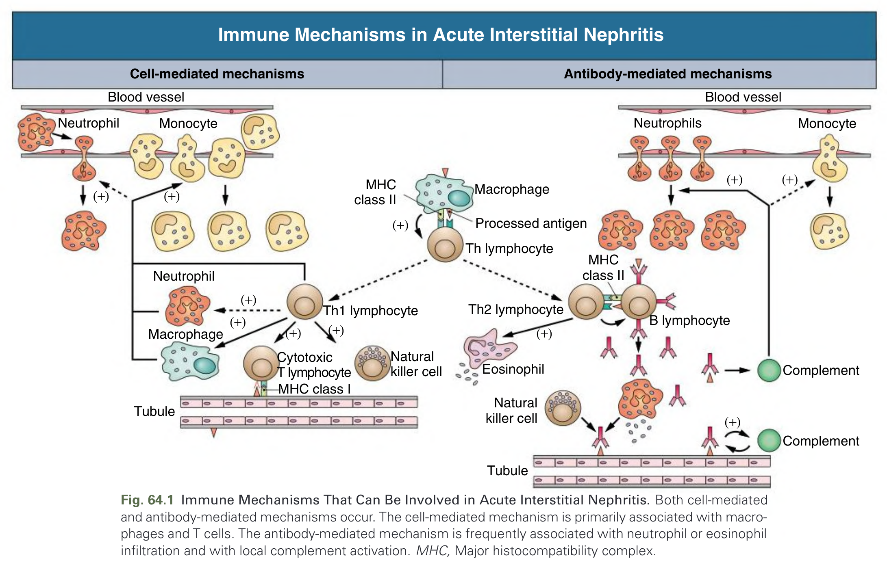

Fig. 64.1 Immune Mechanisms That Can Be Involved in Acute Interstitial Nephritis. Both cell-mediated and humoral immunity can participate in the pathogenesis of acute interstitial nephritis (AIN). The major mechanism seems to involve cell-mediated immunity with activation of CD4+ (predominant) and CD8+ T cells by an antigen presented by professional antigen-presenting cells (APCs). Interstitial macrophages and tubular cells can also present the antigen to T cells. Activated T cells can induce direct cytotoxicity, which is mediated by CD8+ T cells, and can release a variety of cytokines, inducing a local inflammatory reaction. A humoral immune response can also be involved, with antibody production by plasma cells directed against tubular basement membrane (anti-TBM) antigens, other tubular antigens, secreted tubular antigens (Tamm-Horsfall protein), or planted antigens. The local release of cytokines can also stimulate interstitial fibroblasts and lead to renal scarring. (Modified from Kelly CJ, Neilson EG. Tubulointerstitial diseases. In: Brenner BM, ed. Brenner & Rector's The Kidney. 5th ed. Philadelphia: Saunders; 1996:1655–1679.)

---

### Fig_64_2

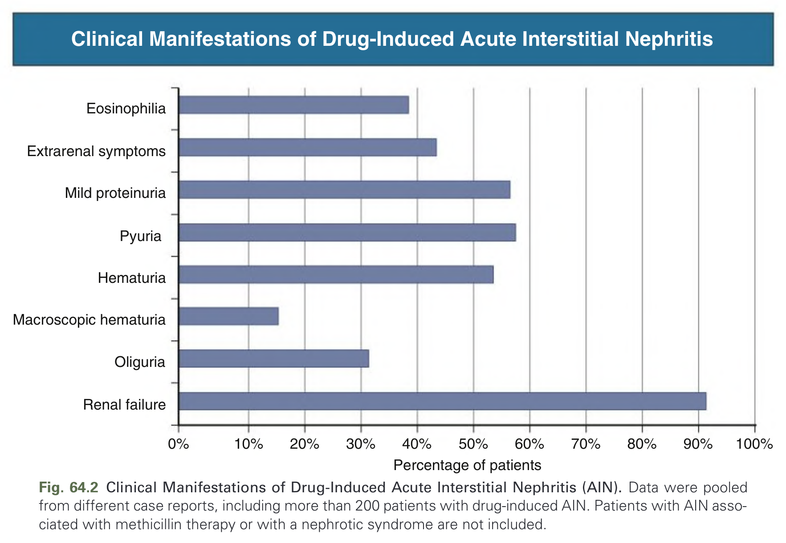

Fig. 64.2 Clinical Manifestations of Drug-Induced Acute Interstitial Nephritis (AIN). Data were pooled from different clinical studies of drug-induced AIN with a total number of 471 patients. (From Rossert J. Drug-induced acute interstitial nephritis. Kidney Int. 2001;60[2]:804–817.)

---

### Fig_64_3

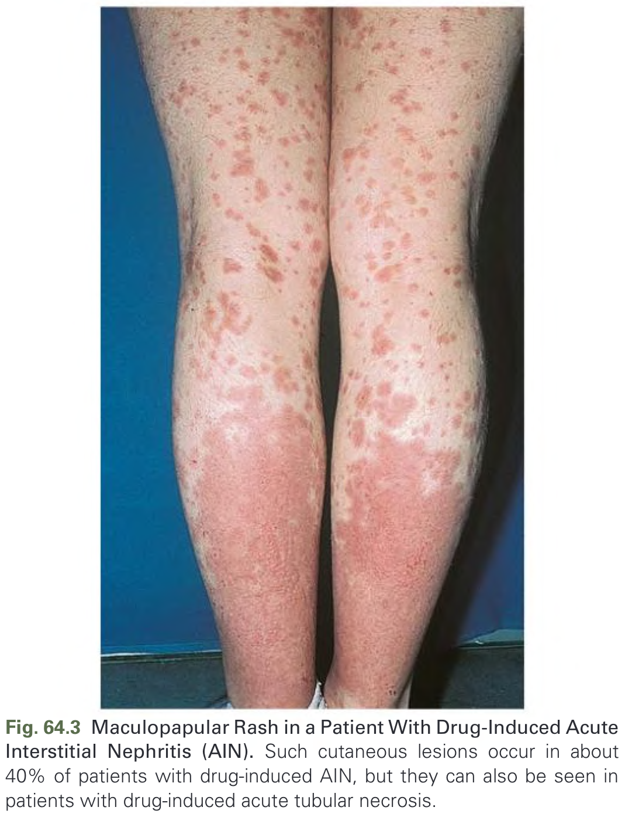

Fig. 64.3 Maculopapular Rash in a Patient With Drug-Induced Acute Interstitial Nephritis (AIN). Such cutaneous lesions occur in about 40% of patients with drug-induced AIN, but they can also be seen in patients with drug-induced acute tubular necrosis.

---

### Fig_64_4

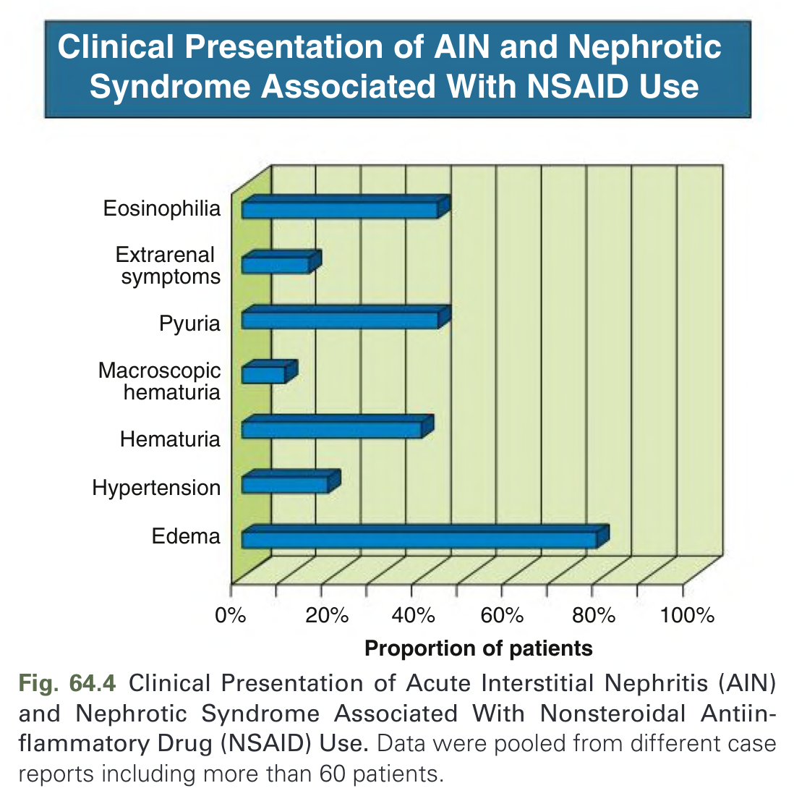

Fig. 64.4 Clinical Presentation of Acute Interstitial Nephritis (AIN) and Nephrotic Syndrome Associated With Nonsteroidal Antiinflammatory Drug (NSAID) Therapy. (From Clarkson MR, Giblin L, O'Kelly P, et al. Acute interstitial nephritis: clinical features and response to corticosteroid therapy. Nephrol Dial Transplant. 2004;19[11]:2778–2783.)

---

### Fig_64_5

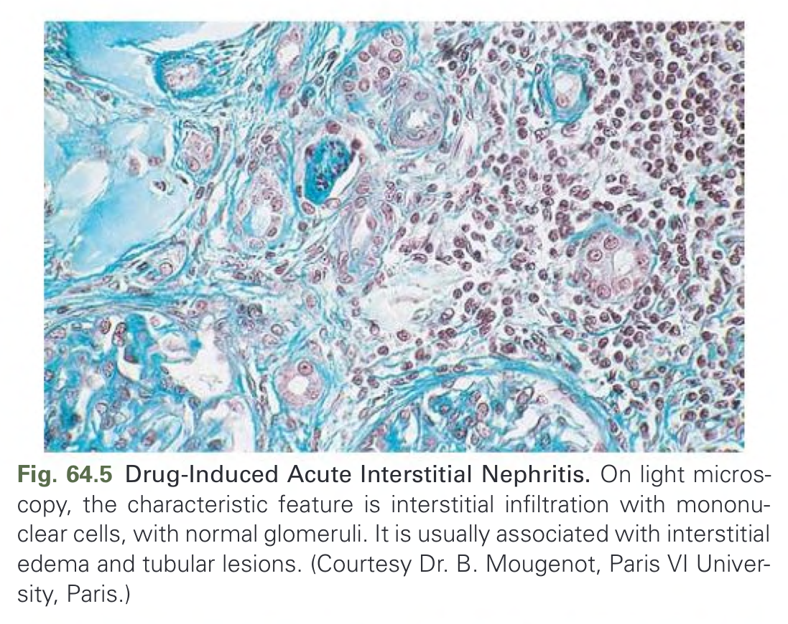

Fig. 64.5 Drug-Induced Acute Interstitial Nephritis. On light microscopy, the characteristic feature is interstitial inflammation that is more pronounced in the deep cortex and outer medulla and can spare large areas of the renal parenchyma. (Jones silver stain; magnification ×100.) (Courtesy Dr. L.H. Noël, Paris V University, Paris.)

---

### Fig_64_6

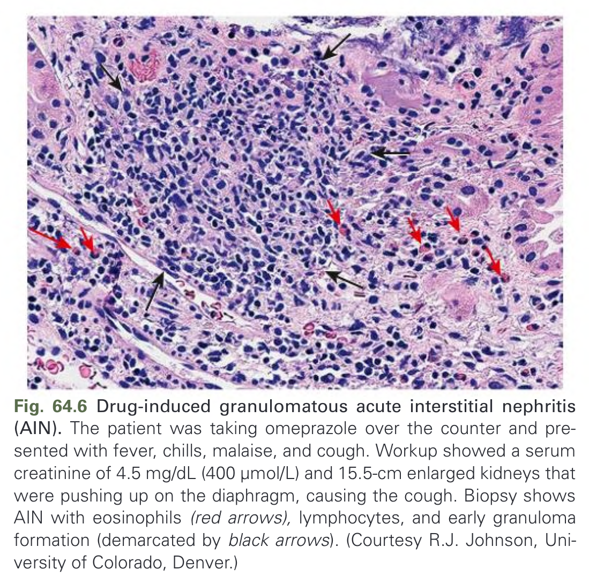

Fig. 64.6 Drug-induced granulomatous acute interstitial nephritis (AIN). The patient was taking omeprazole over the course of 6 months. Kidney biopsy shows interstitial infiltration with a well-formed, noncaseating granuloma with multinucleated giant cells. (Jones silver stain; magnification ×250.) (Courtesy Dr. J.P. Grünfeld, Paris V University, Paris.)

---

### Fig_64_7

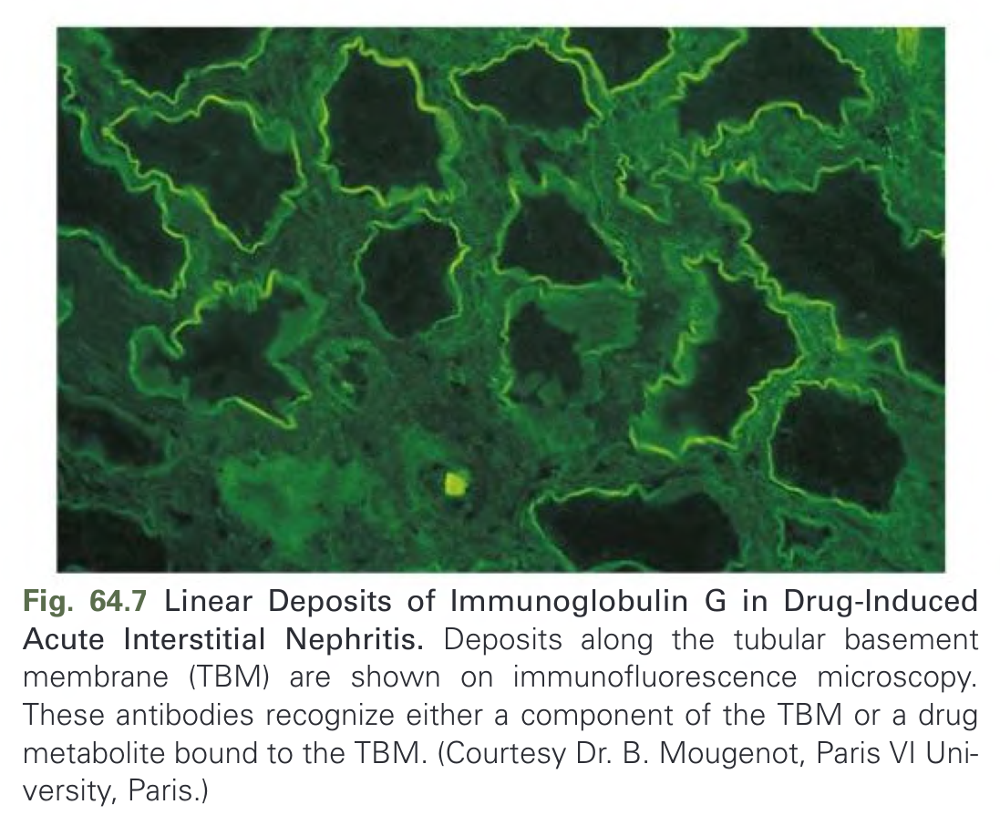

Fig. 64.7 Linear Deposits of Immunoglobulin G in Drug-Induced Acute Interstitial Nephritis. Deposits along the tubular basement membrane (TBM) are shown on immunofluorescence microscopy. These antibodies recognize either a component of the TBM or a drug metabolite bound to the TBM. (Courtesy Dr. B. Mougenot, Paris VI University, Paris.)

---

### Fig_64_8

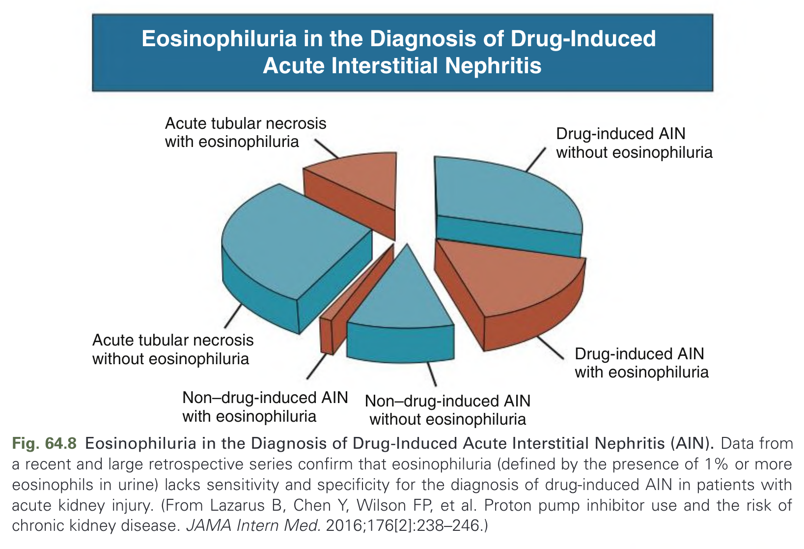

Fig. 64.8 Eosinophiluria in the Diagnosis of Drug-Induced Acute Interstitial Nephritis (AIN). Data from a recent and large retrospective series confirm that eosinophiluria (defined by the presence of 1% or more eosinophils in urine) lacks sensitivity and specificity for the diagnosis of drug-induced AIN in patients with acute kidney injury. (From Lazarus B, Chen Y, Wilson FP, et al. Proton pump inhibitor use and the risk of chronic kidney disease. JAMA Intern Med. 2016;176[2]:238–246.)

---

### Fig_64_9

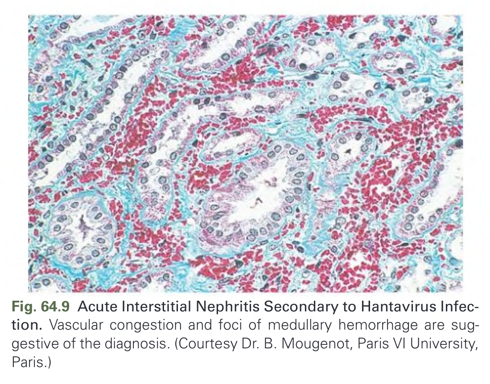

Fig. 64.9 Acute Interstitial Nephritis Secondary to Hantavirus Infection. Vascular congestion and foci of medullary hemorrhage are suggestive of the diagnosis. (Courtesy Dr. B. Mougenot, Paris VI University, Paris.)

---

### Fig_64_10

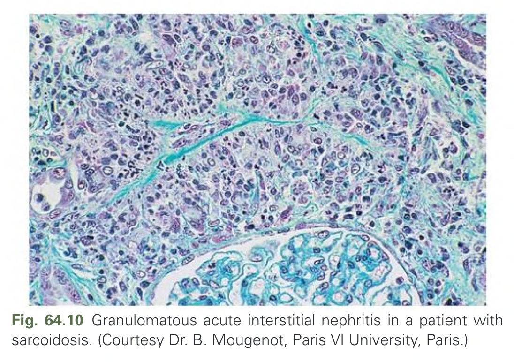

Fig. 64.10 Granulomatous acute interstitial nephritis in a patient with sarcoidosis. (Courtesy Dr. B. Mougenot, Paris VI University, Paris.)

---

## Tables

*No tables resolved for this chapter.*

## Boxes

### Box_64_1

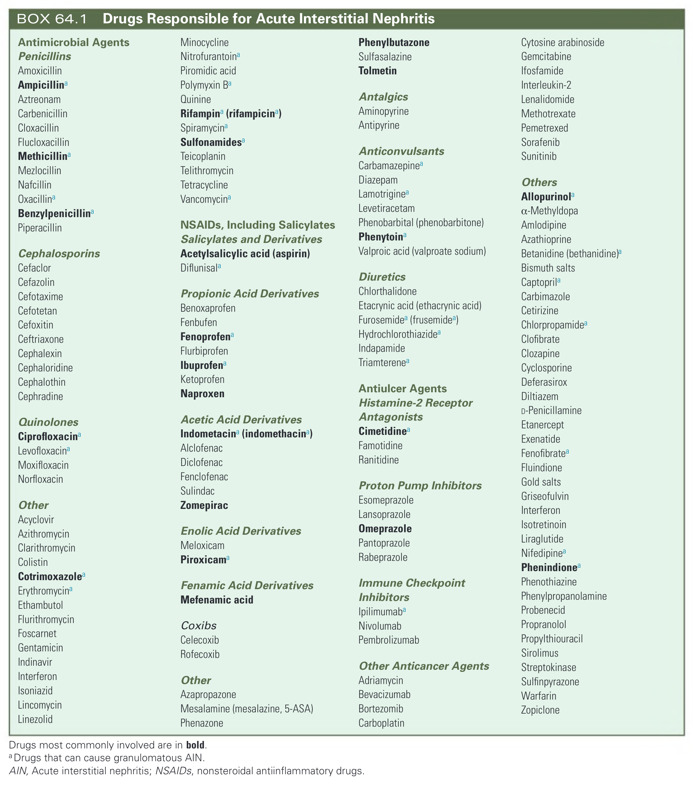

#### Box Text

```markdown
Drugs most commonly involved are in **bold**.
aDrugs that can cause granulomatous AIN.

**Antimicrobial Agents**
*   **Penicillins**: **Amoxicillin**, **Ampicillin**a, Aztreonam, Carbenicillin, Cloxacillin, Flucloxacillin, **Methicillin**a, Mezlocillin, Nafcillin, Oxacillina, **Benzylpenicillin**a, Piperacillin
*   **Cephalosporins**: Cefaclor, Cefazolin, Cefotaxime, Cefotetan, Cefoxitin, Ceftriaxone, Cephalexin, Cephaloridine, Cephalothin, Cephradine
*   **Quinolones**: **Ciprofloxacin**a, Levofloxacina, Moxifloxacin, Norfloxacin
*   Other: Acyclovir, Azithromycin, Clarithromycin, Colistin, Cotrimoxazolea, Erythromycina, Ethambutol, Flurithromycin, Foscarnet, Gentamicin, Indinavir, Interferon, Isoniazid, Lincomycin, Linezolid, Minocycline, Nitrofurantoina, Piromidic acid, Polymyxin Ba, Quinine, **Rifampin (rifampicin)**a, Spiramycina, **Sulfonamides**a, Teicoplanin, Telithromycin, Tetracycline, Vancomycina
**NSAIDs, Including Salicylates**
*   **Salicylates and Derivatives**: **Acetylsalicylic acid (aspirin)**, Diflunisala
*   **Propionic Acid Derivatives**: Benoxaprofen, Fenbufen, **Fenoprofen**a, Flurbiprofen, **Ibuprofen**a, Ketoprofen, **Naproxen**
*   **Acetic Acid Derivatives**: **Indometacin (indomethacin)**a, Alclofenac, Diclofenac, Fenclofenac, Sulindac, Zomepirac
*   **Enolic Acid Derivatives**: Meloxicam, **Piroxicam**a
*   **Fenamic Acid Derivatives**: **Mefenamic acid**
*   **Coxibs**: Celecoxib, Rofecoxib
*   Other: Azapropazone, Mesalamine (mesalazine, 5-ASA), Phenazone
**Phenylbutazone**
*   Sulfasalazine
*   **Tolmetin**
**Antalgics**
*   Aminopyrine
*   Antipyrine
**Anticonvulsants**
*   Carbamazepinea, Diazepam, Lamotriginea, Levetiracetam, Phenobarbital (phenobarbitone), **Phenytoin**a, Valproic acid (valproate sodium)
**Diuretics**
*   Chlorthalidone, Etacrynic acid (ethacrynic acid), **Furosemide**a (frusemidea), Hydrochlorothiazidea, Indapamide, Triamterenea
**Antiulcer Agents**
*   **Histamine-2 Receptor Antagonists**: **Cimetidine**a, Famotidine, Ranitidine
*   **Proton Pump Inhibitors**: **Esomeprazole**, **Lansoprazole**, **Omeprazole**, **Pantoprazole**, Rabeprazole
**Immune Checkpoint Inhibitors**
*   Ipilimumaba, Nivolumab, Pembrolizumab
**Other Anticancer Agents**
*   Adriamycin, Bevacizumab, Bortezomib, Carboplatin, Cytosine arabinoside, Gemcitabine, Ifosfamide, Interleukin-2, Lenalidomide, Methotrexate, Pemetrexed, Sorafenib, Sunitinib
**Others**
*   **Allopurinol**a, a-Methyldopa, Amlodipine, Azathioprine, Betanidine (bethanidine)a, Bismuth salts, Captoprila, Carbimazole, Cetirizine, Chlorpropamidea, Clofibrate, Clozapine, Cyclosporine, Deferasirox, Diltiazem, D-Penicillamine, Etanercept, Exenatide, Fenofibratea, Fluindione, Gold salts, Griseofulvin, Interferon, Isotretinoin, Liraglutide, Nifedipinea, **Phenindione**a, Phenothiazine, Phenylpropanolamine, Probenecid, Propranolol, Propylthiouracil, Sirolimus, Streptokinase, Sulfinpyrazone, Warfarin, Zopiclone
```

BOX 64.1 Drugs Responsible for Acute Interstitial Nephritis

---

### Box_64_2

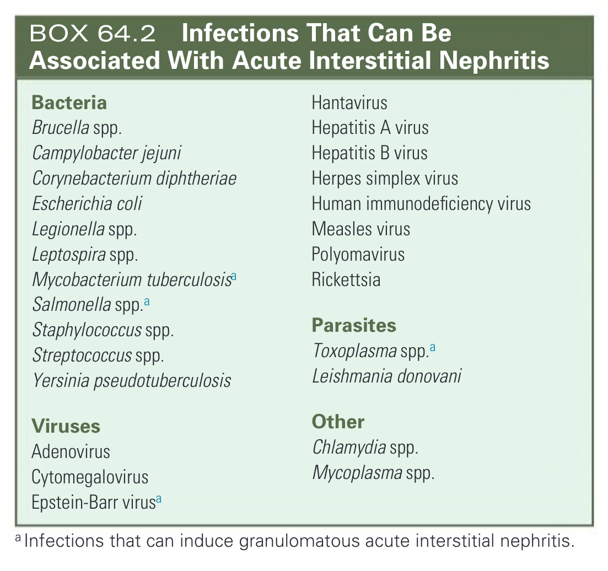

#### Box Text

```markdown
**Bacteria**
*   Brucella spp.
*   Campylobacter jejuni
*   Corynebacterium diphtheriae
*   Escherichia coli
*   Legionella spp.
*   Leptospira spp.
*   Mycobacterium tuberculosisa
*   Salmonella spp.a
*   Staphylococcus spp.
*   Streptococcus spp.
*   Yersinia pseudotuberculosis

**Viruses**
*   Adenovirus
*   Cytomegalovirus
*   Epstein-Barr virusa
*   Hantavirus
*   Hepatitis A virus
*   Hepatitis B virus
*   Herpes simplex virus
*   Human immunodeficiency virus
*   Measles virus
*   Polyomavirus
*   Rickettsia

**Parasites**
*   Toxoplasma spp.a
*   Leishmania donovani

**Other**
*   Chlamydia spp.
*   Mycoplasma spp.

^aInfections that can induce granulomatous acute interstitial nephritis.
```

BOX 64.2 Infections That Can Be Associated With Acute Interstitial Nephritis

---
