# 065. Chronic Interstitial Nephritis - Figures and Tables Index

This document lists all figures, tables and boxes extracted from `065. Chronic Interstitial Nephritis.pdf`.

## Table of Contents
- [Figures](#figures)
- [Tables](#tables)
- [Boxes](#boxes)

---

## Figures

### Fig_65_1

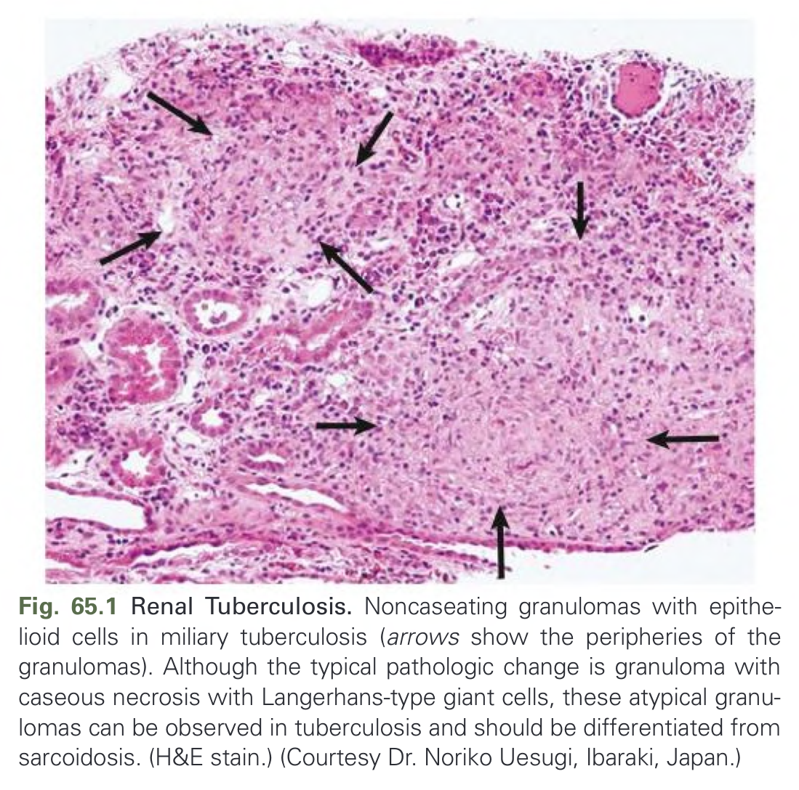

Fig. 65.1 Renal Tuberculosis. Noncaseating granulomas with epithelioid cells in miliary tuberculosis. Granulomas are also found in sarcoidosis. (H&E stain.) (Courtesy Dr. Noriko Uesugi, Ibaraki, Japan.)

---

### Fig_65_2

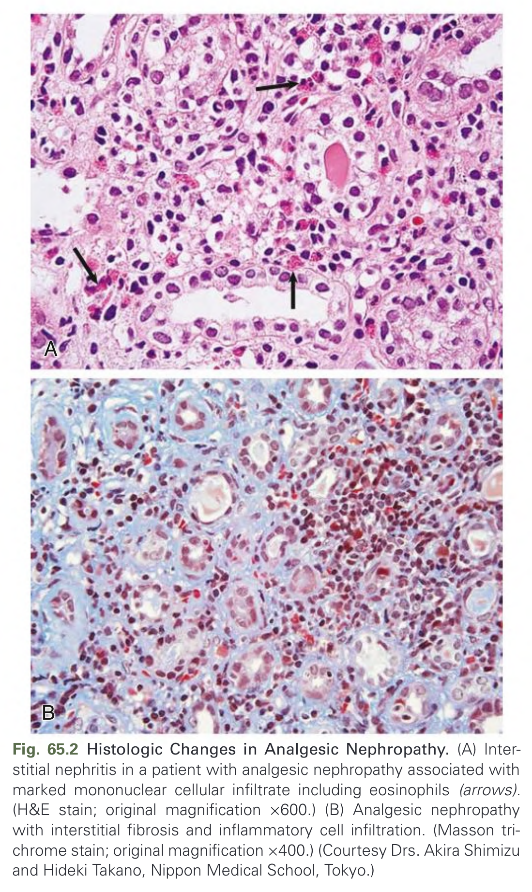

Fig. 65.2 Histologic Changes in Analgesic Nephropathy. (A) Interstitial nephritis in a patient with analgesic nephropathy associated with marked mononuclear cellular infiltrate including eosinophils (arrows). (Jones silver stain; original magnification ×400.) (B) Analgesic nephropathy with interstitial fibrosis and inflammatory cell infiltrates. (Masson trichrome stain; original magnification ×400.) (Courtesy Drs. Akira Shimizu and Hideki Takano, Nippon Medical School, Tokyo.)

---

### Fig_65_3

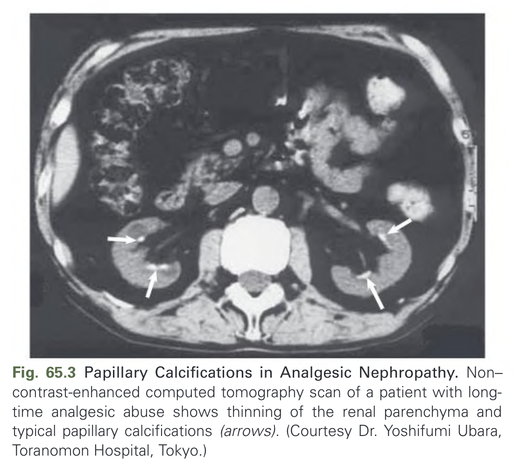

Fig. 65.3 Papillary Calcifications in Analgesic Nephropathy. Non–contrast-enhanced computed tomography scan of a patient with longtime analgesic abuse shows thinning of the renal parenchyma and typical papillary calcifications (arrows). (Courtesy Dr. Yoshifumi Ubara, Toranomon Hospital, Tokyo.)

---

### Fig_65_4

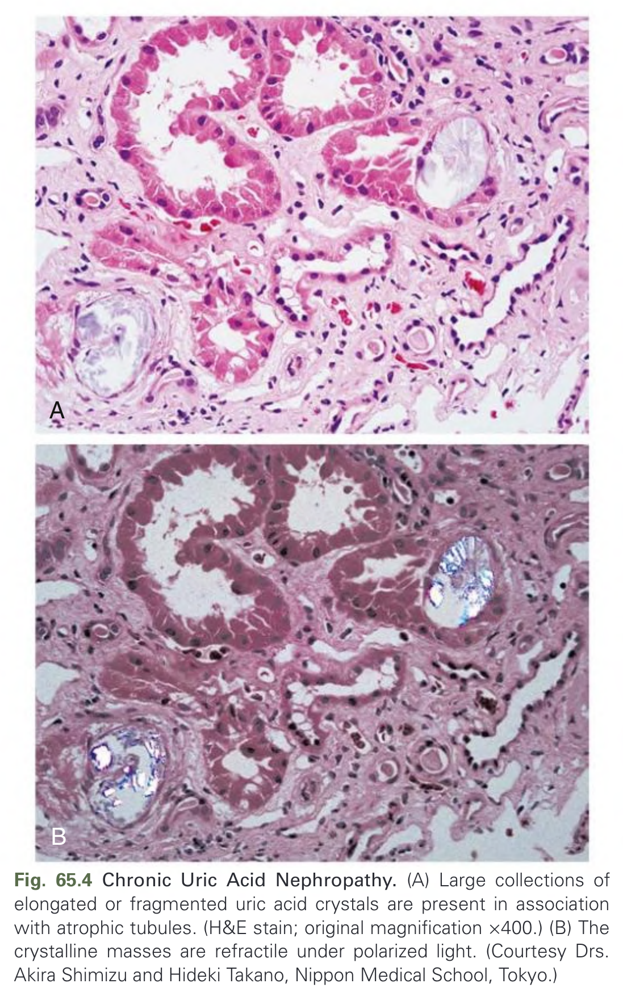

Fig. 65.4 Chronic Uric Acid Nephropathy. (A) Large collections of elongated or fragmented uric acid crystals are present in association with atrophic tubules. (H&E stain; original magnification ×400.) (B) The crystalline masses are refractile under polarized light. (Courtesy Drs. Akira Shimizu and Hideki Takano, Nippon Medical School, Tokyo.)

---

### Fig_65_5

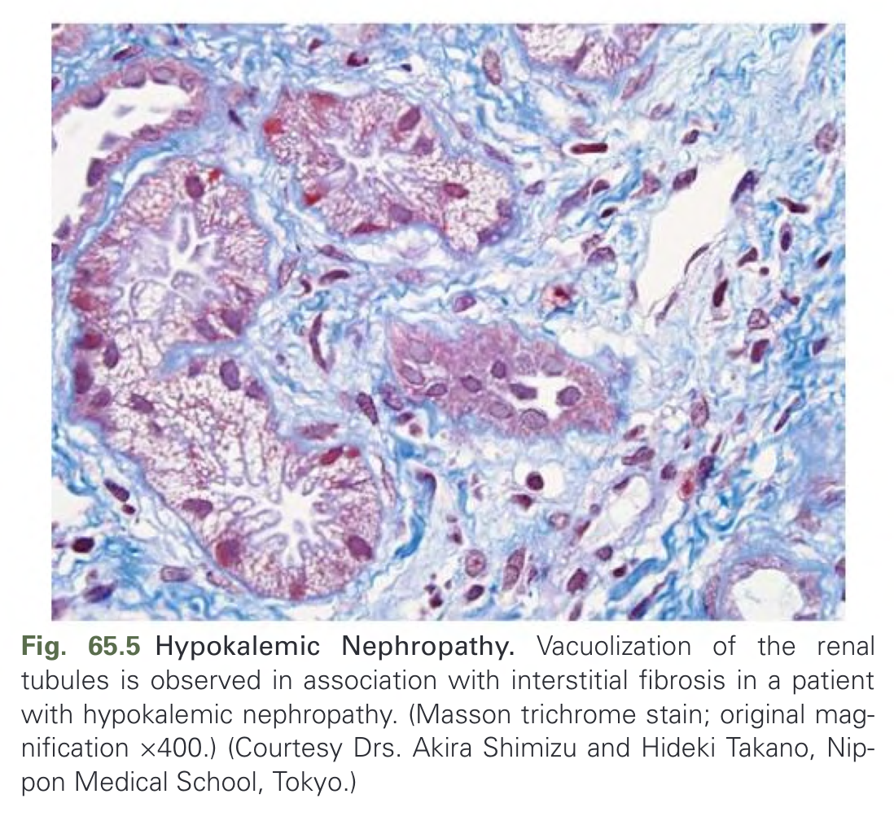

Fig. 65.5 Hypokalemic Nephropathy. Vacuolization of the renal tubules is observed in association with interstitial fibrosis in a patient with hypokalemic nephropathy. (Masson trichrome stain; original magnification ×400.) (Courtesy Drs. Akira Shimizu and Hideki Takano, Nippon Medical School, Tokyo.)

---

### Fig_65_6

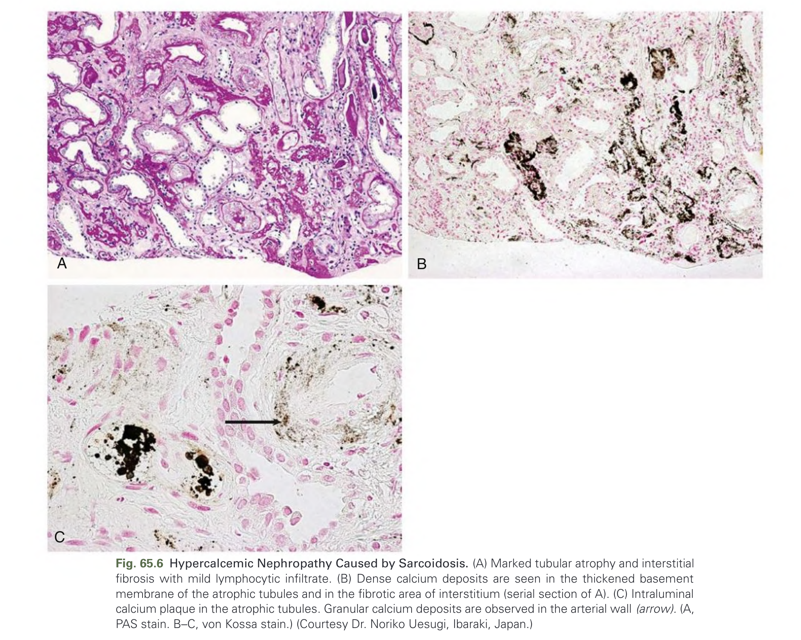

Fig. 65.6 Hypercalcemic Nephropathy Caused by Sarcoidosis. (A) Marked tubular atrophy and interstitial fibrosis with mild lymphocytic infiltrate. (B) Dense calcium deposits are seen in the thickened basement membrane of the atrophic tubules and in the fibrotic area of interstitium (serial section of A). (C) Intraluminal calcium plaque in the atrophic tubules. Granular calcium deposits are observed in the arterial wall (arrow). (A, PAS stain. B–C, von Kossa stain.) (Courtesy Dr. Noriko Uesugi, Ibaraki, Japan.)

---

### Fig_65_7

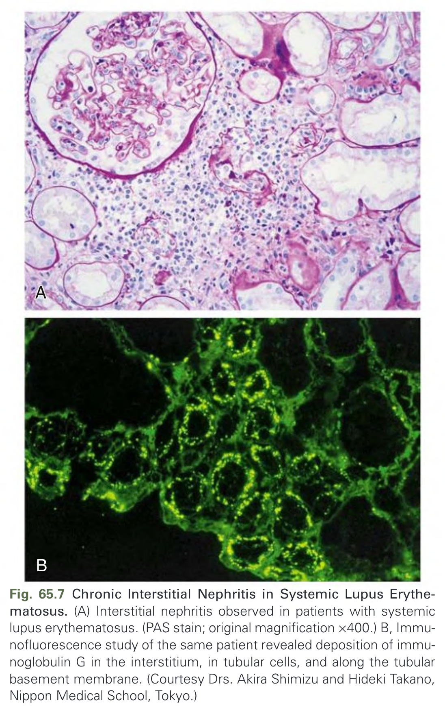

Fig. 65.7 Chronic Interstitial Nephritis in Systemic Lupus Erythematosus. (A) Interstitial nephritis observed in patients with systemic lupus erythematosus. (PAS stain; original magnification ×400.) B, Immunofluorescence study of the same patient revealed deposition of immunoglobulin G in the interstitium, in tubular cells, and along the tubular basement membrane. (Courtesy Drs. Akira Shimizu and Hideki Takano, Nippon Medical School, Tokyo.)

---

### Fig_65_8

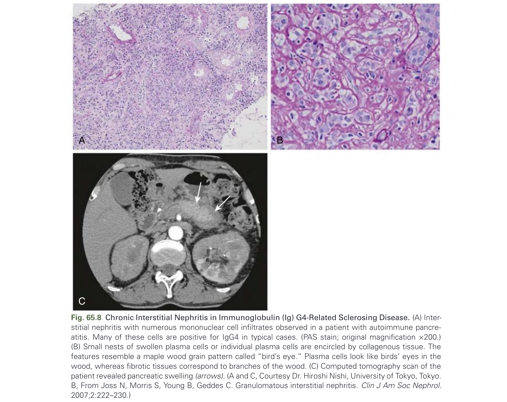

Fig. 65.8 Chronic Interstitial Nephritis in Immunoglobulin (Ig) G4-Related Sclerosing Disease. (A) Interstitial nephritis with numerous mononuclear cell infiltrates observed in a patient with autoimmune pancreatitis. Many of these cells are positive for IgG4 in typical cases. (PAS stain; original magnification ×200.) (B) Small nests of swollen plasma cells or individual plasma cells are encircled by collagenous tissue. The features resemble a maple wood grain pattern called “bird’s eye.” Plasma cells look like birds’ eyes in the wood, whereas fibrotic tissues correspond to branches of the wood. (C) Computed tomography scan of the patient revealed pancreatic swelling (arrows). (A and C, Courtesy Dr. Hiroshi Nishi, University of Tokyo, Tokyo. B, From Joss N, Morris S, Young B, Geddes C. Granulomatous interstitial nephritis. Clin J Am Soc Nephrol. 2007;2:222–230.)

---

## Tables

### Table_65_1

#### Table Image

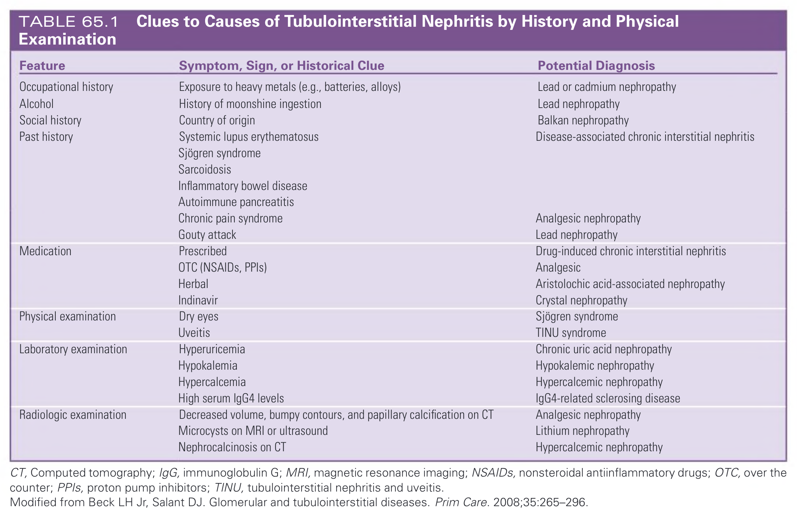

#### Table Data (CSV: [Table_65_1.csv](Table_65_1.csv))

```markdown
| Feature | Symptom, Sign, or Historical Clue | Potential Diagnosis |
| :--- | :--- | :--- |
| Occupational history | Exposure to heavy metals (e.g., batteries, alloys) | Lead or cadmium nephropathy |
| Alcohol | History of moonshine ingestion | Lead nephropathy |
| Social history | Country of origin | Balkan nephropathy |
| Past history | Systemic lupus erythematosus | Disease-associated chronic interstitial nephritis |
| | Sjögren syndrome | |
| | Sarcoidosis | |
| | Inflammatory bowel disease | |
| | Autoimmune pancreatitis | |
| | Chronic pain syndrome | Analgesic nephropathy |
| | Gouty attack | Lead nephropathy |
| Medication | Prescribed | Drug-induced chronic interstitial nephritis |
| | OTC (NSAIDs, PPIs) | Analgesic |
| | Herbal | Aristolochic acid-associated nephropathy |
| | Indinavir | Crystal nephropathy |
| Physical examination | Dry eyes | Sjögren syndrome |
| | Uveitis | TINU syndrome |
| Laboratory examination | Hyperuricemia | Chronic uric acid nephropathy |
| | Hypokalemia | Hypokalemic nephropathy |
| | Hypercalcemia | Hypercalcemic nephropathy |
| | High serum IgG4 levels | IgG4-related sclerosing disease |
| Radiologic examination | Decreased volume, bumpy contours, and papillary calcification on CT | Analgesic nephropathy |
| | Microcysts on MRI or ultrasound | Lithium nephropathy |
| | Nephrocalcinosis on CT | Hypercalcemic nephropathy |

CT, Computed tomography; IgG, immunoglobulin G; MRI, magnetic resonance imaging; NSAIDs, nonsteroidal antiinflammatory drugs; OTC, over the counter; PPIs, proton pump inhibitors; TINU, tubulointerstitial nephritis and uveitis.
Modified from Beck LH Jr, Salant DJ. Glomerular and tubulointerstitial diseases. Prim Care. 2008;35:265-296.
```

TABLE 65.1 Clues to Causes of Tubulointerstitial Nephritis by History and Physical Examination

---

### Table_65_2

#### Table Image

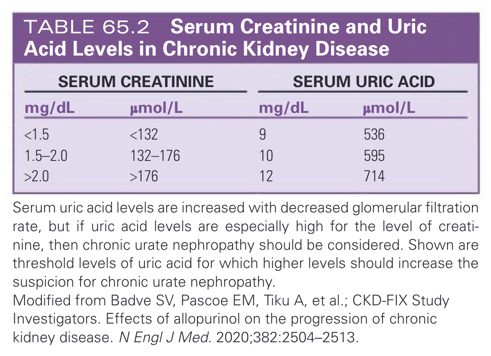

#### Table Data (CSV: [Table_65_2.csv](Table_65_2.csv))

```markdown
| Serum Creatinine (mg/dL) | Serum Creatinine (μmol/L) | Serum Uric Acid (mg/dL) | Serum Uric Acid (μmol/L) |
| :--- | :--- | :--- | :--- |
| <1.5 | <132 | 9 | 536 |
| 1.5–2.0 | 132–176 | 10 | 595 |
| >2.0 | >176 | 12 | 714 |

Serum uric acid levels are increased with decreased glomerular filtration rate, but if uric acid levels are especially high for the level of creatinine, then chronic urate nephropathy should be considered. Shown are threshold levels of uric acid for which higher levels should increase the suspicion for chronic urate nephropathy.
Modified from Badve SV, Pascoe EM, Tiku A, et al.; CKD-FIX Study Investigators. Effects of allopurinol on the progression of chronic kidney disease. N Engl J Med. 2020;382:2504–2513.
```

TABLE 65.2 Serum Creatinine and Uric Acid Levels in Chronic Kidney Disease

---

### Table_65_3

#### Table Image

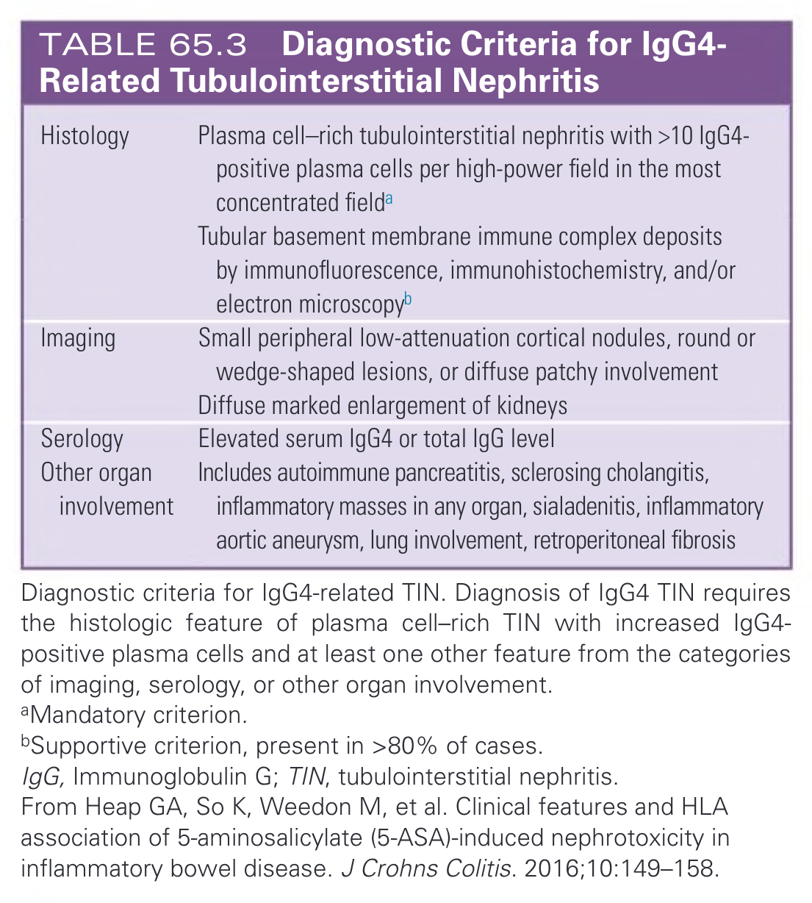

#### Table Data (CSV: [Table_65_3.csv](Table_65_3.csv))

```markdown
| | |
| :--- | :--- |
| Histology | Plasma cell-rich tubulointerstitial nephritis with >10 IgG4-positive plasma cells per high-power field in the most concentrated fielda |
| | Tubular basement membrane immune complex deposits by immunofluorescence, immunohistochemistry, and/or electron microscopyb |
| Imaging | Small peripheral low-attenuation cortical nodules, round or wedge-shaped lesions, or diffuse patchy involvement |
| | Diffuse marked enlargement of kidneys |
| Serology | Elevated serum IgG4 or total IgG level |
| Other organ involvement | Includes autoimmune pancreatitis, sclerosing cholangitis, inflammatory masses in any organ, sialadenitis, inflammatory aortic aneurysm, lung involvement, retroperitoneal fibrosis |

Diagnostic criteria for IgG4-related TIN. Diagnosis of IgG4 TIN requires the histologic feature of plasma cell-rich TIN with increased IgG4-positive plasma cells and at least one other feature from the categories of imaging, serology, or other organ involvement.
aMandatory criterion.
bSupportive criterion, present in >80% of cases.
IgG, Immunoglobulin G; TIN, tubulointerstitial nephritis.
From Heap GA, So K, Weedon M, et al. Clinical features and HLA association of 5-aminosalicylate (5-ASA)-induced nephrotoxicity in inflammatory bowel disease. J Crohns Colitis. 2016;10:149-158.
```

TABLE 65.3 Diagnostic Criteria for IgG4-Related Tubulointerstitial Nephritis

---

## Boxes

### Box_65_1

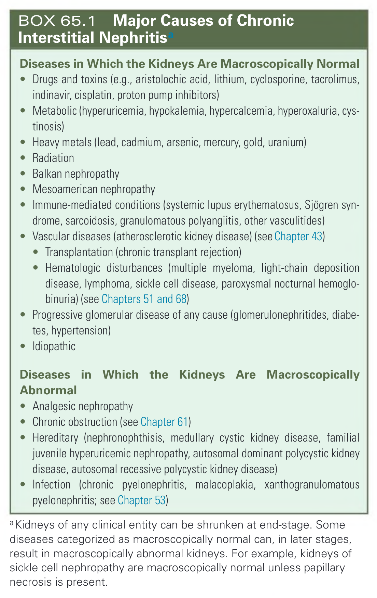

#### Box Text

```markdown
**Diseases in Which the Kidneys Are Macroscopically Normal**
*   Drugs and toxins (e.g., aristolochic acid, lithium, cyclosporine, tacrolimus, indinavir, cisplatin, proton pump inhibitors)
*   Metabolic (hyperuricemia, hypokalemia, hypercalcemia, hyperoxaluria, cystinosis)
*   Heavy metals (lead, cadmium, arsenic, mercury, gold, uranium)
*   Radiation
*   Balkan nephropathy
*   Mesoamerican nephropathy
*   Immune-mediated conditions (systemic lupus erythematosus, Sjögren syndrome, sarcoidosis, granulomatous polyangiitis, other vasculitides)
*   Vascular diseases (atherosclerotic kidney disease) (see Chapter 43)
*   Transplantation (chronic transplant rejection)
*   Hematologic disturbances (multiple myeloma, light-chain deposition disease, lymphoma, sickle cell disease, paroxysmal nocturnal hemoglobinuria) (see Chapters 51 and 68)
*   Progressive glomerular disease of any cause (glomerulonephritides, diabetes, hypertension)
*   Idiopathic

**Diseases in Which the Kidneys Are Macroscopically Abnormal**
*   Analgesic nephropathy
*   Chronic obstruction (see Chapter 61)
*   Hereditary (nephronophthisis, medullary cystic kidney disease, familial juvenile hyperuricemic nephropathy, autosomal dominant polycystic kidney disease, autosomal recessive polycystic kidney disease)
*   Infection (chronic pyelonephritis, malacoplakia, xanthogranulomatous pyelonephritis; see Chapter 53)

a Kidneys of any clinical entity can be shrunken at end-stage. Some diseases categorized as macroscopically normal can, in later stages, result in macroscopically abnormal kidneys. For example, kidneys of sickle cell nephropathy are macroscopically normal unless papillary necrosis is present.
```

BOX 65.1 Major Causes of Chronic Interstitial Nephritisa

---

### Box_65_2

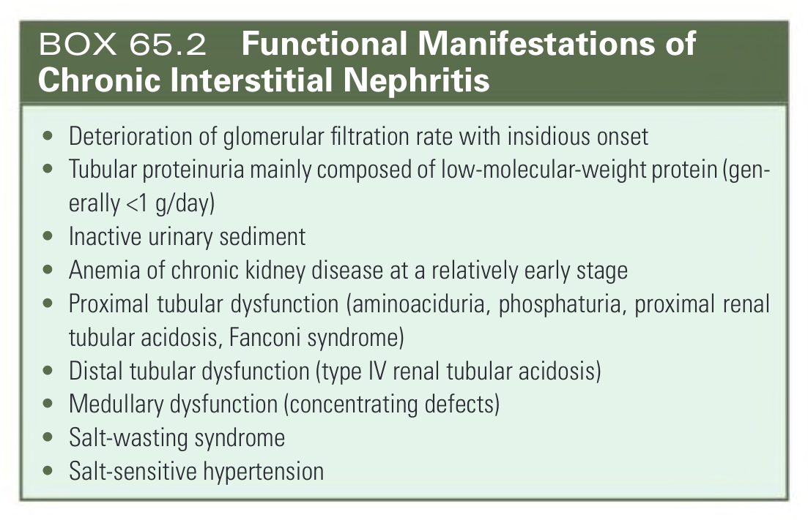

#### Box Text

```markdown
*   Deterioration of glomerular filtration rate with insidious onset
*   Tubular proteinuria mainly composed of low-molecular-weight protein (generally <1 g/day)
*   Inactive urinary sediment
*   Anemia of chronic kidney disease at a relatively early stage
*   Proximal tubular dysfunction (aminoaciduria, phosphaturia, proximal renal tubular acidosis, Fanconi syndrome)
*   Distal tubular dysfunction (type IV renal tubular acidosis)
*   Medullary dysfunction (concentrating defects)
*   Salt-wasting syndrome
*   Salt-sensitive hypertension
```

BOX 65.2 Functional Manifestations of Chronic Interstitial Nephritis

---
